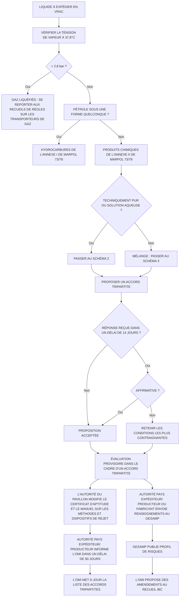

# MARPOL
SUR CD-ROM Version 2.1

OMI

<!-- layout: bnrx, uilt -->

ORGANISATION MARITIME INTERNATIONALE

## Table des Matières

**Page 1** Convention MARPOL, Portocoles, ANNEXE I: Règles 1-9
**Page 2** ANNEXE I: Règles 10-20
**Page 3** ANNEXE I: Règles 21-26, Appendices I - III, Interprétations uniformes de l'Annexe I et Appendices 1-3 des interprétations uniformes
**Page 4** ANNEXE I: Appendices 4-9 des interprétations uniformes
ANNEXE II: Règles 1-11
**Page 5** ANNEXE II: Règles 12-16, Appendices I - V, Texte des interprétations uniformes de l'Annexe II et Appendice aux interprétations uniformes, Normes relatives aux méthodes et dispositifs de rejet de substances liquides nocives (normes prescrites par l’Annexe II) - Chapitre 1
**Page 6** Normes relatives aux méthodes et dispositifs de rejet de substances liquides nocives (normes prescrites par l’Annexe II) - Chapitre 2 - 12 et Appendices A - D
**Page 7** ANNEXE III
ANNEXE IV
**Page 8** ANNEXE V
ANNEXE VI: Règles 1-9
**Page 9** ANNEXE VI: Règles 10-19 et Appendices I -V
Renseignements supplémentaires
**Page 10** Renseignements supplémentaires

# MARPOL 73/78

## Édition récapitulative de 2002

Articles, Protocoles, Annexes et interprétations uniformes
de la Convention internationale de 1973
pour la prévention de la pollution par les navires,
telle que modifiée par le Protocole de 1978 y relatif


OMI
Londres, 2002

Publié par
L’ORGANISATION MARITIME INTERNATIONALE
4 Albert Embankment, Londres SE1 7SR

Première édition récapitulative, 1991
Deuxième édition récapitulative, 1997
Troisième édition récapitulative, 2002

Imprimé au Royaume-Uni par Bookcraft (Bath) Ltd.

2 4 6 8 10 9 7 5 3 1

ISBN 92-801-2318-1

<table>
    <tr>
        <th>PUBLICATION DE L’OMI</th>
    </tr>
    <tr>
        <td>Numéro de vente : IB521F</td>
    </tr>
</table>
Copyright © OMI 2002

*Tous droits réservés.*
*Il est interdit de reproduire, de stocker dans un système de recherche de données ou de transmettre sous quelque forme ou par quelque moyen que ce soit, électronique, électrostatique, mécanique, enregistrement magnétique, photocopie ou autre, un passage quelconque de la présente publication, aux fins de vente, sans avoir obtenu au préalable l’autorisation écrite de l’Organisation maritime internationale.*

# Introduction

La Convention internationale de 1973 pour la prévention de la pollution par les navires a été adoptée par la Conférence internationale sur la pollution des mers convoquée par l’OMI du 8 octobre au 2 novembre 1973. Les Protocoles I (Dispositions concernant l’envoi de rapports sur les événements entraînant ou pouvant entraîner le rejet de substances nuisibles) et Protocole II (Arbitrage) ont été adoptés lors de la même conférence. La Convention a été modifiée par la suite par le Protocole de 1978 y relatif adopté par la Conférence internationale sur la sécurité des navires-citernes et la prévention de la pollution (Conférence TSPP) convoquée par l’OMI du 6 au 17 février 1978. La Convention, telle que modifiée par le Protocole de 1978, est connue sour le nom de Convention internationale de 1973 pour la prévention de la pollution par les navires, telle que modifiée par le Protocole de 1978 y relatif ou, en abrégé, MARPOL 73/78. Les règles portant sur les diverses sources de pollution par les navires se trouvent dans les cinq Annexes de la Convention. La Convention a également été modifiée par le Protocole de 1997, par lequel une sixième annexe a été adoptée ; ce Protocole n’a toutefois pas encore été accepté par le nombre requis d’États pour pouvoir entrer en vigueur.

Depuis sa création en 1974, le Comité de la protection du milieu marin (MEPC) a étudié diverses dispositions de MARPOL 73/78 qui appelaient des éclaircissements ou dont la mise en oeuvre posait des problèmes. Afin de lever les ambiguïtés et de résoudre les problèmes d’une manière uniforme, le MEPC a décidé qu’il serait souhaitable de mettre au point des interprétations uniformes de MARPOL 73/78 et a reconnu que, dans certains cas, il fallait modifier certaines des règles ou en prévoir de nouvelles afin de réduire encore davantage la pollution liée à l’exploitation des navires et celle causée accidentellement par les navires. Ces mesures prises par le MEPC ont abouti à l’élaboration d’un certain nombre d’interprétations uniformes de la Convention et d’amendements.

La présente publication a pour objet de faciliter la consultation des dispositions et interprétations uniformes mises à jour des articles, des Protocoles et des cinq Annexes de MARPOL 73/78. Elle comprend tous les amendements adoptés par le MEPC qui sont en vigueur, jusqu’aux amendements de 2000 (tels qu’adoptés par la résolution MEPC.89(45)) compris. Le Secrétariat tient à préciser qu’il n’a pas l’intention d’apporter des modifications de forme, ni d’autres

iii

# Introduction

modifications, aux textes faisant foi. A des fins juridiques, on devrait toujours consulter les textes de MARPOL 73/78 qui font foi. Toutefois, on trouvera dans la présente publication les amendements à la règle 13G de l’Annexe I et au Supplément du Certificat IOPP (tels qu’adoptés le 11 mai 2001 par la résolution MEPC.95(46). S’ils sont acceptés à la date d’acceptation tacite fixée au 1er mars 2002, ces portants amendements entreront en vigueur le 1er septembre 2002. A la date de publication de la présente édition récapitulative, les conditions d’entrée en vigueur de ces amendements n’avaient pas encore été pliées. On a pensé cependant que ces amendements pourraient entrer en vigueur avant la prochaine révision de la présente édition récapitulative et c’est pourquoi le texte de la résolution MEPC.95(46) est reproduit dans la section intitulée «Renseignements supplémentaires» (rubrique 7).

Un texte connexe (Système d’évaluation de l’état du navire) adopté par la résolution MEPC.94(46) figure dans la ˆme section (rubrique 8). Outre l’inclusion des amendements pertinents dans le texte du cole I et des Annexes I à V de MARPOL 73/78, le Secrétariat a mis à jour l’édition récapitulative de 1997 en y incorporant le texte du protocole de 1997 et celui de l’Annexe VI. Une interprétation uniforme des prescriptions relatives au chargement en équilibre hydrostatique (règle 13G de l’Annexe I), telle qu’approuvée par le MEPC, a également été ajoutée aux appendices des interprétations uniformes de l’Annexe I.

La résolution MEPC.88(44) relative à l’adoption d’une Annexe IV révisée ainsi que le texte de cette annexe sont reproduits aux rubriques 5 et 6 de la section intitulée «Renseignements supplémentaires». Afin de présenter les renseignements de façon cohérente, il a été décidé de ne pas inclure dans l’édition récapitulative de 2002 les directives qui ne sont pas obligatoires en vertu de l’Annexe dans laquelle elles sont citées et qui figurent déjà dans une autre publication de l’OMI.

# Protocole I – Dispositions concernant l’envoi de rapports sur les événements entraînant ou pouvant entraîner le rejet de substances nuisibles

Ce Protocole a été adopté le 2 novembre 1973 et modifié ultérieurement par :

- les amendements de 1985 (résolution MEPC.21(22)), le texte révisé étant entre en vigueur le 6 avril 1987; et
- les amendements de 1996 (résolution MEPC.68(38)) à cle II(1), lesquels sont entrés en vigueur le 1er janvier 1998.

Introduction

## Annexe I – Règles relatives à la prévention de la pollution par les hydrocarbures

L’Annexe I est entrée en vigueur le 2 octobre 1983 et, à l’égard des Parties à MARPOL 73/78, a remplacé la Convention internationale pour la prévention de la pollution des eaux de la mer par les hydrocarbures, 1954, telle que modifiée en 1962 et 1969, qui était alors en vigueur. Un certain nombre d’amendements à l’Annexe I ont été adoptés par le MEPC et sont entrés en vigueur comme indiqué ci-après :

– les amendements de 1984 (résolution MEPC.14(20)) concernant la réglementation des rejets d’hydrocarbures, la conservation des hydrocarbures à bord, les installations de pompage, de tuyautages et de rejet à bord des pétroliers, et le compartimentage et la stabilité, qui sont entrés en vigueur le 7 janvier 1986;

– les amendements de 1987 (résolution MEPC.29(25)) concernant la désignation du golfe d’Aden comme zone spéciale, qui sont entrés en vigueur le 1er avril 1989;

– les amendements de 1990 (résolution MEPC.39(29)) concernant la mise en place du système harmonisé de visites et de délivrance de certificats, qui sont entrés en vigueur le 3 février 2000;

– les amendements de 1990 (résolution MEPC.42(30) concernant la désignation de la zone de l’Antarctique comme zone spéciale, qui sont entrés en vigueur le 17 mars 1992;

– les amendements de 1991 (résolution MEPC.47(31) concernant la nouvelle règle 26 («Plan de lutte de bord contre la pollution par les hydrocarbures») et d’autres amendements à l’Annexe I, qui sont entrés en vigueur le 4 avril 1993;

– les amendements de 1992 (résolution MEPC.51(32) concernant les critères de rejet de l’Annexe I, qui sont entrés en vigueur le 6 juillet 1993;

– les amendements de 1992 (résolution MEPC.52(32) concernant les nouvelles règles 13F et 13G et les amendements connexes à l’Annexe I, qui sont entrés en vigueur le 6 juillet 1993;

– les amendements de 1994 (résolution 1 adoptée le 2 novembre 1994 par la Conférence des Parties à MARPOL 73/78) concernant le contrôle des normes d’exploitation par l’État du port, qui sont entrés en vigueur le 3 mars 1996;

v

*Introduction*

– les amendements de 1997 (résolution MEPC.75(40)) concernant la désignation des eaux de l’Europe du Nord-Ouest comme zone spéciale et la nouvelle règle 25A, qui sont entrés en vigueur le 1er février 1999;

– les amendements de 1999 (résolution MEPC.78(43)) aux règles 13G et 26 et au modèle de Certificat IOPP, qui sont entrés en vigueur le 1er janvier 2001; et

– les amendements de 2001 (résolution MEPC.95(48)) à la règle 13G; s’ils sont acceptés le 1er mars 2002, ces amendements entreront en vigueur le 1er septembre 2002.

**Annexe II – Règles relatives à la prévention de la pollution par les substances liquides nocives transportées en vrac**

Afin d’en faciliter la mise en oeuvre, le texte initial de l’Annexe II a fait l’objet d’amendements en 1985, par la résolution MEPC.16(22), en ce qui concerne les prescriptions relatives aux installations de pompage et de tuyautage et aux mesures de contrôle. À sa vingt-deuxième session, le MEPC a en outre décidé, conformément à l’article II du Protocole de 1978, que les Parties seraient «liées par les dispositions de l’Annexe II de MARPOL 73/78, telles que modifiées, à compter du 6 avril 1987» (résolution MEPC.17(22)). D’autres amendements ont été adoptés, par la suite, par le MEPC et sont entrés en vigueur comme indiqué ci-après :

– les amendements de 1989 (résolution MEPC.34(27)) mettant à jour les appendices II et III afin de les rendre compatibles avec les chapitre 17/VI et 18/VII des Recueils IBC et BCH respectivement, qui sont entrés en vigueur le 13 octobre 1990;

– les amendements de 1990 (résolution MEPC.39(29)) concernant la mise en place du système harmonisé de visites et de délivrance des certificats, qui sont entrés en vigueur le 3 février 2000;

– les amendements de 1992 (résolution MEPC.57(33)) concernant la désignation de la zone de l’Antarctique comme zone spéciale et les listes de substances liquides figurant à l’Annexe II, qui sont entrés en vigueur le 1er juillet 1994;

– les amendements de 1994 (résolution 1 adoptée le 2 novembre 1994 par la Conférence des Parties à MARPOL 73/78) concernant le contrôle des normes, d’exploitation par l’État du port, qui sont entrés en vigueur le 3 mars 1996; et

– les amendements de 1999 (résolution MEPC.78(43)) concernant la nouvelle règle 16, qui sont entrés en vigueur le 1er janvier 2001.

vi

Introduction

## Annexe III – Règles relatives à la prévention de la pollution par les substances nuisibles transportées par mer en colis

L’Annexe III est entrée en vigueur le 1er juillet 1992. Cependant, le MEPC avait décidé, bien avant son entrée en vigueur et avec l’accord du Comité de la sécurité maritime (MSC), qu’elle serait appliquée par le biais du Code IMDG. Le Code IMDG avait fait l’objet d’amendements portant sur la pollution des mers élaborés par le MSC (Amendement 25-89), qui ont pris effet le 1er janvier 1991. D’autres amendements à l’Annexe III ont été adoptés par la suite et sont entrés en vigueur comme indiqué ci-après :

– les amendements de 1992 (résolution MEPC.58(33)), qui visaient à remanier entièrement l’Annexe III en clarifiant les prescriptions de la version initiale sans les modifier quant au fond, et à insérer des renvois au Code IMDG; ces amendements sont entrés en vigueur le 28 février 1994;

– les amendements de 1994 (résolution 2 adoptée le 2 novembre 1994 par la Conférence des Parties à MARPOL 73/78 concernant le contrôle des normes d’exploitation par l’État du port, qui sont entrés en vigueur le 3 mars 1996; et

– les amendements de 2000 (MEPC.84(44)) visant à supprimer une disposition relative à l’altération des aliments d’origine marine, qui sont entrés en vigueur le 1er janvier 2002.

## Annexe IV – Règles relatives à la prévention de la pollution par les eaux usées des navires

L’Annexe IV n’est pas encore en vigueur. Au 21 septembre 2001, elle avait été ratifiée par 81 États possédant des flottes marchandes représentant au total 46 % environ du tonnage brut de la flotte mondiale des navires de commerce. Il faudra donc que d’autres États représentant 4 % du tonnage brut de la flotte mondiale des navires de commerce la ratifient pour que les conditions d’entrée en vigueur prévues à l’article 16 2) f) de la Convention soient remplies. En mars 2000, le MEPC a adopté la résolution MEPC.88(44) aux termes de laquelle le texte de l’Annexe IV révisée sera examiné pour adoption au moment où les conditions d’entrée en vigueur de l’Annexe IV existante auront été remplies; ce texte a été adopté en même temps que la résolution, la résolution et le texte révisé sont reproduits aux rubriques 5 et 6 de la section intitulée «Renseignements supplémentaires».

vii

*Introduction*

## Annexe V – Règles relatives à la prévention de la pollution par les ordures des navires

L’Annexe V est entrée en vigueur le 31 décembre 1988. Elle a fait, par la suite, l’objet d’amendements adoptés par le MEPC, qui sont entrés en vigueur comme indiqué ci-apès :

- les amendements de 1989 (résolution MEPC.36(28)) concernant la désignation de la mer du Nord comme zone spéciale et la modification de la règle 6 sur les exceptions, qui sont entrés en vigueur le 18 février 1991;

- les amendements de 1990 (résolution MEPC.42(30)) concernant la désignation de la zone de l’Antarctique comme zone spéciale, qui sont entrés en vigueur le 17 mars 1992;

- les amendements de 1991 (résolution MEPC.48(31)) concernant la désignation de la région des Caraïbes comme zone spéciale, qui sont entrés en vigueur le 4 avril 1993;

- les amendements de 1994 (résolution 3 adoptée le 2 novembre 1994 par la Conférence des Parties à MARPOL 73/78) concernant le contrôle des normes d’exploitation par l’État du port, qui sont entrés en vigueur le 3 mars 1996;

- les amendements de 1995 (résolution MEPC.65(37)) concernant la règle 2 et l’adjonction d’une nouvelle règle 9, qui sont entrés en vigueur le 1er juillet 1997; et

- les amendements de 2000 (résolution MEPC.89(45)) aux règles 1, 3, 5 et 9 et au Modèle de registre des ordures, qui entreront en vigueur le 1er mars 2002.

## Annexe VI – Règles relatives à la prévention de la pollution de l’atmosphère par les navires

L’Annexe VI figure en appendice du Protocole de 1997 modifiant la Convention internationale de 1973 pour la prévention de la pollution par les navires, telle que modifiée par le Protocole de 1978 y relatif ; ce Protocole a été adopté par la Conférence internationale des Parties à MARPOL 73/78, en septembre 1997. Conformément à l’article 6, l’entrée en vigueur du Protocole interviendra douze mois après la date à laquelle au moins quinze États dont les flottes marchandes représentent au total au moins 50 % du tonnage brut de la flotte mondiale des navires de commerce auront indiqué leur consentement à être liés par cet instrument. Au 21 septembre 2001, il y avait trois États contractants.

viii

# Table des matières

Page

Convention internationale de 1973 pour la prévention
de la pollution par les navires . . . . . . . . . . . . . . . . . . . . . . . . . . . . . . . . . . . . . . . . . . . . . . . . . . . . . . . . . . . . . . . . . . . . . . . . . . . . . . . . . . . . . . . . . . . . . . . . . . . . . . . . . . . . . . . . . . . . . . . . . . . . . . . . . . . . . . . . . . . . . . . . . . . . . . . . . . . . . . . . . . . . . . . . . . . . ....... 3

Protocole de 1978 relatif à la Convention internationale
de 1973 pour la prévention de la pollution par les navires . . . . . . . . . . . . . . . . . . . . . . . . . . . . . . . . . . . . . . . . . . . . . . . . . . . . . . . . . . . . . . . . . . . . . . . . . . . . . . . . . . . . . . . . . . . . . . . . . . . . . . . . . . . . . . . . . . . . . . . . . . . . . . . . . . . . . . . . . . . . . . . . . . . . . . . . . . . . . . . . . . . . . . . . . . . . . . . . . . . . . . . . . . . . . . . . . . . . ....... 19

Protocole I : *Dispositions concernant l’envoi de rapports*
*sur les événements entraînant ou pouvant entraîner le rejet*
*de substances nuisibles*. . . . . . . . . . . . . . . . . . . . . . . . . . . . . . . . . . . . . . . . . . . . . . . . . . . . . . . . . . . . . . . . . . . . . . . . . . . . . . . . . . . . . . . . . . . . . . . . . . . . . . . . . . . . . . . . . . . . . . . . . . . . . . . . . . . . . . . . . . . . . . . . . . . . . . . . . . . . . . . . . . . . . . . . . . . . . . . . . . . . .......

*Introduction*

Page

Règle 10 Méthodes de prévention de la pollution par les hydrocarbures due aux navires exploités dans les zones spéciales . . . . . . . . . . . . . . . . . . . . . . . . . . . . . . . . . . . . . . . . . . . . . . . . . . . . . . . . . . . . . . . . . . . . . . . . . . . . . . . . . . . . . . . . . . . . . . . . . . . . . . . . . . . . . . . . . . . . . . . . . . . . . . . . . . . . . . . . . . . . . . . . . . . . . . . . . . . ....... 61

Règle 11 Exceptions . . . . . . . . . . . . . . . . . . . . . . . . . . . . . . . . . . . . . . . . . . . . . . . . . . . . . . . . . . . . . . . . . . . . . . . . . . . . . . . . . . . . . . . . . . . . . . . . . . . . . . . . . . . . . . . . . ....... 66

Règle 12 Installations de réception. . . . . . . . . . . . . . . . . . . . . . . . . . . . . . . . . . . . . . . . . . . . . . . . . . . . . . . . . . . . . . . . . . . . . . . . . . . . . . . . . . . . . . . . . . . . . . . . . . . . . . . . . . . .......

Table des matières

Page

Règle 21 Dispositions spéciales applicables aux plates-formes de forage et autres plates-formes . . . . . . . . . . . . . . . . . . . . . . . . . . . . . . . . . . . . . . . . . . . . . . . . . . . . . . . . . . . . . . . . . . . . . . . . . . . . . . . . . . . . . . . . . . . . . . . . . . . . . . . . . . . . . . . . . . . . . . . . . . . . . . . . . . . . . . . . . . . . . . . . . . . . . . . . . . . . . . . . . . . . ....... 100

Chapitre III – *Prescriptions visant à réduire la pollution due aux hydrocarbures déversés par les pétroliers en cas d’avarie de bordé ou de fond*

Règle 22 Hypothèses relatives aux avaries . . . . . . . . . . . . . . . . . . . . . . . . . . . . . . . . . . . . . . . . . . . . . . . . . . . . . . . . . . . . . . . . . . . . . . . . . . . . . . . . . . . . . . . . . . . . . . . . . . . . . . . . . . . . . . . . . . . . . . . . . . . . . . . . . . . . . . . . . . . . . . . . . . . . . . . . . . . ....... 101
Règle 23 Fuites hypothétiques d’hydrocarbures . . . . . . . . . . . . . . . . . . . . . . . . . . . . . . . . . . . . . . . . . . . . . . . . . . . . . . . . . . . . . . . . . . . . . . . . . . . . . . . . . . . . . . . . . . . . . . . . . . . . .......

*Table des matières*

Page

Appendice 4 Raccord de la conduite de faible diamètre à la soupape du collecteur . . . . . . . . . . . . . . . . . . . . . . . . . . . . . . . . . . . . . . . . . . . . . . . . . . . . . . . . . . . . . . . . . . . . . . . . . . . . . . . . . . . . . . . . . . . . . . . . . . . . . . . . . . . . . . . . . . . . . . . . . . . . . . . . . . . . . . . . . . . . . . . . . . . . . . . . . . . . . . . . . . . . . . . . . . . . ....... 197

Appendice 5 Spécifications pour la conception, l’installation et l’exploitation d’un dispositif de dérivation d’une partie de l’effluent en vue d’une surveillance des rejets par-dessus bord . . . . . . . . . . . . . . . . . . . . . . . . . . . . . . . . . . . . . . . . . . . . . . . . . . . . . . . . . . . . . . . . . . . . . . . . . . . . . . . . . . . . . . . . . . . . . . . . . . . . . . . . . . . . . . . . . . . . . . . . . . . . . . . . . . . . . . . . . . . . . . . . . . . . . . . . . . . ....... 198

Appendice 6 Rejets des plates-formes au large . . . . . . . . . . . . . . . . . . . . . . . . . . . . . . . . . . . . . . . . . . . . . . . . . . . . . . . . . . . . . . . . . . . . . . . . . . . . . . . . . . . . . . . . . . . . . . . . . . . . .......

Table des matières

Page

Règle 12 Durée et validité du certificat. . . . . . . . . . . . . . . . . . . . . . . . . . . . . . . . . . . . . . . . . . . . . . . . . . . . . . . . . . . . . . . . . . . . . . . . . . . . . . . . . . . . . . . . . . . . . . . . . . . . . . . . . . . . . . . . . . . . . . . . . . . . . . . . . . . . . . . . . . . . . . . . . . . . . . . . . . . . . . . . . . . . . . . . . . . . . . . . . . . . . . . . . . . . . . . . . . . ....... 286

Règle 12A Visite des navires-citernes pour produits chimiques et délivrance des certificats. . . . . . . . . . . . . . . . . . . . . . . . . . . . . . . . . . . . . . . . . . . . . . . . . . . . . . . . . . . . . . . . . . . . . . . . . . . . . . . . . . . . . . . . . . . . . . . . . . . . . . . . . . . . . . . . . . . . . . . . . . . . . . . . . . . . . . . . . . . . . . . . . . . . . . . . . . . . . . . . . . . . . . . . . . . . . . . . . . . . . . . . . . . . . . . . . . . . . . . . . . . . . . . . ....... 288

Règle 13 Dispositions visant à réduire la pollution accidentelle. . . . . . . . . . . . . . . . . . . . . . . . . . . . . . . . . . . . . . . . . . . . . . . . . . . . . . . . . . . . . . . . . . . . . . . . . . . . . . . . . . . . . . . . . . . . . . . . . . . . . . . . . . . . . . . . . . . . . . . . . . . . . . . . . . . . . . . . . . . . . . . . . . . . . . . . . . . . . . . . . . . . . . . . . . . . . . . . . . . . . . . . . . . . . . . . . . . . . . . . . . . . . . . . . . . . . . . . . . . . .......

*Table des matières*

Page

Chapitre 2 Élaboration du manuel sur les méthodes et dispositifs de rejet. . . . . . . . . . . . . . . . . . . . . . . . . . . . . . . . . . . . . . . . . . . . . . . . . . . . . . . . . . . . . . . . . . . . . . . . . . . . . . . . . . . . . . . . . . . . . . . . . . . . . . . . . . . . . . . . . . . . . . . . . . . . . . . . . . . . . . . . . . . . . . . . . . . . . . . . . . . . . . . . . . . . . . . . . . . . . . . . . ....... 328

Chapitre 3 Normes applicables à l'équipement et à la construction des navires neufs . . . . . . . . . . . . . . . . . . . . . . . . . . . . . . . . . . . . . . . . . . . . . . . . . . . . . . . . . . . . . . . . . . . . . . . . . . . . . . . . . . . . . . . . . . . . . . . . . . . . . . . . . . . . . . . . . . . . . . . . . . . . . . . . . . . . . . . . . . . . . . . . . . . . . . . . . . . . . . . . . . . . . . . . . . . . . . . . . . . . . . . . . . . . . . . . . . . . . . . . . . . . . . . . . . ....... 330

Chapitre 4 Normes d'exploitation applicables aux navires neufs transportant des substances de la catégorie A . . . . . . . . . . . . . . . . . . . . . . . . . . . . . . . . . . . . . . . . . . . . . . . . . . . . . . . . . . . . . . . . . . . . . . . . . . . . . . . . . . . . . . . . . . . . . . . . . . . . . . . . . . . . . . . . . . . . . . . . . . . . . . . . . . . . . . . . . . . . . . . . . . . . . . . . . . . . . . . . . . . . . . . . . . . . . . . . . . . . . . . . . . . . . . . . . . . . .......

Table des matières

Page

Annexe III de MARPOL 73/78 : Règles relatives à la prévention de la pollution par les substances nuisibles transportées par mer en colis

*   **Règle 1** Champ d’application . . . . . . . . . . . . . . . . . . . . . . . . . . . . . . . . . . . . . . . . . . . . . . . . . . . . . . . . . . . . . . . . . . . . . . . . . . . . . . . . . . . . . . . . . . . . . . . . . . . . . . . . . . . . . . . . . . . . ....... 389
*   **Règle 2** Emballage . . . . . . . . . . . . . . . . . . . . . . . . . . . . . . . . . . . . . . . . . . . . . . . . . . . . . . . . . . . . . . . . . . . . . . . . . . . . . . . . . . . . . . . . . . . . . . . . . . . . . . . . . . . . . . . . ....... 390
*   **Règle 3** Marquage et étiquetage . . . . . . . . . . . . . . . . . . . . . . . . . . . . . . . . . . . . . . . . . . . . . . . . . . . . . . . . . . . . . . . . . . . . . . . . . . . . . . . . . . . . . . . . . . . . . . . . . . . . . . . .......

*Table des matières*

Page

**Annexe V de MARPOL 73/78 : Règles relatives à la prévention de la pollution par les ordures des navires**

Règle 1 Définitions . . . . . . . . . . . . . . . . . . . . . . . . . . . . . . . . . . . . . . . . . . . . . . . . . . . . . . . . . . . . . . . . . . . . . . . . . . . . . . . . . . . . . . . . . . . . . . . . . . . . . . . . . . . . . . . . . . . . . . . . . . . . . . . . . . . . . . . . ....... 411
Règle 2 Champ d’application . . . . . . . . . . . . . . . . . . . . . . . . . . . . . . . . . . . . . . . . . . . . . . . . . . . . . . . . . . . . . . . . . . . . . . . . . . . . . . . . . . . . . . . . . . . . . . . . . . . . . . . . . . . . . . . . ....... 412
Règle 3 Évacuation des ordures hors des zones spéciales . . . . . . . . . . . . . . . . . . . . . . . . . . . . . . . . . . . . . . . . . . . . . . . . . . . . . . . . . . . . . . . . . . . . . . . . . . . . . . . . . . . . . . . . . . . . . . . . . . . . . . . . . . . . . . . . . . . . . . . . . . . . . . . . . . . . . . . . . . . . . . . . . . . . . . . . . . . . . . . . . . . . . . . . . . . . . . . . . . . . . . . . . . . . . . . . . . . . . . . . . . . . . . . . . . . . . . . . . . . . . . . . .......

Table des matières

Page

Règle 10 Contrôle des normes d’exploitation par l’État du port . . . . . . . . . . . . . . . . . . . . . . . . . . . . . . . . . . . . . . . . . . . . . . . . . . . . . . . . . . . . . . . . . . . . . . . . . . . . . . . . . . . . . . . . . . . . . . . . . . . . . . . . . . . . . . . . . . . . . . . . . . . . . . . . . . . . . . . . . . . . . . . . . . . . . . . . . . . . . . . . . . . . . . . . . . . . . . . . . . . . . . . ....... 432

Règle 11 Recherche des infractions et mise en application des dispositions . . . . . . . . . . . . . . . . . . . . . . . . . . . . . . . . . . . . . . . . . . . . . . . . . . . . . . . . . . . . . . . . . . . . . . . . . . . . . . . . . . . . . . . . . . . . . . . . . . . . . . . . . . . . . . . . . . . . . . . . . . . . . . . . . . . . . . . . . . . . . . . . . . . . . . . . . . . . . . . . . . . . . . . . . . . . . . . . . . . . . . . . . . . . . . . . . . . . . . . . . . . . . . . . . . . . . . . ....... 433

Chapitre III – *Prescriptions relatives au contrôle des émissions provenant des navires*

Règle 12 Substances qui appauvrissent la couche d’ozone . . . . . . . . . . . . . . . . . . . . . . . . . . . . . . . . . . . . . . . . . . . . . . . . . . . . . . . . . . . . . . . . . . . . . . . . . . . . . . . . . . . . . . . . . . . . . . . . . . . . . . . . . . . . . . . . . . . . . . . . . . . . . . . . . . . . . . . . . . . . . . . . . . . . . . . . . . . . . . . . . . . . . . . . . . . . . . . . . . . . .......

## Table des matières

Page

4 État de MARPOL 73/78, des amendements et des instruments connexes . . . . . . . . . . . . . . . . . . . . . . . . . . . . . . . . . . . . . . . . . . . . . . . . . . . . . . . . . . . . . . . . . . . . . . . . . . . . . . . . . . . . . . . . . . . . . . . . . . . . . . . . . . . . . . . . . . . . . . . . . . . . . . . . . . . . . . . . . . . . . . . . . . . . . . . . . . . . . . . . . . . . . . . . . . . . . . . . . . . . ....... 483

5 Application de l’Annexe IV de MARPOL 73/78 . . . . . . . . . . . . . . . . . . . . . . . . . . . . . . . . . . . . . . . . . . . . . . . . . . . . . . . . . . . . . . . . . . . . . . . . . . . . . . . . . . . . . . . . . . . . . . . . . . . . . . ....... 487

6 Texte de l’Annexe IV révisée de MARPOL 73/78 . . . . . . . . . . . . . . . . . . . . . . . . . . . . . . . . . . . . . . . . . . . . . . . . . . . . . . . . . . . . . . . . . . . . . . . . . . . . . . . . . . . . . . . . . . . . . . . . . . . . . .......

# Convention internationale de 1973 pour la prévention de la pollution par les navires

MARPOL 73

# Convention internationale de 1973 pour la prévention de la pollution par les navires

LES PARTIES À LA CONVENTION,

CONSCIENTES de la nécessité de protéger l’environnement en général et le milieu marin en particulier,

RECONNAISSANT que les déversements délibérés, par négligence ou accidentels, d’hydrocarbures et autres substances nuisibles par les navires constituent une source grave de pollution,

RECONNAISSANT ÉGALEMENT l’importance de la Convention internationale de 1954 pour la prévention de la pollution des eaux de la mer par les hydrocarbures, premier instrument multilatéral à avoir eu pour objectif essentiel la protection de l’environnement, et sensibles à la contribution marquante que cette Convention a apportée à la préservation des mers et des littoraux contre la pollution,

DÉSIREUSES de mettre fin à la pollution intentionnelle du milieu marin par les hydrocarbures et autres substances nuisibles et de réduire au maximum les rejets accidentels de ce type de substances,

ESTIMANT que le meilleur moyen de réaliser cet objectif est d’établir des règles de portée universelle et qui ne se limitent pas à la pollution par les hydrocarbures,

SONT CONVENUES DE CE QUI SUIT :

## Article premier

*Obligations générales découlant de la Convention*

1) Les Parties à la Convention s’engagent à donner effet aux dispositions de la présente Convention, ainsi qu’aux dispositions de celles des Annexes par lesquelles elles sont liées, afin de prévenir la pollution du milieu marin par le rejet de substances nuisibles ou d’effluents contenant de telles substances en infraction aux dispositions de la Convention.

2) Sauf disposition expresse contraire, toute référence à la présente Convention constitue en même temps une référence à ses Protocoles et aux Annexes.

3

MARPOL 73

## Article 2
*Définitions*

Aux fins de la présente Convention, sauf disposition expresse contraire :

1) Règles désigne les règles figurant en annexe à la présente Convention.

2) *Substance nuisible* désigne toute substance dont l'introduction dans la mer est susceptible de mettre en danger la santé de l'homme, de nuire aux ressources biologiques, à la faune et à la flore marines, de porter atteinte à l'agrément des sites ou de gêner toute autre utilisation légitime de la mer, et notamment toute substance soumise à un contrôle en vertu de la présente Convention.

3) a) Rejet, lorsqu'il se rapporte aux substances nuisibles ou aux effluents contenant de telles substances, désigne tout déversement provenant d'un navire, quelle qu'en soit la cause, et comprend tout écoulement, évacuation, épanchement, fuite, déchargement par pompage, émanation ou vidange.

b) Rejet ne couvre pas :
i) l'immersion au sens de la Convention sur la prévention de la pollution marine causée par l'immersion de déchets et autres matières faite à Londres le 13 novembre 1972; ni
ii) les déversements de substances nuisibles qui résultent directement de l'exploration, de l'exploitation et du traitement connexe au large des côtes des ressources minérales du fond des mers et des océans; ni
iii) les déversements de substances nuisibles effectués aux fins de recherches scientifiques légitimes visant à réduire ou à combattre la pollution.

4) Navire désigne un bâtiment exploité en milieu marin de quelque type que ce soit et englobe les hydroptères, les aéroglisseurs, les engins submersibles, les engins flottants et les plates-formes fixes ou flottantes.

5) Autorité désigne le gouvernement de l'État qui exerce son autorité sur le navire. Dans le cas d'un navire autorisé à battre le pavillon d'un État, l'Autorité est le gouvernement de cet État. Dans le cas des plates-formes fixes ou flottantes affectées à l'exploration et à l'exploitation du fond des mers et du sous-sol adjacent aux côtes sur lesquelles l'État riverain a des droits souverains aux fins de l'exploration et de l'exploitation de leurs ressources naturelles, l'Autorité est le gouvernement de l'État riverain intéressé.

6) Événement désigne un incident qui entraîne ou est susceptible d'entraîner le rejet à la mer d'une substance nuisible ou d'un effluent contenant une telle substance.

4

Articles 2, 3, 4

MARPOL 73

7) Organisation désigne l’Organisation intergouvernementale consultative de la navigation maritime*.

## Article 3
*Champ d’application*

1) La présente Convention s’applique :

a) aux navires autorisés à battre le pavillon d’une Partie à la Convention; et

b) aux navires qui ne sont pas autorisés à battre le pavillon d’une Partie mais qui sont exploités sous l’autorité d’une telle Partie.

2) Aucune disposition du présent article ne saurait être interprétée comme portant atteinte aux droits souverains des Parties sur le fond des mers et sur le sous-sol adjacent aux côtes aux fins d’exploration et d’exploitation des ressources naturelles ou comme étendant ces droits, conformément au droit international.

3) La présente Convention ne s’applique ni aux navires de guerre ou navires de guerre auxiliaires ni aux autres navires appartenant à un État ou exploités par cet État tant que celui-ci les utilise exclusivement à des fins gouvernementales et non commerciales. Cependant, chaque Partie doit s’assurer, en prenant des mesures appropriées qui ne compromettent pas les opérations ou la capacité opérationnelle des navires de ce type lui appartenant ou exploités par elle, que ceux-ci agissent d’une manière compatible avec la présente Convention, pour autant que cela soit raisonnable dans la pratique.

## Article 4
*Infractions*

1) Toute violation des dispositions de la présente Convention est sanctionnée par la législation de l’Autorité dont dépend le navire en cause, quel que soit l’endroit où l’infraction se produit. Si l’autorité est informée d’une telle infraction et est convaincue qu’il existe des preuves suffisantes pour lui permettre d’engager des poursuites pour l’infraction présumée, elle engage ces poursuites le plus tôt possible conformément à sa législation.

2) Toute violation des dispositions de la présente Convention commise dans la juridiction d’une Partie à la Convention est sanctionnée par la législation de cette Partie. Chaque fois qu’une telle infraction se produit, la Partie doit :

a) soit engager des poursuites conformément à sa législation;

* Le nom de l’Organisation est devenu Organisation maritime internationale en vertu des amendements à la Convention portant création de l’Organisation qui sont entrés en vigueur le 22 mai 1982.

5

MARPOL 73

b) soit fournir à l’Autorité dont dépend le navire les preuves qui peuvent être en sa possession pour démontrer qu’il y a eu infraction.

3) Lorsque des informations ou des preuves relatives à une infraction à la Convention par un navire sont fournies à l’Autorité dont dépend le navire, cette Autorité informe rapidement l’État qui lui a fourni les renseignements ou les preuves et l’Organisation des mesures prises.

4) Les sanctions prévues par la législation des Parties en application du présent article doivent être, par leur rigueur, de nature à décourager les contrevenants éventuels, et d’une sévérité égale quel que soit l’endroit où l’infraction a été commise.

## Article 5
Certificats et règles spéciales concernant l’inspection du navire

1) Sous réserve des dispositions du paragraphe 2), du présent article, les Certificats délivrés sous l’autorité d’une Partie à la Convention conformément aux dispositions des règles sont acceptés par les autres Parties contractantes et considérés, à toutes les fins visées par la présente Convention, comme ayant la même validité qu’un Certificat délivré par elles-mêmes.

2) Tout navire qui est tenu de posséder un Certificat délivré conformément aux dispositions des règles est soumis, dans les ports ou les terminaux au large relevant de la juridiction d’une autre Partie, à une inspection effectuée par des fonctionnaires dûment autorisés à cet effet par ladite Partie. Toute inspection de cet ordre a pour seul objet de vérifier la présence à bord d’un Certificat en cours de validité, sauf si cette Partie a des raisons précises de penser que les caractéristiques du navire ou de son équipement diffèrent sensiblement de celles qui sont portées sur le Certificat. Dans ce cas, ou s’il n’y a pas à bord du navire de Certificat en cours de validité, l’État qui effectue l’inspection prend les mesures nécessaires pour empêcher le navire d’appareiller avant qu’il puisse le faire sans danger excessif pour le milieu marin. Toutefois, ladite Partie peut autoriser le navire à quitter le port ou le terminal au large pour se rendre au chantier de réparation approprié le plus proche.

3) Si une Partie refuse à un navire étranger l’accès d’un port ou d’un terminal au large qui relève de sa juridiction, ou si elle procède à une intervention quelconque à l’encontre de ce navire en arguant du fait que le navire n’est pas conforme aux dispositions de la présente Convention, la Partie avise immédiatement le Consul ou le représentant diplomatique de la Partie dont le navire est autorisé à battre le pavillon, ou, en cas d’impossibilité, l’Autorité dont relève le navire intéressé. Avant de signifier un tel refus et avant de procéder à une telle intervention, la Partie demande à consulter l’Autorité dont relève le navire. L’Autorité est

6

# Articles 5, 6

également avisee lorsqu’un navire ne possede pas a son bord de Certificat en cours de validite conforme aux dispositions des regles.

Les Parties appliquent aux navires des Etats qui ne sont pas Parties a la Convention les prescriptions de la presente Convention dans la mesure ou cela est necessaire pour ne pas faire beneficier ces navires de conditions plus favorables.

# Article 6

# Recherche des infractions et mise en oeuvre des dispositions de la Convention

1. Les Parties a la Convention cooperent a la recherche des infractions et a la mise en oeuvre des dispositions de la presente Convention en utilisant tous les moyens pratiques appropries de recherche et de surveillance continue du milieu ainsi que des methodes satisfaisantes de transmission des renseignements et de rassemblement des preuves.
2. Tout navire auquel la presente Convention s’applique peut être mis, dans tout port ou terminal au large d’une Partie, a l’inspection de fonctionnaires designes ou autorises par ladite Partie, en vue de verifier s’il a rejete des substances nuisibles en infraction aux dispositions des regles. Au cas ou l’inspection fait apparaıtre une infraction aux positions de la Convention, le compte rendu en est communique a l’Autorite pour que celle-ci prenne des mesures appropriees.
3. Toute Partie fournit a l’Autorite la preuve, si elle existe, que ce navire a rejete des substances nuisibles ou des effluents contenant de telles substances en infraction aux dispositions des regles. Dans toute la mesure du possible, cette infraction est portee a la connaissance du capitaine du navire par l’autorite competente de cette Partie.
4. Des reception de cette preuve, l’Autorite examine l’affaire et peut demander a l’autre Partie de lui fournir sur l’infraction des elements de fait plus complets ou plus concluants. Si l’Autorite estime que la preuve est suffisante pour lui permettre d’intenter une action, elle intente une action des que possible et conformement a sa legislation. L’Autorite informe rapidement la Partie qui lui a signale l’infraction presumee, ainsi que l’Organisation, des poursuites engagees.
5. Une partie peut inspecter tout navire, auquel la presente Convention s’applique, qui fait escale dans un port ou un terminal au large relevant de sa juridiction lorsqu’une autre Partie lui demande de proceder a cette enquête en fournissant suffisamment de preuves que le navire a rejete dans un lieu quelconque des substances nuisibles ou des fluents contenant de telles substances. Il est rendu compte de cette enquête a la Partie qui l’a demandee ainsi qu’a l’Autorite, afin que des mesures appropriees soient prises conformement aux dispositions de la presente Convention.

MARPOL 73

MARPOL 73

## Article 7

*Retards causés indûment aux navires*

1) Il convient d’éviter, dans toute la mesure du possible, que les mesures prises en application de l’article 4, 5 ou 6 de la présente Convention ne retiennent ou ne retardent indûment le navire.

2) Tout navire qui a été retenu ou retardé indûment par suite de l’application de l’article 4, 5 ou 6 de la présente Convention a droit à réparation pour les pertes ou dommages subis.

## Article 8

*Rapports sur les événements entraînant ou pouvant entraîner le rejet de substances nuisibles*

1) En cas d’événement, il est fait rapport sans retard et, dans toute la mesure du possible, conformément aux dispositions du Protocole I de la présente Convention.

2) Chaque Partie à la Convention doit :

a) prendre les dispositions nécessaires pour qu’un fonctionnaire ou un organisme compétent reçoive et analyse tous les rapports sur les événements; et

b) notifier à l’Organisation les détails complets de ces dispositions, pour diffusion aux autres Parties et États Membres de l’Organisation.

3) Chaque fois qu’une Partie reçoit un rapport en vertu des dispositions du présent article, ladite Partie le transmet sans retard à :

a) l’Autorité dont relève le navire en cause; et

b) tout autre État susceptible d’être touché par l’événement.

4) Toute Partie à la Convention fait donner à ses navires et aéronefs chargés de l’inspection des mers et aux services compétents des instructions les invitant à signaler à ses autorités tout événement mentionné au Protocole I de la présente Convention. Si elle le juge bon, elle fait également rapport à l’Organisation et à toute autre Partie intéressée.

## Article 9

*Autres traités et interprétations*

1) Lors de son entrée en vigueur, la présente Convention remplace la Convention internationale de 1954 pour la prévention de la pollution des eaux de la mer par les hydrocarbures, modifiée, à l’égard des Parties à cette Convention.

8

Articles 7, 8, 9, 10, 11

MARPOL 73

2) Aucune disposition de la présente Convention ne préjuge la codification et l’élaboration du droit de la mer par la Conférence des Nations Unies sur le droit de la mer convoquée en vertu de la résolution 2750 C(XXV) de l’Assemblée générale des Nations Unies, ni les revendications et positions juridiques présentes ou futures de tout État touchant le droit de la mer et la nature et l’étendue de la juridiction de l’État riverain et de l’État du pavillon.

3) Dans la présente Convention, le terme *juridiction* s’interprète conformément au droit international en vigueur lors de l’application ou de l’interprétation de la présente Convention.

## Article 10

*Règlement des différends*

Tout différend entre deux ou plusieurs Parties à la Convention relatif à l’interprétation ou à l’application de la présente Convention, qui n’a pu être réglé par voie de négociation entre les Parties en cause est, sauf décision contraire des Parties, soumis à l’arbitrage à la requête de l’une des Parties, dans les conditions prévues au Protocole II de la présente Convention.

## Article 11

*Communication de renseignements*

1) Les Parties à la Convention s’engagent à communiquer à l’Organisation :

a) le texte des lois, ordonnances, décrets, règlements et autres instruments promulgués sur les diverses questions qui entrent dans le champ d’application de la présente Convention;

b) la liste des organismes non gouvernementaux habilités à agir en leur nom pour tout ce qui touche à la conception, à la construction et à l’équipement des navires transportant des substances nuisibles conformément aux dispositions des règles*;

c) un nombre suffisant de modèles des certificats qu’elles délivrent en application des dispositions des règles;

d) une liste des installations de réception précisant leur emplacement, leur capacité, les installations disponibles et autres caractéristiques;

e) tous les rapports officiels ou résumés de ces rapports qui exposent les résultats de l’application de la présente Convention; et

* Le texte de cet alinéa est remplacé par celui qui figure à l’article III du Protocole de 1978.

9

MARPOL 73

MARPOL 73

f) un rapport annuel qui présente, sous une forme normalisée par l’Organisation, les statistiques relatives aux sanctions effectivement infligées pour les infractions à la présente Convention.

2) L’Organisation informe les Parties de toute communication reçue en vertu du présent article et diffuse à toutes les Parties les informations qui lui ont été communiquées, au titre des alinéas b) à f) du paragraphe 1) du présent article.

## Article 12
*Accidents survenus aux navires*

1) Chaque Autorité s’engage à effectuer une enquête au sujet de tout accident survenu à l’un quelconque de ses navires soumis aux dispositions des règles, lorsque cet accident a eu, pour le milieu marin, des conséquences néfastes très importantes.

2) Chaque Partie à la Convention s’engage à fournir à l’Organisation des renseignements sur les résultats de cette enquête lorsqu’elle estime que ceux-ci peuvent aider à déterminer les modifications qu’il serait souhaitable d’apporter à la présente Convention.

## Article 13
*Signature, ratification, acceptation, approbation et adhésion*

1) La présente Convention reste ouverte à la signature, au siège de l’Organisation, du 15 janvier 1974 au 31 décembre 1974, et reste ensuite ouverte à l’adhésion. Les États peuvent devenir Parties à la présente Convention par :

a) signature sans réserve quant à la ratification, l’acceptation ou l’approbation; ou

b) signature sous réserve de ratification, d’acceptation ou d’approbation, suivie de ratification, d’acceptation ou d’approbation; ou

c) adhésion.

2) La ratification, l’acceptation, l’approbation ou l’adhésion s’effectuent par le dépôt d’un instrument à cet effet auprès du Secrétaire général de l’Organisation.

3) Le Secrétaire général de l’Organisation informe tous les États ayant signé la présente Convention ou y ayant adhéré de toute signature ou du dépôt de tout nouvel instrument de ratification, d’acceptation, d’approbation ou d’adhésion et de la date de ce dépôt.

10

Articles 12, 13, 14, 15

MARPOL 73

## Article 14
*Annexes facultatives*

1) Un État peut, lorsqu’il signe, ratifie, accepte ou approuve la présente Convention ou y adhère, déclarer qu’il n’accepte pas l’une quelconque ou l’ensemble des Annexes III, IV et V (ci-après dénommées *Annexes facultatives*) de la présente Convention. Sous réserve de ce qui précède, les Parties à la Convention sont liées par l’une quelconque des Annexes dans son intégralité.

2) Un État qui a déclaré qu’il n’était pas lié à une Annexe facultative peut à tout moment accepter cette Annexe en déposant auprès de l’Organisation un instrument du type visé au paragraphe 2) de l’article 13.

3) Un État qui fait une déclaration en vertu du paragraphe 1) du présent article au sujet d’une Annexe facultative, et qui n’accepte pas cette Annexe par la suite conformément au paragraphe 2) du présent article n’assume aucune obligation et n’a le droit de se prévaloir d’aucun bénéfice découlant de la Convention en ce qui concerne les questions relevant de cette Annexe; dans la présente Convention, toutes les références aux Parties ne constituent pas de référence à cet État en ce qui concerne les questions qui relèvent de cette Annexe.

4) L’Organisation informe les États qui ont signé la présente Convention ou qui y ont adhéré de toute déclaration faite en vertu du présent article ainsi que de la réception de tout instrument déposé conformément aux dispositions du paragraphe 2) du présent article.

## Article 15
*Entrée en vigueur*

1) La présente Convention entre en vigueur 12 mois après la date à laquelle au moins 15 États dont les flottes marchandes représentent au total au moins 50 % du tonnage brut de la flotte mondiale des navires de commerce sont devenus Parties à cette Convention conformément aux dispositions de l’article 13.

2) Une Annexe facultative entre en vigueur 12 mois après la date à laquelle les conditions énoncées au paragraphe 1) du présent article ont été remplies pour cette Annexe.

3) L’Organisation informe les États qui ont signé la présente Convention ou qui y ont adhéré de la date de son entrée en vigueur et de la date à laquelle une Annexe facultative entre en vigueur conformément aux dispositions du paragraphe 2) du présent article.

4) Pour les États qui ont déposé un instrument de ratification, d’acceptation, d’approbation de la Convention ou d’une Annexe facultative quelconque ou d’adhésion à celles-ci après que les conditions régissant

11

MARPOL 73

MARPOL 73

leur entrée en vigueur ont été remplies mais avant leur entrée en vigueur, la ratification, l’acceptation, l’approbation ou l’adhésion prend effet au moment de l’entrée en vigueur de la Convention ou de l’Annexe facultative ou trois mois après la date de dépôt de l’instrument, si cette dernière date est postérieure.

5) Pour les États qui ont déposé un instrument de ratification, d’acceptation, d’approbation de la Convention ou d’une Annexe facultative, ou d’adhésion à celles-ci après leur entrée en vigueur, la Convention ou l’Annexe facultative prend effet trois mois après la date du dépôt de l’instrument.

6) Tout instrument de ratification, d’acceptation, d’approbation ou d’adhésion déposé après la date à laquelle ont été remplies toutes les conditions prévues à l’article 16 pour l’entrée en vigueur d’un amendement à la présente Convention ou à une Annexe facultative s’applique au texte modifié de la Convention ou de l’Annexe facultative.

## Article 16

*Amendements*

1) La présente Convention peut être amendée par l’une quelconque des procédures définies dans les paragraphes ci-après.

2) Amendements après examen par l’Organisation :

a) tout amendement proposé par une Partie à la Convention est soumis à l’Organisation et diffusé par son Secrétaire général à tous les Membres de l’Organisation et à toutes les Parties six mois au moins avant son examen;

b) tout amendement proposé et diffusé suivant la procédure ci-dessus est soumis par l’Organisation à un organe compétent pour examen;

c) les Parties à la Convention, qu’elles soient ou non Membres de l’Organisation, sont autorisées à participer aux travaux de l’organe compétent;

d) les amendements sont adoptés à la majorité des deux tiers des seules Parties à la Convention, présentes et votantes;

e) s’ils sont adoptés conformément à l’alinéa d) ci-dessus, les amendements sont communiqués par l’Organisation à toutes les Parties à la Convention aux fins d’acceptation;

12

Article 16

MARPOL 73

f) un amendement est réputé avoir été accepté dans les conditions suivantes :

i) un amendement à un article de la Convention est réputé avoir été accepté à la date à laquelle il a été accepté par les deux tiers des Parties dont les flottes marchandes représentent au total 50 % au moins du tonnage brut de la flotte mondiale des navires de commerce;

ii) un amendement à une Annexe de la Convention est réputé avoir été accepté conformément à la procédure définie au paragraphe f) iii) à moins que, au moment de son adoption, l’organe compétent ne décide que l’amendement est réputé avoir été accepté à la date à laquelle il a été accepté par les deux tiers des Parties dont les flottes marchandes représentent au total 50 % au moins du tonnage brut de la flotte mondiale des navires de commerce; néanmoins, à tout moment avant l’entrée en vigueur d’un amendement à une Annexe, une Partie peut notifier au Secrétaire général de l’Organisation que l’amendement n’entrera en vigueur à son égard qu’après avoir été expressément approuvé par elle; le Secrétaire général porte la notification et la date de sa réception à la connaissance des Parties;

iii) un amendement à un appendice d’une Annexe de la Convention est réputé avoir été accepté à l’expiration d’un délai qui est fixé par l’organe compétent lors de son adoption mais qui ne doit pas être inférieur à dix mois, à moins qu’une objection n’ait été communiquée à l’Organisation pendant cette période par un tiers au moins des Parties ou par des Parties dont les flottes marchandes représentent au total au moins 50 % du tonnage brut de la flotte mondiale des navires de commerce, celle des deux conditions qui est remplie la première étant prise en considération;

iv) un amendement au Protocole I de la Convention est soumis aux mêmes procédures que les amendements aux Annexes de la Convention, conformément au paragraphe f) ii) ou f) iii) ci-dessus;

v) un amendement au Protocole II de la Convention est soumis aux mêmes procédures que les amendements à un article de la Convention conformément au paragraphe f) i) ci-dessus;

g) l’entrée en vigueur de l’amendement intervient dans les conditions suivantes :

i) s’il s’agit d’un amendement à un article de la Convention, au Protocole II, ou au Protocole I ou à une Annexe de la Convention qui n’est pas accepté conformément à la

13

MARPOL 73

MARPOL 73

procédure définie à l’alinéa f) iii), l’amendement accepté conformément aux dispositions qui précèdent entre en vigueur six mois après la date de son acceptation à l’égard des Parties qui ont déclaré l’avoir accepté;

ii) s’il s’agit d’un amendement au Protocole I, à un appendice d’une Annexe ou à une Annexe de la Convention qui est accepté conformément à la procédure définie à l’alinéa f) iii), l’amendement réputé accepté dans les conditions qui précèdent entre en vigueur six mois après son acceptation pour toutes les Parties contractantes à l’exception de celles qui, avant cette date, ont fait une déclaration aux termes de laquelle elles ne l’acceptent pas ou une déclaration conformément au paragraphe f) ii), aux termes de laquelle leur approbation est nécessaire.

3) Amendement par une conférence :

a) à la demande d’une Partie appuyée par un tiers au moins des Parties, l’Organisation convoque une conférence des Parties à la Convention pour examiner les amendements à la présente Convention;

b) tout amendement adopté par cette conférence à la majorité des deux tiers des Parties présentes et votantes est communiqué par le Secrétaire général de l’Organisation à toutes les Parties en vue d’obtenir leur acceptation;

c) à moins que la conférence n’en décide autrement, l’amendement est réputé accepté et entre en vigueur selon les procédures prévues à cet effet au paragraphe 2, alinéas f) et g) ci-dessus.

4) a) Dans le cas d’un amendement à une Annexe facultative, l’expression *Partie à la Convention* doit être interprétée dans le présent article comme désignant une Partie liée par ladite Annexe.

b) Toute Partie qui a refusé d’accepter un amendement à une Annexe est traitée comme non-Partie aux seules fins de l’application de cet amendement.

5) L’adoption et l’entrée en vigueur d’une nouvelle Annexe sont soumises aux mêmes procédures que celles qui régissent l’adoption et l’entrée en vigueur d’un amendement à un article de la Convention.

6) Sauf disposition expresse contraire, tout amendement à la présente Convention fait en application du présent article et ayant trait à la structure des navires n’est applicable qu’aux navires dont le contrat de construction est signé, ou, en l’absence d’un tel contrat, dont la quille est posée à la date d’entrée en vigueur de l’amendement ou postérieurement à cette date.

14

Articles 17, 18

MARPOL 73

7) Tout amendement à un Protocole ou à une Annexe doit porter sur le fond de ce Protocole ou de cette Annexe et doit être compatible avec les dispositions des articles de la présente Convention.

8) Le Secrétaire général de l’Organisation informe toutes les Parties de tout amendement qui entre en vigueur en vertu du présent article ainsi que de la date à laquelle chacun des amendements entre en vigueur.

9) Toute déclaration ou objection relative à un amendement communiquée en vertu du présent article doit être notifiée par écrit au Secrétaire général de l’Organisation. Celui-ci informe toutes les Parties à la Convention de cette notification et de sa date de réception.

## Article 17
*Promotion de la coopération technique*

Les Parties à la Convention doivent, en consultation avec l’Organisation et d’autres organismes internationaux, avec le concours et en coordination avec le Directeur exécutif du Programme des Nations Unies pour l’environnement, promouvoir l’aide à apporter aux Parties qui demandent une assistance technique en vue :

a) de former du personnel scientifique et technique;
b) de se procurer l’équipement et les installations de réception et de surveillance appropriés;
c) de faciliter l’adoption d’autres mesures et dispositions visant à prévenir ou à atténuer la pollution du milieu marin par les navires; et
d) d’encourager la recherche;
de préférence à l’intérieur des pays intéressés, de façon à favoriser la réalisation des buts et des objectifs de la présente Convention.

## Article 18
*Dénunciation*

1) La présente Convention ou toute Annexe facultative peut être dénoncée par l’une quelconque des Parties à la Convention à tout moment après l’expiration d’une période de cinq ans à compter de la date à laquelle la Convention ou une telle Annexe entre en vigueur à l’égard de cette Partie.

2) La dénonciation s’effectue au moyen d’une notification écrite adressée au Secrétaire général de l’Organisation, qui communique la teneur et la date de réception de cette notification ainsi que la date à laquelle la dénonciation prend effet à toutes les autres Parties.

15

MARPOL 73

3) La dénonciation prend effet 12 mois après la date à laquelle le Secrétaire général de l’Organisation en a reçu notification ou à l’expiration de tout autre délai plus important énoncé dans la notification.

## Article 19

Dépôt et enregistrement

1) La présente Convention est déposée auprès du Secrétaire général de l’Organisation qui en adresse des copies certifiées conformes à tous les États qui ont signé la Convention ainsi qu’à tous les États qui y adhèrent.

2) Dès l’entrée en vigueur de la présente Convention, son texte est transmis par le Secrétaire général de l’Organisation au Secrétaire général de l’Organisation des Nations Unies pour y être enregistré et publié conformément à l’Article 102 de la Charte des Nations Unies.

## Article 20

Langues

La présente Convention est établie en un seul exemplaire en langues anglaise, espagnole, française et russe, chaque texte faisant également foi. Il en est fait des traductions officielles en langues allemande, arabe, italienne et japonaise qui sont déposées avec l’exemplaire original revêtu des signatures.

EN FOI DE QUOI, les soussignés*, dûment autorisés à cet effet par leurs gouvernements, ont apposé leur signature à la présente Convention.

FAIT À LONDRES ce deux novembre mil neuf cent soixante-treize.

* La liste des signatures n’est pas reproduite.

16

# Protocole de 1978
## relatif à la Convention internationale de 1973 pour la prévention de la pollution par les navires

## Protocole de 1978 relatif

à la Convention internationale de 1973 pour la prévention de la pollution par les navires

Protocole de 1978

LES PARTIES AU PRÉSENT PROTOCOLE,

RECONNAISSANT que la Convention internationale de 1973 pour la prévention de la pollution par les navires peut contribuer de manière appréciable à la protection du milieu marin contre la pollution par les navires,

RECONNAISSANT ÉGALEMENT la nécessité d’améliorer encore la prévention de la pollution des mers par les navires, notamment par les pétroliers, ainsi que la lutte contre cette pollution,

RECONNAISSANT EN OUTRE la nécessité de mettre en oeuvre les règles relatives à la prévention de la pollution par les hydrocarbures qui figurent à l’Annexe I de cette convention aussi rapidement et de manière aussi étendue que possible,

CONSIDÉRANT TOUTEFOIS qu’il est nécessaire d’ajourner l’application de l’Annexe II de cette convention jusqu’au moment où certains problèmes d’ordre technique auront été résolus de façon satisfaisante,

ESTIMANT que le meilleur moyen de réaliser ces objectifs est de conclure un Protocole relatif à la Convention internationale de 1973 pour la prévention de la pollution par les navires,

SONT CONVENUES de ce qui suit :

### Article premier

*Obligations générales*

1 Les Parties au présent Protocole s’engagent à donner effet aux dispositions :

a) du présent Protocole et de son Annexe, qui fait partie intégrante du présent Protocole; et

b) de la Convention internationale de 1973 pour la prévention de la pollution par les navires (ci-après dénommée *la Convention*), sous réserve des modifications et adjonctions énoncées dans le présent Protocole.

19

Protocole de 1978

2 La Convention et le présent Protocole seront considérés et interprétés comme un seul et même instrument.

3 Toute référence au présent Protocole constitue en même temps une référence à son Annexe.

## Article II
*Mise en oeuvre de l’Annexe II de la Convention*

1 Nonobstant les dispositions du paragraphe 1) de l’article 14 de la Convention, les Parties au présent Protocole conviennent qu’elles ne seront pas liées par les dispositions de l’Annexe II de la Convention pendant une période de trois années à compter de la date d’entrée en vigueur du présent Protocole ou pendant une période plus longue qui serait décidée à la majorité des deux tiers des Parties au présent Protocole présentes et votantes au sein du Comité de la protection du milieu marin (ci-apès dénommé *le Comité*) de l’Organisation intergouvernementale consultative de la navigation maritime* (ci-apès dénommée l’Organisation).

2 Au cours de la période stipulée au paragraphe 1) du présent article, les Parties au présent Protocole ne sont ni astreintes ni habilitées à se prévaloir de privilèges au titre de la Convention en ce qui concerne des questions liées à l’Annexe II de la Convention et toute référence faite aux Parties dans la Convention n’inclut pas les Parties au présent Protocole lorsqu’il s’agit de questions visées par ladite annexe.

## Article III
*Communication de renseignements*

Remplacer le texte de l’alinéa b) du paragraphe 1) de l’article 11 de la Convention par le suivant :

> «b) la liste des inspecteurs désignés ou des organismes reconnus qui sont autorisés à agir pour leur compte dans l’application des mesures concernant la conception, la construction, l’armement et l’exploitation des navires transportant des substances nuisibles conformément aux dispositions des règles, en vue de sa diffusion aux Parties qui la porteront à la connaissance de leurs fonctionnaires. L’Autorité doit donc notifier à l’Organisation les responsabilités spécifiques confiées aux inspecteurs désignés ou aux organismes reconnus et les conditions de l’autorité qui leur a été déléguée.»

\* Le nom de l’Organisation est devenu Organisation maritime internationale en vertu des amendements à la Convention portant création de l’Organisation qui sont entrés en vigueur le 22 mai 1982.

20

Articles II, III, IV, V, VI

## Article IV
*Signature, ratification, acceptation, approbation et adhésion*

1 Le présent Protocole est ouvert à la signature, au siège de l’Organisation, du 1er juin 1978 au 31 mai 1979 et reste ensuite ouvert à l’adhésion. Les États peuvent devenir Parties au présent Protocole par :

a) signature sans réserve quant à la ratification, l’acceptation ou l’approbation; ou

b) signature sous réserve de ratification, d’acceptation ou d’approbation, suivie de ratification, d’acceptation ou d’approbation; ou

c) adhésion.

2 La ratification, l’acceptation, l’approbation ou l’adhésion s’effectuent par le dépôt d’un instrument à cet effet auprès du Secrétaire général de l’Organisation.

## Article V
*Entrée en vigueur*

1 Le présent Protocole entre en vigueur 12 mois après la date à laquelle au moins 15 États dont les flottes marchandes représentent au total au moins 50 % du tonnage brut de la flotte mondiale des navires de commerce sont devenus Parties à ce protocole conformément aux dispositions de son article IV.

2 Tout instrument de ratification, d’acceptation, d’approbation ou d’adhésion déposé après la date d’entrée en vigueur du présent Protocole prend effet trois mois après la date du dépôt.

3 Tout instrument de ratification, d’acceptation, d’approbation ou d’adhésion déposé après la date à laquelle un amendement au présent Protocole est réputé avoir été accepté conformément aux dispositions de l’article 16 de la Convention s’applique au Protocole dans sa forme modifiée.

## Article VI
*Amendements*

Les procédures définies à l’article 16 de la Convention pour les amendements aux articles, à une Annexe et à un appendice d’une Annexe de la Convention s’appliquent respectivement aux amendements aux articles, à l’Annexe et à un appendice de l’Annexe du présent Protocole.

<mark>Protocole de 1978</mark>

21

Protocole de 1978

## Article VII
*Dénonciation*

1 Le présent Protocole peut être dénoncé par l’une quelconque des Parties au présent Protocole à tout moment après l’expiration d’une période de cinq ans à compter de la date à laquelle le présent Protocole entre en vigueur à l’égard de cette Partie.

2 La dénonciation s’effectue par le dépôt d’un instrument de dénonciation auprès du Secrétaire général de l’Organisation.

3 La dénonciation prend effet 12 mois après la date à laquelle le Secrétaire général de l’Organisation en a reçu notification, ou à l’expiration de tout autre délai plus long spécifié dans la notification.

## Article VIII
*Dépositaire*

1 Le présent Protocole est déposé auprès du Secrétaire général de l’Organisation (ci-apès dénommé *le Dépositaire*).

2 Le Dépositaire :
a) informe tous les États qui ont signé le présent Protocole ou qui y adhèrent :
i) de toute signature nouvelle ou de tout dépôt d’instrument nouveau de ratification, d’acceptation, d’approbation ou d’adhésion et de la date de cette signature ou de ce dépôt;
ii) de la date d’entrée en vigueur du présent Protocole;
iii) de tout dépôt d’instrument dénonçant le présent Protocole, de la date à laquelle cet instrument a été reçu et de la date à laquelle la dénonciation prend effet;
iv) de toute décision prise en application du paragraphe 1) de l’article II du présent Protocole;
b) transmet des copies certifiées conformes du présent Protocole à tous les États signataires de ce protocole et à tous les États qui y adhèrent.

3 Dès l’entrée en vigueur du présent Protocole, le Dépositaire en transmet une copie certifiée conforme au Secrétariat de l’Organisation des Nations Unies en vue de son enregistrement et de sa publication conformément à l’Article 102 de la Charte des Nations Unies.

22

Articles VII, VIII, IX

## Article IX

*Langues*

Le présent Protocole est établi en un seul exemplaire original en langues anglaise, espagnole, française et russe, chaque texte faisant également foi. Il en est fait des traductions officielles en langues allemande, arabe, italienne et japonaise qui sont déposées avec l'exemplaire original revêtu des signatures.

EN FOI DE QUOI, les soussignés*, dûment autorisés à cet effet par leurs gouvernements respectifs, ont apposé leur signature au présent Protocole.

FAIT À LONDRES ce dix-sept février mil neuf cent soixante-dix-huit.

* La liste des signatures n'est pas reproduite.

23

Protocole de 1978

**Protocole I**
(y compris les amendements)

*Dispositions concernant l’envoi de rapports sur les événements entraînant ou pouvant entraîner le rejet de substances nuisibles*

## Protocole I

(y compris les amendements)

*Dispositions concernant l’envoi de rapports sur les événements entraînant ou pouvant entraîner le rejet de substances nuisibles*

*(en application de l’article 8 de la Convention)*

---

### Article premier

*Obligation d’établir un rapport*

1) Le capitaine de tout navire auquel est survenu un des événements visés à l’article II du présent Protocole, ou toute autre personne ayant charge du navire, fait rapport sans retard sur les circonstances de l’événement, conformément aux dispositions du présent Protocole, avec tous les détails possibles.

2) En cas d’abandon du navire mentionné au paragraphe 1) du présent article, ou lorsque le rapport de ce navire est incomplet ou impossible à obtenir, le propriétaire, l’affréteur, l’administrateur, l’exploitant du navire, ou leurs agents, assument, dans toute la mesure du possible, les obligations qui incombent au capitaine aux termes des dispositions du présent Protocole.

### Article II

*Quand faut-il établir des rapports*

1) Un rapport doit être établi chaque fois qu’un événement entraîne :

a) le rejet dépassant le niveau autorisé ou la probabilité de rejet d’hydrocarbures ou de substances liquides nocives pour quelque raison que ce soit, y compris en vue d’assurer la sécurité du navire ou de sauvegarder des vies en mer; ou

b) le rejet ou la probabilité de rejet de substances nuisibles en colis, y compris dans des conteneurs, des citernes mobiles, des camions, des wagons ou des barges de navire; ou

27

*Protocole I : Rapports sur le rejet de substances nuisibles*

c) une avarie, une défaillance ou une panne d'un navire d'une longueur égale ou supérieure à 15 m qui :

i) porte atteinte à la sécurité du navire; il peut s'agir notamment d'un abordage, d'un échouement, d'un incendie, d'une explosion, d'une défaillance structurelle, d'un envahissement et d'un ripage de la cargaison, cette liste n'étant pas exhaustive; ou

ii) compromet la sécurité de la navigation; il peut s'agir notamment d'une défaillance ou d'une panne de l'appareil à gouverner, des systèmes propulsifs, du groupe électrogène et des aides à la navigation de bord indispensables, cette liste n'étant pas exhaustive; ou

d) le rejet, au cours de l'exploitation du navire, d'hydrocarbures ou de substances liquides nocives dépassant la quantité ou le taux instantané autorisés aux termes de la présente Convention.

2) Aux fins du présent Protocole :

**Protocole I**

a) Les *hydrocarbures* visés à l'alinéa 1) a) du présent article désignent les hydrocarbures tels que définis au paragraphe 1) de la règle 1 de l'Annexe I de la Convention.

b) Les *substances liquides nocives* visées à l'alinéa 1) a) du présent article désignent les substances liquides nocives telles que définies au paragraphe 6) de la règle 1 de l'Annexe II de la Convention.

c) Les *substances nuisibles* en colis visées à l'alinéa 1) b) du présent article désignent les substances identifiées comme polluants marins dans le Code maritime international des marchandises dangereuses (Code IMDG).

## Article III
*Nature du rapport*

Les rapports contiennent en tout état de cause les renseignements suivants :

a) identité des navires concernés;
b) heure, nature et lieu de l'événement;
c) quantité et type des substances nuisibles concernées;
d) mesures d'assistance et de sauvetage.

28

Articles III, IV, V

## Article IV
*Rapport complémentaire*

Toute personne qui est tenue, conformément aux dispositions du présent Protocole, d’envoyer un rapport doit, lorsque cela est possible :
a) compléter le rapport initial, si cela est nécessaire, et communiquer des renseignements sur les faits nouveaux; et
b) satisfaire dans toute la mesure du possible aux demandes de renseignements complémentaires émanant des États touchés par l’événement.

## Article V
*Procédures de notification*

1) Il est fait rapport à l’État côtier le plus proche par les voies de télécommunications les plus rapides dont on dispose et avec le plus haut degré de priorité possible.
2) Aux fins de l’application des dispositions du présent Protocole, les Parties à la présente Convention émettent ou font émettre des règles ou des instructions sur les procédures à suivre lorsqu’il est fait rapport sur des événements entraînant ou pouvant entraîner le rejet de substances nuisibles, en se fondant sur les directives élaborées par l’Organisation*.

Protocole I

* Se reporter aux Principes généraux applicables aux systèmes de comptes rendus de navires et aux prescriptions en matière de notification, y compris directives concernant la notification des événements mettant en cause des marchandises dangereuses, des substances nuisibles et/ou des polluants marins que l’Organisation a adoptés par <mark>la résolution A.851(20)</mark>; voir la publication de l’OMI portant le numéro de vente IMO-517F.

29

## Protocole II

*Arbitrage*

## Protocole II

*Arbitrage*

*(en application de l’article 10 de la Convention)*

### Article premier

À moins que les parties au différend n’en disposent autrement, la procédure d’arbitrage est conduite conformément aux dispositions du présent Protocole.

### Article II

1) Il est constitué un tribunal arbitral sur requête adressée par une Partie à la Convention à une autre Partie en application de l’article 10 de la présente Convention. La requête d’arbitrage contient l’objet de la demande ainsi que toute pièce justificative à l’appui de l’exposé du cas.

2) La Partie requérante informe le Secrétaire général de l’Organisation du fait qu’elle a demandé la constitution d’un tribunal, du nom des Parties au différend ainsi que des articles de la Convention ou règles dont l’interprétation ou l’application donne lieu, à son avis, au litige. Le Secrétaire général transmet ces renseignements à toutes les Parties.

### Article III

Le tribunal est composé de trois membres : un arbitre nommé par chaque Partie au différend et un troisième arbitre désigné d’un commun accord par les deux premiers, qui assume la présidence du tribunal.

### Article IV

1) Si, au terme d’un délai de 60 jours à compter de la désignation du deuxième arbitre, le président du tribunal n’a pas été désigné, le Secrétaire général de l’Organisation, à la requête de la Partie la plus diligente, procède, dans un nouveau délai de 60 jours, à sa désignation en le choisissant sur une liste de personnes qualifiées, établie à l’avance par le Conseil de l’Organisation.

2) Si, dans un délai de 60 jours à compter de la date de réception de la requête, l’une des Parties n’a pas procédé à la désignation qui lui incombe d’un membre du tribunal, l’autre Partie peut saisir

33

*Protocole II : Arbitrage*

directement le Secrétaire général de l’Organisation, qui pourvoit à la désignation du président du tribunal dans un délai de 60 jours en le choisissant sur la liste visée au paragraphe 1) du présent article.

3) Le président du tribunal, dès sa désignation, demande à la Partie qui n’a pas désigné d’arbitre de le faire dans les mêmes formes et conditions. Si elle ne procède pas à la désignation qui lui est ainsi demandée, le président du tribunal demande au Secrétaire général de l’Organisation de pourvoir à cette désignation dans les formes et conditions prévues au paragraphe précédent.

4) Le président du tribunal, s’il est désigné en vertu des dispositions du présent article, ne doit pas être ou avoir été de la nationalité d’une des Parties, sauf si l’autre Partie y consent.

5) En cas de décès ou de défaut d’un arbitre dont la désignation incombait à une Partie, celle-ci désigne son remplaçant dans un délai de 60 jours à compter du décès ou du défaut. Faute pour elle de le faire, la procédure se poursuit avec les arbitres restants. En cas de décès ou de défaut du président du tribunal, son remplaçant est désigné dans les conditions prévues à l’article III ci-dessus ou, à défaut d’accord entre les membres du tribunal dans les 60 jours du décès ou du défaut, dans les conditions prévues au présent article.

## Article V

Le tribunal peut connaître et décider des demandes reconventionnelles directement liées à l’objet du différend.

**Protocole II**

## Article VI

Chaque Partie prend à sa charge la rémunération de son arbitre et les frais connexes ainsi que les frais entraînés par la préparation de son propre dossier. Le coût de la rémunération du président du tribunal ainsi que toutes les dépenses d’ordre général entraînées par l’arbitrage sont partagés également entre les Parties. Le tribunal consigne toutes ses dépenses et en fournit un décompte final.

## Article VII

Toute Partie à la Convention dont un intérêt d’ordre juridique est en cause peut, après avoir avisé par écrit les Parties qui ont engagé cette procédure, se joindre à la procédure d’arbitrage, avec l’accord du tribunal.

34

Articles V, VI, VII, VIII, IX, X

## Article VIII

Tout tribunal arbitral constitué aux termes du présent Protocole établit ses propres règles de procédure.

## Article IX

1) Les décisions du tribunal, tant sur sa procédure et le lieu de ses réunions que sur tout différend qui lui est soumis, sont prises à la majorité des voix de ses membres, l’absence ou l’abstention d’un des membres du tribunal désignés par les Parties n’empêchant pas le tribunal de statuer. En cas de partage égal des voix, la voix du président est prépondérante.

2) Les Parties facilitent les travaux du tribunal; à cette fin, conformément à leur législation et en usant de tous les moyens dont elles disposent, les Parties :
    a) fournissent au tribunal tous documents et informations utiles;
    b) donnent au tribunal la possibilité d’entrer sur leur territoire, d’entendre des témoins ou des experts et d’examiner les lieux.

3) L’absence ou le défaut d’une Partie ne fait pas obstacle à la procédure.

## Article X

1) Le tribunal rend sa sentence dans un délai de cinq mois à dater de sa constitution, sauf s’il décide, en cas de nécessité, de proroger ce délai, le délai supplémentaire étant de trois mois au maximum. La sentence du tribunal est motivée. Elle est définitive et sans appel et elle est communiquée au Secrétaire général de l’Organisation. Les Parties doivent s’y conformer sans délai.

2) Tout différend qui pourrait surgir entre les Parties concernant l’interprétation ou l’exécution de la sentence peut être soumis par la Partie la plus diligente au jugement du tribunal qui l’a rendue ou, si ce dernier ne peut en être saisi, d’un autre tribunal constitué à cet effet de la même manière que le premier.

Protocole II

35

## Protocole de 1997 modifiant la Convention internationale de 1973 pour la prévention de la pollution par les navires, telle que modifiée par le Protocole de 1978 y relatif

# Protocole de 1997 modifiant la Convention internationale de 1973 pour la prévention de la pollution par les navires, telle que modifiée par le Protocole de 1978 y relatif

LES PARTIES AU PRÉSENT PROTOCOLE,

ÉTANT Parties au Protocole de 1978 relatif à la Convention internationale de 1973 pour la prévention de la pollution par les navires,

RECONNAISSANT qu’il est nécessaire de prévenir et de contrôler la pollution de l’atmosphère par les navires,

RAPPELANT le principe 15 de la Déclaration de Rio sur l’environnement et le développement qui préconise d’appliquer une approche de précaution,

ESTIMANT que le meilleur moyen d’atteindre cet objectif est de conclure un Protocole de 1997 modifiant la Convention internationale de 1973 pour la prévention de la pollution par les navires, telle que modifiée par le Protocole de 1978 y relatif,

SONT CONVENUES de ce qui suit :

## Article premier
*Instrument devant être modifié*

L’instrument qui est modifié par le présent Protocole est la Convention internationale de 1973 pour la prévention de la pollution par les navires, telle que modifiée par le Protocole de 1978 y relatif (ci-après dénommée «la Convention»).

## Article 2
*Adjonction d’une Annexe VI à la Convention*

Une Annexe VI, intitulée «Règles relatives à la prévention de la pollution de l’atmosphère par les navires», dont le texte figure en annexe au présent Protocole, est ajoutée.

39

Protocole de 1997

Protocole de 1997

# Protocole de 1997 modifiant MARPOL 73/78

# Article 3

# Obligations générales

1 La Convention et le present Protocole sont, entre les Parties au present Protocole, consideres et interpretes comme formant un seul instrument.

2 Toute reference au present Protocole constitue en même temps une reference a son Annexe.

# Article 4

# Procedure d’amendement

Aux fins de l’application de l’article 16 de la Convention a un amendement a l’Annexe VI et a ses appendices, l’expression «une Partie a la Convention» designe une Partie liee par ladite annexe.

# CLAUSES FINALES

# Article 5

# Signature, ratification, acceptation, approbation et adhesion

1 Le present Protocole est ouvert a la signature, au Siege de l’Organisation maritime internationale (ci-apres denommee «l’Organisation»), du 1er janvier 1998 au 31 decembre 1998 et reste ensuite ouvert a l’adhesion. Seuls les Etats contractants au Protocole de 1978 relatif a la Convention internationale de 1973 pour la prevention de la pollution par les navires (apres denomme «le Protocole de 1978») peuvent devenir Parties au present Protocole par :

- a) signature sans reserve quant a la ratification, l’acceptation ou l’approbation; ou
- b) signature sous reserve de ratification, d’acceptation ou d’approbation, suivie de ratification, d’acceptation ou d’approbation; ou
- c) adhesion.

2 La ratification, l’acceptation, l’approbation ou l’adhesion s’effectuent par le depo d’un instrument a cet effet aupres du Secretaire general de l’Organisation (ci-apres denomme «le Secretaire general»).

40

Articles 3, 4, 5, 6, 7, 8

## Article 6
*Entrée en vigueur*

1 Le présent Protocole entre en vigueur 12 mois après la date à laquelle au moins quinze États dont les flottes marchandes représentent au total au moins 50 % du tonnage brut de la flotte mondiale des navires de commerce sont devenus Parties à ce protocole conformément aux dispositions de son article 5.

2 Tout instrument de ratification, d’acceptation, d’approbation ou d’adhésion déposé après la date d’entrée en vigueur du présent Protocole prend effet trois mois après la date du dépôt.

3 Après la date à laquelle un amendement au présent Protocole est réputé avoir été accepté conformément à l’article 16 de la Convention, tout instrument de ratification, d’acceptation, d’approbation ou d’adhésion déposé s’applique au présent Protocole tel que modifié.

## Article 7
*Dénonciation*

1 Le présent Protocole peut être dénoncé par l’une quelconque des Parties au présent Protocole à tout moment après l’expiration d’une période de cinq ans à compter de la date de son entrée en vigueur à l’égard de cette Partie.

2 La dénonciation s’effectue par le dépôt d’un instrument de dénonciation auprès du Secrétaire général.

3 La dénonciation prend effet 12 mois après la date à laquelle le Secrétaire général en a reçu notification ou à l’expiration de toute autre période plus longue qui pourrait être spécifiée dans la notification.

4 La dénonciation du Protocole de 1978 en vertu de son article VII est considérée comme une dénonciation du présent Protocole en vertu du présent article. Cette dénonciation prend effet à la date à laquelle la dénonciation du Protocole de 1978 prend effet conformément à l’article VII de ce protocole.

## Article 8
*Dépositaire*

1 Le présent Protocole est déposé auprès du Secrétaire général (ci-apès dénommé «le Dépositaire»).

41

Protocole de 1997

*Protocole de 1997 modifiant MARPOL 73/78*

2 Le Dépositaire :

a) informe tous les États qui ont signé le présent Protocole ou y ont adhéré :

i) de toute signature nouvelle ou de tout dépôt d’instrument nouveau de ratification, d’acceptation, d’approbation ou d’adhésion, et de la date de cette signature ou de ce dépôt;

ii) de la date d’entrée en vigueur du présent Protocole; et

iii) du dépôt de tout instrument dénonçant le présent Protocole, de la date à laquelle cet instrument a été reçu et de la date à laquelle la dénonciation prend effet;

b) transmet des copies certifiées conformes du présent Protocole à tous les États qui ont signé le présent Protocole ou y ont adhéré.

3 Dès l’entrée en vigueur du présent Protocole, le Dépositaire en transmet une copie certifiée conforme au Secrétaire général de l’Organisation des Nations Unies en vue de son enregistrement et de sa publication conformément à l’Article 102 de la Charte des Nations Unies.

## Article 9

Langues

Le présent Protocole est établi en un seul exemplaire en langues anglaise, arabe, chinoise, espagnole, française et russe, chaque texte faisant également foi.

EN FOI DE QUOI les soussignés*, dûment autorisés à cet effet par leurs gouvernements respectifs, ont signé le présent Protocole.

FAIT À LONDRES, ce vingt-six septembre mil neuf cent quatre-vingt-dix-sept.

**Protocole de 1997**

* La liste des signatures n’est pas reproduite.

42

**Annexe I de MARPOL 73/78**

(y compris les amendements)

*Règles relatives*
*à la prévention de la pollution*
*par les hydrocarbures*

Annexe I

# Annexe I de MARPOL 73/78

(y compris les amendements)

## Règles relatives à la prévention de la pollution par les hydrocarbures

### Chapitre I – Généralités

#### Règle 1
Définitions

Aux fins de la présente Annexe :

1) Hydrocarbures désigne le pétrole sous toutes ses formes, à savoir notamment le pétrole brut, le fuel-oil, les boues, les résidus d’hydrocarbures et les produits raffinés (autres que les produits pétrochimiques qui sont soumis aux dispositions de l’Annexe II de la présente Convention) et comprend, sans que cela porte atteinte au caractère général de ce qui précède, les substances énumérées à l’appendice I de la présente Annexe.

VOIR INTERPRÉTATION 1A.0

2) Mélange d’hydrocarbures désigne tout mélange contenant des hydrocarbures.

3) Combustible liquide désigne tout hydrocarbure utilisé comme combustible pour l’appareil propulsif et les appareils auxiliaires du navire qui transporte ce combustible.

4) Pétrolier désigne un navire construit ou adapté principalement en vue de transporter des hydrocarbures en vrac dans ses espaces à cargaison et comprend les transporteurs mixtes et tout «navire-citerne pour produits chimiques» tel que défini à l’Annexe II de la présente Convention lorsqu’il transporte une cargaison totale ou partielle d’hydrocarbures en vrac.

VOIR INTERPRÉTATIONS 1.0 ET 6.1

5) Transporteur mixte désigne un navire conçu pour transporter soit des hydrocarbures, soit des cargaisons solides en vrac.

6) Navire neuf désigne un navire :
a) dont le contrat de construction est passé après le 31 décembre 1975; ou

45

Annexe I

Annexe I : Prévention de la pollution par les hydrocarbures

b) en l’absence d’un contrat de construction, dont la quille est posée ou qui se trouve dans un état d’avancement équivalent après le 30 juin 1976; ou
c) dont la livraison s’effectue après le 31 décembre 1979; ou
d) qui a subi une transformation importante :
i) dont le contrat est passé après le 31 décembre 1975; ou
ii) en l’absence de tout contrat, dont les travaux ont commencé après le 30 juin 1976; ou
iii) qui est achevée après le 31 décembre 1979.

VOIR INTERPRÉTATIONS 1.1 ET 1.2

7) Navire existant désigne un navire qui n’est pas un navire neuf.

8) a) Transformation importante désigne une transformation d’un navire existant :
i) qui modifie considérablement les dimensions ou la capacité de transport du navire; ou
ii) qui change le type du navire; ou
iii) qui vise, de l’avis de l’Autorité, à en prolonger considérablement la vie; ou
iv) qui entraîne par ailleurs des modifications telles que le navire, s’il s’agissait d’un navire neuf, serait soumis aux dispositions pertinentes du présent Protocole qui ne lui sont pas applicables en tant que navire existant.

VOIR INTERPRÉTATION 1.3

b) Nonobstant les dispositions de l’alinéa a) du présent paragraphe, la transformation d’un pétrolier existant d’un port en lourd égal ou supérieur à 20 000 t pour répondre aux prescriptions de la règle 13 de la présente Annexe ne doit pas être considérée comme une transformation importante aux fins de la présente Annexe.
c) Nonobstant les dispositions de l’alinéa a) du présent paragraphe, la transformation d’un pétrolier existant pour répondre aux prescriptions de la règle 13F ou 13G de la présente Annexe ne doit pas être considérée comme constituant une transformation importante aux fins de la présente Annexe.

9) À partir de la terre la plus proche signifie à partir de la ligne de base qui sert à déterminer la mer territoriale du territoire en question conformément au droit international; toutefois, aux fins de la présente Convention, l’expression «à partir de la terre la plus proche» de la côte

46

Règle 1

Annexe I

nord-est de l’Australie signifie à partir d’une ligne reliant le point de latitude 11°00′ S et de longitude 142°08′ E sur la côte de l’Australie et le point de latitude 10°35′ S et de longitude 141°55′ E puis les points suivants :

latitude 10°00′ S et longitude 142°00′ E

latitude 9°10′ S et longitude 143°52′ E

latitude 9°00′ S et longitude 144°30′ E

latitude 10°41′ S et longitude 145°00′ E

latitude 13°00′ S et longitude 145°00′ E

latitude 15°00′ S et longitude 146°00′ E

latitude 17°30′ S et longitude 147°00′ E

latitude 21°00′ S et longitude 152°55′ E

latitude 24°30′ S et longitude 154°00′ E

et enfin le point de latitude 24°42′ S et de longitude 153°15′ E sur la côte australienne.

10) *Zone spéciale* désigne une zone maritime qui, pour des raisons techniques reconnues touchant sa situation océanographique et écologique ainsi que le caractère particulier de son trafic, appelle l’adoption de méthodes obligatoires particulières pour prévenir la pollution des mers par les hydrocarbures. Au nombre des zones spéciales figurent celles énumérées à la règle 10 de la présente Annexe.

11) *Taux instantané de rejet des hydrocarbures* désigne le taux de rejet des hydrocarbures en litres par heure à tout instant divisé par la vitesse du navire en noeuds au même instant.

12) *Citerne* désigne un espace fermé constitué par la structure permanente d’un navire et qui est conçu pour le transport de liquides en vrac.

13) *Citerne latérale* désigne toute citerne adjacente au bordé du navire.

14) *Citerne centrale* désigne toute citerne située à l’intérieur d’une cloison longitudinale.

15) *Citerne de décantation* désigne une citerne destinée spécialement à recevoir les résidus des citernes, les eaux de nettoyage des citernes et les autres mélanges d’hydrocarbures.

16) *Ballast propre* désigne le ballast d’une citerne qui, depuis la dernière fois où elle a transporté des hydrocarbures, a été nettoyée de manière que l’effluent de cette citerne, s’il était rejeté d’un navire stationnaire dans des eaux propres et tranquilles par beau temps, ne laisserait pas de traces visibles d’hydrocarbures à la surface de l’eau ou du littoral adjacent et ne laisserait ni dépôt ni émulsion sous la surface de l’eau ou sur le littoral adjacent. Lorsque le ballast rejeté passe par un système de surveillance continue et de contrôle des rejets d’hydrocarbures agréé par l’Autorité, les indications fournies par ce dispositif, si elles montrent que la teneur en

47

Annexe I

*Annexe I : Prévention de la pollution par les hydrocarbures*

hydrocarbures de l’effluent ne dépassait pas 15 parts par million, prouvent que le ballast était propre, nonobstant la présence de traces visibles.

17) *Ballast séparé* désigne l’eau de ballast introduite dans une citerne complètement isolée des circuits de la cargaison d’hydrocarbures et du combustible liquide et réservée en permanence au transport de ballast, ou au transport de ballast ou de cargaisons autres que les hydrocarbures ou des substances nocives au sens des diverses définitions données dans les Annexes de la présente Convention.

VOIR INTERPRÉTATION 1.4

18) La *longueur (L)* est égale à 96 % de la longueur totale à la flottaison, à une distance du dessus de quille égale à 85 % du creux minimum sur quille ou à la distance entre la face avant de l’étrave et l’axe de la mèche du gouvernail à cette flottaison, si cette valeur est supérieure. Dans le cas des navires conçus pour naviguer avec une quille inclinée, la flottaison à laquelle la longueur est mesurée doit être parallèle à la flottaison en charge prévue. La *longueur (L)* est mesurée en mètres.

19) Les *perpendiculaires avant et arrière* sont prises aux extrémités avant et arrière de la *longueur (L)*. La perpendiculaire avant doit passer par l’intersection de la face avant de l’étrave avec la flottaison sur laquelle est mesurée la longueur.

20) Le *milieu du navire* est situé au milieu de la *longueur (L)*.

21) La *largeur du navire (B)* est la largeur maximale au milieu du navire, mesurée hors membres pour les navires à coque métallique et mesurée hors bordé pour les navires à coque non métallique. La *largeur (B)* est mesurée en mètres.

22) *Port en lourd (DW)* désigne la différence, exprimée en tonnes métriques, entre le déplacement d’un navire dans une eau de densité égale à 1,025 à la flottaison en charge correspondant au franc-bord d’été assigné et son poids *lège*.

23) *Poids lège* désigne le déplacement d’un navire en tonnes métriques à l’exclusion de la cargaison, du combustible liquide, de l’huile de graissage, de l’eau de ballast, de l’eau douce et de l’eau d’alimentation des chaudières dans les caisses, des provisions de bord ainsi que des passagers, de l’équipage et de leurs effets.

24) *Perméabilité* d’un espace désigne le rapport entre le volume de cet espace que l’on suppose occupé par l’eau et son volume total.

25) Dans tous les cas, les *volumes* et les *surfaces* d’un navire sont calculés hors membres.

48

Règle 1

Annexe I

26) Nonobstant les dispositions du paragraphe 6) de la présente règle, aux fins des règles 13, 13B et 13E et du paragraphe 4) de la règle 18 de la présente Annexe, *pétrolier neuf* désigne un pétrolier :

a) dont le contrat de construction est passé après le 1er juin 1979; ou

b) en l’absence d’un contrat de construction, dont la quille est posée ou qui se trouve dans un état d’avancement équivalent après le 1er janvier 1980; ou

c) dont la livraison s’effectue après le 1er juin 1982; ou

d) qui a subi une transformation importante :

i) dont le contrat est passé après le 1er juin 1979; ou

ii) en l’absence de tout contrat, dont les travaux ont commencé après le 1er janvier 1980; ou

iii) qui est achevée après le 1er juin 1982.

Toutefois, aux fins du paragraphe 1) de la règle 13 de la présente Annexe, la définition énoncée au paragraphe 6) de la présente règle s’applique aux pétroliers d’un port en lourd égal ou supérieur à 70 000 t.

VOIR INTERPRÉTATIONS 1.1 ET 1.2

27) Nonobstant les dispositions du paragraphe 7) de la présente règle, aux fins des règles 13, 13A, 13B, 13C et 13D et du paragraphe 5) et de l’alinéa c) du paragraphe 6) de la règle 18 de la présente Annexe, *pétrolier existant* désigne un pétrolier qui n’est pas un pétrolier neuf tel que défini au paragraphe 26) de la présente règle.

28) *Pétrole brut* désigne tout mélange liquide d’hydrocarbures se trouvant à l’état naturel dans la terre, qu’il soit ou non traité en vue de son transport, et comprend :

a) le pétrole brut dont certaines fractions distillées ont pu être extraites; et

b) le pétrole brut auquel certaines fractions distillées ont pu être ajoutées.

29) *Transporteur de pétrole brut* désigne un pétrolier affecté au transport de pétrole brut.

30) *Transporteur de produits* désigne un pétrolier affecté au transport d’hydrocarbures autres que du pétrole brut.

31) *Date anniversaire* désigne le jour et le mois de chaque année qui correspondent à la date d’expiration du Certificat international de prévention de la pollution par les hydrocarbures.

49

Annexe I : Prévention de la pollution par les hydrocarbures

Annexe I

## Règle 2
*Champ d’application*

1) Sauf disposition expresse contraire, les dispositions de la présente Annexe s'appliquent à tous les navires.

2) Lorsqu'un navire autre qu'un pétrolier est équipé d'espaces à cargaison qui sont construits et utilisés pour le transport d'hydrocarbures en vrac et dont la capacité totale est égale ou supérieure à 200 m<sup>3</sup>, les dispositions des règles 9, 10, 14, 15 1), 2) et 3), 18, 20 et 24 4) de la présente Annexe applicables aux pétroliers s'appliquent aussi à la construction et à l'exploitation de ces espaces; toutefois, lorsque cette capacité totale est inférieure à 1 000 m<sup>3</sup>, les prescriptions de la règle 15 4) de la présente Annexe peuvent être appliquées à la place de celles de la règle 15 1), 2) et 3).

3) Lorsqu'un pétrolier transporte, dans un de ses espaces à cargaison, des substances soumises aux dispositions de l'Annexe II de la présente Convention, il convient d'appliquer aussi les dispositions pertinentes de l'Annexe II.

4) a) Tous les hydroptères, aéroglisseurs et autres nouveaux types de bâtiments (engins à effet de surface, engins submersibles, etc.) dont les caractéristiques de construction rendent injustifiée ou pratiquement irréalisable l'application de l'une quelconque des dispositions des chapitres II et III de la présente Annexe relatives à la construction et à l'équipement, peuvent être exemptés de l'application de ces dispositions par l'Autorité, à condition que la construction et l'équipement du navire offrent une protection équivalente contre la pollution par les hydrocarbures eu égard au service auquel ils sont destinés.

b) Les détails d'une telle exemption accordée par l'Autorité doivent figurer sur le Certificat mentionné à la règle 5 de la présente Annexe.

c) Dès que possible et, au plus tard, dans un délai de 90 jours, l'Autorité accordant une telle exemption en communique les détails et les motifs à l'Organisation qui les diffuse aux Parties à la Convention pour information et pour qu'il y soit donné suite, le cas échéant.

## Règle 3
*Équivalences*

VOIR INTERPRÉTATION 1.5

1) L'Autorité peut autoriser la mise en place sur un navire d'installations, de matériaux, de dispositifs ou d'appareils, en remplacement de ceux

50

Règles 2, 3, 4

Annexe I

qui sont prescrits par la présente Annexe, à condition que ces installations, matériaux, dispositifs ou appareils soient au moins aussi efficaces que ceux qui sont prescrits par la présente Annexe. Cette compétence de l’Autorité ne s’étend pas à la faculté de remplacer, à titre d’équivalence, les prescriptions des règles de la présente Annexe en matière de conception et de construction par des méthodes d’exploitation visant à contrôler les rejets d’hydrocarbures.

2) L’Autorité qui autorise une installation, un matériau, un dispositif ou un appareil en remplacement de ceux qui sont prescrits par la présente Annexe, en communique les détails à l’Organisation qui les diffuse aux Parties à la Convention pour information et pour qu’il y soit donné suite, le cas échéant.

## Règle 4
*Visites*

1) Tout pétrolier d’une jauge brute égale ou supérieure à 150 tonneaux, ainsi que tout autre navire d’une jauge brute égale ou supérieure à 400 tonneaux, doit être soumis aux visites spécifiées ci-après :

a) avant la mise en service du navire ou avant que le certificat prescrit par la règle 5 de la présente Annexe ne lui soit délivré pour la première fois, une visite initiale qui doit comprendre une visite complète de la structure du matériel d’armement, des systèmes, des installations, des aménagements et des matériaux pour tout ce qui relève de la présente Annexe. Cette visite doit permettre de s’assurer que la structure, le matériel d’armement, les systèmes, les installations, les aménagements et les matériaux satisfont pleinement aux prescriptions applicables de la présente Annexe;

b) une visite de renouvellement effectuée aux intervalles de temps spécifiés par l’Autorité mais n’excédant pas cinq ans, sauf lorsque les règles 8 2), 8 5), 8 6) et 8 7) de la présente Annexe s’appliquent. La visite de renouvellement doit permettre de s’assurer que la structure, le matériel d’armement, les systèmes, les installations, les aménagements et les matériaux satisfont pleinement aux prescriptions applicables de la présente Annexe;

c) une visite intermédiaire effectuée dans un délai de trois mois avant ou après la deuxième date anniversaire ou dans un délai de trois mois avant ou après la troisième date anniversaire du Certificat, qui doit remplacer l’une des visites annuelles spécifiées au paragraphe 1) d) de la présente règle. La visite intermédiaire doit permettre de s’assurer que le matériel et les systèmes de pompage et de tuyautage associés, y compris les dispositifs de surveillance continue et de contrôle des rejets d’hydrocarbures, les systèmes de lavage au pétrole brut, les séparateurs d’eau et d’hydrocarbures et

51

Annexe I : Prévention de la pollution par les hydrocarbures

Annexe I

les systèmes de filtrage des hydrocarbures, satisfont pleinement aux prescriptions applicables de la présente Annexe et sont en bon état de marche. Ces visites intermédiaires doivent être portées sur le certificat délivré en vertu de la règle 5 ou de la règle 6 de la présente Annexe;

VOIR INTERPRÉTATION 1A.1

d) une visite annuelle, effectuée dans un délai de trois mois avant ou après chaque date anniversaire du certificat, qui comprend une inspection générale de la structure, du matériel d’armement, des systèmes, des installations, des aménagements et des matériaux visés au paragraphe 1) a) de la présente règle, et doit permettre de vérifier qu’ils ont été maintenus dans les conditions prévues au paragraphe 4) de la présente règle et qu’ils restent satisfaisants pour le service auquel le navire est destiné. Ces visites annuelles doivent être portées sur le certificat délivré en vertu de la règle 5 ou de la règle 6 de la présente Annexe;

e) une visite supplémentaire, générale ou partielle selon le cas, qui doit être effectuée à la suite d’une réparation résultant de l’enquête prescrite au paragraphe 4) de la présente règle ou chaque fois que le navire subit des réparations ou rénovations importantes. Cette visite doit permettre de s’assurer que les réparations ou rénovations nécessaires ont été réellement effectuées, que les matériaux employés pour ces réparations ou rénovations et l’exécution des travaux sont à tous points de vue satisfaisants et que le navire satisfait à tous égards aux prescriptions de la présente Annexe.

2) Dans le cas des navires qui ne sont pas soumis aux dispositions du paragraphe 1) de la présente règle, l’Autorité détermine les mesures à prendre pour que soient respectées les dispositions applicables de la présente Annexe.

3) a) Les visites de navires, en ce qui concerne l’application des dispositions de la présente Annexe, doivent être effectuées par des fonctionnaires de l’Autorité. Toutefois, l’Autorité peut confier les visites soit à des inspecteurs désignés à cet effet, soit à des organismes reconnus par elle.

b) Toute Autorité qui désigne des inspecteurs ou des organismes reconnus pour effectuer des visites comme prévu à l’alinéa a) du présent paragraphe doit au moins habiliter tout inspecteur désigné ou tout organisme reconnu à :

i) exiger qu’un navire subisse des réparations, et

ii) effectuer des visites si les autorités compétentes de l’État du port le lui demandent.

52

Règle 4

Annexe I

L’Autorité doit notifier à l’Organisation les responsabilités spécifiques confiées aux inspecteurs désignés ou aux organismes reconnus et les conditions de l’autorité qui leur a été déléguée afin qu’elle les diffuse aux Parties au présent Protocole pour l’information de leurs fonctionnaires.

c) Lorsqu’un inspecteur désigné ou un organisme reconnu détermine que l’état du navire ou de son armement ne correspond pas en substance aux indications du certificat ou est tel que le navire ne peut pas prendre la mer sans risques excessifs pour le milieu marin, l’inspecteur ou l’organisme doit immédiatement veiller à ce que des mesures correctives soient prises et doit en informer l’Autorité en temps utile. Si ces mesures correctives ne sont pas prises, le certificat devrait être retiré et l’Autorité doit être informée immédiatement; si le navire se trouve dans un port d’une autre Partie, les autorités compétentes de l’État du port doivent aussi être informées immédiatement. Lorsqu’un fonctionnaire de l’Autorité, un inspecteur désigné ou un organisme reconnu a informé les autorités compétentes de l’État du port, le gouvernement de l’État du port intéressé doit accorder au fonctionnaire, à l’inspecteur ou à l’organisme en question toute l’assistance nécessaire pour lui permettre de s’acquitter de ses obligations en vertu de la présente règle. Le cas échéant, le gouvernement de l’État du port intéressé doit prendre les mesures voulues pour empêcher le navire d’appareiller jusqu’à ce qu’il puisse prendre la mer ou quitter le port pour se rendre au chantier de réparation approprié le plus proche qui soit disponible, sans risques excessifs pour le milieu marin.

d) Dans tous les cas, l’Autorité intéressée doit se porter pleinement garante de l’exécution complète et de l’efficacité de la visite et doit s’engager à prendre les mesures nécessaires pour satisfaire à cette obligation.

4) a) L’état du navire et de son armement doit être maintenu conformément aux dispositions de la présente Convention de manière que le navire demeure à tous égards apte à prendre la mer sans risques excessifs pour le milieu marin.

b) Après l’une quelconque des visites prévues au paragraphe 1) de la présente règle, aucun changement autre qu’un simple remplacement du matériel et des installations ne doit être apporté à la structure, au matériel d’armement, aux systèmes, aux installations, aux aménagements ou aux matériaux faisant l’objet de la visite, sauf autorisation de l’Autorité.

c) Lorsqu’un accident survenu à un navire ou un défaut constaté à bord compromet fondamentalement l’intégrité du navire ou l’efficacité ou l’intégralité de son équipement visé par la présente

53

Annexe I : Prévention de la pollution par les hydrocarbures

Annexe, le capitaine ou le propriétaire du navire doit faire rapport dès que possible à l'Autorité, à l'organisme reconnu ou à l'inspecteur désigné chargé de délivrer le certificat pertinent, qui doit faire entreprendre une enquête afin de déterminer s'il est nécessaire de procéder à une visite conformément aux prescriptions du paragraphe 1) de la présente règle. Si le navire se trouve dans un port d'une autre Partie, le capitaine ou le propriétaire doit également faire rapport immédiatement aux autorités compétentes de l'État du port et l'inspecteur désigné ou l'organisme reconnu doit s'assurer qu'un tel rapport a bien été fait.

## Règle 5
*Délivrance du certificat ou apposition d'un visa*

VOIR INTERPRÉTATIONS 2.0 ET 2.1

1) Un Certificat international de prévention de la pollution par les hydrocarbures doit être délivré, après une visite initiale ou une visite de renouvellement effectuées conformément aux dispositions de la règle 4 de la présente Annexe, à tout pétrolier d'une jauge brute égale ou supérieure à 150 tonneaux et à tout autre navire d'une jauge brute égale ou supérieure à 400 tonneaux effectuant des voyages à destination de ports ou de terminaux au large situés dans les limites de la juridiction d'autres Parties à la Convention.

VOIR INTERPRÉTATIONS 2.2, 2.3, ET 2.4

2) Ce certificat doit être délivré, ou un visa doit y être apposé, soit par l'Autorité, soit par toute personne ou tout organisme dûment autorisé par elle. Dans tous les cas, l'Autorité assume l'entière responsabilité du certificat.

3) Nonobstant toute autre disposition des amendements à la présente Annexe adoptés par le Comité de la protection du milieu marin (MEPC) par la résolution MEPC.39(29), tout Certificat international de prévention de la pollution par les hydrocarbures qui est en cours de validité lors de l'entrée en vigueur desdits amendements reste valable jusqu'à la date de son expiration en application des dispositions de la présente Annexe telles qu'énoncées avant l'entrée en vigueur des amendements.

## Règle 6
*Délivrance d'un certificat ou apposition d'un visa par un autre gouvernement*

1) Le gouvernement d'une Partie à la Convention peut, à la requête de l'Autorité, faire visiter un navire. S'il estime que les dispositions de la

54

Règles 5, 6, 7, 8

présente Annexe sont observées, il délivre au navire un Certificat international de prévention de la pollution par les hydrocarbures ou en autorise la délivrance et, le cas échéant, appose un visa ou autorise son apposition sur le certificat dont dispose le navire conformément à la présente Annexe.

2) Une copie du certificat et une copie du rapport de visite doivent être adressées dès que possible à l’Autorité qui a fait la requête.

3) Un certificat ainsi délivré doit comporter une déclaration établissant qu’il a été délivré à la requête de l’Autorité; il a la même valeur et est accepté dans les mêmes conditions qu’un certificat délivré conformément à la règle 5 de la présente Annexe.

4) Il ne doit pas être délivré de Certificat international de prévention de la pollution par les hydrocarbures à un navire qui est autorisé à battre pavillon d’un État qui n’est pas Partie à la Convention.

## Règle 7
*Forme du certificat*

VOIR INTERPRÉTATION 2.4A

Le Certificat international de prévention de la pollution par les hydrocarbures doit être établi conformément au modèle qui figure à l’appendice II de la présente Annexe. Si la langue utilisée n’est ni l’anglais ni le français, le texte doit comprendre une traduction dans l’une de ces langues.

## Règle 8
*Durée et validité du certificat*

VOIR INTERPRÉTATION 2.5

1) Le Certificat international de prévention de la pollution par les hydrocarbures doit être délivré pour une période dont la durée est fixée par l’Autorité, sans que cette durée puisse excéder cinq ans.

2) a) Nonobstant les prescriptions du paragraphe 1) de la présente règle, lorsque la visite de renouvellement est achevée dans un délai de trois mois avant la date d’expiration du certificat existant, le nouveau certificat est valable à compter de la date d’achèvement de la visite de renouvellement jusqu’à une date qui n’est pas postérieure de plus de cinq ans à la date d’expiration du certificat existant.

55

Annexe I

Annexe I : Prévention de la pollution par les hydrocarbures

b) Lorsque la visite de renouvellement est achevée après la date d’expiration du certificat existant, le nouveau certificat est valable à compter de la date d’achèvement de la visite de renouvellement jusqu’à une date qui n’est pas postérieure de plus de cinq ans à la date d’expiration du certificat existant.

c) Lorsque la visite de renouvellement est achevée plus de trois mois avant la date d’expiration du certificat existant, le nouveau certificat est valable à compter de la date d’achèvement de la visite de renouvellement jusqu’à une date qui n’est pas postérieure de plus de cinq ans à la date d’achèvement de la visite de renouvellement.

3) Lorsqu’un certificat est délivré pour une durée inférieure à cinq ans, l’Autorité peut proroger la validité dudit certificat au-delà de la date d’expiration jusqu’à concurrence de la période maximale prévue au paragraphe 1) de la présente règle, à condition que les visites spécifiées aux règles 4 1) c) et 4 1) d) de la présente Annexe, qui doivent avoir lieu lorsque le certificat est délivré pour cinq ans, soient effectuées selon que de besoin.

4) Si, après une visite de renouvellement, un nouveau certificat ne peut être délivré ou fourni au navire avant la date d’expiration du certificat existant, la personne ou l’organisme autorisé par l’Autorité peut apposer un visa sur le certificat existant et ce certificat doit être accepté comme valable pour une nouvelle période qui ne peut excéder cinq mois à compter de la date d’expiration.

5) Si, à la date d’expiration d’un certificat, le navire ne se trouve pas dans un port dans lequel il doit subir une visite, l’Autorité peut proroger la validité de ce certificat. Toutefois, une telle prorogation ne doit être accordée que pour permettre au navire d’achever son voyage vers le port dans lequel il doit être visité et ce, uniquement dans le cas où cette mesure apparaît comme opportune et raisonnable. Aucun certificat ne doit être ainsi prorogé pour une période de plus de trois mois et un navire auquel cette prorogation a été accordée n’est pas en droit, en vertu de cette prorogation, après son arrivée dans le port dans lequel il doit être visité, d’en repartir sans avoir obtenu un nouveau certificat. Lorsque la visite de renouvellement est achevée, le nouveau certificat est valable pour une période n’excédant pas cinq ans à compter de la date d’expiration du certificat existant avant que la prorogation ait été accordée.

6) Un certificat délivré à un navire effectuant des voyages courts, qui n’a pas été prorogé conformément aux dispositions précédentes de la présente règle, peut être prorogé par l’Autorité pour une période de grâce ne dépassant pas d’un mois la date d’expiration indiquée sur ce certificat. Lorsque la visite de renouvellement est achevée, le nouveau certificat est valable pour une période n’excédant pas cinq ans à

56

Règle 8

Annexe I

compter de la date d’expiration du certificat existant avant que la prorogation ait été accordée.

7) Dans certains cas particuliers déterminés par l’Autorité, il n’est pas nécessaire que la validité du nouveau certificat commence à la date d’expiration du certificat existant conformément aux prescriptions des paragraphes 2) b), 5) ou 6) de la présente règle. Dans ces cas particuliers, le nouveau Certificat est valable pour une période n’excédant pas cinq ans à compter de la date d’achèvement de la visite de renouvellement.

8) Lorsqu’une visite annuelle ou une visite intermédiaire est effectuée dans un délai inférieur à celui qui est spécifié à la règle 4 de la présente Annexe :

a) la date anniversaire figurant sur le certificat est remplacée au moyen d’un visa par une date qui ne doit pas être postérieure de plus de trois mois à la date à laquelle la visite a été achevée;

b) la visite annuelle ou la visite intermédiaire suivante prescrite à la règle 4 de la présente Annexe doit être achevée aux intervalles stipulés par cette règle, calculés à partir de la nouvelle date anniversaire;

c) la date d’expiration peut demeurer inchangée à condition qu’une ou plusieurs visites annuelles ou intermédiaires, selon le cas, soient effectuées de telle sorte que les intervalles maximaux entre visites prescrits à la règle 4 de la présente Annexe ne soient pas dépassés.

9) Un certificat délivré en vertu de la règle 5 ou de la règle 6 de la présente Annexe cesse d’être valable dans l’un quelconque des cas suivants :

a) si les visites pertinentes ne sont pas achevées dans les délais spécifiés à la règle 4 1) de la présente Annexe;

b) si les visas prévus aux règles 4 1) c) ou 4 1) d) de la présente Annexe n’ont pas été apposés sur le certificat;

c) si un navire passe sous le pavillon d’un autre État. Un nouveau certificat ne doit être délivré que si le gouvernement délivrant le nouveau certificat a la certitude que le navire satisfait aux prescriptions des règles 4 4) a) et 4 4) b) de la présente Annexe. Dans le cas d’un transfert de pavillon entre Parties, si la demande lui en est faite dans un délai de trois mois à compter du transfert, le gouvernement de la Partie dont le navire était autorisé précédemment à battre pavillon adresse dès que possible à l’Autorité des copies du certificat dont le navire était pourvu avant le transfert, ainsi que des copies des rapports de visite, le cas échéant.

57

Annexe I : Prévention de la pollution par les hydrocarbures

## Règle 8A
*Contrôle des normes d’exploitation par l’État du port\**

1) Un navire qui se trouve dans un port ou un terminal au large d’une autre Partie est soumis à une inspection effectuée par des fonctionnaires dûment autorisés par ladite Partie en vue de vérifier l’application des normes d’exploitation prévues par la présente Annexe, lorsqu’il y a des raisons précises de penser que le capitaine ou les membres de l’équipage ne sont pas au fait des méthodes essentielles à appliquer à bord pour prévenir la pollution par les hydrocarbures.

2) Dans les circonstances visées au paragraphe 1) de la présente règle, la Partie prend les dispositions nécessaires pour empêcher le navire d’appareiller jusqu’à ce qu’il ait été remédié à la situation conformément aux dispositions de la présente Annexe.

3) Les procédures relatives au contrôle par l’État du port prévues à l’article 5 de la présente Convention s’appliquent dans le cas de la présente règle.

4) Aucune disposition de la présente règle ne doit être interprétée comme limitant les droits et obligations d’une Partie qui effectue le contrôle des normes d’exploitation expressément prévues dans la présente Convention.

---

\* Se reporter aux Procédures de contrôle des navires par l’État du port que l’Organisation a adoptées par <mark>la résolution A.787(19)</mark> telle que modifiée par <mark>la résolution A.882(21)</mark>; voir la publication de l’OMI portant le numéro de ven-te IMO-651F.

58

Règles 8A, 9

Annexe I

*Chapitre II – Dispositions relatives à la prévention de la pollution liée à l’exploitation des navires*

## Règle 9
*Réglementation des rejets d’hydrocarbures*

1) Sous réserve des dispositions des règles 10 et 11 de la présente Annexe et du paragraphe 2) de la présente règle, il est interdit à tout navire auquel la présente Annexe s’applique de rejeter à la mer des hydrocarbures ou des mélanges d’eau et d’hydrocarbures, sauf lorsque toutes les conditions suivantes se trouvent réunies :

a) en ce qui concerne les pétroliers, sauf dans les cas prévus à l’alinéa b) du présent paragraphe :

i) le pétrolier n’est pas dans une zone spéciale;

ii) le pétrolier est à plus de 50 milles marins de la terre la plus proche;

iii) le pétrolier fait route;

iv) le taux instantané de rejet des hydrocarbures ne dépasse pas 30 $l$ par mille marin;

v) la quantité totale d’hydrocarbures rejetée à la mer ne dépasse pas, pour les pétroliers existants, 1/15 000 de la quantité totale de la cargaison particulière dont les résidus proviennent et, pour les pétroliers neufs, 1/30 000 de la quantité totale de la cargaison particulière dont les résidus proviennent; et

VOIR INTERPRÉTATION 3.2

vi) le pétrolier utilise un dispositif de surveillance continue et de contrôle des rejets d’hydrocarbures et un ensemble de citernes de décantation tels que prescrits à la règle 15 de la présente Annexe;

b) en ce qui concerne les navires d’une jauge brute égale ou supérieure à 400 tonneaux, autres que les pétroliers, et en ce qui concerne les pétroliers, pour les cales de la tranche des machines, à l’exclusion des cales de la chambre des pompes à cargaison à moins que leurs effluents ne soient mélangés avec des résidus de cargaison d’hydrocarbures :

i) le navire n’est pas dans une zone spéciale;

ii) le navire fait route;

59

Annexe I

# Prevention de la pollution par les hydrocarbures

iii) la teneur en hydrocarbures de l’effluent non dilue ne depasse pas 15 parts par million; et

iv) le navire utilise le materiel prescrit a regle 16 de la presente Annexe.

# VOIR INTERPRÉTATION 3.1

2) En ce qui concerne les navires d’une jauge brute inferieure ou egale a 400 tonneaux, autres que les petroliers, qui naviguent hors des zones speciales, l’Autorite veille a ce qu’ils soient equipes, dans la mesure du possible et du raisonnable, d’installations permettant la conservation des residus d’hydrocarbures a bord et leur rejet dans des installations de reception ou a la mer conformement aux dispositions du graphe 1), alinea b) de la presente regle.

3) Chaque fois que des traces visibles d’hydrocarbures sont observees a la surface ou sous la surface de l’eau a proximite immediate d’un navire ou de son sillage, les Gouvernements des Parties a la Convention, dans la mesure ou ils peuvent raisonnablement le faire, enquêtent rapidement sur les faits permettant de determiner s’il y a eu infraction aux positions de la presente regle ou de la regle 10 de la presente Annexe.

L’enquête porte notamment sur l’etat du vent et de la mer, sur la route et la vitesse du navire, sur les autres sources possibles des traces visibles dans le voisinage et sur tous documents pertinents ou sont enregistres les rejets d’hydrocarbures.

4) Les dispositions du paragraphe 1) de la presente regle ne s’appliquent pas au rejet de ballast propre ou separe ni aux melanges non traites d’eau et d’hydrocarbures dont la teneur en hydrocarbures, sans tion, n’excede pas 15 parts par million, a condition que ces melanges ne proviennent pas des bouchains de chambres des pompes a cargaison et qu’ils ne contiennent pas de residus de la cargaison d’hydrocarbures.

5) Le rejet a la mer ne doit contenir ni produits chimiques ou autres substances en quantite ou sous des concentrations dangereuses pour le milieu marin, ni produits chimiques ou autres substances utilises pour echapper aux conditions de rejet prevues dans la presente regle.

6) Les residus d’hydrocarbures qui ne peuvent être rejetes a la mer dans les conditions enoncees aux paragraphes 1), 2) et 4) de la presente regle sont conserves a bord ou rejetes dans des installations de reception.

7) En ce qui concerne les navires vises par la regle 16, paragraphe 6) de la presente Annexe, qui ne sont pas equipes du material prescrit aux paragraphes 1) ou 2) de la regle 16 de la presente Annexe, les dispositions de l’alinea b) du paragraphe 1) de la presente regle ne s’appliquent pas avant le 6 juillet 1998 ou avant la date a laquelle le navire est equipe du material prescrit.

Règle 10

Annexe I

matériel susmentionné, si cette date est antérieure. Jusqu'à cette date, il est interdit à ces navires de rejeter à la mer des hydrocarbures ou des mélanges d'eau et d'hydrocarbures provenant des bouchains de la tranche des machines, sauf lorsque toutes les conditions suivantes se trouvent réunies :

a) le mélange d'eau et d'hydrocarbures ne provient pas de bouchains des chambres des pompes à cargaison;
b) le mélange d'eau et d'hydrocarbures ne contient pas de résidus de la cargaison d'hydrocarbures;
c) le navire n'est pas dans une zone spéciale;
d) le navire est à plus de 12 milles marins de la terre la plus proche;
e) le navire fait route;
f) la teneur en hydrocarbures de l'effluent est inférieure à 100 parts par million; et
g) le navire utilise un séparateur d'eau et d'hydrocarbures, d'un type approuvé par l'Autorité et conforme aux spécifications recommandées par l'Organisation*.

## Règle 10
*Méthodes de prévention de la pollution par les hydrocarbures due aux navires exploités dans les zones spéciales*

1) Aux fins de la présente Annexe, les zones spéciales sont la zone de la mer Méditerranée, la zone de la mer Baltique, la zone de la mer Noire, la zone de la mer Rouge, la «zone des golfes», la zone du golfe d'Aden, la zone de l'Antarctique et les eaux de l'Europe du Nord-Ouest, qui sont définies comme suit :

a) Par *zone de la mer Méditerranée*, on entend la mer Méditerranée proprement dite, avec les golfes et les mers qu'elle comprend, limitée du côté de la mer Noire par le parallèle 41° N, et limitée à l'ouest, dans le détroit de Gibraltar, par le méridien 5°36' W.

b) Par *zone de la mer Baltique*, on entend la mer Baltique proprement dite ainsi que le golfe de Botnie, le golfe de Finlande et l'accès à la mer Baltique délimité par le parallèle de Skagen, dans le Skagerrak (57°44',8 N).

* Se reporter aux Directives et spécifications relatives au matériel de prévention de la pollution destiné aux eaux de cale de la tranche des machines des navires que le Comité de la protection du milieu marin de l'Organisation a adoptées par la résolution MEPC.60(33); voir la publication de l'OMI portant le numéro de vente IMO-647F.

61

Annexe I : Prévention de la pollution par les hydrocarbures

Annexe I

c) Par *zone de la mer Noire*, on entend la mer Noire proprement dite ainsi que la mer d’Azov, limitée du côté de la Méditerranée par le parallèle 41° N.

d) Par *zone de la mer Rouge*, on entend la mer Rouge proprement dite ainsi que les golfes de Suez et d’Akaba, limitée au sud par la loxodromie reliant Ras Siyan (12°28',5 N, 43°19',6 E) et Huan Murad (12°40',4 N, 43°30',2 E).

e) Par *zone des golfes*, on entend la zone maritime située au nord-ouest de la loxodromie reliant Ras el Had (22°30' N, 59°48' E) et Ras Al Fasteh (25°04' N, 61°25' E).

f) Par *zone du golfe d’Aden*, on entend la partie du golfe d’Aden située entre la mer Rouge et la mer d’Oman, limitée à l’ouest par la loxodromie reliant Ras Siyan (12°28',5 N, 43°19',6 E) et Huan Murad (12°40',4 N, 43°30',2 E), et à l’est par la loxodromie reliant Ras Asir (11°50' N, 51°16',9 E) et Ras Fartak (15°35' N, 52°13',8 E).

g) Par *zone de l’Antarctique*, on entend la zone maritime située au sud du parallèle 60° S.

h) Les eaux de l’Europe du Nord-Ouest comprennent la mer du Nord et ses accès, la mer d’Irlande et ses accès, la mer Celtique, la Manche et ses accès et la partie de l’Atlantique du Nord-Est située immédiatement à l’ouest de l’Irlande. Cette zone est délimitée par les lignes reliant les points géographiques suivants :

i) 48°27' N sur la côte française

ii) 48°27' N, 6°25' W

iii) 49°52' N, 7°44' W

iv) 50°30' N, 12° W

v) 56°30' N, 12° W

vi) 62° N, 3° W

vii) 62°N sur la côte norvégienne

viii) 57°44',8 N sur les côtes danoise et suédoise.

2) Sous réserve des dispositions de la règle 11 de la présente Annexe :

a) Il est interdit à tout pétrolier, ainsi qu’à tout navire d’une jauge brute égale ou supérieure à 400 tonneaux autre qu’un pétrolier, de rejeter à la mer des hydrocarbures ou des mélanges d’hydrocarbures pendant qu’il se trouve dans une zone spéciale. En ce qui concerne la zone de l’Antarctique, il est interdit à tout navire de rejeter à la mer des hydrocarbures ou des mélanges d’hydrocarbures.

62

Règle 10

Annexe I

b) Sous réserve des dispositions du paragraphe 2) a) de la présente règle applicables à la zone de l’Antarctique, il est interdit à tout navire d’une jauge brute inférieure à 400 tonneaux, autre qu’un pétrolier, de rejeter à la mer des hydrocarbures ou des mélanges d’hydrocarbures pendant qu’il se trouve dans une zone spéciale, sauf si la teneur en hydrocarbures de l’effluent ne dépasse pas, sans dilution, 15 parts par million.

3) a) Les dispositions du paragraphe 2) de la présente règle ne s’appliquent pas au rejet de ballast propre ou séparé.

b) Les dispositions de l’alinéa a) du paragraphe 2) de la présente règle ne s’appliquent pas au rejet des eaux de cale traitées provenant de la tranche des machines, si toutes les conditions suivantes se trouvent réunies :

i) les eaux de cale ne proviennent pas des bouchains des chambres des pompes à cargaison;

ii) les eaux de cale ne sont pas mélangées avec des résidus de la cargaison d’hydrocarbures;

iii) le navire fait route;

iv) la teneur en hydrocarbures de l’effluent non dilué ne dépasse pas 15 parts par million;

v) le navire utilise un matériel de filtrage des hydrocarbures conforme aux dispositions du paragraphe 5) de la règle 16 de la présente Annexe;

vi) le matériel de filtrage est muni d’un dispositif d’arrêt permettant de garantir que le rejet est automatiquement interrompu lorsque la teneur en hydrocarbures de l’effluent dépasse 15 parts par million.

VOIR INTERPRÉTATION 3.4

4) a) Le rejet à la mer ne doit contenir ni produits chimiques ou autres substances en quantité ou sous des concentrations dangereuses pour le milieu marin ni produits chimiques ou autres substances utilisés pour échapper aux conditions de rejet prévues dans la présente règle.

b) Les résidus d’hydrocarbures qui ne peuvent être rejetés à la mer dans les conditions énoncées aux paragraphes 2) et 3) de la présente règle sont conservés à bord ou rejetés dans des installations de réception.

5) Aucune disposition de la présente règle n’interdit à un navire dont une partie seulement du trajet se trouve dans une zone spéciale d’effectuer des rejets en dehors de la zone spéciale conformément aux dispositions de la règle 9 de la présente Annexe.

63

Annexe I : Prévention de la pollution par les hydrocarbures

Annexe I

6) Chaque fois que des traces visibles d’hydrocarbures sont observées à la surface ou sous la surface de l’eau à proximité immédiate d’un navire ou de son sillage, les Gouvernements des Parties à la Convention, dans la mesure où ils peuvent raisonnablement le faire, enquêtent rapidement sur les faits permettant de déterminer s’il y a eu infraction aux dispositions de la présente règle ou de la règle 9 de la présente Annexe. L’enquête porte notamment sur l’état du vent et de la mer, sur la route et la vitesse du navire, sur les autres sources possibles des traces visibles dans le voisinage et sur tous documents pertinents où sont enregistrés les rejets d’hydrocarbures.

7) Installations de réception dans les zones spéciales

a) Zones de la mer Méditerranée, de la mer Noire et de la mer Baltique :

i) Les Gouvernements des Parties à la Convention riverains d’une quelconque zone spéciale s’engagent à faire mettre en place le 1er janvier 1977 au plus tard, dans tous les terminaux de chargement d’hydrocarbures et dans tous les ports de réparation de la zone spéciale, des installations capables de recevoir et de traiter tout le ballast pollué et toutes les eaux de nettoyage des citernes des pétroliers. En outre, tous les ports de la zone spéciale sont munis d’installations suffisantes pour recevoir les autres résidus et mélanges d’hydrocarbures de tous les navires. La capacité de ces installations est suffisante pour satisfaire les besoins des navires qui les utilisent sans leur imposer de retards anormaux.

ii) Les Gouvernements des Parties dont la juridiction s’étend à des entrées de voies de navigation maritime à faible profondeur pouvant nécessiter qu’un navire réduise son tirant d’eau en rejetant du ballast s’engagent à faire mettre en place les installations visées à l’alinéa i) du présent paragraphe, étant entendu que les navires qui doivent décharger des résidus ou du ballast pollué peuvent subir un certain retard.

iii) Pendant la période qui s’écoulera entre la date d’entrée en vigueur de la présente Convention (si cette date est antérieure au 1er janvier 1977) et le 1er janvier 1977, les navires se trouvant dans la zone spéciale se conforment aux dispositions de la règle 9 de la présente Annexe. Toutefois, les Gouvernements des Parties riverains d’une quelconque des zones spéciales visées au présent alinéa peuvent fixer une date antérieure au 1er janvier 1977 mais postérieure à la date d’entrée en vigueur de la présente Convention, à partir de laquelle les dispositions de la présente règle relatives aux zones spéciales en question prennent effet;

64

Règle 10

Annexe I

1) si toutes les installations de réception voulues sont établies à la date ainsi fixée; et

2) sous réserve que les Parties intéressées notifient la date ainsi fixée à l’Organisation six mois au moins à l’avance, pour communication aux autres Parties.

iv) À compter du 1er janvier 1977 ou de la date antérieure fixée conformément à la disposition du point iii) du présent alinéa, les Parties notifient à l’Organisation, pour transmission aux Parties intéressées, tous les cas où elles estiment les installations insuffisantes.

b) Zone de la mer Rouge, zone des golfes, zone du golfe d’Aden et eaux de l’Europe du Nord-Ouest :

i) Les Gouvernements des Parties riverains des zones spéciales s’engagent à faire mettre en place, aussitôt que possible, dans tous les terminaux de chargement d’hydrocarbures et dans tous les ports de réparation de la zone spéciale, des installations capables de recevoir et de traiter tout le ballast pollué et toutes les eaux de nettoyage des citernes des pétroliers. En outre, tous les ports de la zone spéciale sont munis d’installations suffisantes pour recevoir les autres résidus et les mélanges d’hydrocarbures de tous les navires. La capacité de ces installations est suffisante pour satisfaire les besoins des navires qui les utilisent sans leur imposer de retards anormaux.

ii) Les Gouvernements des Parties dont la juridiction s’étend à des voies de navigation maritime à faible profondeur pouvant nécessiter qu’un navire réduise son tirant d’eau en rejetant du ballast s’engagent à faire mettre en place les installations visées à l’alinéa i) du présent paragraphe, étant entendu que les navires qui doivent décharger des résidus ou du ballast pollué peuvent subir un certain retard.

iii) Tous les Gouvernements des Parties intéressées doivent notifier à l’Organisation les mesures qu’ils ont prises en application des dispositions des alinéas i) et ii) du paragraphe b) de la présente règle. Quand elle a reçu des notifications suffisantes, l’Organisation fixe la date à laquelle entrent en vigueur les dispositions de la présente règle pour la zone en question. L’Organisation notifie à toutes les Parties, douze mois au moins à l’avance, la date ainsi fixée.

iv) Pendant la période comprise entre la date d’entrée en vigueur de la présente Convention et la date prévue à l’alinéa précédent, les navires se trouvant dans la zone spéciale se conforment aux dispositions de la règle 9 de la présente Annexe.

65

*Annexe I : Prévention de la pollution par les hydrocarbures*

Annexe I

v) À compter de cette date, les pétroliers chargeant dans des ports des zones spéciales visées au présent alinéa où les installations requises ne sont pas encore disponibles doivent satisfaire aux dispositions de la présente règle. Toutefois, les pétroliers qui pénètrent dans ces zones spéciales pour y charger s’efforcent dans toute la mesure du possible de n’avoir que du ballast propre à bord.

vi) À compter de la date d’entrée en vigueur des dispositions applicables à la zone spéciale considérée, les Parties notifient à l’Organisation, pour transmission aux Parties intéressées, tous les cas où elles estiment les installations insuffisantes.

vii) Au moins les installations de réception prévues à la règle 12 de la présente Annexe doivent être mises en place au 1<sup>er</sup> janvier 1977 ou dans un délai d’un an à compter de l’entrée en vigueur de la présente Convention si cette date est postérieure.

8) Nonobstant les dispositions du paragraphe 7) de la présente règle, les règles qui suivent s’appliquent à la zone de l’Antarctique :

a) Les Gouvernements de toutes les Parties à la Convention dont les ports sont utilisés par des navires à destination ou en provenance de la zone de l’Antarctique s’engagent à faire mettre en place, aussitôt que possible, des installations suffisantes pour la réception de toutes les boues, de tout le ballast pollué, de toutes les eaux de nettoyage des citernes et de tous les autres résidus et mélanges d’hydrocarbures de tous les navires susceptibles de les utiliser, sans leur imposer de retards anormaux.

b) Les Gouvernements de toutes les Parties à la Convention veillent à ce que tous les navires habilités à battre leur pavillon soient équipés, avant de pénétrer dans la zone de l’Antarctique, d’une ou de plusieurs citernes d’une capacité suffisante pour conserver à bord toutes les boues, tout le ballast pollué, toutes les eaux de nettoyage des citernes et tous les autres résidus et mélanges d’hydrocarbures pendant qu’ils naviguent dans la zone et aient conclu des accords pour rejeter ces résidus et mélanges d’hydrocarbures dans une installation de réception après avoir quitté la zone.

## Règle 11
### Exceptions

Les règles 9 et 10 de la présente Annexe ne s’appliquent pas :

a) au rejet à la mer d’hydrocarbures ou de mélanges d’hydrocarbures effectué par un navire pour assurer sa propre sécurité ou celle d’un autre navire, ou sauver des vies humaines en mer;

66

Règles 11, 12

Annexe I

b) au rejet à la mer d’hydrocarbures ou de mélanges d’hydrocarbures provenant d’une avarie survenue au navire ou à son équipement :

i) à condition que toutes les précautions raisonnables aient été prises après l’avarie ou la découverte du rejet pour empêcher ou réduire ce rejet, et

ii) sauf si le propriétaire ou le capitaine a agi soit avec l’intention de provoquer un dommage, soit témérairement et avec conscience qu’un dommage en résulterait probablement;

c) au rejet à la mer de substances contenant des hydrocarbures approuvées par l’Autorité, lorsque ces substances sont utilisées pour lutter contre un cas particulier de pollution afin de réduire les dommages dus à cette pollution. Tout rejet de cette nature est soumis à l’approbation du gouvernement, quel qu’il soit, dans les limites de la juridiction duquel il est prévu de l’effectuer.

## Règle 12
*Installations de réception*

1) Sous réserve des dispositions de la règle 10 de la présente Annexe, les Gouvernements des Parties s’engagent à faire assurer la mise en place, dans les terminaux de chargement d’hydrocarbures, dans les ports de réparation et autres ports dans lesquels les navires ont à décharger des résidus d’hydrocarbures, d’installations capables de recevoir les résidus et les mélanges d’hydrocarbures que les pétroliers et les autres navires auraient encore à décharger et adaptées aux besoins des navires qui les utilisent, sans leur imposer de retards anormaux.

2) Les installations de réception visées au paragraphe 1) de la présente règle doivent être mises en place :
a) dans tous les ports et terminaux utilisés pour le chargement de pétrole brut à bord de pétroliers, lorsque ces derniers ont effectué juste avant leur arrivée un voyage sur lest de 72 h au plus ou de 1 200 milles marins au plus;
b) dans tous les ports ou terminaux où plus de 1 000 tonnes métriques d’hydrocarbures en vrac autres que du pétrole brut sont chargées en moyenne par jour;
c) dans tous les ports ayant des chantiers de réparation de navires ou des installations de nettoyage des citernes;
d) dans tous les ports et terminaux qui reçoivent des navires pourvus des citernes à résidus d’hydrocarbures (boues) prévues à la règle 17 de la présente Annexe;

67

Annexe I

Annexe I : Prévention de la pollution par les hydrocarbures

e) dans tous les ports, pour ce qui est des eaux de cale et autres résidus qui ne peuvent être rejetés conformément aux dispositions de la règle 9 de la présente Annexe; et

f) dans tous les ports utilisés pour le chargement en vrac, pour ce qui est des résidus d’hydrocarbures provenant des transporteurs mixtes, qui ne peuvent être rejetés conformément aux dispositions de la règle 9 de la présente Annexe.

VOIR INTERPRÉTATION 3.5

3) La capacité des installations de réception doit s’établir comme suit :

a) Les terminaux utilisés pour le chargement de pétrole brut doivent avoir des installations de réception suffisantes pour recevoir les hydrocarbures et mélanges d’hydrocarbures que les pétroliers effectuant les voyages décrits au paragraphe 2), alinéa a) de la présente règle ne peuvent rejeter conformément aux dispositions du paragraphe 1), alinéa a) de la règle 9 de la présente Annexe.

b) Les ports de chargement et terminaux visés au paragraphe 2), alinéa b) de la présente règle doivent avoir des installations de réception suffisantes pour recevoir les hydrocarbures et mélanges d’hydrocarbures que les pétroliers chargeant des hydrocarbures en vrac autres que du pétrole brut ne peuvent rejeter conformément aux dispositions de la règle 9, paragraphe 1), alinéa a) de la présente Annexe.

c) Tous les ports ayant des chantiers de réparation de navires ou des installations de nettoyage des citernes doivent avoir des installations de réception suffisantes pour recevoir tous les résidus et mélanges d’hydrocarbures restant à bord des navires qui entrent dans lesdits chantiers ou installations.

d) Les installations mises en place dans des ports ou terminaux en vertu du paragraphe 2), alinéa d) de la présente règle doivent avoir une capacité suffisante pour recevoir tous les résidus conservés à bord, en vertu de la règle 17 de la présente Annexe, par les navires que l’on peut raisonnablement s’attendre à voir faire escale dans ces ports et terminaux.

e) Toutes les installations mises en place dans les ports et terminaux en vertu des dispositions de la présente règle doivent avoir une capacité suffisante pour recevoir les eaux de cale contenant des hydrocarbures et autres résidus qui ne peuvent être rejetés conformément aux dispositions de la règle 9 de la présente Annexe.

68

Règle 13

Annexe I

f) Les installations mises en place dans les ports de chargement pour les cargaisons en vrac doivent tenir compte de façon appropriée des problèmes particuliers des transporteurs mixtes.

4) Les installations de réception prescrites aux paragraphes 2) et 3) de la présente règle doivent être en place un an au plus tard après l’entrée en vigueur de la présente Convention, ou au 1er janvier 1977 si cette date est postérieure.

5) Les Parties notifient à l’Organisation, pour transmission aux Parties intéressées, tous les cas où elles estiment insuffisantes les installations visées à la présente règle.

## Règle 13
*Citernes à ballast séparé, citernes à ballast propre spécialisées et lavage au pétrole brut*

VOIR INTERPRÉTATIONS 2.1 ET 4.6

Sous réserve des dispositions des règles 13C et 13D de la présente Annexe, les pétroliers doivent satisfaire aux prescriptions de la présente règle.

*Pétroliers neufs d’un port en lourd égal ou supérieur à 20 000 t*

1) Tout transporteur de pétrole brut neuf d’un port en lourd égal ou supérieur à 20 000 t et tout transporteur de produits neuf d’un port en lourd égal ou supérieur à 30 000 t doivent être équipés de citernes à ballast séparé et doivent satisfaire aux dispositions des paragraphes 2), 3) et 4), ou, le cas échéant, du paragraphe 5), de la présente règle.

2) La capacité des citernes à ballast séparé doit être calculée de manière que le navire puisse être exploité en toute sécurité au cours de voyages sur ballast, sans qu’il soit nécessaire d’avoir recours aux citernes à cargaison pour le ballastage, sauf dans les conditions prévues aux paragraphes 3) ou 4) de la présente règle. Dans tous les cas, toutefois, la capacité des citernes à ballast séparé doit être au moins telle que dans toutes les conditions de ballastage et à tout moment d’un voyage, y compris dans les conditions correspondant au poids léger augmenté du ballast séparé seulement, les tirants d’eau et l’assiette du navire satisfont à chacune des prescriptions suivantes :

a) le tirant d’eau sur quille au milieu du navire ($dm$) en mètres (calculé sans prendre en considération une quelconque déformation du navire) n’est pas inférieur à :

$$ dm = 2,0 + 0,02 L; $$

69

Annexe I

*Annexe I : Prévention de la pollution par les hydrocarbures*

b) les tirants d’eau au niveau des perpendiculaires avant et arrière ont les valeurs correspondant au tirant d’eau au milieu du navire (*dm*) fixé à l’alinéa a) du présent paragraphe et à une assiette positive égale ou inférieure à 0,015 *L*; et

c) le tirant d’eau au niveau de la perpendiculaire arrière ne doit en aucun cas être inférieur au tirant d’eau nécessaire pour assurer une immersion complète de l’hélice ou des hélices.

3) Il ne doit en aucun cas être transporté de ballast dans les citernes à cargaison sauf :

a) au cours des rares voyages où les conditions météorologiques sont si rigoureuses qu’il est nécessaire, de l’avis du capitaine, de transporter une quantité de ballast supplémentaire dans les citernes à cargaison pour assurer la sécurité du navire; et

b) dans les cas exceptionnels où le caractère particulier de l’exploitation d’un pétrolier l’oblige à transporter du ballast en excédent de la quantité prévue au paragraphe 2) de la présente règle, à condition que l’exploitation de ce pétrolier entre dans la catégorie des cas exceptionnels telle qu’elle a été établie par l’Organisation.

Ce ballast supplémentaire doit être traité et rejeté conformément aux dispositions des règles 9 et 15 de la présente Annexe et cette opération doit être inscrite dans le registre des hydrocarbures mentionné à la règle 20 de la présente Annexe.

VOIR INTERPRÉTATION 4.1

4) Dans le cas des transporteurs de pétrole brut neufs, la quantité de ballast supplémentaire autorisée au paragraphe 3) de la présente règle ne doit être transportée dans des citernes à cargaison que si les citernes en question ont été lavées au pétrole brut conformément aux dispositions de la règle 13B de la présente Annexe avant le départ d’un port ou d’un terminal de déchargement d’hydrocarbures.

VOIR INTERPRÉTATION 4.2

5) Nonobstant les dispositions du paragraphe 2) de la présente règle, les dispositions relatives au ballast séparé prises à bord des pétroliers d’une longueur inférieure à 150 m doivent être jugées satisfaisantes par l’Autorité.

VOIR INTERPRÉTATION 4.3

6) Tout transporteur de pétrole brut neuf d’un port en lourd égal ou supérieur à 20 000 t doit être équipé d’un système de nettoyage des citernes à cargaison utilisant le lavage au pétrole brut. L’Autorité s’engage à s’assurer que le système satisfait pleinement aux dispositions de la règle 13B de la présente Annexe dans un délai d’un an à compter de la date à laquelle le navire-citerne a été pour la première fois affecté

70

Règle 13

Annexe I

au transport de pétrole brut ou avant la fin du troisième voyage de transport de pétrole brut utilisable pour le lavage au pétrole brut, si cette date est postérieure. Sauf si le pétrole brut transporté n’est pas utilisable pour le lavage au pétrole brut, ce pétrolier doit faire usage du système dans les conditions énoncées dans ladite règle.

*Transporteurs de pétrole brut existants d’un port en lourd égal ou supérieur à 40 000 t*

7) Sous réserve des dispositions des paragraphes 8) et 9) de la présente règle, tout transporteur de pétrole brut existant d’un port en lourd égal ou supérieur à 40 000 t doit être équipé de citernes à ballast séparé et doit satisfaire aux prescriptions des paragraphes 2) et 3) de la présente règle à compter de la date d’entrée en vigueur de la présente Convention.

8) Les transporteurs de pétrole brut existants visés au paragraphe 7) de la présente règle peuvent, au lieu d’être équipés de citernes à ballast séparé, être exploités avec une méthode de nettoyage des citernes à cargaison utilisant le lavage au pétrole brut conformément à la règle 13B de la présente Annexe, à moins que le transporteur de pétrole brut ne soit destiné à transporter du pétrole brut qui ne soit pas utilisable pour le lavage au pétrole brut.

VOIR INTERPRÉTATION 4.4

9) Les transporteurs de pétrole brut existants visés au paragraphe 7) ou au paragraphe 8) de la présente règle peuvent, au lieu d’être équipés de citernes à ballast séparé ou exploités avec une méthode de nettoyage des citernes à cargaison utilisant le lavage au pétrole brut, être exploités avec des citernes à ballast propre spécialisées conformément aux dispositions de la règle 13A de la présente Annexe, pendant la période suivante :

a) pour les transporteurs de pétrole brut d’un port en lourd égal ou supérieur à 70 000 t, jusqu’à deux ans après la date d’entrée en vigueur du présent Protocole; et

b) pour les transporteurs de pétrole brut d’un port en lourd égal ou supérieur à 40 000 t mais inférieur à 70 000 t, jusqu’à quatre ans après la date d’entrée en vigueur de la présente Convention.

VOIR INTERPRÉTATION 4.5

*Transporteurs de produits existants d’un port en lourd égal ou supérieur à 40 000 t*

10) À compter de la date d’entrée en vigueur de la présente Convention, tout transporteur de produits existant d’un port en lourd égal ou

71

Annexe I

Annexe I : Prévention de la pollution par les hydrocarbures

supérieur à 40 000 t doit être équipé de citernes à ballast séparé et doit satisfaire aux prescriptions des paragraphes 2) et 3) de la présente règle ou bien doit être exploité avec des citernes à ballast propre spécialisées conformément aux dispositions de la règle 13A de la présente Annexe.

VOIR INTERPRÉTATION 4.5

Pétrolier traité comme pétrolier à ballast séparé

11) Tout pétrolier qui n’est pas tenu d’avoir des citernes à ballast séparé conformément aux paragraphes 1), 7) ou 10) de la présente règle peut toutefois être traité comme un pétrolier à ballast séparé, à condition qu’il satisfasse aux dispositions des paragraphes 2) et 3) ou, le cas échéant, du paragraphe 5) de la présente règle.

Règle 13A
Prescriptions relatives aux pétroliers équipés de citernes à ballast propre spécialisées

VOIR INTERPRÉTATION 4.6

1) Un pétrolier exploité avec des citernes à ballast propre spécialisées conformément aux dispositions du paragraphe 9) ou du paragraphe 10) de la règle 13 de la présente Annexe doit avoir des citernes de capacité suffisante, affectées exclusivement au transport de ballast propre tel qu’il est défini au paragraphe 16) de la règle 1 de la présente Annexe, de manière à satisfaire aux prescriptions énoncées aux paragraphes 2) et 3) de la règle 13 de la présente Annexe.

2) Les dispositions et méthodes d’exploitation des citernes à ballast propre spécialisées doivent satisfaire aux prescriptions établies par l’Autorité. Ces prescriptions doivent contenir au moins toutes les dispositions des spécifications pour les pétroliers à citernes à ballast propre spécialisées adoptées par la Conférence internationale de 1978 sur la sécurité des navires-citernes et la prévention de la pollution dans sa résolution 14 et telles qu’elles peuvent être révisées par l’Organisation*.

3) Un pétrolier exploité avec des citernes à ballast propre spécialisées doit être équipé d’un détecteur d’hydrocarbures approuvé par l’Autorité

* Se reporter aux Spécifications révisées pour les pétroliers équipés de citernes à ballast propre spécialisées que l’Organisation a adoptées par la résolution A.495(XII); voir la publication de l’OMI portant le numéro de vente IMO-619E.

72

Règles 13A, 13B

Annexe I

sur la base des spécifications recommandées par l’Organisation*, permettant de contrôler la teneur en hydrocarbures de l’eau de ballast rejetée. Le détecteur d’hydrocarbures doit être installé au plus tard lors de la première visite réglementaire du navire-citerne au chantier après l’entrée en vigueur de la présente Convention. Jusqu’à l’installation du détecteur d’hydrocarbures, il doit être établi, grâce à un examen de l’eau de ballast des citernes spécialisées effectué immédiatement avant le rejet, qu’il n’y a pas eu pollution par les hydrocarbures.

VOIR INTERPRÉTATIONS 4.7 ET 4.8

4) Tout pétrolier exploité avec des citernes à ballast propre spécialisées doit être pourvu d’un manuel d’exploitation des citernes à ballast propre spécialisées† décrivant dans le détail le système et spécifiant les méthodes d’exploitation. Ce manuel doit être jugé satisfaisant par l’Autorité et doit contenir tous les renseignements énoncés dans les spécifications mentionnées au paragraphe 2) de la présente règle. Si une modification affectant les citernes à ballast propre spécialisées est apportée, le manuel d’exploitation doit être révisé en conséquence.

## Règle 13B
*Prescriptions relatives au lavage au pétrole brut*

VOIR INTERPRÉTATIONS 4.6 ET 4.9

1) Tout système de lavage au pétrole brut prévu conformément aux paragraphes 6) et 8) de la règle 13 de la présente Annexe doit satisfaire aux prescriptions de la présente règle.

2) L’installation de lavage au pétrole brut, ainsi que le matériel et les dispositifs connexes, doit être conforme aux prescriptions établies par l’Autorité. Ces prescriptions doivent contenir au moins toutes les dispositions des spécifications pour la conception, l’exploitation et le contrôle des systèmes de lavage au pétrole brut adoptées par la Conférence internationale de 1978 sur la sécurité des navires-citernes

* Pour les détecteurs d’hydrocarbures installés à bord de pétroliers construits avant le 2 octobre 1986, se reporter à la Recommandation sur les spécifications internationales relatives au fonctionnement et aux essais des séparateurs d’eau et d’hydrocarbures et des détecteurs d’hydrocarbures que l’Organisation a adoptée par la résolution A.393(X). Pour les détecteurs d’hydrocarbures intégrés aux dispositifs de surveillance continue et de contrôle installés à bord de navires-citernes construits le 2 octobre 1986 ou après cette date, se reporter aux Directives et spécifications révisées pour les dispositifs de surveillance continue et de contrôle des rejets d’hydrocarbures à bord des pétroliers que l’Organisation a adoptées par la résolution A.586(14); voir les publications de l’OMI portant le numéro de vente IMO-609F et IMO-647F respectivement.

† Pour le modèle normalisé du Manuel, voir la résolution A.495(XII); voir la publication de l’OMI portant le numéro de vente IMO-619E.

73

Annexe I

Annexe I : Prévention de la pollution par les hydrocarbures

et la prévention de la pollution dans sa résolution 15 et telles qu’elles peuvent être révisées par l’Organisation*.

3) Il doit être prévu, dans chaque citerne à cargaison et dans chaque citerne de décantation, un dispositif à gaz inerte conforme aux dispositions appropriées du chapitre II-2 de la Convention internationale de 1974 pour la sauvegarde de la vie humaine en mer, telle que modifiée et complétée par le Protocole de 1978 relatif à cette convention et telle qu’elle pourrait être à nouveau modifiée.

4) En ce qui concerne le ballastage des citernes à cargaison, un nombre suffisant de citernes à cargaison doivent être lavées au pétrole brut avant chaque voyage sur ballast, afin que, compte tenu de l’itinéraire du navire-citerne et des conditions météorologiques prévues, l’eau de ballast ne soit chargée que dans des citernes à cargaison qui ont été lavées au pétrole brut.

5) Tout pétrolier exploité avec des systèmes de lavage au pétrole brut doit être pourvu d’un manuel sur l’équipement et l’exploitation† décrivant dans le détail le système et l’équipement et spécifiant les méthodes d’exploitation. Ce manuel doit être jugé satisfaisant par l’Autorité et doit contenir tous les renseignements énoncés dans les spécifications mentionnées au paragraphe 2) de la présente règle. Si une modification affectant le système de lavage au pétrole brut est apportée, le manuel sur l’équipement et l’exploitation doit être révisé en conséquence.

## Règle 13C

Pétroliers existants qui effectuent des voyages particuliers

VOIR INTERPRÉTATION 4.6

1) Sous réserve des dispositions du paragraphe 2) de la présente règle, les paragraphes 7) à 10) de la règle 13 de la présente Annexe ne s’appliquent pas à un pétrolier existant qui effectue uniquement des voyages particuliers entre :

a) des ports ou terminaux situés dans un État Partie à la présente Convention, ou

* Se reporter aux Spécifications révisées pour la conception, l’exploitation et le contrôle des systèmes de lavage au pétrole brut que l’Organisation a adoptées par la résolution A.446(XI) et modifiées par les résolutions A.497(XII) et A.897(21); voir la publication de l’OMI portant le numéro de vente IMO-617E.

† Se reporter au modèle harmonisé de Manuel sur l’équipement et l’exploitation pour le lavage au pétrole brut que le Comité de la protection du milieu marin de l’Organisation a adopté par la résolution MEPC.3(XII) telle que modifiée par la résolution MEPC.81(43); voir la publication de l’OMI portant le numéro de vente IMO-617E.

74

Règles 13C, 13D

Annexe I

b) des ports ou terminaux d’États Parties à la présente Convention lorsque :

i) le voyage est effectué entièrement à l’intérieur d’une zone spéciale définie au paragraphe 1) de la règle 10 de la présente Annexe, ou

ii) le voyage est effectué entièrement à l’intérieur d’autres limites définies par l’Organisation.

2) Les dispositions du paragraphe 1) de la présente règle s’appliquent uniquement lorsque les ports ou terminaux dans lesquels la cargaison est chargée au cours de ces voyages sont équipés d’installations suffisantes pour la réception et le traitement de toutes les eaux de ballast et de lavage des citernes provenant des pétroliers qui les utilisent et que toutes les conditions suivantes sont remplies :

a) sous réserve des exceptions prévues à la règle 11 de la présente Annexe, toutes les eaux de ballast, y compris les eaux de ballast propres, et tous les résidus du lavage des citernes sont conservés à bord et transférés dans les installations de réception et la mention appropriée dans le registre des hydrocarbures auquel il est fait référence à la règle 20 de la présente Annexe est visée par l’autorité de l’État du port compétente;

b) l’Autorité et les Gouvernements des États des ports mentionnés à l’alinéa a) ou à l’alinéa b) du paragraphe 1) de la présente règle sont parvenus à un accord à propos de l’utilisation d’un pétrolier existant pour un voyage particulier;

c) la capacité des installations de réception visées par les dispositions pertinentes de la présente Annexe dans les ports ou terminaux mentionnés ci-dessus, aux fins de la présente règle, est approuvée par les Gouvernements des États Parties à la présente Convention sur le territoire desquels ces ports ou terminaux sont situés; et

d) le Certificat international de prévention de la pollution par les hydrocarbures porte une mention indiquant que le pétrolier effectue uniquement des voyages particuliers.

## Règle 13D

*Pétroliers existants pourvus d’installations pour ballast spécial*

VOIR INTERPRÉTATION 4.6

1) Lorsqu’un pétrolier existant est construit ou exploité de manière à satisfaire en permanence aux prescriptions énoncées en matière de tirant d’eau et d’assiette au paragraphe 2) de la règle 13 de la présente Annexe sans avoir recours à l’emploi d’eau de ballast, il est considéré

75

Annexe I : Prévention de la pollution par les hydrocarbures

comme satisfaisant aux prescriptions relatives aux citernes à ballast séparé énoncées au paragraphe 7) de la règle 13 de la présente Annexe, à condition que toutes les conditions ci-après soient remplies;

a) les méthodes d’exploitation et les installations pour ballast sont approuvées par l’Autorité;
b) un accord est intervenu entre l’Autorité et les Gouvernements des États des ports intéressés qui sont Parties à la présente Convention lorsqu’il est satisfait aux prescriptions en matière de tirant d’eau et d’assiette grâce à une méthode d’exploitation; et
c) le Certificat international de prévention de la pollution par les hydrocarbures porte une mention indiquant que le pétrolier est exploité avec des installations pour ballast spécial.

2) De l’eau de ballast ne doit en aucun cas être transportée dans les citernes à hydrocarbures sauf lors des rares voyages où les conditions météorologiques sont tellement défavorables que, de l’avis du capitaine, il est nécessaire de transporter de l’eau de ballast supplémentaire dans les citernes à cargaison pour assurer la sécurité du navire. Cette eau de ballast supplémentaire doit être traitée et rejetée conformément aux prescriptions des règles 9 et 15 de la présente Annexe et une mention appropriée doit être faite dans le registre des hydrocarbures prévu à la règle 20 de la présente Annexe.

3) Une Autorité qui vise un certificat conformément à l’alinéa c) du paragraphe 1) de la présente règle doit en communiquer les détails à l’Organisation pour qu’elle les diffuse aux Parties à la présente Convention.

## Règle 13E
*Localisation défensive des espaces à ballast séparé*

VOIR INTERPRÉTATIONS 2.1, 4.6, 4.10 ET 4.11

1) À bord de tout transporteur de pétrole brut neuf d’un port en lourd égal ou supérieur à 20 000 t et à bord de tout transporteur de produits neuf d’un port en lourd égal ou supérieur à 30 000 t, les citernes à ballast séparé dont la capacité doit satisfaire aux prescriptions de la règle 13 de la présente Annexe et qui sont comprises dans la longueur de la tranche des citernes à cargaison doivent être disposées conformément aux prescriptions des paragraphes 2), 3) et 4) de la présente règle de manière à assurer une certaine protection contre les fuites d’hydrocarbures en cas d’échouement ou d’abordage.

76

Règle 13E

Annexe I

2) Les citernes à ballast séparé et les espaces autres que les citernes à hydrocarbures qui sont compris dans la longueur de la tranche des citernes à cargaison ($L_t$) doivent être disposés de manière à satisfaire à la formule suivante :

$$ \Sigma PA_c + \Sigma PA_s \geqslant J[L_t(B + 2D)] $$

dans laquelle :

$PA_c$ = aire, en mètres carrés, du bordé de muraille pour chaque citerne à ballast séparé ou chaque espace autre que les citernes à hydrocarbures, calculée en fonction des dimensions hors membres projetées,

$PA_s$ = aire, en mètres carrés, du bordé de fond pour chaque citerne à ballast séparé ou chaque espace visé ci-dessus, calculée en fonction des dimensions hors membres projetées,

$L_t$ = longueur en mètres entre l'extrémité avant et l'extrémité arrière des citernes à cargaison,

$B$ = largeur maximale du navire en mètres, telle que définie au paragraphe 21) de la règle 1 de la présente Annexe,

$D$ = creux sur quille en mètres mesuré verticalement au milieu du navire du dessus de la quille à la face supérieure du barrot au livet du pont de franc-bord. Sur un navire ayant une gouttière arrondie, le creux sur quille doit être mesuré jusqu'au point d'intersection des lignes hors membres du pont et du bordé prolongées comme si la gouttière était de forme angulaire,

$J$ = 0,45 pour les pétroliers de 20 000 t de port en lourd, 0,30 pour les pétroliers d'un port en lourd égal ou supérieur à 200 000 t, sous réserve des dispositions du paragraphe 3) de la présente règle.

Pour les valeurs intermédiaires de port en lourd, la valeur de $J$ est obtenue par interpolation linéaire.

Partout où les symboles utilisés dans le présent paragraphe figurent dans la présente règle, ils ont le sens défini dans le présent paragraphe.

3) Pour les navires-citernes d'un port en lourd égal ou supérieur à 200 000 t, la valeur de $J$ peut être réduite de la manière suivante :

$$ J_{réduit} = \left[ J - \left( a - \frac{O_c + O_s}{4O_A} \right) \right]  ou  0,2  si cette valeur est supérieure $$

77

Annexe I

*Annexe I : Prévention de la pollution par les hydrocarbures*

Dans cette formule :

$a$ = 0,25 pour les pétroliers dont le port en lourd est égal à 200 000 t

$a$ = 0,40 pour les pétroliers dont le port en lourd est égal à 300 000 t

$a$ = 0,50 pour les pétroliers dont le port en lourd est égal ou supérieur à 420 000 t

Pour les valeurs intermédiaires de port en lourd, la valeur de $a$ est obtenue par interpolation linéaire.

$O_c$ = tel que défini à la règle 23 1) a) de la présente Annexe

$O_s$ = tel que défini à la règle 23 1) b) de la présente Annexe

$O_A$ = fuites admissibles d’hydrocarbures prévues à la règle 24 2) de la présente Annexe.

4) Pour le calcul de $PA_c$ et $PA_s$ pour les citernes à ballast séparé et les espaces autres que les citernes à hydrocarbures, on tient compte de ce qui suit :

a) la largeur minimale de chaque citerne ou espace latéral, se prolongeant sur toute la hauteur de la muraille du navire ou depuis le pont jusqu’au plafond du double fond, ne doit pas être inférieure à 2 m. La largeur est mesurée à partir du bordé perpendiculairement au plan axial. Quand la largeur est moindre, on ne tient pas compte de la citerne ou de l’espace latéral pour le calcul de la zone de protection $PA_c$; et

b) le creux vertical minimal de chaque citerne ou espace de double fond doit être égal à $B/15$ ou à 2 m, si cette dernière valeur est inférieure. Quand le creux est moindre, on ne tient pas compte de la citerne ou de l’espace pour le calcul de la zone de protection $PA_s$.

La largeur et le creux minimaux des citernes latérales et des citernes de double fond sont mesurés sans tenir compte des bouchains et, dans le cas de la largeur minimale, sans tenir compte des gouttières arrondies.

**Règle 13F**

*Prévention de la pollution par les hydrocarbures en cas d’abordage ou d’échouement*

VOIR INTERPRÉTATION 4.6

1) La présente règle s’applique aux pétroliers d’un port en lourd égal ou supérieur à 600 t :

a) dont le contrat de construction est passé le 6 juillet 1993, ou après cette date, ou

78

# Regle 13F

b) en l’absence d’un contrat de construction, dont la quille est posee ou dont la construction se trouve a un stade d’avancement equivalent le 6 janvier 1994, ou apres cette date, ou

c) dont la livraison s’effectue le 6 juillet 1996, ou apres cette date, ou

d) qui ont subi une transformation importante :

- i) dont le contrat est passe apres le 6 juillet 1993, ou
- ii) en l’absence de tout contrat, dont les travaux ont commence apres le 6 janvier 1994, ou
- iii) qui est achevee apres le 6 juillet 1996.

VOIR INTERPRÉTATION 1.2

2) Tout petrolier d’un port en lourd egal ou superieur a 5 000 t doit :

- a) en remplacement des prescriptions applicables de la regle 13E, satisfaire aux prescriptions du paragraphe 3), a moins qu’il ne soit soumis aux dispositions des paragraphes 4) et 5); et
- b) satisfaire, le cas echeant, aux prescriptions du paragraphe 6).

3) Les citernes a cargaison doivent être protegees sur la totalite de leur longueur par des citernes a ballast ou des espaces autres que des citernes a cargaison et des soutes a combustible de la maniere suivante :

# Citernes ou espaces lateraux

Les citernes ou espaces lateraux doivent s’etendre soit sur toute la hauteur du borde du navire, soit du plafond du double fond au pont le plus eleve, sans qu’il soit tenu compte d’une eventuelle gouttiere arrondie. Ils doivent être disposes de maniere telle que les citernes a cargaison ne soient nulle part a une distance de la trace hors membres du borde de muraille qui soit inferieure a la distance w indiquee a la figure 1, mesuree en une section droite quelconque, perpendiculairement a la muraille, telle que definie ci-dessous :

w = 0,5 + DW (m) ou w = 2,0 20 000 m, si cette derniere valeur est inferieure. La valeur de w ne doit en aucun cas être inferieure a 1,0 m.

# Citernes ou espaces de double fond

En une section droite quelconque, la hauteur minimale de chaque citerne ou espace de double fond doit être telle que la distance h entre le fond des citernes a cargaison et la trace hors membres du borde de fond mesuree perpendiculairement au borde de fond, qui est indiquee a la figure 1, ne soit pas inferieure a la distance definie ci-dessous :

h = B/15 (m) ou h = 2,0 m, si cette derniere valeur est inferieure.

Annexe I

Annexe I : Prévention de la pollution par les hydrocarbures

c) Zone de l’arrondi du bouchain ou zones sans arrondi de bouchain clairement défini

Lorsque les distances $h$ et $w$ sont différentes, la valeur à retenir au-delà d’une hauteur égale à 1,5$h$ au-dessus de la ligne d’eau zéro est la distance $w$, comme indiqué à la figure 1.

d) Capacité globale des citernes à ballast

À bord des transporteurs de pétrole brut d’un port en lourd égal ou supérieur à 20 000 t et des transporteurs de produits d’un port en lourd égal ou supérieur à 30 000 t, la capacité globale des citernes latérales, des citernes de double fond et des citernes de coqueron avant et arrière ne doit pas être inférieure à la capacité des citernes à ballast séparé déterminée conformément aux dispositions de la règle 13. Les citernes et espaces latéraux et de double fond utilisés pour satisfaire aux prescriptions de la règle 13 doivent être disposés de façon aussi uniforme que possible le long des citernes à cargaison. Toute capacité de ballast séparé supplémentaire prévue pour réduire, entre autres, les contraintes de flexion longitudinales imposées à la poutre-navire et l’assiette, peut être disposée n’importe où à l’intérieur du navire.

VOIR INTERPRÉTATION 4.12

<table>
    <tr>
        <th>h ≥ w</th>
        <th>h &lt; w</th>
    </tr>
    <tr>
        <td>Diagram showing two cross-sections of a ship's hull corner. Left side labeled 'h ≥ w' shows dimensions 'h' and 'w'. Right side labeled 'h &lt; w' shows dimensions 'h', 'w', and '1,5h' relative to the 'ligne d'eau zéro'.</td>
        <td>Diagram showing two cross-sections of a ship's hull corner. Left side labeled 'h ≥ w' shows dimensions 'h' and 'w'. Right side labeled 'h &lt; w' shows dimensions 'h', 'w', and '1,5h' relative to the 'ligne d'eau zéro'.</td>
    </tr>
</table>
97062 f

Figure 1 – Limites des citernes à cargaison aux fins du paragraphe 3)

e) Puisards de citernes à cargaison

Les puisards de citernes à cargaison peuvent s’étendre à l’intérieur du double fond au-dessous de la limite définie par la distance $h$, à condition qu’ils soient aussi petits que possible et que la distance entre le fond des puisards et le bordé de fond ne soit pas inférieure à 0,5$h$.

80

Règle 13F

Annexe I

f) *Tuyautages de ballast et de cargaison*

Les tuyautages de ballast et autres tuyautages tels que les tuyaux de sonde et d’aération des citernes de ballast ne doivent pas traverser les citernes à cargaison. Les tuyautages de cargaison et autres tuyautages similaires des citernes à cargaison ne doivent pas traverser les citernes de ballast. Des exemptions peuvent être accordées pour les faibles longueurs de tuyaux, à condition que ces longueurs de tuyaux soient complètement soudées ou soient d’une construction équivalente.

4) a) Les citernes ou espaces de double fond exigés à l’alinéa b) du paragraphe 3) peuvent être omis à condition que la conception du navire-citerne soit telle que la pression de la cargaison et des vapeurs qui s’exerce sur le bordé de fond, lorsque celui-ci constitue une cloison unique entre la cargaison et la mer, ne dépasse pas la pression hydrostatique extérieure de l’eau, comme cela est exprimé par la formule suivante :

$$ f \times h_c \times \rho_c \times g + 100\Delta p \leqslant d_n \times \rho_s \times g $$

dans laquelle :

$h_c$ = hauteur de la cargaison en contact avec le bordé de fond, en mètres

$\rho_c$ = densité maximale de la cargaison, en t/m³

$d_n$ = tirant d’eau minimal d’exploitation dans toutes les conditions de chargement prévues, en mètres

$\rho_s$ = densité de l’eau de mer en t/m³

$\Delta p$ = pression de tarage maximale de la soupape pression/dépression prévue pour la citerne à cargaison, en bar

$f$ = facteur de sécurité = 1,1

$g$ = constante de gravitation normale (9,81 m/s²).

b) Toute cloison horizontale nécessaire pour satisfaire aux prescriptions ci-dessus doit être située à une hauteur d’au moins $B/6$ ou 6 m, si cette dernière valeur est inférieure, mais de 0,6D au plus, au-dessus de la ligne d’eau zéro, D étant le creux sur quille au milieu du navire.

c) L’emplacement des citernes ou espaces latéraux doit être tel que prescrit à l’alinéa a) du paragraphe 3); toutefois, en dessous d’un niveau situé à 1,5$h$ au-dessus de la ligne d’eau zéro, $h$ étant tel que défini à l’alinéa b) du paragraphe 3), la limite des citernes à

81

Annexe I : Prévention de la pollution par les hydrocarbures

Annexe I

cargaison peut s’étendre verticalement jusqu’au bordé de fond, comme indiqué à la figure 2.


Figure 2 – Limites des citernes à cargaison aux fins du paragraphe 4)

5) D’autres méthodes de conception et de construction des pétroliers peuvent également être acceptées à titre de variantes des prescriptions spécifiées au paragraphe 3), à condition que ces méthodes assurent au moins le même degré de protection contre la pollution par les hydrocarbures en cas d’abordage ou d’échouement et qu’elles soient approuvées dans leur principe par le Comité de la protection du milieu marin, compte tenu des directives élaborées par l’Organisation*.

6) Pour les pétroliers d’un port en lourd égal ou supérieur à 20 000 t, les avaries hypothétiques spécifiées à l’alinéa b) du paragraphe 2) de la règle 25 doivent être complétées par l’avarie de fond par déchirure superficielle hypothétique suivante :

a) étendue longitudinale :

i) navires d’un port en lourd égal ou supérieur à 75 000 t :
0,6L mesurée depuis la perpendiculaire avant;

ii) navires d’un port en lourd inférieur à 75 000 t :
0,4L mesurée depuis la perpendiculaire avant;

b) étendue transversale : $B/3$ en un point quelconque du fond;

c) étendue verticale : brèche ouverte dans la paroi extérieure de la coque.

* Se reporter aux Directives intérimaires pour l’approbation d’autres méthodes de conception et de construction des pétroliers en vertu de la règle 13F 5) de l’Annexe I de MARPOL 73/78 que le Comité de la protection du milieu marin de l’Organisation a adoptées par la résolution MEPC.66(37); voir <mark>l’appendice 7 des interprétations uniformes de l’Annexe I</mark>.

82

Règle 13F

Annexe I

7) Les pétroliers d’un port en lourd inférieur à 5 000 t doivent :

a) être pourvus au moins de citernes ou d’espaces de double fond ayant une profondeur telle que la distance $h$ définie à l’alinéa b) du paragraphe 3) satisfasse aux dispositions suivantes :

$$ h = B/15  (m), $$

la valeur de $h$ ne devant en aucun cas être inférieure à 0,76 m; dans la zone de l’arrondi du bouchain et dans les zones sans arrondi de bouchain clairement défini, la limite des citernes à cargaison doit être parallèle à la ligne de fond plat au milieu du navire, comme indiqué à la figure 3, et

b) être équipés de citernes à cargaison conçues de telle sorte que la capacité de chacune des citernes à cargaison ne dépasse pas 700 m³, à moins que les citernes ou espaces latéraux soient disposés de la manière indiquée à l’alinéa a) du paragraphe 3) et que la distance $w$ soit égale à :

$$ w = 0,4 + \frac{2,4  DW}{20\,000}  (m), $$

la valeur de $w$ ne devant en aucun cas être inférieure à 0,76 m.


Figure 3 – Limites des citernes à cargaison aux fins du paragraphe 7)

8) Il ne doit être transporté d’hydrocarbures dans aucun espace s’étendant à l’avant d’une cloison d’abordage installée conformément à la règle II-1/11 de la Convention internationale de 1974 pour la sauvegarde de la vie humaine en mer, telle que modifiée. Un pétrolier pour lequel il n’est pas exigé de cloison d’abordage en application de cette règle ne doit transporter d’hydrocarbures dans aucun espace s’étendant à l’avant du plan transversal perpendiculaire à l’axe longitudinal qui est situé à l’endroit où se trouverait la cloison d’abordage installée conformément à ladite règle.

9) Lorsqu’elles approuvent la conception et la construction de pétroliers devant être construits conformément aux dispositions de la présente

83

Annexe I

Annexe I : Prévention de la pollution par les hydrocarbures

règle, les Autorités doivent tenir dûment compte des aspects généraux liés à la sécurité, notamment de la nécessité d’assurer l’entretien et l’inspection des citernes et espaces latéraux ou de double fond.

## Règle 13G
*Prévention de la pollution par les hydrocarbures en cas d’abordage ou d’échouement*
*Mesures applicables aux pétroliers existants*

VOIR INTERPRÉTATION 4.6

1) La présente règle :
a) s’applique :
i) aux pétroliers d’un port en lourd égal ou supérieur à 20 000 t qui transportent du pétrole brut, du fuel-oil, de l’huile diesel lourde ou de l’huile de graissage en tant que cargaison; et
ii) aux pétroliers d’un port en lourd égal ou supérieur à 30 000 t autres que ceux visés à l’alinéa i) ci-dessus, dont le contrat de construction est passé, dont la quille est posée ou dont la livraison s’effectue avant les dates spécifiées au paragraphe 1) de la règle 13F de la présente Annexe; et
b) ne s’applique pas aux pétroliers satisfaisant à la règle 13F de la présente Annexe, dont le contrat de construction est passé, dont la quille est posée, ou dont la livraison s’effectue avant les dates spécifiées au paragraphe 1) de la règle 13F de la présente Annexe; et
c) ne s’applique pas aux pétroliers visés à l’alinéa a) ci-dessus, qui satisfont aux alinéas a) et b) du paragraphe 3) de la règle 13F, au paragraphe 4) de la règle 13F ou au paragraphe 5) de la règle 13F de la présente Annexe, sauf qu’il n’est pas nécessaire que la prescription relative aux distances minimales entre les limites des citernes et le bordé du navire et le bordé de fond soit respectée à tous égards. Dans ce cas, la protection latérale ne doit pas être inférieure à celle spécifiée dans le Recueil international de règles relatives aux transporteurs de produits chimiques pour l’emplacement des citernes à cargaison du type 2, et la protection du fond doit satisfaire à l’alinéa b) du paragraphe 4) de la règle 13E de la présente Annexe.

2) Les prescriptions de la présente règle prennent effet à compter du 6 juillet 1995, à l’exception des prescriptions de l’alinéa a) du paragraphe 1) applicables aux pétroliers d’un port en lourd égal ou supérieur à 20 000 t mais inférieur à 30 000 t qui transportent du fuel-oil,

84

Regle 13G

de l’huile diesel lourde ou de l’huile de graissage en tant que cargaison, qui prennent effet a compter du 1er janvier 2003.

1. Aux fins des paragraphes 1) et 2) de la presente regle :

1. Huile diesel lourde designe l’huile diesel marine, autre que les distillats dont plus de 50 % en volume se distillent a une temperature ne depassant pas 3408 C au cours d’essais effectues selon une methode agreee par l’Organisation.
2. Fuel-oil designe les distillats lourds ou residus de petrole brut ou melanges de ces produits destines a ˆtre utilises comme rants pour la production de chaleur ou d’energie, d’une qualite equivalente a la specification agreee par l’Organisation.
2. a) Les petroliers auxquels s’applique la presente regle sont soumis a un regime renforce d’inspections a l’occasion des visites pe diques, intermediaires et annuelles, dont l’etendue et la frequence satisfont au moins aux directives elaborees par l’Organisation.

b) Les petroliers de plus de cinq ans auxquels s’applique la presente regle ont a bord, a la disposition de l’autorite competente de tout Gouvernement d’un Etat Partie a la presente Convention, un dossier complet des rapports de visites, y compris les resultats de toutes les mesures d’echantillonnage imposees, ainsi que la liste des travaux realises sur la structure.

c) Ce dossier doit ˆtre accompagne d’un rapport d’appreciation de l’etat du navire, contenant des conclusions sur l’etat de la structure du navire et sur ses echantillonnages residuels et vise pour indiquer qu’il a ete accepte par l’Autorite du pavillon ou en son nom. Ce dossier et le rapport d’appreciation de l’etat du navire sont presentes selon le modele normalise reproduit dans les directives elaborees par l’Organisation.
3. Un petrolier qui ne satisfait pas aux prescriptions applicables a un petrolier neuf, tel que defini au paragraphe 26) de la regle 1 de la presente Annexe, doit satisfaire aux prescriptions de la regle 13F de la presente Annexe au plus tard 25 ans apres la date de livraison, a moins que les citernes laterales ou les espaces de double fond, qui ne sont pas utilises.

* Se reporter a la methode d’essai normalisee (D86) de l’American Society for Testing and Materials.

{ Se reporter a la specification concernant le fuel-oil No 4 (D396) ou les fuel-oils plus lourds de l’American Society for Testing and Materials.

{ Se reporter aux Directives sur le programme renforce d’inspections a l’occasion des visites des vraquiers et des petroliers que l’Organisation a adoptees par la resolution A.744(18), telle que modifiee par la resolution MSC.49(66), par la resolution 2 de la Conference des Gouvernements contractants a la Convention internationale de 1974 pour la sauvegarde de la vie humaine en mer (1997) et par la resolution MSC.105(73); voir la publication de l’OMI portant le numero de vente IMO-265E.

Annexe I

Annexe I : Prévention de la pollution par les hydrocarbures

pour le transport d’hydrocarbures et qui satisfont aux prescriptions relatives à la largeur et à la hauteur du paragraphe 4) de la règle 13E, protègent au moins 30 % de $L_t$ sur tout le creux du navire, de chaque bord, ou au moins 30 % de l’aire projetée de fond comprise dans la longueur $L_t$, $L_t$ étant telle que définie au paragraphe 2) de la règle 13E, auquel cas le pétrolier doit satisfaire à la règle 13F au plus tard 30 ans après sa date de livraison.

VOIR INTERPRÉTATION 4.13

5) Un pétrolier qui satisfait aux prescriptions applicables à un pétrolier neuf, tel que défini au paragraphe 26) de la règle 1 de la présente Annexe, doit satisfaire aux prescriptions de la règle 13F de la présente Annexe au plus tard 30 ans après sa date de livraison.

6) Toutes nouvelles conditions de ballast et de chargement, résultant de l’application du paragraphe 4 de la présente règle, sont soumises à l’approbation de l’Autorité qui porte une attention particulière à la résistance longitudinale et locale, à la stabilité à l’état intact et, le cas échéant, à la stabilité après avarie.

7) D’autres dispositions en matière de structure ou d’exploitation, tel le chargement hydrostatiquement équilibré, peuvent être acceptées à titre de variantes des dispositions prescrites au paragraphe 4), à condition que ces variantes offrent au moins le même degré de protection contre la pollution par les hydrocarbures en cas d’abordage ou d’échouement et qu’elles soient approuvées par l’Autorité sur la base des directives élaborées par l’Organisation*.

## Règle 14
*Séparation des hydrocarbures et du ballast et transport des hydrocarbures dans les citernes de coqueron avant*

1) Sauf dans le cas prévu au paragraphe 2) de la présente règle, aucun ballast ne doit être transporté dans l’une quelconque des citernes à combustible liquide à bord des navires neufs d’une jauge brute égale ou supérieure à 4 000 tonneaux, autres que les pétroliers, ou à bord des pétroliers neufs d’une jauge brute égale ou supérieure à 150 tonneaux.

2) Lorsque des conditions exceptionnelles ou la nécessité de transporter de grandes quantités de combustible liquide obligent à transporter du ballast qui n’est pas du ballast propre dans l’une quelconque des citernes

* Se reporter aux Directives pour l’approbation d’autres dispositions en matière de structure ou d’exploitation, telles que prévues par la règle 13G 7) de l’Annexe I de MARPOL 73/78 que le Comité de la protection du milieu marin de l’Organisation a adoptées par la résolution MEPC.64(36); voir l’appendice 8 des interprétations uniformes de l’Annexe I et aussi l’Appendice 9.

86

Règles 14, 15

Annexe I

à combustible liquide, ce ballast doit être rejeté dans une installation de réception, ou à la mer conformément aux dispositions de la règle 9 et à l’aide des dispositifs visés au paragraphe 2 de la règle 16 de la présente Annexe et cette opération est inscrite dans le registre des hydrocarbures.

VOIR INTERPRÉTATION 5.1

3) Tous les autres navires satisfont, dans la mesure du possible et du raisonnable, aux dispositions du paragraphe 1) de la présente règle.

VOIR INTERPRÉTATION 5.2

4) Il est interdit de transporter des hydrocarbures dans une citerne de coqueron avant ou dans une citerne située à l’avant de la cloison d’abordage à bord des navires d’une jauge brute égale ou supérieure à 400 tonneaux dont le contrat de construction est passé après le 1er janvier 1982 ou, en l’absence d’un contrat de construction, dont la quille est posée ou qui se trouve dans un état d’avancement équivalent après le 1er juillet 1982.

5) Tous les navires autres que ceux visés au paragraphe 4) de la présente règle doivent satisfaire aux dispositions de ce paragraphe, dans la mesure du possible et du raisonnable.

## Règle 15
### Conservation des hydrocarbures à bord

1) Sous réserve des dispositions des paragraphes 5) et 6) de la présente règle, les pétroliers d’une jauge brute égale ou supérieure à 150 tonneaux doivent être équipés de dispositifs conformes aux dispositions des paragraphes 2) et 3) de la présente règle, à condition que, dans le cas des pétroliers existants, les prescriptions relatives aux systèmes de surveillance continue et de contrôle de rejet des hydrocarbures et aux ensembles de citernes de décantation s’appliquent trois ans après la date d’entrée en vigueur de la présente Convention.

2) a) Des moyens appropriés doivent être prévus pour nettoyer les citernes à cargaison et transférer les résidus des eaux de ballast polluées et les eaux de nettoyage des citernes à cargaison dans une citerne de décantation agréée par l’Autorité. À bord des pétroliers existants, l’une quelconque des citernes à cargaison peut être désignée comme citerne de décantation.

b) Dans ce système, on doit prévoir des dispositifs qui permettent de transférer les résidus d’hydrocarbures dans une citerne de décantation ou un ensemble de citernes de décantation de manière que tout effluent rejeté à la mer satisfasse aux dispositions de la règle 9 de la présente Annexe.

87

Annexe I

*Annexe I : Prévention de la pollution par les hydrocarbures*

c) La citerne de décantation ou l’ensemble des citernes de décantation doivent avoir une capacité suffisante pour pouvoir contenir les résidus engendrés par les eaux de nettoyage des citernes, les résidus d’hydrocarbures et les résidus des eaux de ballast polluées. La capacité totale de la citerne ou des citernes de décantation ne doit pas être inférieure à 3 % de la capacité de transport d’hydrocarbures des navires; toutefois, l’Autorité peut accepter que cette capacité soit de :

i) 2 % dans le cas des pétroliers dont les dispositifs de nettoyage des citernes sont tels qu’une fois que la citerne ou les citernes de décantation sont chargées d’eau de nettoyage, cette quantité d’eau est suffisante pour laver les citernes et, s’il y a lieu, pour servir de fluide d’entraînement des éjecteurs, sans qu’il soit nécessaire d’introduire une quantité d’eau supplémentaire dans le dispositif;

ii) 2 % lorsque le navire est muni de citernes à ballast séparé ou de citernes à ballast propre spécialisées conformément aux dispositions de la règle 13 de la présente Annexe, ou lorsque le navire est équipé d’un dispositif de nettoyage des citernes à cargaison par lavage au pétrole brut conformément aux dispositions de la règle 13B de la présente Annexe. Cette capacité peut être ramenée à 1,5 % dans le cas des pétroliers dont les dispositifs de nettoyage des citernes sont tels qu’une fois que la citerne ou les citernes de décantation sont chargées d’eau de nettoyage, cette quantité d’eau est suffisante pour laver les citernes et, s’il y a lieu, pour servir de fluide d’entraînement des éjecteurs, sans qu’il soit nécessaire d’introduire une quantité d’eau supplémentaire dans le dispositif;

iii) 1 % dans le cas des transporteurs mixtes lorsque la cargaison d’hydrocarbures est transportée uniquement dans des citernes à parois lisses. Cette capacité peut être ramenée à 0,8 % lorsque les dispositifs de lavage des citernes sont tels qu’une fois que la citerne ou les citernes de décantation sont chargées d’eau de nettoyage, cette quantité d’eau est suffisante pour laver les citernes et, s’il y a lieu, pour servir de fluide d’entraînement des éjecteurs, sans qu’il soit nécessaire d’introduire une quantité d’eau supplémentaire dans le dispositif.

VOIR INTERPRÉTATION 6.2

Les pétroliers neufs d’un port en lourd égal ou supérieur à 70 000 t doivent être munis de deux citernes de décantation au moins.

88

Règle 15

Annexe I

d) Les entrées, sorties, chicanes ou déversoirs, s'il en existe, des citernes de décantation doivent être disposés de manière à éviter qu'il n'y ait des remous excessifs et que des hydrocarbures ou émulsions d'hydrocarbures ne soient entraînés avec l'eau.

VOIR INTERPRÉTATION 6.1

3) a) Un dispositif de surveillance continue et de contrôle des rejets d'hydrocarbures agréé par l'Autorité doit être installé. Lors de l'étude de la conception du détecteur d'hydrocarbures à incorporer dans un tel dispositif, l'Autorité tient compte de la spécification recommandée par l'Organisation*. Le dispositif est muni d'un appareil qui enregistre en permanence le rejet en litres par mille et la quantité totale rejetée, ou la teneur en hydrocarbures et le taux de rejet. Ces renseignements doivent pouvoir être datés (jour et heure) et doivent être conservés pendant trois ans au moins. Le dispositif de surveillance continue et de contrôle des rejets d'hydrocarbures doit fonctionner chaque fois qu'il y a un rejet d'effluent à la mer et doit permettre d'arrêter automatiquement tout rejet de mélanges d'hydrocarbures lorsque le taux instantané de rejet des hydrocarbures dépasse celui qui est autorisé par la règle 9, paragraphe 1), alinéa a) de la présente Annexe. Tout défaut de fonctionnement du dispositif de surveillance continue et de contrôle arrête le rejet et est consigné dans le registre des hydrocarbures. Il est prévu une méthode manuelle de secours qui peut être utilisée lorsqu'un tel défaut de fonctionnement se produit, mais le dispositif défectueux doit être réparé dès que possible. L'autorité de l'État du port peut autoriser le pétrolier dont un dispositif est défectueux à entreprendre un voyage sur lest avant de se rendre dans un port de réparation. Le dispositif de surveillance continue et de contrôle des rejets d'hydrocarbures doit être conçu et installé conformément aux Directives et spécifications pour les dispositifs de surveillance continue et de contrôle des rejets d'hydrocarbures à bord des pétroliers qui ont été mises au point par l'Organisation*. Les Autorités peuvent accepter des dispositifs particuliers tels que définis dans les Directives et spécifications.

* Pour les détecteurs d'hydrocarbures installés à bord des pétroliers construits avant le 2 octobre 1986, se reporter à la Recommandation sur les spécifications internationales relatives au fonctionnement et aux essais des séparateurs d'eau et d'hydrocarbures et des détecteurs d'hydrocarbures que l'Organisation a adoptée par la résolution A.393(X). Pour les détecteurs d'hydrocarbures intégrés aux dispositifs de surveillance continue et de contrôle installés à bord des pétroliers construits le 2 octobre 1986 ou après cette date, se reporter aux Directives et spécifications révisées pour les dispositifs de surveillance continue et de contrôle des rejets d'hydrocarbures à bord des pétroliers que l'Organisation a adoptées par la résolution A.586(14); voir les publications de l'OMI portant les numéros de vente IMO-609F et IMO-647F respectivement.

89

# Annexe I

# Prévention de la pollution par les hydrocarbures

b) Il doit être prévu un détecteur d’interface efficace agréé par l’Autorité qui permette de déterminer rapidement et avec précision l’emplacement de l’interface hydrocarbures/eau dans les citernes de décantation et qui soit utilisable dans les autres ternes où s’effectue la séparation des hydrocarbures et de l’eau et d’où l’effluent doit être rejeté directement à la mer.

VOIR INTERPRÉTATIONS 6. 6.3 E 1 ET

c) Les instructions relatives à l’exploitation de ce système doivent être conformes aux dispositions d’un manuel d’exploitation approuvé par l’Autorité. Elles s’appliquent tant à l’exploitation manuelle qu’à l’exploitation automatique et doivent garantir que des hydrocarbures ne seront rejetés à aucun moment, sauf dans les conditions stipulées par la règle 9 de la présente Annexe.

4) Les dispositions des paragraphes 1), 2) et 3) de la présente règle ne s’appliquent pas à bord des pétroliers d’une jauge brute inférieure à 150 tonneaux, où le contrôle des rejets d’hydrocarbures prévu à la règle 9 de la présente Annexe s’effectue par la conservation à bord des hydrocarbures et le rejet ultérieur de toutes les eaux de nettoyage polluées dans des installations de réception; on inscrit dans le registre des hydrocarbures la quantité totale des hydrocarbures et de l’eau utilisée pour le nettoyage et renvoyée à une citerne de stockage. Cette quantité totale doit être rejetée dans des installations de réception à moins que des dispositions appropriées ne soient prises pour vérifier que l’effluent rejeté à la mer satisfait aux dispositions de la règle 9 de la présente Annexe.

5) a) L’Autorité peut exempter de l’application des dispositions des paragraphes 1), 2) et 3) de la présente règle tout pétrolier qui n’effectue que des voyages de 72 h ou moins et ne s’éloigne pas de plus de 50 milles marins de la terre la plus proche, sous réserve que le pétrolier effectue uniquement des voyages entre des ports ou terminaux situés dans un État Partie à la présente Convention. Il n’est accordé d’exemption qu’à la condition que le pétrolier conserve à bord tous les mélanges d’hydrocarbures pour les rejeter ultérieurement dans des installations de réception et que l’Autorité se soit assurée que les installations disponibles pour recevoir ces mélanges d’hydrocarbures conviennent.

* Se reporter aux Spécifications des détecteurs d’interface hydrocarbures/eau que l’Organisation a adoptées par la résolution MEPC.5(XIII); voir la publication de l’OMI portant le numéro de vente IMO-647F.

{ Se reporter au Clean Seas Guide for Oil Tankers (Recueil de règles pour la propreté des mers à l’usage des pétroliers) publié par la Chambre internationale de la marine marchande et le Oil Companies International Marine Forum.

Règle 15

Annexe I

b) L’Autorité peut exempter de l’application des dispositions du paragraphe 3) de la présente règle tout pétrolier autre que ceux mentionnés à l’alinéa a) du présent paragraphe, dans les cas suivants :

i) le pétrolier est un pétrolier existant d’un port en lourd égal ou supérieur à 40 000 t, tel que mentionné au paragraphe 1) de la règle 13C de la présente Annexe, qui effectue des voyages particuliers dans les conditions spécifiées au paragraphe 2) de la règle 13C; ou

ii) le pétrolier effectue uniquement une ou plusieurs des catégories suivantes de voyages :

1) voyages dans des zones spéciales;

2) voyages dans un rayon de 50 milles marins de la terre la plus proche en dehors des zones spéciales, si le pétrolier effectue :

aa) des voyages entre les ports ou terminaux d’un État Partie à la présente Convention; ou

bb) des voyages limités tels que définis par l’Autorité et ne durant pas plus de 72 h;

si toutes les conditions suivantes sont réunies :

3) le pétrolier conserve à bord tous les mélanges d’eau et d’hydrocarbures pour les rejeter ultérieurement dans des installations de réception;

4) dans le cas des voyages visés à l’alinéa b) ii) 2) du présent paragraphe, l’Autorité s’est assurée qu’il existe des installations de réception suffisantes pour recevoir les mélanges d’eau et d’hydrocarbures dans les ports ou terminaux de chargement où le pétrolier fait escale;

5) le Certificat international de prévention de la pollution par les hydrocarbures, lorsqu’il est prescrit, porte une mention indiquant que le navire effectue uniquement une ou plusieurs des catégories de voyages spécifiées aux alinéas b) ii) 1) et b) ii) 2) bb) du présent paragraphe; et

6) la quantité, la date et l’heure des rejets et le port dans lequel ils sont effectués sont inscrits dans le registre des hydrocarbures.

VOIR INTERPRÉTATION 6.4

6) Lorsque, de l’avis de l’Organisation, il est impossible d’obtenir le matériel prescrit à la règle 9, paragraphe 1), alinéa a) vi) de la présente Annexe et spécifié au paragraphe 3), alinéa a) de la présente règle pour la surveillance continue des rejets de produits raffinés légers (hydrocarbures blancs), l’Autorité peut suspendre l’application de cette prescription, à condition que le rejet ne soit autorisé que lorsqu’il est

91

Annexe I : Prévention de la pollution par les hydrocarbures

Annexe I

effectué selon des procédures établies par l’Organisation qui satisfont aux conditions énoncées à la règle 9, paragraphe 1), alinéa a) de la présente Annexe, à l’exception de celle relative à l’utilisation d’un système de surveillance continue et de contrôle des rejets d’hydrocarbures. L’Organisation réexamine la question du matériel disponible au moins tous les 12 mois.

7) Les dispositions des paragraphes 1), 2) et 3) de la présente règle ne s’appliquent pas aux pétroliers transportant de l’asphalte ou d’autres produits visés par les dispositions de la présente Annexe qui, en raison de leurs propriétés physiques, seraient difficiles à séparer de l’eau ou à surveiller de manière efficace, le contrôle prévu à la règle 9 de la présente Annexe s’effectuant dans ce cas par la conservation des résidus à bord et le rejet ultérieur, dans des installations de réception, de toutes les eaux de nettoyage polluées.

VOIR INTERPRÉTATION 6.5

## Règle 16
*Dispositif de surveillance continue et de contrôle des rejets d’hydrocarbures et matériel de filtrage des hydrocarbures*

1) Tout navire d’une jauge brute égale ou supérieure à 400 tonneaux mais inférieure à 10 000 tonneaux est muni d’un matériel de filtrage des hydrocarbure conforme aux dispositions du paragraphe 4) de la présente règle. Un tel navire, transportant de grandes quantités de combustible liquide, se conforme aux dispositions du paragraphe 2) de la présente règle ou du paragraphe 1) de la règle 14.

VOIR INTERPRÉTATIONS 7.1 ET 7.2

2) Tout navire d’une jauge brute égale ou supérieure à 10 000 tonneaux est muni d’un matériel de filtrage et d’un dispositif d’alarme et d’un dispositif permettant d’arrêter automatiquement tout rejet de mélanges d’hydrocarbures lorsque la teneur en hydrocarbures de l’effluent dépasse 15 parts par million.

VOIR INTERPRÉTATION 7.2

3) a) L’Autorité peut exempter de l’application des paragraphes 1) et 2) de la présente règle tout navire qui effectue uniquement des voyages dans des zones spéciales si toutes les conditions suivantes sont réunies :
i) le navire est équipé d’une citerne de stockage ayant une capacité jugée satisfaisante par l’Autorité pour conserver à bord toutes les eaux de cale polluées par les hydrocarbures;

92

Règle 16

Annexe I

ii) toutes les eaux de cale polluées par les hydrocarbures sont conservées à bord pour être rejetées par la suite dans des installations de réception;

iii) l’Autorité s’est assurée qu’il existe des installations de réception satisfaisantes capables de recevoir les eaux de cale polluées par les hydrocarbures dans un nombre suffisant de ports ou de terminaux où le navire fait escale;

iv) le Certificat international de prévention de la pollution par les hydrocarbures, lorsqu’il est prescrit, porte une mention indiquant que le navire effectue uniquement des voyages dans des zones spéciales; et

v) la quantité, la date et l’heure des rejets et le port dans lequel ils sont effectués sont inscrits dans le registre des hydrocarbures.

VOIR INTERPRÉTATIONS 6.4 ET 7.3

b) L’Autorité s’assure que les navires d’une jauge brute inférieure à 400 tonneaux sont équipés, dans toute la mesure du possible, de manière à pouvoir conserver à bord des hydrocarbures ou des mélanges d’hydrocarbures ou les rejeter conformément aux prescriptions de l’alinéa b) du paragraphe 1) de la règle 9 de la présente Annexe.

4) Le matériel de filtrage des hydrocarbures visé au paragraphe 1) de la présente règle doit être d’un type approuvé par l’Autorité et conçu de façon que tout mélange d’hydrocarbures rejeté dans la mer après être passé par le système ait une teneur en hydrocarbures qui ne dépasse pas 15 parts par million. Lors de l’examen des caractéristiques de ce matériel, l’Autorité tient compte des spécifications recommandées par l’Organisation*.

5) Le matériel de filtrage des hydrocarbures visé au paragraphe 2) de la présente règle doit être d’un type approuvé par l’Autorité et conçu de façon que tout mélange d’hydrocarbures rejeté dans la mer après être passé par le ou les systèmes ait une teneur en hydrocarbures qui ne dépasse pas 15 parts par million. Il est muni d’un dispositif d’alarme indiquant le moment où cette teneur risque d’être dépassée. Le système est aussi muni de dispositifs permettant d’arrêter automatiquement tout rejet de mélanges d’hydrocarbures lorsque la teneur en hydrocarbures de l’effluent dépasse 15 parts par million. Lors de l’examen des

* Se reporter aux Directives et spécifications relatives au matériel de prévention de la pollution destiné aux eaux de cale de la tranche des machines des navires que le Comité de la protection du milieu marin de l’Organisation a adoptées par la résolution MEPC.60(33); voir la publication de l’OMI portant le numéro de vente IMO-647F.

93

Annexe I

Annexe I : Prévention de la pollution par les hydrocarbures

caractéristiques de ce matériel et de ces dispositifs, l’Autorité tient compte des spécifications recommandées par l’Organisation*.

6) Les navires livrés avant le 6 juillet 1993 devront se conformer aux dispositions de la présente règle d’ici le 6 juillet 1998 à condition qu’ils puissent être exploités avec un séparateur d’eau et d’hydrocarbures (système à 100 ppm).

VOIR INTERPRÉTATION 7.4

## Règle 17
Citernes à résidus d’hydrocarbures (boues)

1) Tout navire d’une jauge brute égale ou supérieure à 400 tonneaux doit être équipé d’une ou plusieurs citernes de capacité suffisante, compte tenu du type des machines et de la durée du voyage, pour recevoir les résidus d’hydrocarbures (boues) qu’il n’est pas possible d’éliminer autrement en se conformant aux prescriptions de la présente Annexe, tels que ceux qui proviennent de la purification du combustible et des huiles de graissage et les fuites d’hydrocarbures dans les compartiments des machines.

VOIR INTERPRÉTATION 8.1

2) À bord des navires neufs, ces citernes doivent être conçues et construites de manière à faciliter le nettoyage et le rejet des résidus dans les installations de réception. Les navires existants doivent se conformer à la présente disposition dans la mesure du possible et du raisonnable.

VOIR INTERPRÉTATION 8.2

3) Les tuyautages qui desservent les citernes à boues ne doivent avoir aucun raccordement direct avec la mer autre que le raccord de jonction normalisé visé à la règle 19.

VOIR INTERPRÉTATION 8.3

## Règle 18
Installations de pompage, de tuyautages et de rejet à bord des pétroliers

1) À bord de tout pétrolier, un collecteur de rejet pouvant être relié aux installations de réception pour le rejet des eaux de ballast polluées ou des eaux contenant des hydrocarbures doit aboutir au pont découvert sur les deux bords du navire.

* Se reporter aux Directives et spécifications relatives au matériel de prévention de la pollution destiné aux eaux de cale de la tranche des machines des navires que le Comité de la protection du milieu marin de l’Organisation a adoptées par la résolution MEPC.60(33); voir la publication de l’OMI portant le numéro de vente IMO-647F.

94

# Regles 17, 18

A bord de tout petrolier, les tuyautages qui permettent d’effectuer les rejets à la mer des eaux de ballast ou des eaux contenant des carbures en provenance des tranches des citernes à cargaison, autorisés par la règle 9 ou la règle 10 de la présente Annexe, doivent aboutir au pont découvert ou au bord du navire au-dessus de la flottaison dans les conditions de ballastage maximal. On peut accepter que les tuyautages soient disposés différemment pour permettre les rejets dans les positions autorisées aux alinéas a) à e) du paragraphe 6) de la présente règle.

VOIR INTERPRÉTATION 9.1

A bord de tout petrolier neuf, il doit être prévu une commande mettant d’interrompre les rejets à la mer des eaux de ballast ou des eaux contenant des hydrocarbures en provenance des tranches des citernes à cargaison, autres que les rejets au-dessous de la flottaison autorisés au paragraphe 6) de la présente règle, à partir d’un endroit situé sur le pont supérieur ou au-dessus et d’où l’on puisse exercer une surveillance suelle sur le collecteur visé au paragraphe 1) de la présente règle et sur les rejets à la mer par les tuyautages visés au paragraphe 2) de la présente règle. Il n’y a pas lieu d’avoir une commande permettant d’interrompre le rejet à l’endroit d’où l’on exerce cette surveillance s’il existe un système efficace et fiable de communication tel qu’un système de communication par téléphone ou radio entre l’endroit d’où s’exerce la surveillance et l’emplacement de la commande des rejets.

Tout petrolier neuf qui est tenu d’être pourvu de citernes à ballast séparées ou équipé d’un système de lavage au pétrole brut doit satisfaire aux conditions suivantes :

- a) il doit être équipé de tuyautages d’hydrocarbures conçus et installés de manière à réduire au minimum toute rétention d’hydrocarbures dans les conduites; et
- b) on doit prévoir des moyens pour vidanger toutes les pompes à cargaison et toutes les conduites d’hydrocarbures après le déchargement de la cargaison en les reliant, s’il y a lieu, à un dispositif d’assèchement. Les résidus provenant de la vidange des conduites et des pompes doivent pouvoir être déversés aussi bien à terre que dans une citerne à cargaison ou une citerne de décantation. Pour le déchargement à terre, on doit prévoir une conduite spéciale de faible diamètre qui soit raccordée en aval des soupapes du lecteur du navire.

VOIR INTERPRÉTATIONS 9.2 ET 9.3

Tout transporteur de brut existant qui est tenu d’être pourvu de citernes à ballast séparées, équipé d’un système de lavage au pétrole brut ou exploité avec des citernes à ballast propre spécialisées, doit satisfaire aux dispositions de l’alinéa b) du paragraphe 4) de la présente règle.

Annexe I : Prévention de la pollution par les hydrocarbures

Annexe I

6) À bord de tout pétrolier, les rejets d’eaux de ballast ou d’eaux contenant des hydrocarbures en provenance des tranches des citernes à cargaison s’effectuent au-dessus de la flottaison, sous réserve des exceptions ci-après :

a) Les rejets de ballast séparé et de ballast propre peuvent s’effectuer sous la flottaison :

i) dans les ports ou les installations terminales au large; ou

ii) en mer par gravité;

à condition que l’on examine la surface de l’eau de ballast immédiatement avant le rejet pour s’assurer qu’il n’y a pas eu pollution par les hydrocarbures.

b) Les pétroliers existants qui ne peuvent, sans subir de modifications, rejeter du ballast séparé au-dessus de la flottaison peuvent le rejeter en mer au-dessous de la flottaison, à condition que l’on ait examiné la surface de l’eau de ballast immédiatement avant le rejet pour s’assurer qu’il n’y a pas eu pollution par les hydrocarbures.

c) Les pétroliers existants exploités avec des citernes à ballast propre spécialisées qui ne peuvent, sans subir de modifications, rejeter au-dessus de la flottaison des eaux de ballast en provenance des citernes à ballast propre spécialisées peuvent rejeter ce ballast au-dessous de la flottaison à condition que le rejet des eaux de ballast soit surveillé conformément aux prescriptions du paragraphe 3) de la règle 13A de la présente Annexe.

d) En mer, tout pétrolier peut rejeter par gravité au-dessous de la flottaison des eaux de ballast polluées ou des eaux contenant des hydrocarbures en provenance des citernes situées dans la tranche de la cargaison, autres que les citernes de décantation, à condition que l’on laisse suffisamment de temps pour permettre la séparation des hydrocarbures et de l’eau et que l’on examine les eaux de ballast immédiatement avant le rejet au moyen d’un détecteur d’interface hydrocarbures/eau prévu à l’alinéa b) du paragraphe 3) de la règle 15 de la présente Annexe, afin de s’assurer que la hauteur de l’interface est telle que le rejet n’entraîne aucun risque accru de dommage pour le milieu marin.

e) En mer, les pétroliers existants, après avoir procédé à des rejets selon la méthode prévue à l’alinéa d) du présent paragraphe ou au lieu de procéder à ces rejets, peuvent rejeter au-dessous de la flottaison des eaux de ballast polluées ou des eaux contenant des hydrocarbures en provenance de la tranche des citernes à cargaison, lorsque les conditions suivantes sont satisfaites :

i) une partie de l’effluent aboutit, par un tuyautage permanent, à un emplacement facilement accessible situé sur le pont supérieur ou au-dessus, où elle peut être surveillée visuellement pendant l’opération de rejet; et

96

Règle 19

Annexe I

ii) l’installation du dispositif de dérivation d’une partie de l’effluent est conforme aux prescriptions établies par l’Autorité, qui devront reprendre au moins toutes les dispositions des Spécifications pour la conception, l’installation et l’exploitation d’un dispositif de dérivation d’une partie de l’effluent en vue d’une surveillance des rejets par-dessus bord adoptées par l’Organisation*.

VOIR INTERPRÉTATION 9.4

## Règle 19
*Raccord normalisé de jonction des tuyautages de déchargement*

Afin de permettre le raccordement des tuyautages des installations de réception aux tuyautages du navire destinés au rejet de résidus provenant des cales de la tranche des machines, les uns et les autres doivent être munis de raccords de jonction normalisés ayant des dimensions conformes à celles figurant dans le tableau suivant :

### Dimensions normalisées des brides des raccords de jonction des tuyaux de rejet

<table>
    <tr>
        <th>Description</th>
        <th>Dimensions</th>
    </tr>
    <tr>
        <td>Diamètre extérieur</td>
        <td>215 mm</td>
    </tr>
    <tr>
        <td>Diamètre intérieur</td>
        <td>Suivant diamètre extérieur du tuyautage</td>
    </tr>
    <tr>
        <td>Diamètre du cercle de perçage</td>
        <td>183 mm</td>
    </tr>
    <tr>
        <td>Fentes dans la bride</td>
        <td>6 trous de 22 mm de diamètre placés à égale distance sur le cercle de perçage et prolongés par une fente de 22 mm de largeur jusqu’au bord extérieur de la bride</td>
    </tr>
    <tr>
        <td>Épaisseur de la bride</td>
        <td>20 mm</td>
    </tr>
    <tr>
        <td>Boulons et écrous : quantité, diamètre</td>
        <td>6 de chaque, de 20 mm de diamètre et de longueur appropriée</td>
    </tr>
    <tr>
        <td>La bride est conçue pour recevoir des tuyautages d'un diamètre intérieur, allant jusqu'à 125 mm et doit être en acier ou autre matériau équivalent, de surface plane et munie d'un joint en matériau étanche aux hydrocarbures; la bride et le joint doivent être conçus pour une pression de service de 6 kg/cm<sup>2</sup>.</td>
        <td></td>
    </tr>
</table>
* Voir l'appendice 5 des interprétations uniformes de l'Annexe I.

97

Annexe I : Prévention de la pollution par les hydrocarbures

## Règle 20
*Registre des hydrocarbures*

1) Il est tenu pour tous les pétroliers d'une jauge brute égale ou supérieure à 150 tonneaux et pour tous les navires, autres que les pétroliers, d'une jauge brute égale ou supérieure à 400 tonneaux un registre des hydrocarbures, partie I (Opérations concernant la tranche des machines). Il est tenu également pour tous les pétroliers d'une jauge brute égale ou supérieure à 150 tonneaux un registre des hydrocarbures, partie II (Opérations concernant la cargaison et le ballast). Le(s) registre(s) des hydrocarbures, qu'il(s) soit(en)t ou non intégré(s) dans le livre de bord réglementaire, doit(vent) être conforme(s) au(x) modèle(s) prévu(s) à l'appendice III de la présente Annexe.

2) Des mentions sont portées sur le registre des hydrocarbures, pour chacune des citernes du navire s'il y a lieu, chaque fois qu'il est procédé à l'une quelconque des opérations suivantes à bord du navire :

a) opérations concernant la tranche des machines (tous les navires) :
    i) ballastage ou nettoyage des citernes à combustible liquide;
    ii) rejet des eaux de ballast ou des eaux de nettoyage polluées des citernes visées au sous-alinéa i) ci-dessus;
    iii) élimination des résidus d'hydrocarbures (boues);
    iv) rejet par-dessus bord ou élimination par d'autres moyens des eaux de cale qui se sont accumulées dans la tranche des machines;

b) opérations concernant la cargaison et le ballast (pétroliers) :
    i) chargement d'une cargaison d'hydrocarbures;
    ii) transfert interne d'une cargaison d'hydrocarbures en cours de voyage;
    iii) déchargement d'une cargaison d'hydrocarbures;
    iv) ballastage des citernes à cargaison et des citernes à ballast propre spécialisées;
    v) nettoyage des citernes à cargaison, y compris le lavage au pétrole brut;
    vi) rejet des eaux de ballast à l'exception de celles qui proviennent de citernes à ballast séparé;
    vii) rejet de l'eau des citernes de décantation;
    viii) fermeture de toutes les vannes ou de tous les dispositifs analogues appropriés après les opérations de vidange de la citerne de décantation;

98

Règle 20

Annexe I

ix) fermeture des vannes séparant les citernes à ballast propre spécialisées des tuyautages à cargaison et d’assèchement après les opérations de vidange de la citerne de décantation;

x) élimination des résidus.

3) En cas de rejet d’hydrocarbures ou de mélanges d’hydrocarbures aux termes de la règle 11 de la présente Annexe, ou en cas de déversement accidentel ou d’autre déversement exceptionnel qui ne fait pas l’objet des exceptions prévues dans ladite règle, les circonstances et les motifs du rejet sont consignés dans le registre des hydrocarbures.

4) Chacune des opérations mentionnées au paragraphe 2) ci-dessus est intégralement et dès que possible consignée dans le registre des hydrocarbures, de manière que toutes les mentions correspondant à l’opération y soient inscrites. Les mentions concernant chaque opération, lorsque celle-ci est terminée, sont signées par l’officier ou les officiers responsables des opérations en question et chaque page, lorsqu’elle est terminée, est signée par le capitaine du navire. Les mentions sont écrites dans une langue officielle de l’État dont le navire est autorisé à battre le pavillon et, pour les navires-porteurs d’un Certificat international de prévention de la pollution par les hydrocarbures, en anglais ou en français. En cas de différend ou de divergence, les mentions écrites dans une langue officielle de l’État dont le navire est autorisé à battre le pavillon font foi.

5) Le registre des hydrocarbures est conservé dans un endroit où il est aisément accessible aux fins d’examen à tout moment raisonnable et, sauf pour les navires remorqués sans équipage, doit se trouver à bord du navire. Il doit être conservé pendant une période de trois ans à compter de la dernière inscription.

6) L’autorité compétente d’un Gouvernement d’une Partie à la Convention peut examiner le registre des hydrocarbures à bord de tout navire auquel la présente Annexe s’applique pendant que ce navire se trouve dans un de ses ports ou terminaux au large. Elle peut en extraire des copies et en exiger la certification par le capitaine du navire. Toute copie ainsi certifiée par le capitaine du navire est, en cas de poursuite, admissible en justice comme preuve des faits relatés dans le registre des hydrocarbures. L’inspection du registre des hydrocarbures et l’établissement de copies certifiées par l’autorité compétente en vertu des dispositions du présent paragraphe sont effectués de la façon la plus expéditive possible et sans que le navire soit indûment retardé.

7) Pour les pétroliers d’une jauge brute inférieure à 150 tonneaux exploités conformément aux dispositions du paragraphe 4) de la règle 15 de la présente Annexe, l’Autorité devrait mettre au point un registre des hydrocarbures approprié.

99

Annexe I : Prévention de la pollution par les hydrocarbures

Annexe I

## Règle 21

*Dispositions spéciales applicables aux plates-formes de forage et autres plates-formes*

VOIR INTERPRÉTATION 10

Les plates-formes de forage fixes ou flottantes lorsqu’elles explorent, exploitent ou traitent au large les ressources minérales du fond des mers et des océans et les autres plates-formes se conforment aux dispositions de la présente Annexe qui sont applicables aux navires d’une jauge brute égale ou supérieure à 400 tonneaux, autres que les pétroliers, sous réserve :

a) qu’elles soient équipées, dans toute la mesure du possible, des installations requises par les règles 16 et 17 de la présente Annexe;

b) qu’elles consignent, sous une forme agréée par l’Autorité, toutes les opérations entraînant des rejets d’hydrocarbures ou de mélanges d’hydrocarbures; et

c) qu’il soit interdit, sous réserve des dispositions de la règle 11 de la présente Annexe, de rejeter à la mer des hydrocarbures, ou mélanges d’hydrocarbures, à moins que la teneur en hydrocarbures des rejets non dilués ne dépasse pas 15 parts par million.

100

# Regles 21, 22

# Chapitre III – Prescriptions visant à réduire la pollution due aux hydrocarbures déversées par les pétroliers en cas d’avarie de bord ou de fond

# Regle 22

# Hypotheses relatives aux avaries

1) Pour calculer les fuites hypothétiques d’hydrocarbures des pétroliers, on s’est fondé sur les trois dimensions d’une brèche en forme de parallélépipède dans le bord ou le fond du navire. Dans le dernier cas, on a envisagé deux états distincts d’avarie qui sont appliqués séparément aux parties indiquées du pétrolier.

# a) Avarie de borde

1. Longueur (lc) : 3 L3 ou 14,5 m, si cette dimension est inférieure
2. Profondeur (tc) : B ou 11,5 m, (mesurée à partir du bord si cette dimension perpendiculairement au plan axial du navire au niveau correspondant au franc-bord d’été assigné)
3. Hauteur (v) : à partir de la ligne de référence sans limite supérieure

# b) Avarie de fond

Sur une longueur de 0,3 L mesurée à partir de la perpendiculaire avant du navire

1. Longueur (lₛ) : L ou 5 m, si cette dimension est inférieure
2. Profondeur (tₛ) : B ou 10 m, en choisissant la dimension la plus faible, mais sans que cette dimension puisse être inférieure à 5 m

# Annexe I

Annexe I

Annexe I : Prévention de la pollution par les hydrocarbures

iii) Hauteur ($v_s$) : $\frac{B}{15}$ ou 6 m, à partir de si cette dimension la ligne de est inférieure référence

VOIR INTERPRÉTATION 11.1

2) Partout où les symboles utilisés dans la présente règle figurent dans le présent chapitre, ils ont le sens défini dans la présente règle.

## Règle 23
Fuites hypothétiques d’hydrocarbures

VOIR INTERPRÉTATION 11.2

1) Les fuites hypothétiques d’hydrocarbures dues aux avaries de bordé (O$_c$) ou de fond (O$_s$) sont calculées à l’aide des formules suivantes pour les compartiments endommagés à la suite d’une avarie survenue en un point quelconque de la longueur du navire, dans la mesure définie à la règle 22 de la présente Annexe.

a) Avaries de bordé :
$$ O_c = \Sigma W_i + \Sigma K_i C_i \quad (I) $$

b) Avaries de fond :
$$ O_s = \frac{1}{3}(\Sigma Z_i W_i + \Sigma Z_i C_i) \quad (II) $$

Dans ces formules :

$W_i$ = volume en mètres cubes d'une citerne latérale en état d'avarie après l'accident hypothétique mentionné à la règle 22 de la présente Annexe; dans le cas d'une citerne à ballast séparé, $W_i$ peut être pris égal à zéro.

$C_i$ = volume en mètres cubes d'une citerne centrale en état d'avarie après l'accident hypothétique mentionné à la règle 22 de la présente Annexe; dans le cas d'une citerne à ballast séparé, $C_i$ peut être pris égal à zéro.

$K_i$ = $1 - \frac{b_i}{t_c}$ lorsque $b_i$ est égal ou supérieur à $t_c$, $K_i$ doit être pris égal à zéro.

$Z_i$ = $1 - \frac{h_i}{v_s}$ lorsque $h_i$ est égal ou supérieur à $v_s$, $Z_i$ doit être pris égal à zéro.

$b_i$ = largeur en mètres de la citerne latérale considérée, mesurée à partir du bordé perpendiculairement au plan axial du navire au niveau correspondant au franc-bord d'été assigné.

102

Règle 23

Annexe I

$h_i$ = hauteur minimale en mètres des doubles fonds considérés. Lorsqu'il n'existe pas de doubles fonds, $h_i$ doit être pris égal à zéro.

Partout où des symboles utilisés dans le présent paragraphe figurent dans le présent chapitre, ils ont le sens défini dans le présent paragraphe.

VOIR INTERPRÉTATION 11.3

2) Si un espace vide ou une citerne à ballast séparé dont la longueur est inférieure à la longueur $l_c$ définie à la règle 22 de la présente Annexe se situe entre des citernes latérales d'hydrocarbures, la valeur $O_c$ de la formule (I) peut être calculée en prenant le volume $W_i$ égal au volume réel de l'une des deux citernes adjacentes à l'espace considéré (lorsqu'elles ont la même capacité) ou de la plus petite de celles-ci (si elles n'ont pas la même capacité) multiplié par $S_i$ défini ci-après, et en prenant pour toutes les autres citernes latérales touchées par l'abordage la valeur du volume total réel.

$$ S_i = 1 - \frac{l_i}{l_c} $$

Dans cette formule, $l_i$ = longueur en mètres de l'espace vide ou de la citerne à ballast séparé considérée.

3) a) Il n'y a lieu de tenir compte des citernes de doubles fonds vides ou transportant de l'eau propre que lorsque les citernes situées au-dessus contiennent une cargaison.

b) Lorsque les doubles fonds ne s'étendent pas sur toute la longueur et sur toute la largeur de la citerne considérée, on estime qu'il n'y a pas de doubles fonds et il convient alors d'inclure dans la formule (II) le volume des citernes situées au-dessus de l'avarie de fond, même si l'on ne considère pas la citerne comme endommagée, en raison de la présence de ces doubles fonds partiels.

c) Il n'y a pas lieu de tenir compte des puisards dans le calcul de la valeur de $h_i$ lorsque ceux-ci ont une surface qui n'est pas excessive et ont un creux minimal, par rapport à la citerne, en tout cas inférieur à la moitié de celui des doubles fonds. Si le creux d'un puisard est supérieur à la moitié de celui des doubles fonds, $h_i$ doit être pris égal au creux des doubles fonds moins celui du puisard.

Les tuyautages desservant ces puisards doivent, s'ils sont installés à l'intérieur des doubles fonds, être pourvus de vannes ou autres dispositifs de fermeture au point où ils pénètrent dans la citerne desservie, pour empêcher toute fuite d'hydrocarbures en cas d'avarie aux tuyautages. Ces tuyautages doivent être aussi éloignés que possible du bordé des fonds du navire. Ces vannes doivent être fermées en permanence, à la mer, lorsque les citernes

103

Annexe I

Annexe I : Prévention de la pollution par les hydrocarbures

contiennent des hydrocarbures. Toutefois, elles peuvent être ouvertes dans le seul cas où un transfert de cargaison est nécessaire pour rétablir l’assiette du navire.

4) Lorsque l’avarie de fond atteint simultanément quatre citernes centrales, la valeur O<sub>s</sub> peut être calculée d’après la formule suivante :

$$O_s = \frac{1}{4}(\Sigma Z_i W_i + \Sigma Z_i C_i) \quad (III)$$

5) Une Autorité peut considérer comme étant de nature à limiter les fuites d’hydrocarbures en cas d’avarie de fond la présence à bord d’un dispositif de transfert de la cargaison ayant, en cas d’urgence, une forte puissance d’aspiration dans chaque citerne à cargaison, qui permette de transférer les hydrocarbures d’une ou plusieurs citernes endommagées vers des citernes à ballast séparé ou vers les citernes à cargaison partiellement remplies, si on peut s’assurer que ces dernières ont une capacité disponible suffisante. Cette hypothèse n’est toutefois valable que s’il est possible de transférer en deux heures un volume d’hydrocarbures égal à la moitié de la capacité de la plus grande des citernes endommagées et si les citernes de ballast ou à cargaison peuvent absorber ce volume. De plus, l’Autorité ne peut adopter cette hypothèse que pour autoriser le calcul de O<sub>s</sub> d’après la formule (III). Les tuyautages d’aspiration doivent être installés à une hauteur au moins égale à la hauteur de la brèche dans le fond *v*<sub>s</sub>. L’Autorité doit communiquer à l’Organisation les renseignements sur les dispositions qu’elle adopte, aux fins de diffusion aux autres Parties à la Convention.

Règle 24
Disposition des citernes à cargaison et limitation de leurs dimensions

VOIR INTERPRÉTATION 1.2

1) Tout pétrolier neuf doit satisfaire aux dispositions de la présente règle. Tout pétrolier existant sera tenu de satisfaire aux dispositions de la présente règle, dans un délai de deux ans après la date d’entrée en vigueur de la présente Convention, s’il appartient à l’une des deux catégories suivantes :

a) pétroliers dont la livraison est postérieure au 1er janvier 1977; ou

b) pétroliers qui remplissent simultanément les conditions suivantes :
i) la livraison n’est pas postérieure au 1er janvier 1977; et

104

Règle 24

Annexe I

ii) la commande est postérieure au 1er janvier 1974 ou, s’il n’a pas été passé de commande antérieurement, la quille est posée postérieurement au 30 juin 1974 ou le pétrolier n’atteint un stade équivalent de construction qu’après cette date.

2) Les dimensions et la disposition des citernes des navires-citernes doivent être telles que les fuites hypothétiques d’hydrocarbures $O_c$ ou $O_s$ calculées ainsi qu’il est prescrit à la règle 23 de la présente Annexe ne dépassent en aucun point de la longueur du navire 30 000 m³ ou $400 \sqrt[3]{DW}$, si cette dernière valeur est supérieure, sous réserve d’un maximum de 40 000 m³.

3) Le volume d’une citerne latérale à cargaison d’hydrocarbures ne doit pas dépasser, à bord d’un pétrolier, 75 % des limites prévues au paragraphe 2) de la présente règle pour les fuites hypothétiques d’hydrocarbures. Le volume d’une citerne centrale à cargaison d’hydrocarbures ne doit pas dépasser 50 000 m³. Toutefois, à bord des pétroliers équipés de citernes à ballast séparé tels qu’ils sont définis à la règle 13 de la présente Annexe, le volume admissible d’une citerne latérale installée entre deux citernes à ballast séparé d’une longueur supérieure à $l_c$ peut être augmenté jusqu’à la limite maximale prévue pour les fuites hypothétiques d’hydrocarbures, à condition que la largeur de la citerne latérale soit supérieure à $t_c$.

4) La longueur de chaque citerne à cargaison ne doit pas dépasser 10 m ou l’une des valeurs suivantes, si ces valeurs sont supérieures :

a) lorsqu’il n’existe pas de cloison longitudinale à l’intérieur des citernes à cargaison :

$$(0,5\frac{b_i}{B} + 0,1)L$$

à condition que cette valeur ne dépasse pas $0,2L$

b) lorsqu’il existe une cloison axiale longitudinale à l’intérieur des citernes à cargaison :

$$(0,25\frac{b_i}{B} + 0,15)L$$

c) lorsqu’il existe deux cloisons longitudinales ou plus à l’intérieur des citernes à cargaison :

i) pour les citernes latérales : $0,2L$

105

Annexe I

*Annexe I : Prévention de la pollution par les hydrocarbures*

ii) pour les citernes centrales :

1) si $\frac{b_i}{B}$ est égal ou supérieur à un cinquième : $0,2L$

2) si $\frac{b_i}{B}$ est inférieur à un cinquième :

– lorsqu’il n’existe pas de cloison axiale longitudinale :

$(0,5\frac{b_i}{B} + 0,1)L$

– lorsqu’il existe une cloison axiale longitudinale :

$(0,25\frac{b_i}{B} + 0,15)L$

(d) $b_i$ est la distance minimale qui sépare le bordé du navire de la cloison longitudinale la plus proche de la citerne considérée, mesurée à partir du bordé, perpendiculairement au plan axial du navire, au niveau correspondant au franc-bord d’été assigné.

5) Afin de ne pas dépasser les limites de volume fixées par les paragraphes 2), 3) et 4) de la présente règle et quel que soit le type agréé du système de transfert de la cargaison qui a été installé, lorsque ce système relie entre elles un nombre de citernes égal ou supérieur à deux, des vannes ou d’autres dispositifs analogues de fermeture doivent séparer les citernes les unes des autres. Ces vannes et dispositifs doivent être fermés lorsque le pétrolier est en mer.

6) Les tuyautages qui traversent les citernes à cargaison et sont situés à moins de $t_c$ du bordé du navire ou à moins de $v_c$ du fond du navire doivent être munis de vannes ou de dispositifs de fermeture analogues à l’endroit où ils débouchent dans une quelconque citerne à cargaison. Ces vannes doivent être fermées en permanence, à la mer, lorsque les citernes contiennent des hydrocarbures. Toutefois, elles peuvent être ouvertes, dans le seul cas où un transfert de cargaison est nécessaire pour rétablir l’assiette du navire.

## Règle 25

*Compartimentage et stabilité*

1) Tout pétrolier neuf doit satisfaire aux critères de compartimentage et de stabilité spécifiés au paragraphe 3) de la présente règle après avoir subi l’avarie hypothétique de bordé ou de fond définie au paragraphe 2) de la présente règle, quel que soit le tirant d’eau en service dans les conditions réelles de chargement partiel ou total compatibles avec l’assiette et la résistance du navire, et avec la densité de la cargaison.

106

Règle 25

Annexe I

Cette avarie doit s’appliquer comme suit à tous les points possibles de la longueur du navire :

a) pour les pétroliers d’une longueur supérieure à 225 m, à n’importe quel point de la longueur du navire;

b) pour les pétroliers d’une longueur supérieure à 150 m, mais ne dépassant pas 225 m, à n’importe quel point de la longueur à condition, toutefois, que cette avarie ne s’étende pas à une cloison avant ou arrière limitant un compartiment de machines situé à l’arrière. La tranche des machines doit être considérée comme un seul compartiment envahissable; et

c) pour les pétroliers d’une longueur ne dépassant pas 150 m, à n’importe quel point de la longueur situé entre les cloisons transversales contiguës, à l’exception de la tranche des machines. Pour les pétroliers d’une longueur égale ou inférieure à 100 m, s’il est impossible d’appliquer toutes les prescriptions du paragraphe 3) de la présente règle sans porter atteinte matériellement aux caractéristiques d’exploitation du navire, les Autorités peuvent autoriser les dérogations à ces prescriptions.

Il n’est pas tenu compte des états de ballast lorsque le pétrolier ne transporte pas d’hydrocarbures dans ses citernes à cargaison, à l’exclusion de tous résidus d’hydrocarbures.

VOIR INTERPRÉTATION 11.4

2) Les dispositions suivantes sont applicables en ce qui concerne l’étendue et la nature de la brèche hypothétique :

a) Avarie de bordé

i) Longueur : $$ \frac{1}{3}L^{\frac{2}{3}} $$ ou 14,5 m, si cette dimension est inférieure

ii) Profondeur : $$ \frac{B}{5} $$ ou 11,5 m, si cette dimension est inférieure

(mesurée à partir du bordé perpendiculairement au plan axial du navire au niveau correspondant à la ligne de charge d’été)

iii) Hauteur : mesurée hors membrures à partir du bordé extérieur du fond dans le plan axial, vers le haut sans limitation

107

Annexe I : Prévention de la pollution par les hydrocarbures

Annexe I

<!-- layout: wcpl, pgcc -->
b) Avarie de fond

Sur une longueur de 0,3 L mesurée à partir de la perpendiculaire avant du navire

Sur toute autre partie du navire

<!-- layout: cljd, otqk, jpzu -->
i) Longueur : $$\frac{1}{3}L^{\frac{2}{3}}$$ ou 14.5 m, si cette dimension est inférieure

<!-- layout: cljd, otqk, jpzu -->
$$\frac{1}{3}L^{\frac{2}{3}}$$ ou 5 m, si cette dimension est inférieure

<!-- layout: dvwn, zdbu, xrde -->
ii) Profondeur : $$\frac{B}{6}$$ ou 10 m, si cette dimension est inférieure

<!-- layout: dvwn, zdbu, xrde -->
$$\frac{B}{6}$$ ou 5 m, si cette dimension est inférieure

<!-- layout: gtxj, tkxm, haoz -->
iii) Hauteur : $$\frac{B}{15}$$ ou 6 m, si cette dimension est inférieure, mesurée hors membres à partir du bordé extérieur du fond dans le plan axial

<!-- layout: gtxj, tkxm, haoz -->
$$\frac{B}{15}$$ ou 6 m, si cette dimension est inférieure, mesurée hors membres à partir du bordé extérieur du fond dans le plan axial

c) Si une brèche de dimensions inférieures aux dimensions maximales spécifiées aux alinéas a) et b) ci-dessus entraîne une situation plus grave, ses dimensions doivent être prises en considération.

d) Dans le cas d'une avarie s'étendant à des cloisons transversales conformément aux cas prévus aux alinéas a) et b) du paragraphe 1) de la présente règle, la distance qui sépare les cloisons transversales étanches doit être au moins égale à la longueur hypothétique de la brèche indiquée à l'alinéa a) du présent paragraphe pour que ces cloisons puissent être considérées comme efficaces. Lorsque cette distance est inférieure, on suppose qu'une ou plusieurs des cloisons endommagées ayant la longueur susvisée n'existent pas aux fins des calculs visant à identifier les compartiments envahis.

e) Dans le cas d'une brèche située entre deux cloisons transversales étanches contiguës, tel que celui prévu à l'alinéa c) du paragraphe 1) de la présente règle, on suppose qu'aucune cloison transversale principale ni aucune cloison transversale limitant une citerne latérale ou une citerne de doubles fonds ne sont endommagées sauf :

i) si la distance qui sépare les cloisons contiguës est inférieure à la longueur hypothétique de la brèche mentionnée à l'alinéa a) du présent paragraphe, ou

108

Règle 25

Annexe I

ii) si une cloison transversale présente une niche ou une baïonnette d'une longueur supérieure à 3,05 m situées à l'intérieur des limites de la profondeur hypothétique de la brèche; la niche formée par la cloison de coqueron arrière et le toit du coqueron arrière n'est pas considérée comme telle aux fins de la présente règle.

f) Si des tuyautages, conduits ou tunnels sont situés à l'intérieur des limites hypothétiques de la brèche, des dispositions doivent être prises pour éviter que l'envahissement progressif ne s'étende par l'intermédiaire de ces tuyautages, conduits ou tunnels à d'autres compartiments que ceux supposés envahissables dans les calculs effectués pour chaque cas d'avarie.

VOIR INTERPRÉTATION 11.5

3) On peut considérer qu'un pétrolier répond aux critères de survie après avarie s'il est satisfait aux conditions suivantes :

a) La flottaison finale, compte tenu de l'enfoncement, de la gîte et de l'assiette, est située au-dessous du bord inférieur de toute ouverture pouvant permettre un envahissement progressif. Parmi ces ouvertures, on doit comprendre les tuyaux de dégagement d'air et les ouvertures qui sont fermées au moyen de portes ou de panneaux d'écoutille étanches aux intempéries. On peut exclure les ouvertures fermées au moyen de bouchons de trous d'hommes et de bouchons à plat pont étanches, de petits panneaux d'écoutille de citernes à cargaison étanches, de portes à glissière étanches commandées à distance et de hublots de type fixe.

b) Au stade final de l'envahissement, l'angle d'inclinaison dû à l'envahissement dissymétrique ne doit pas dépasser 25°. Toutefois, cet angle peut atteindre 30° si le livet du pont n'est pas immergé.

c) La stabilité au stade final de l'envahissement doit être calculée et peut être considérée comme satisfaisante si l'arc de la courbe du bras de levier de redressement résiduel maximal mesure au moins 20° à partir de la position d'équilibre et si le bras de levier de redressement est égal à 0,1 m au moins dans les limites de cet arc de 20°; l'aire sous-tendue par l'arc de la courbe de 20° ne doit pas être inférieure à 0,0175 mètre-radian. Les ouvertures non protégées ne doivent pas être immergées à l'intérieur de ces limites, à moins que le local considéré ne soit supposé envahi. À l'intérieur de ces limites, l'immersion de toutes les ouvertures énumérées à l'alinéa a) du présent paragraphe et des autres ouvertures susceptibles d'être fermées de manière étanche aux intempéries peut être autorisée.

109

Annexe I

*Annexe I : Prévention de la pollution par les hydrocarbures*

d) L’Autorité doit s’assurer que la stabilité du navire aux stades intermédiaires d’envahissement est suffisante.

e) Les dispositifs d’équilibrage nécessitant des aides mécaniques telles que des clapets ou des tuyaux d’équilibrage, s’il y en a, ne doivent pas être pris en considération pour réduire l’angle de gîte ou pour atteindre la limite minimale de stabilité en vue de satisfaire aux dispositions des alinéas a), b) et c) du présent paragraphe et on doit maintenir une stabilité résiduelle suffisante à tous les stades de l’équilibrage. Les locaux qui sont reliés par des conduits de large section peuvent être considérés comme communs.

4) On doit vérifier qu’il est satisfait aux prescriptions du paragraphe 1) de la présente règle par des calculs tenant compte des caractéristiques de base du navire, de la disposition, de la configuration et du contenu probable des compartiments endommagés ainsi que de la répartition, de la densité et de l’effet des carènes liquides des liquides transportés. Ces calculs se fondent sur les hypothèses suivantes :

a) il est tenu compte de toute citerne vide ou partiellement remplie ainsi que de la densité des cargaisons transportées et des fuites de liquides provenant de compartiments endommagés;

b) les perméabilités supposées pour les espaces envahis à la suite d’une avarie doivent être les suivantes :

<table>
    <tr>
        <th>Espaces</th>
        <th>Perméabilité</th>
    </tr>
    <tr>
        <td>Destinés aux provisions de bord</td>
        <td>0,60</td>
    </tr>
    <tr>
        <td>Occupés par des locaux habités</td>
        <td>0,95</td>
    </tr>
    <tr>
        <td>Occupés par des machines</td>
        <td>0,85</td>
    </tr>
    <tr>
        <td>Vides</td>
        <td>0,95</td>
    </tr>
    <tr>
        <td>Destinés aux liquides consommables</td>
        <td>0 à 0,95*</td>
    </tr>
    <tr>
        <td>Destinés à d’autres liquides</td>
        <td>0 à 0,95*</td>
    </tr>
</table>
c) il n’est pas tenu compte de la flottabilité des superstructures situées directement au-dessus de l’avarie de bordé. Les parties non envahies des superstructures situées hors des limites de l’avarie peuvent, toutefois, être prises en considération à condition qu’elles soient séparées de l’espace endommagé par des cloisons étanches et qu’elles satisfont aux dispositions de l’alinéa a) du paragraphe 3) de la présente règle. Les portes étanches montées sur gonds sont admises dans les cloisons étanches des superstructures;

* La perméabilité des compartiments partiellement remplis doit être compatible avec la quantité de liquides transportés dans le compartiment. Chaque fois que la brèche s’étend à une citerne contenant un liquide, on doit supposer que ce liquide est complètement perdu et remplacé par de l’eau de mer jusqu’au niveau d’équilibre final.

110

Règle 25A

Annexe I

d) l’effet des carènes liquides à un angle d’inclinaison de 5° doit être calculé pour chaque compartiment. L’Autorité peut exiger ou permettre que l’angle d’inclinaison retenu pour le calcul des corrections pour carènes liquides soit supérieur à 5° dans le cas de citernes partiellement remplies;

e) pour le calcul des corrections à apporter en vue de tenir compte de l’effet des carènes liquides des liquides consommables, on suppose que, pour chaque type de liquide, au moins deux citernes situées côte à côte dans le sens transversal ou une citerne axiale unique présentent une carène liquide et l’on choisit la citerne ou la combinaison de citernes où l’effet des carènes liquides est le plus important.

5) On doit fournir au capitaine de chaque pétrolier neuf et à la personne responsable d’un pétrolier neuf sans propulsion autonome auxquels s’appliquent les dispositions de la présente Annexe les renseignements suivants présentés sous une forme appropriée :

a) des instructions sur le chargement et la répartition des cargaisons à transporter permettant de satisfaire aux dispositions de la présente règle; et

b) des renseignements sur l’aptitude du navire à satisfaire aux critères de stabilité après avarie énoncés dans la présente règle et notamment sur l’incidence des dérogations qui auront pu être accordées en vertu de l’alinéa c) du paragraphe 1) de la présente règle.

## Règle 25A
*Stabilité à l’état intact*

1) La présente règle s’applique aux pétroliers d’un port en lourd égal ou supérieur à 5 000 t :

a) dont le contrat de construction est passé le 1er février 1999 ou après cette date, ou

b) en l’absence d’un contrat de construction, dont la quille est posée ou dont la construction se trouve à un stade d’avancement équivalent le 1er août 1999 ou après cette date, ou

c) dont la livraison s’effectue le 1er février 2002 ou après cette date, ou

d) qui ont subi une transformation importante :

i) dont le contrat est passé après le 1er février 1999, ou

ii) en l’absence de contrat, dont les travaux ont commencé après le 1er août 1999, ou

iii) qui est achevée après le 1er février 2002.

111

Annexe I

*Annexe I : Prévention de la pollution par les hydrocarbures*

2) Tout pétrolier doit satisfaire aux critères de stabilité à l’état intact applicables, spécifiés aux alinéas a) et b) du présent paragraphe, quel que soit le tirant d’eau en service dans les conditions les plus défavorables de chargement de la cargaison et du ballast compatibles avec les bonnes pratiques d’exploitation, y compris aux stades intermédiaires des opérations de transfert de liquides. Dans tous les cas, on suppose que les citernes de ballast sont partiellement remplies.

VOIR INTERPRÉTATION 11A.1

a) Au port, la distance métacentrique initiale GM<sub>o</sub>, corrigée pour tenir compte de l’effet des carènes liquides mesuré à un angle d’inclinaison de 0°, ne doit pas être inférieure à 0,15 m.

b) En mer, les critères suivants sont applicables :

i) l’aire sous-tendue par la courbe des bras de levier de redressement (courbe de GZ) ne doit pas être inférieure à 0,055 m-rad jusqu’à un angle d’inclinaison $\theta$ = 30°, ni inférieure à 0,09 m-rad jusqu’à $\theta$ = 40° ou jusqu’à l’angle d’envahissement $\theta_{f}^*$, si ce dernier est inférieur à 40°. De plus, l’aire sous-tendue par la courbe des bras de levier de redressement (courbe de GZ) entre les angles d’inclinaison 30° et 40°, ou entre les angles 30° et $\theta_{f}$ si ce dernier est inférieur à 40°, ne doit pas être inférieure à 0,03 m-rad;

ii) le bras de levier de redressement GZ doit être égal à 0,20 m au moins lorsque l’angle d’inclinaison est égal ou supérieur à 30°;

iii) le bras de levier de redressement maximal doit être atteint à un angle d’inclinaison de préférence supérieur à 30°, mais en aucun cas inférieur à 25°; et

iv) la distance métacentrique initiale GM<sub>o</sub>, corrigée pour tenir compte de l’effet des carènes liquides mesuré à un angle d’inclinaison de 0°, ne doit pas être inférieure à 0,15 m.

3) Il doit être satisfait aux prescriptions du paragraphe 2) au stade de la conception. Dans le cas des transporteurs mixtes, des procédures d’exploitation complémentaires simples peuvent être autorisées.

4) Les procédures d’exploitation complémentaires simples visées au paragraphe 3) pour les opérations de transfert de liquides sont des consignes écrites fournies au capitaine qui :

a) sont approuvées par l’Autorité;

* $\theta_{f}$ est l’angle d’inclinaison auquel sont immergés les ouvertures dans la coque, les superstructures ou les roufs qui ne peuvent être fermés d’une façon étanche aux intempéries. Lorsqu’on applique ce critère, il n’y a pas lieu de considérer comme étant ouvertes les petites ouvertures par lesquelles un envahissement progressif ne peut pas se produire.

112

Règle 25A

Annexe I

b) indiquent les citernes à cargaison et les citernes de ballast pouvant, dans chaque condition particulière de transfert de liquides et pour la gamme possible des densités de cargaison, être partiellement remplies sans que cela empêche de satisfaire aux critères de stabilité. Les citernes partiellement remplies peuvent varier durant les opérations de transfert de liquides et toutes les combinaisons sont autorisées, à condition qu’il soit satisfait aux critères;

c) sont aisément comprises par l’officier responsable des opérations de transfert de liquides;

d) indiquent l’ordre dans lequel effectuer les opérations de transfert de la cargaison/du ballast;

e) permettent de comparer la stabilité obtenue et la stabilité requise à l’aide de critères de stabilité représentés sous forme de graphiques ou de tableaux;

f) n’exigent pas de l’officier responsable des calculs mathématiques complexes;

g) indiquent les mesures correctives que l’officier responsable doit prendre en cas d’écart par rapport aux valeurs recommandées et en cas de situation critique; et

h) figurent bien en évidence dans le manuel approuvé de directives sur l’assiette et la stabilité et sont affichées bien en vue au poste de commande des opérations de transfert de la cargaison/du ballast ainsi que dans tout logiciel utilisé pour effectuer les calculs de stabilité.

113

Annexe I : Prévention de la pollution par les hydrocarbures

Annexe I

Chapitre IV – Prévention de la pollution résultant d'un événement de pollution par les hydrocarbures

Règle 26
Plan de lutte de bord contre la pollution par les hydrocarbures

1) Tout pétrolier d'une jauge brute égale ou supérieure à 150 tonneaux et tout navire autre qu'un pétrolier d'une jauge brute égale ou supérieure à 400 tonneaux doit avoir à bord un plan d'urgence de bord contre la pollution par les hydrocarbures approuvé par l'Administration. Dans le cas des navires construits avant le 4 avril 1993, la présente prescription s'applique 24 mois après cette date.

VOIR INTERPRÉTATIONS 12.1 ET 12.2

2) Un tel plan doit se présenter conformément aux directives* mises au point par l'Organisation et doit être rédigé dans la langue de travail du capitaine et des officiers. Il doit comporter au moins :
a) la procédure que le capitaine ou d'autres personnes responsables du navire doivent suivre pour signaler un événement de pollution par les hydrocarbures, conformément aux dispositions de l'article 8 et du Protocole I de la présente Convention, en se fondant sur les directives établies par l'Organisation†;
b) la liste des autorités ou personnes à contacter en cas d'événement de pollution par les hydrocarbures;
c) un exposé détaillé des mesures que doivent prendre les personnes à bord afin de réduire ou de maîtriser le rejet d'hydrocarbures; et
d) les procédures et le point de contact à bord du navire pour la coordination des mesures à bord avec les autorités nationales et locales en vue de lutter contre la pollution.

* Se reporter aux Directives pour l'élaboration de plans d'urgence de bord contre la pollution par les hydrocarbures que le Comité de la protection du milieu marin de l'Organisation a adoptées par la résolution MEPC.54(32) et modifiées par la résolution MEPC.86(44) ou aux Directives pour l'élaboration de plans d'urgence de bord contre la pollution des mers par les hydrocarbures et/ou les substances liquides nocives adoptées par la résolution MEPC.85(44); voir la publication de l'OMI portant le numéro de vente IMO-587F.
† Se reporter aux Principes généraux applicables aux systèmes de comptes rendus de navires et aux prescriptions en matière de notification, y compris directives concernant la notification des événements mettant en cause des marchandises dangereuses, des substances nuisibles et/ou des polluants marins que l'Organisation a adoptés par <mark>la résolution A.851(20)</mark>; se reporter à la publication de l'OMI portant le numéro de vente IMO-517F.

114

Règle 26

3) Dans le cas des navires auxquels s’applique également la règle 16 de l’Annexe II de la Convention, un tel plan peut être combiné avec le plan d’urgence de bord contre la pollution des mers par les substances liquides nocives prescrit par cette règle. Dans ce cas, le plan doit être intitulé «Plan d’urgence de bord contre la pollution des mers».

Annexe I

115

# Appendices de l’Annexe I
## de MARPOL 73/78

Annexe I

*Appendice I*

**Liste d’hydrocarbures***

**Asphalte (bitume)**
Bases pour mélanges
Asphalte pour étanchéité
Bitume direct

**Bases pour carburants**
Alkylats pour carburants
Réformats
Polymère pour essence

**Hydrocarbures**
Huile clarifiée
Pétrole brut
Mélanges contenant du pétrole brut
Gas oil moteur
Fuel oil nᵒ 4†
Fuel oil nᵒ 5†
Fuel oil nᵒ 6†
Fuel léger‡
Fuel lourd nᵒ 1‡
Fuel lourd nᵒ 2‡
Fuel direct
Bitume routier
Huile pour transformateur
Produits à caractère aromatique
(à l’exclusion des huiles végétales)
Huile de graissage et huiles de base
Huile minérale
Huile moteur
Huile d’imprégnation
Huile à broches (spindle)
Huile turbine

**Essences**
Condensats
Carburant auto
Essence aviation
Fuel Oil nᵒ 1 (Kerosine)‡
Fuel Oil nᵒ 1-D‡
Fuel Oil nᵒ 2‡
Fuel Oil nᵒ 2-D‡
Pétrole lampant‡
Pétrole lampant désodorisé‡
Fuel domestique‡
Fuel domestique désodorisé‡

**Gas oils atmosphériques**
Directs
Séparation flash

**Carburéacteurs**
JP-1 (Kerosine)†
JP-3†
JP-4†
JP-5 (Kerosine, Heavy)†
Turbo fuel†
Pétrole
Essence minérale (White spirit)

**Distillats paraffineux**
Gas oil de craquage

**Naphta**
Solvant léger
Solvant lourd
Coupe étroite

* La liste ci-dessus ne doit pas nécessairement être considérée comme exhaustive.
† Suivant spécifications américaines.
‡ Suivant spécifications françaises.

117

Annexe I

## Appendice II

Modèle de Certificat IOPP et Suppléments

**CERTIFICAT INTERNATIONAL DE PRÉVENTION DE LA POLLUTION PAR LES HYDROCARBURES**

(*Note : Le présent certificat doit être complété par une fiche de construction et d’équipement*)

Délivré en vertu des dispositions de la Convention internationale de 1973 pour la prévention de la pollution par les navires, telle que modifiée par le Protocole de 1978 y relatif, et par la résolution MEPC.39(29) (ci-après dénommée «la Convention»), sous l’autorité du Gouvernement :

....................................................................................................................
*(Nom officiel complet du pays)*

par ...........................................................................................................................
*(Titre officiel complet de la personne compétente ou de l’organisme autorisé en vertu des dispositions de la Convention)*

### Caractéristiques du navire*

Nom du navire . . . . . . . . . . . . . . . . . . . . . . . . . . . . . . . . . . . . . . . . . . . . . . . . . . . . . . . . . . . . . . . . . . . . . . . . . . . . . . . . . . . . . . . . . . . . . . . . . . . . . . . . . . . . . . . . . . . . . . . . . . . . . . . . . . . . . . . . . . . . . . . . . . . . . . . . . . . . . . . . . . . . . . . . . . . . . . . . . . . . . . . . .......

Numéro ou lettres distinctifs. . . . . . . . . . . . . . . . . . . . . . . . . . . . . . . . . . . . . . . . . . . . . . . . . . . . . . . . . . . . . . . . . . . . . . . . . . . . . . . . . . . . . . . . . . . . . . . . . . . . . .......

Port d’immatriculation . . . . . . . . . . . . . . . . . . . . . . . . . . . . . . . . . . . . . . . . . . . . . . . . . . . . . . . . . . . . . . . . . . . . . . . . . . . . . . . . . . . . . . . . . . . . . . . . . . . . . . .......

Annexe I

Appendices de l’Annexe I

Type de navire* :

Pétrolier

Navire, autre qu’un pétrolier, muni de citernes à cargaison tombant sous le coup de la règle 2 2) de l’Annexe I de la Convention.

Navire autre que ceux énumérés ci-dessus.

IL EST CERTIFIÉ :

1. que le navire a été visité conformément à la règle 4 de l’Annexe I de la Convention; et

2. qu’à la suite de cette visite, il a été constaté que la structure, le matériel d’armement, les systèmes, les installations, les aménagements, et les matériaux du navire ainsi que leur état étaient satisfaisants à tous égards et que le navire était conforme aux prescriptions applicables de l’Annexe I de la Convention.

Le présent certificat est valable jusqu’au [___] †
sous réserve des visites prévues à la règle 4 de l’Annexe I de la Convention.

Délivré à [___]
(Lieu de délivrance du certificat)

Le [___] (Date de délivrance) [___] (Signature de l’agent autorisé qui délivre le certificat)

(Cachet ou tampon, selon le cas, de l’autorité)

---

* Rayer les mentions inutiles.
† Indiquer la date d’expiration fixée par l’Autorité conformément à la règle 8 1) de l’Annexe I de la Convention. Le jour et le mois correspondent à la date anniversaire telle que définie à la règle 1 31) de l’Annexe I de la Convention, sauf si cette dernière date est modifiée en application de la règle 8 8) de l’Annexe I de la Convention.

120

Appendice II : Modèle de Certificat IOPP

**ATTESTATION DE VISITES ANNUELLES ET INTERMÉDIAIRES**

IL EST CERTIFIÉ que, lors d'une visite prescrite par la règle 4 de l'Annexe I de la Convention, il a été constaté que le navire satisfaisait aux dispositions pertinentes de la Convention.

Visite annuelle :
Signé . . . . . . . . . . . . . . . . . . . . . . . . . . . . . . . . . . . . . . . . . . . . . . . . . . . . . . . . . . . . . . . . . . . . . . . . . . . . . . . . . . . . . . . . . . . . . . . . . . . . . . . . . . . . . . . . . . . . . . . . . . . . . . . . . . . . . . . . . . . . . . . . . . . . . . . . . . . . . . . . .......
*(Signature de l'agent autorisé)*

Lieu . . . . . . . . . . . . . . . . . . . . . . . . . . . . . . . . . . . . . . . . . . . . . . . . . . . . . . . . . . . . . . . . . . . . . . . . . . . . . . . . . . . . . . . . . . . . . . . . . . . . . . . . . . .......

Date . . . . . . . . . . . . . . . . . . . . . . . . . . . . . . . . . . . . . . . . . . . . . . . . . . . . . . . . . . . . . . . . . . . . . . . . . . . . . . . . . . . . . . . . . . . . . . . . . . . . . . . . . . . . . . . . . . . . . . . . . . .......

Annexe I

Appendices de l’Annexe I

**VISITE ANNUELLE/INTERMÉDIAIRE**
**EFFECTUÉE CONFORMÉMENT À <mark>LA RÈGLE 8 8) c)</mark>**

IL EST CERTIFIÉ que, lors d’une visite annuelle/intermédiaire* effectuée conformément à la règle 8 8) c) de l’Annexe I de la Convention, il a été constaté que le navire satisfaisait aux dispositions pertinentes de la Convention.

Signé . . . . . . . . . . . . . . . . . . . . . . . . . . . . . . . . . . . . . . . . . . . . . . . . . . . . . . . . . . . . . . . . . . . . . . . . . . . . . . . . . . . . . . . . . . . . . . . . . . . . . . . . . . . . . . . . . . . . . . . . .......
*(Signature de l’agent autorisé)*

Lieu . . . . . . . . . . . . . . . . . . . . . . . . . . . . . . . . . . . . . . . . . . . . . . . . . . . . . . . . . . . . . . . . . . . . . . . . . . . . . . . . . . . . . . . . . . . . . . . . . . . . . . . . . . . . .......

Date . . . . . . . . . . . . . . . . . . . . . . . . . . . . . . . . . . . . . . . . . . . . . . . . . . . . . . . . . . . . . . . . . . . . . . . . . . . . . . . . . . . . . . . . . . . . . . . . . . . . . . . . . . . . .......

*(Cachet ou tampon, selon le cas, de l’autorité)*

**VISA DE PROROGATION DU CERTIFICAT,**
**S’IL EST VALABLE POUR UNE DURÉE INFÉRIEURE À 5 ANS,**
**EN CAS D’APPLICATION DE <mark>LA RÈGLE 8 3)</mark>**

Le navire satisfait aux dispositions pertinentes de la Convention et le présent certificat, conformément à la règle 8 3) de l’Annexe I de la Convention, est accepté comme valable jusqu’au . . . . . . . . . . . . . . . . . . . . . . . . . . . . . . . . . . . . . . . . . . . . . . . . . . . . . . . . . . . . . . . . . . . . . . . . . . . . . . . . . . . . . . . . . . . . . . . . . . . . . . . . . . . . . . . . . . . . . . . . . . . . . . . . . . . . . . . . . . . . . . . . . . . . . . . . . . . . . . . . . . . .......

Appendice II : Modèle de Certificat IOPP

Annexe I

**VISA DE PROROGATION DE LA VALIDITÉ DU CERTIFICAT JUSQU’À CE QUE LE NAVIRE ARRIVE DANS LE PORT DE VISITE OU POUR UNE PÉRIODE DE GRÂCE EN CAS D’APPLICATION DE <mark>LA RÈGLE 8 5)</mark> OU DE <mark>LA RÈGLE 8 6)</mark>**

Le présent certificat, conformément à la règle 8 5) ou à la règle 8 6)* de l’Annexe I de la Convention, est accepté comme valable jusqu’au . . . . . . .

Signé . . . . . . . . . . . . . . . . . . . . . . . . . . . . . . . . . . . . . . . . . . . . . . . . . . . . . . . . . . . . . . . . . . . . . . . . . . . . . . . . . . . . . . . . . . . . . . . . . . . . . . . . . . . . . . . . . . . . . . . . . . . . . . . . . . . . . . . . . . . . . . . . . . . . . . . . . . . . . . . . . . .......
*(Signature de l’agent autorisé)*

Lieu . . . . . . . . . . . . . . . . . . . . . . . . . . . . . . . . . . . . . . . . . . . . . . . . . . . . . . . . . . . . . . . . . . . . . . . . . . . . . . . . . . . . . . . . . . . . . . . . . . . . . . . . . . . . .......

Date . . . . . . . . . . . . . . . . . . . . . . . . . . . . . . . . . . . . . . . . . . . . . . . . . . . . . . . . . . . . . . . . . . . . . . . . . . . . . . . . . . . . . . . . . . . . . . . . . . . . . . . . . . . . . . . . . . . . . . . . . . .......

Annexe I

Appendices de l’Annexe I

Appendice

MODÈLE A
(Révision de 1999)

Supplément au Certificat international de prévention
de la pollution par les hydrocarbures
(Certificat IOPP)

FICHE DE CONSTRUCTION ET D’ÉQUIPEMENT
POUR LES NAVIRES AUTRES QUE LES PÉTROLIERS

établie en application des dispositions de l’Annexe I de la Convention internationale de 1973 pour la prévention de la pollution par les navires, telle que modifiée par le Protocole de 1978 y relatif (ci-après dénommée «la Convention»)

Notes :
1 Le présent modèle est utilisé pour les navires qui, dans le Certificat IOPP, sont classés dans la troisième catégorie, c'est-à-dire les «navires autres que ceux énumérés ci-dessus». Pour les pétroliers et les navires autres que les pétroliers qui sont munis de citernes à cargaison visées au paragraphe 2) de la règle 2 de l'Annexe I de la Convention, il convient d'utiliser le modèle B.
2 La présente fiche doit être jointe d'une manière permanente au Certificat IOPP. Le Certificat IOPP doit se trouver en permanence à bord du navire.
3 Si le texte original de la fiche est établi dans une langue qui n'est ni l'anglais ni le français, on doit joindre au texte une traduction dans l'une de ces langues.
4 Pour répondre aux questions, insérer dans les cases le symbole (×) lorsque la réponse est «oui» ou «applicable» et le symbole (–) lorsque la réponse est «non» ou «non applicable», selon le cas.
5 Les règles mentionnées dans la présente fiche sont les règles de l'Annexe I de la Convention et les résolutions sont celles adoptées par l'Organisation maritime internationale.

1 Caractéristiques du navire

1.1 Nom du navire . . . . . . . . . . . . . . . . . . . . . . . . . . . . . . . . . . . . . . . . . . . . . . . . . . . . . . . . . . . . . . . . . . . . . . . . . . . . . . . . . . . . . . . . . . . . . . . . . . . . . . . . . . . . . . . . . . . . . . . . . . . . . . . . . . . . . . . . . . . . . . . . . . . . . . . . . . . . . . . . . . . . . . . . . . . . . . . . . . . . . . . . . . . . . . . . . . . . . . . . . . . . .......
1.2 Numéro ou lettres distinctifs . . . . . . . . . . . . . . . . . . . . . . . . . . . . . . . . . . . . . . . . . . . . . . . . . . . . . . . . . . . . . . . . . . . . . . . . . . . . . . . . . . . . . . . . . . . . . . . . . . . . . . . . . . . . . . . .......

124

Appendice II : Modèle de Certificat IOPP

Annexe I

1.3 Port d’immatriculation . . . . . . . . . . . . . . . . . . . . . . . . . . . . .

1.4 Jauge brute . . . . . . . . . . . . . . . . . . . . . . . . . . . . . . . . . . . . .

1.5 Date de construction :

1.5.1 Date du contrat de construction . . . . . . . . . . . . . . . . . . .

1.5.2 Date de la pose de la quille ou date à laquelle le navire se trouvait dans un état d’avancement équivalent . . . . . . . .

1.5.3 Date de livraison . . . . . . . . . . . . . . . . . . . . . . . . . . . . . . . .

1.6 Transformation importante (le cas échéant) :

1.6.1 Date du contrat de transformation . . . . . . . . . . . . . . . . . . . [ ]

1.6.2 Date à laquelle la transformation a commencé . . . . . . . . . . . . . . . . . . . . . . . . . . . . . . . . . . . . . . . . . . . . . . . . . . . . . . . . . . . . . . . . . . . . . . . . . . . . . . . . . . . . . . . . . . . . . . . . . . . . . . . . . . . . . . . . . . . . . . . . . . . . . . . .......

1.6.3 Date à laquelle la transformation a été terminée . . . . . . . . . . . . . . . . . . . . . . . . . . . . . . . . . . . . . . . . . . . . . . . . . . . . . . . . . . . . . . . . . . . . . . . . . . . . . . . . . . . . . . . . . . . . . . . . . . . . . . . . . . . . . . . . . . . . . . . . . . . . . . . . . . . . . . . . . . . . . . . . . . . . . . . . . . . . . . . . . . . . . . . . . . . . . . . . . . . . . . . . . . . . . . . . . . . . . . . . . . . . . . . . . . . . . . .......

1.7 État du navire :

1.7.1 Navire neuf au sens du paragraphe 6) de la règle 1 [ ]

1.7.2 Navire existant au sens du paragraphe 7) de la règle 1 [ ]

1.7.3 L’Autorité a accepté le navire en tant que «navire existant» au sens du paragraphe 7) de la règle 1 en raison d’un retard de livraison imprévu . . . . . . . . . . . . . . . . . . . . . . . . . . . . . . . . . . . . . . . . . . . . . . . . . . . . . . . . . . . . . . . . . . . . . . . . . . . . . . . . . . . . . . . . . . . . . . . . . . . . . . . . . . . . . . . . . . . . . . . . . . . . . . . . . . . . . . . . . . . . . . . . . . . . . . . . . . . . . . . . . . . . . . . . . . . . . . . . . . . . . . . . .......

Annexe I

Appendices de l’Annexe I

2.3.1 D’un matériel de filtrage des hydrocarbures (15 ppm) sans dispositif d’alarme [ ]

2.3.2 D’un matériel de filtrage des hydrocarbures (15 ppm) avec dispositif d’alarme et dispositif d’arrêt manuel [ ]

2.4 Normes d’approbation* :

2.4.1 L’équipement de séparation/de filtrage

.1 a été approuvé conformément à la résolution A.393(X) [ ]

.2 a été approuvé conformément à la résolution MEPC.60(33) [ ]

.3 a été approuvé conformément à la résolution A.233(VII) [ ]

.4 a été approuvé conformément à des normes nationales qui ne sont pas fondées sur les résolutions A.393(X) et A.233(VII) [ ]

.5 n’a pas été approuvé [ ]

2.4.2 Le dispositif de traitement a été approuvé conformément à la résolution A.444(XI) [ ]

2.4.3 Le détecteur d’hydrocarbures :

.1 a été approuvé conformément à la résolution A.393(X) [ ]

.2 a été approuvé conformément à la résolution MEPC.60(33) [ ]

2.5 Le débit maximal du système est de . . . . . . . . . . . . . m³/h

2.6 Exemption de l’application des prescriptions de la règle 16 :

2.6.1 Le navire est exempté de l’application des prescriptions du paragraphe 1) ou du paragraphe 2) de la règle 16, en vertu de l’alinéa a) du paragraphe 3) de la règle 16. Le navire effectue uniquement des voyages dans une ou des zones spéciales : . . . . . . . . . . . . . . . . . . . . . . . . . . ............................................. [ ]

* Se reporter à la Recommandation sur les spécifications internationales relatives au fonctionnement et aux essais des séparateurs d’eau et d’hydrocarbures et des détecteurs d’hydrocarbures que l’Organisation a adoptées le 14 novembre 1977 par la résolution A.393(X), qui a remplacé la résolution A.233(VII); voir la publication de l’OMI portant le numéro de vente IMO-609F. Se reporter en outre aux Directives et spécifications relatives au matériel de prévention de la pollution destiné aux eaux de cale de la tranche des machines des navires que le Comité de la protection du milieu marin de l’Organisation a adoptées par la résolution MEPC.60(33), qui, depuis le 6 juillet 1993, remplace les résolutions A.393(X) et A.444(XI); voir la publication de l’OMI portant le numéro de vente IMO-647F.

126

Appendice II : Modèle de Certificat IOPP

Annexe I

2.6.2 Le navire est pourvu d’une ou de plusieurs citernes de stockage pour la conservation à bord de toutes les eaux de cale polluées par les hydrocarbures comme suit : ☐

| Identification de la citerne | Emplacement de la citerne | | Volume (m³) |
<table>
    <tr>
        <td></td>
        <td>Couples (de) – (à)</td>
        <td>Position latérale</td>
        <td></td>
    </tr>
    <tr>
        <td></td>
        <td></td>
        <td></td>
        <td>Volume total ......... m³</td>
    </tr>
</table>
3 Moyens prévus pour la conservation et l’évacuation des résidus d’hydrocarbures (boues) (règle 17) et citerne(s) de stockage des eaux de cale*

3.1 Le navire est pourvu des citernes à résidus d’hydrocarbures (boues) ci-après :

| Identification de la citerne | Emplacement de la citerne | | Volume (m³) |
<table>
    <tr>
        <td></td>
        <td>Couples (de) – (à)</td>
        <td>Position latérale</td>
        <td></td>
    </tr>
    <tr>
        <td></td>
        <td></td>
        <td></td>
        <td>Volume total ......... m³</td>
    </tr>
</table>
3.2 Moyens prévus pour l’évacuation des résidus en plus des citernes à boues :

3.2.1 Incinérateur pour les résidus d’hydrocarbures; capacité ................... l/h ☐

3.2.2 Chaudière auxiliaire pouvant brûler les résidus d’hydrocarbures .................................................. ☐

3.2.3 Citerne où les résidus d’hydrocarbures se mélangent au fuel-oil; capacité ............... m³ ☐

* Les citernes de stockage des eaux de cale n’étant pas prescrites par la Convention, les mentions dans le tableau du paragraphe 3.3 sont facultatives.

127

Annexe I

Appendices de l’Annexe I

3.2.4 Autres moyens acceptables :
.................................................. [ ]

3.3 Le navire est pourvu d’une ou de plusieurs citernes de stockage pour la conservation à bord des eaux de cale polluées par les hydrocarbures comme suit :

<table>
    <tr>
        <th>Identification de la citerne</th>
        <th>Emplacement de la citerne</th>
        <th></th>
        <th>Volume (m³)</th>
    </tr>
    <tr>
        <td></td>
        <td>Couples (de) – (à)</td>
        <td>Position latérale</td>
        <td></td>
    </tr>
    <tr>
        <td></td>
        <td></td>
        <td></td>
        <td>Volume total ........ m³</td>
    </tr>
</table>
4 Raccord normalisé de jonction des tuyautages de déchargement

(règle 19)

4.1 Le navire est pourvu, aux fins de rejet des résidus provenant des cales de la tranche des machines dans des installations de réception, d’une canalisation munie d’un raccord normalisé de jonction des tuyautages de déchargement, conformément aux dispositions de la règle 19 [ ]

5 Plan d’urgence de bord contre la pollution par les hydrocarbures

(règle 26)

5.1 Le navire est équipé d’un plan d’urgence de bord contre la pollution par les hydrocarbures, conformément à la règle 26 [ ]

6 Exemptions

6.1 L’Autorité a exempté le navire de l’application des prescriptions du chapitre II de l’Annexe I de la Convention en application de l’alinéa a) du paragraphe 4) de la règle 2, eu égard aux points énumérés au(x) paragraphe(s) .................... de la présente fiche [ ]

128

Appendice II : Modèle de Certificat IOPP

## 7 Équivalences

(règle 3)

### 7.1 L’Autorité a approuvé, à titre d’équivalence, un certain nombre d’installations autres que celles prescrites à l’Annexe I de la Convention et mentionnées aux paragraphes . . . . . . . . . . . . . . . . . . . . . . . . . . . . . . . . . . . . . . . . . . . . . . . . . . . . . . . . . . . . . . . . . . . . . . . . . . . . . . . . . . . . . . . . . . . . . . . . . . . . . . . . . . . . . . . . . . . . . . . . . . . . . . . . . . . . . . . . . . . . . . . . . . . . . . . . . . . . . . . . . . . . . . . . . . . . . . . . . . . . . . . . . . . . . . . . . . . . . . . . . . . . . . . . . . . . . . ....... de la présente fiche

[ ]

IL EST CERTIFIÉ que la présente fiche est exacte à tous les égards.

Délivrée à . . . . . . . . . . . . . . . . . . . . . . . . . . . . . . . . . . . . . . . . . . . . . . . . . . . . . . . . . . . . . . . . . . . . . . . . . . . . . . . . . . . . . . . . . . . . . . . . . . . . . . . . . . . . . . . . . . . . . . . . . . . . . . . . . . . . . . . . . . . . . . . . . . . . . . . . . . . . . . . . . . . . .......
*(Lieu de délivrance de la fiche)*

le . . . . . . . . . . . . . . . . . .19 . . . . . . . . . . . . . . . . . . . . . . . . . . . . . . . . . . . . . . . . . . . . . . . . . . . . . . . . . . . . . . . . . . . . . . . . . . . . . . . . . . . . . . . . . . . . . . . . . . . . . . . . . . . . . . . . . . . . . . . . . . . . . . . . . . . . . . . . . . . . . . . . . . . . . . . . . . . . . . . . . . . . . . . . . . . . . . . . . . . . . . . . . . . . . . . . . . . . . . . . . . . . .......

Annexe I

Appendices de l’Annexe I

MODÈLE B
(Révision de 1999)

**Supplément au Certificat international de prévention**
**de la pollution par les hydrocarbures**
**(Certificat IOPP)**

**FICHE DE CONSTRUCTION ET D’ÉQUIPEMENT**
**POUR PÉTROLIERS**

établie en application des dispositions de l’Annexe I de la Convention internationale de 1973 pour la prévention de la pollution par les navires, telle que modifiée par le Protocole de 1978 y relatif (ci-après dénommée «la Convention»)

Notes :
1 Le présent modèle est utilisé pour les navires qui, dans le Certificat IOPP, sont classés dans les deux premières catégories, c'est-à-dire les «pétroliers» et les «navires, autres que les pétroliers munis de citernes à cargaison visées par le paragraphe 2) de la règle 2 de l'Annexe I de la Convention». Pour les navires classés dans la troisième catégorie du Certificat IOPP, il convient d'utiliser le modèle A.
2 La présente fiche doit être jointe d'une manière permanente au Certificat IOPP. Le Certificat IOPP doit se trouver en permanence à bord du navire.
3 Si le texte original de la fiche est établi dans une langue qui n'est ni l'anglais ni le français, on doit joindre au texte une traduction dans l'une de ces langues.
4 Pour répondre aux questions, insérer dans les cases le symbole (×) lorsque la réponse est «oui» ou «applicable» et le symbole (-) lorsque la réponse est «non» ou «non applicable», selon le cas.
5 Sauf indication contraire, les règles mentionnées dans la présente fiche sont les règles de l'Annexe I de la Convention et les résolutions sont celles adoptées par l'Organisation maritime internationale.

1 Caractéristiques du navire

1.1 Nom du navire . . . . . . . . . . . . . . . . . . . . . . . . . . . . . . . . . . . . . . . . . . . . . . . . . . . . . . . . . . . . . . . . . . . . . . . . . . . . . . . . . . . . . . . . . . . . . . . . . . . . . . . . . . . . . . . . . . . . . . . . . . . . . . . . . . . . . . . . . . . . . . . . . . . . . . . . . . . . . . . . . . . . . . . . . . . . . . . . . . . . . . . . . . . . . . . . . . . . . . . . . . . . . . . . . . .......

130

Appendice II : Modèle de Certificat IOPP

1.2 Numéro ou lettres distinctifs . . . . . . . . . . . . . . . . . . . . . . . . . . . . . . . . . . . . . . . . . . . . . . . . . . . . . . . . . . . . . . . . . . . . . . . . . . . . . . . . . . . . . . . . . . . . . . . . . . . . . . . . . . . . . . . . . . . . .......
1.3 Port d’immatriculation . . . . . . . . . . . . . . . . . . . . . . . . . . . . . . . . . . . . . . . . . . . . . . . . . . . . . . . . . . . . . . . . . . . . . . . . . . . . . . . . . . . . . . . . . . . . . . . . . . . . . . . . . . . . . . . . .......
1.4 Jauge brute . . . . . . . . . . . . . . . . . . . . . . . . . . . . . . . . . . . . . . . . . . . . . . . . . . . . . . . . . . . . . . . . . . . . . . . . . . . . . . . . . . . . . . . . . . . . . . . . . . . . . . . . . . . . . . . . . . . . . . . .......

Annexe I

Appendices de l’Annexe I

1.11.3 Transporteur de pétrole brut/de produits [ ]
1.11.4 Transporteur mixte [ ]
1.11.5 Navire, autre qu’un pétrolier, muni de citernes à cargaison visées au paragraphe 2) de la <mark>règle 2</mark> de l’Annexe I de la Convention [ ]
1.11.6 Pétrolier affecté uniquement au transport des produits visés au <mark>paragraphe 7)</mark> de la règle 15 [ ]
1.11.7 Le navire, désigné comme «transporteur de pétrole brut» exploité avec un système de lavage au pétrole brut, est également désigné comme «transporteur de produits» exploité avec des citernes à ballast propre et, à ce titre, un Certificat IOPP distinct lui a été délivré [ ]
1.11.8 Le navire, désigné comme «transporteur de produits» exploité avec des citernes à ballast propre, est également désigné comme «transporteur de pétrole brut» exploité avec un système de lavage au pétrole brut et, à ce titre, un Certificat IOPP distinct lui a été délivré [ ]
1.11.9 Navire-citerne pour produits chimiques transportant des hydrocarbures [ ]

2 Matériel de contrôle des rejets d’hydrocarbures des eaux de cale de la tranche des machines et des citernes à combustible liquide (règles 10 et 16)

2.1 Transport d’eau de ballast dans les citernes à combustible liquide :

2.1.1 Le navire est autorisé, dans des conditions normales, à transporter de l’eau de ballast dans ses citernes à combustible liquide [ ]

2.2 Type de matériel utilisé pour le filtrage des hydrocarbures :

2.2.1 Matériel de filtrage des hydrocarbures (15 ppm) (paragraphe 4) de la règle 16 [ ]

2.2.2 Matériel de filtrage des hydrocarbures (15 ppm) muni d’un dispositif d’alarme et d’un dispositif d’arrêt automatique (paragraphe 5) de la règle 16

2.3 Le navire est autorisé à être exploité avec le matériel existant jusqu’au 6 juillet 1998 (paragraphe 6) de la règle 16 s’il est équipé :

2.3.1 D’un matériel de filtrage des hydrocarbures (15 ppm) sans dispositif d’alarme [ ]

132

Appendice II : Modèle de Certificat IOPP

Annexe I

2.3.2 D'un matériel de filtrage des hydrocarbures (15 ppm) avec dispositif d'alarme et dispositif d'arrêt manuel [ ]

2.4 Normes d'approbation* : [ ]

2.4.1 L'équipement de séparation/de filtrage :

.1 a été approuvé conformément à la résolution A.393(X) [ ]

.2 a été approuvé conformément à la résolution MEPC.60(33) [ ]

.3 a été approuvé conformément à la résolution A.233(VII) [ ]

.4 a été approuvé conformément à des normes nationales qui ne sont pas fondées sur les résolutions A.393(X) et A.233(VII) [ ]

.5 n'a pas été approuvé [ ]

2.4.2 Le dispositif de traitement a été approuvé conformément à la résolution A.444(XI) [ ]

2.4.3 Le détecteur d'hydrocarbures :

.1 a été approuvé conformément à la résolution A.393(X) [ ]

.2 a été approuvé conformément à la résolution MEPC.60(33) [ ]

2.5 Le débit maximal du système est de . . . . . . . . . . . . . m³/h

2.6 Exemption des prescriptions de la règle 16 :

2.6.1 Le navire est exempté de l'application des prescriptions du paragraphe 1) ou du paragraphe 2) de la règle 16, en vertu de l'alinéa a) du paragraphe 3) de la règle 16. Le navire effectue uniquement des voyages dans une ou des zones spéciales. . . . . . . . . . . . . . . . . . . . . . . . . . . . . . . . . . . . . . . . . . . . . . . . . . . . . . . . . . . . . . . . . . . . . . . . . . . . . . . . . . . . . . . . . . . . . . . . . . . . . . . . . . . . . . . . . . . . . . . . . . . . . . . . . . . . . . . . . . . . . . . . . . . . . . . . . . . . . . . . . . . . . . . . . . . . . . . . . . . . . . . . . . . . . ....... [ ]

* Se reporter à la Recommandation sur les spécifications internationales relatives au fonctionnement et aux essais des séparateurs d'eau et d'hydrocarbures et des détecteurs d'hydrocarbures que l'Organisation a adoptées le 14 novembre 1977 par la résolution A.393(X), qui a remplacé la résolution A.233(VII); voir la publication de l'OMI portant le numéro de vente IMO-609F. Se reporter en outre aux Directives et spécifications relatives au matériel de prévention de la pollution destiné aux eaux de cale de la tranche des machines des navires que le Comité de la protection du milieu marin de l'Organisation a adoptées par la résolution MEPC.60(33), qui, depuis le 6 juillet 1993, remplace les résolutions A.393(X) et A.444(XI); voir la publication de l'OMI portant le numéro de vente IMO-647F.

133

Annexe I

Appendices de l’Annexe I

2.6.2 Le navire est pourvu d’une ou de plusieurs citernes de stockage pour la conservation à bord de toutes les eaux de cale polluées par les hydrocarbures comme suit :

[ ]

<table>
  <thead>
    <tr>
      <th rowspan="2">Identification<br>de la citerne</th>
      <th colspan="2">Emplacement de la citerne</th>
      <th rowspan="2">Volume<br>(m³)</th>
    </tr>
<tr>
      <th>Couples (de) – (à)</th>
      <th>Position latérale</th>
    <th></th><th></th></tr>
  </thead>
  <tbody>
    <tr>
      <td></td>
      <td></td>
      <td></td>
      <td></td>
    </tr>
<tr>
      <td colspan="3"></td>
      <td>Volume total . . . . . . . m³</td>
    </tr>
  </tbody>
</table>

2.6.3 À défaut de citerne de stockage, le navire est équipé de dispositifs permettant d’envoyer les eaux de cale dans la citerne à résidus

[ ]

**3 Moyens prévus pour la conservation et l’évacuation des résidus d’hydrocarbures (boues) (règle 17) et citerne(s) de stockage des eaux de cale***

3.1 Le navire est pourvu des citernes à résidus d’hydrocarbures (boues) ci-après :

<table>
  <thead>
    <tr>
      <th rowspan="2">Identification<br>de la citerne</th>
      <th colspan="2">Emplacement de la citerne</th>
      <th rowspan="2">Volume<br>(m³)</th>
    </tr>
<tr>
      <th>Couples (de) – (à)</th>
      <th>Position latérale</th>
    <th></th><th></th></tr>
  </thead>
  <tbody>
    <tr>
      <td></td>
      <td></td>
      <td></td>
      <td></td>
    </tr>
<tr>
      <td colspan="3"></td>
      <td>Volume total . . . . . . . m³</td>
    </tr>
  </tbody>
</table>

3.2 Moyens prévus pour l’évacuation des résidus en plus des citernes à boues :

3.2.1 Incinérateur pour les résidus d’hydrocarbures; capacité . . . . . . . . . l/h

[ ]

3.2.2 Chaudière auxiliaire pouvant brûler les résidus d’hydrocarbures . . . . . . . . . . . . . . . . . . . . . . . . . . . . . . .

[ ]

* Les citernes de stockage des eaux de cale n’étant pas prescrites par la Convention, les mentions dans le tableau du paragraphe 3.3 sont facultatives.

134

Appendice II : Modèle de Certificat IOPP

Annexe I

3.2.3 Citerne où les résidus d’hydrocarbures se mélangent au combustible liquide; capacité . . . . . . . . . . . . . . . . .m³ [ ]

3.2.4 Autres moyens acceptables : . . . . . . . . . . . . . . . . . . . . . . [ ]

3.3 Le navire est pourvu d’une ou de plusieurs citernes de stockage pour la conservation à bord des eaux de cale polluées par les hydrocarbures comme suit :

<table>
  <thead>
    <tr>
      <th rowspan="2">Identification<br>de la citerne</th>
      <th colspan="2">Emplacement de la citerne</th>
      <th rowspan="2">Volume<br>(m³)</th>
    </tr>
<tr>
      <th>Couples (de) – (à)</th>
      <th>Position latérale</th>
    <th></th><th></th></tr>
  </thead>
  <tbody>
    <tr>
      <td></td>
      <td></td>
      <td></td>
      <td></td>
    </tr>
<tr>
      <td colspan="3" style="text-align: right;">Volume total</td>
      <td>........ m³</td>
    </tr>
  </tbody>
</table>

## 4 Raccord normalisé de jonction des tuyautages de déchargement
(règle 19)

4.1 Le navire est pourvu, aux fins de rejet des résidus provenant des cales de la tranche des machines dans des installations de réception, d’une canalisation munie d’un raccord normalisé de jonction des tuyautages de déchargement, conformément aux dispositions de la règle 19 [ ]

## 5 Construction
(règles 13, 24 et 25)

5.1 En application des prescriptions de la règle 13, le navire :

5.1.1 est tenu d’être équipé de citernes à ballast séparé satisfaisant aux dispositions relatives à la localisation défensive et d’un système de lavage au pétrole brut [ ]

5.1.2 est tenu d’être équipé de citernes à ballast séparé satisfaisant aux dispositions relatives à la localisation défensive [ ]

5.1.3 est tenu d’être équipé de citernes à ballast séparé [ ]

5.1.4 est tenu d’être équipé de citernes à ballast séparé, ou d’un système de lavage au pétrole brut [ ]

135

Annexe I

Appendices de l’Annexe I

5.1.5 est tenu d'être équipé de citernes à ballast séparé ou de citernes à ballast propre [ ]

5.1.6 n'est pas tenu de se conformer aux prescriptions de la règle 13 [ ]

5.2 Citernes à ballast séparé :

5.2.1 Le navire est équipé de citernes à ballast séparé conformément à la règle 13 [ ]

5.2.2 Le navire est équipé, conformément à la règle 13, de citernes à ballast séparé, qui sont disposées conformément aux dispositions de la règle 13E relatives à la localisation défensive [ ]

5.2.3 Les citernes à ballast séparé sont réparties comme suit :

<table>
  <thead>
    <tr>
      <th>Citerne</th>
      <th>Volume (m<sup>3</sup>)</th>
      <th>Citerne</th>
      <th>Volume (m<sup>3</sup>)</th>
    </tr>
  </thead>
  <tbody>
    <tr>
      <td></td>
      <td></td>
      <td colspan="2">Volume total . . . . . . . . m<sup>3</sup></td>
    </tr>
  </tbody>
</table>

5.3 Citernes à ballast propre :

5.3.1 Le navire est équipé de citernes à ballast propre conformément aux dispositions de la règle 13A et peut être exploité en tant que transporteur de produits [ ]

5.3.2 Les citernes à ballast propre sont réparties comme suit :

<table>
  <thead>
    <tr>
      <th>Citerne</th>
      <th>Volume (m<sup>3</sup>)</th>
      <th>Citerne</th>
      <th>Volume (m<sup>3</sup>)</th>
    </tr>
  </thead>
  <tbody>
    <tr>
      <td></td>
      <td></td>
      <td colspan="2">Volume total . . . . . . . . m<sup>3</sup></td>
    </tr>
  </tbody>
</table>

5.3.3 Il existe à bord du navire un manuel d'exploitation des citernes à ballast propre spécialisées en cours de validité, daté du [___] [ ]

5.3.4 Le navire est équipé d'un circuit de tuyautages et de pompage commun pour le ballastage des citernes à ballast propre et pour la manutention des hydrocarbures de cargaison [ ]

136

Appendice II : Modèle de Certificat IOPP

Annexe I

5.3.5 Le navire est équipé d’un circuit de tuyautages et de pompage indépendant pour le ballastage des citernes à ballast propre [ ]

5.4 Système de lavage au pétrole brut :

5.4.1 Le navire est équipé d’un système de lavage au pétrole brut conformément à la règle 13B [ ]

5.4.2 Le navire est équipé d’un système de lavage au pétrole brut conformément à la règle 13B mais l’efficacité du système n’a pas été confirmée conformément aux dispositions du paragraphe 6) de la règle 13 et du paragraphe 4.2.10 des spécifications révisées pour les systèmes de lavage au pétrole brut (résolution A.446(XI)*) [ ]

5.4.3 Il existe à bord du navire un manuel sur l’équipement et l’exploitation des systèmes de lavage au pétrole brut en cours de validité, daté du [___] [ ]

5.4.4 Le navire, bien qu’il n’y soit pas tenu, est équipé d’un système de lavage au pétrole brut conforme aux prescriptions de sécurité des spécifications révisées pour les systèmes de lavage au pétrole brut (résolution A.446(XI)*) [ ]

5.5 Exemption de l’application des dispositions de la règle 13 :

5.5.1 Le navire effectue uniquement des voyages entre [___] .................................................. conformément à la règle 13C et est exempté en conséquence des prescriptions de la règle 13 [ ]

5.5.2 Le navire est exploité avec des installations pour ballast spécial conformément à la règle 13D et est exempté en conséquence des prescriptions de la règle 13 [ ]

5.6 Dispositions des citernes à cargaison et limitation de leurs dimensions (règle 24) :

5.6.1 Le navire est tenu d’être construit conformément aux prescriptions de la règle 24 et satisfait à ces prescriptions [ ]

5.6.2 Le navire est tenu d’être construit conformément aux prescriptions du paragraphe 4) de la règle 24 et satisfait à ces prescriptions (voir paragraphe 2) de la règle 2) [ ]

5.7 Compartimentage et stabilité (règle 25) :

5.7.1 Le navire est tenu d’être construit conformément aux prescriptions de la règle 25 et satisfait à ces prescriptions [ ]

* Voir la publication de l’OMI portant le numéro de vente IMO-617E.

137

Annexe I

Appendices de l’Annexe I

5.7.2 Les instructions et renseignements prescrits au paragraphe 5) de la règle 25 ont été fournis au navire sous une forme approuvée [ ]

5.7.3 Le navire est tenu d’être construit conformément aux prescriptions de la règle 25A et satisfait à ces prescriptions [ ]

5.7.4 Les instructions et renseignements prescrits à la règle 25A pour les transporteurs mixtes ont été fournis au navire sous forme de consignes écrites approuvées par l’Autorité [ ]

5.8 Construction à double coque :

5.8.1 Le navire est tenu d’être construit conformément aux prescriptions de la règle 13F et satisfait aux prescriptions :

.1 du paragraphe 3) (construction à double coque) [ ]

.2 du paragraphe 4) (navires-citernes à pont intermédiaire avec construction à double paroi latérale) [ ]

.3 du paragraphe 5) (autre méthode approuvée par le Comité de la protection du milieu marin) [ ]

5.8.2 Le navire est tenu d’être construit conformément aux prescriptions du paragraphe 7) de la règle 13F et satisfait à ces prescriptions (construction à double fond) [ ]

5.8.3 Le navire n’est pas tenu de satisfaire aux prescriptions de la règle 13F [ ]

5.8.4 Le navire est soumis aux prescriptions de la règle 13G et :

.1 est tenu de satisfaire aux prescriptions de la règle 13F le [___] au plus tard [ ]

.2 est conçu de manière que les citernes ou espaces suivants ne soient pas utilisés pour le transport d’hydrocarbures [___] [ ]

.3 a été accepté conformément au paragraphe 7) de la règle 13G et à la résolution MEPC.64(36) [ ]

.4 est muni du manuel d’exploitation, approuvé le [___] conformément à la résolution MEPC.64(36) [ ]

5.8.5 Le navire n’est pas soumis aux prescriptions de la règle 13G [ ]

138

Appendice II : Modèle de Certificat IOPP

## 6 Conservation des hydrocarbures à bord
(règle 15)

### 6.1 Dispositif de surveillance continue et de contrôle des rejets d’hydrocarbures :

#### 6.1.1 Le navire entre dans la catégorie des pétroliers . . . . . . . telle que définie dans <mark>la résolution A.496(XII)</mark> ou dans <mark>la résolution A.586(14)*</mark> (*rayer la mention inutile*) [ ]

#### 6.1.2 Le dispositif comprend :
* .1 un dispositif de contrôle [ ]
* .2 un ordinateur [ ]
* .3 une calculatrice [ ]

#### 6.1.3 Le dispositif comporte :
* .1 un dispositif d’enclenchement combiné [ ]
* .2 un dispositif d’arrêt automatique [ ]

#### 6.1.4 Le détecteur d’hydrocarbures est approuvé aux termes de <mark>la résolution A.393(X)</mark> ou de <mark>la résolution A.586(14)†</mark> (*rayer la mention inutile*) comme convenant :
* .1 au pétrole brut [ ]
* .2 aux produits noirs [ ]
* .3 aux produits blancs [ ]
* .4 aux substances liquides nocives analogues aux hydrocarbures qui sont énumérées dans le document joint au Certificat [ ]

#### 6.1.5 Il existe à bord du navire un manuel d’exploitation du dispositif de surveillance continue et de contrôle des rejets d’hydrocarbures [ ]

---

* Les pétroliers dont la quille est posée ou dont la construction se trouve à un stade équivalent le 2 octobre 1986 ou après cette date devraient être équipés de dispositifs approuvés aux termes de <mark>la résolution A.586(14)</mark>, voir la publication de l’OMI portant le numéro de vente IMO-647F.
† Pour les détecteurs d’hydrocarbures installés à bord des pétroliers construits avant le 2 octobre 1986, se reporter à la Recommandation sur les spécifications internationales relatives au fonctionnement et aux essais des séparateurs d’eau et d’hydrocarbures et des détecteurs d’hydrocarbures que l’Organisation a adoptée par <mark>la résolution A.393(X)</mark>. Pour les détecteurs d’hydrocarbures intégrés aux dispositifs de surveillance continue et de contrôle installés à bord des pétroliers construits le 2 octobre 1986 ou après cette date, se reporter aux Directives et spécifications révisées pour les dispositifs de surveillance continue et de contrôle des rejets d’hydrocarbures à bord des pétroliers que l’Organisation a adoptées par <mark>la résolution A.586(14)</mark>; voir les publications de l’OMI portant les numéros de vente IMO-609F et IMO-647F respectivement.

139

Annexe I

Annexe I

Appendices de l’Annexe I

6.2 Citernes de décantation :

6.2.1 Le navire est équipé de citernes de décantation spécialisées d’une capacité totale de . . . . . m³ égale à . . . . % de la capacité de transport d’hydrocarbures, conformément aux règles suivantes :

.1 règle 15 2) c) [ ]

.2 règle 15 2) c) i) [ ]

.3 règle 15 2) c) ii) [ ]

.4 règle 15 2) c) iii) [ ]

6.2.2 Des citernes à cargaison ont été désignées comme citernes de décantation [ ]

6.3 Détecteurs d’interface eau/hydrocarbures :

6.3.1 Le navire est équipé de détecteurs d’interface eau/ hydrocarbures approuvés aux termes de la résoluion MEPC.5(XIII)* [ ]

6.4 Exemption des dispositions de la règle 15 :

6.4.1 Le navire est, en vertu du paragraphe 7) de la règle 15, exempté des prescriptions des paragraphes 1), 2) et 3) de la règle 15 [ ]

6.4.2 Le navire est, en vertu du paragraphe 2) de la règle 2, exempté des prescriptions des paragraphes 1), 2) et 3) de la règle 15 [ ]

6.5 Dérogation aux prescriptions de la règle 15 :

6.5.1 Le navire est exempté de l’application des prescriptions du paragraphe 3) de la règle 15, en vertu de l’alinéa b) du paragraphe 5) de la règle 15. Le navire effectue uniquement :

.1 des voyages particuliers dans les conditions spécifiées à la règle 13C . . . . . . . . . . . . . . . . . . . . . . . . . . . . . . . . . . . . . . . . . . . . . . . . . . . . . . . . . . . . . . . . . . . . . . . . . . . . . . . . . . . . . . . . . . . . . . . . . . . . . . . . . . . . . . . . . . . . . . . . . . . . . . . . . . . . . . . . . . . . . . . . . . . . . . . . . . . . . . . . . . . . . . . . . . . . . . . . . . . . . . . . . . . . ....... [ ]

.2 des voyages dans une ou plusieurs zones spéciales . . . . . . . . . . . . . . . . . . . . . . . . . . . . . . . . . . . . . . . . . . . . . . . . . . . . . . . . . . . . . . . . . . . . . . . . . . . . . . . . . . . . . . . . . . . . . . . . . . . . . . . . . . . . . . . . . . . . . . . . . . . . . . . . . . . . . . . . . . . . . . . . . . . . . . . . . . . . . . . . . . . . . . . . . . . . . . . . . . . . . . . . . . . . . . . . . . . . . . . . . . . . . . . . . . . . . . . . . . . . . . . . ....... [ ]

* Se reporter aux Spécifications des détecteurs d’interface hydrocarbures/eau que l’Organisation a adoptées par la résolution MEPC.5(XIII); voir la publication de l’OMI portant le numéro de vente IMO-647F.

140

Appendice II : Modèle de Certificat IOPP

<!-- layout: rstl, siku -->.3 des voyages à moins de 50 milles marins de la terre la plus proche en dehors d'une (de) zone(s) spéciale(s), qui ne durent pas plus de 72 h et qui sont limités à :

....................................................................................
....................................................................................
....................................................................................
....................................................................................

<!-- layout: gjnt, bhov -->**7 Installations de pompage, de tuyautages et de rejet**

(règle 18)

7.1 Les ouvertures de rejet par-dessus bord du ballast séparé sont situées :

7.1.1 au-dessus de la flottaison [ ]

7.1.2 au-dessous de la flottaison [ ]

7.2 Les ouvertures de rejet par-dessus bord du ballast propre, autres que le collecteur de déchargement, sont situées* :

7.2.1 au-dessus de la flottaison [ ]

7.2.2 au-dessous de la flottaison [ ]

7.3 Les ouvertures de rejet par-dessus bord, autres que le collecteur de déchargement, pour les eaux de ballast pollué ou les eaux contaminées par les hydrocarbures provenant de la tranche des citernes à cargaison sont situées* :

7.3.1 au-dessus de la flottaison [ ]

7.3.2 au-dessous de la flottaison, avec un dispositif à dérivation partielle conforme aux prescriptions de l'alinéa e) du paragraphe 6) de la règle 18 [ ]

7.3.3 au-dessous de la flottaison [ ]

7.4 Vidange des pompes à cargaison et des conduites d'hydrocarbures (paragraphes 4) et 5) de la règle 18) :

7.4.1 Moyens permettant de vidanger toutes les pompes à cargaison et toutes les conduites d'hydrocarbures après le déchargement de la cargaison :

.1 résidus pouvant être déversés dans une citerne à cargaison ou une citerne de décantation [ ]

.2 pour le déchargement à terre, une conduite spéciale de faible diamètre est prévue [ ]

* Ne tenir compte que des ouvertures qui peuvent être surveillées.

141

<!-- layout: hhvl, nwyg -->Annexe I

Annexe I

Appendices de l’Annexe I

## 8 Plan d’urgence de bord contre la pollution par les hydrocarbures

(règle 26)

### 8.1 Le navire est équipé d’un plan d’urgence de bord contre la pollution par les hydrocarbures, conformément à la règle 26 [ ]

## 9 Dispositions équivalentes pour les navires-citernes pour produits chimiques transportant des hydrocarbures

### 9.1 Conformément aux dispositions équivalentes applicables au transport d’hydrocarbures par un navire-citerne pour produits chimiques, le navire est muni de l’équipement ci-apès au lieu de citernes de décantation (paragraphe 6.2 ci-dessus) et de détecteurs d’interface (paragraphe 6.3 ci-dessus) :

#### 9.1.1 Équipement de séparation d’eau et d’hydrocarbures capable de produire un effluent dont la teneur en hydrocarbures est inférieure à 100 ppm à raison de . . . . . . . . . m³/h

[ ]

#### 9.1.2 Une citerne de stockage d’une capacité de . . . . . . . . .m³

[ ]

#### 9.1.3 Une citerne pour la récupération des eaux de lavage des citernes qui est :

.1 une citerne spécialisée [ ]

.2 une citerne à cargaison désignée comme citerne de stockage [ ]

#### 9.1.4 Une pompe de transfert installée en permanence pour le rejet par-dessus bord de l’effluent contenant des hydrocarbures à l’aide de l’équipement de séparation d’eau et d’hydrocarbures

[ ]

### 9.2 L’équipement de séparation d’eau et d’hydrocarbures a été approuvé aux termes de la résolution A.393(X)* et convient à tous les produits énumérés dans la liste de l’Annexe I

[ ]

### 9.3 Il existe à bord du navire un Certificat d’aptitude au transport de produits chimiques dangereux en vrac en cours de validité

* Se reporter aux Directives et spécifications relatives au matériel de prévention de la pollution destiné aux eaux de cale de la tranche des machines des navires que le Comité de la protection du milieu marin de l’Organisation a adoptées par la résolution MEPC.60(33), qui, depuis le 6 juillet 1993, remplace la résolution A.393(X); voir la publication de l’OMI portant le numéro de vente IMO-647F.

142

Appendice II : Modèle de Certificat IOPP

Annexe I

## 10 Substances liquides nocives analogues aux hydrocarbures

10.1 Le navire est autorisé, en vertu de la règle 14 de l’Annexe II de la Convention, à transporter les substances liquides nocives analogues aux hydrocarbures qui sont énumérées dans la liste ci-jointe* [ ]

## 11 Exemptions

11.1 L’Autorité a exempté le navire de l’application des prescriptions des chapitres II et III de l’Annexe I de la Convention en application de l’alinéa a) du paragraphe 4) de la règle 2, eu égard aux points énumérés au(x) paragraphe(s). . . . . . . . . . . . . . . . . . . . . . . . . . . . . . . . . . . . . . . . . . . . . . . . . . . . . . . . . . . . . . . . . . . . . . . . . . . . . . . . . . . . . . . . . . . . . . . . . . . . . . . . . . . . . . . . . . . . . . . . . . . . . . . . . . . . . . . . . . . . . . . . ....... de la présente fiche [ ]

## 12 Équivalences
(règle 3)

12.1 L’Autorité a approuvé, à titre d’équivalence, un certain nombre d’installations autres que celles prescrites à l’Annexe I de la Convention et mentionnées aux rubriques . . . . . . . . . . . . . . . . . . . . . . . . . . . . . . . . . . . . . . . . . . . . . . . . . . . . . . . . . . . . . . . . . . . . . . . . . . . . . . . . . . . . . . . . . . . . . . . . . . . . . . . . . . . . . . . . ....... de la présente fiche [ ]

IL EST CERTIFIÉ que la présente fiche est exacte à tous les égards.

Délivrée à . . . . . . . . . . . . . . . . . . . . . . . . . . . . . . . . . . . . . . . . . . . . . . . . . . . . . . . . . . . . . . . . . . . . . . . . . . . . . . . . . . . . . . . . . . . . . . . . . . . . . . . . . . . . . . . . . . . . . . . . . . . . . . . . . . . . . . . . . . . . . . . . . . . . . . . . . . . . . . . . . . . . . . . . . . . . . . . . .......

Appendice III

Modèle de registre des hydrocarbures

REGISTRE DES HYDROCARBURES

PARTIE I – Opérations concernant la tranche des machines
*(Tous les navires)*

Nom du navire :

Numéro ou lettres distinctifs :

Jauge brute :

Période allant du : au :

*Note* : La première partie du registre des hydrocarbures doit être fournie à tout pétrolier d'une jauge brute égale ou supérieure à 150 tonneaux et à tout navire d'une jauge brute égale ou supérieure à 400 tonneaux, autre qu'un pétrolier, pour l'inscription des opérations pertinentes concernant la tranche des machines. La deuxième partie du registre des hydrocarbures doit être fournie en outre aux pétroliers, pour l'inscription des opérations pertinentes concernant la cargaison et le ballast.

145

Annexe I

Annexe I

Appendices de l’Annexe I

Introduction

Les pages suivantes de la présente section contiennent une liste complète des renseignements sur les opérations dans la tranche des machines qui doivent, le cas échéant, être consignés dans le registre des hydrocarbures conformément à <mark>la règle 20 de l’Annexe I</mark> de la Convention internationale de 1973 pour la prévention de la pollution par les navires, telle que modifiée par le Protocole de 1978 y relatif (MARPOL 73/78). Les rubriques ont été groupées par opération, chaque opération étant désignée par une lettre de code.

Les mentions sont portées dans le registre des hydrocarbures de la manière suivante : la date, la lettre de code de l’opération et le numéro de la rubrique sont inscrits dans les colonnes appropriées et les renseignements requis sont consignés dans l’ordre chronologique des opérations, dans les espaces en blanc.

Les mentions correspondant à chaque opération sont signées et datées par l’officier ou les officiers responsables. Chaque page remplie est signée par le capitaine du navire.

Le registre des hydrocarbures se réfère fréquemment aux quantités d’hydrocarbures. Toutefois, la précision limitée des instruments de mesure des citernes, les variations dues à la température et les résidus adhérant aux parois auront des incidences sur l’exactitude des relevés. Il convient d’interpréter les mentions portées sur le registre des hydrocarbures en conséquence.

146

Appendice III : Modèle de registre des hydrocarbures

Annexe I

LISTE DES RENSEIGNEMENTS À CONSIGNER

A) Ballastage ou nettoyage des citernes à combustible liquide

1. Identité de la ou des citernes ballastées.
2. Indiquer si les citernes ont été nettoyées depuis la dernière fois qu’elles ont contenu des hydrocarbures. Dans la négative, indiquer la nature des hydrocarbures précédemment transportés.
3. Opérations de nettoyage :
   .1 Position du navire et heure du début et de la fin du nettoyage.
   .2 Identité de la ou des citernes qui ont été nettoyées par l’une ou l’autre des méthodes suivantes : rinçage complet, nettoyage à la vapeur, nettoyage au moyen de produits chimiques; type et quantité de produits chimiques utilisés.
   .3 Identité des citernes dans lesquelles les eaux de nettoyage ont été transférées.
4. Ballastage :
   .1 Position du navire et heure du début et de la fin du ballastage.
   .2 Quantité de ballast si les citernes ne sont pas nettoyées.
   .3 Position du navire au début du nettoyage.
   .4 Position du navire au début du ballastage.

B) Rejet des eaux de ballast ou de nettoyage polluées des citernes à combustible liquide mentionnées à la section A)

5. Identité de la ou des citernes.
6. Position du navire au début du rejet.
7. Position du navire à la fin du rejet.
8. Vitesse du navire pendant le rejet.
9. Méthode de rejet :
   .1 à l’aide d’un équipement à 15 ppm;
   .2 dans une installation de réception.
10. Quantité rejetée.

C) Collecte et élimination des résidus d’hydrocarbures (boues)

11. Collecte des résidus d’hydrocarbures.
Indiquer la quantité de résidus d’hydrocarbures (boues) conservés à bord à la fin de tout voyage, mais pas plus

147

Annexe I

Appendices de l’Annexe I

d’une fois par semaine. Si le navire effectue des voyages courts, inscrire les quantités une fois par semaine<sup>1</sup> :

.1 Boues de séparation (boues résultant de la purification du combustible liquide et des huiles de graissage) et autres résidus, le cas échéant :

– Identité de la ou des citernes . . . . . . . . . . . . . . . . . . . . . . . . . . . . . . . . . . . . . . . . . . . . . . . . . . . . . . . . . . . . . . . . . . . . . . . . . . . . . . . . . . . . . . . . . . . . . . . . . . . . . . . . . . . . . . . . . . . . . . . . . . . . . . . . . . . . . . . . . . . . . . . . . . . . . . . . .......

– Capacité de la ou des citernes . . . . . . . . . . . . . . . . . . . . . . . . . . . . . . . . . . . . . . . . . . . . . . . . . . . . . . . . . . . . . . . . . . . . . . . . . . . . . . . . . . . . . . . . . . . . . . . . . . . . ....... m<sup>3</sup>

– Quantité totale conservée . . . . . . . . . . . . . . . . . . . . . . . . . . . . . . . . . . . . . . . . . . . . . . . . . . . . . . . . . . . . . . . . . . . . . . . . . . . . . . . . . . . . . . . . . . . . . . . . . . . . . . . . . . . . . . . . . . . . . . . . . . . . . . . . . . . . . . . . . . . . . . . . . . . . . . . . . . . . . . . . . . . . . . . . . . . . . . . . . . . . . . . . . . . . . . . . . . . . . . . . . . . . . . . . . . . . . . . . . . . . .......

Appendice III : Modèle de registre des hydrocarbures

.3 Transfert dans une citerne de décantation ou de stockage (indiquer la(les) citerne(s), la quantité transférée et la quantité totale conservée dans la(les) citerne(s)).

E) Rejet automatique ou élimination automatique par d’autres moyens des eaux de cale de la tranche des machines

16. Heure et position du navire au moment où le système a été mis en marche automatique pour le rejet par-dessus bord.

17. Heure à laquelle le système a été mis en marche automatique pour le transfert des eaux de cale dans la citerne de stockage (identifier la citerne).

18. Heure de mise en service manuelle du système.

19. Méthode de rejet par-dessus bord :

.1 à l’aide d’un équipement à 15 ppm.

F) État du dispositif de surveillance et de contrôle des rejets d’hydrocarbures

20. Heure de la défaillance du dispositif.

21. Heure à laquelle le dispositif a été remis en service.

22. Cause de la défaillance.

G) Rejets accidentels ou exceptionnels d’hydrocarbures

23. Heure de l’événement.

24. Lieu ou position du navire au moment de l’événement.

25. Quantité approximative et type d’hydrocarbures.

26 Circonstances du rejet ou de la fuite, raisons de l’événement et observations générales.

H) Soutage du combustible liquide ou de l’huile de graissage

27. Soutage :

.1 Lieu du soutage.

.2 Heure du soutage.

.3 Type et quantité de combustible liquide et identité de la ou des citernes (indiquer la quantité ajoutée et la quantité totale contenue dans la ou les citernes).

.4 Type et quantité d’huile de graissage et identification de la ou des citernes (indiquer la quantité ajoutée et le contenu total de la ou des citernes).

I) Opérations supplémentaires et observations générales

149

Annexe I

Annexe I

Appendices de l’Annexe I

Nom du navire . . . . . . . . . . . . . . . . . . . . . . . . . . . . . . . . . . . . . . . . . . . . . . . . . . . . . . . . . . . . . . . . . . . . . . . . . . . . . . . . . . . . . . . . . . . . . . . . . . . . . . . . . . . . . . . . . . . . . . . . . . . . . . . . . . . . . . . . . . . . . . . . . . . . . . . . . . . . . . . . . . . . . . . . . . . . . . . . . . . . . . . . . . . . . . .......

Numéro ou lettres distinctifs . . . . . . . . . . . . . . . . . . . . . . . . . . . . . . . . . . . . . . . . . . . . . . . . . . . . . . . . . . . . . . . . . . . . . . . . . . . . . . . . . . . . . . . . . . . . . . . . . . . . . . . . . . . . . . . . . . . . . . . . . . . . . . . . . . . . . . . . . . . . . . . . . . . . . . . . . . . . . . . . . . . . . . . . . . . . . . . . . . . . . . . . . . . . . . . . . . . . . . . . . . . . . . . . . . . . . . . . . . . . . . . . .......

OPÉRATIONS CONCERNANT LA CARGAISON ET LE BALLAST (PÉTROLIERS)* / OPÉRATIONS CONCERNANT LA TRANCHE DES MACHINES (TOUS LES NAVIRES)*

<table>
  <thead>
    <tr>
      <th>Date</th>
      <th>Code (lettre)</th>
      <th>Rubrique (numéro)</th>
      <th>Opération/signature de l’officier responsable</th>
    </tr>
  </thead>
  <tbody>
    <tr><td></td><td></td><td></td><td></td></tr>
<tr><td></td><td></td><td></td><td></td></tr>
<tr><td></td><td></td><td></td><td></td></tr>
<tr><td></td><td></td><td></td><td></td></tr>
<tr><td></td><td></td><td></td><td></td></tr>
<tr><td></td><td></td><td></td><td></td></tr>
<tr><td></td><td></td><td></td><td></td></tr>
<tr><td></td><td></td><td></td><td></td></tr>
<tr><td></td><td></td><td></td><td></td></tr>
<tr><td></td><td></td><td></td><td></td></tr>
<tr><td></td><td></td><td></td><td></td></tr>
<tr><td></td><td></td><td></td><td></td></tr>
  </tbody>
</table>

Signature du capitaine . . . . . . . . . . . . . . . . . . . . . . . . . . . . . . . . . . . . . . . . . . . . . . . . . . . . . . . . . . . . . . . . . . . . . . . . . . . . . . . . . . . . . . . . . . . . . . . . . . . . . . . . . . . . . .......

Appendice III : Modèle de registre des hydrocarbures

REGISTRE DES HYDROCARBURES

Annexe I

PARTIE II – Opérations concernant la cargaison et le ballast
*(Pétroliers)*

Nom du navire : [___]

Numéro ou lettres distinctifs : [___]

Jauge brute : [___]

Période allant du : [___] au : [___]

Note : Tous les pétroliers d'une jauge brute égale ou supérieure à 150 tonneaux doivent être munis de la deuxième partie du registre des hydrocarbures pour l'inscription des opérations pertinentes concernant la cargaison et le ballast. Les pétroliers doivent également être munis de la première partie du registre des hydrocarbures pour l'inscription des opérations pertinentes concernant la tranche des machines.

151

Annexe I

Appendices de l’Annexe I

Nom du navire . . . . . . . . . . . . . . . . . . . . . . . . . . . . . . . . . . . . . . . . . . . . . . .

Numéro ou lettres distinctifs. . . . . . . . . . . . . . . . . . . . . . . . . . . . . . . . . . . . . . . . . . . . . . . . . . . . . . . . . . . . . . . . . . . . . . . . . . . . . . . . . . . . . . . . . . . . . . . . . . . . . . . . . . . . . . . . . . . . . . . . . .......

VUE EN PLAN DES CITERNES À CARGAISON
ET DES CITERNES DE DÉCANTATION
*(à remplir à bord)*

Chambre des pompes

<table>
    <tr>
        <th>Identification des citernes</th>
        <th>Capacité</th>
    </tr>
    <tr>
        <td>Hauteur de la (des) citerne(s) de décantation :</td>
        <td></td>
    </tr>
</table>
(Indiquer la capacité de chaque citerne et la hauteur de la (des) citerne(s) de décantation)

152

Appendice III : Modèle de registre des hydrocarbures

Annexe I

Introduction

Les pages suivantes de la présente section contiennent une liste complète des renseignements sur les opérations de manipulation de la cargaison et de ballastage qui doivent, le cas échéant, être consignés dans le registre des hydrocarbures conformément à <mark>la règle 20 de l’Annexe I</mark> de la Convention internationale de 1973 pour la prévention de la pollution par les navires, telle que modifiée par le Protocole de 1978 y relatif (MARPOL 73/78). Les rubriques ont été groupées par opération, chaque opération étant désignée par une lettre de code.

Les mentions sont portées dans le registre des hydrocarbures de la manière suivante : la date, la lettre de code de l’opération et le numéro de la rubrique sont inscrits dans les colonnes appropriées et les renseignements requis sont consignés dans l’ordre chronologique des opérations, dans les espaces en blanc.

Les mentions correspondant à chaque opération sont signées et datées par l’officier ou les officiers responsables. Chaque page remplie est contresignée par le capitaine du navire. Dans le cas des pétroliers qui effectuent des voyages particuliers, comme prévu par <mark>la règle 13C de l’Annexe I</mark> de MARPOL 73/78, les renseignements appropriés consignés dans le registre des hydrocarbures doivent être visés par l’autorité compétente de l’État du port*.

Le registre des hydrocarbures se réfère fréquemment aux quantités d’hydrocarbures. Toutefois, la précision limitée des instruments de mesure des citernes, les variations dues à la température et les résidus adhérant aux parois auront des incidences sur l’exactitude des relevés. Il convient d’interpréter les mentions portées sur le registre des hydrocarbures en conséquence.

* Cette phrase ne devrait être insérée que dans le registre des hydrocarbures des pétroliers effectuant des voyages particuliers.

153

Annexe I

Appendices de l’Annexe I

LISTE DES RENSEIGNEMENTS À CONSIGNER

A) Chargement de la cargaison d’hydrocarbures

1. Lieu du chargement.
2. Nature des hydrocarbures chargés et identification de la ou des citernes.
3. Quantité totale des hydrocarbures chargés (préciser la quantité ajoutée et le contenu total de la ou des citernes).

B) Transfert interne de la cargaison d’hydrocarbures au cours du voyage

4. Identité de la ou des citernes :
   .1 de :
   .2 dans : (préciser la quantité transférée et la quantité totale contenue dans la ou les citernes).
5. A-t-on vidé la ou les citernes visées sous 4.1 ? (dans la négative, préciser la quantité conservée).

C) Déchargement de la cargaison d’hydrocarbures

6. Lieu du déchargement.
7. Identité de la ou des citernes déchargées.
8. A-t-on vidé la ou les citernes ? (dans la négative, préciser la quantité conservée).

D) Lavage au pétrole brut (uniquement pour les navires-citernes équipés d’un système de lavage au pétrole brut)

*(à remplir pour chacune des citernes lavées au pétrole brut)*

9. Port où le lavage au pétrole brut a été effectué ou position du navire si le lavage a été effectué entre deux ports de déchargement.
10. Identité de la ou des citernes lavées<sup>1</sup>.
11. Nombre d’appareils utilisés.
12. Heure à laquelle le lavage a commencé.

¹ Lorsqu’il n’est pas possible d’utiliser simultanément, conformément au Manuel sur l’équipement et l’exploitation, tous les appareils dont est dotée une citerne déterminée, il conviendrait de préciser quelle est la section lavée au pétrole brut (par exemple, citerne centrale N° 2, section avant).

154

Appendice III : Modèle de registre des hydrocarbures

Annexe I

13. Méthode de lavage employée<sup>2</sup>.

14. Pression dans les conduites utilisées pour le lavage.

15. Heure à laquelle le lavage a été terminé ou interrompu.

16. Indiquer la méthode employée pour déterminer que la ou les citernes étaient sèches.

17. Observations<sup>3</sup>.

E) Ballastage des citernes à cargaison

18. Position du navire au début et à la fin du ballastage.

19. Opérations de ballastage :

.1 Identité de la ou des citernes ballastées.

.2 Heure du début et de la fin du ballastage.

.3 Quantité de ballast reçue. Indiquer la quantité totale de ballast pour chacune des citernes utilisées au cours de l’opération.

F) Ballastage des citernes à ballast propre spécialisées (uniquement pour les navires-citernes exploités avec des citernes à ballast propre)

20. Identité de la ou des citernes ballastées.

21. Position du navire au moment où l’eau destinée à être utilisée pour le nettoyage par chasse d’eau ou pour le ballastage du navire au port est admise dans la ou les citernes de ballast propre spécialisées.

22. Position du navire au moment où la ou les pompes et les tuyautages sont vidangés dans la citerne de décantation.

23. Quantité d’eaux polluées qui, après rinçage des tuyautages, sont envoyées dans une ou plusieurs citernes de décantation ou une ou plusieurs citernes à cargaison dans lesquelles les résidus de décantation sont préalablement stockés (identifier la ou les citernes). Préciser la quantité totale.

24. Position du navire au moment où de l’eau de ballast supplémentaire est admise dans la ou les citernes à ballast propre spécialisées.

<sup>2</sup> Indiquer si la méthode employée est à une seule étape ou à plusieurs étapes, conformément au Manuel sur l’équipement et l’exploitation. Dans ce dernier cas, indiquer l’arc vertical balayé par les appareils et le nombre de fois où cet arc est balayé au cours de cette étape déterminée du programme.

<sup>3</sup> Si l’on ne se conforme pas aux programmes indiqués dans le Manuel sur l’équipement et l’exploitation, des précisions doivent être fournies sous la rubrique «Observations».

155

Annexe I

Appendices de l’Annexe I

25. Heure et position du navire au moment de la fermeture des vannes séparant les citernes à ballast propre spécialisées des tuyautages à cargaison et d’assèchement.

26. Quantité de ballast propre chargée à bord.

G) Nettoyage des citernes à cargaison

27. Identité de la ou des citernes nettoyées.

28. Port ou position du navire.

29. Durée du nettoyage.

30. Méthode de nettoyage<sup>4</sup>.

31. Résidus de nettoyage des citernes transférées :

.1 Dans les installations de réception (indiquer le port et la quantité)<sup>5</sup>.

.2 Dans une ou plusieurs citernes de décantation ou une ou plusieurs citernes à cargaison désignées comme citernes de décantation (identifier la ou les citernes; préciser la quantité transférée et la quantité totale).

H) Rejet des eaux de ballast polluées

32. Identité de la ou des citernes.

33. Position du navire au début du rejet à la mer.

34. Position du navire à la fin du rejet à la mer.

35. Quantité rejetée à la mer.

36. Vitesse du navire pendant le rejet.

37. Le dispositif de surveillance et de contrôle des rejets était-il en service pendant le rejet ?

38. A-t-on vérifié régulièrement l’effluent et la surface de l’eau sur les lieux du rejet ?

39. Quantité d’eaux polluées transférées dans la ou les citernes de décantation (identifier la ou les citernes de décantation. Préciser la quantité totale).

40. Rejet dans des installations de réception à terre (indiquer le port et préciser la quantité rejetée) <sup>5</sup>.

<sup>4</sup> Lavage au moyen de manche à eau, nettoyage au moyen d’appareils et/ou nettoyage chimique. Dans ce dernier cas, il convient d’indiquer le produit chimique et la quantité de produit utilisés.

<sup>5</sup> Le capitaine du navire devrait obtenir auprès de l’exploitant des installations de réception, qui peuvent comprendre des barges ou des camions-citernes, une attestation ou un certificat indiquant les quantités transférées d’eaux de nettoyage des citernes, de ballast pollué, de résidus ou de mélanges d’eaux et d’hydrocarbures, ainsi que l’heure et la date du transfert. Cette attestation ou ce certificat, s’il est joint au registre des hydrocarbures, pourrait aider le capitaine du navire à prouver que son navire n’a pas été impliqué dans un cas présumé de pollution. L’attestation ou le certificat devrait être conservé avec le registre des hydrocarbures.

156

Appendice III : Modèle de registre des hydrocarbures

I) Rejet à la mer des eaux des citernes de décantation

41. Identité de la ou des citernes de décantation.

42. Durée de la décantation depuis la dernière admission de résidus, ou

43. Durée de la décantation depuis le dernier rejet.

44. Heure et position du navire au début du rejet.

45. Niveau du mélange au début du rejet.

46. Niveau de l’interface eau/hydrocarbures au début du rejet.

47. Rejet principal : quantité et taux du rejet.

48. Rejet final : quantité et taux du rejet.

49. Heure et position du navire à la fin du rejet.

50. Le dispositif de surveillance et de contrôle des rejets était-il en service pendant le rejet ?

51. Niveau de l’interface eau/hydrocarbures à la fin du rejet.

52. Vitesse du navire pendant le rejet.

53. A-t-on vérifié régulièrement l’effluent et la surface de l’eau sur le lieu du rejet ?

54. Confirmer que toutes les vannes appropriées des tuyautages du navire ont été fermées à la fin du rejet des eaux des citernes de décantation.

J) Élimination des résidus et des mélanges d’hydrocarbures qui n’ont pas été éliminés par d’autres moyens

55. Identité de la ou des citernes.

56. Quantité éliminée de chaque citerne. (Préciser la quantité conservée).

57. Méthode d’élimination :
* .1 Dans des installations de réception. (Indiquer le port et la quantité rejetée)<sup>5</sup>.
* .2 Mélange avec la cargaison (indiquer la quantité).

<sup>5</sup> Le capitaine du navire devrait obtenir auprès de l’exploitant des installations de réception, qui peuvent comprendre des barges ou des camions-citernes, une attestation ou un certificat indiquant les quantités transférées d’eaux de nettoyage des citernes, de ballast pollué, de résidus ou de mélanges d’eaux et d’hydrocarbures, ainsi que l’heure et la date du transfert. Cette attestation ou ce certificat, s’il est joint au registre des hydrocarbures, pourrait aider le capitaine du navire à prouver que son navire n’a pas été impliqué dans un cas présumé de pollution. L’attestation ou le certificat devrait être conservé avec le registre des hydrocarbures.

157

Annexe I

Appendices de l’Annexe I

.3 Transfert dans une ou plusieurs autres citernes; identifier la ou les citernes. Indiquer la quantité transférée et la quantité totale contenue dans la ou les citernes.
.4 Autres méthodes (préciser). Indiquer la quantité éliminée.

K) Rejet des eaux de ballast propre contenues dans les citernes à cargaison

58. Position du navire au début du rejet des eaux de ballast propres.

59. Identité de la ou des citernes à partir desquelles s’effectue le rejet.

60. La ou les citernes étaient-elles vides à la fin du rejet ?

61. Position du navire à la fin du rejet, si elle diffère de celle indiquée sous 58.

62. A-t-on vérifié régulièrement l’effluent et la surface de l’eau sur les lieux du rejet ?

L) Déchargement du ballast des citernes à ballast propre spécialisées (uniquement pour les navires-citernes exploités avec des citernes à ballast propre)

63. Identité de la ou des citernes.

64. Heure et position du navire au début du rejet à la mer de ballast propre.

65. Heure et position du navire à la fin du rejet à la mer.

66. Quantité rejetée :
* .1 à la mer, ou
* .2 dans une installation de réception (identifier le port).

67. A-t-on relevé des traces d’hydrocarbures dans l’eau de ballast avant le rejet ou au cours de celui-ci ?

68. A-t-on surveillé la teneur du rejet au moyen d’un détecteur d’hydrocarbures ?

69. Heure et position du navire au moment de la fermeture des vannes séparant les citernes à ballast propre spécialisées des tuyautages à cargaison et d’assèchement, à la fin du déballas-tage.

M) État du dispositif de surveillance et de contrôle des rejets d’hydrocarbures

70. Heure de la défaillance du dispositif.
71. Heure à laquelle le dispositif a été remis en service.
72. Causes de la défaillance.

158

Appendice III : Modèle de registre des hydrocarbures

Annexe I

N) Rejets accidentels ou exceptionnels d’hydrocarbures

73. Heure de l’événement.

74. Port ou position du navire au moment de l’événement.

75. Quantité approximative et type d’hydrocarbures.

76. Circonstances du rejet ou de la fuite, raisons de l’événement et observations générales.

O) Opérations supplémentaires et remarques générales

*PÉTROLIERS EFFECTUANT DES VOYAGES PARTICULIERS*

P) Chargement de l’eau de ballast

77. Identité de la ou des citernes.

78. Position du navire au moment du ballastage.

79. Quantité totale de ballast chargée en mètres cubes.

80. Observations.

Q) Nouvelle répartition de l’eau de ballast à bord du navire

81. Motifs de cette nouvelle répartition.

R) Rejet de l’eau de ballast dans une installation de réception

82. Port(s) où l’eau de ballast a été rejetée.

83. Nom ou désignation de l’installation de réception.

84. Quantité totale d’eau de ballast rejetée en mètres cubes.

85. Signature et tampon du fonctionnaire des autorités portuaires et date.

159

Annexe I

Appendices de l’Annexe I

Nom du navire . . . . . . . . . . . . . . . . . . . . . . . . . . . . . . . . . . . . . . . . . . . . . . . . . . . . . . . . . . . . . . . . . . . . . . . . . . . . . . . . . . . . . . . . . . . . . . . . . . . . . . . . . . . . . . . . . . . . . . . . . . . . . . . . . . . . . . . . . . . . . . . . . . . . . . . . . . . . . . . . . . . . . . . . . . . . . . . . . . . . . . . . . . . . . . . . .......

Numéro ou lettres distinctifs . . . . . . . . . . . . . . . . . . . . . . . . . . . . . . . . . . . . . . . . . . . . . . . . . . . . . . . . . . . . . . . . . . . . . . . . . . . . . . . . . . . . . . . . . . . . . . . . . . . . . . . . . . . . . . . . . . . . . . . . . . . . . . . . . . . . . . . . . . . . . . . . . . . . . . . . . . . . . . . . . . . . . . . . . . . . . . . . . . . . . . . . . . . . . . . . . . . . . . . . . . . . . . . . . . . . . . . . . . . . . . . . .......

OPÉRATIONS CONCERNANT LA CARGAISON ET LE BALLAST (PÉTROLIERS)*/OPÉRATIONS CONCERNANT LA TRANCHE DES MACHINES (TOUS LES NAVIRES)*

<table>
  <thead>
    <tr>
      <th>Date</th>
      <th>Code (lettre)</th>
      <th>Rubrique (numéro)</th>
      <th>Opération/signature de l’officier responsable</th>
    </tr>
  </thead>
  <tbody>
    <tr><td></td><td></td><td></td><td></td></tr>
<tr><td></td><td></td><td></td><td></td></tr>
<tr><td></td><td></td><td></td><td></td></tr>
<tr><td></td><td></td><td></td><td></td></tr>
<tr><td></td><td></td><td></td><td></td></tr>
<tr><td></td><td></td><td></td><td></td></tr>
<tr><td></td><td></td><td></td><td></td></tr>
<tr><td></td><td></td><td></td><td></td></tr>
<tr><td></td><td></td><td></td><td></td></tr>
<tr><td></td><td></td><td></td><td></td></tr>
<tr><td></td><td></td><td></td><td></td></tr>
<tr><td></td><td></td><td></td><td></td></tr>
  </tbody>
</table>

Signature du capitaine . . . . . . . . . . . . . . . . . . . . . . . . . . . . . . . . . . . . . . . . . . . . . . . . . . . . . . . . . . . . . . . . . . . . . . . . . . . . . . . . . . . . . . . . . . . . . . . . . . . . . . . . . . . . . . .......

## Interprétations uniformes de l’Annexe I de MARPOL 73/78

*Notes* : Aux fins de l’Interprétation uniforme, on a utilisé les abréviations ci-après :

<table>
    <tr>
        <td>MARPOL 73/78</td>
        <td>Convention MARPOL de 1973 telle que modifiée par le Protocole de 1978 y relatif</td>
    </tr>
    <tr>
        <td>Règle</td>
        <td>Règle de l’Annexe I de MARPOL 73/78</td>
    </tr>
    <tr>
        <td>Certificat IOPP</td>
        <td>Certificat international de prévention de la pollution par les hydrocarbures</td>
    </tr>
    <tr>
        <td>SBT</td>
        <td>Citernes à ballast séparé</td>
    </tr>
    <tr>
        <td>CBT</td>
        <td>Citernes à ballast propre</td>
    </tr>
    <tr>
        <td>COW</td>
        <td>Lavage au pétrole brut</td>
    </tr>
    <tr>
        <td>IGS</td>
        <td>Dispositif à gaz inerte</td>
    </tr>
    <tr>
        <td>PL</td>
        <td>Localisation défensive des citernes à ballast séparé</td>
    </tr>
    <tr>
        <td>H</td>
        <td>Date d’entrée en vigueur de MARPOL 73/78 (voir 2.0.1). «H + 2» signifie deux ans après l’entrée en vigueur de MARPOL 73/78.</td>
    </tr>
</table>
### 1 Définitions

**Règ. 1 1)** 1A.0 *Définition du terme «hydrocarbures»*

1A.0.1 (Les huiles animales et végétales appartiennent à la catégorie «substances liquides nocives», et par conséquent, cette interprétation a été supprimée (voir Annexe II, appendice II de MARPOL 73/78).)

*Traitement des chiffons imprégnés d’hydrocarbures*

1A.0.2 Les chiffons imprégnés d’hydrocarbures, tels que définis dans les directives pour la mise en oeuvre de l’Annexe V de MARPOL 73/78, devraient être traités conformément à l’Annexe V et aux méthodes énoncées dans les directives.

**Règ. 1 4)** 1.0 *Définition du terme «pétrolier»*

1.0.1 Un transporteur de gaz tel que défini à la règle 3.20 du chapitre II-1 de la Convention SOLAS de 1974 (telle que modifiée), qui transporte une cargaison composée entièrement ou partiellement d’hydrocarbures en vrac devrait être traité de la même façon qu’un «pétrolier» tel que défini au paragraphe 4) de la règle 1.

161

Annexe I

Interprétations uniformes de l’Annexe I

**Règ. 1 6)**
**1 26)**
1.1 *Définition de l’expression «navires neufs»*
1.1.1 Les paragraphes 6) et 26) de la règle 1, qui définissent les expressions «navire neuf» et «pétrolier neuf» respectivement, devraient être interprétés comme signifiant qu’un navire qui appartient à l’une quelconque des catégories citées aux alinéas a), b), c) ou aux sous-alinéas i), ii) ou iii) de l’alinéa d) de ces paragraphes devrait être considéré comme un navire neuf.

**Règ. 1 6)**
**1 26)**
**13F**
**24**
1.2 *Retards imprévus dans la livraison des navires*
1.2.1 Aux fins de la définition des navires «neufs» ou «existants» aux termes des paragraphes 6) et 26) de la règle 1 et de la règle 24, un navire dont le contrat de construction (ou la pose de la quille) et la livraison étaient prévus avant les dates spécifiées dans lesdites règles mais qui a été soumis à des retards de livraison au-delà de la date spécifiée, en raison de circonstances imprévues ne dépendant ni du constructeur ni du propriétaire, peut être accepté par l’Autorité comme étant un «navire existant». L’Autorité devrait décider *dans chaque cas d’espèce* du régime à appliquer à ces navires, compte tenu des circonstances particulières.

1.2.2 Il est important que les navires livrés après les dates spécifiées en raison de délais imprévus et autorisés à être considérés comme navires existants par l’Autorité, soient également acceptés en tant que tels par les États du port. Pour qu’il en soit ainsi, il est recommandé aux Autorités d’adopter la pratique ci-après lorsqu’elles examinent une demande relative à un tel navire :
.1 l’Autorité devrait examiner soigneusement les demandes dans chaque cas d’espèce en tenant compte des circonstances particulières. Ainsi, dans le cas d’un navire construit dans un pays étranger, l’Autorité peut exiger des autorités du pays dans lequel le navire a été construit un rapport en bonne et due forme indiquant que le retard a été dû à des circonstances imprévues ne dépendant ni du constructeur ni du propriétaire;
.2 lorsqu’un navire est considéré comme étant un navire existant à la suite d’une telle demande, il devrait être indiqué sur le certificat IOPP que ce navire est accepté par l’Autorité comme navire existant; et
.3 l’Autorité devrait faire connaître à l’Organisation l’identité du navire et les raisons pour lesquelles le navire a été accepté comme étant un navire existant.

1.2.3 Aux fins de l’application de la règle 13F, un navire dont le contrat de construction (ou la pose de la quille) et la livraison étaient prévus avant les dates spécifiées au paragraphe 1) de la règle 13F, mais qui a été soumis à des retards de livraison, peut, dans les mêmes conditions que celles décrites dans les interprétations 1.2.1 et 1.2.2 pour les «navires existants», être accepté par l’Autorité comme étant un navire auquel la règle 13F ne s’applique pas.

162

*Règles 1 6), 1 26), 13F, 24, 1 8)*

**Règ. 1 8)** 1.3 *Transformation importante*

1.3.1 Le port en lourd à utiliser pour déterminer si les dispositions de l’Annexe I s’appliquent est le port en lourd assigné à un pétrolier au moment de l’assignation du franc-bord. En cas de nouvelle assignation du franc-bord destinée à modifier le port en lourd, sans altération de la structure du navire, une modification substantielle du port en lourd résultant de cette nouvelle assignation ne devrait pas être interprétée comme constituant une «transformation importante» au sens du paragraphe 8) de la règle 1. Toutefois, le certificat IOPP ne devrait indiquer qu’un seul port en lourd du navire et devrait être renouvelé à chaque nouvelle assignation du franc-bord.

1.3.2 Si un transporteur de pétrole brut existant d’un port en lourd égal ou supérieur à 40 000 t, qui satisfait aux prescriptions relatives au COW, change d’utilisation pour transporter des produits*, il devra être transformé de manière à être équipé de CBT ou SBT et obtenir un nouveau certificat IOPP (voir plus loin paragraphe 4.5). Une telle transformation ne devrait pas être considérée comme étant une «transformation importante» au sens du paragraphe 8) de la règle 1.

1.3.3 Lorsqu’un pétrolier est utilisé uniquement pour le stockage d’hydrocarbures et est ultérieurement remis en service pour le transport d’hydrocarbures, ce changement d’utilisation ne devrait pas être interprété comme étant une «transformation importante» au sens du paragraphe 8) de la règle 1.

1.3.4 Lorsque l’on transforme un pétrolier existant en transporteur mixte ou que l’on raccourcit un navire-citerne en supprimant une section transversale de citernes à cargaison, cette transformation devrait constituer une «transformation importante» au sens du paragraphe 8) de la règle 1.

1.3.5 Lorsque l’on transforme un pétrolier existant en pétrolier pourvu de citernes à ballast séparé en ajoutant une section transversale de citernes, cette transformation constitue une «transformation importante» au sens du paragraphe 8) de la règle 1 seulement si la capacité de chargement du pétrolier est augmentée.

1.3.6 Lorsqu’un navire construit comme transporteur mixte effectue exclusivement le transport de cargaisons en vrac, il peut être considéré comme un navire autre qu’un pétrolier et le modèle A de la fiche de construction et d’équipement devrait lui être délivré. S’il effectue le transport d’hydrocarbures et si le matériel dont il est équipé satisfait aux dispositions applicables aux pétroliers, ce navire devrait recevoir un certificat pour pétrolier (transporteur mixte) et le modèle B de la fiche de construction et d’équipement devrait lui être délivré. Le passage du transport d’hydrocarbures/vrac au transport

* «Produit» désigne tout hydrocarbure autre que le pétrole brut tel qu’il est défini au paragraphe 28) de la règle 1.

163

Annexe I

Interprétations uniformes

Annexe I

Interprétations uniformes de l’Annexe I

d’hydrocarbures ne devrait pas être interprété comme constituant une «transformation importante», au sens du paragraphe 8) de la règle 1.

Règ. 1 17) 1.4 *Définition de l’expression «ballast séparé»*

1.4.1 Le système de ballast séparé devrait être un système «complètement isolé des circuits de la cargaison d’hydrocarbures et du combustible liquide», ainsi qu’il est prescrit au paragraphe 17) de la règle 1. Toutefois, on peut prévoir la possibilité de rejeter d’urgence du ballast séparé au moyen d’un raccord relié à une pompe à cargaison par une bride de raccordement amovible. Dans ce cas, les raccords de ballast séparé devraient être munis de soupapes de non-retour pour empêcher les hydrocarbures de passer dans les citernes à ballast séparé. La bride de raccordement amovible devrait être installée à un emplacement bien en vue dans la chambre des pompes et un avis permanent très visible affiché à côté pour en réglementer l’usage.

1.4.2 Les raccords de tuyaux de type glissant ne devraient pas être utilisés comme éléments de dilatation lorsque les tuyautages d’hydrocarbures et de combustible liquide traversent les citernes à ballast séparé et lorsque les tuyautages de ballast séparé traversent les citernes d’hydrocarbures ou de combustible liquide. Cette interprétation s’applique aux navires dont la quille est posée, ou qui se trouvent à un stade équivalent de construction, le 1er juillet 1992 ou après cette date.

Règ. 3 1.5 *Équivalences*

1.5.1 L’acceptation par l’Autorité, conformément aux dispositions de la règle 3, d’installations, de matériaux, de dispositifs ou d’appareils, en remplacement de ceux qui sont prescrits par l’Annexe I, comprend l’agrément par type de matériel de prévention de la pollution équivalant à celui qui est spécifié dans <mark>la résolution A.393(X)</mark>*. L’Autorité qui autorise cet agrément par type doit communiquer à l’Organisation les détails de l’installation, y compris les résultats des

* Pour l’équipement de séparation d’eau et d’hydrocarbures destiné aux eaux de cale de la tranche des machines des navires, se reporter aux Directives et spécifications relatives au matériel de prévention de la pollution destiné aux eaux de cale de la tranche des machines des navires que le Comité de la protection du milieu marin de l’Organisation a adoptées par la résolution MEPC.60(33), qui, depuis le 6 juillet 1993, remplace <mark>la résolution A.393(X)</mark>. Pour les dispositifs de surveillance continue et de contrôle des rejets d’hydrocarbures installés à bord des pétroliers construits avant le 2 octobre 1986, se reporter aux Directives et spécifications pour les dispositifs de surveillance continue et de contrôle des rejets d’hydrocarbures à bord des pétroliers, et, pour ceux installés à bord des pétroliers construits le 2 octobre 1986 ou après cette date, aux Directives et spécifications révisées pour les dispositifs de surveillance continue et de contrôle des rejets d’hydrocarbures à bord des pétroliers que l’Organisation a adoptées par les <mark>résolutions A.496(XII) et A.586(14)</mark> respectivement; voir les publications de l’OMI portant les numéros de vente IMO-609F et IMO-647F respectivement.

164

*Règles 1 17), 3, 4 1) c), 4 3) b), 5, 13, 13E*

essais sur lesquels a été fondée l’approbation de l’équivalence conformément aux dispositions de <mark>l’alinéa 2) de la règle 3</mark>.

1.5.2 En ce qui concerne l’expression «pour qu’il y soit donné suite, le cas échéant» figurant au paragraphe 2) de la règle 3, toute Partie à la Convention opposée à une équivalence soumise par une autre Partie devrait communiquer cette objection à l’Organisation et à la Partie qui l’a autorisée au cours de l’année qui suit la diffusion de l’équivalence aux Parties par l’Organisation. La Partie opposée à l’équivalence devrait préciser si l’objection qu’elle a formulée s’applique uniquement aux navires battant son pavillon ou à tous les navires qui arrivent dans ses ports.

## 1A Visites et inspections

Règ. 4 1) c)

et 4 3) b)

1A.1 *Visites annuelles et intermédiaires des navires non tenus de détenir un certificat IOPP*

1A.1.1 L’applicabilité des règles 4 1) c) et 4 3) b)* aux navires qui ne sont pas tenus de détenir un Certificat international de prévention de la pollution par les hydrocarbures devrait être déterminée par l’Autorité.

## 2 Certificat

Règ. 5 et diverses

2.0 *Date d’entrée en vigueur*

2.0.1 Aux fins de l’application du Protocole de 1978 relatif à la Convention internationale de 1973 pour la prévention de la pollution par les navires (Protocole de 1978), l’expression «date d’entrée en vigueur de la présente Convention» devrait s’entendre de la date d’entrée en vigueur du Protocole de 1978, soit le 2 octobre 1983.

2.1 *Désignation du type de pétrolier*

2.1.1 Les pétroliers doivent être désignés sur le Certificat IOPP comme étant soit des «transporteurs de pétrole brut», soit des «transporteurs de produits», soit des «transporteurs de pétrole brut/de produits». En outre, les prescriptions des règles 13 à 13E sont différentes pour les «transporteurs de pétrole brut» et les «transporteurs de produits» neufs et existants et la conformité à ces dispositions est indiquée sur le Certificat IOPP. Les transports d’hydrocarbures autorisés pour les différents types de pétroliers sont les suivants :

.1 Un *transporteur de pétrole brut/de produits* est autorisé à transporter soit du pétrole brut, soit des produits, soit les deux en même temps.

* La règle 4 1) c) a été modifiée et la règle 4 3) b) révoquée, en vertu des amendements HSSC adoptés par la résolution MEPC.39(29) qui sont entrés en vigueur le 3 février 2000.

165

Annexe I

Interprétations uniformes

Annexe I

*Interprétations uniformes de l’Annexe I*

.2 Un *transporteur de pétrole brut* est autorisé à transporter du pétrole brut, mais le transport des produits lui est interdit.

.3 Un *transporteur de produits* est autorisé à transporter des produits, mais le transport du pétrole brut lui est interdit.

2.1.2 Pour déterminer la désignation du type de pétrolier sur le Certificat IOPP en fonction de la conformité aux dispositions relatives aux SBT, à la PL, aux CBT, et au COW, il conviendrait d’appliquer les normes ci-après.

2.1.3 *Pétroliers neufs*\* d’un port en lourd inférieur à 20 000 t

2.1.3.1 Ces pétroliers peuvent être désignés comme «transporteurs de pétrole brut/de produits».

2.1.4 *Pétroliers neufs*\* d’un port en lourd égal ou supérieur à 20 000 t

2.1.4.1 Les pétroliers qui satisfont aux dispositions relatives aux SBT, à la PL et au COW peuvent être désignés comme «transporteurs de pétrole brut/de produits».

2.1.4.2 Les pétroliers qui satisfont aux prescriptions relatives aux SBT et à la PL devraient être désignés comme «transporteurs de produits».

2.1.4.3 Les pétroliers d’un port en lourd égal ou supérieur à 20 000 t mais inférieur à 30 000 t qui ne sont pas équipés de SBT et de PL devraient être désignés comme «transporteurs de produits».

2.1.5 Pétroliers «neufs»<sup>†</sup> d’un port en lourd égal ou supérieur à 70 000 t

2.1.5.1 Ces pétroliers, s’ils satisfont aux prescriptions relatives aux SBT, peuvent être désignés comme «transporteurs de pétrole brut/de produits».

2.1.6 Pétroliers existants<sup>‡</sup> d’un port en lourd inférieur à 40 000 t

2.1.6.1 Ces pétroliers peuvent être désignés comme «transporteurs de pétrole brut/de produits».

\* Tels que définis au paragraphe 26) de la règle 1.
† Les *pétroliers «neufs»* sont, dans ce cas, les pétroliers d’un port en lourd égal ou supérieur à 70 000 t construits après les dates précisées au paragraphe 6) de la règle 1 mais avant les dates précisées au paragraphe 26) de la règle 1. Dans ce contexte, le terme «construit» se réfère au contrat de construction, à la pose de la quille ou à la livraison tels que définis aux alinéas a), b) ou c) du paragraphe 6) de la règle 1.

166

Règle 5 1)

2.1.7 Pétroliers existants* d'un port en lourd égal ou supérieur à 40 000 t

2.1.7.1 Les pétroliers qui satisfont aux prescriptions relatives aux SBT devraient être désignés comme «transporteurs de pétrole brut/de produits».

2.1.7.2 Les pétroliers qui ne satisfont qu'aux prescriptions relatives au COW devraient être désignés comme «transporteurs de pétrole brut».

2.1.7.3 Les pétroliers qui satisfont aux prescriptions relatives aux CBT devraient être désignés comme «transporteurs de pétrole brut/de produits». Cette désignation devrait être valide jusqu'à la date d'expiration du Certificat IOPP, qui devrait être H + 2 (voir les définitions des termes) pour les pétroliers d'un port en lourd égal ou supérieur à 70 000 t et H + 4 pour les pétroliers d'un port en lourd égal ou supérieur à 40 000 t mais inférieur à 70 000 t.

2.1.7.4 Après cette date d'expiration du certificat, un tel pétrolier devrait être désigné comme suit :

.1 s'il continue d'être exploité avec des CBT, le pétrolier devrait être désigné comme «transporteur de produits»;

.2 s'il est équipé *uniquement* d'un système de COW, le pétrolier devrait être désigné comme «transporteur de pétrole brut»;

.3 s'il est équipé de SBT, le pétrolier devrait être désigné comme «transporteur de pétrole brut/de produits»; et

.4 s'il est équipé de CBT et d'un système de COW, le pétrolier devrait être désigné comme «transporteur de pétrole brut/de produits» (voir paragraphe 4.5 ci-dessous).

Règ. 5 1) 2.2 Certificat IOPP pour les pétroliers existants

2.2.1 Aux termes du paragraphe 1) de la règle 5, la délivrance du Certificat IOPP aux navires existants n'est obligatoire que 12 mois après la date d'entrée en vigueur de MARPOL 73/78. Il est conseillé que les pétroliers existants d'un port en lourd égal ou supérieur à 40 000 t soient munis, dès l'entrée en vigueur de MARPOL 73/78 du Certificat IOPP ou d'un document approprié délivré par l'Autorité qui peut être présenté aux agents chargés du contrôle dans les ports ou terminaux étrangers.

2.3 Validité du Certificat IOPP délivré avant l'entrée en vigueur de la Convention

2.3.1 Si les navires sont soumis à une visite et si les certificats IOPP sont délivrés avant l'entrée en vigueur de la Convention, la

* Tels que définis au paragraphe 27) de la règle 1.

167

Annexe I

Interprétations uniformes

Annexe I

Interprétations uniformes de l'Annexe I

durée de validité de ces certificats devrait être calculée à compter de la date à laquelle ils sont délivrés.

2.4 Certificat IOPP pour les transporteurs de pétrole brut/ de produits équipés de CBT et d'un système de COW

Interprétations uniformes

2.4.1 Lorsqu'un pétrolier équipé de CBT et d'un système de COW fait l'objet d'une visite en vue de sa transformation de transporteur de pétrole brut exploité avec un système de COW en transporteur de produits équipé de CBT ou vice versa (voir paragraphe 4.5.2.1), un nouveau certificat IOPP devrait être délivré pour une période ne dépassant pas la période de validité du certificat existant qui reste à courir, à moins que la visite ne soit aussi complète que la visite périodique prescrite à l'alinéa b) du paragraphe 1) de la règle 4 (voir aussi paragraphe 4.5.2.2)*.

2.4.2 La mention des visites portée sur le certificat existant devrait être consignée sur le nouveau certificat IOPP délivré dans les conditions susmentionnées.

Règ. 7
2.4A Nouveau modèle de Certificat IOPP ou de son supplément

2.4A.1 Au cas où le modèle de Certificat IOPP ou de son supplément est modifié, le modèle existant de Certificat ou de Supplément qui est en cours de validité à la date où l'amendement entre en vigueur reste valable jusqu'à la date d'expiration de ce certificat, à condition qu'à la première visite qui suit la date d'entrée en vigueur de l'amendement, on apporte les modifications nécessaires au Certificat ou au Supplément existant en effectuant les corrections appropriées, par exemple en barrant la mention qui n'est plus valable et en inscrivant la nouvelle mention.

Règ. 8
2.5 Rétablissement de la validité d'un certificat IOPP

2.5.1 Lorsque la visite prescrite à la règle 4 de l'Annexe I de MARPOL 73/78 n'est pas effectuée dans les délais spécifiés par cette règle, le Certificat IOPP cesse d'être valable. Lorsque, par la suite, une visite satisfaisant aux conditions de la visite susmentionnée est effectuée, la validité du certificat peut être rétablie sans modification de la date d'expiration du certificat d'origine, une mention à cet effet étant portée sur le certificat. Le détail et la rigueur d'une telle visite dépendent du temps qui s'est écoulé depuis que la visite prescrite aurait dû avoir lieu et de l'état du navire.

* Le texte de la règle 4 1) b) a été modifié en vertu des amendements HSCC adoptés par la résolution MEPC.39(29).

168

*Règles 7, 8, 9 1), 9 4)*

## Layout Attribution (Critical)

A table of layout regions detected on this page is provided inside <layout_regions> tags.
Each region has an id, a label (e.g. text, table, image, header, footer, chart, etc.), and a bounding box in box_2d format [y_min, x_min, y_max, x_max] normalized to 0..1000 with top-left origin.

Your task: before EVERY markdown element you output (paragraph, heading, table, list, code block, mermaid block, image placeholder, equation, page_header, page_footer, etc.), insert an HTML comment listing the layout region id(s) that correspond to that element:
```
<!-- layout: region_id_1 region_id_2 ... -->
```

Rules:
- Every markdown element MUST be preceded by a <!-- layout: ... --> comment.
- A single element may map to multiple layout regions (e.g. a table spanning two detected regions). List all matching ids separated by spaces.
- A layout region should appear in at most one <!-- layout: ... --> comment.
- Use the bounding box and label to match visual regions on the screenshot to the content you are transcribing.
- If a visible region has no matching layout id, you can omit the attribution comment for that element.
- The layout region table is a reference for attribution only — the OCR text content is provided separately.


Tables:
- Output tables in HTML when possible.
- Table should not be use for page formatting (column or grid like layout), but only for tabular data.
- Some table may be irregular, with merged cells, missing cells, or inconsistent formatting, or have an exotic structure (like a triangular table). Do your best to represent the table accurately with correct reading order.

Charts, Graphs, and Figures:
- IMPORTANT: Every chart or graph MUST be converted into an HTML <table>. This is non-negotiable. The table represent the chart data, not the chart layout. Focus on accurately capturing the underlying data and relationships in the table format.
- FORBIDDEN outputs for charts: <iframe>, <embed>, <canvas>, , <object>, links, URLs, mermaid, or plain-text descriptions. Using any of these for a chart is an automatic FAIL.

Images:
- Transcribe their text content as markdown. Do not describe images.


Images and visual elements:
- For images, logos, icons, seals, and visual elements on the page, output them as  where layout_id is an id from the <visual_elements> whitelist.
- The ids inside <visual_elements> are the only valid ids for image markdown in this mode. Do not use any other layout id in .
- Only use this image markdown format for non-chart visual regions. For charts, transcribe as data tables instead.
- Write descriptive alt text that captures what the image depicts.
- Do not output decorative or purely cosmetic elements.

Multi-column Text:
- Unroll multi-column text into a single column format.

Completeness:
- Ensure ALL content from the page is transcribed without omissions.
- As this is a transcription task, fidelity is of upmost importance. You should NEVER truncate or shorten tabular data. Any instance of table data that looks like "[...table data continues in rows n - m ...]" or omits rows or columns will result in an automatic FAIL.

Accuracy:
- Maintain text and formatting as close to the original as possible within the constraints of Markdown syntax.

Handwriting / Cursive Text:
- If the page contains handwriting or cursive text, ignore the OCR output for those sections and rely solely on the screenshot to transcribe that content.


Output result between ```markdown and ```

Annexe I

Interprétations uniformes de l’Annexe I

Règ. 10 3) telle que modifiée

3.4 *Dispositif d’arrêt automatique prescrit au paragraphe 3) de la règle 10, telle que modifiée*

3.4.1 Aux termes du sous-alinéa b) vi) du paragraphe 3) de la règle 10, le système de filtrage doit être muni d’un dispositif automatique assurant la fermeture rapide des soupapes de rejet par-dessus bord lorsque la teneur en hydrocarbures de l’effluent dépasse 15 ppm. Toutefois, la règle 16 ne comportant pas de telles prescriptions, les navires d’une jauge brute inférieure à 10 000 tonneaux peuvent ne pas être munis d’un tel dispositif d’arrêt s’ils n’effectuent dans les zones spéciales aucun rejet d’eaux de cale provenant de la tranche des machines. Inversement, tout rejet d’effluents dans les zones spéciales à partir de navires qui ne sont pas munis de dispositifs d’arrêt automatique constitue une infraction à la Convention, même si la teneur en hydrocarbures de ces effluents est inférieure à 15 ppm.

Règ. 12 2)

3.5 *Installations de réception adéquates pour les substances auxquelles s’applique la règle 15 7)*

3.5.1 Les ports de déchargement qui reçoivent des substances auxquelles s’applique la règle 15 7) (lesquelles comprennent notamment les hydrocarbures à densité élevée) devraient avoir des installations adéquates spécialement adaptées à ces produits, qui permettent d’effectuer toute l’opération de nettoyage des citernes au port, et des installations de réception adéquates pour le déchargement et la réception appropriés des résidus de cargaison et des solvants nécessaires aux opérations de nettoyage conformément aux dispositions du paragraphe 6.5.2.

4 Prescriptions relatives aux SBT, aux CBT, aux systèmes de COW et à la PL

Règ. 13 3) b) telle que modifiée
4.1 Capacité des SBT
4.1.1 Aux fins de l’application de la règle 13 3) b), telle que modifiée, les conditions d’exploitation des pétroliers suivantes sont considérées comme entrant dans la catégorie des cas exceptionnels :

.1 les transporteurs mixtes sont tenus d’être exploités sous des portiques de chargement ou de déchargement;
.2 les navires-citernes sont tenus de passer sous un pont peu élevé;
.3 la réglementation locale d’un port ou d’un canal exige des tirants d’eau déterminés pour la sécurité de la navigation; et
.4 les installations de chargement et de déchargement exigent que les navires-citernes soient à un tirant d’eau plus élevé que celui qui est obtenu lorsque toutes les SBT sont pleines.

170

*Règles 10 3), 12 2), 13 3) b), 13 4), 13 5), 13 8), 13 9), 13 10)*

Annexe I
Interprétations uniformes

**Règ. 13 4)**
4.2 *Application des dispositions du paragraphe 4) de la règle 13 aux pétroliers neufs d’un port en lourd égal ou supérieur à 70 000 t*

4.2.1 Les pétroliers neufs mentionnés au paragraphe 4) de la règle 13 devraient être considérés comme étant des pétroliers construits ou transformés après les dates spécifiées au paragraphe 26) de la règle 1. En conséquence, il n’est pas obligatoire pour les transporteurs de pétrole brut d’un port en lourd égal ou supérieur à 70 000 t, construits après la date spécifiée au paragraphe 6) de la règle 1, mais avant les dates spécifiées au paragraphe 26) de la règle 1, d’être munis d’un système de COW et ces pétroliers ne sont pas assujettis aux dispositions du paragraphe 4) de la règle 13.

**Règ. 13 5)**
4.3 *Dispositions relatives au ballast séparé à bord des pétroliers d’une longueur inférieure à 150 m*

4.3.1 Pour déterminer le tirant d’eau et l’assiette minimaux des pétroliers d’une longueur inférieure à 150 m qui peuvent être qualifiés de pétroliers dotés de SBT, l’Autorité devrait suivre les directives énoncées à l’appendice 1 à la présente annexe*.

4.3.2 Les formules énoncées à l’appendice 1 remplacent celles qui figurent au paragraphe 2) de la règle 13 et lesdits pétroliers devraient aussi être conformes aux dispositions énoncées aux paragraphes 3) et 4) de la règle 13 pour entrer dans la catégorie des pétroliers dotés de SBT.

**Règ. 13 8)**
4.4 *Capacité des CBT*

4.4.1 Aux fins de calcul de la capacité des CBT, on peut inclure les citernes suivantes :
.1 les citernes à ballast séparé; et
.2 les cofferdams, ainsi que les citernes de coqueron avant et arrière, à condition qu’ils soient utilisés exclusivement pour le transport d’eau de ballast et qu’ils soient reliés par des tuyautages permanents aux pompes de ballast.

**Règ. 13 9)**
**13 10)**
4.5 *Transporteurs existants de pétrole brut équipés de CBT et d’un système de COW*

4.5.1 Les pétroliers existants qui sont équipés de CBT et d’un système de COW et sont désignés comme «transporteurs de pétrole brut/de produits» sur le Certificat IOPP (voir paragraphe 2.1.7.4.4) devraient, après expiration de la date stipulée au paragraphe 9) de la règle 13, être exploités dans les conditions suivantes :
.1 ils devraient toujours être équipés de CBT lorsqu’ils transportent du pétrole brut ou des produits ou les deux

* Voir l’appendice 1 des interprétations uniformes.

171

Annexe I

Interprétations uniformes de l’Annexe I

simultanément; ni le pétrole brut ni les produits ne devraient être transportés dans les CBT spécialisées; et

.2 lorsqu'ils transportent à la fois du pétrole brut et des produits ou ne transportent que du pétrole brut, ils devraient également utiliser un système de COW aux fins de l'élimination des boues.

4.5.2 Si un pétrolier exploité avec un système de COW pour le transport de pétrole brut doit être exploité avec des CBT pour le transport de produits ou vice versa, il conviendrait d'appliquer les conditions suivantes :

.1 Si le pétrolier dispose d'*installations communes* de tuyautages et de pompage pour la manutention du ballast et de la cargaison des CBT, ce pétrolier devrait faire l'objet d'une visite et un nouveau certificat IOPP devrait lui être délivré. La visite devrait permettre de s'assurer que les citernes à cargaison d'hydrocarbures destinées à être utilisées comme CBT ont été soigneusement nettoyées et que l'eau de ballast qui sera chargée dans les CBT peut être considérée comme du ballast propre au sens du paragraphe 16) de la règle 1.

.2 Si le pétrolier dispose d'*installations indépendantes* séparées de tuyautages et de pompage pour le ballastage des CBT, l'Autorité peut lui délivrer deux certificats IOPP, le navire-citerne étant désigné comme «transporteur de pétrole brut» sur l'un des certificats et comme «transporteur de produits» sur l'autre. L'un seulement de ces certificats correspondant aux conditions d'exploitation particulières du navire-citerne devrait être valide mais on devrait porter sur chacun des certificats, à l'endroit réservé aux observations, des indications concernant l'existence de l'autre certificat. Un tel navire n'est pas tenu de faire l'objet d'une visite avant chaque changement de type de cargaison. Il devrait être autorisé à transporter du pétrole brut dans les CBT, lorsqu'il ne transporte que du pétrole brut. Lorsqu'il ne transporte que des produits, ou simultanément des produits et du pétrole brut, aucune cargaison ne devrait être transportée dans les CBT. Les manuels approuvés concernant les CBT et le système de COW devraient comprendre un chapitre décrivant les procédures à suivre pour passer du transport du pétrole brut au transport de produits et vice versa.

Règle 13

4.6 Pétroliers utilisés pour le stockage d'hydrocarbures

4.6.1 Lorsqu'un pétrolier est utilisé comme unité flottante de stockage (FSU) ou installation flottante de production, de stockage et de déchargement (FPSO), qui sert uniquement au stockage ou au stockage et à la production d'hydrocarbures, et qu'il est armarré à un emplacement fixe sauf dans des conditions ambiantes rigoureuses

172

Règles 13, 13A 3), 13B, 13E

Annexe I

ou en cas de situation critique, ce pétrolier n’est pas tenu de satisfaire aux dispositions des règles 13 à 13G, à moins que l’État côtier n’en dispose autrement en tout ou en partie.

4.6.2 Lorsqu’un pétrolier est utilisé comme installation flottante de réception de ballast pollué provenant d’autres pétroliers, ce pétrolier n’est pas tenu de satisfaire aux dispositions des règles 13 à 13G.

**Règ. 13A 3)** 4.7 *Installation d'un détecteur d'hydrocarbures pour les pétroliers dotés de CBT*

4.7.1 Le membre de phrase «première visite réglementaire» qui figure au paragraphe 3) de la règle 13A devrait être interprété comme signifiant que le détecteur d’hydrocarbures doit être installé au plus tard lors de la première visite réglementaire au chantier lorsque les citernes à cargaison sont dégazées et, en tout état de cause, au plus tard trois ans après l’entrée en vigueur de MARPOL 73/78, comme le prévoit le paragraphe 1) de la règle 15.

4.7.2 Il convient de noter que les navires construits après les dates stipulées au paragraphe 6) de la règle 1 mais avant les dates stipulées au paragraphe 26) de la règle 1 sont considérés comme étant des navires neufs en ce qui concerne l’application du paragraphe 3) de la règle 15. En conséquence, ces navires doivent être équipés du dispositif prescrit de surveillance continue et de contrôle des rejets d’hydrocarbures dès l’entrée en vigueur de la Convention.

Interprétations uniformes

4.8 *Détecteur d'hydrocarbures pour les pétroliers équipés de CBT*

4.8.1 Le rejet de ballast provenant des CBT spécialisées devrait être surveillé en permanence (mais pas nécessairement enregistré) au moyen du détecteur d’hydrocarbures prescrit au paragraphe 3) de la règle 13A de façon que l’on puisse observer de temps à autre la teneur en hydrocarbures de l’eau de ballast. Il n’est pas nécessaire que ce détecteur d’hydrocarbures se déclenche automatiquement.

**Règ. 13B** 4.9 *Système de COW installé à titre volontaire*

4.9.1 Le système de COW installé à bord d’un pétrolier en plus des installations prescrites par MARPOL 73/78 devrait au moins être conforme aux dispositions des Spécifications révisées pour la conception, l’exploitation et le contrôle des systèmes de COW qui ont trait à la sécurité.

**Règ. 13E** 4.10 *Application aux pétroliers d'un port en lourd égal ou supérieur à 70 000 t des prescriptions relatives à la PL*

4.10.1 Les pétroliers d’un port en lourd égal ou supérieur à 70 000 t construits après les dates stipulées au paragraphe 6) de la règle 1 mais avant les dates stipulées au paragraphe 26) de la

173

## Annexe I

*Interprétations uniformes de l’Annexe I*

règle 1 doivent être équipés de SBT, mais celles-ci n’ont pas à être disposées conformément aux principes de PL prévus à la règle 13E.

### 4.11 *PL des SBT*

4.11.1 On devrait mesurer la largeur minimale des citernes latérales et la hauteur minimale des citernes de double fond et calculer la valeur des zones défensives ($PA_c$ et $PA_s$) conformément à la recommandation intérimaire pour une interprétation unifiée de la règle 13E intitulée «Localisation défensive des espaces à ballast séparé» qui est reproduite à l’appendice 2 ci-après*.

4.11.2 Les navires actuellement construits conformément à cette interprétation devraient être considérés comme satisfaisant aux prescriptions de la règle 13E et n’auraient à subir aucune modification au cas où des prescriptions différentes découleraient d’une interprétation ultérieure.

4.11.3 Si, de l’avis de l’Autorité, un pétrolier dont la quille a été posée ou qui se trouvait dans un état d’avancement équivalent avant le 1er juillet 1980 est conforme aux prescriptions de la règle 13E mais n’est pas conforme à celles de la recommandation intérimaire, il peut être accepté par cette autorité comme satisfaisant aux dispositions de la règle 13E.

**13F 3) d)** ### 4.12 *Capacité globale des citernes à ballast*

4.12.1 Tout ballast transporté dans des prolongements, des indentations ou des décrochements intérieurs localisés de la double coque, tels que des caissons de cloison, devrait être du ballast supplémentaire en excédent de la capacité minimale de ballast séparé prévue à la règle 13 de l’Annexe I de MARPOL 73/78.

4.12.2 Pour calculer la capacité globale en vertu de la règle 13F 3) d), il convient de tenir compte de ce qui suit :

.1 la capacité des citernes à ballast de la chambre des machines devrait être exclue de la capacité globale des citernes à ballast;
.2 la capacité des citernes à ballast situées sur la paroi interne de la double coque devrait être exclue de la capacité globale des citernes à ballast (voir la figure 1).

* Voir l’appendice 2 des interprétations uniformes.

174

*Règles 13F 3) d), 13F 5), 13G 4)*

Figure 1

.3 les espaces tels que les espaces vides situés à l'intérieur de la double coque le long des citernes à cargaison devraient être inclus dans la capacité globale des citernes à ballast (voir la figure 2).

175

Règ. 13F 5) [voir l'appendice 1 des interprétations uniformes]

Règ. 13G 4) 4.13 *Citernes latérales et espaces de double fond utilisés pour l'eau de ballast à bord des pétroliers existants*

4.13.1 Si les citernes latérales et les citernes de double fond visées au paragraphe 4) de la règle 13G sont utilisées pour l'eau de

Interprétations uniformes de l’Annexe I

Annexe I

ballast, les installations de ballast devraient au moins satisfaire aux spécifications révisées pour les pétroliers équipés de CBT spécialisées (résolution A.495(XII))*.

Règ. 13G 7) [voir les appendices 8 et 9 des interprétations uniformes]

## 5 Combustible liquide

Règ. 14 2) 5.1 *Grandes quantités de combustible liquide*

Interprétations uniformes

5.1.1 L’expression «grandes quantités de combustible liquide» utilisée au paragraphe 2) de la règle 14 a été formulée lors de l’élaboration de MARPOL 73/78 pour tenir compte des navires qui sont tenus de demeurer en mer pendant de longues périodes en raison de la nature particulière de leur exploitation et du service auquel ils sont affectés. Dans les circonstances envisagées, ces navires seraient tenus de remplir d’eau de ballast leurs citernes à combustible liquide vides pour rester suffisamment stables et pouvoir naviguer en toute sécurité.

5.1.2 Ces navires peuvent comprendre notamment certains gros navires de pêche ou remorqueurs océaniques. Certains autres types de navires qui, pour des raisons de sécurité telles que la stabilité, peuvent être tenus de transporter du ballast dans les citernes à combustible liquide, peuvent être également inclus dans cette catégorie.

Règ. 14 3) 5.2 *Application des dispositions du paragraphe 3) de la règle 14*

5.2.1 L’expression «tous les autres navires», au paragraphe 3) de la règle 14, devrait désigner :

.1 les navires neufs autres que les pétroliers d’une jauge brute inférieure à 4 000 tonneaux;

.2 les pétroliers neufs d’une jauge brute inférieure à 150 tonneaux; et

.3 tous les navires existants, indépendamment de leur jauge.

5.2.2 Lorsque la séparation des citernes à combustible liquide et des citernes à ballast n’est ni possible ni raisonnable pour les navires mentionnés au paragraphe 5.2.1 ci-dessus, l’eau de ballast peut être transportée dans les citernes à combustible liquide, à condition que cette eau de ballast soit rejetée à la mer conformément aux dispositions de l’alinéa b) du paragraphe 1) de la règle 9, du paragraphe 2) ou du paragraphe 3) de la règle 10, ou dans des installations de réception conformément aux dispositions du paragraphe 4) de la règle 10.

* Voir la publication de l’OMI portant le numéro de vente IMO-619E.

176

*Règles 13G 7), 14 2), 14 3), 1 4), 15 2), 15 3) b), 15 2) c), 15 5), 16 3) a)*

<!-- layout: mlub, hhvl -->
Annexe I

## 6 Conservation des hydrocarbures à bord

<!-- layout: alac, kxmb -->
**Règ. 1 4)**
**15 2)**
**15 3) b)**
6.1 *Dispositions équivalentes applicables au transport d’hydrocarbures à bord d’un navire-citerne pour produits chimiques*

<!-- layout: cxwv, kror -->
6.1.1 Aux termes du paragraphe 4) de la règle 1 de l’Annexe I de MARPOL 73/78, tout navire-citerne pour produits chimiques est défini comme étant un pétrolier lorsqu’il transporte une cargaison totale ou partielle d’hydrocarbures en vrac et doit, par conséquent, satisfaire aux dispositions de l’Annexe I applicables aux pétroliers. S’il ne peut, dans la pratique, être équipé de citernes de décantation conformes aux dispositions du paragraphe 2 et de la règle 15, et de détecteurs d’interface hydrocarbures/eau conformes aux dispositions de l’alinéa b) du paragraphe 3) de cette même règle, un tel navire-citerne devrait satisfaire aux dispositions équivalentes énoncées à l’appendice 3*.

<!-- layout: mluh, aaie, oxem, erol, zduk -->
**Règ. 15 2) c) modifiée**
6.2 *Citernes à parois lisses*
6.2.1 Par l’expression «citernes à parois lisses», on entend les citernes à cargaison principales des pétroliers/minéraliers/vraquiers qui peuvent être construites avec des membrures verticales d’une faible épaisseur. Les cloisons ondulées verticalement sont considérées comme étant des parois lisses.

Interprétations uniformes

<!-- layout: kkon, tfhu -->
**Règ. 15 3) b)**
6.3 *Détecteurs d’interface hydrocarbures/eau*
6.3.1 Les navires-citernes existants devraient être munis du détecteur d’interface hydrocarbures/eau visé à l’alinéa b) du paragraphe 3) de la règle 15 d’ici à la date d’entrée en vigueur de MARPOL 73/78.

<!-- layout: vlln, rimb, jjkg, mtof -->
**Règ. 15 5)**
**16 3) a)**
6.4 *Conditions relatives aux dérogations*
6.4.1 Le Certificat international de prévention de la pollution par les hydrocarbures, lorsqu’il est prescrit, devrait contenir des renseignements suffisants pour permettre à l’État du port de déterminer si le navire satisfait aux conditions relatives aux dérogations eu égard à l’expression «voyages limités tels que définis par l’Autorité». Ces renseignements peuvent comprendre une liste des ports, la durée maximale du voyage effectué entre des ports disposant d’installations de réception ou des conditions analogues établies par l’Autorité.

<!-- layout: zatq, lzak -->
**Règ. 15 5)**
6.4.1A La durée des «voyages limités ne durant pas plus de 72 h» visés à la règle 15 5) b) ii) 2) devrait être calculée comme suit :
a) à compter du moment où le navire-citerne quitte la zone spéciale, lorsqu’un voyage commence à l’intérieur d’une zone spéciale, ou

* Voir l’appendice 3 des interprétations uniformes.

177

Interprétations uniformes de l’Annexe I

Annexe I

b) à compter du moment où le navire-citerne quitte un port situé à l’extérieur de la zone spéciale jusqu’au moment où il s’approche d’une zone spéciale.

6.4.2 L’expression «tous les mélanges d’eau et d’hydrocarbures» qui figure à l’alinéa a) et au sous-alinéa b) ii) 3) du paragraphe 5) de la règle 15 comprend toute l’eau de ballast et tous les résidus des eaux de nettoyage des citernes à combustible liquide.

Règ. 15 7)

6.5 Substances de l’Annexe I qui, en raison de leurs propriétés physiques, seraient difficiles à séparer de l’eau ou à surveiller de manière efficace

6.5.1 Le Gouvernement de la Partie réceptionnaire devrait prévoir des mesures appropriées afin de garantir que les dispositions du paragraphe 6.5.2 sont satisfaites.

6.5.1 Le Gouvernement de la Partie réceptionnaire devrait prévoir des mesures appropriées afin de garantir que les dispositions du paragraphe 6.5.2 sont satisfaites.

6.5.2 Une citerne qui a été déchargée devrait, sous réserve des dispositions du paragraphe 6.5.3, être lavée et toutes les eaux de nettoyage polluées devraient être déchargées dans une installation de réception avant que le navire quitte le port de déchargement pour se rendre dans un autre port.

6.5.3 À la demande du capitaine du navire, le Gouvernement de la Partie réceptionnaire peut exempter le navire de l’application des prescriptions mentionnées au paragraphe 6.5.2, s’il est établi, à sa satisfaction, que :

.1 la citerne déchargée sera rechargée avec la même substance ou une autre substance compatible avec la précédente et le navire-citerne ne sera pas lavé ou ballasté avant le chargement;

.2 la citerne déchargée n’est ni lavée ni ballastée en mer si le navire doit se rendre dans un autre port, à moins qu’il ait été confirmé par écrit que ce port est doté d’une installation de réception adéquate capable de recevoir les résidus et les solvants nécessaires aux opérations de nettoyage.

6.5.4 L’exemption visée au paragraphe 6.5.3 devrait uniquement être accordée par le gouvernement de la Partie réceptionnaire à un navire qui effectue des voyages à destination de ports ou de terminaux relevant de la juridiction d’autres Parties à la Convention. Le gouvernement de la Partie réceptionnaire qui accorde une telle exemption devrait en fournir une attestation écrite.

6.5.5 Dans le cas des navires qui conservent leurs résidus à bord et qui font route vers des ports ou des terminaux relevant de la juridiction d’autres Parties à la Convention, le Gouvernement de la Partie réceptionnaire est invité à communiquer au port d’escale suivant des renseignements sur le navire et sur ses résidus de cargaison, aux fins d’information et pour qu’il puisse prendre les

178

*Règles 15 7), 16 1), 16 2), 16 3) a)*

mesures voulues en vue de la détection des infractions et de l'application des dispositions de la Convention.

Annexe I

## 7 Dispositif de surveillance continue et de contrôle des rejets d'hydrocarbures et matériel de filtrage des hydrocarbures

**Règ. 16 1)** 7.1 *Contrôle des rejets d'eau de ballast provenant des citernes à combustible liquide*

7.1.1 La seconde phrase du paragraphe 1) de la règle 16 devrait être interprétée comme suit :

.1 tout navire d'une jauge brute égale ou supérieure à 400 tonneaux mais inférieure à 10 000 tonneaux :

.1.1 qui ne transporte pas de ballast dans ses citernes à combustible liquide devrait être muni d'un matériel de filtrage des hydrocarbures à 15 ppm pour le traitement des rejets des eaux de cale de la tranche des machines;

.1.2 qui transporte du ballast dans ses citernes à combustible liquide devrait être muni des dispositifs prescrits au paragraphe 2) de la règle 16 pour le traitement des eaux de cale de la tranche des machines et du ballast pollué provenant des citernes à combustible liquide. Les navires qui ne peuvent raisonnablement être munis de ces dispositifs devraient conserver à bord le ballast pollué provenant des citernes à combustible liquide et le rejeter dans des installations de réception.

7.1.2 La capacité de traitement des dispositifs ci-dessus devrait être suffisante pour les quantités d'effluents à rejeter.

**Règ. 16 1) 16 2)** 7.2 *Matériel de filtrage des hydrocarbures*

7.2.1 Le matériel de filtrage des hydrocarbures visé aux paragraphes 1) et 2) de la règle 16 peut comprendre toute combinaison d'un séparateur, d'un filtre ou d'un coalesceur et également un appareil unique conçu pour produire un effluent dont la teneur en hydrocarbures ne dépasse pas 15 ppm.

**Règ. 16 3) a)** 7.3 *Dérogations pour les voyages limités*

7.3.1 Le Certificat international de prévention de la pollution par les hydrocarbures, lorsqu'il est prescrit, devrait contenir des renseignements suffisants pour permettre à l'État du port de déterminer si le navire satisfait aux conditions relatives aux dérogations eu égard à l'expression «voyages limités tels que définis par l'Autorité». Ces renseignements peuvent comprendre une liste des ports, la durée maximale du voyage effectué entre des ports disposant d'installations de réception ou des conditions analogues établies par l'Autorité.

Interprétations uniformes

179

Annexe I

Interprétations uniformes de l’Annexe I

Règ. 16 6)

7.4 Dispositif d’arrêt automatique pour les navires existants ayant été exploités avec un matériel de filtrage des hydrocarbures à 15 ppm

7.4.1 Les prescriptions de la règle 16 2) exigeant l’installation d’un dispositif d’arrêt automatique peuvent ne pas être appliquées aux navires existants avant le 6 juillet 1998, à condition que ces navires soient équipés d’un matériel de filtrage des hydrocarbures à 15 ppm.

8 Citernes à boues

Interprétations uniformes

Règ. 17 1)

8.1 Capacité des citernes à résidus d’hydrocarbures (boues)

8.1.1 Pour déterminer la capacité voulue des citernes à boues, les Autorités peuvent s’inspirer du critère ci-après. Ce critère ne devrait pas être interprété comme déterminant la quantité de résidus d’hydrocarbures qui sera produite par les machines pendant une période donnée. Les Autorités peuvent aussi, néanmoins, se fonder sur toute autre hypothèse raisonnable pour calculer la capacité des citernes à boues. Dans le cas d’un navire dont la quille est posée ou qui se trouve dans un état d’avancement équivalent le 31 décembre 1990 ou après cette date, on devrait utiliser les critères énoncés dans les alinéas .4 et .5 ci-dessous à la place des critères figurant dans les alinéas .1 et .2.

.1 Dans le cas des navires qui ne transportent pas d’eau de ballast dans les citernes à combustible liquide, la capacité minimale des citernes à boues ($V_1$) devrait être calculée d’après la formule suivante :

$$V_1 = K_1CD  (m^3)$$

Dans cette formule :

$K_1 = 0,01$ pour les navires à bord desquels le combustible lourd est purifié avant d’être utilisé pour les machines principales, ou $0,005$ pour les navires utilisant de l’huile diesel ou du combustible lourd qu’il n’est pas nécessaire de purifier avant usage,

$C =$ consommation journalière de combustible liquide (en tonnes métriques),

$D =$ durée maximale du voyage entre les ports où les boues peuvent être déchargées à terre (en jours). Si l’on ne dispose pas de données précises, il convient d’utiliser le nombre de 30 jours.

.2 Lorsque lesdits navires sont équipés d’homogénéisateurs, d’incinérateurs ou d’autres moyens agréés permettant de traiter les boues à bord, la capacité minimale des citernes à boues ($V_1$) devrait, au lieu d’être calculée d’après la formule ci-dessus, être de :

$V_1 = 1  m^3$ pour les navires d’une jauge brute égale ou supérieure à 400 tonneaux mais inférieure à

180

*Règles 16 6), 17 1)*

4 000 tonneaux, ou 2 m³ pour les navires d'une jauge brute égale ou supérieure à 4 000 tonneaux.

.3 Dans le cas des navires qui transportent de l'eau de ballast dans les citernes à combustible liquide, la capacité minimale des citernes à boues ($V_2$) devrait être calculée d'après la formule suivante :

$$V_2 = V_1 + K_2B  (m^3)$$

Dans cette formule :

$V_1$ = capacité des citernes à boues stipulée aux alinéas .1 et .2 ci-dessus,

$K_2$ = 0,01 pour les soutes à combustible lourd, ou 0,005 pour les soutes à huiles diesel,

$B$ = capacité des soutes qui peuvent aussi servir à transporter du combustible liquide (en tonnes métriques).

.4 Dans le cas des navires qui ne transportent pas d'eau de ballast dans les citernes à combustible liquide, la capacité minimale des citernes à boues ($V_1$) devrait être calculée d'après la formule suivante :

$$V_1 = K_1CD  (m^3)$$

Dans cette formule :

$K_1$ = 0,015 pour les navires à bord desquels le combustible lourd est purifié avant d'être utilisé pour les machines principales, ou 0,005 pour les navires utilisant de l'huile diesel ou du combustible lourd qu'il n'est pas nécessaire de purifier avant usage,

$C$ = consommation journalière de combustible liquide (m³),

$D$ = durée maximale du voyage entre les ports où les boues peuvent être déchargées à terre (en jours). Si l'on ne dispose pas de données précises, il convient d'utiliser le nombre de 30 jours.

.5 Dans le cas des navires équipés d'homogénéisateurs, d'incinérateurs ou d'autres moyens agréés permettant de traiter les boues à bord, la capacité minimale des citernes à boues devrait être de :

.5.1 50 % de la valeur calculée d'après la formule figurant à l'alinéa .4 ci-dessus; ou

.5.2 1 m³ pour les navires d'une jauge brute égale ou supérieure à 400 tonneaux mais inférieure à 4 000 tonneaux ou 2 m³ pour les navires d'une jauge brute égale ou supérieure à 4 000 tonneaux, la plus grande de ces valeurs étant retenue.

8.1.2 Les Administrations devraient s'assurer qu'à bord d'un navire dont la quille est posée ou qui se trouve dans un état d'avancement équivalent le 31 décembre 1990 ou après cette date, des citernes

181

Annexe I

Interprétations uniformes

Annexe I

Interprétations uniformes de l’Annexe I

d’une capacité suffisante, y compris éventuellement la ou les citernes visées au paragraphe 8.1.1 ci-dessus, sont également prévues pour les fuites d’hydrocarbures, les huiles de vidange et les huiles usées provenant des machines. Les installations existantes doivent se conformer à la présente disposition dans la mesure du possible et du raisonnable.

**Règ. 17 2)** 8.2 *Nettoyage des citernes à boues et rejet des résidus*

8.2.1 Pour déterminer le type de conception et de construction des citernes à boues le mieux à même de faciliter le nettoyage et le rejet des résidus dans les installations de réception, les Autorités peuvent s’inspirer des critères ci-après qui s’appliquent aux navires dont la quille est posée ou qui se trouvent dans un état d’avancement équivalent le 31 décembre 1990 ou après cette date :

.1 des trous d’homme en nombre suffisant devraient être prévus afin que, compte tenu de la structure interne des citernes à boues, toutes les parties de ces citernes soient d’accès facile aux fins de nettoyage;

.2 les citernes à boues installées à bord des navires qui sont exploités au moyen de combustible lourd devant être purifié avant utilisation, devraient être munies d’installations de chauffage adéquates ou d’autres dispositifs appropriés facilitant le pompage et le rejet du contenu des citernes;

.3 il ne devrait y avoir aucun raccordement entre les tuyautages de rejet des citernes à boues et les tuyautages d’assèchement des eaux de cale autre qu’un éventuel tuyautage commun menant au raccord de jonction normalisé visé à la règle 19. Toutefois, des dispositions peuvent être prises pour vidanger l’eau déposée dans les citernes à boues au moyen de soupapes à fermeture automatique à commande manuelle ou de dispositifs équivalents; et

.4 les citernes à boues devraient être munies d’une pompe réservée au rejet du contenu de la citerne dans les installations de réception. La pompe devrait être d’un type et avoir une capacité et une pression appropriés, compte tenu des caractéristiques du liquide à pomper, des dimensions et de la position de la/des citerne(s) ainsi que de la durée de rejet totale.

**Règ. 17 3)** 8.3 *Raccordement des citernes à boues avec la mer*

8.3.1 Les navires dont les installations existantes sont dotées de tuyautages qui desservent les citernes à boues et ont un raccordement avec les orifices de rejet à la mer, autre que le raccord de jonction normalisé visé à la règle 19, peuvent satisfaire aux prescriptions de la règle 17 3) si ces tuyautages sont munis d’obturateurs à éclipse.

182

and

**Annexe I**

*Interprétations uniformes de l’Annexe I*

existants qui ne sont pas déjà munis d’une conduite de faible diamètre; ou

.2 25 % de celle d’une conduite principale de décharge-ment de la cargaison pour les pétroliers existants déjà munis d’une telle conduite.

(Voir le paragraphe 4.4.5 des Spécifications révisées pour les sys-tèmes de COW figurant dans <mark>la résolution A.446(XI)</mark>)*.

Règ. 18 4) b)

9.3 *Raccord de la conduite de faible diamètre à la soupape du collecteur*

9.3.1 Le membre de phrase «raccordée en aval» concernant la conduite de faible diamètre pour le déchargement à terre devrait être interprété comme signifiant un raccord de jonction situé en aval des soupapes du collecteur aboutissant au pont du navire-citerne tant sur bâbord que sur tribord, lors du déchargement de la cargaison.

Les résidus provenant de la vidange des conduites à cargaison du navire-citerne pourraient ainsi être pompés à terre, les soupapes du collecteur du navire-citerne étant fermées, et passer par les mêmes raccords de jonction que ceux qui sont utilisés pour les principales conduites à cargaison (voir le croquis qui figure à <mark>l’appendice 4</mark>)†.

Règ. 18 6) e) ii) telle que modifiée

9.4 *Spécification du dispositif de dérivation partielle*

9.4.1 La Spécification pour la conception, l’installation et l’exploita-tion d’un dispositif de dérivation partielle en vue d’une surveillance des rejets par-dessus bord, dont il est fait mention à l’alinéa e) ii) du paragraphe 6) de la règle 18, est reproduite à <mark>l’appendice 5</mark>‡.

## 10 Dispositions applicables aux plates-formes de forage et autres plates-formes.

Règ. 21 Art. 2 3) b) ii)

10.1 *Application de MARPOL 73/78*

10.1.1 L’exploitation au large de plates-formes qui explorent et exploitent des ressources minérales donne lieu à quatre catégories de rejets, à savoir :

.1 rejet de l’eau de drainage de la tranche des machines;

.2 rejet de l’eau de traitement au large;

.3 rejet de l’eau de gisement; et

.4 rejet de l’eau de déplacement.

Seuls les rejets du drainage de la tranche des machines devraient être soumis aux dispositions de MARPOL 73/78 (voir le croquis qui figure à <mark>l’appendice 6</mark>)§.

* Voir la publication de l’OMI portant le numéro de vente IMO-657F.

† Voir <mark>l’appendice 4 des interprétations uniformes</mark>.

‡ Voir <mark>l’appendice 5 des interprétations uniformes</mark>.

§ Voir <mark>l’appendice 6 des interprétations uniformes</mark>.

184

*Règles 18 4) b), 18 6) e) ii), 21, 22 1) b), 23, 23 1) b), 25 1), 25 2)*

10.1.2 Lorsqu’un pétrolier est utilisé comme unité flottante de stockage (FSU) ou installation flottante de production, de stockage et de déchargement (FPSO) dans les conditions visées dans l’interprétation uniforme 4.6.1, il doit être considéré comme une «autre plate-forme» aux fins de l’application des dispositions de la règle 21 qui ont trait aux rejets.

## 11 Limitation des dimensions des citernes et stabilité après avarie

**Règ. 22 1) b)**
### 1.1 Hypothèses relatives aux avaries de fond
11.1.1 Lorsque les chiffres relatifs aux avaries de fond subies à l’avant du navire, tels qu’ils sont indiqués à l’alinéa b) du paragraphe 1) de la règle 22 sont utilisés pour calculer à la fois les fuites d’hydrocarbures et la stabilité après avarie, on doit s’assurer que l’extrémité arrière de l’avarie se situe sur une longueur de 0,3$L$ mesurée à partir de la perpendiculaire avant du navire.

**Règ. 23**
### 11.2 Fuites hypothétiques d’hydrocarbures pour les transporteurs mixtes

11.2.1 Pour le calcul des fuites hypothétiques d’hydrocarbures provenant des transporteurs mixtes :
*   .1 le volume d’une citerne à cargaison devrait comprendre celui de l’écoutille, quelle qu’en soit sa construction, jusqu’à la partie supérieure des surbaux, à l’exclusion du volume du panneau d’écoutille, le cas échéant; et
*   .2 pour le calcul du volume hors membres, il n’y a pas lieu de déduire le volume des éléments de charpente intérieure.

**Règ. 23 1) b)**
### 11.3 Calcul des fuites hypothétiques d’hydrocarbures
11.3.1 Dans le cas où la largeur $b_i$ n’est pas constante sur toute la longueur d’une citerne latérale donnée, la plus petite valeur de $b_i$ pour la citerne devrait être utilisée pour calculer les fuites hypothétiques d’hydrocarbures $O_c$ et $O_s$.

**Règ. 25 1)**
### 11.4 Tirant d’eau en service
11.4.1 Concernant l’expression «le tirant d’eau en service dans les conditions réelles de chargement partiel ou total», les renseignements requis devraient permettre de calculer la stabilité après avarie dans des conditions qui soient identiques ou analogues à celles dans lesquelles le navire devrait être exploité.

**Règ. 25 2)**
### 11.5 Puisards
11.5.1 Pour calculer l’étendue de la brèche hypothétique conformément aux dispositions du paragraphe 2) de la règle 25, il n’y a pas lieu de tenir compte des puisards lorsque ceux-ci ont une

185

Annexe I
Interprétations uniformes

Annexe I

Interprétations uniformes de l’Annexe I

surface qui n’est pas excessive et ont un creux minimal, par rapport à la citerne, en tout cas inférieur à la moitié de celui des doubles fonds.

Règ. 25A 2) **11A Stabilité à l’état intact**

11A.1 Le navire devrait être chargé de manière à ce que le niveau de remplissage de toutes ses citernes à cargaison corresponde au total maximal combiné du moment vertical du volume et du moment d’inertie dû aux carènes liquides à un angle d’inclinaison de 0° pour chacune des citernes prise individuellement. La densité de la cargaison devrait correspondre au port en lourd utile disponible au déplacement auquel le KM transversal atteint sa valeur minimale, le navire étant considéré comme ayant son plein chargement de départ en produits consommables et 1 % de sa capacité totale de ballastage. Il faudrait considérer que le moment dû aux carènes liquides dans toutes les citernes de ballast est maximal. Pour calculer la distance métacentrique initiale GM₀, les corrections pour tenir compte de l’effet des carènes liquides devraient utiliser le moment d’inertie dû aux carènes liquides approprié, le navire étant droit. La courbe des bras de levier de redressement peut être corrigée compte tenu des moments dus au transfert de liquides.

**12 Plan de lutte de bord contre la pollution par les hydrocarbures**

Règ. 26 1) *12.1 Définition des navires neufs*

12.1.1 L’expression «navires construits» figurant dans la dernière phrase de la règle 26 1) devrait être considérée comme signifiant «navires livrés».

*12.2 Disposition équivalente pour l’application de la prescription relative aux plans de lutte de bord contre la pollution par les hydrocarbures*

12.2.1 Toute plate-forme de forage fixe ou flottante ou autre installation au large employée à l’exploration, l’exploitation ou le traitement associé au large de ressources minérales du fond marin, qui a un plan de lutte contre la pollution par les hydrocarbures coordonné avec l’État côtier et approuvé conformément aux procédures établies par ce dernier devrait être considérée comme satisfaisant à la règle 26.

186

# Appendices des interprétations uniformes de l’Annexe I de MARPOL 73/78

Annexe I

## *Appendice 1*

Renseignements destinés à guider les Autorités en ce qui concerne les tirants d’eau recommandés pour les navires-citernes à ballast séparé d’une longueur inférieure à 150 m

### Introduction

1 Trois formules sont proposées pour guider les Autorités en ce qui concerne les normes minimales applicables en matière de tirant d’eau aux navires-citernes à ballast séparé d’une longueur inférieure à 150 m.

Interprétations uniformes

2 Les trois formules proposées sont fondées à la fois sur des recherches théoriques et sur l’exploitation de navires-citernes de conceptions différentes; elles tiennent compte des préoccupations suscitées, à des degrés divers, par l’émersion de l’hélice, les vibrations, le martèlement, la perte de vitesse, le roulis, l’entrée au bassin et d’autres questions. On trouvera, en outre, certains renseignements sur l’état supposé de la mer.

3 Étant donné la nature des travaux de base, l’extrême diversité de l’agencement des navires-citernes de petites dimensions, la réaction propre de chaque navire au vent et à l’état de la mer, il n’a pas été possible de trouver une base qui permettrait de recommander une seule formule.

### Mise en garde

4 Il convient de noter que les renseignements donnés devraient être utilisés par les Autorités à titre d’orientation générale. Pour ce qui est des prescriptions en matière d’exploitation propres à un navire-citerne donné, l’Autorité devrait avoir la certitude que la capacité de lest est suffisante pour que le navire soit exploité en toute sécurité. Dans tous les cas, la stabilité devrait être examinée séparément.

5 Formule A
.1 tirant d’eau moyen (m) = 0,200 + 0,032$L$
.2 assiette maximale = $(0,024 - 6 \times 10^5L)/L$

6 Ces formules ont été établies d’après les résultats d’une étude portant sur 26 navires-citernes d’une longueur s’échelonnant entre 50 et 150 m. Dans certains cas, les tirants d’eau ont été extraits des manuels d’assiette et de stabilité des navires

187

Annexe I

Appendices des interprétations uniformes de l’Annexe I

et correspondent au départ d’un voyage sur lest. Les conditions de ballastage représentent des voyages dans des vents de force inférieure ou égale à 5 sur l’échelle de Beaufort.

7 Formule B

.1 tirant d’eau minimal à l’avant (m) = 0,700 + 0,0170L

.2 tirant d’eau minimal à l’arrière (m) = 2,300 + 0,030L

ou

.3 tirant d’eau moyen minimal (m) = 1,550 + 0,023L

.4 assiette maximale = 1,600 + 0,013L

8 Ces formules ont été établies d’après des travaux fondés sur la recherche théorique ainsi que sur des essais sur modèle et en grandeur réelle. Elles se fondent sur la navigation par mer de force 6 (échelle internationale de l’état de la mer).

9 Formule C

.1 tirant d’eau arrière minimal (m) = 2,0000 + 0,0275L

.2 tirant d’eau avant minimal (m) = 0,5000 + 0,0225L

10 Ces formules prévoient un certain relèvement du tirant d’eau afin de contribuer à éviter l’émersion de l’hélice et le martèlement à bord des navires de grande longueur.

188

## *Appendice 2*

Recommandation intérimaire
pour une interprétation unifiée
de la règle 13E

1 Le paragraphe 4) de la règle 13E de l’Annexe I de MARPOL 73/78 concernant la manière de mesurer la largeur minimale des citernes latérales, qui doit être égale de 2 m, et la hauteur minimale des citernes de double fond, qui doit être égale à 2 m ou à $B/15$, devrait être interprété ainsi qu’il est indiqué ci-après pour ce qui est des citernes situées aux extrémités du navire où il n’existe pas de bouchain pouvant être identifié. Les citernes situées dans la zone médiane du navire, où les bouchains peuvent être identifiés facilement, ne présentent aucune difficulté. La règle n’explique pas comment on devrait effectuer les mesures.

2 La largeur minimale des citernes latérales devrait être mesurée à une hauteur $D/5$ au-dessus de la ligne de référence qui correspond à un niveau acceptable au-dessus duquel la largeur prescrite de 2 m visant à assurer la protection en cas d’abordage devrait être observée, en partant de l’hypothèse que, dans tous les cas, $D/5$ se situe au-dessus de l’arrondi supérieur du bouchain (voir la figure 1). La hauteur minimale des citernes de double fond devrait être mesurée dans un plan vertical situé à une distance $D/5$ du point d’intersection du bordé et d’une ligne horizontale située à une hauteur $D/5$ au-dessus de la ligne de référence (voir la figure 2).

3 La valeur $PA_c$ pour une citerne latérale dont la largeur minimale n’est pas de 2 m sur toute sa longueur serait égale à zéro; aucun mérite ne devrait être accordé au fait qu’une partie de la citerne a une largeur minimale supérieure à 2 m. De même, il conviendrait de ne pas tenir compte dans les calculs de $PA_s$ des citernes de double fond dont une partie ne satisfait pas en un endroit quelconque de sa longueur aux prescriptions relatives à la hauteur minimale. Toutefois, si la projection du fond de la citerne à cargaison située au-dessus du double fond tombe entièrement à l’intérieur de la partie des citernes ou de l’espace de double fond qui répond à la prescription relative à la hauteur minimale, et pourvu que les cloisons latérales qui délimitent la citerne à cargaison située au-dessus soient verticales ou inclinées de pas plus de 45° par rapport à la verticale, on pourra tenir compte de la partie de la citerne de double fond définie par la projection du fond de la citerne à cargaison. Dans des cas analogues, lorsque les citernes latérales situées au-dessus du double fond sont des citernes à ballast séparé ou des espaces vides, on pourra tenir compte du double fond dans les mêmes conditions. Cela n’empêchera pas pour autant de tenir compte dans la valeur $PA_s$ dans le premier cas et dans la valeur $PA_c$ dans le deuxième cas du fait qu’il satisfait aux prescriptions du paragraphe 4) de la règle 13E relatives aux distances minimales prévues pour la protection verticale ou horizontale.

4 Il faudrait se servir de dimensions projetées comme cela est indiqué dans les exemples des figures 3 à 8. Les figures 7 et 8 illustrent la manière de mesurer la hauteur pour le calcul de la valeur $PA_c$ pour les citernes de double fond ayant un plafond incliné. Les figures 9 et 10 illustrent les cas où il est tenu compte dans les calculs de $PA_s$ d’une partie ou de la totalité de la citerne de double fond.

189

Annexe I
Interprétations uniformes

Annexe I

Appendices des interprétations uniformes de l’Annexe I

Figure 1 – Manière de mesurer la largeur minimale des citernes à ballast latérales situées aux extrémités du navire

Interprétations uniformes

Vue transversale

Citerne centrale

Citerne latérale

w

D
5

96027f

Ligne de référence

w doit être égal à 2 m au moins sur toute la longueur de la citerne pour que celle-ci puisse être utilisée dans les calculs de PA<sub>C</sub>.

Figure 2 – Manière de mesurer la hauteur minimale des citernes de double fond situées aux extrémités du navire

Vue transversale

Double fond

h

D
5

D
5

96028f

Ligne de référence

h doit être égal au moins à 2 m ou à $$\frac{B}{15}$$, si cette valeur est inférieure, sur toute la longueur de la citerne pour que celle-ci puisse être utilisée dans les calculs de PA<sub>S</sub>.

190

Appendice 2 : Recommandation intérimaire

Annexe I
Interprétations uniformes

Figure 3 – Calcul des valeurs de $PA_c$ et $PA_s$
des citernes de double fond au milieu du navire

Vue transversale


Lorsque $h_{db}$ est égal au moins à 2 m ou à $\frac{B}{15}$, si cette dernière valeur est inférieure, sur toute la longueur de la citerne :

$$
\begin{aligned}
PA_c &= h_{db} \times longueur de la citerne de double fond \times 2 \\
PA_s &= B \times longueur de la citerne de double fond
\end{aligned}
$$

Lorsque $h_{db}$ est inférieur à 2 m ou à $\frac{B}{15}$, si cette dernière valeur est inférieure :

$$
\begin{aligned}
PA_c &= h_{db}  longueur de la citerne de double fond \times 2 \\
PA_s &= 0
\end{aligned}
$$

Figure 4 – Calcul des valeurs de $PA_c$ et $PA_s$
des citernes de double fond aux extrémités du navire

Vue transversale


Lorsque $h_{db}$ est égal au moins à 2 m ou à $\frac{B}{15}$, si cette dernière valeur est inférieure, sur toute la longueur de la citerne :

$$
\begin{aligned}
PA_c &= h \times longueur de la citerne de double fond \times 2 \\
PA_s &= B \times longueur de la citerne de double fond
\end{aligned}
$$

Lorsque $h_{db}$ est inférieur à 2 m ou à $\frac{B}{15}$, si cette dernière valeur est inférieure :

$$
\begin{aligned}
PA_c &= h \times longueur de la citerne de double fond \times 2 \\
PA_s &= 0
\end{aligned}
$$

191

Annexe I

Appendices des interprétations uniformes de l’Annexe I

Figure 5 – Calcul des valeurs de $PA_c$ et $PA_s$ des citernes latérales au milieu du navire

Vue en plan
A A
Longueur de la citerne
Coupe A-A
D W
96031f

Interprétations uniformes

Figure 6 – Calcul des valeurs de $PA_c$ et $PA_s$ des citernes latérales aux extrémités du navire

Vue en plan à D
A A
W
Longueur de la citerne
Coupe A-A

B hors membres
2
b
D sur quille
W
D/5
96032f

Lorsque $W$ est égal ou supérieur à 2 m :

$$PA_c = D \times longueur de la citerne \times 2^*$$

$$PA_s = W \times longueur de la citerne \times 2^*$$

Lorsque $W$ est inférieur à 2 m :

$$PA_c = 0$$

$$PA_s = W \times longueur de la citerne \times 2^*$$

Lorsque $W$ est égal ou supérieur à 2 m :

$$PA_c = D \times longueur de la citerne \times 2^*$$

$$PA_s = b \times longueur de la citerne \times 2^*$$

Lorsque $W$ est inférieur à 2 m :

$$PA_c = 0$$

$$PA_s = b \times longueur de la citerne \times 2^*$$

* Pour tenir compte des citernes de bâbord et de tribord.

192

Appendice 2 : Recommandation intérimaire

<!-- layout: mtmb, hhvl -->
Annexe I

Figure 7 – Mesure de la hauteur $h$ pour le calcul de la valeur $PA_c$ des citernes de double fond ayant un plafond incliné (1)

Vue transversale


$$ PA_c = h \times longueur de la citerne de double fond \times 2^* $$

Interprétations uniformes

Figure 8 – Mesure de la hauteur $h$ pour le calcul de la valeur $PA_c$ des citernes de double fond ayant un plafond incliné (2)

Vue transversale


$$ PA_c = h \times longueur de la citerne de double fond \times 2^* $$

* Pour tenir compte des citernes de bâbord et de tribord.

193

Annexe I

Appendices des interprétations uniformes de l’Annexe I

Figure 9 – Calcul de la valeur de PA<sub>s</sub> des citernes de double fond où l’arrondi du bouchain ne peut pas être identifié facilement – lorsque la citerne latérale est une citerne à cargaison


Lorsque $h$ est inférieur à 2 m ou à $\frac{B}{15}$, si cette dernière valeur est inférieure, sur toute la longueur de la citerne, mais que $h_{db}$ est égal au moins à 2 m ou à $\frac{B}{15}$, si cette dernière valeur est inférieure, sur toute la longueur de la citerne comprise dans la largeur de 2b :

$$PA_s = 2b \times longueur de la citerne de double fond$$

Figure 10 – Calcul de la valeur de PA<sub>s</sub> des citernes de double fond où l’arrondi du bouchain ne peut pas être identifié facilement – lorsque la citerne latérale est une citerne à ballast séparé ou un espace vide


Lorsque $h$ est inférieur à 2 m ou à $\frac{B}{15}$, si cette dernière valeur est inférieure, sur toute la longueur de la citerne, mais que $h_{db}$ est égal au moins à 2 m ou à $\frac{B}{15}$, si cette dernière valeur est inférieure, sur toute la longueur de la citerne comprise dans la largeur de 2b :

$$PA_s = B \times longueur de la citerne de double fond$$

194

## *Appendice 3*

Dispositions équivalentes pour le transport d’hydrocarbures à bord des navires-citernes pour produits chimiques*

1 Il découle des dispositions du paragraphe 4) de la règle 1 de l’Annexe I de MARPOL 73/78 que lorsqu’une cargaison soumise aux prescriptions de l’Annexe I de MARPOL 73/78 est transportée dans un espace à cargaison à bord d’un navire-citerne pour produits chimiques, les prescriptions pertinentes de l’Annexe I de MARPOL 73/78 sont applicables. Aux fins de l’application de ces prescriptions, un navire-citerne pour produits chimiques qui transporte des hydrocarbures, s’il ne peut pas dans la pratique répondre aux prescriptions des paragraphes 2) et 3) b) de la règle 15, doit satisfaire aux dispositions équivalentes ci-après, conformément à la règle 3 de l’Annexe I.

2 Tout navire-citerne pour produits chimiques doit posséder un certificat d’aptitude délivré en vertu des dispositions du Recueil de règles relatives à la construction et à l’équipement des navires transportant des produits chimiques dangereux en vrac.

3 Tout navire-citerne pour produits chimiques doit être équipé des dispositifs suivants dans la tranche des citernes à cargaison :

.1 un séparateur d’eau et d’hydrocarbures capable de produire un effluent contenant moins de 100 ppm d’hydrocarbures, qui soit conforme aux prescriptions du paragraphe 6) de la règle 16; on doit vérifier que ce dispositif peut être utilisé pour toutes les substances de l’Annexe I et il doit avoir une capacité minimale répondant aux conditions ci-dessous :

<table>
    <tr>
        <th>Port en lourd</th>
        <th>Capacité du séparateur (m³/h)</th>
    </tr>
    <tr>
        <td>Inférieur à 2 000</td>
        <td>5</td>
    </tr>
    <tr>
        <td>Égal ou supérieur à 2 000 mais inférieur à 5 000</td>
        <td>7,5</td>
    </tr>
    <tr>
        <td>Égal ou supérieur à 5 000 mais inférieur à 10 000</td>
        <td>10</td>
    </tr>
    <tr>
        <td>Égal ou supérieur à 10 000</td>
        <td>port en lourd/1 000</td>
    </tr>
</table>
.2 une pompe de transfert installée en permanence, permettant à l’effluent d’être rejeté par-dessus bord après être passé par le séparateur d’eau et d’hydrocarbures, et dont la capacité ne dépasse pas celle du séparateur;

.3 une citerne de stockage de capacité suffisante pour recevoir les hydrocarbures séparés et conçue de manière à permettre de décharger ces hydrocarbures dans des installations de réception. La capacité de la citerne de stockage doit être au moins égale à la quantité totale des résidus qui se trouvent dans les citernes à cargaison après le

* Les amendements de 1992 à la règle 16 que le Comité de la protection du milieu marin a adoptés par la résolution MEPC.51(32) ont eu pour effet de rendre certaines des dispositions des paragraphes 3) et 4) du présent appendice caduques. Conformément à la règle 16 6), un système à 100 ppm n’était autorisé que jusqu’au 6 juillet 1998. Le texte de cet appendice pourrait donc faire l’objet de futurs amendements élaborés par le MEPC.

195

Annexe I
Interprétations uniformes

Annexe I

Appendices des interprétations uniformes de l’Annexe I

déchargement, et que l’on détermine au moyen des méthodes prescrites à l’appendice A des normes relatives aux méthodes et dispositifs de rejet de substances liquides nocives; et

.4 une citerne de décantation pouvant recevoir les eaux de nettoyage des citernes. L’une quelconque des citernes à cargaison peut être désignée comme citerne de décantation.

4 Le dispositif mentionné au paragraphe 3.1 ci-dessus doit être d’un type agréé aux termes de la résolution A.393(X).

5 L’orifice de rejet par-dessus bord de l’effluent provenant du séparateur d’eau et d’hydrocarbures doit être situé au-dessus de la flottaison dans les conditions de charge maximale.

Interprétations uniformes

196

## *Appendice 4*

Raccord de la conduite de faible diamètre à la soupape du collecteur

Annexe I
Interprétations uniformes

197

Annexe I

## Appendice 5

Spécifications pour la conception, l’installation et l’exploitation d’un dispositif de dérivation d’une partie de l’effluent en vue d’une surveillance des rejets par-dessus bord

### 1 Objet

Interprétations uniformes

1.1 Les présentes spécifications visent à établir des critères spécifiques de conception ainsi que des prescriptions relatives à l’installation et à l’exploitation des dispositifs de dérivation d’une partie de l’effluent visés à l’alinéa e) du paragraphe 6) de la règle 18 de l’Annexe I de la Convention internationale de 1973 pour la prévention de la pollution par les navires, telle que modifiée par le Protocole de 1978 y relatif (MARPOL 73/78).

### 2 Application

2.1 En vertu de l’alinéa e) du paragraphe 6) de la règle 18 de l’Annexe I de MARPOL 73/78, les pétroliers existants peuvent rejeter au-dessous de la flottaison des eaux de ballast polluées ou des eaux contenant des hydrocarbures en provenance de la tranche des citernes à cargaison, à condition qu’une partie de l’effluent soit acheminée par un tuyautage permanent, vers un emplacement facilement accessible situé sur le pont supérieur ou au-dessus, où elle peut être surveillée visuellement pendant l’opération de rejet, et à condition que le dispositif installé soit conforme aux prescriptions établies par l’Autorité, lesquelles doivent reprendre au moins toutes les dispositions des présentes spécifications.

2.2 La notion de dérivation d’une partie de l’effluent est fondée sur le principe selon lequel une partie représentative de l’effluent rejeté par-dessus bord équivaut à la totalité de cet effluent. Les présentes spécifications fournissent des détails sur la conception, l’installation et l’exploitation d’un dispositif de dérivation d’une partie de l’effluent.

### 3 Dispositions générales

3.1 Le dispositif de dérivation d’une partie de l’effluent doit être conçu de manière à fournir un échantillon représentatif de l’effluent rejeté par-dessus bord en vue d’une surveillance visuelle dans toutes les conditions normales d’exploitation.

3.2 Le dispositif de dérivation d’une partie de l’effluent est, à de nombreux égards, semblable au dispositif d’échantillonnage d’un appareil de surveillance continue et de contrôle de la teneur en hydrocarbures. Toutefois, il doit comporter des installations de pompage et de tuyautage distinctes de celles de cet appareil ou des installations combinées équivalentes qui sont jugées acceptables par l’Autorité.

3.3 Le poste de visualisation doit être installé à un emplacement abrité et facilement accessible situé sur le pont supérieur ou au-dessus, qui soit approuvé par l’Autorité (par exemple l’entrée de la chambre des pompes). Il conviendrait de s’assurer qu’il existe un système efficace de communication entre le poste de visualisation et l’emplacement de la commande des rejets.

198

Appendice 5 : Spécifications pour dispositif de dérivation

Annexe I

3.4 Des échantillons doivent être prélevés sur des sections appropriées du tuyau de rejet par-dessus bord et être acheminés vers le poste de visualisation par un tuyautage permanent.

3.5 Le dispositif de dérivation d’une partie de l’effluent comprend les éléments suivants :

.1 des sondes d’échantillonnage;

.2 un circuit de tuyautage pour les échantillons d’eau;

.3 une ou plusieurs pompes d’échantillonnage;

.4 un dispositif de visualisation;

.5 un dispositif de rejet des échantillons;

et, suivant le diamètre des tuyautages d’échantillonnage,

.6 un dispositif de rinçage.

3.6 Le dispositif de dérivation partielle doit satisfaire aux normes de sécurité applicables.

## 4 Conception du dispositif

### 4.1 Points d’échantillonnage

#### 4.1.1 Emplacement des points d’échantillonnage :

.1 Les points d’échantillonnage doivent être disposés de manière que l’on puisse prélever des échantillons de l’effluent qui est rejeté par les orifices situés au-dessous de la ligne de flottaison et utilisés pour les rejets en exploitation.

.2 Les points d’échantillonnage doivent, dans la mesure du possible, se trouver sur les parties des tuyautages où l’écoulement de l’effluent est normalement turbulent.

.3 Les points d’échantillonnage doivent, dans la mesure du possible, se trouver à des emplacements accessibles des sections verticales des tuyautages de rejet.

#### 4.1.2 Sondes d’échantillonnage :

.1 Les sondes d’échantillonnage doivent être conçues de manière à pénétrer à l’intérieur du tuyau à une distance égale au quart environ du diamètre de celui-ci.

.2 Les sondes d’échantillonnage doivent être conçues de manière à pouvoir être retirées facilement pour être nettoyées.

.3 On doit prévoir une soupape d’arrêt à côté de chaque sonde; toutefois, lorsqu’une sonde est montée sur une conduite à cargaison, on doit prévoir deux soupapes montées en série sur le tuyau d’échantillonnage.

.4 Les sondes d’échantillonnage doivent être en matériau résistant à la corrosion et aux hydrocarbures; elles doivent être suffisamment solides, convenablement assemblées et soutenues.

.5 Les sondes d’échantillonnage doivent être d’une forme telle qu’elles ne risquent pas d’être facilement obstruées par des particules de contaminants ni d’être soumises à des pressions hydrodynamiques élevées à

Interprétations uniformes

199

Annexe I

Appendices des interprétations uniformes de l’Annexe I

leur extrémité. À la figure 1, on trouvera un exemple de forme appropriée de sonde d’échantillonnage.

Figure 1 – Sonde d’échantillonnage d’un dispositif de dérivation d’une partie de l’effluent


DIRECTION DE L’ÉCOULEMENT

96039F

200

Appendice 5 : Spécifications pour dispositif de dérivation

Annexe I

.6 Les sondes d'échantillonnage doivent avoir le même calibre nominal que le tuyautage d'échantillonnage.

4.2 Tuyautage d'échantillonnage

.1 Le tuyautage d'échantillonnage doit être aussi rectiligne que possible entre les points d'échantillonnage et le dispositif de visualisation. Il conviendrait d'éviter les coudes et les poches où des dépôts d'hydrocarbures ou des sédiments pourraient s'accumuler.

.2 Le tuyautage d'échantillonnage doit être disposé de telle manière que l'échantillon d'eau soit acheminé vers le poste de visualisation en moins de 20 s. La vitesse d'écoulement dans le tuyautage ne devrait pas être inférieure à 2 m/s.

.3 Le diamètre du tuyautage ne doit pas être inférieur à 40 mm lorsqu'il n'y a pas de dispositif fixe de rinçage et ne doit pas être inférieur à 25 mm lorsque le dispositif de rinçage prévu est du type à eau sous pression, tel que décrit au paragraphe 4.4.

.4 Le tuyautage d'échantillonnage doit être en matériau résistant à la corrosion et aux hydrocarbures, être suffisamment solide et convenablement assemblé et soutenu.

.5 S'il est prévu plusieurs points d'échantillonnage, le tuyautage doit être relié à une boîte de distribution, installée sur le tuyau d'aspiration de la pompe d'échantillonnage.

Interprétations uniformes

4.3 Pompe d'échantillonnage

.1 Le débit de la pompe d'échantillonnage doit être suffisant pour que la vitesse d'écoulement de l'échantillon d'eau satisfasse aux dispositions du paragraphe 4.2.2.

4.4 Dispositif de rinçage

.1 Si le diamètre du tuyautage d'échantillonnage est inférieur à 40 mm, on doit prévoir un dispositif fixe relié au circuit de tuyautages à eau de mer ou à eau douce sous pression pour pouvoir rincer le circuit de tuyautages d'échantillonnage.

4.5 Dispositif de visualisation

.1 Le dispositif de visualisation doit comprendre une chambre de visualisation munie d'un regard en verre. La chambre devrait être d'une dimension suffisante pour que l'écoulement en chute libre de l'échantillon d'eau soit clairement visible sur une longueur d'au moins 200 mm. L'Autorité peut accepter un agencement équivalent.

.2 Le dispositif de visualisation doit comporter des soupapes et des tuyautages afin que l'on puisse dériver une partie de l'écoulement de l'eau d'échantillonnage avant la chambre de visualisation pour obtenir un écoulement laminaire visible dans la chambre.

.3 Le dispositif de visualisation doit être conçu de manière à pouvoir être ouvert et nettoyé facilement.

.4 L'intérieur de la chambre de visualisation doit être blanc, à l'exception de la paroi du fond, dont la couleur doit être choisie de manière à faciliter l'observation de toute modification de la qualité de l'échantillon d'eau.

201

Annexe I

Appendices des interprétations uniformes de l’Annexe I

.5 La partie inférieure de la chambre de visualisation doit avoir la forme d’un entonnoir de façon que l’on puisse recueillir l’échantillon d’eau.

.6 Un robinet de contrôle permettant de prélever un échantillon au hasard doit être prévu afin qu’un échantillon d’eau puisse être examiné indépendamment de celui qui est observé dans la chambre de visualisation.

.7 Le dispositif de visualisation doit être éclairé de manière à faciliter l’observation visuelle de l’échantillon d’eau.

4.6 Dispositif de rejet des échantillons

.1 À la sortie de la chambre de visualisation, l’échantillon d’eau doit être acheminé vers la mer ou vers une citerne de décantation par une conduite fixe d’un diamètre suffisant.

Interprétations uniformes

5 Exploitation

5.1 Lorsqu’un rejet d’eaux de ballast polluées ou d’eaux contenant des résidus d’hydrocarbures provenant de la tranche des citernes à cargaison est effectué par un orifice situé au-dessous de la flottaison, le dispositif de dérivation d’une partie de l’effluent doit fournir à tout moment des échantillons d’eau prélevés à l’orifice par lequel s’effectue le rejet.

5.2 L’échantillon d’eau devrait être observé plus particulièrement pendant les phases de l’opération de rejet au cours desquelles les risques de pollution par les hydrocarbures sont les plus grands. Le rejet doit être interrompu chaque fois que des traces d’hydrocarbures sont visibles dans l’échantillon et lorsque la teneur en hydrocarbures indiquée par le détecteur d’hydrocarbures dépasse les limites admissibles.

5.3 Lorsque le dispositif est pourvu d’un moyen de rinçage, les tuyautages d’échantillonnage devraient être rincés chaque fois que l’on constate une pollution; il est recommandé, en outre, de rincer les tuyautages d’échantillonnage après chaque période d’utilisation.

5.4 Les manuels de manutention de la cargaison et des eaux de ballast du navire et, le cas échéant, les manuels requis pour les systèmes de lavage au pétrole brut ou pour l’exploitation des citernes à ballast propre spécialisées doivent expliquer clairement comment utiliser le dispositif de dérivation conjointement avec les méthodes de rejet de ballast et de décantation dans les citernes prévues à cet effet.

202

## Appendice 6

Rejets des plates-formes au large

Annexe I
Interprétations uniformes

PRODUIT OBTENU À LA TÊTE DE PUITS
SÉPARATEUR GAZ/HYDROCARBURES
GAZ «HUMIDE»
DÉSHYDRATATION
GAS «SEC»
VAPEUR
HYDROCARBURES À FORTE TENEUR EN EAU
DÉSHYDRATATION (FWKO)
HYDROCARBURES «SECS»
SÉPARATION/STOCKAGE
TRANSPORT VERS LE LITTORAL
HYDROCARBURES RÉGÉNÉRÉS
EAU DE GISEMENT
SÉPARATION PAR GRAVITÉ
SÉPARATION PAR GRAVITÉ
SÉPARATION PAR FLOTTATION (GAZ)
REJET DE L'EAU DE GISEMENT
REJET DE L'EAU DE DÉPLACEMENT
GÉNÉRATRICES, CITERNES ET POMPES À COMBUSTIBLE
ACTIVITÉS DE TRAITEMENT DES HYDROCARBURES ET DU GAZ
DRAINAGE DE LA TRANCHE DES MACHINES
DRAINAGE (OUVERT ET FERMÉ)
SÉPARATION PAR GRAVITÉ
SÉPARATION PAR GRAVITÉ
DRAINAGE DE LA TRANCHE DES MACHINES
DRAINAGE PROVENANT DU TRAITEMENT AU LARGE
96040f
MARPOL 73/78 ET RÉGLEMENTATION NATIONALE/RÉGIONALE
RÉGLEMENTATION NATIONALE/RÉGIONALE

203

**Annexe I**

## Appendice 7

Directives intérimaires pour l’approbation d’autres méthodes de conception et de construction des pétroliers en vertu de la règle 13F 5) de l’Annexe I de MARPOL 73/78

*Préambule*

**Interprétations uniformes**

1 Les présentes Directives intérimaires, ci-après dénommées «les Directives», ont pour objet de fournir une norme internationale pour l’évaluation et l’approbation des autres méthodes de conception et de construction des pétroliers qui sont envisagées à la règle 13F 5) de l’Annexe I de MARPOL 73/78.

2 Les Directives reposent sur la comparaison entre l’aptitude à prévenir les fuites d’hydrocarbures, en cas d’abordage ou d’échouement, d’une conception de navire-citerne proposée à titre de variante et l’aptitude correspondante de conceptions à double coque de référence qui satisfont à la règle 13F 3), sur la base d’un indice calculé de prévention de la pollution.

3 Les navires-citernes à double coque qui satisfont à la règle 13F 3) n’ont pas la même aptitude à prévenir les fuites d’hydrocarbures. Le compartimentage longitudinal des citernes à cargaison a une influence primordiale sur les fuites d’hydrocarbures en cas de brèche dans la coque intérieure. Les conceptions à double coque de référence qui ont été choisies assurent une protection satisfaisante contre les fuites d’hydrocarbures.

4 Le calcul des fuites d’hydrocarbures se fonde sur la méthode probabiliste et sur les statistiques les plus fiables dont on dispose en matière d’avaries accidentelles de navires-citernes. Il y aura peut-être lieu de réviser les Directives lorsque l’on disposera de renseignements supplémentaires sur les avaries accidentelles de navires-citernes et lorsqu’une certaine expérience aura été acquise dans l’application des présentes Directives.

5 Les marées descendantes aggravent les fuites d’hydrocarbures en provenance d’un navire-citerne échoué et les Directives tiennent compte de cet élément. Les valeurs des mouvements de marée spécifiés à la section 5 sont des valeurs moyennes réalistes qui ont été choisies pour déterminer l’influence des mouvements de la marée sur les fuites d’hydrocarbures en cas d’échouement.

### 1 Généralités

1.1 La règle 13F de l’Annexe I de MARPOL 73/78 énonce les normes de construction applicables aux navires-citernes neufs d’un port en lourd égal ou supérieur à 600 t dont le contrat de construction est passé le 6 juillet 1993 ou après cette date. Le paragraphe 3) de cette règle exige que les navires-citernes d’un port en lourd égal ou supérieur à 5 000 t soient équipés de doubles coques. Cette règle contient diverses prescriptions détaillées ainsi que les exceptions admissibles.

Le paragraphe 5) de cette règle dispose que d’autres conceptions peuvent être acceptées à titre de variantes de la double coque, à condition qu’elles offrent au moins le même degré de protection contre la pollution par les hydrocarbures en cas

204

Appendice 7 : Directives pour l’approbation d’autres méthodes

d’abordage ou d’échouement et qu’elles soient approuvées dans leur principe par le Comité de la protection du milieu marin (MEPC) compte tenu des directives élaborées par l’Organisation.

1.2 Il conviendrait d’appliquer les présentes Directives pour déterminer si d’autres conceptions de pétroliers d’un port en lourd égal ou supérieur à 5 000 t sont acceptables du point de vue de leur aptitude à prévenir les fuites d’hydrocarbures en cas d’abordage ou d’échouement, comme le prévoit le paragraphe 5) de la règle 13F de l’Annexe I de MARPOL 73/78.

1.3 Pour toute conception de pétrolier proposée à titre de variante, qui ne satisfait pas aux dispositions du paragraphe 3) ou du paragraphe 4) de la règle 13F, il faudrait procéder à une analyse de l’aptitude à prévenir les fuites d’hydrocarbures de cargaison de la manière spécifiée aux sections 4 à 6 comprises des présentes Directives.

1.4 Cette analyse devrait porter sur toute la gamme des dimensions prévues des navires, et au minimum sur quatre dimensions différentes de navires, à moins que l’approbation ne soit requise que pour une gamme limitée de dimensions. Des données relatives à quatre conceptions à double coque de référence sont fournies à la section 7.

1.5 Il faudrait évaluer l’efficacité avec laquelle la conception proposée à titre de variante peut prévenir les fuites d’hydrocarbures de cargaison en calculant l’indice de prévention de la pollution $E$ de la manière indiquée à la section 4 des présentes Directives.

1.6 La méthode probabiliste qui est utilisée dans les présentes Directives pour calculer les fuites d’hydrocarbures se fonde sur les statistiques d’accidents disponibles. Au fur et à mesure que de nouvelles données statistiques seront recueillies, les fonctions de distribution de la densité des avaries qui sont spécifiées au paragraphe 5.2 seront mises à jour.

1.7 En principe, et dans tous les cas pertinents, les prescriptions des paragraphes 3) d) à f), 6) et 8) de la règle 13F s’appliquent également aux conceptions proposées à titre de variantes. Les prescriptions du paragraphe 9) de la règle 13F s’appliquent aussi aux conceptions proposées à titre de variantes. En outre, il faudrait démontrer, au moyen d’une analyse de risque, que la nouvelle conception envisagée offre un degré de sécurité satisfaisant. Cette analyse devrait rechercher tous les risques spécifiques que pourrait présenter la conception proposée et si elle met en lumière de tels risques, il faudrait démontrer qu’il existe des solutions sûres permettant de les éliminer.

## 2 Application

2.1 Les présentes Directives s’appliquent à l’évaluation d’autres conceptions de pétroliers devant être construites en acier ou dans un autre matériau équivalent, ainsi qu’il est prescrit à la règle 42 du chapitre II-2 de la Convention SOLAS de 1974, telle que modifiée. Les conceptions de navires-citernes qu’il est prévu de construire dans d’autres matériaux ou qui incorporent des caractéristiques nouvelles (comme, par exemple, des matériaux autres que les métaux) ou encore, les conceptions comportant des dispositifs amortissant les chocs devraient faire l’objet d’un examen spécial.

205

Appendices des interprétations uniformes de l’Annexe I

Annexe I

2.2 La procédure d’approbation décrite dans les présentes Directives s’applique aux pétroliers d’un port en lourd de 350 000 t au plus. Dans le cas de pétroliers de plus grandes dimensions, la procédure d’approbation devrait faire l’objet d’un examen spécial.

## 3 Procédure d’approbation d’autres conceptions de navires-citernes proposées à titre de variantes

Interprétations uniformes

3.1 Lorsque l’Autorité d’une Partie à MARPOL 73/78 reçoit une demande d’approbation concernant une autre conception de navire-citerne aux fins de l’application de la règle 13F, elle devrait tout d’abord étudier la conception proposée et s’assurer qu’elle satisfait aux présentes Directives et aux autres règles applicables de l’Annexe I de MARPOL 73/78. Cette autorité devrait ensuite soumettre la proposition et les documents explicatifs, ainsi que son propre rapport d’évaluation à l’Organisation, afin que le MEPC puisse évaluer et approuver le type de conception à titre de variante des prescriptions de la règle 13F 3). Seuls les types de conception qui ont été approuvés dans leur principe par le MEPC peuvent être retenus aux fins de la construction de navires-citernes auxquels s’applique la règle 13F 5).

3.2 Le dossier à soumettre à l’Autorité et à l’Organisation devrait contenir au moins ce qui suit :

.1 les spécifications détaillées du type de conception proposé à titre de variante;

.2 des plans donnant un schéma de l’agencement des citernes et, si nécessaire, de l’ensemble du navire;

.3 l’étude de l’aptitude à prévenir les fuites d’hydrocarbures visée aux paragraphes 1.3 à 1.5;

.4 l’analyse de risque qui est mentionnée au paragraphe 1.7;

.5 les détails de la méthode de calcul ou du programme informatique utilisé pour l’analyse probabiliste des fuites d’hydrocarbures afin que l’Autorité puisse vérifier que la méthode de calcul utilisée donne des résultats satisfaisants. Pour ce qui est de la vérification du programme informatique, voir le paragraphe 6.2.

Des renseignements supplémentaires peuvent être demandés, s’ils sont jugés nécessaires.

3.3 Outre la procédure concernant l’approbation du type de conception qui est décrite aux paragraphes 3.1 et 3.2 ci-dessus, le projet mis au point par le chantier naval devrait être approuvé par l’Autorité de l’État du pavillon comme satisfaisant aux présentes Directives et à toutes les autres règles applicables de l’Annexe I de MARPOL 73/78. Il faudrait aussi, aux fins de cette approbation, examiner la capacité de survie de la manière indiquée au paragraphe 5.1.5.10.

3.4 Une conception approuvée devra être réexaminée si des modifications sont apportées aux présentes Directives.

206

Appendice 7 : Directives pour l’approbation d’autres méthodes

Annexe I

## 4 Analyse des fuites d’hydrocarbures

### 4.1 Généralités

4.1.1 L’aptitude d’une conception de navire-citerne à prévenir la pollution par les hydrocarbures s’exprime par un indice de prévention de la pollution des hydrocarbures adimensionnel $E$, lequel est fonction de trois paramètres de fuites d’hydrocarbures : «probabilité de fuite nulle», «fuite moyenne» et «fuite extrême». Ces paramètres de fuites d’hydrocarbures devraient être calculés pour tous les cas d’avarie possibles dans toute la gamme des conditions d’avarie décrites à la section 5.

4.1.2 Ces trois paramètres de fuites d’hydrocarbures sont définis comme suit :

*Paramètre correspondant à la probabilité de fuite d’hydrocarbures nulle.* Ce paramètre représente la probabilité qu’aucun hydrocarbure de cargaison ne s’échappera du navire-citerne en cas d’abordage ou d’échouement. Si, par exemple, ce paramètre est égal à 0,6, aucune fuite d’hydrocarbures ne devrait en principe se produire dans 60 % de tous les cas d’abordage ou d’échouement.

*Paramètre correspondant à la fuite d’hydrocarbures moyenne.* La fuite d’hydrocarbures moyenne est la somme de tous les volumes de fuites multipliés par leurs probabilités respectives. Le paramètre de fuite d’hydrocarbures moyenne s’exprime sous la forme d’une fraction de la capacité totale de chargement pour un taux de remplissage des citernes de 98 %.

*Paramètre correspondant à la fuite d’hydrocarbures extrême.* La fuite d’hydrocarbures extrême est calculée – après classement des volumes de tous les cas de fuite dans l’ordre croissant – comme étant la somme de tous les volumes de fuites dont la probabilité cumulative est comprise entre 0,9 et 1,0 multipliée par leurs probabilités respectives. La valeur ainsi obtenue est multipliée par 10. Le paramètre de fuite d’hydrocarbures extrême s’exprime sous la forme d’une fraction de la capacité totale de chargement pour un taux de remplissage des citernes de 98 %.

4.1.3 En règle générale, il ne sera pas nécessaire d’examiner la capacité de survie du navire avant d’approuver dans son principe une autre conception proposée à titre de variante. Cela sera toutefois peut-être nécessaire dans certains cas particuliers, compte tenu des caractéristiques spéciales de la conception.

### 4.2 Indice de prévention de la pollution

Le degré de protection contre la pollution par les hydrocarbures, en cas d’abordage ou d’échouement, par rapport à celui des conceptions à double coque de référence devrait être déterminé par l’indice de prévention de la pollution $E$, calculé comme suit :

$$ E = k_1 \frac{P_0}{P_{OR}} + k_2 \frac{0,01 + O_{MR}}{0,01 + O_M} + k_3 \frac{0,025 + O_{ER}}{0,025 + O_E} \ge 1,0 $$

$k_1$, $k_2$ et $k_3$ sont des coefficients de pondération qui ont les valeurs suivantes :

$k_1 = 0,5$

$k_2 = 0,4$

$k_3 = 0,1$

207

Annexe I

Appendices des interprétations uniformes de l’Annexe I

Dans cette formule :

$P_{O}$ = paramètre correspondant à la probabilité de fuite d’hydrocarbures nulle pour la conception proposée à titre de variante

$O_{M}$ = paramètre correspondant à la fuite d’hydrocarbures moyenne pour la conception proposée à titre de variante

$O_{E}$ = paramètre correspondant à la fuite d’hydrocarbures extrême pour la conception proposée à titre de variante

$P_{OR}$, $O_{MR}$, et $O_{ER}$ sont les paramètres correspondants pour la conception à double coque de référence ayant la même capacité de chargement, tels que spécifiés à la section 7.

Interprétations uniformes

4.3 Calcul des paramètres de fuites d’hydrocarbures

Les paramètres de fuites d’hydrocarbures $P_{O}$, $O_{M}$ et $O_{E}$ devraient être calculés à l’aide des formules suivantes :

Paramètre correspondant à la probabilité de fuite nulle $P_{O}$ :

$$ P_{0} = \sum_{i=1}^{n} P_{i} \cdot K_{i} $$

Dans cette formule :

$i$ représente chaque compartiment ou groupe de compartiments considéré allant de $i = 1$ à $i = n$.

$P_{i}$ représente la probabilité selon laquelle seul le compartiment ou le groupe de compartiments considéré sera endommagé.

$K_{i}$ est égal à 0 s’il y a une fuite d’hydrocarbures en provenance de l’un quelconque des espaces à cargaison endommagés compris dans $i$. S’il n’y a pas de fuite, $K_{i}$ est égal à 1.

Paramètre correspondant à la fuite moyenne $O_{M}$ :

$$ O_{M} = \sum_{i=1}^{n} \frac{P_{i} \cdot O_{i}}{C} $$

Dans cette formule :

$O_{i}$ = fuite d’hydrocarbures combinée (m³) de tous les espaces à cargaison endommagés compris dans $i$

$C$ = capacité totale de chargement pour un taux de remplissage des citernes de 98 % (m³)

Paramètre correspondant à la fuite extrême $O_{E}$ :

$$ O_{E} = 10 \left( \sum \frac{P_{ie} \cdot O_{ie}}{C} \right) $$

Dans cette formule, l’indice « $i_e$ » représente les cas de fuite extrême qui sont les cas d’avarie dont la probabilité cumulative est comprise entre 0,9 et 1,0, après avoir été classés de la manière indiquée au paragraphe 6.1.

208

Appendice 7 : Directives pour l’approbation d’autres méthodes

Annexe I

## 5 Hypothèses retenues pour le calcul des paramètres de fuites d’hydrocarbures

### 5.1 Généralités

5.1.1 Pour calculer les paramètres de fuites d’hydrocarbures, il faudrait se fonder sur les hypothèses énoncées dans la présente section.

5.1.2 Les paramètres de fuites devraient être calculés, d’une part, pour les abordages et, d’autre part, pour les échouements, puis être combinés de la manière suivante :

0,4 fois la valeur calculée pour les abordages, *plus*

0,6 fois la valeur calculée pour les échouements.

5.1.3 Pour les échouements, des calculs distincts devraient être effectués pour des marées entraînant des différences de niveau de 0 m, 2 m et 6 m. Il n’y a pas lieu de considérer les renverses de marée supérieures à 50 % du tirant d’eau maximal du navire. Les paramètres de fuites correspondant aux cas d’échouement devraient être une moyenne pondérée calculée de la manière suivante :

0,4 pour 0 m de marée

0,5 pour – 2 m de marée

0,1 pour – 6 m de marée

Interprétations uniformes

5.1.4 Les cas d’avaries et la probabilité correspondante $P_i$ pour chaque cas devraient être déterminés à partir des fonctions de distribution de la densité des avaries qui sont spécifiées au paragraphe 5.2.

5.1.5 Les hypothèses générales à utiliser pour calculer les paramètres de fuites sont les suivantes :

.1 le navire est chargé jusqu’à la ligne de charge réglementaire maximale, son assiette et son inclinaison sont nulles et sa cargaison a une densité telle que toutes les citernes à cargaison peuvent être remplies à 98 % de leur capacité;

.2 dans tous les cas d’avarie due à un abordage, la totalité du contenu de toutes les citernes à cargaison endommagées se déverse dans la mer, sauf preuve du contraire;

.3 dans tous les cas d’échouement, le navire échoué repose sur une surface plane. Les tirants d’eau hypothétiques du navire échoué avant renverse de la marée devraient être égaux aux tirants d’eau initiaux à l’état intact. Si la fuite d’hydrocarbures a pour effet de mettre le navire en assiette ou de le remettre à flot, il faudrait en tenir compte dans les calculs relatifs au projet mis au point par le chantier naval;

.4 en général, la surpression du gaz inerte est considérée comme égale à 0,05 bar;

.5 dans le calcul des fuites d’hydrocarbures en cas d’échouement, on applique les principes de l’équilibre hydrostatique et dans les calculs de l’équilibre de pression hydrostatique et les calculs de fuites d’hydrocarbures connexes, on considère que la position de l’avarie est le point le plus bas de la citerne à cargaison;

209

Annexe I

Appendices des interprétations uniformes de l’Annexe I

.6 pour les citernes à cargaison limitées par le bordé de fond, on considère, sauf preuve du contraire, que la fuite d’hydrocarbures est égale à 1 % du volume de la citerne endommagée de manière à tenir compte de la perte par échange initial et des effets dynamiques dus aux courants et à la houle;

.7 pour les espaces endommagés autres que les espaces à cargaison qui sont situés totalement ou en partie au-dessous des citernes à cargaison endommagées, le volume envahi de ces espaces en état d’équilibre est considéré comme contenant 50 % d’hydrocarbures et 50 % d’eau de mer en volume, sauf preuve du contraire;

.8 si nécessaire, des essais sur modèle peuvent être exigés en vue de déterminer l’influence des effets de la marée, des courants et de la houle sur l’aptitude à prévenir les fuites d’hydrocarbures;

.9 pour les conceptions de navires qui comportent des dispositifs de transfert de la cargaison destinés à réduire les fuites d’hydrocarbures, il faudrait fournir des calculs illustrant l’efficacité de ces dispositifs. Pour ces calculs, il faudrait utiliser des étendues d’avarie compatibles avec les fonctions de distribution de la densité des avaries définies au paragraphe 5.2;

.10 lorsque des calculs de stabilité après avarie sont exigés pour le projet mis au point par le chantier naval, dont il est question au paragraphe 3.3 et dans les cas spéciaux visés au paragraphe 4.1.3, la procédure à suivre est la suivante :

La stabilité après avarie devrait être calculée pour chaque cas d’avarie. La stabilité au stade final de l’envahissement devrait être considérée comme suffisante s’il est satisfait aux prescriptions de la règle 25 3) de l’Annexe I de MARPOL 73/78.

Si le navire ne répond pas aux critères de survie énoncés à la règle 25 3), il faut supposer que, pour ce cas d’avarie, les fuites d’hydrocarbures en provenance de toutes les citernes à cargaison sont égales à 100 %.

## 5.2 Hypothèses relatives aux avaries

### 5.2.1 Généralités et définitions

Les avaries hypothétiques retenues pour l’analyse probabiliste des fuites d’hydrocarbures sont exprimées sous la forme de fonctions de distribution de la densité des avaries, telles que spécifiées aux paragraphes 5.2.2 et 5.2.3. Ces fonctions sont calculées de telle manière que la probabilité totale correspondant à chaque paramètre d’avarie est égale à 100 %, c’est-à-dire que l’aire sous-tendue par chaque courbe est égale à 1,0.

Par *position de l’avarie*, on entend toujours le centre de la brèche. La position et l’étendue d’une avarie dans le plafond du double fond horizontal ou dans une cloison verticale devraient être considérées comme identiques à celles de l’avarie de la coque extérieure déterminée sur la base des statistiques.

La position et l’étendue d’une avarie dans les limites d’un compartiment devraient être considérées comme étant de forme rectangulaire suivant la surface de la coque et ayant les dimensions définies aux paragraphes 5.2.2 et 5.2.3.

210

Appendice 7 : Directives pour l’approbation d’autres méthodes

Annexe I
Interprétations uniformes

Les définitions ci-après sont applicables aux fins des paragraphes 5.2.2 et 5.2.3 :

$x$ = distance adimensionnelle à partir de la perpendiculaire arrière, par rapport à la longueur du navire entre perpendiculaires

$y$ = étendue longitudinale adimensionnelle de l’avarie par rapport à la longueur du navire entre perpendiculaires

$z_t$ = pénétration transversale adimensionnelle par rapport à la largeur du navire

$z_v$ = pénétration verticale adimensionnelle par rapport au creux du navire

$z_l$ = distance verticale adimensionnelle entre la ligne d’eau zéro et le milieu de l’étendue verticale $z_v$ par rapport à la distance entre la ligne d’eau zéro et le niveau du pont (normalement le creux du navire)

$b$ = étendue transversale adimensionnelle de l’avarie de fond par rapport à la largeur du navire

$b_l$ = position transversale adimensionnelle de l’avarie de fond par rapport à la largeur du navire.

### 5.2.2 Avarie de bordé due à un abordage

Fonction relative à la position longitudinale :
$f_{s1} = 1,0 \quad pour  0 \leqslant x \leqslant 1,0$

Fonction relative à l’étendue longitudinale :
$f_{s2} = 11,95 - 84,5y \quad pour  y \leqslant 0,1$
$f_{s2} = 6,65 - 31,5y \quad pour  0,1 < y \leqslant 0,2$
$f_{s2} = 0,35 \quad pour  0,2 < y \leqslant 0,3$

Fonction relative à la pénétration transversale :
$f_{s3} = 24,96 - 399,2z_t \quad pour  z_t \leqslant 0,05$
$f_{s3} = 9,44 - 88,8z_t \quad pour  0,05 < z_t \leqslant 0,1$
$f_{s3} = 0,56 \quad pour  0,1 < z_t \leqslant 0,3$

Fonction relative à l’étendue verticale :
$f_{s4} = 3,83 - 11,1z_v \quad pour  z_v \leqslant 0,3$
$f_{s4} = 0,5 \quad pour  z_v > 0,3$

Fonction relative à la position verticale :
$f_{s5} = z_l \quad pour  z_l \leqslant 0,25$
$f_{s5} = 5z_l - 1,0 \quad pour  0,25 < z_l \leqslant 0,50$
$f_{s5} = 1,50 \quad pour  0,50 < z_l \leqslant 1,00$

Les courbes des fonctions $f_{s1}$, $f_{s2}$, $f_{s3}$, $f_{s4}$ et $f_{s5}$ sont représentées dans les figures 1 et 2.

### 5.2.3 Avarie de fond due à un échouement

Fonction relative à la position longitudinale :
$f_{b1} = 0,2 + 0,8 x \quad pour  x \leqslant 0,5$
$f_{b1} = 4x - 1,4 \quad pour  0,5 < x \leqslant 1,0$

211

Annexe I

Appendices des interprétations uniformes de l’Annexe I

Fonction relative à l’étendue longitudinale :
$$f_{b2} = 4,5 - 13,33y \quad pour  y \leqslant 0,3$$
$$f_{b2} = 0,5 \quad pour  0,3 < y \leqslant 0,8$$

Fonction relative à la pénétration verticale :
$$f_{b3} = 14,5 - 134z_v \quad pour  z_v < 0,1$$
$$f_{b3} = 1,1 \quad pour  0,1 < z_v \leqslant 0,3$$

Fonction relative à l’étendue transversale :
$$f_{b4} = 4,0 - 12b \quad pour  b \leqslant 0,3$$
$$f_{b4} = 0,4 \quad pour  0,3 < b \leqslant 0,9$$
$$f_{b4} = 12b - 10,4 \quad pour  b > 0,9$$

Fonction relative à la position transversale :
$$f_{b5} = 1,0 \quad pour  0 \leqslant b_1 \leqslant 1,0$$

Les courbes des fonctions $f_{b1}$, $f_{b2}$, $f_{b3}$, $f_{b4}$ et $f_{b5}$ sont représentées dans les figures 3 et 4.

## 6 Méthode probabiliste de calcul des fuites d’hydrocarbures

### 6.1 Cas d’avarie

#### 6.1.1
Il faudrait évaluer tous les cas d’avarie $n$ visés au paragraphe 4.3 à l’aide des fonctions de distribution stochastique de l’avarie spécifiées au paragraphe 5.2, et les classer en ordre croissant de fuites d’hydrocarbures. Il faudrait calculer la probabilité cumulative de tous les cas d’avarie, c’est-à-dire la somme cumulée des probabilités, depuis le cas d’avarie entraînant la fuite la plus petite jusqu’aux cas d’avarie entraînant la fuite la plus importante. La probabilité cumulative de tous les cas d’avarie devrait être égale à 1,0.

#### 6.1.2
Pour chaque cas d’avarie, il faudrait évaluer les conséquences de l’avarie, c’est-à-dire les pénétrations (brèches) des limites des citernes à cargaison, et calculer les fuites d’hydrocarbures correspondantes. Une citerne à cargaison devrait être considérée comme endommagée, dans le cas d’avarie considéré, si l’enveloppe de l’avarie appliquée atteint une partie quelconque des limites de la citerne à cargaison.

#### 6.1.3
Lors de l’évaluation des cas d’avarie, il faudrait considérer, aux fins des calculs, que la position, l’étendue et la pénétration de l’avarie sont indépendantes les unes des autres.

### 6.2 Calculs des fuites d’hydrocarbures

#### 6.2.1
Les calculs probabilistes des fuites d’hydrocarbures peuvent être effectués de la manière indiquée dans l'«exemple d’application des Directives intérimaires» qui figure en appendice aux présentes Directives. D’autres méthodes de calculs peuvent être utilisées à condition qu’elles donnent une précision acceptable.

212

Appendice 7 : Directives pour l’approbation d’autres méthodes

# 6.2.2 Le programme informatique fuite

utilise pour l’analyse de la d’hydrocarbures devrait etre verifie au moyen des donnees relatives aux parametres de fuites d’hydrocarbures pour les conceptions a double coque de reference qui figurent a la section 7.

# 6.2.3 Une fois la flottaison finale déterminée

il faudrait calculer les fuites d’hydrocarbures provenant de chaque citerne a cargaison endommagee, pour chaque cas d’avarie, en utilisant les hypotheses specifiees au paragraphe 5.1.5.

# 7 Conceptions a double coque de reference

Des donnees relatives a quatre conceptions a double coque de reference d’un port en lourd de 5 000, 60 000, 150 000 et 283 000 t sont presentees dans les tableaux 7.1 et 7.2 et sont illustrees dans les figures 5 a 8.

# Tableau 7.1 – Parametres de fuites d’hydrocarbures (abstraction faite de la capacite de survie du navire)

<table>
<tbody><tr>
<th>Nᵒ de la conception</th>
<th>Port en lourd (t)</th>
<th>P0R</th>
<th>OMR</th>
<th>OER</th>
</tr>
<tr>
<td>1</td>
<td>5 000</td>
<td>0,81</td>
<td>0,017</td>
<td>0,127</td>
</tr>
<tr>
<td>2</td>
<td>60 000</td>
<td>0,81</td>
<td>0,014</td>
<td>0,104</td>
</tr>
<tr>
<td>3</td>
<td>150 000</td>
<td>0,79</td>
<td>0,016</td>
<td>0,113</td>
</tr>
<tr>
<td>4</td>
<td>283 000</td>
<td>0,77</td>
<td>0,013</td>
<td>0,085</td>
</tr>
</tbody></table>

# Tableau 7.2 – Parametres de fuites d’hydrocarbures (compte tenu de la capacite de survie du navire)

<table>
<tbody><tr>
<th>Nᵒ de la conception</th>
<th>Port en lourd (t)</th>
<th>P0R</th>
<th>OMR</th>
<th>OER</th>
</tr>
<tr>
<td>1</td>
<td>5 000</td>
<td>0,72</td>
<td>0,113</td>
<td>0,469</td>
</tr>
<tr>
<td>2</td>
<td>60 000</td>
<td>0,81</td>
<td>0,021</td>
<td>0,173</td>
</tr>
<tr>
<td>3</td>
<td>150 000</td>
<td>0,79</td>
<td>0,017</td>
<td>0,124</td>
</tr>
<tr>
<td>4</td>
<td>283 000</td>
<td>0,77</td>
<td>0,015</td>
<td>0,098</td>
</tr>
</tbody></table>

Annexe uniformes tations Interpre

Annexe I

Appendices des interprétations uniformes de l’Annexe I

Figure 1 – Avarie de bordé due à un abordage : fonctions de distribution de la densité $f_{s1}$, $f_{s2}$, $f_{s3}$

214

Appendice 7 : Directives pour l’approbation d’autres méthodes

Annexe I
Interprétations uniformes

$$ f_{s4} $$
5
4    3,83    Étendue Verticale
3
2
1            0,5              $Z_v$
0
      0 0,1   0,2  0,3  0,4 0,5  0,6 0,7  0,8 0,9  1,0

$$ f_{s5} $$
3,0
2,5  Position verticale
2,0
1,5    1,50
1,0
0,5    0,25
  0 0  0,25    0,5     0,75    1,0  $Z_1$

Ligne d'eau zéro             Niveau du pont

Figure 2 – Avarie de bordé due à un abordage : fonctions de distribution de la densité $f_{s4}$ et $f_{s5}$

215

Appendices des interprétations uniformes de l’Annexe I

$f_{b1}$
3,0
2,5 Position longitudinale
2,0
1,5
1,0 0,6
0,5 0,2
0
0 0,1 0,2 0,3 0,4 0,5 0,6 0,7 0,8 0,9 1,0 x
Perpendiculaire Perpendiculaire
arrière avant
2,6

$f_{b2}$
5,0 4,5 Étendue longitudinale
4,0
3,0
2,0
1,0 0,5 0,5
0 y
0 0,1 0,2 0,3 0,4 0,5 0,6 0,7 0,8

$f_{b3}$
16
14 14,5
12
10
8 Pénétration verticale
6
4
2
0 1,1 1,1 $z_v$
0 0,05 0,1 0,15 0,2 0,25 0,3

Figure 3 – Avarie de bordé due à un échouement : fonctions de distribution de la densité $f_{b1}, f_{b2}, f_{b3}$

216

Appendice 7 : Directives pour l’approbation d’autres méthodes

Annexe I
Interprétations uniformes


<table>
    <tr>
        <th>b</th>
        <th>f_b4</th>
    </tr>
    <tr>
        <td>0.0</td>
        <td>4.0</td>
    </tr>
    <tr>
        <td>0.3</td>
        <td>0.4</td>
    </tr>
    <tr>
        <td>0.9</td>
        <td>0.4</td>
    </tr>
    <tr>
        <td>1.0</td>
        <td>1.6</td>
    </tr>
</table>
**Étendue transversale**


<table>
    <tr>
        <th>b1</th>
        <th>f_b5</th>
    </tr>
    <tr>
        <td>0.0</td>
        <td>1.0</td>
    </tr>
    <tr>
        <td>1.0</td>
        <td>1.0</td>
    </tr>
</table>
**Position transversale**

*Figure 4* – Avarie de fond due à un échouement : fonctions de distribution de la densité $f_{b4}$ et $f_{b5}$

217

Annexe I

Appendices des interprétations uniformes de l’Annexe I

Perpendiculaire arrière Perpendiculaire avant
2,75 m * * *
22,2 m 11 m 11 m 11 m 11 m 11 m 11 m 6,8 m L

W
h<sub>DB</sub>
B
D
T
Uniquement dans les citernes signalées par un astérisque ( * )

Ballast Cargaison
L = 95,00 m
B = 16,50 m
D = 8,30 m
T = 6,20 m
h<sub>DB</sub> = 1,10 m
W = 1,00 m
Capacité de chargement pour un taux de remplissage des citernes de 98 % : 6,061 m³
Densité de la cargaison : 0,825 t/m³

Figure 5 – Conception à double coque de référence N° 1
Port en lourd : 5 000 t

218

Appendice 7 : Directives pour l’approbation d’autres méthodes

Annexe I
Interprétations uniformes

Perpendiculaire arrière
Perpendiculaire avant
35,4 m
8,1 m
25 m
25 m
25 m
25 m
25 m
25 m
10 m
L

D
w
T
h<sub>DB</sub>
B

Ballast
Cargaison

L = 203,50 m
B = 36,00 m
D = 18,00 m
T = 13,50 m
h<sub>DB</sub> = 2,00 m
w = 2,00 m

Capacité de chargement pour un taux de remplissage des citernes 98 % : 70 175 m³
Densité de la cargaison : 0,855 t/m³

Figure 6 – Conception à double coque de référence N° 2
Port en lourd : 60 000 t

219

Annexe I

Appendices des interprétations uniformes de l’Annexe I

Perpendiculaire arrière
Perpendiculaire avant
45,5 m
7,5 m
33 m
33 m
33 m
33 m
33 m
13 m
L

D
B
T
h<sub>DB</sub>
W

Ballast
Cargaison

L = 264,00 m
B = 48,00 m
D = 24,00 m
T = 16,80 m
h<sub>DB</sub> = 2,32 m
W = 2,00 m

Capacité de chargement pour un taux de remplissage des citernes de 98 % : 175,439 m³
Densité de la cargaison : 0,855 t/m³

Figure 7 – Conception à double coque de référence N° 3
Port en lourd : 150 000 t

220

Appendice 7 : Directives pour l’approbation d’autres méthodes

Annexe I
Interprétations uniformes

Perpendiculaire arrière
Perpendiculaire avant
52,5 m
15,5 m
50,5 m
50 m
50 m
50 m
50 m
15 m
L

D
B
b
w
T
h<sub>DB</sub>

Ballast
Cargaison

L = 318,00 m
B = 57,00 m
D = 31,00 m
T = 22,00 m
h<sub>DB</sub> = 2,00 m
w = 4,00 m
b = 18,00 m

Capacité de chargement pour en taux de remplissage des citernes de 98 % : 330994 m³
Densité de la cargaison : 0.855 t/m³

Figure 8 – Conception à double coque de référence N° 4
Port en lourd : 283 000 t

221

Annexe I Interprétations uniformes

# Appendices uniformes des interpretations de l’Annexe I

# Appendice

# Exemple illustrant la façon d’appliquer les «Directives interimaires»

# 1. Généralités

La façon d’appliquer les Directives interimaires, ci-après dénommées «les Directives», est expliquée à l’aide de l’exemple pratique décrit ci-après, qui illustre la méthode de calcul des paramètres de fuite d’hydrocarbures pour une barge-citerne. Aux fins de représentation, on a retenu une forme de coque et un degré de compartimentage simplifiés. Les procédures décrites dans le présent appendice se prêtent facilement à une application sur ordinateur, laquelle s’imposera lorsqu’il s’agira d’évaluer des conceptions et constructions plus compliquées. L’exemple donné ici est évalué sur la base des conditions requises pour l’«approbation du type de conception». Les conditions supplémentaires requises pour l’approbation du projet mis au point par le chantier naval sont indiquées lorsqu’il y a lieu.

La procédure type à suivre pour appliquer les Directives comporte les sept étapes fondamentales ci-après :

1. Conception du navire : Conformément au paragraphe 3.1 des Directives, le navire est conçu de manière à satisfaire toutes les règles applicables de l’Annexe I de MARPOL 73/78.
2. Détermination de l’état de pleine charge : Conformément au paragraphe 5.1.5 des Directives, un état de pleine charge est mis au point.
3. Regroupement des cas d’avarie : En appliquant les fonctions de distribution fournies de la densité des avaries qui sont dans les Directives, on détermine chaque groupe unique de compartiments endommagés et la probabilité répondant à cette condition d’avarie. Cela permet d’obtenir des combinaisons de cas d’avarie indépendantes pour les avaries de bord et les avaries de fond.
4. Calcul de la condition d’équilibre pour chaque cas d’avarie : Calculer l’état final d’équilibre pour tous les cas d’avaries de bord et de fond. Ce calcul n’est exigé que pour le projet mis au point par le chantier naval, ainsi qu’il est indiqué au paragraphe 5.1.5.10 des Directives.
5. Calcul des fuites d’hydrocarbures pour chaque cas d’avarie : Calculer les fuites d’hydrocarbures pour chaque cas d’avarie. Des calculs distincts sont effectués d’une part, pour les avaries de bord, et d’autre part, pour les avaries de fond avec des différences de niveau de marée de 0,0 m, 2,0 m et 6,0 m. Dans le cas des avaries de bord, on considère que la totalité des hydrocarbures s’échappe des citernes endommagées. Dans le cas des avaries de fond, on applique le principe de l’équilibre hydrostatique. Pour le projet mis au point par le chantier naval, la capacité de survie est évaluée conformément aux prescriptions de la règle 25 de l’Annexe I de MARPOL 73/78.

Appendice 7 : Directives pour l’approbation d’autres méthodes

Annexe I

Interprétations uniformes

6) *Calcul des paramètres de fuites d’hydrocarbures* : On détermine la probabilité cumulative de chaque niveau de fuites d’hydrocarbures. On calcule cette probabilité pour les avaries de bordé et dans le cas des avaries de fond, pour chacune des différences de niveau de marée. Les paramètres de fuites d’hydrocarbures correspondants sont alors calculés. Les paramètres de fuites correspondant aux avaries de fond pour chaque niveau de marée sont combinés conformément au paragraphe 5.1.3 et les paramètres de fuites correspondant aux avaries de bordé et de fond sont ensuite combinés conformément au paragraphe 5.1.2 des Directives.

7) *Calcul de l’indice de prévention de la pollution E* : La conception envisagée a des caractéristiques satisfaisantes si $E$, tel que défini au paragraphe 4.2 des Directives, est égal ou supérieur à 1,0.

## 2 Procédure d’analyse

Les étapes fondamentales N$^os$ 1 à 6 sont décrites dans la présente section.

### 2.1 Étape 1 : Conception du navire

La barge prise comme exemple a l’agencement et les dimensions indiqués dans la figure A1 (Agencement de la barge). Pour plus de clarté, on a choisi un agencement qui est simple mais qui ne satisfait pas à toutes les prescriptions de MARPOL 73/78. Toutefois, dans la pratique, les conceptions qui seront soumises aux fins d’approbation à titre de variante de la conception à double coque devront satisfaire à toutes les règles applicables de l’Annexe I de MARPOL 73/78.

### 2.2 Étape 2 : Détermination de l’état de pleine charge

Il faut définir la condition de chargement à l’état intact, le navire étant chargé jusqu’à la ligne de charge réglementaire maximale, son assiette et son inclinaison étant nulles. Des valeurs hypothétiques devraient être retenues pour les quantités d’éléments constants et de consommables au départ (combustible liquide, huile diesel, eau douce, huile lubrifiante, etc.). Les capacités des citernes à cargaison d’hydrocarbures devraient être déterminées sur la base de l’imperméabilité effective applicable à ces compartiments. Toutes les citernes à cargaison d’hydrocarbures devraient être considérées comme étant remplies à 98 % de leur capacité. Tous les hydrocarbures de cargaison devraient être considérés comme ayant une densité homogène.

Dans l’exemple présent, on considère que la perméabilité des citernes à cargaison d’hydrocarbures est respectivement de 0,99 et 0,95 pour les espaces à ballast de double fond et latéraux. La capacité de remplissage à 100 % des citernes à cargaison d’hydrocarbures CO1 et CO2 est donc :

CO1 : 9 623 m³
CO2 : 28 868 m³
Capacité total : 38 491 m³

La capacité totale des citernes à cargaison remplies à 98 % de leur capacité est donc :

$$C = 0,98 \times 38\,491 = 37\,721  m^3$$

223

Annexe I Interprétations uniformes

# Appendices uniformes des interpretations de l’Annexe I

Dans l’exemple de barge retenu ici, pour simplifier les calculs, on a considéré que le poids des éléments constants et des consommables était nul. A la ligne de charge réglementaire de 9,0 m, on obtient les valeurs ci-après pour la masse d’hydrocarbures de cargaison W et la densité c :

<table>
<tbody><tr>
<td>W</td>
<td>= Deplacement – poids de la barge à l’état léger =</td>
<td>33 949</td>
</tr>
<tr>
<td>c</td>
<td>= 33 949 t/C = 0,90 t/m³</td>
<td></td>
</tr>
</tbody></table>
# 2.3 Étape : Regroupement des cas d’avarie

Il s’agit ici de définir les cas d’avarie. On applique à cette distribution stochastique de la densité établies pour une avarie de bord et les fonctions de distribution stochastique de la densité établies pour une avarie de fond. On détermine chaque groupe unique de compartiments dommages et on calcule la probabilité correspondante. La somme des probabilités devrait être égale à 1,0 pour les cas d’avarie de bord comme pour les cas d’avarie de fond.

Il existe différentes méthodes permettant de déterminer les groupes de compartiments et les probabilités correspondantes, mais elles devraient toutes aboutir aux mêmes résultats.

Dans l’exemple présent, pour établir les groupes de compartiments et appliquer les fonctions de distribution stochastique de la densité, on a utilisé une méthode d’évaluation « par increments ». Cette méthode consiste à progresser pas à pas chaque position et étendue de l’avarie avec un increment suffisamment fin. Par exemple, on part du principe (pour les avaries de bord) que cette méthode fait progresser les fonctions comme suit : position longitudinale = 100 pas, étendue longitudinale = 100 pas, pénétration transversale = 9 pas, et position verticale = 10 pas. On établit ainsi 10 cas d’avarie. La probabilité de chaque pas est égale à l’aire sous-tendue par la courbe de distribution stochastique de la densité située au-dessus de cet increment. La probabilité de chaque cas d’avarie est le produit des probabilités des cinq fonctions.

Il y a de nombreux cas redondants d’avarie qui affectent des compartiments identiques. On combine ces cas en faisant la somme de leur probabilité. Pour un navire-citerne à double coque typique, les cas d’avarie, une fois combinés, donnent entre 100 et 400 groupes uniques de compartiment.

# 2.3.1 Évaluation des avaries de bord

Les fonctions de distribution de la densité de l’avarie fournissent des statistiques indépendantes pour la position, la longueur et la pénétration. Pour les avaries de bord, la probabilité de la position longitudinale, de l’étendue longitudinale, de la pénétration transversale, de la position verticale et de l’étendue verticale d’une avarie donnée est le produit des probabilités de ces cinq dimensions d’avarie.

Pour que l’exemple reste maniable, on a retenu des increments assez grossiers :

<table>
<tbody><tr>
<td>Position longitudinale à pas =</td>
<td>L</td>
<td>= L par pas</td>
<td>3</td>
<td>0,3</td>
<td>3</td>
<td>0,10</td>
</tr>
<tr>
<td>Étendue longitudinale à pas =</td>
<td>L</td>
<td>= L par pas</td>
<td>6</td>
<td>0,3</td>
<td>/6</td>
<td>0,05</td>
</tr>
<tr>
<td>Pénétration transversale à pas =</td>
<td>B</td>
<td>= B par pas</td>
<td></td>
<td></td>
<td></td>
<td></td>
</tr>
</tbody></table>
Pour simplifier encore davantage l’évaluation, on considère que chaque avarie s’étend verticalement sans limite vers le haut. En conséquence, la probabilité de la position verticale et la probabilité de l’étendue verticale sont considérées comme égales à 1,0.

Appendice 7 : Directives pour l’approbation d’autres méthodes

pour chaque cas d’avarie. Cette hypothese est raisonnable puisque la hauteur du double fond représente seulement 10 % du creux. En prenant l’aire sous-tendue par la courbe de la fonction de distribution de la densite établie pour la position verticale 0,1 (voir figure 2, fonction f), jusqu’à D la s5 on obtient une valeur de 0,005. Cela signifie que la probabilite que le centre de la position de l’avarie soit compris dans les limites de la zone du double fond est 1/200.

(De)

La figure A2 définition de l’avarie de borde montre les pas pour la position longitudinale, l’étendue longitudinale et la penetration transversale par rapport a la barge.

Le tableau A1 (Increments utilises pour l’evaluation par increments des avaries de borde) donne les limites extremes de l’increment pour chaque pas, le point milieu ou valeur moyenne par rapport au pas et la probabilite de ce pas particulier. Par exemple, Z représente la gamme des penetrations transversales commencant au borde de muraille et s’étendant vers l’interieur jusqu’a 5 % de la largeur. La penetration moyenne est egale a 0,025 ou 2,5 % de la largeur. La probabilite de ce pas est la fonction probabilite est egale a 0 % Cette probabilite que la penetration sera comprise entre 0,749, et 5 % de la largeur.

Cette fonction probabilite est egale a qui est l’aire sous-tendue par la courbe de la distribution de la densite de la penetration transversale (figure 1, fonction f) entre 0,0B et 0,05B. Pour chaque fonction de distribution stochastique de la densite, l’aire sous-tendue est 1,0 et en consequence, la somme des probabilites, pour tous les increments appliques a chaque fonction est egale a 1,0.

On evaluera au total dix positions longitudinales, trois etendues longitudinales et six penetrations transversales. Il faudra considerer toutes les combinaisons d’avaries pour un total de (10) 6 (3) 6 (6) = 180 cas distincts. On determine les endommages en superposant chaque combinaison de position/etendue/penetration d’avarie sur le plan de la barge. Tout compartiment debordant sur ce volume d’avarie est considere comme endommage. Dans chacun des cas d’avarie, un ou plusieurs compartiments sont endommages. Les cas dans lesquels les compartiments endommages sont identiques sont ramenes a un seul cas d’avarie dont la probabilite est la somme des probabilites de chacun des cas d’avarie.

Examinons maintenant la barge en commencant par l’extremite arriere et en gressant vers l’avant. Le centre de la premiere position d’avarie X₁ se trouve a 0,05 L en avant de l’arcasse. La premiere etendue d’avarie Y a une longueur moyenne de 0,05 L. La valeur moyenne est 0,025 B pour la premiere penetration transversale Z₁.

Le parallelepipede d’avarie obtenu est entierement compris dans les limites du compartiment WB1 et l’avarie affecte donc uniquement ce compartiment. La babilite de cette avarie est :

P₁₁₁ (X₁ Y₁ Z₁) = (0,1000) 6 (0,7725) 6 (0,7490) = 0,05786

En faisant progresser les penetrations transversales de Z₂ a Z₆, on constate que seul le compartiment WB1 est endommage dans chacun de ces cas. Les probabilites correspondantes sont 0,01074, 0,00216, 0,00216, 0,00216, 0,00216 et 0,00216 respectivement. La probabilite combinee de ces six cas a la position longitudinale X₁ est :

P₁₁₁₋₆ (X₁ Y₁ Z₁₋₆) = 0,05786 + 0,01074 + 0,00216 + 0,00216 + 0,00216 + 0,00216 = 0,07725

Annexe uniformes tations Interpre

Annexe I Interprétations uniformes

# Appendices des interpretations de l’Annexe I

On passe ensuite à l’étendue longitudinale Y. Le parallélépipède d’avarie X1 Y Z2 est aussi compris dans les limites du compartiment WB1. De même, les pénétrations transversales Z2 à Z6 sont comprises dans ce compartiment. On calcule la probabilité de ces cas et on obtient P121-6 (X1 Y Z) = 0,01925.

De la même manière, les parallélépipèdes d’avaries de X1 Y Z3 sont compris dans les limites du compartiment WB1 et ont une probabilité combinée P131-6 (X1 Y Z) = 0,00350.

On passe maintenant à la position longitudinale suivante X2. Avec l’étendue longitudinale Y1, l’avarie reste comprise dans les limites du compartiment WB1. La probabilité combinée est P211-6 (X2 Y Z1-6) = 0,07725.

La limite avant du parallélépipède d’avarie X2 Y Z2 s’étend à l’avant de la cloison transversale située à 20,0 m de l’arcasse, et cette avarie affecte donc les compartiments situés à l’avant et à l’arrière de cette cloison. La pénétration transversale Z1 s’étend jusqu’à un point situé juste en abord de la cloison longitudinale. En conséquence, avec cette combinaison d’avarie, le compartiment WB1 et le compartiment WB2S sont endommagés. La probabilité est P221 (X2 Y Z) = 0,01442.

On constate que le parallélépipède d’avarie X2 Y2 s’étend au-delà de la cloison longitudinale vers l’intérieur et cette avarie affecte donc les compartiments WB1, WB2S et CO1. Une citerne à cargaison d’hydrocarbures a été endommagée et il se produit une fuite d’hydrocarbures. De la même façon, les pénétrations transversales Z3 à Z6 perceront ces trois compartiments. Pour ces cinq cas, la probabilité combinée est : P222-6 (X2 Y Z2-6) = 0,00268 + 0,00054 + 0,00054 + 0,00054 + 0,00054 = 0,00483.

En analysant ainsi toute la barge pour tous les 180 cas et en combinant les groupes uniques de compartiments endommagés, on obtient les groupes de compartiments et les probabilités indiquées dans le tableau A2 pour les avaries de bord.

Chaque groupe de compartiments représente une combinaison unique de compartiments. La probabilité correspondante est la probabilité que chaque groupe particulier de compartiments sera endommagé en cas d’abordage provoquant une brèche dans la coque. Par exemple, la probabilité d’endommager le compartiment WB1 est 0,17725. Cela signifie qu’il y a environ 17,7 % de chance que seul ce compartiment soit endommagé. De la même façon, la probabilité d’endommager simultanément le compartiment WB1 et le compartiment WB2S est 0,03408, soit environ 3,4 %. On notera que la probabilité cumulative pour tous les groupes est égale à 1,0.

# 2.3.2 Évaluation des avaries de fond

Pour les avaries de fond, la probabilité de la position longitudinale, de l’étendue longitudinale, de la pénétration verticale, de la position transversale et de l’étendue transversale d’une avarie donnée est, comme dans le cas de l’évaluation des avaries de bord, le produit des probabilités de ces cinq dimensions d’avaries.

Pour l’évaluation des avaries de fond, les increments hypothétiques retenus sont les suivants :

<table>
<tbody><tr>
<td>Position longitudinale</td>
<td>a pas = L</td>
<td>= L par pas</td>
</tr>
<tr>
<td>8</td>
<td>0,8 / 8</td>
<td>0,10</td>
</tr>
<tr>
<td>Étendue longitudinale</td>
<td>a pas = L</td>
<td>= L par pas</td>
</tr>
<tr>
<td>6</td>
<td>0,3 / 6</td>
<td>0,05</td>
</tr>
<tr>
<td>Pénétration verticale</td>
<td>a pas = B</td>
<td>= D par pas</td>
</tr>
</tbody></table>

226

Appendice 7 : Directives pour l’approbation d’autres méthodes

Pour simplifier encore davantage l’évaluation, on considère que toutes les avaries s’étendent dans le sens transversal sans limite vers l’intérieur. La probabilité de l’étendue transversale et la probabilité de la position transversale sont donc considérées comme étant égales à 1,0 pour chaque cas d’avarie.

On détermine les groupes de compartiments en procédant de la même façon que précédemment pour les avaries de borde. De façon analogue, il faut évaluer au total dix positions longitudinales, huit étendues longitudinales et six pénétrations verticales. Les cas d’avarie à prendre en considération pour les échouements représentent un total de 480 cas distincts.

La figure A3 montre les pas pour la position dinale, l’étendue longitudinale et la pénétration verticale par rapport à la barge. Le tableau A3 donne les limites extrêmes de l’increment pour chaque pas, le point milieu ou valeur moyenne par rapport au pas et la probabilité de ce pas particulier.

La aussi, pour évaluer par increments toutes les combinaisons d’avarie du bâtiment de l’extrémite arriere WB1, il faut calculer les probabilités suivantes :

<table>
<tbody><tr>
<td>P₁₁₁₋₆ = (X₁ Y Z₁₋₆)</td>
<td>(0,0240) 6 (0,38333) 6 (1,0) = 0,00920</td>
</tr>
<tr>
<td>P₁₂₁₋₆ = (X₁ Y Z)</td>
<td>(0,0240) 6 (0,2500) 6 (1,0) = 0,00600</td>
</tr>
<tr>
<td>P₁₃₁₋₆ = (X₁ Y Z)</td>
<td>(0,0240) 6 (0,11677) 6 (1,0) = 0,00280</td>
</tr>
<tr>
<td>P₂₁₁₋₆ = (X₂ Y Z₁₋₆)</td>
<td>(0,0320) 6 (0,38333) 6 (1,0) = 0,01227</td>
</tr>
</tbody></table>

En conséquence, la probabilité d’endommager le compartiment WB1 s’exprime comme suit :

PWB1 = P₁₁ + P₁₂ + P₁₃ + P₂₁ = 0,03027

En appliquant chacun des 480 cas d’avarie au compartiment pertinent (ou groupes de compartiments pertinents), on obtient les probabilités que ce ou ces compartiment(s) soient endommagés à la suite d’un échouement. Ces probabilités sont indiquées dans le tableau A4.

# 2.4 Calcul

# Etape 4 : de la condition d’équilibre pour chaque cas d’avarie

Dans l’exemple présent, il s’agit uniquement d’analyser le type de conception. Pour ce qui est des analyses de la stabilité après avarie destinées à déterminer les conditions d’équilibre, elles ne sont exigées que pour le modèle mis au point par le chantier naval, ainsi qu’il est indiqué au paragraphe 5.1.5.10 des Directives.

# 2.5 Calcul des fuites

# Etape 5 : des hydrocarbures pour chaque cas d’avarie

Il s’agit ici de calculer les fuites d’hydrocarbures de chaque groupe de compartiments en cas d’avarie de bord et d’avarie de fond, ainsi qu’il est indiqué ci-dessous.

# 2.5.1 Evaluation des avaries de borde

Pour les avaries de borde, on considère que 100 % des hydrocarbures se trouvant dans une citerne à cargaison d’hydrocarbures endommagée s’échappent dans la mer. Si l’on passe en revue les onze groupes de compartiment susceptibles d’être affectés.

Annexe uniformes

Appendices des interprétations uniformes de l’Annexe I

Annexe I

par une avarie de bordé, on constate qu’il y a trois combinaisons possibles d’avaries affectant des citernes d’hydrocarbures : CO1 seulement, CO2 seulement ou avarie simultanée de CO1 et CO2. Les fuites d’hydrocarbures en provenance de ces citernes sont les suivantes :

CO1 (98 % du volume total) = 9 430 m³
CO2 (98 % du volume total) = 28 291 m³
CO1 + CO2 (98 % du volume total) = 37 721 m³

2.5.2 Évaluation des avaries de fond
Interprétations uniformes

Pour les avaries de fond, il faut calculer l’équilibre de pression hydrostatique. On considère que le navire est échoué sur une surface plane en conservant son tirant d’eau initial à l’état intact. Aux fins de l’analyse du type de conception, on considère que le navire a une assiette nulle et une inclinaison nulle. La surpression du gaz inerte est considérée comme égale à 0,05 bar, conformément au paragraphe 5.1.5.4 des Directives. Les espaces de double fond situés au-dessous des citernes à cargaison d’hydrocarbures «emprisonnent» une partie des fuites d’hydrocarbures. Conformément au paragraphe 5.1.5.7 des Directives, le volume envahi de ces espaces devrait être considéré comme contenant 50 % d’hydrocarbures et 50 % d’eau de mer en volume, à l’état d’équilibre. Dans le calcul du volume d’hydrocarbures emmagasiné dans ces espaces, on fait abstraction de la façon dont les hydrocarbures et l’eau de mer sont répartis dans ces espaces.

Les calculs sont en général effectués pour trois niveaux de marée différents : une marée de 0,0 m, une différence de niveau de marée de 2,0 m et une différence de niveau de marée de 6,0 m. Conformément au paragraphe 5.1.3 des Directives, il n’y a pas lieu de considérer les différences de niveau de marée supérieures à 50 % du tirant d’eau maximal du navire. Dans l’exemple présent, les différences de niveau de marée à prendre en considération sont donc 0,0 m, 2,0 m et 4,5 m.

Pour chacune de ces trois différences de niveau de marée, on calcule le volume effectif d’hydrocarbures qui s’échappent d’une citerne à cargaison, en supposant qu’il y a équilibre hydrostatique, à partir de l’équation suivante :

$$z_c \cdot \rho_c \cdot g + 100\Delta p = z_s \cdot \rho_s \cdot g$$

dans laquelle :

$z_c$ = hauteur des hydrocarbures restant dans la citerne endommagée (m)
$\rho_c$ = densité des hydrocarbures de cargaison (0,9 t/m³)
$g$ = accélération de la pesanteur (9,81 m/s²)
$\Delta p$ = pression de tarage des soupapes à pression/dépression des citernes à cargaison (0,05 bar g)
$z_s$ = hauteur de l’eau de mer à l’extérieur au-dessus du double fond (m)
$z_s$ = $T - 2 = 7,00$ m
$\rho_s$ = densité de l’eau de mer (1,025 t/m³).

Voir aussi la figure A4.

228

# Appendice 7 : Directives pour l’approbation d’autres méthodes

A partir de l’equation ci-dessus, on obtient la hauteur des hydrocarbures restant zc pour le niveau de marée zéro :

zc = 7,40 m

En conséquence, la hauteur des hydrocarbures déversés h₁ est :

hₗ = 17,64 - 7,40 = 10,24 m

Le volume des hydrocarbures déversés V₁ qui provient de la citerne à cargaison est :

Vₗ = 10,24 × 36 × 15 × 0,99 = 5 474 m³

Dans ce cas, le volume total Vwo d’hydrocarbures et d’eau dans les citernes de ballast est :

Vwo = 26 [20 × 2 + zwo × 2] × 60 × 0,95 = 6 202 m³

Dans cette expression :

zwo = 0,5 (zc + zₛ) = 7,20 m

Si l’on admet que le volume d’hydrocarbures «emprisonnés» représente 50 % du volume Vwo, le volume total de fuites d’hydrocarbures Vfuite provenant de la citerne à cargaison CO1 est :

Vfuite = Vₗ - 0,5Vwo = 2 373 m³

Le volume de fuites d’hydrocarbures provenant de la citerne à cargaison CO2 est :

Vfuite = 10,24 × 36 × 45 × 0,99 - 0,5 × 6 202 = 13 322 m³

Et le volume total de fuites d’hydrocarbures provenant des citernes à cargaison CO1 et CO2 est de :

Vfuite = 10,24 × 36 × 60 × 0,99 - 0,5 × 6 202 = 18 796 m³

L’application successive des dimensions d’avarie et des increments hypothétiques aboutit à l’établissement de quatorze groupes de compartiments pour les avaries de fond. Les combinaisons possibles d’avaries affectant les citernes d’hydrocarbures et les espaces de double fond sont au nombre de trois. Les fuites d’hydrocarbures en provenance de ces citernes à des différences de niveau de marée de 0,0 m, 2,0 m et 4,5 m sont résumées dans le tableau ci-dessous :

<table>
<tbody><tr>
<td>Combinaison de citernes</td>
<td>à une différence de marée de</td>
<td>0,0 m</td>
<td>2,0 m</td>
<td>4,5 m</td>
</tr>
<tr>
<td>WB2S + WB2P + CO1</td>
<td></td>
<td>2 373</td>
<td>3 832</td>
<td>5 658</td>
</tr>
<tr>
<td>WB2S + WB2P + CO2</td>
<td></td>
<td>13 322</td>
<td>17 210</td>
<td>22 081</td>
</tr>
<tr>
<td>WB2S + WB2P + CO1 + CO2</td>
<td></td>
<td>18 796</td>
<td>23 898</td>
<td>30 292</td>
</tr>
</tbody></table>

Annexe I Interprétations uniformes

# Appendices uniformes des interpretations de l’Annexe I

# 2.6 Calcul des parametres de fuites d’hydrocarbures

Il s’agit ici de calculer les parametres de fuites d’hydrocarbures conformement au paragraphe 4.3 des Directives. Pour faciliter le calcul des parametres, on dresse un tableau des groupes fonction d’avarie, places dans l’ordre ascendant en fonction des fuites d’hydrocarbures. On calcule la somme des probabilites en commençant par le cas d’avarie donnant la fuite minimale et en continuant jusqu’au cas d’avarie donnant la fuite maximale. Les tableaux A5 et A6 indiquent les volumes des fuites d’hydrocarbures en cas d’avarie de bord et en cas d’avarie de fond pour les trois differences de niveau de maree.

Probabilite de fuite d’hydrocarbures nulle P₀ : parametre est la probabilite cumulative de tous les cas d’avarie dans lesquels il n’y a aucune fuite d’hydrocarbures. Le tableau A5 montre que la probabilite cumulative de fuite d’hydrocarbures nulle pour les cas d’avarie de borde est egale a 0,83798 et que la probabilite de fuite d’hydrocarbures nulle en cas d’avarie de fond (0,0 m de difference de maree) est egale a 0,84313.

Parametre correspondant a la fuite d’hydrocarbures moyenne M : parametre est la moyenne ponderee de tous les cas et est egal a la somme des produits de chaque probabilite de cas d’avarie et de la fuite d’hydrocarbures calculee pour ce cas d’avarie.

Parametre correspondant a la fuite d’hydrocarbures extreme E : parametre represente la moyenne ponderee de tous les cas d’avarie dont la probabilite cumulative est comprise entre 0,9 et 1,0. Il est egal a la somme des produits de chaque probabilite de cas d’avarie dont la probabilite cumulative est comprise entre 0,90 et 1,0 et de sa fuite d’hydrocarbures correspondante, le resultat etant multiplie par 10.

Dans l’exemple present, les valeurs obtenues pour les fuites d’hydrocarbures calculees sont indiquees dans les tableaux A.5 et A.6. Conformement au paragraphe 5.1.3 des Directives, les parametres de fuites en cas d’avarie de fond pour des differences de niveau de maree de 0,0, 2,0 et 4,5 m sont combines dans un rapport de 0,4 et 0,1 respectivement. Conformement au paragraphe 5.1.2 des Directives, les metres de fuites en cas d’abordage et d’echouement de borde et de fond sont ensuite combines dans un rapport de 0,4 et 0,6 respectivement. Le tableau A7 resume des parametres de fuites donne la liste des parametres de fuites d’hydrocarbures PO, M, et E pour la barge-citerne prise comme exemple.

230

*Appendice 7 : Directives pour l’approbation d’autres méthodes*

Annexe I
Interprétations uniformes

Tableau A1 – Incréments utilisés pour l’évaluation «par incréments» des avaries de bordé

Position longitudinale (pas = 0,1L)

<table>
  <thead>
    <tr><th></th>
      <th colspan="4">Limites extrêmes des incréments</th>
    </tr>
<tr>
      <th></th>
      <th>Minimale</th>
      <th>Maximale</th>
      <th>Point milieu</th>
      <th>Probabilité</th>
    </tr>
  </thead>
  <tbody>
    <tr>
      <td>$X_1$</td>
      <td>0,0$L$</td>
      <td>0,1$L$</td>
      <td>0,05$L$</td>
      <td>0,1000</td>
    </tr>
<tr>
      <td>$X_2$</td>
      <td>0,1$L$</td>
      <td>0,2$L$</td>
      <td>0,15$L$</td>
      <td>0,1000</td>
    </tr>
<tr>
      <td>$X_3$</td>
      <td>0,2$L$</td>
      <td>0,3$L$</td>
      <td>0,25$L$</td>
      <td>0,1000</td>
    </tr>
<tr>
      <td>$X_4$</td>
      <td>0,3$L$</td>
      <td>0,4$L$</td>
      <td>0,35$L$</td>
      <td>0,1000</td>
    </tr>
<tr>
      <td>$X_5$</td>
      <td>0,4$L$</td>
      <td>0,5$L$</td>
      <td>0,45$L$</td>
      <td>0,1000</td>
    </tr>
<tr>
      <td>$X_6$</td>
      <td>0,5$L$</td>
      <td>0,6$L$</td>
      <td>0,55$L$</td>
      <td>0,1000</td>
    </tr>
<tr>
      <td>$X_7$</td>
      <td>0,6$L$</td>
      <td>0,7$L$</td>
      <td>0,65$L$</td>
      <td>0,1000</td>
    </tr>
<tr>
      <td>$X_8$</td>
      <td>0,7$L$</td>
      <td>0,8$L$</td>
      <td>0,75$L$</td>
      <td>0,1000</td>
    </tr>
<tr>
      <td>$X_9$</td>
      <td>0,8$L$</td>
      <td>0,9$L$</td>
      <td>0,85$L$</td>
      <td>0,1000</td>
    </tr>
<tr>
      <td>$X_{10}$</td>
      <td>0,9$L$</td>
      <td>1,0$L$</td>
      <td>0,95$L$</td>
      <td>0,1000</td>
    </tr>
  </tbody>
  <tfoot>
    <tr>
      <td colspan="4"></td>
      <td>1,0000</td>
    </tr>
  </tfoot>
</table>

Étendue longitudinale (pas = 0,1$L$)

<table>
  <thead>
    <tr><th></th>
      <th colspan="4">Gamme des étendues</th>
    </tr>
<tr>
      <th></th>
      <th>Minimale</th>
      <th>Maximale</th>
      <th>Moyenne</th>
      <th>Probabilité</th>
    </tr>
  </thead>
  <tbody>
    <tr>
      <td>$Y_1$</td>
      <td>0,0$L$</td>
      <td>0,1$L$</td>
      <td>0,05$L$</td>
      <td>0,7725</td>
    </tr>
<tr>
      <td>$Y_2$</td>
      <td>0,1$L$</td>
      <td>0,2$L$</td>
      <td>0,15$L$</td>
      <td>0,1925</td>
    </tr>
<tr>
      <td>$Y_3$</td>
      <td>0,2$L$</td>
      <td>0,3$L$</td>
      <td>0,25$L$</td>
      <td>0,0350</td>
    </tr>
  </tbody>
  <tfoot>
    <tr>
      <td colspan="4"></td>
      <td>1,0000</td>
    </tr>
  </tfoot>
</table>

Pénétration transversale (pas = 0,05$B$)

<table>
  <thead>
    <tr><th></th>
      <th colspan="4">Gamme des pénétrations</th>
    </tr>
<tr>
      <th></th>
      <th>Minimale</th>
      <th>Maximale</th>
      <th>Moyenne</th>
      <th>Probabilité</th>
    </tr>
  </thead>
  <tbody>
    <tr>
      <td>$Z_1$</td>
      <td>0,0$B$</td>
      <td>0,05$B$</td>
      <td>0,025$B$</td>
      <td>0,7490</td>
    </tr>
<tr>
      <td>$Z_2$</td>
      <td>0,05$B$</td>
      <td>0,10$B$</td>
      <td>0,075$B$</td>
      <td>0,1390</td>
    </tr>
<tr>
      <td>$Z_3$</td>
      <td>0,10$B$</td>
      <td>0,15$B$</td>
      <td>0,125$B$</td>
      <td>0,0280</td>
    </tr>
<tr>
      <td>$Z_4$</td>
      <td>0,15$B$</td>
      <td>0,20$B$</td>
      <td>0,175$B$</td>
      <td>0,0280</td>
    </tr>
<tr>
      <td>$Z_5$</td>
      <td>0,20$B$</td>
      <td>0,25$B$</td>
      <td>0,225$B$</td>
      <td>0,0280</td>
    </tr>
<tr>
      <td>$Z_6$</td>
      <td>0,25$B$</td>
      <td>0,30$B$</td>
      <td>0,275$B$</td>
      <td>0,0280</td>
    </tr>
  </tbody>
  <tfoot>
    <tr>
      <td colspan="4"></td>
      <td>1,0000</td>
    </tr>
  </tfoot>
</table>

231

# Tableau A2 – Probabilites pour les avaries de borde

<table border="1">
<tbody><tr>
<th>Groupes uniques de compartiments</th>
<th>Dimensions de l’avarie et probabilites</th>
<th>Probabilite pour le groupe</th>
</tr>
<tr>
<td>1 WB1</td>
<td>X₁Y₁Z1–6 0,07725 X₁Y2Z1–6 0,01925 X₁Y3Z1–6 0,00350 X2Y₁Z1–6 0,07725</td>
<td>0,17725</td>
</tr>
<tr>
<td>2 WB1 + WB2S</td>
<td>X2Y2Z₁ 0,01442 X2Y3Z₁ 0,00262 X3Y3Z₁ 0,00262 X3Y2Z₁ 0,01442</td>
<td>0,03408</td>
</tr>
<tr>
<td>3 WB1 + WB2S + CO1</td>
<td>X2Y2Z2–6 0,00483 X2Y3Z2–6 0,00088 X3Y2Z2–6</td>
<td>0,01054</td>
</tr>
<tr>
<td>4 WB2S</td>
<td>X3Y₁Z₁ 0,05786 X₄Y₁Z₁ 0,05786 X₄Y2Z₁ 0,01442 X₄Y3Z₁ 0,00262 X₅Y₁Z₁ 0,05786 X₅Y2Z₁ 0,01442 X₅Y3Z₁ 0,00262 6Y1Z1 0,05786 X6Y2Z₁ 0,01442 X6Y3Z₁ 0,00262 X₇Y₁Z₁ 0,05786 X₇Y2Z₁ 0,01442 X₇Y3Z₁ 0,00262 X8Y₁Z₁</td>
<td>0,41532</td>
</tr>
<tr>
<td>5 WB2S + CO1</td>
<td>X3Y₁Z2–6 0,01939</td>
<td>0,01939</td>
</tr>
<tr>
<td>6 WB2S + CO1 + CO2</td>
<td>X₄Y₁Z2–6 0,01939 X₄Y2Z2–6 0,00483 X₄Y3Z2–6 0,00088 X₅Y₃Z₂–6 0,00088</td>
<td>0,02598</td>
</tr>
<tr>
<td>7 WB1 + WB2S + CO1 + CO2</td>
<td>X3Y3Z2–6 0,00088</td>
<td>0,00088</td>
</tr>
<tr>
<td>8 WB2S + CO2</td>
<td>X0,01939 0,00483 0,01939 0,00483 0,00088 0,01939 0,00483</td>
<td>0,09381</td>
</tr>
<tr>
<td>9 WB2S + WB3</td>
<td>X8Y2Z₁ 0,01442 X8Y3Z₁ 0,00262 X9Y2Z₁ 0,01442 X9Y3Z₁ 0,00262</td>
<td>0,03408</td>
</tr>
<tr>
<td>10 WB2S + CO2 + WB3</td>
<td>X8Y2Z2–6 0,00483 X8Y3Z2–6 0,00088 X9Y2Z2–6 0,00483 X9Y3Z2–6 0,00088</td>
<td>0,01142</td>
</tr>
<tr>
<td>11 WB3</td>
<td>X9Y₁Z1–6 0,07725 X10Y₁Z1–6 0,07725 X10Y2Z1–6 0,01925 X10Y3Z1–6 0,00350</td>
<td>0,17725</td>
</tr>
<tr>
<td colspan="2">Total</td>
<td>1,00000</td>
</tr>
</tbody></table>
# Appendices des interpretations uniformes de l’Annexe I

Appendice 7 : Directives pour l’approbation d’autres méthodes

# Tableau A3

# Increments utilises pour l’evaluation «par increments» des avaries de fond

<table><tbody><tr><td>Position longitudinale (pas = 0,1L)</td><td colspan="4">Limites extremes des increments</td><td></td><td></td><td></td></tr><tr><td>Minimale</td><td></td><td>Maximale</td><td>Point milieu</td><td>Probabilite</td></tr><tr><td>X₁</td><td>0,0L</td><td>0,1L</td><td>0,05L</td><td>0,0240</td></tr><tr><td>X₂</td><td>0,1L</td><td>0,2L</td><td>0,15L</td><td>0,0320</td></tr><tr><td>X₃</td><td>0,2L</td><td>0,3L</td><td>0,25L</td><td>0,0400</td></tr><tr><td>X₄</td><td>0,3L</td><td>0,4L</td><td>0,35L</td><td>0,0480</td></tr><tr><td>X₅</td><td>0,4L</td><td>0,5L</td><td>0,45L</td><td>0,0560</td></tr><tr><td>X₆</td><td>0,5L</td><td>0,6L</td><td>0,55L</td><td>0,0800</td></tr><tr><td>X₇</td><td>0,6L</td><td>0,7L</td><td>0,65L</td><td>0,1200</td></tr><tr><td>X₈</td><td>0,7L</td><td>0,8L</td><td>0,75L</td><td>0,1600</td></tr><tr><td>X₉</td><td>0,8L</td><td>0,9L</td><td>0,85L</td><td>0,2000</td></tr><tr><td>X₁₀</td><td>0,9L</td><td>1,0L</td><td>0,95L</td><td>0,2400</td></tr><tr><td></td><td></td><td></td><td></td><td>1,0000</td></tr></tbody></table>

# Etendue longitudinale = L

# Gammes des etendues

<table><tbody><tr><td>Limites extremes des etendues</td><td></td><td></td><td></td><td></td><td></td></tr><tr><td>Minimale</td><td></td><td></td><td>Maximale</td><td>Moyenne</td><td>Probabilite</td></tr><tr><td>Y₁</td><td>0,0L</td><td></td><td>0,1L</td><td>0,05L</td><td>0,3833</td></tr><tr><td>Y₂</td><td>0,1L</td><td></td><td>0,2L</td><td>0,15L</td><td>0,2500</td></tr><tr><td>Y₃</td><td>0,2L</td><td></td><td>0,3L</td><td>0,25L</td><td>0,1167</td></tr><tr><td>Y₄</td><td>0,3L</td><td></td><td>0,4L</td><td>0,35L</td><td>0,0500</td></tr><tr><td>Y₅</td><td>0,4L</td><td></td><td>0,5L</td><td>0,45L</td><td>0,0500</td></tr><tr><td>Y₆</td><td>0,5L</td><td></td><td>0,6L</td><td>0,55L</td><td>0,0500</td></tr><tr><td>Y₇</td><td>0,6L</td><td></td><td>0,7L</td><td>0,65L</td><td>0,0500</td></tr><tr><td>Y₈</td><td>0,7L</td><td></td><td>0,8L</td><td>0,75L</td><td>0,0500</td></tr><tr><td></td><td></td><td></td><td></td><td></td><td>1,0000</td></tr></tbody></table>

# Penetration verticale = D

# Gamme des penetrations

<table><tbody><tr><td>Limites extremes des penetrations</td><td></td><td></td><td></td><td></td></tr><tr><td>Minimale</td><td></td><td>Maximale</td><td>Moyenne</td><td>Probabilite</td></tr><tr><td>Z₁</td><td>0,0D</td><td>0,05D</td><td>0,025D</td><td>0,5575</td></tr><tr><td>Z₂</td><td>0,05D</td><td>0,10D</td><td>0,075D</td><td>0,2225</td></tr><tr><td>Z₃</td><td>0,10D</td><td>0,15D</td><td>0,125D</td><td>0,0550</td></tr><tr><td>Z₄</td><td>0,15D</td><td>0,20D</td><td>0,175D</td><td>0,0550</td></tr><tr><td>Z₅</td><td>0,20D</td><td>0,25D</td><td>0,225D</td><td>0,0550</td></tr><tr><td>Z₆</td><td>0,25D</td><td>0,30D</td><td>0,275D</td><td>0,0550</td></tr><tr><td></td><td></td><td></td><td></td><td>1,0000</td></tr></tbody></table>

Annexe uniformes tations Interpre

# Annexe I

Appendices des interprétations uniformes de l’Annexe I

Interprétations uniformes

Tableau A4 – Probabilités pour les avaries de fond

<table>
  <thead>
    <tr>
      <th rowspan="2"></th>
      <th colspan="1">Groupes uniques<br>de compartiments</th>
      <th colspan="8">Dimensions de l’avarie et probabilités</th>
      <th rowspan="2">Probabilité<br>pour le groupe</th>
    </tr>
<tr>
      <th>$X_{1-2}Y_1Z_{1-6}$<br>0,02147</th>
      <th>$X_1Y_2Z_{1-6}$<br>0,006</th>
      <th>$X_1Y_3Z_{1-6}$<br>0,0028</th>
      <th></th>
      <th></th>
      <th></th>
      <th></th>
      <th></th>
    <th></th><th></th><th></th></tr>
  </thead>
  <tbody>
    <tr>
      <td>1</td>
      <td>WB1</td>
      <td></td>
      <td></td>
      <td></td>
      <td></td>
      <td></td>
      <td></td>
      <td></td>
      <td>0,03027</td>
    <td></td></tr>
<tr>
      <td>2</td>
      <td>WB1 + WB2S + WB2P</td>
      <td></td>
      <td>$X_{2-3}Y_2Z_{1-2}$<br>0,01404</td>
      <td>$X_{2-3}Y_3Z_{1-2}$<br>0,00655</td>
      <td>$X_{1-4}Y_4Z_{1-2}$<br>0,00562</td>
      <td>$X_{1-4}Y_5Z_{1-2}$<br>0,00562</td>
      <td>$X_{1-5}Y_6Z_{1-2}$<br>0,0078</td>
      <td>$X_{1-5}Y_7Z_{1-2}$<br>0,0078</td>
      <td>$X_{1-4}Y_8Z_{1-2}$<br>0,00562</td>
      <td>0,05305</td>
    </tr>
<tr>
      <td>3</td>
      <td>WB2S + WB2P + WB3</td>
      <td></td>
      <td>$X_{8-9}Y_2Z_{1-2}$<br>0,0702</td>
      <td>$X_{8-9}Y_3Z_{1-2}$<br>0,03276</td>
      <td>$X_{7-10}Y_4Z_{1-2}$<br>0,02808</td>
      <td>$X_{7-10}Y_5Z_{1-2}$<br>0,02808</td>
      <td>$X_{6-10}Y_6Z_{1-2}$<br>0,0312</td>
      <td>$X_{6-10}Y_7Z_{1-2}$<br>0,0312</td>
      <td>$X_{7-10}Y_8Z_{1-2}$<br>0,02808</td>
      <td>0,24960</td>
    </tr>
<tr>
      <td>4</td>
      <td>WB1 + WB2S + WB2P + WB3</td>
      <td></td>
      <td></td>
      <td></td>
      <td></td>
      <td></td>
      <td></td>
      <td></td>
      <td>$X_{5-6}Y_8Z_{1-2}$<br>0,00530</td>
      <td>0,00530</td>
    </tr>
<tr>
      <td>5</td>
      <td>WB2S + WB2P</td>
      <td>$X_{3-8}Y_1Z_{1-2}$<br>0,1507</td>
      <td>$X_{4-7}Y_2Z_{1-2}$<br>0,05928</td>
      <td>$X_{4-7}Y_3Z_{1-2}$<br>0,02766</td>
      <td>$X_{5-6}Y_4Z_{1-2}$<br>0,0053</td>
      <td>$X_{5-6}Y_5Z_{1-2}$<br>0,0053</td>
      <td></td>
      <td></td>
      <td></td>
      <td>0,24824</td>
    </tr>
<tr>
      <td>6</td>
      <td>WB3</td>
      <td>$X_{9-10}Y_1Z_{1-6}$<br>0,16867</td>
      <td>$X_{10}Y_2Z_{1-6}$<br>0,06</td>
      <td>$X_{10}Y_3Z_{1-6}$<br>0,028</td>
      <td></td>
      <td></td>
      <td></td>
      <td></td>
      <td></td>
      <td>0,25667</td>
    </tr>
<tr>
      <td>7</td>
      <td>WB1 + WB2S + WB2P + CO1</td>
      <td></td>
      <td>$X_{2-3}Y_2Z_{3-6}$<br>0,00396</td>
      <td>$X_2Y_3Z_{3-6}$<br>0,00082</td>
      <td>$X_{1-2}Y_4Z_{3-6}$<br>0,00062</td>
      <td>$X_1Y_5Z_{3-6}$<br>0,00026</td>
      <td>$X_1Y_6Z_{3-6}$<br>0,00026</td>
      <td></td>
      <td></td>
      <td>0,00592</td>
    </tr>
<tr>
      <td>8</td>
      <td>WB2S + WB2P + CO1</td>
      <td>$X_3Y_1Z_{3-6}$<br>0,00337</td>
      <td></td>
      <td></td>
      <td></td>
      <td></td>
      <td></td>
      <td></td>
      <td></td>
      <td>0,00337</td>
    </tr>
<tr>
      <td>9</td>
      <td>WB2S + WB2P + CO2</td>
      <td>$X_{5-8}Y_1Z_{3-6}$<br>0,03508</td>
      <td>$X_{5-7}Y_2Z_{3-6}$<br>0,01408</td>
      <td>$X_{6-7}Y_3Z_{3-6}$<br>0,00513</td>
      <td>$X_6Y_4Z_{3-6}$<br>0,00088</td>
      <td></td>
      <td></td>
      <td></td>
      <td></td>
      <td>0,05517</td>
    </tr>
<tr>
      <td>10</td>
      <td>WB2S + WB2P + WB3 + CO2</td>
      <td></td>
      <td>$X_{8-9}Y_2Z_{3-6}$<br>0,0198</td>
      <td>$X_{8-9}Y_3Z_{3-6}$<br>0,00924</td>
      <td>$X_{7-10}Y_4Z_{3-6}$<br>0,00792</td>
      <td>$X_{7-10}Y_5Z_{3-6}$<br>0,00792</td>
      <td>$X_{7-10}Y_6Z_{3-6}$<br>0,00792</td>
      <td>$X_{8-10}Y_7Z_{3-6}$<br>0,0066</td>
      <td>$X_{8-10}Y_8Z_{3-6}$<br>0,0066</td>
      <td>0,06600</td>
    </tr>
<tr>
      <td>11</td>
      <td>WB1 + WB2S + WB2P + CO1 + CO2</td>
      <td></td>
      <td></td>
      <td>$X_3Y_3Z_{3-6}$<br>0,00098</td>
      <td>$X_{3-4}Y_4Z_{3-6}$<br>0,00098</td>
      <td>$X_{2-4}Y_5Z_{3-6}$<br>0,00132</td>
      <td>$X_{2-5}Y_6Z_{3-6}$<br>0,00194</td>
      <td>$X_{1-5}Y_7Z_{3-6}$<br>0,0022</td>
      <td>$X_{1-4}Y_8Z_{3-6}$<br>0,00158</td>
      <td>0,00903</td>
    </tr>
<tr>
      <td>12</td>
      <td>WB2S + WB2P + WB3 + CO1 + CO2</td>
      <td></td>
      <td></td>
      <td></td>
      <td></td>
      <td></td>
      <td>$X_6Y_6Z_{3-6}$<br>0,00088</td>
      <td>$X_{6-7}Y_7Z_{3-6}$<br>0,0022</td>
      <td>$X_7Y_8Z_{3-6}$<br>0,00132</td>
      <td>0,00440</td>
    </tr>
<tr>
      <td>13</td>
      <td>WB1 + WB2S + WB2P + WB3 + CO1 + CO2</td>
      <td></td>
      <td></td>
      <td></td>
      <td></td>
      <td></td>
      <td></td>
      <td></td>
      <td>$X_{5-6}Y_8Z_{3-6}$<br>0,0015</td>
      <td>0,00150</td>
    </tr>
<tr>
      <td>14</td>
      <td>WB2S + WB2P + CO1 + CO2</td>
      <td>$X_4Y_1Z_{3-6}$<br>0,00405</td>
      <td>$X_4Y_2Z_{3-6}$<br>0,00264</td>
      <td>$X_{4-5}Y_3Z_{3-6}$<br>0,00267</td>
      <td>$X_5Y_4Z_{3-6}$<br>0,00062</td>
      <td>$X_{5-6}Y_5Z_{3-6}$<br>0,0015</td>
      <td></td>
      <td></td>
      <td></td>
      <td>0,01148</td>
    </tr>
<tr>
      <td colspan="10" style="text-align:right;">Total</td>
      <td>1,00000</td>
    </tr>
  </tbody>
</table>

234

# Tableau A5 – fuites d’hydrocarbures

# Avarie de bord

<table border="1">
<tbody><tr>
<th>Fuite</th>
<th>Probabilite moyenne</th>
<th>Probabilite cumulative P</th>
<th>Probabilite O</th>
<th>Probabilite extreme</th>
</tr>
<tr>
<td>Groupes de compartiments (m3)</td>
<td>0,00</td>
<td>0,17725</td>
<td>0,17725</td>
<td>0,00</td>
</tr>
<tr>
<td>WB1 + WB2S</td>
<td>0,00</td>
<td>0,03408</td>
<td>0,21133</td>
<td>0,00</td>
</tr>
<tr>
<td>WB2S</td>
<td>0,00</td>
<td>0,41532</td>
<td>0,62665</td>
<td>0,00</td>
</tr>
<tr>
<td>WB2S + WB3</td>
<td>0,00</td>
<td>0,03408</td>
<td>0,66073</td>
<td>0,00</td>
</tr>
<tr>
<td>WB3</td>
<td>0,00</td>
<td>0,17725</td>
<td>0,83798</td>
<td>0,00</td>
</tr>
<tr>
<td>WB1 + WB2S + CO1</td>
<td>9 430,00</td>
<td>0,01054</td>
<td>0,84852</td>
<td>99,39</td>
</tr>
<tr>
<td>WB2S + CO1</td>
<td>9 430,00</td>
<td>0,01939</td>
<td>0,86791</td>
<td>182,85</td>
</tr>
<tr>
<td>WB2S + CO2</td>
<td>28 291,00</td>
<td>0,09381</td>
<td>0,96172</td>
<td>2 653,98</td>
</tr>
<tr>
<td>WB2S + CO2 + WB3</td>
<td>28 291,00</td>
<td>0,01142</td>
<td>0,97314</td>
<td>323,08</td>
</tr>
<tr>
<td>WB1 + WB2S + CO1 + CO2</td>
<td>37 721,00</td>
<td>0,00088</td>
<td>0,97402</td>
<td>33,19</td>
</tr>
<tr>
<td>WB2S + CO1 + CO2</td>
<td>37 721,00</td>
<td>0,02598</td>
<td>1,00000</td>
<td>979,99</td>
</tr>
</tbody></table>
4 272,48 0,10000 30 823,898

# Annexe I

# Appendice 7 :

Directives pour l’approbation d’autres méthodes

# Annexe I

Appendices des interprétations uniformes de l’Annexe I

Interprétations uniformes

Tableau A5 – Probabilités cumulatives et fuites d’hydrocarbures (suite)

Avarie de fond (différence de niveau de marée de 0,0 m)

236

<table>
  <thead>
    <tr>
      <th>Groupes de compartiments</th>
      <th>Fuite d'hydrocarbures<br>$O_i$<br>(m³)</th>
      <th>Probabilité<br>$P_i$</th>
      <th>Probabilité cumulative<br>[somme des $P_i$]</th>
      <th>Fuite moyenne<br>$P_i \times O_i$<br>(m³)</th>
      <th>Probabilité<br>$P_{ie}$</th>
      <th>Fuite extrême<br>$O_{ie} \times P_{ie} \times 10$<br>(m³)</th>
    </tr>
  </thead>
  <tbody>
    <tr>
      <td>WB1</td>
      <td>0,00</td>
      <td>0,03027</td>
      <td>0,03027</td>
      <td>0,00</td>
      <td></td>
      <td></td>
    </tr>
<tr>
      <td>WB1 + WB2S + WB2P</td>
      <td>0,00</td>
      <td>0,05304</td>
      <td>0,08331</td>
      <td>0,00</td>
      <td></td>
      <td></td>
    </tr>
<tr>
      <td>WB1 + WB2S + WB2P + WB3</td>
      <td>0,00</td>
      <td>0,00530</td>
      <td>0,08861</td>
      <td>0,00</td>
      <td></td>
      <td></td>
    </tr>
<tr>
      <td>WB2S + WB2P</td>
      <td>0,00</td>
      <td>0,24825</td>
      <td>0,33686</td>
      <td>0,00</td>
      <td></td>
      <td></td>
    </tr>
<tr>
      <td>WB2S + WB2P + WB3</td>
      <td>0,00</td>
      <td>0,24960</td>
      <td>0,58646</td>
      <td>0,00</td>
      <td></td>
      <td></td>
    </tr>
<tr>
      <td>WB3</td>
      <td>0,00</td>
      <td>0,25667</td>
      <td>0,84313</td>
      <td>0,00</td>
      <td></td>
      <td></td>
    </tr>
<tr>
      <td>WB1 + WB2S + WB2P + CO1</td>
      <td>2 373,00</td>
      <td>0,00592</td>
      <td>0,84905</td>
      <td>14,05</td>
      <td></td>
      <td></td>
    </tr>
<tr>
      <td>WB2S + WB2P + CO1</td>
      <td>2 373,00</td>
      <td>0,00337</td>
      <td>0,85242</td>
      <td>8,00</td>
      <td></td>
      <td></td>
    </tr>
<tr>
      <td>WB2S + WB2P + CO2</td>
      <td>13 322,00</td>
      <td>0,05518</td>
      <td>0,90760</td>
      <td>735,11</td>
      <td>0,00760</td>
      <td>1 012,4720</td>
    </tr>
<tr>
      <td>WB2S + WB2P + WB3 + CO2</td>
      <td>13 322,00</td>
      <td>0,06600</td>
      <td>0,97360</td>
      <td>879,25</td>
      <td>0,06600</td>
      <td>8 792,5200</td>
    </tr>
<tr>
      <td>WB1 + WB2S + WB2P + CO1 + CO2</td>
      <td>18 796,00</td>
      <td>0,00903</td>
      <td>0,98263</td>
      <td>169,73</td>
      <td>0,00903</td>
      <td>1 697,2788</td>
    </tr>
<tr>
      <td>WB3 + WB2S + WB2P + CO1 + CO2</td>
      <td>18 796,00</td>
      <td>0,00150</td>
      <td>0,98413</td>
      <td>28,19</td>
      <td>0,00150</td>
      <td>281,9400</td>
    </tr>
<tr>
      <td>WB1 + WB2S + WB2P + WB3 + CO1 + CO2</td>
      <td>18 796,00</td>
      <td>0,00440</td>
      <td>0,98853</td>
      <td>82,70</td>
      <td>0,00440</td>
      <td>827,0240</td>
    </tr>
<tr>
      <td>WB2S + WB2P + CO1 + CO2</td>
      <td>18 796,00</td>
      <td>0,01147</td>
      <td>1,00000</td>
      <td>215,59</td>
      <td>0,01147</td>
      <td>2 155,9012</td>
    </tr>
<tr>
      <td colspan="4"></td>
      <td>2 132,62</td>
      <td>0,10000</td>
      <td>14 767,1360</td>
    </tr>
  </tbody>
</table>

2 132,62

0,10000

14 767,1360

# Tableau A6 – fuites (suite)

# Probabilites cumulatives et d’hydrocarbures

<table><tbody><tr><td>Avarie de fond</td><td>Fuite d’hydrocarbures</td><td colspan="3">Probabilite</td><td>Fuite moyenne</td><td>Fuite extrême</td><td></td><td></td></tr><tr><td>Probabilite cumulative</td><td></td><td>P</td><td>O</td><td></td><td></td><td></td></tr><tr><td>(m3)</td><td>(m3)</td><td>(m3)</td><td>(m3)</td><td></td><td></td><td></td></tr><tr><td>WB1</td><td>0,00</td><td>0,03027</td><td>0,03027</td><td>0,00</td><td></td><td></td></tr><tr><td>WB1 + WB2S + WB2P</td><td>0,00</td><td>0,05304</td><td>0,08331</td><td>0,00</td><td></td><td></td></tr><tr><td>WB1 + WB2S + WB2P + WB3</td><td>0,00</td><td>0,00530</td><td>0,08861</td><td>0,00</td><td></td><td></td></tr><tr><td>WB2S + WB2P</td><td>0,00</td><td>0,24825</td><td>0,33686</td><td>0,00</td><td></td><td></td></tr><tr><td>WB2S + WB2P + WB3</td><td>0,00</td><td>0,24960</td><td>0,58646</td><td>0,00</td><td></td><td></td></tr><tr><td>WB3</td><td>0,00</td><td>0,25667</td><td>0,84313</td><td>0,00</td><td></td><td></td></tr><tr><td>WB1 + WB2S + WB2P + CO1</td><td>3 832,00</td><td>0,00592</td><td>0,84905</td><td>22,69</td><td></td><td></td></tr><tr><td>WB2S + WB2P + CO1</td><td>3 832,00</td><td>0,00337</td><td>0,85242</td><td>12,91</td><td></td><td></td></tr><tr><td>WB2S + WB2P + CO2</td><td>17 210,00</td><td>0,05518</td><td>0,90760</td><td>949,65</td><td>0,00760</td><td>1 307,9600</td></tr><tr><td>WB2S + WB2P + WB3 + CO2</td><td>17 210,00</td><td>0,06600</td><td>0,97360</td><td>1 135,86</td><td>0,06600</td><td>11 358,6000</td></tr><tr><td>WB1 + WB2S + WB2P + CO1 + CO2</td><td>23 898,00</td><td>0,00903</td><td>0,98263</td><td>215,80</td><td>0,00903</td><td>2 157,9894</td></tr><tr><td>WB3 + WB2S + WB2P + CO1 + CO2</td><td>23 898,00</td><td>0,00150</td><td>0,98413</td><td>35,85</td><td>0,00150</td><td>358,4700</td></tr><tr><td>WB1 + WB2S + WB2P + WB3 + CO1 + CO2</td><td>23 898,00</td><td>0,00440</td><td>0,98853</td><td>105,15</td><td>0,00440</td><td>1 051,5120</td></tr><tr><td>WB2S + WB2P + CO1 + CO2</td><td>23 898,00</td><td>0,01147</td><td>1,00000</td><td>274,11</td><td>0,01147</td><td>2 741,1006</td></tr><tr><td></td><td></td><td></td><td></td><td>2 752,02</td><td>0,10000</td><td>18 975,6320</td></tr></tbody></table>
# Annexe I

# Appendice 7 :

# Directives pour l’approbation d’autres méthodes

Annexe I

Interprétations uniformes

Appendices des interprétations uniformes de l’Annexe I

238

Tableau A6 – Probabilités cumulatives et fuites d’hydrocarbures (suite)

Avarie de fond (différence de niveau de marée de 4,5 m)

<table>
  <thead>
    <tr>
      <th>Groupes de compartiments</th>
      <th>Fuite d'hydrocarbures<br><i>O<sub>i</sub></i><br>(m³)</th>
      <th>Probabilité<br><i>P<sub>i</sub></i></th>
      <th>Probabilité cumulative<br>[somme des <i>P<sub>i</sub></i>]</th>
      <th>Fuite moyenne<br><i>P<sub>i</sub> × O<sub>i</sub></i><br>(m³)</th>
      <th>Probabilité<br><i>P<sub>fe</sub></i></th>
      <th>Fuite extrême<br><i>O<sub>fe</sub> × P<sub>fe</sub> × 10</i><br>(m³)</th>
    </tr>
  </thead>
  <tbody>
    <tr>
      <td>WB1</td>
      <td>0,00</td>
      <td>0,03027</td>
      <td>0,03027</td>
      <td>0,00</td>
      <td></td>
      <td></td>
    </tr>
<tr>
      <td>WB1 + WB2S + WB2P</td>
      <td>0,00</td>
      <td>0,05304</td>
      <td>0,08331</td>
      <td>0,00</td>
      <td></td>
      <td></td>
    </tr>
<tr>
      <td>WB1 + WB2S + WB2P + WB3</td>
      <td>0,00</td>
      <td>0,00530</td>
      <td>0,08861</td>
      <td>0,00</td>
      <td></td>
      <td></td>
    </tr>
<tr>
      <td>WB2S + WB2P</td>
      <td>0,00</td>
      <td>0,24825</td>
      <td>0,33686</td>
      <td>0,00</td>
      <td></td>
      <td></td>
    </tr>
<tr>
      <td>WB2S + WB2P + WB3</td>
      <td>0,00</td>
      <td>0,24960</td>
      <td>0,58646</td>
      <td>0,00</td>
      <td></td>
      <td></td>
    </tr>
<tr>
      <td>WB3</td>
      <td>0,00</td>
      <td>0,25667</td>
      <td>0,84313</td>
      <td>0,00</td>
      <td></td>
      <td></td>
    </tr>
<tr>
      <td>WB1 + WB2S + WB2P + CO1</td>
      <td>5 658,00</td>
      <td>0,00592</td>
      <td>0,84905</td>
      <td>33,50</td>
      <td></td>
      <td></td>
    </tr>
<tr>
      <td>WB2S + WB2P + CO1</td>
      <td>5 658,00</td>
      <td>0,00337</td>
      <td>0,85242</td>
      <td>19,07</td>
      <td></td>
      <td></td>
    </tr>
<tr>
      <td>WB2S + WB2P + CO2</td>
      <td>22 081,00</td>
      <td>0,05518</td>
      <td>0,90760</td>
      <td>1 218,43</td>
      <td>0,00760</td>
      <td>1 678,1560</td>
    </tr>
<tr>
      <td>WB2S + WB2P + WB3 + CO2</td>
      <td>22 081,00</td>
      <td>0,06600</td>
      <td>0,97360</td>
      <td>1 457,35</td>
      <td>0,06600</td>
      <td>14 573,4600</td>
    </tr>
<tr>
      <td>WB1 + WB2S + WB2P + CO1 + CO2</td>
      <td>30 292,00</td>
      <td>0,00903</td>
      <td>0,98263</td>
      <td>273,54</td>
      <td>0,00903</td>
      <td>2 735,3676</td>
    </tr>
<tr>
      <td>WB3 + WB2S + WB2P + CO1 + CO2</td>
      <td>30 292,00</td>
      <td>0,00150</td>
      <td>0,98413</td>
      <td>45,44</td>
      <td>0,00150</td>
      <td>454,3800</td>
    </tr>
<tr>
      <td>WB1 + WB2S + WB2P + WB3 + CO1 + CO2</td>
      <td>30 292,00</td>
      <td>0,00440</td>
      <td>0,98853</td>
      <td>133,28</td>
      <td>0,00440</td>
      <td>1 332,8480</td>
    </tr>
<tr>
      <td>WB2S + WB2P + CO1 + CO2</td>
      <td>30 292,00</td>
      <td>0,01147</td>
      <td>1,00000</td>
      <td>347,45</td>
      <td>0,01147</td>
      <td>3 474,4924</td>
    </tr>
<tr>
      <td colspan="4"></td>
      <td>3 528,05</td>
      <td>0,10000</td>
      <td>24 248,7040</td>
    </tr>
  </tbody>
</table>

Appendice 7 : Directives pour l’approbation d’autres méthodes

Annexe I
Interprétations uniformes

Tableau A7 – Résumé des paramètres de fuites d’hydrocarbures

<table>
  <thead>
    <tr>
      <th>Avarie de fond</th>
      <th>(40 %) pour 0,0 m de marée</th>
      <th>(50 %) pour 2,0 m de marée</th>
      <th>(10 %) pour 4,5 m de marée</th>
      <th>Paramètres combinés</th>
    </tr>
  </thead>
  <tbody>
    <tr>
      <td>Probabilité de fuite nulle $P_0$</td>
      <td>0,8431</td>
      <td>0,8431</td>
      <td>0,8431</td>
      <td>0,8431</td>
    </tr>
<tr>
      <td>Fuite moyenne (m³)</td>
      <td>2 133</td>
      <td>2 752</td>
      <td>3 528</td>
      <td>2 582</td>
    </tr>
<tr>
      <td>Fuite extrême (m³)</td>
      <td>14 767</td>
      <td>18 976</td>
      <td>24 249</td>
      <td>17 820</td>
    </tr>
  </tbody>
</table>
<table>
  <thead>
    <tr>
      <th>Avaries de bordé et de fond combinés</th>
      <th>(40 %) Avarie de bordé</th>
      <th>(60 %) Avarie de fond</th>
      <th>Paramètres combinés</th>
    </tr>
  </thead>
  <tbody>
    <tr>
      <td>Probabilité de fuite nulle $P_0$</td>
      <td>0,8380</td>
      <td>0,8431</td>
      <td>0,8411</td>
    </tr>
<tr>
      <td>Fuite moyenne (m³)</td>
      <td>4 272</td>
      <td>2 582</td>
      <td>3 258</td>
    </tr>
<tr>
      <td>Fuite extrême (m³)</td>
      <td>30 824</td>
      <td>17 820</td>
      <td>23 021</td>
    </tr>
<tr>
      <td>Paramètre de fuite moyenne $O_M$</td>
      <td colspan="2"></td>
      <td>0,0864</td>
    </tr>
<tr>
      <td>Paramètre de fuite extrême $O_E$</td>
      <td colspan="2"></td>
      <td>0,6103</td>
    </tr>
  </tbody>
</table>

239

Annexe I

Appendices des interprétations uniformes de l’Annexe I

Interprétations uniformes

20 m 15 m 45 m 20 m
WB2P
B WB1 CO1 CO2 WB3
WB2S
L
X
Vue en plan

2 m 36 m 2 m
D m
2 T
20 m 20 m
B >
Section milieu

Caractéristiques de la barge
L = ________________________ 100 m
B = ________________________ 40 m
D = ________________________ 20 m
T = ________________________ 9 m
Déplacement =_____________ 36 900 t
Poids lège =_______________ 2 951 t
CO1, CO2 = _________Citernes à cargaison d'hydrocarbures
Wb1, Wb2, WB3 = ________ Citernes de water-ballast

Figure A1 – Agencement de la barge

240

Appendice 7 : Directives pour l’approbation d’autres méthodes

# WB2P

<table><tbody><tr><td>WB1</td><td>CO1</td><td>CO2</td><td>WB3</td><td></td><td></td><td></td><td></td><td></td><td></td></tr><tr><td>0,1L</td><td>WB2S</td><td></td><td></td><td></td><td></td><td></td><td></td><td></td><td></td></tr><tr><td>|</td><td>|</td><td>|</td><td>|</td><td>|</td><td>[</td><td>I</td><td></td><td></td><td></td></tr><tr><td>X1</td><td>X2</td><td>X3</td><td>X4</td><td>X5</td><td>X6</td><td>X7</td><td>X8</td><td>X9</td><td>X10</td></tr><tr><td>X</td><td></td><td></td><td></td><td></td><td></td><td></td><td></td><td></td><td></td></tr></tbody></table>

# Position longitudinale de l'avarie

<table><tbody><tr><td>0,3L</td><td>Étendue maximale</td><td>Étendue moyenne</td><td></td><td></td><td></td><td></td></tr><tr><td></td><td></td><td>Y3</td><td>Y2</td><td>Y1</td><td></td><td></td></tr><tr><td></td><td></td><td>0,1L</td><td>Étendue longitudinale de l'avarie</td><td></td><td></td><td></td></tr><tr><td>0,05B</td><td>Z1</td><td>Z2</td><td>Z3</td><td>Z4</td><td>Z5</td><td>Z6</td></tr></tbody></table>

# Pénétration moyenne

<table>
<tbody><tr>
<td>muraille</td>
<td>Pénétration max</td>
<td>0,3ᴮ</td>
</tr>
<tr>
<td>Bordé</td>
<td>Pénétration transversale de l'avarie</td>
<td>95163f</td>
</tr>
</tbody></table>

# Figure A2 – Définition de l’avarie de borde

241

# Annexe uniformes

# I tations Interpre

Annexe I

Appendices des interprétations uniformes de l’Annexe I


Position longitudinale de l'avarie


Étendue longitudinale de l'avarie


Pénétration verticale de l'avarie

Figure A3 – Définition de l’avarie de fond

242

Appendice 7 : Directives pour l’approbation d’autres méthodes

2 m 36 m 2 m
2 % d'espace rempli de vapeurs
D hc
m zz z
2 s wo cT
20 m 20 m
B

Lco1 = 15,0 m
Lco2 = 45,0 m
LWB2 = 60,0 m
hc = 18,0 m

50 % d'hydrocarbures et 50 % d'eau

Hydrocarbures

Volume d'hydrocarbures qui s'échappe des citernes à cargaison

95165f

Figure A4 – Principe selon lequel se produisent les fuites d’hydrocarbures en cas d’avarie de fond

243

Annexe I
Interprétations uniformes

Annexe I

## Appendice 8

Directives pour l’approbation d’autres dispositions
en matière de structure ou d’exploitation
telles que prévues par la règle 13G 7) de l’Annexe I
de MARPOL 73/78*

### Généralités

1 La règle 13G 4) de l’Annexe I de MARPOL 73/78 énonce les prescriptions applicables aux transporteurs de brut existants d’un port en lourd égal ou supérieur à 20 000 tonnes et aux transporteurs de produits existants d’un port en lourd égal ou supérieur à 30 000 tonnes lesquelles visent à réduire les fuites accidentelles d’hydrocarbures en cas d’abordage ou d’échouement. Aux termes de la règle 13G 7), d’autres dispositions en matière de structure ou d’exploitation peuvent être acceptées à titre de variantes, à condition que ces variantes offrent au moins le même degré de protection contre la pollution par les hydrocarbures en cas d’abordage ou d’échouement et qu’elles soient approuvées par l’Autorité sur la base des directives élaborées par l’Organisation.

Les présentes directives identifient les critères sur lesquels il convient de se fonder pour déterminer si d’autres dispositions sont acceptables. Les méthodes qui ont été approuvées par le MEPC au moment de l’élaboration des directives sont décrites de manière détaillée à l’appendice ci-joint.

Le MEPC peut approuver d’autres dispositions à titre de variantes après avoir examiné leurs caractéristiques sur le plan de la prévention de la pollution et de la sécurité. Une proposition concernant l’approbation d’une disposition nouvelle ou modifiée devrait être soumise par l’Autorité et contenir des spécifications techniques et opérationnelles ainsi qu’une évaluation des aspects liés à la sécurité.

### Application

2 Les présentes directives s’appliquent aux transporteurs de brut d’un port en lourd égal ou supérieur à 20 000 tonnes et aux transporteurs de produits d’un port en lourd égal ou supérieur à 30 000 tonnes qui ne sont pas tenus d’être conformes à la règle 13F et qui ne satisfont pas aux prescriptions de la règle 13G 1) c).

### Prescriptions en matière de protection

3 La protection minimale contre les fuites accidentelles d’hydrocarbures est régie par la règle 13G 4), aux termes de laquelle les pétroliers auxquels la règle 13G s’applique doivent être pourvus, sur au moins 30 % de la longueur $L_t$ et sur tout le creux du navire de chaque bord, ou sur au moins 30 % de l’aire projetée du bordé de fond comprise dans la longueur $L_t$, $L_t$ étant telle que définie à la règle 13E 2), de citernes latérales ou d’espaces de double fond qui ne sont pas utilisés pour le transport d’hydrocarbures et qui satisfont aux dispositions relatives à la hauteur et à la

* Une interprétation des sections de ces Directives (Interprétation uniforme MPC 7 de l’IACS a été diffusée sous la cote MEPC/Circ.365). Elle figure à l’appendice 9 des présentes Interprétations.

244

Appendice 8 : Directives pour l’approbation d’autres dispositions

Annexe I

largeur de la règle 13E 4). Les dispositions équivalentes en matière de structure ou d’exploitation, telles qu’autorisées par la règle 13G 7), devraient offrir au moins le même degré de protection contre les fuites d’hydrocarbures en cas d’abordage ou d’échouement. Le caractère équivalent de ces dispositions devrait être déterminé au moyen de calculs effectués conformément aux paragraphes 4) et 5) ci-dessous.

Critères relatifs aux avaries et aux fuites

4 Les fuites d’hydrocarbures devraient être calculées pour les cas d’avarie définis à l’alinéa 5.1 des présentes directives. Les fuites hypothétiques devraient être calculées pour les conditions spécifiées aux alinéas 4.1, 4.2 et 4.3 ci-dessous et conformément aux méthodes définies aux alinéas 5.2, 5.3 et 5.4. Les fuites hypothétiques ainsi calculées, divisées par le volume de la cargaison transportée par le navire sous sa configuration initiale et exprimées en pourcentage constituent l’indice équivalent de déversement d’hydrocarbures (indice EOS) pour le navire dans chacune des conditions spécifiées aux alinéas 4.1, 4.2 et 4.3.

4.1 Dans le cas d’un navire existant, l’indice EOS devrait être calculé pour le chargement correspondant à la ligne de charge réglementaire maximale, le navire étant sans différence et la densité de la cargaison étant uniforme de manière que toutes les citernes à cargaison puissent être remplies à 98 %. Ces calculs permettent d’obtenir l’indice EOS de base et la densité nominale des hydrocarbures de cargaison, qui devraient être utilisés dans les calculs prescrits aux alinéas 4.2 et 4.3.

4.2 Un deuxième indice EOS devrait être calculé pour les navires pourvus de citernes latérales non utilisées pour le transport d’hydrocarbures, telles que mentionnées à la règle 13G 4).

4.3 Un troisième indice EOS devrait être calculé pour la méthode retenue comme variante; cet indice ne devrait pas être supérieur à l’indice EOS calculé conformément à l’alinéa 4.2 et ne devrait pas, en outre, dépasser 85 % de l’indice EOS calculé conformément à l’alinéa 4.1.

4.4 Les citernes à combustible liquide comprises dans la longueur de la tranche des citernes à cargaison devraient être considérées comme des citernes à hydrocarbures de cargaison aux fins du calcul des indices EOS.

Méthode de calcul des fuites hypothétiques d’hydrocarbures

5 Il conviendrait d’appliquer la méthode décrite dans le présent paragraphe pour calculer l’indice équivalent de déversement d’hydrocarbures (indice EOS) visé au paragraphe 4.

5.1 Hypothèses relatives aux avaries

Il conviendrait d’appliquer les hypothèses relatives aux avaries identifiées ci-dessous à toutes les citernes à hydrocarbures lors des calculs effectués pour déterminer l’indice équivalent de déversement des hydrocarbures.

5.1.1 Avarie de bordé

Longueur $$l_c = 1/3L^{2/3}$$ ou 14,5 m, si cette dimension est inférieure

Profondeur $$t_c = B/5$$ ou 11,5 m, si cette dimension est inférieure

Interprétations uniformes

245

Annexe I

Appendices des interprétations uniformes de l’Annexe I

Hauteur $v_c$ = à partir du tracé de la quille hors membres sans limitation vers le haut

5.1.2 Avarie de fond
Longueur $l_s$ = 0,2$L$
Profondeur $b_s$ = $B/6$ ou 10 m, en choisissant la dimension la plus faible mais sans que celle-ci soit inférieure à 5 m
Hauteur à partir du tracé de la quille hors membres $v_s$ = $B/15$

Interprétations uniformes

5.2 Calcul des fuites dues à une avarie de bordé

Les fuites dues à une avarie de bordé devraient être calculées comme suit :
Longueur de l'extrémité avant à l'extrémité arrière de la tranche des citernes à cargaison = $L_t$ (m)
Longueur de la citerne $i$ = $l_i$ (m)
Distance entre le bordé du navire et l'entourage de la citerne = $s_i$ (m)
Volume de la cargaison dans la citerne $i$ = $V_i$ (m³)
Longueur de l'avarie de bordé, telle que spécifiée à l'alinéa 5.1.1 = $l_c$ (m)
Profondeur de l'avarie telle que spécifiée à l'alinéa 5.1.1 = $t_c$ (m)

On suppose une répartition longitudinale uniforme de l'emplacement des avaries

Facteur de probabilité d'ouverture d'une brèche dans la citerne $i$ due à une avarie de bordé
$$q_{ci} = (1 - s_i/t_c)\frac{(l_i + l_c)}{(L_t + l_c)}$$
$(1 - s_i/t_c)$ doit être $\ge 0$

Fuite hypothétique totale résultant d'une avarie de bordé
$$O_c = \sum q_{ci} \cdot V_i$$

Cette méthode de calcul permet de prendre en considération les citernes de ballast latérales, quels que soient leur nombre et leurs dimensions. Elle tient compte aussi de l'effet des dimensions des citernes à cargaison. Elle tient enfin compte du risque d'ouverture d'une brèche dans une cloison longitudinale et de fuite en provenance des citernes centrales.

5.3 Calcul des fuites dues à une avarie de fond

Les fuites dues à une avarie de fond devraient être calculées comme suit :
Longueur de l'extrémité avant à l'extrémité arrière de la tranche des citernes à cargaison = $L_t$ (m)

246

Appendice 8 : Directives pour l’approbation d’autres dispositions

Largeur de la tranche des citernes à cargaison = $B_{t}$ (m)
Longueur de la citerne $i$ = $l_i$ (m)
Largeur de la citerne $i$ = $b_i$ (m)
Hauteur d’un double fond = $h_i$ (m)
Volume de la cargaison dans la citerne $i$ = $V_i$ (m³)
Longueur de l’avarie de fond conformément à l’alinéa 5.1.2 = $l_{s}$ (m)
Profondeur de l’avarie de fond conformément à l’alinéa 5.1.2 = $b_{s}$ (m)
Hauteur de l’avarie de fond conformément à l’alinéa 5.1.2 = $v_{s}$ (m)

Facteur de probabilité d’ouverture d’une brèche dans la citerne $i$ due à une avarie de fond

$$q_{si} = (1 - h_i/v_s)\frac{(l_i + l_s)(b_i + b_s)}{(L_t + l_s)(B_t + b_s)}$$

$(1 - h_i/v_s)$ doit être $\ge 0$

Densité nominale de la cargaison, conformément au paragraphe 4 = $\rho_c$ (t/m³)
Densité de l’eau de mer (normalement 1,025) = $\rho_s$ (t/m³)
Tirant d’eau en charge = $d$ (m)
Hauteur de la colonne de cargaison au-dessus du fond de la citerne à cargaison = $h_c$ (m)
Surpression normale maximale dans le dispositif à gaz inerte (normalement 0,05 bar) = $\Delta p$ (bars)
Marge destinée à tenir compte de la perte transitoire moyenne, des effets de la houle et de la marée = 1,1
Accélération normale due à la pesanteur $g = 9,81  m/s^2$

Facteur de fuite due à la surpression hydrostatique dans la citerne $i$

$$q_{hi} = 1 - \frac{(\rho_s(d - h_i)g - 100\Delta p)}{1,1\rho_c \cdot h_c \cdot g}$$

$q_{hi}$ doit être $\ge 0$

Fuite en provenance de la citerne $i$ :

$$O_{si} = q_{si} \cdot q_{hi} \cdot V_i$$

Fuite hypothétique totale résultant d’une avarie de fond :

$$O_s = \sum q_{si} \cdot q_{hi} \cdot V_i$$

247

Annexe I
Interprétations uniformes

Annexe I

Appendices des interprétations uniformes de l’Annexe I

Si le navire est pourvu d’un double fond, on peut supposer que la fuite d’hydrocarbures ainsi calculée est réduite, dans le cas des citernes situées au-dessus de ce double fond, de 50 % de la capacité totale des citernes de double fond affectées, mais cette réduction n’est en aucun cas supérieure à 50 % de la fuite calculée pour chaque citerne.

5.4 Calcul de la fuite totale due à une avarie de bordé et à une avarie de fond

Il convient d’additionner les fuites calculées conformément aux alinéas 5.2 et 5.3 ci-dessus pour obtenir la fuite hypothétique totale, comme suit :

$$O_{tot} = 0,4O_c + 0,6O_s$$

Méthode permettant de réduire les fuites

6 Les méthodes permettant de réduire les fuites qui sont autorisées à titre de variantes en vertu de la règle 13G 7) peuvent consister en une méthode unique ou en une combinaison de méthodes de protection en cas d’abordage ou d’échouement, ou des deux. Les méthodes que le MEPC a approuvées sont décrites à l’appendice ci-joint.

D’autres méthodes peuvent être approuvées par l’Organisation. Elles devraient non seulement répondre aux critères de fuite définis aux paragraphes 4) et 5), mais aussi être jugées acceptables, dans chaque cas particulier, du point de vue de l’exploitation et de la sécurité. Il ne faudrait notamment pas :

que le navire-citerne soit exposé à des contraintes inadmissibles à l’état intact et que les avaries subies par la coque en cas d’accident, soient aggravées;

qu’un risque d’incendie ou d’explosion supplémentaire inadmissible soit créé.

Manuel d’exploitation

7 Le capitaine devrait disposer d’instructions en matière d’exploitation qui sont approuvées par l’Autorité et qui indiquent clairement les conditions d’exploitation requises aux fins de l’application des présentes directives. Ces instructions peuvent figurer dans un manuel distinct ou être incorporées dans des manuels de bord existants. Elles devraient préciser les conditions de chargement approuvées, y compris les chargements partiels et le ballastage devant être utilisé pour réaliser ces conditions. Il devrait aussi fournir des renseignements sur l’utilisation du dispositif à gaz inerte, ainsi que toutes données utiles sur l’assiette, les contraintes et la stabilité.

Validation du certificat IOPP/supplément au certificat IOPP

8 Il convient de porter un visa sur le certificat IOPP/supplément au certificat IOPP afin d’identifier les dispositions en matière de structure ou d’exploitation approuvées conformément à la règle 13G 7) ainsi que les instructions approuvées en matière d’exploitation.

248

Appendice 8 : Directives pour l’approbation d’autres dispositions

## Appendice

Dispositions acceptables à titre de variantes en vertu de la règle <mark>13G 7)</mark> de l’Annexe I de MARPOL 73/78

On trouvera dans le présent appendice les détails de dispositions acceptées par le MEPC à titre de variantes en vertu de la règle 13G 7) de l’Annexe I de MARPOL 73/78. Une seule méthode approuvée à titre de variante est décrite dans l’appendice.

### Prescriptions relatives à l’application du chargement en équilibre hydrostatique des citernes à cargaison

Le chargement en équilibre hydrostatique se fonde sur le principe selon lequel la pression hydrostatique exercée au niveau du fond de la citerne par la colonne d’hydrocarbures ainsi que la surpression du gaz inerte dans l’espace vide reste égale ou est inférieure à la pression hydrostatique extérieure de la colonne d’eau; il en résulte une réduction des fuites d’hydrocarbures en cas d’avarie de fond.

La hauteur maximale de la cargaison à l’intérieur de chaque citerne devrait donc satisfaire à l’équation suivante :

$$h_c \cdot \rho_c \cdot g + 100\Delta p \le (d - h_i) \cdot \rho_s \cdot g$$

dans laquelle :

$h_c$ est la hauteur maximale admissible de la cargaison à l’intérieur de chaque citerne, mesurée à partir du fond de la citerne (m)

$\rho_c$ est la densité de la cargaison transportée (t/m³)

$d$ est le tirant d’eau maximal correspondant du navire (m)

$h_i$ est la hauteur du fond de la citerne au-dessus de la quille (m)

$\Delta p$ est la surpression normale maximale du circuit de gaz inerte, exprimée en bars (normalement 0,05 bar) (bar)

$\rho_s$ est la densité de l’eau de mer (t/m³)

$g$ est l’accélération normale de la pesanteur ($g = 9,81$ m/s²)

On peut augmenter le tirant d’eau en ajoutant du ballast dans les citernes à ballast séparé, ce qui permet, éventuellement, de remplir davantage les citernes à cargaison tout en maintenant l’équilibre hydrostatique et en respectant la ligne de charge réglementaire.

Les méthodes et dispositifs d’exploitation selon la méthode de l’équilibre hydrostatique devraient être approuvés par l’Autorité. L’approbation devrait être accordée sur la base des spécifications du système et de documents, y compris :

.1 des calculs effectués pour déterminer s’il peut se produire, dans les conditions de chargement approuvées et dans une citerne à cargaison quelconque, une résonance entre la période naturelle du mouvement longitudinal du liquide transporté et la période naturelle de tangage du

249

Annexe I

Interprétations uniformes

Appendices des interprétations uniformes de l’Annexe I

Annexe I

Interprétations uniformes

navire, et également entre la période naturelle du mouvement transversal du liquide transporté et la période naturelle de roulis du navire. Dans ce contexte, l’expression «une résonance peut se produire» signifie que la période naturelle du mouvement longitudinal des hydrocarbures est comprise entre 60 % et 130 % de la période naturelle de tangage du navire et/ou que la période naturelle du mouvement transversal de la cargaison est comprise entre 80 % et 120 % de la période naturelle de roulis du navire. Lorsqu’une résonance peut se produire entre le mouvement du navire et le mouvement du liquide transporté, il conviendrait d’évaluer la pression exercée par le ballottement qui est causée par cette résonance et de s’assurer que la structure existante est suffisamment résistante pour supporter la pression exercée par le ballottement qui a été évaluée; et

.2 des calculs de la stabilité à l’état intact et après avarie, notamment les effets des carènes liquides. Ces calculs de stabilité après avarie ne sont toutefois requis que pour les navires définis à la règle 1 6).

Lorsqu’il est possible de satisfaire aux prescriptions visant à réduire les fuites accidentelles en n’appliquant la méthode du chargement en équilibre hydrostatique qu’à un nombre restreint de citernes, il faudrait l’appliquer aux citernes latérales en priorité car cela permet de réduire les fuites dues à une avarie de bordé et de limiter au maximum le ballottement dans les citernes centrales partiellement remplies.

Lorsque le navire est exploité en mode de chargement ou déchargement effectué dans plusieurs ports selon la méthode de chargement en équilibre hydrostatique, les citernes qui occupent, sur le bordé, plus de 30 % de la longueur de la tranche des citernes à cargaison devraient rester vides jusqu’au dernier lieu de chargement ou être déchargées au premier lieu de déchargement.

Il conviendrait de conserver à bord pendant au moins trois ans des exemplaires des rapports certifiés sur les mesures de l’espace vide.

250

## Appendice 9

Interprétation des prescriptions relatives à l’application du chargement en équilibre hydrostatique des citernes à cargaison (résolution MEPC.64(36))*

1 À sa quarante et unième session (30 mars – 3 avril 1998), le Comité de la protection du milieu marin a noté qu’il se pourrait qu’un grand nombre de navires-citernes âgés de 25 ans ou plus utilisent comme méthode d’exploitation le chargement en équilibre hydrostatique qui est autorisé à titre de variante par la règle I/13G 7) de MARPOL afin de continuer à être exploités pendant cinq ans de plus, et a reconnu qu’il était nécessaire de mettre au point une interprétation uniforme afin d’éviter les problèmes qui risqueraient de se poser si le chargement en équilibre hydrostatique était utilisé.

2 Par la suite, à sa quarante-deuxième session (2 – 6 novembre 1998), après avoir examiné la recommandation faite par le Sous-comité des liquides et gaz en vrac à sa troisième session au sujet de l’interprétation uniforme MPC 7 de l’IACS «Chargement en équilibre hydrostatique», le Comité a décidé de communiquer cette interprétation uniforme aux Gouvernements Membres, telle qu’elle figure en annexe, sous réserve des éclaircissements suivants :

.1 il faudrait admettre que toutes les citernes de ballast sont vides lors du calcul des indices EOS1 et EOS2, tandis qu’il peut être envisagé d’ajouter de l’eau de ballast pour calculer l’indice EOS3; et

.2 il est admis que l’on peut prendre de l’eau de ballast à bord pendant le voyage afin de conserver les tirants d’eau nécessaires pour respecter les règles et de satisfaire aux prescriptions relatives à l’assiette, à la stabilité, à la résistance, etc.

3 À sa quarante-troisième session (28 juin – 2 juillet 1999), le Comité a approuvé une proposition de l’IACS visant à apporter quelques légères modifications aux interprétations originales.

4 Ces modifications figurent dans la présente circulaire, qui annule et remplace la circulaire MEPC/Circ.347.

5 Les Gouvernements Membres sont invités à utiliser l’interprétation uniforme ci-jointe, ainsi que les éclaircissements ci-dessus, lorsqu’ils appliqueront les dispositions des Directives pour l’approbation d’autres dispositions en matière de structure ou d’exploitation, telles que prévues par la règle 13G 7) de l’Annexe I de MARPOL 73/78 (résolution MEPC.64(36)), aux navires-citernes âgés de 25 ans ou plus qui sont visés à la règle 13G 4) de l’Annexe I de MARPOL 73/78.

* Il s’agit de la circulaire MEPC/Circ.365 du 26 juillet 1999.

251

Annexe I
Interprétations uniformes

Appendices des interprétations uniformes de l’Annexe I

Annexe I

## Annexe

### Interprétation uniforme MPC 7 de l’IACS – Chargement en équilibre hydrostatique

(mai 1998)

(Annexe I, règle 13G 7) – Directives pour l’approbation d’autres dispositions en matière de structure ou d’exploitation, résolution MEPC.64(36) de l’OMI)

Interprétations uniformes

Critères relatifs aux avaries et aux fuites (section 4 des Directives de l’OMI)

.1 La configuration initiale est la configuration du navire telle que visée par le certificat IOPP et le plan de dispositions générales existant, antérieur à l’application de la règle 13G 7) de MARPOL.

Dans le cas d’un transporteur de produits ou de brut exploité soit avec des citernes à ballast propre lorsqu’il transporte des produits, soit avec le lavage au pétrole brut lorsqu’il transporte du brut, l’évaluation devrait être faite séparément pour chaque mode d’exploitation, conformément aux dispositions de la résolution MEPC.64(36).

### Calcul de l’indice EOS de base (EOS1) en vertu du paragraphe 4.1 des Directives de l’OMI

.2 Lors du calcul du premier indice EOS (EOS1) tel que défini au paragraphe 4.1 des Directives, il est admis que le navire est chargé à la ligne de charge d’été, qu’il a une assiette nulle et qu’il ne transporte ni consommables ni ballast.

.3 Aux fins du calcul de l’indice EOS1, le volume de la cargaison que transporte le navire représente 98 % du volume des citernes à cargaison et à combustible liquide dans la longueur $L_t$ selon la configuration initiale du navire.

Se reporter à l’annexe.

.4 Soit $\rho_c$ la densité nominale de la cargaison.

La densité nominale de la cargaison à utiliser pour le calcul des indices EOS1, EOS2 et EOS3 est donnée par la formule suivante :

$$ \rho_c = \frac{\Delta(été) - LSW}{V_{98\%} (configuration initiale des citernes à cargaison et à combustible liquide dans  L_t)} $$

dans laquelle :

$\Delta(été)$ : déplacement du navire correspondant à la ligne de charge d’été réglementaire maximale, le navire ayant une assiette nulle.

$L SW$ : poids à l’état lège

$V_{98\%}$ (configuration initiale des citernes à cargaison et à combustible liquide dans $L_t$) : 98 % du volume des citernes à cargaison et à combustible liquide dans la longueur $L_t$ : selon la configuration initiale du navire.

Note de bas de page : Les demandes écrites d’évaluation des dispositions relatives aux navires-citernes en vertu de la résolution MEPC.64(36) qui parviennent le 8 MAI 1998 ou après cette date seront examinées conformément à la présente interprétation uniforme sauf avis contraire de l’Administration de l’État du pavillon.

252

Appendice 9 : Interprétation uniforme MPC7 de l’IACS

Annexe I

## Calcul du deuxième indice EOS (EOS2) pour les navires pourvus de citernes latérales non utilisées pour le transport d’hydrocarbures telles que mentionnées à la règle 13G 4) en vertu du paragraphe 4.2 des Directives de l’OMI

.5 Aux fins du calcul du deuxième indice EOS (EOS2), il est admis que le navire-citerne est pourvu d’une protection latérale uniquement, telle que mentionnée au paragraphe 4.2 de la résolution MEPC.64(36).

.6 Aux fins du calcul de EOS2, une protection latérale hypothétique peut être envisagée, sous réserve que les positions admises pour les cloisons longitudinales et transversales offrent au moins la protection latérale minimale requise par la règle 13G 4) et que l’emplacement de ces cloisons assure le plus bas indice EOS2 possible.

Pour les volumes et la mesure des paramètres, se reporter à la figure 1 ci-dessous.

Interprétations uniformes

Figure 1

Il est admis que les volumes restants des citernes visées par la protection latérale hypothétique transportent le même type de contenu qu’auparavant (c’est-à-dire que les citernes de water-ballast restent des citernes de water-ballast et les citernes à hydrocarbures de cargaison restent des citernes à hydrocarbures de cargaison dans la partie restante).

Les dimensions de la partie restante des citernes à hydrocarbures de cargaison et/ou à combustible liquide sont comme suit :

$l_i$ : non modifiée.

$b_i$ : réduite si la protection latérale hypothétique est assurée sur toute la longueur $l_i$. Non modifiée si la protection latérale hypothétique est assurée sur une partie de la longueur $l_i$.

$V_i$ : volume de cargaison dans les citernes à hydrocarbures de cargaison et/ou à combustible liquide.

.7 Il n’est pas nécessaire de tenir compte des prescriptions de l’Annexe I de MARPOL relatives au tirant d’eau et à l’assiette aux fins du calcul de EOS2.
Se reporter à l’annexe.

.8 Lors du calcul de EOS2, il est admis que le navire a une assiette nulle pour le tirant d’eau en charge correspondant à une configuration du navire conforme aux dispositions de la règle 13G 4), sans consommables ni ballast.
Se reporter au paragraphe .6 et à l’annexe.

253

Annexe I

Appendices des interprétations uniformes de l’Annexe I

## Calcul du troisième indice EOS (EOS3) pour la méthode de l’équilibre hydrostatique en vertu du paragraphe 4.3 des Directives de l’OMI

.9 Aux fins du calcul de EOS3, le tirant d’eau est celui qui correspond à la configuration du chargement en équilibre hydrostatique (HBL). On peut utiliser du ballast pour augmenter le tirant d’eau uniquement en vue de déterminer EOS3.

Le niveau de remplissage des citernes visées par le HBL devrait être égal au niveau maximal déterminé par la formule donnée dans l’appendice aux Directives en prenant une densité nominale d’hydrocarbures et un tirant d’eau correspondant uniformes.

Se reporter à l’annexe.

## Calcul des fuites dues à une avarie de bordé en vertu du paragraphe 5.2 des Directives de l’OMI

.10 Soit $s_i$ la distance entre le bordé du navire et l’entourage de la citerne :

$s_i$ est la distance minimale entre le bordé du navire et l’entourage de la citerne mesurée perpendiculairement au plan axial et au niveau correspondant à la ligne de charge d’été réglementaire maximale.

.11 Soit $V_i$ le volume de la citerne $i$ :

Le volume maximal de $V_i$ représente 98 % du volume de la citerne.

## Calcul des fuites en cas d’avarie de fond en vertu du paragraphe 5.3 des Directives de l’OMI

.12 Soit $b_i$ la largeur de la citerne $i$ :

- pour les citernes adjacentes à la muraille, $b_i$ est la largeur de la citerne, mesurée en abord à $l_i/2$, perpendiculairement au plan axial, au niveau correspondant à la ligne de charge d’été réglementaire maximale
- pour une citerne centrale, $b_i$ est la largeur du fond de la citerne mesurée à $l_i/2$.

.13 Soit $B_t$ la largeur de la tranche des citernes à cargaison :

$B_t$ est la largeur maximale, telle que définie dans la règle 1 21) de l’Annexe I, mesurée dans la longueur $L_t$.

.14 Soit $h_i$ la hauteur du double fond :

$h_i$ est la hauteur minimale du double fond mesurée à partir du tracé de la quille hors membres.

Se reporter aux figures 2 et 3.

.15 Soit $h_c$ la colonne de cargaison au-dessus du fond de la citerne :

$h_c$ est la colonne de cargaison mesurée à partir du fond de la citerne au point où $h_i$ est mesurée. Se reporter à la figure 2.

Lorsqu’il n’existe pas de double fond, il faut prendre la valeur maximale de $h_c$ en tenant compte de tout relevé de varangues du navire. Se reporter à la figure 3.

254

Appendice 9 : Interprétation uniforme MPC7 de l’IACS

Annexe I

Interprétations uniformes

Figure 2

Figure 3

## Calcul de la fuite hypothétique totale en vertu du paragraphe 5 des Directives de l’OMI.

.16 Lorsque l’on étudie la fuite due à une avarie de bordé, il ne faut utiliser que le bordé offrant l’indice EOS le plus défavorable.

## Prescriptions relatives à l’application du chargement en équilibre hydrostatique des citernes à cargaison en vertu de l’appendice des Directives de l’OMI.

.17 Le nombre de citernes auxquelles doit s’appliquer le HBL est déterminé par les conditions suivantes : l’indice EOS3 ne doit pas être supérieur à l’indice EOS2 lorsque le navire est pourvu de citernes latérales non utilisées pour le transport d’hydrocarbures et en outre, ne doit pas dépasser 85 % de l’indice EOS1. Une fois qu’il a été établi que ces conditions sont remplies, le navire ayant une assiette nulle, le $V_i$ ajusté, la densité nominale et la hauteur maximale de cargaison établie selon la formule de l’appendice, la configuration est considérée comme confirmée et il n’est pas nécessaire de recalculer l’indice EOS3 pour les conditions réelles de chargement dans cette configuration.

Les hauteurs de remplissage des citernes auxquelles s’applique le HBL pour les conditions réelles de chargement sont déterminées par la formule donnée à l’appendice des Directives en utilisant la densité et le tirant d’eau réels à chaque emplacement de citerne soumise au HBL.

.18 Il est également possible d’envisager un remplissage partiel à une hauteur inférieure à celle du HBL. En ce cas, la hauteur de cargaison dans les citernes sélectionnées doit être déterminée en se fondant sur la conformité de l’indice EOS3 aux critères, le navire ayant une assiette nulle, la densité nominale, et le tirant d’eau correspondant au $V_i$ ajusté.

Lorsque, pour calculer l’indice EOS3, on utilise des hauteurs de cargaison inférieures à la hauteur maximale calculée au moyen de la formule donnée à l’appendice des Directives, les hauteurs réelles de remplissage se calculent comme suit :

$$ (h_c \times K) \times \rho_c \times g + 100\Delta\rho \leq (d - h_i) \times \rho_s \times g $$

255

Annexe I

Appendices des interprétations uniformes de l’Annexe I

Dans cette formule, $K$ est un facteur de correction $h_{(HBL)}/h_{(PF)}$, où :

$h_{(PF)}$ :

hauteur maximale de cargaison en condition de remplissage partiel donnant un indice EOS3 satisfaisant pour la configuration choisie (avec densité nominale, navire ayant une assiette nulle, tirant d’eau correspondant $d_{(PF)}$, $V_i$ ajusté).

$h_{(HBL)}$ :

hauteur maximale de cargaison en HBL pour la configuration choisie avec un tirant d’eau $d_{(PF)}$.

Donc :

$$K = ((d_{(PF)} - h_i) \times \rho_s \times g - 100\Delta\rho)/(\rho_n \times g \times h_{(PF)}))$$

Interprétations uniformes

Annexe

Matrice des paramètres

<table>
  <thead>
    <tr>
      <th>EOS (voir note 1)</th>
      <th>Assiette hypothétique</th>
      <th>Tirant d'eau</th>
      <th>Densité</th>
      <th>Volume d'hydrocarbures chargés</th>
      <th>Consommables et ballast</th>
    </tr>
  </thead>
  <tbody>
    <tr>
      <td>EOS1</td>
      <td>nulle</td>
      <td>ligne de charge d'été réglementaire maximale</td>
      <td>nominal</td>
      <td>$V_1$</td>
      <td>aucun</td>
    </tr>
<tr>
      <td>EOS2</td>
      <td>nulle</td>
      <td>tirant d'eau correspondant</td>
      <td>nominal</td>
      <td>$V_2$</td>
      <td>aucun</td>
    </tr>
<tr>
      <td>EOS3</td>
      <td>nulle</td>
      <td>tirant d'eau correspondant</td>
      <td>nominal</td>
      <td>$V_3$</td>
      <td>Voir note 2</td>
    </tr>
  </tbody>
</table>

Dans laquelle :

$V_1 = 98$ % des volumes des citernes à cargaison et à combustible liquide dans la longueur $L_t$ de la configuration initiale.

$V_2 = V_1$ moins 98 % du volume des citernes latérales de protection correspondant à la règle 13G 4), au droit des citernes à cargaison.

$V_3 =$ Volume d'hydrocarbures des citernes à cargaison et à combustible liquide pleines (à 98 %) dans la longueur $L_t$ et des citernes chargées en HBL et/ ou des citernes partiellement chargées.

Note 1 :

$$EOS = \frac{Q_{tot}}{V_1}$$

Note 2 :

On peut utiliser du ballast pour augmenter le tirant d'eau uniquement en vue de déterminer EOS3.

256

## Annexe II de MARPOL 73/78

(y compris les amendements)

*Règles relatives*
*à la prévention de la pollution*
*par les substances liquides*
*nocives transportées en vrac*

## Annexe II de MARPOL 73/78

(y compris les amendements)

*Règles relatives*
*à la prévention de la pollution*
*par les substances liquides nocives*
*transportées en vrac*

Annexe II

### Règle 1
*Définitions*

Aux fins de la présente Annexe :

1) *Navire-citerne pour produits chimiques* désigne un navire construit ou adapté principalement en vue du transport en vrac de cargaisons de substances liquides nocives et comprend les pétroliers tels qu'ils sont définis à l'Annexe I de la présente Convention lorsqu'ils transportent une cargaison complète ou partielle de substances liquides nocives en vrac.

2) *Ballast propre* désigne le ballast contenu dans une citerne qui, depuis la dernière fois qu'elle a transporté une cargaison contenant une substance de la catégorie A, B, C ou D, a été soigneusement nettoyée et dont les résidus ont été rejetés, la citerne elle-même ayant été vidée conformément aux dispositions pertinentes de la présente Annexe.

3) *Ballast séparé* désigne l'eau de ballast introduite dans une citerne réservée en permanence au transport de ballast ou au transport de ballast ou de cargaisons autres que des hydrocarbures ou des substances liquides nocives au sens des diverses définitions données dans les Annexes de la présente Convention et complètement isolée des circuits de la cargaison et du combustible liquide.

4) *Terre la plus proche* s'entend au sens de la règle 1, paragraphe 9) de l'Annexe I de la présente Convention.

5) *Substance liquide* désigne toute substance dont la tension de vapeur ne dépasse pas 2,8 kPa/cm² à une température de 37,8°C.

6) *Substance liquide nocive* désigne toute substance visée à l'appendice II de la présente Annexe ou classée à titre provisoire, en application des dispositions de la règle 3 paragraphe 4), comme relevant de la catégorie A, B, C ou D.

259

Annexe II : Prévention de la pollution par les substances liquides nocives

7) Zone spéciale désigne une zone maritime qui, pour des raisons techniques reconnues liées à sa situation océanographique et écologique ainsi qu’au caractère particulier de son trafic, appelle l’adoption de méthodes obligatoires particulières pour prévenir la pollution des mers par les substances liquides nocives.

Les zones spéciales sont :
a) la zone de la mer Baltique
b) la zone de la mer Noire, et
c) la zone de l’Antarctique.

8) Par *zone de la mer Baltique*, on entend la zone définie à <mark>la règle 10, paragraphe 1), alinéa b)</mark> de l’Annexe I de la présente Convention.

9) Par *zone de la mer Noire*, on entend la zone définie à <mark>la règle 10, paragraphe 1), alinéa c)</mark> de l’Annexe I de la présente Convention.

9A) Par *zone de l’Antarctique*, on entend la zone maritime située au sud du parallèle 60°S.

10) *Recueil international de règles sur les transporteurs de produits chimiques* désigne le Recueil international de règles relatives à la construction et à l’équipement des navires transportant des produits chimiques dangereux en vrac<sup>*</sup> que le Comité de la protection du milieu marin de l’Organisation a adopté par la résolution MEPC.19(22), y compris les amendements qui pourraient lui être apportés par l’Organisation, à condition que ces amendements soient adoptés et mis en vigueur conformément aux dispositions de l’article 16 de la présente Convention relative aux procédures d’amendement applicables aux appendices des Annexes.

11) *Recueil de règles sur les transporteurs de produits chimiques* désigne le Recueil de règles relatives à la construction et à l’équipement des navires transportant des produits chimiques dangereux en vrac<sup>†</sup> que le Comité de la protection du milieu marin de l’Organisation a adopté par la résolution MEPC.20(22), y compris les amendements qui pourraient lui être apportés par l’Organisation, à condition que ces amendements soient adoptés et mis en vigueur conformément aux dispositions de l’article 16 de la présente Convention relatives aux procédures d’amendement applicables aux appendices des Annexes.

12) *Navire construit* désigne un navire dont la quille est posée ou dont la construction se trouve à un stade équivalent. Un navire, quelle que soit sa date de construction, qui est transformé en navire-citerne pour produits chimiques, doit être considéré comme un navire-citerne pour produits chimiques construit à la date à laquelle une telle transformation

\* Voir la publication de l’OMI portant le numéro de vente IMO-101F.

† Voir la publication de l’OMI portant le numéro de vente IMO-773F.

260

Règle 2

a été entreprise. Cette disposition concernant la transformation ne s’applique pas à la modification d’un navire qui satisfait à toutes les conditions ci-après :

a) le navire est construit avant le 1er juillet 1986; et

b) il a été délivré au navire un certificat prévu dans le Recueil de règles sur les transporteurs de produits chimiques, qui indique qu’il peut seulement transporter des produits définis dans le Recueil comme étant des substances présentant uniquement des risques de pollution.

VOIR INTERPRÉTATION 1.1

Annexe II

13) L’expression *dont la construction se trouve à un stade équivalent* désigne le stade auquel :

a) une construction identifiable à un navire particulier commence; et

b) le montage du navire considéré a commencé, employant au moins 50 t ou 1 % de la masse estimée de tous les matériaux de structure, si cette dernière valeur est inférieure.

14) *Date anniversaire* désigne le jour et le mois de chaque année qui correspondent à la date d’expiration du Certificat international de prévention de la pollution liée au transport de substances liquides nocives en vrac.

## Règle 2
### Champ d’application

1) Sauf disposition expresse contraire, les dispositions de la présente Annexe s’appliquent à tous les navires transportant des substances liquides nocives en vrac.

2) Lorsqu’une cargaison soumise aux dispositions de l’Annexe I de la présente Convention est transportée dans une citerne d’un navire-citerne pour produits chimiques, les dispositions pertinentes de l’Annexe I de la présente Convention s’appliquent également.

3) Les dispositions de la règle 13 de la présente Annexe ne s’appliquent qu’aux navires transportant des substances qui, pour les besoins du contrôle des rejets, appartiennent aux catégories A, B et C.

4) Les dispositions de la règle 5 de la présente Annexe s’appliquent à partir du 1er janvier 1988 aux navires construits avant le 1er juillet 1986 en ce qui concerne le rejet sous la flottaison et la concentration maximale dans le sillage à l’arrière du navire.

261

*Annexe II : Prévention de la pollution par les substances liquides nocives*

5) L’Autorité peut autoriser la mise en place sur un navire d’installations, de matériaux, de dispositifs ou d’appareils, en remplacement de ceux qui sont prescrits par la présente Annexe, à condition que ces installations, matériaux, dispositifs ou appareils soient au moins aussi efficaces que ceux qui sont prescrits par la présente Annexe. Cette compétence de l’Autorité ne va pas jusqu’à lui permettre de remplacer, à titre d’équivalence, les prescriptions des règles de la présente Annexe en matière de conception et de construction par des méthodes d’exploitation visant à contrôler les rejets de substances liquides nocives.

VOIR INTERPRÉTATION 2.1

Annexe II

6) L’Autorité qui autorise, en application des dispositions du paragraphe 5) de la présente règle, la mise en place d’installations, de matériaux, de dispositifs ou d’appareils, en remplacement de ceux qui sont prescrits par la présente Annexe, communique des renseignements à cet égard à l’Organisation qui les diffuse aux Parties à la Convention pour information et pour qu’il y soit donné suite, le cas échéant.

VOIR INTERPRÉTATION 2.1

7) a) Lorsqu’un amendement à la présente Annexe, au Recueil international de règles sur les transporteurs de produits chimiques et au Recueil de règles sur les transporteurs de produits chimiques exige que des modifications soient apportées à la structure ou à l’équipement et aux installations par suite de l’adoption de prescriptions plus rigoureuses pour le transport de certaines substances, l’Autorité peut modifier ou retarder pendant une période donnée l’application de l’amendement aux navires construits avant la date de son entrée en vigueur si son application immédiate est jugée déraisonnable ou irréalisable. Une telle dérogation doit être déterminée en fonction de chaque substance, compte tenu des directives élaborées par l’Organisation*.

b) L’Autorité qui accorde une dérogation à l’application d’un amendement en vertu du présent paragraphe doit communiquer à l’Organisation un rapport donnant des détails sur le navire ou les navires concernés, les cargaisons transportées, le service auquel chaque navire est affecté et les motifs de la dérogation afin que l’Organisation les diffuse aux Parties à la Convention pour information et pour qu’il y soit donné suite, le cas échéant.

* Se reporter aux Directives pour l’application des amendements apportés aux listes de substances de l’Annexe II de MARPOL 73/78 et des Recueils IBC et BCH pour tenir compte des risques de pollution que le MEPC a approuvées à sa trente et unième session; voir l’appendice des interprétations uniformes de l’Annexe II.

262

Règle 3

## Règle 3
*Classement en catégories et liste des substances liquides nocives*

1) Aux fins des règles de la présente Annexe, les substances liquides nocives sont divisées en quatre catégories, comme suit :
    a) *Catégorie A* – Substances liquides nocives qui, si elles sont rejetées à la mer lors des opérations de nettoyage des citernes ou de déballastage, présentent un risque grave pour les ressources marines ou pour la santé de l’homme ou nuisent sérieusement à l’agrément des sites ou aux autres utilisations légitimes de la mer et justifient en conséquence la mise en oeuvre de mesures rigoureuses de lutte contre la pollution.
    b) *Catégorie B* – Substances liquides nocives qui, si elles sont rejetées à la mer lors des opérations de nettoyage des citernes ou de déballastage, présentent un risque pour les ressources marines ou pour la santé de l’homme ou nuisent à l’agrément des sites ou aux autres utilisations légitimes de la mer et justifient en conséquence la mise en oeuvre de mesures particulières de lutte contre la pollution.
    c) *Catégorie C* – Substances liquides nocives qui, si elles sont rejetées à la mer lors des opérations de nettoyage des citernes ou de déballastage, présentent un faible risque pour les ressources marines ou pour la santé de l’homme ou nuisent quelque peu à l’agrément des sites ou aux autres utilisations légitimes de la mer et appellent en conséquence des conditions d’exploitation particulières.
    d) *Catégorie D* – Substances liquides nocives qui, si elles sont rejetées à la mer lors des opérations de nettoyage des citernes ou de déballastage, présentent un risque discernable pour les ressources marines ou pour la santé de l’homme ou nuisent très légèrement à l’agrément des sites ou aux autres utilisations légitimes de la mer et appellent en conséquence certaines précautions en ce qui concerne les conditions d’exploitation.
2) Les directives à suivre pour classer les substances liquides nocives en catégories sont exposées à <mark>l’appendice I de la présente Annexe</mark>.
3) Les substances liquides nocives transportées en vrac qui sont actuellement classées dans les catégories A, B, C ou D et soumises aux dispositions de la présente Annexe sont visées à <mark>l’appendice II de la présente Annexe</mark>.
4) Lorsqu’il est envisagé de transporter en vrac une substance liquide qui n’est pas classée dans une catégorie définie au paragraphe 1) de la présente règle ou qui n’a pas été évaluée de la manière indiquée à la règle 4, paragraphe 1) de la présente Annexe, les Parties à la Convention intéressées par le transport envisagé se concertent pour classer la substance à

Annexe II

263

Annexe II : Prévention de la pollution par les substances liquides nocives

titre provisoire aux fins dudit transport, en se fondant sur les directives mentionnées au paragraphe 2) de la présente règle. En attendant que les gouvernements intéressés soient parvenus à un accord à ce sujet, le transport s’effectue dans les conditions les plus rigoureuses proposées. L’autorité intéressée avertit l’Organisation dès que possible, et en tout cas quatre-vingt-dix jours au plus après la date à laquelle la substance a été transportée pour la première fois, en lui communiquant des renseignements relatifs à la substance et à l’évaluation faite à titre provisoire, aux fins de diffusion immédiate à toutes les Parties pour information et examen. Les Gouvernements des Parties disposent d’une période de 90 jours pour communiquer leurs observations à l’Organisation, en vue du classement de la substance.

VOIR INTERPRÉTATIONS 2A.1 à 2A.4

Annexe II

## Règle 4
*Autres substances liquides*
1) Les substances visées à l’appendice III de la présente Annexe ont fait l’objet d’une évaluation qui a permis de conclure qu’elles n’entrent pas dans les catégories A, B, C et D définies à la règle 3, paragraphe 1), de la présente Annexe, car on estime actuellement qu’elles ne présentent pas de risques pour la santé de l’homme, les ressources marines, l’agrément des sites ou autres utilisations légitimes de la mer si elles sont rejetées à la mer lors des opérations de nettoyage des citernes ou de déballastage.
2) Le rejet d’eaux de cale, d’eaux de ballast ou d’autres résidus ou mélanges contenant exclusivement des substances visées à l’appendice III de la présente Annexe n’est soumis à aucune disposition de la présente Annexe.
3) Le rejet à la mer de ballast propre ou de ballast séparé n’est soumis à aucune disposition de la présente Annexe.

## Règle 5
*Rejet de substances liquides nocives\**
**Rejet de substances des catégories A, B et C hors des zones spéciales et rejet de substances de la catégorie D dans toutes les zones**
Sous réserve des dispositions du paragraphe 14) de la présente règle et de la règle 6 de la présente Annexe :
1) Il est interdit de rejeter à la mer des substances de la catégorie A définies à la règle 3, paragraphe 1), alinéa a) de la présente Annexe, des substances provisoirement classées dans cette catégorie, ainsi que des

\* Pour avoir des précisions concernant les «normes élaborées par l’Organisation» dont il est fait état dans la présente règle, se reporter aux Normes relatives aux méthodes et dispositifs de rejet de substances liquides nocives adoptées par la résolution MEPC.18(22), telle que modifiée par la résolution MEPC.62(35).

264

Règles 4, 5

eaux de ballast, des eaux de nettoyage de citernes ou d’autres résidus ou mélanges contenant de telles substances. Lorsque les citernes contenant ces substances ou mélanges sont nettoyées, les résidus résultant du nettoyage sont rejetés dans une installation de réception jusqu’à ce que la concentration de la substance dans l’effluent soit égale ou inférieure à 0,1 % en poids et jusqu’à ce que la citerne soit vide, sauf pour le phosphore, jaune ou blanc, pour lequel la concentration résiduelle doit être de 0,01 % en poids. Toute eau ajoutée par la suite à la citerne peut être rejetée à la mer quand toutes les conditions ci-après se trouvent réunies :

a) le navire fait route à une vitesse d’au moins 7 noeuds pour les navires à propulsion autonome et d’au moins 4 noeuds pour les autres navires;

VOIR INTERPRÉTATION 3.1

b) le rejet s’effectue sous la flottaison, compte tenu de l’emplacement des prises d’eau de mer; et

c) le rejet s’effectue à une distance d’au moins 12 milles marins de la terre la plus proche et dans des eaux d’une profondeur d’au moins 25 m.

2) Il est interdit de rejeter à la mer des substances de la catégorie B définies à la règle 3, paragraphe 1), alinéa b) de la présente Annexe, des substances provisoirement classées dans cette catégorie, ainsi que des eaux de ballast, des eaux de nettoyage de citernes ou d’autres résidus ou mélanges contenant de telles substances, sauf lorsque toutes les conditions ci-après se trouvent réunies :

a) le navire fait route à une vitesse d’au moins 7 noeuds pour les navires à propulsion autonome et d’au moins 4 noeuds pour les autres navires;

VOIR INTERPRÉTATION 3.1

b) la méthode et les dispositifs utilisés pour effectuer le rejet sont approuvés par l’Autorité. Ils sont fondés sur des normes élaborées par l’Organisation et garantissent que la concentration et le taux de rejet de l’effluent sont tels que la concentration de la substance ne puisse dépasser une part par million dans le sillage du navire, à l’arrière de celui-ci;

c) la quantité maximale de cargaison rejetée de chaque citerne et de son système de tuyautage ne dépasse pas la quantité maximale correspondant à la méthode agréée visée à l’alinéa b) du présent paragraphe, cette quantité ne devant en tout état de cause pas excéder la plus grande des deux quantités suivantes : 1 m³ ou 1/3 000 de la capacité en mètres cubes de la citerne;

265

Annexe II : Prévention de la pollution par les substances liquides nocives

d) le rejet s’effectue sous la flottaison, compte tenu de l’emplace-ment des prises d’eau de mer; et

e) le rejet s’effectue à une distance d’au moins 12 milles marins de la terre la plus proche et dans des eaux d’une profondeur d’au moins 25 m.

3) Il est interdit de rejeter à la mer des substances de la catégorie C définies à la règle 3, paragraphe 1), alinéa c) de la présente Annexe, des substances provisoirement classées dans cette catégorie, ainsi que des eaux de ballast, des eaux de nettoyage de citernes ou d’autres résidus ou mélanges contenant de telles substances, sauf lorsque toutes les conditions ci-après se trouvent réunies :

a) le navire fait route à une vitesse d’au moins 7 noeuds pour les navires à propulsion autonome et d’au moins 4 noeuds pour les autres navires;

b) la méthode et les dispositifs utilisés pour effectuer le rejet sont approuvés par l’Autorité. Ils sont fondés sur des normes élaborées par l’Organisation et garantissent que la concentration et le taux de rejet de l’effluent sont tels que la concentration de la substance ne puisse dépasser 10 parts par million dans le sillage du navire, à l’arrière de celui-ci;

c) la quantité maximale de cargaison rejetée de chaque citerne et de son système de tuyautage ne dépasse pas la quantité maximale correspondant à la méthode agréée visée à l’alinéa b) du présent paragraphe, cette quantité ne devant en tout état de cause pas excéder la plus grande des deux quantités suivantes : 3 m³ ou 1/1 000 de la capacité en mètres cubes de la citerne;

d) le rejet s’effectue sous la flottaison, compte tenu de l’emplace-ment des prises d’eau de mer; et

e) le rejet s’effectue à une distance d’au moins 12 milles marins de la terre la plus proche et dans des eaux d’une profondeur d’au moins 25 m.

4) Il est interdit de rejeter à la mer des substances de la catégorie D définies à la règle 3, paragraphe 1), alinéa d) de la présente Annexe, des substances provisoirement classées dans cette catégorie, ainsi que des eaux de ballast, des eaux de nettoyage de citernes ou d’autres résidus ou mélanges contenant de telles substances, sauf lorsque toutes les conditions ci-après se trouvent réunies :

a) le navire fait route à une vitesse d’au moins 7 noeuds pour les navires à propulsion autonome et d’au moins 4 noeuds pour les autres navires;

VOIR INTERPRÉTATION 3.1

266

Règle 5

b) la concentration du mélange ne dépasse pas une part de substance pour 10 parts d'eau; et
c) le rejet s'effectue à une distance d'au moins 12 milles marins de la terre la plus proche.

5) Une méthode de ventilation approuvée par l'Autorité peut être utilisée pour débarrasser une citerne des résidus de cargaison. Cette méthode doit être fondée sur des normes élaborées par l'Organisation. Toute eau introduite par la suite dans la citerne est considérée comme propre et n'est pas soumise aux dispositions des paragraphes 1), 2), 3) ou 4) de la présente règle.

6) Il est interdit de rejeter à la mer des substances qui n'appartiennent pas à une catégorie ou qui n'ont pas été provisoirement classées ou qui n'ont pas été évaluées conformément à la règle 4, paragraphe 1) de la présente Annexe, ainsi que des eaux de ballast, des eaux de nettoyage de citernes ou d'autres résidus ou mélanges contenant de telles substances.

Annexe II

Substances des catégories A, B et C à l'intérieur des zones spéciales

Sous réserve des dispositions du paragraphe 14) de la présente règle et de la règle 6 de la présente Annexe :

7) Il est interdit de rejeter à la mer des substances de la catégorie A définies à la règle 3, paragraphe 1), alinéa a) de la présente Annexe, des substances provisoirement classées dans cette catégorie, ainsi que des eaux de ballast, des eaux de nettoyage de citernes ou d'autres résidus ou mélanges contenant de telles substances. Lorsque les citernes contenant ces substances ou mélanges sont nettoyées, les résidus résultant du nettoyage sont rejetés dans une installation de réception mise en place par les États riverains de la zone spéciale conformément aux dispositions de la règle 7 de la présente Annexe, jusqu'à ce que la concentration de la substance dans l'effluent soit égale ou inférieure à 0,05 % en poids et jusqu'à ce que la citerne soit vide, sauf pour le phosphore, jaune ou blanc, pour lequel la concentration résiduelle doit être de 0,005 % en poids. Toute eau ajoutée par la suite à la citerne peut être rejetée à la mer quand toutes les conditions ci-après se trouvent réunies :

a) le navire fait route à une vitesse d'au moins 7 noeuds pour les navires à propulsion autonome et d'au moins 4 noeuds pour les autres navires;

VOIR INTERPRÉTATION 3.1

b) le rejet s'effectue sous la flottaison, compte tenu de l'emplacement des prises d'eau de mer; et

267

Annexe II : Prévention de la pollution par les substances liquides nocives

c) le rejet s’effectue à une distance d’au moins 12 milles marins de la terre la plus proche et dans des eaux d’une profondeur d’au moins 25 m.

8) Il est interdit de rejeter à la mer des substances de la catégorie B définies à la règle 3, paragraphe 1), alinéa b) de la présente Annexe, des substances provisoirement classées dans cette catégorie, ainsi que des eaux de ballast, des eaux de nettoyage de citernes ou d’autres résidus ou mélanges contenant de telles substances, sauf lorsque toutes les conditions ci-après se trouvent réunies :

a) la citerne a été prélavée conformément à la procédure approuvée par l’Autorité et fondée sur les normes établies par l’Organisation et les résidus de lavage de la citerne qui en résultent ont été rejetés dans une installation de réception;

Annexe II

b) le navire fait route à une vitesse d’au moins 7 noeuds pour les navires à propulsion autonome et d’au moins 4 noeuds pour les autres navires;

c) la méthode et les dispositifs utilisés pour effectuer le rejet et le nettoyage sont approuvés par l’Autorité. Ils sont fondés sur des normes élaborées par l’Organisation et garantissent que la concentration et le taux de rejet de l’effluent sont tels que la concentration de la substance ne puisse dépasser une part par million dans le sillage du navire, à l’arrière de celui-ci;

d) le rejet s’effectue sous la flottaison, compte tenu de l’emplacement des prises d’eau de mer; et

e) le rejet s’effectue à une distance d’au moins 12 milles marins de la terre la plus proche et dans des eaux d’une profondeur d’au moins 25 m.

9) Il est interdit de rejeter à la mer des substances de la catégorie C définies à la règle 3, paragraphe 1), alinéa c) de la présente Annexe, des substances provisoirement classées dans cette catégorie, ainsi que des eaux de ballast, des eaux de nettoyage de citernes ou d’autres résidus ou mélanges contenant de telles substances, sauf lorsque toutes les conditions ci-après se trouvent réunies :

a) le navire fait route à une vitesse d’au moins 7 noeuds pour les navires à propulsion autonome et d’au moins 4 noeuds pour les autres navires;

VOIR INTERPRÉTATION 3.1

b) la méthode et les dispositifs utilisés pour effectuer le rejet sont approuvés par l’Autorité. Ils sont fondés sur des normes élaborées par l’Organisation et garantissent que la concentration et le taux de rejet de l’effluent sont tels que la concentration de la substance ne

268

Règle 5

puisse dépasser une part par million dans le sillage du navire, à l’arrière de celui-ci;

c) la quantité maximale de cargaison rejetée à la mer de chaque citerne et de son système de tuyautage ne dépasse pas la quantité maximale correspondant à la méthode agréée visée à l’alinéa b) du présent paragraphe, cette quantité ne devant en tout état de cause pas excéder la plus grande des deux quantités suivantes : 1 m³ ou 1/3 000 de la capacité en mètres cubes de la citerne;

d) le rejet s’effectue sous la flottaison, compte tenu de l’emplacement des prises d’eau de mer; et

e) le rejet s’effectue à une distance d’au moins 12 milles marins de la terre la plus proche et dans des eaux d’une profondeur d’au moins 25 m.

Annexe II

10) Une méthode de ventilation approuvée par l’Autorité peut être utilisée pour débarrasser une citerne des résidus de cargaison. Cette méthode doit être fondée sur des normes élaborées par l’Organisation. Toute eau introduite par la suite dans la citerne est considérée comme propre et n’est pas soumise aux dispositions des paragraphes 7), 8) ou 9) de la présente règle.

11) Il est interdit de rejeter à la mer des substances qui n’appartiennent pas à une catégorie ou qui n’ont pas été provisoirement classées ou qui n’ont pas été évaluées conformément à la règle 4, paragraphe 1) de la présente Annexe, ainsi que des eaux de ballast, des eaux de nettoyage de citernes ou d’autres résidus ou mélanges contenant de telles substances.

12) Les dispositions de la présente règle n’empêchent pas les navires de conserver à bord les résidus d’une cargaison de la catégorie B ou C et de les rejeter, hors d’une zone spéciale, conformément aux dispositions des paragraphes 2) et 3), respectivement, de la présente règle.

13) a) Les Gouvernements des Parties à la Convention riverains de toute zone spéciale fixent, d’un commun accord, la date à laquelle les dispositions de la règle 7, paragraphe 1) de la présente Annexe seront satisfaites, cette date constituant la date d’entrée en vigueur des dispositions des paragraphes 7), 8), 9) et 10) de la présente règle en ce qui concerne la zone en question. Ils la communiquent à l’Organisation au moins six mois à l’avance. L’Organisation notifie alors la date ainsi fixée à toutes les Parties.

b) Si la date de l’entrée en vigueur de la présente Convention est antérieure à la date fixée en application de l’alinéa a) du présent paragraphe, les dispositions des paragraphes 1), 2) et 3) de la présente règle sont appliquées pendant la période intérimaire.

14) En ce qui concerne la zone de l’Antarctique, tout rejet à la mer de substances liquides nocives ou de mélanges contenant de telles substances est interdit.

269

Annexe II : Prévention de la pollution par les substances liquides nocives

## Règle 5A
*Installations de pompage, de tuyautage et de déchargement\**

1) Tout navire construit le 1er juillet 1986 ou après cette date est muni d’installations de pompage et de tuyautage dont il est démontré, par des essais effectués dans des conditions favorables de pompage, qu’elles garantissent que chacune des citernes désignées pour le transport d’une substance de la catégorie B garde, dans ses tuyautages associés et au voisinage immédiat de son point d’aspiration, une quantité de résidus qui n’est pas supérieure à 0,1 m<sup>3</sup>.

Annexe II

2) a) Sous réserve des dispositions de l’alinéa b) du présent paragraphe, tout navire construit avant le 1er juillet 1986 est muni d’installations de pompage et de tuyautage dont il est démontré, par des essais effectués dans des conditions favorables de pompage, qu’elles garantissent que chacune des citernes désignées pour le transport d’une substance de la catégorie B garde, dans ses tuyautages associés et au voisinage immédiat de son point d’aspiration, une quantité de résidus qui n’est pas supérieure à 0,3 m<sup>3</sup>.

b) Jusqu’au 2 octobre 1994, les navires visés à l’alinéa a) du présent paragraphe, s’ils ne satisfont pas aux prescriptions de cet alinéa, sont au moins munis d’installations de pompage et de tuyautage dont il est démontré, par des essais effectués dans des conditions favorables de pompage et par calcul des résidus adhérant aux surfaces, qu’elles garantissent que chacune des citernes désignées pour le transport d’une substance de la catégorie B garde elle-même et dans ses tuyautages associés une quantité de résidus qui n’est pas supérieure à 1 m<sup>3</sup> ou à 1/3 000 de sa capacité en mètres cubes si cette quantité est supérieure.

3) Tout navire construit le 1er juillet 1986 ou après cette date est muni d’installations de pompage et de tuyautage dont il est démontré, par des essais effectués dans des conditions favorables de pompage, qu’elles garantissent que chacune des citernes désignées pour le transport d’une substance de la catégorie C garde, dans ses tuyautages associés et au voisinage immédiat de son point d’aspiration une quantité de résidus qui n’est pas supérieure à 0,3 m<sup>3</sup>.

4) a) Sous réserve des dispositions de l’alinéa b) du présent paragraphe, tout navire construit avant le 1er juillet 1986 est muni d’installations de pompage et de tuyautage dont il est démontré, par des

\* Pour avoir des précisions concernant les «normes établies par l’Organisation» dont il est fait état dans la présente règle, se reporter aux <mark>Normes relatives aux méthodes et dispositifs de rejet de substances liquides nocives</mark> adoptées par la résolution MEPC.18(22), telle que modifiée par la résolution MEPC.62(35).

270

Règle 5A

essais effectués dans des conditions favorables de pompage, qu’elles garantissent que chacune des citernes désignées pour le transport d’une substance de la catégorie C garde, dans ses tuyautages associés et au voisinage immédiat de son point d’aspiration, une quantité de résidus qui n’est pas supérieure à 0,9 m<sup>3</sup>.

b) Jusqu’au 2 octobre 1994, les navires visés à l’alinéa a) du présent paragraphe, s’ils ne satisfont pas aux prescriptions de cet alinéa, sont au moins munis d’installations de pompage et de tuyautage dont il est démontré, par des essais effectués dans des conditions favorables de pompage et par calcul des résidus adhérant aux surfaces, qu’elles garantissent que chacune des citernes désignées pour le transport d’une substance de la catégorie C garde elle-même et dans ses tuyautages associés une quantité de résidus qui n’est pas supérieure à 3 m<sup>3</sup> ou à 1/1 000 de sa capacité en mètres cubes si cette quantité est supérieure.

Annexe II

5) Les conditions de pompage mentionnées aux paragraphes 1), 2), 3) et 4) de la présente règle doivent être approuvées par l’Autorité et fondées sur les normes établies par l’Organisation. Les essais portant sur l’efficacité du système de pompage qui sont mentionnés dans ces paragraphes sont effectués avec de l’eau comme agent d’essai et doivent être approuvés par l’Autorité et fondés sur les normes établies par l’Organisation. Les résidus adhérant aux surfaces des citernes à cargaison et mentionnés à l’alinéa b) des paragraphes 2) et 4) de la présente règle sont calculés conformément aux normes établies par l’Organisation.

6) a) Sous réserve des dispositions de l’alinéa b) du présent paragraphe, les dispositions des paragraphes 2) et 4) de la présente règle peuvent ne pas s’appliquer aux navires construits avant le 1er juillet 1986 qui effectuent des voyages restreints déterminés par l’Autorité, entre :

i) des ports ou des terminaux situés dans un État Partie à la présente Convention; ou

ii) des ports ou des terminaux d’États Parties à la présente Convention;

b) les dispositions de l’alinéa a) du présent paragraphe s’appliquent uniquement aux navires construits avant le 1er juillet 1986 si :

i) chaque fois qu’une citerne contenant des substances ou des mélanges de la catégorie B ou de la catégorie C doit être lavée ou ballastée, la citerne est lavée conformément à une méthode de prélavage approuvée par l’Autorité et fondée sur les normes établies par l’Organisation et les eaux de lavage de la citerne sont rejetées dans une installation de réception;

271

Annexe II : Prévention de la pollution par les substances liquides nocives

ii) les eaux de lavages ultérieurs ou les eaux de ballast sont rejetées dans une installation de réception ou en mer, conformément à d’autres dispositions de la présente Annexe;

iii) aux fins du présent paragraphe, les installations de réception dans les ports ou terminaux mentionnés ci-dessus sont approuvées comme étant adéquates par les Gouvernements des États Parties à la présente Convention dans lesquels ces ports ou terminaux sont situés;

iv) si le navire effectue des voyages à destination de ports ou terminaux relevant de la juridiction d’autres États Parties à la présente Convention, l’Autorité communique des renseignements sur l’exemption à l’Organisation qui les diffuse aux Parties à la Convention, pour information et pour qu’il y soit donné suite, le cas échéant; et

VOIR INTERPRÉTATION 4.1

v) le certificat prescrit au titre de la présente Annexe porte un visa attestant que le navire effectue uniquement de tels voyages restreints.

7) L’Autorité peut exempter de l’application des dispositions des paragraphes 1), 2), 3) et 4) de la présente règle un navire dont les caractéristiques de construction et d’exploitation sont telles qu’il n’est pas nécessaire de procéder à un ballastage des citernes à cargaison et qu’il ne faut procéder à un lavage des citernes à cargaison qu’en vue de réparations ou d’une mise en cale sèche du navire, sous réserve que toutes les conditions suivantes soient réunies :

a) la conception, la construction et l’équipement du navire ont été approuvés par l’Autorité, eu égard au service auquel il est destiné;

b) tout effluent provenant d’un lavage des citernes qui serait effectué avant une réparation ou une mise en cale sèche du navire est rejeté dans une installation de réception jugée satisfaisante par l’Autorité;

c) le certificat prescrit au titre de la présente Annexe comporte :

i) une mention selon laquelle le certificat n’est valable que pour le transport, dans chaque citerne, de la seule substance spécifiée pour cette citerne; et

ii) des renseignements sur l’exemption;

d) le navire est pourvu d’un manuel d’exploitation approprié approuvé par l’Autorité; et

e) si le navire effectue des voyages à destination de ports ou terminaux relevant de la juridiction d’autres États Parties à la présente Convention, l’Autorité communique des renseignements sur l’exemption à l’Organisation qui les diffuse aux Parties

272

Règles 6, 7

à la Convention, pour information et pour qu’il y soit donné suite, le cas échéant.

VOIR INTERPRÉTATION 4.1

## Règle 6
*Exceptions*

La règle 5 de la présente Annexe ne s’applique pas :

a) au rejet à la mer des substances liquides nocives ou de mélanges contenant de telles substances nécessaire pour assurer la sécurité d’un navire ou pour sauver des vies humaines en mer;

b) au rejet à la mer de susbstances liquides nocives ou de mélanges contenant de telles substances provenant d’une avarie survenue au navire ou à son équipement;

Annexe II

i) à condition que toutes les précautions raisonnables aient été prises après l’avarie ou la découverte du rejet pour empêcher ou réduire ce rejet; et

ii) sauf si le propriétaire ou le capitaine a agi soit avec l’intention de provoquer un dommage, soit témérairement et avec conscience qu’un dommage en résulterait probablement; ou

c) au rejet à la mer de substances liquides nocives approuvées par l’Autorité, ou de mélanges contenant de telles substances, lorsque ces substances sont utilisées pour lutter contre un cas particulier de pollution afin de réduire les dommages dus à cette pollution. Tout rejet de cette nature est soumis à l’approbation du gouvernement, quel qu’il soit, dans les limites de la juridiction duquel ce rejet devrait selon toute prévision intervenir.

## Règle 7
*Installations de réception et dispositions prévues dans les terminaux de déchargement des cargaisons*

1) Les Gouvernements des Parties à la Convention s’engagent à faire assurer la mise en place des installations de réception suivantes destinées à répondre aux besoins des navires utilisant leurs ports, leurs terminaux ou leurs ports de réparation :

a) les ports et les terminaux de chargement et de déchargement des cargaisons doivent disposer d’installations capables de recevoir, sans imposer aux navires des retards anormaux, les résidus et mélanges contenant des substances liquides nocives que les navires auraient encore à éliminer en application des dispositions de la présente Annexe; et

273

Annexe II : Prévention de la pollution par les substances liquides nocives

b) Les ports de réparation des navires qui effectuent la réparation de navires-citernes pour produits chimiques doivent avoir des installations capables de recevoir les résidus et mélanges contenant des substances liquides nocives.

VOIR INTERPRÉTATION 5.1

2) Les Gouvernements des Parties déterminent la nature des installations prévues en application du paragraphe 1) de la présente règle dans chaque port de chargement et de déchargement, dans chaque terminal et dans chaque port de réparation situés sur leurs territoires et en informent l’Organisation.

Annexe II

3) Les Gouvernements des Parties à la Convention s’engagent à faire en sorte que les terminaux de déchargement des cargaisons prévoient des dispositions de nature à faciliter l’assèchement des citernes à cargaison des navires qui déchargent des substances liquides nocives dans ces terminaux. La vidange des manches à cargaison et des circuits de tuyautages du terminal qui contiennent des substances liquides nocives provenant des navires déchargeant ces substances au terminal ne doit pas s’effectuer vers le navire.

4) Les Parties notifient à l’Organisation, pour transmission aux Parties intéressées, tous les cas où elles estiment inadéquates les installations prescrites en vertu du paragraphe 1) ou les dispositions prescrites en vertu du paragraphe 3) de la présente règle.

## Règle 8
*Mesures de contrôle*<sup>*</sup>

1) a) Les Gouvernements des Parties à la Convention désignent ou agréent des inspecteurs pour assurer la mise en oeuvre de la présente règle. Ces inspecteurs procèdent au contrôle en appliquant les méthodes mises au point par l’Organisation<sup>†</sup>.

b) Le capitaine d’un navire transportant des substances liquides nocives en vrac doit s’assurer que les dispositions de la règle 5 et de la présente règle ont été respectées et que le registre de la cargaison a été rempli conformément à la règle 9 de la présente

* Pour avoir des précisions concernant les «normes établies par l’Organisation» dont il est fait état dans la présente règle, se reporter aux <mark>Normes relatives aux méthodes et dispositifs de rejet de substances liquides nocives</mark> adoptées par la résolution MEPC.18(22), telle que modifiée par la résolution MEPC.62(35).

† Se reporter aux Procédures de contrôle des navires par l’État du port que l’Organisation a adoptées par <mark>la résolution A.787(19)</mark> et modifiées par <mark>la résolution A.882(21)</mark>; voir la publication de l’OMI portant le numéro de vente IMO-651F.

274

Règle 8

<!-- layout: eixj, zejy -->
Annexe, chaque fois que sont effectuées des opérations visées dans cette règle.

c) Le Gouvernement de la Partie réceptionnaire ne peut octroyer les exemptions visées à l’alinéa b) du paragraphe 2) ou du paragraphe 5) ou à l’alinéa c) du paragraphe 6) ou du paragraphe 7) de la présente règle qu’à un navire effectuant des voyages à destination des ports ou terminaux relevant de la juridiction d’autres États Parties à la présente Convention. Lorsqu’une telle exemption a été octroyée, la mention appropriée portée dans le registre de la cargaison est visée par l’inspecteur mentionné à l’alinéa a) du présent paragraphe.

## Substances de la catégorie A dans toutes les zones

II

Annexe II

2) En ce qui concerne les substances de la catégorie A, les dispositions ci-dessous s’appliquent dans toutes les zones :

a) Sous réserve des dispositions de l’alinéa b) du présent paragraphe, une citerne qui a été déchargée est lavée conformément aux prescriptions du paragraphe 3) ou du paragraphe 4) de la présente règle avant que le navire ne quitte le port de déchargement.

b) À la demande du capitaine du navire, le Gouvernement de la Partie réceptionnaire peut exempter le navire des prescriptions de l’alinéa a) du présent paragraphe s’il a l’assurance :

i) que la citerne ainsi déchargée est destinée à recevoir un chargement identique ou une autre substance compatible avec la précédente et que la citerne ne sera ni lavée ni ballastée avant son chargement; ou

ii) que la citerne ainsi déchargée ne sera ni lavée ni ballastée en mer et que les dispositions des paragraphes 3) ou 4) de la présente règle seront appliquées dans un autre port sous réserve de confirmation par écrit qu’une installation de réception dans ce port est disponible et appropriée à cette fin; ou

iii) que les résidus de cargaison seront éliminés par une méthode de ventilation approuvée par l’Autorité et fondée sur les normes établies par l’Organisation.

3) Si la citerne doit être lavée conformément aux dispositions de l’alinéa a) du paragraphe 2) de la présente règle, l’effluent résultant de l’opération de lavage est rejeté dans une installation de réception, du moins jusqu’à ce que la concentration de la substance dans le rejet, telle que l’indique l’analyse des échantillons de l’effluent prélevés par l’inspecteur, tombe au niveau de la concentration stipulée au paragraphe 1) ou 7), selon le cas, de la règle 5 de la présente Annexe. Quand la concentration requise a été atteinte, les produits restants de lavage de la citerne continuent à être rejetés dans l’installation de réception jusqu’à ce que la citerne soit vide.

275

Annexe II : Prévention de la pollution par les substances liquides nocives

Les mentions appropriées de ces opérations sont portées dans le registre de la cargaison et visées par l’inspecteur mentionné à l’alinéa a) du paragraphe 1) de la présente règle.

4) Lorsque le Gouvernement de la Partie réceptionnaire s’est assuré qu’il est impossible de mesurer la concentration de la substance dans l’effluent sans causer un retard anormal au navire, cette Partie peut accepter une autre procédure à titre d’équivalent à la procédure du paragraphe 3) de la présente règle, à condition :

a) que la citerne soit prélavée conformément à une méthode approuvée par l’Autorité et fondée sur les normes établies par l’Organisation; et

Annexe II

b) que l’inspecteur mentionné à l’alinéa a) du paragraphe 1) ci-dessus certifie dans le registre de la cargaison :

i) que la citerne et ses dispositifs de pompage et de tuyautage ont été vidés;

ii) que les opérations de prélavage ont été effectuées conformément à la méthode de prélavage approuvée par l’Autorité pour la citerne et la substance considérées; et

iii) que les eaux résultant du prélavage de la citerne ont été rejetées dans une installation de réception et que la citerne est vide.

Substances des catégories B et C hors des zones spéciales

5) En ce qui concerne les substances des catégories B et C, les dispositions ci-dessous s’appliquent en dehors des zones spéciales :

a) Sous réserve des dispositions de l’alinéa b) du présent paragraphe, une citerne qui a été déchargée est prélavée avant que le navire ne quitte le port de déchargement, lorsque :

i) la substance déchargée est identifiée dans les normes établies par l’Organisation comme donnant une quantité de résidus qui dépasse la quantité maximale qui peut être rejetée à la mer en vertu des paragraphes 2) ou 3) de la règle 5 de la présente Annexe dans le cas respectivement des substances des catégories B ou C; ou

<mark>VOIR INTERPRÉTATION 5A.1</mark>

ii) le déchargement n’est pas effectué conformément aux conditions de pompage de la citerne approuvées par l’Autorité et fondées sur les normes établies par l’Organisation, qui sont visées au paragraphe 5) de la règle 5A de la présente Annexe, à moins que d’autres mesures jugées satisfaisantes par l’inspecteur mentionné à l’alinéa a) du paragraphe 1) de

276

Règle 8

la présente règle ne soient prises pour éliminer les résidus de la cargaison du navire de manière à atteindre les quantités applicables qui sont spécifiées à la règle 5A de la présente Annexe.

La méthode de prélavage appliquée est approuvée par l'Autorité et fondée sur les normes établies par l'Organisation et les eaux résultant du prélavage de la citerne sont rejetées dans une installation de réception dans le port de déchargement.

b) À la demande du capitaine du navire, le Gouvernement de la Partie réceptionnaire peut exempter le navire des prescriptions de l'alinéa a) du présent paragraphe s'il a l'assurance :

i) que la citerne ainsi déchargée est destinée à recevoir un chargement identique ou une autre substance compatible avec la précédente et que la citerne ne sera ni lavée ni ballastée avant son chargement; ou

Annexe II

ii) que la citerne ainsi déchargée ne sera ni lavée ni ballastée en mer, qu'elle sera prélavée selon une méthode approuvée par l'Autorité et fondée sur les normes établies par l'Organisation et que les eaux qui résulteront de ce prélavage seront rejetées dans une installation de réception dans un autre port sous réserve de confirmation par écrit qu'une installation de réception dans ce port est disponible et appropriée à cette fin; ou

iii) que les résidus de cargaison seront éliminés par une méthode de ventilation approuvée par l'Autorité et fondée sur les normes établies par l'Organisation.

## Substances de la catégorie B dans les zones spéciales

6) En ce qui concerne les substances de la catégorie B, les dispositions ci-dessous s'appliquent dans les zones spéciales :

a) Sous réserve des dispositions des alinéas b) et c), une citerne qui a été déchargée est prélavée avant que le navire ne quitte le port de déchargement. La méthode de prélavage appliquée est approuvée par l'Autorité et fondée sur les normes établies par l'Organisation et les eaux résultant du prélavage de la citerne sont rejetées dans une installation de réception dans le port de déchargement.

b) Les prescriptions de l'alinéa a) du présent paragraphe ne s'appliquent pas dans les cas où toutes les conditions ci-dessous sont réunies :

i) la substance de la catégorie B qui a été déchargée est identifiée dans les normes établies par l'Organisation comme donnant une quantité de résidus qui ne dépasse

277

Annexe II : Prévention de la pollution par les substances liquides nocives

pas la quantité maximale qui peut être rejetée à la mer hors des zones spéciales en vertu du paragraphe 2) de la règle 5 de la présente Annexe et les résidus sont conservés à bord du navire pour être rejetés ensuite à la mer hors de la zone spéciale conformément au paragraphe 2) de la règle 5 de la présente Annexe; et,

ii) le déchargement est effectué conformément aux conditions de pompage de la citerne approuvées par l’Autorité et fondées sur les normes établies par l’Organisation, qui sont visées au paragraphe 5) de la règle 5A de la présente Annexe ou, s’il n’est pas conforme aux conditions de pompage approuvées, d’autres mesures jugées satisfaisantes par l’inspecteur mentionné à l’alinéa a) du paragraphe 1) de la présente règle sont prises pour éliminer les résidus de la cargaison du navire de manière à atteindre les quantités applicables qui sont spécifiées à la règle 5A de la présente Annexe.

c) À la demande du capitaine du navire, le Gouvernement de la Partie réceptionnaire peut exempter le navire des prescriptions de l’alinéa a) du présent paragraphe s’il a l’assurance :

i) que la citerne ainsi déchargée est destinée à recevoir un chargement identique ou une autre substance compatible avec la précédente et que la citerne ne sera ni lavée ni ballastée avant son chargement; ou

ii) que la citerne ainsi déchargée ne sera ni lavée ni ballastée en mer, qu’elle sera prélavée selon une méthode approuvée par l’Autorité et fondée sur les normes établies par l’Organisation et que les eaux qui résulteront de ce prélavage seront rejetées dans une installation de réception dans un autre port sous réserve de confirmation par écrit qu’une installation de réception dans ce port est disponible et appropriée à cette fin; ou

iii) que les résidus de cargaison seront éliminés par une méthode de ventilation approuvée par l’Autorité et fondée sur les normes établies par l’Organisation.

Substances de la catégorie C dans les zones spéciales

7) En ce qui concerne les substances de la catégorie C, les dispositions ci-dessous s’appliquent dans les zones spéciales :

a) Sous réserve des dispositions des alinéas b) et c) du présent paragraphe, une citerne qui a été déchargée est prélavée avant que le navire ne quitte le port de déchargement, lorsque :

i) la substance de la catégorie C qui a été déchargée est identifiée dans les normes établies par l’Organisation comme

278

Règle 8

donnant une quantité de résidus qui dépasse la quantité maximale qui peut être rejetée à la mer en vertu du paragraphe 9) de la règle 5 de la présente Annexe; ou

VOIR INTERPRÉTATION 5A.1

ii) le déchargement n’est pas effectué conformément aux conditions de pompage de la citerne approuvées par l’Autorité et fondées sur les normes établies par l’Organisation, qui sont visées au paragraphe 5) de la règle 5A de la présente Annexe, à moins que d’autres mesures jugées satisfaisantes par l’inspecteur mentionné à l’alinéa a) du paragraphe 1) de la présente règle ne soient prises pour éliminer les résidus de la cargaison du navire de manière à atteindre les quantités applicables qui sont spécifiées à la règle 5A de la présente Annexe.

La méthode de prélavage appliquée est approuvée par l’Autorité et fondée sur les normes établies par l’Organisation et les eaux résultant du prélavage de la citerne sont rejetées dans une installation de réception dans le port de déchargement.

Annexe II

b) Les prescriptions de l’alinéa a) du présent paragraphe ne s’appliquent pas dans les cas où toutes les conditions ci-dessous sont réunies :

i) la substance de la catégorie C qui a été déchargée est identifiée dans les normes établies par l’Organisation comme donnant une quantité de résidus qui ne dépasse pas la quantité maximale qui peut être rejetée à la mer hors des zones spéciales en vertu du paragraphe 3) de la règle 5 de la présente Annexe et les résidus sont conservés à bord du navire pour être rejetés ensuite à la mer hors de la zone spéciale conformément au paragraphe 3) de la règle 5 de la présente Annexe; et

ii) le déchargement est effectué conformément aux conditions de pompage de la citerne approuvées par l’Autorité et fondées sur les normes établies par l’Organisation, qui sont visées au paragraphe 5) de la règle 5A de la présente Annexe ou, s’il n’est pas conforme aux conditions de pompage approuvées, d’autres mesures jugées satisfaisantes par l’inspecteur mentionné à l’alinéa a) du paragraphe 1) de la présente règle sont prises pour éliminer les résidus de la cargaison du navire de manière à atteindre les quantités applicables qui sont spécifiées à la règle 5A de la présente Annexe.

279

Annexe II : Prévention de la pollution par les substances liquides nocives

c) À la demande du capitaine du navire, le Gouvernement de la Partie réceptionnaire peut exempter le navire des prescriptions de l’alinéa a) du présent paragraphe s’il a l’assurance :

i) que la citerne ainsi déchargée est destinée à recevoir un chargement identique ou une autre substance compatible avec la précédente et que la citerne ne sera ni lavée ni ballastée avant son chargement; ou

ii) que la citerne ainsi déchargée ne sera ni lavée ni ballastée en mer, qu’elle sera prélavée selon une méthode approuvée par l’Autorité et fondée sur les normes établies par l’Organisation et que les eaux qui résulteront de ce pré-lavage seront rejetées dans une installation de réception dans un autre port sous réserve de confirmation par écrit qu’une installation de réception dans ce port est disponible et appropriée à cette fin; ou

iii) que les résidus de cargaison seront éliminés par une méthode de ventilation approuvée par l’Autorité et fondée sur les normes établies par l’Organisation.

Substances de la catégorie D dans toutes les zones

8) En ce qui concerne les substances de la catégorie D, lorsqu'une citerne a été déchargée, il est procédé soit au lavage de la citerne et au rejet des eaux de lavage dans une installation de réception, soit à la dilution des résidus restant dans la citerne et à leur rejet à la mer conformément aux dispositions du paragraphe 4) de la règle 5 de la présente Annexe.

Rejets provenant d'une citerne à résidus

9) Tous les résidus conservés dans une citerne à résidus, y compris les eaux de cale provenant de la chambre des pompes à cargaison, qui contiennent une substance de la catégorie A ou, dans une zone spéciale, une substance des catégories A ou B, sont rejetés dans une installation de réception conformément aux dispositions des paragraphes 1), 7) ou 8) de la règle 5 de la présente Annexe, selon le cas.

## Règle 9
*Registre de la cargaison*

1) Il est tenu pour tous les navires auxquels la présente Annexe s'applique, dans la forme définie à l'appendice IV de la présente Annexe, un registre de la cargaison qui peut on non être intégré dans le livre de bord réglementaire.

280

Règle 9

2) Les mentions sont portées dans le registre de la cargaison pour chacune des citernes du navire, chaque fois qu’il est procédé à bord à l’une quelconque des opérations suivantes concernant des substances liquides nocives :

i) chargement de la cargaison;

ii) transfert interne de la cargaison;

iii) déchargement de la cargaison;

iv) nettoyage des citernes à cargaison;

v) ballastage des citernes à cargaison;

vi) déballastage des citernes à cargaison;

vii) évacuation des résidus dans des installations de réception;

Annexe II

viii) rejet à la mer ou élimination des résidus par ventilation, effectués conformément aux dispositions de la règle 5 de la présente Annexe.

3) En cas de rejet délibéré ou accidentel de toute substance nocive ou de tout mélange contenant une telle substance, aux termes de l’article 8 de la présente Convention et de la règle 6 de la présente Annexe, les circonstances et les motifs du rejet sont consignés dans le registre de la cargaison.

4) Lorsqu’un inspecteur désigné ou agréé par le Gouvernement de la Partie à la Convention pour surveiller des opérations effectuées en vertu de la présente Annexe a procédé à l’inspection d’un navire, il porte la mention appropriée dans le registre de la cargaison.

5) Chacune des opérations visées aux paragraphes 2) et 3) de la présente règle est intégralement et dès que possible consignée dans le registre de la cargaison, de manière que toutes les mentions correspondant à l’opération y soient inscrites. Chaque mention est signée par l’officier ou les officiers responsables des opérations en question et chaque page est signée par le capitaine. Les mentions sont écrites dans une langue officielle de l’État dont le navire est autorisé à battre le pavillon et, pour les navires porteurs d’un Certificat international de prévention de la pollution liée au transport de substances liquides nocives en vrac ou de l’un des certificats mentionnés à la règle 12A de la présente Annexe, en anglais ou en français. En cas de différend ou de divergences, les mentions écrites dans une langue officielle de l’État dont un navire est autorisé à battre le pavillon font foi.

6) Le registre de la cargaison est conservé dans un endroit où il est aisément accessible aux fins d’examen et, sauf pour les navires remorqués sans équipage, doit se trouver à bord du navire. Il doit demeurer disponible pendant une période de trois ans à compter de la dernière inscription.

281

Annexe II : Prévention de la pollution par les substances liquides nocives

7) L'autorité compétente du Gouvernement d'une Partie peut examiner le registre de la cargaison à bord de tout navire auquel la présente Annexe s'applique pendant que ce navire se trouve dans un de ses ports. Elle peut en extraire des copies et en exiger la certification par le capitaine du navire. Toute copie ainsi certifiée par le capitaine du navire est, en cas de poursuite, admissible en justice comme preuve des faits relatés dans le registre de la cargaison. L'inspection du registre de la cargaison et l'établissement de copies certifiées par les autorités compétentes en vertu des dispositions du présent paragraphe sont effectués de la façon la plus expéditive possible et sans que le navire soit indûment retardé.

## Règle 10
Annexe II

*Visites*

1) Les navires qui transportent des substances liquides nocives en vrac doivent être soumis aux visites spécifiées ci-après :

a) Avant la mise en service du navire ou avant que le certificat prescrit par la règle 11 de la présente Annexe ne lui soit délivré pour la première fois, une visite initiale qui doit comprendre une visite complète de la structure, du matériel d'armement, des systèmes, des installations, des aménagements et des matériaux pour tout ce qui relève de la présente Annexe. Cette visite doit permettre de s'assurer que la structure, le matériel d'armement, les systèmes, les installations, les aménagements et les matériaux satisfont pleinement aux prescriptions applicables de la présente Annexe;

b) une visite de renouvellement effectuée aux intervalles de temps spécifiés par l'Autorité, mais n'excédant pas 5 ans, sauf lorsque les règles 12 2), 12 5), 12 6) ou 12 7) de la présente Annexe s'appliquent. La visite de renouvellement doit permettre de s'assurer que la structure, le matériel d'armement, les systèmes, les installations, les aménagements et les matériaux satisfont pleinement aux prescriptions applicables de la présente Annexe;

c) une visite intermédiaire effectuée dans un délai de 3 mois avant ou après la deuxième date anniversaire ou dans un délai de trois mois avant ou après la troisième date anniversaire du certificat, qui doit remplacer l'une des visites annuelles spécifiées au paragraphe 1) d) de la présente règle. La visite intermédiaire doit permettre de s'assurer que le matériel et les systèmes de pompage et de tuyautages associés satisfont pleinement aux prescriptions applicables de la présente Annexe et sont en bon état de marche. Ces visites intermédiaires doivent être portées sur le certificat délivré en vertu de la règle 11 de la présente Annexe;

VOIR INTERPRÉTATION 6.1

282

Règle 10

d) une visite annuelle, effectuée dans un délai de 3 mois avant ou après chaque date anniversaire du certificat, qui comprend une inspection générale de la structure, du matériel d’armement, des systèmes, des installations, des aménagements et des matériaux visés au paragraphe 1) a) de la présente règle, et doit permettre de vérifier qu’ils ont été maintenus dans les conditions prévues au paragraphe 3) de la présente règle et qu’ils restent satisfaisants pour le service auquel le navire est destiné. Ces visites annuelles doivent être portées sur le certificat délivré en vertu de la règle 11 de la présente Annexe;

VOIR INTERPRÉTATION 6.1

e) une visite supplémentaire, générale ou partielle selon le cas, qui doit être effectuée à la suite d’une réparation résultant de l’enquête prescrite au paragraphe 3) de la présente règle ou chaque fois que le navire subit des réparations ou rénovations importantes. Cette visite doit permettre de s’assurer que les réparations ou rénovations nécessaires ont été réellement effectuées, que les matériaux employés pour ces réparations ou rénovations et l’exécution des travaux sont à tous points de vue satisfaisants et que le navire satisfait à tous égards aux prescriptions de la présente Annexe.

Annexe II

2) a) Les visites de navires, en ce qui concerne l’application des dispositions de la présente Annexe, doivent être effectuées par des fonctionnaires de l’Autorité. Toutefois, l’Autorité peut confier les visites soit à des inspecteurs désignés à cet effet, soit à des organismes reconnus par elle.

b) Toute Autorité qui désigne des inspecteurs ou des organismes reconnus pour effectuer des visites comme prévu à l’alinéa a) du présent paragraphe doit au moins habiliter tout inspecteur désigné ou tout organisme reconnu à :

i) exiger qu’un navire subisse des réparations, et
ii) effectuer des visites si les autorités compétentes de l’État du port le lui demandent.

L’Autorité doit notifier à l’Organisation les responsabilités spécifiques confiées aux inspecteurs désignés ou aux organismes reconnus et les conditions de l’autorité qui leur a été déléguée afin qu’elle les diffuse aux Parties au présent Protocole pour l’information de leurs fonctionnaires.

c) Lorsqu’un inspecteur désigné ou un organisme reconnu détermine que l’état du navire ou de son armement ne correspond pas en substance aux indications du certificat ou est tel que le navire ne peut pas prendre la mer sans risques excessifs pour le milieu marin, l’inspecteur ou l’organisme doit immédiatement

283

Annexe II : Prévention de la pollution par les substances liquides nocives

Annexe II

veiller à ce que des mesures correctives soient prises et doit en informer l’Autorité en temps utile. Si ces mesures correctives ne sont pas prises, le certificat devrait être retiré et l’Autorité doit être informée immédiatement; si le navire se trouve dans un port d’une autre Partie, les autorités compétentes de l’État du port doivent aussi être informées immédiatement. Lorsqu’un fonctionnaire de l’Autorité, un inspecteur désigné ou un organisme reconnu a informé les autorités compétentes de l’État du port, le gouvernement de l’État du port intéressé doit accorder au fonctionnaire, à l’inspecteur ou à l’organisme en question toute l’assistance nécessaire pour lui permettre de s’acquitter de ses obligations en vertu de la présente règle. Le cas échéant, le gouvernement de l’État du port intéressé doit prendre les mesures voulues pour empêcher le navire d’appareiller jusqu’à ce qu’il puisse prendre la mer ou quitter le port pour se rendre au chantier de réparation approprié le plus proche qui soit disponible, sans risques excessifs pour le milieu marin.

d) Dans tous les cas, l’Autorité intéressée doit se porter pleinement garante de l’exécution complète et de l’efficacité de la visite et doit s’engager à prendre les mesures nécessaires pour satisfaire à cette obligation.

3) a) L’état du navire et de son armement doit être maintenu conformément aux dispositions de la présente Convention de manière que le navire demeure à tous égards apte à prendre la mer sans risques excessifs pour le milieu marin.

b) Après l’une quelconque des visites prévues au paragraphe 1) de la présente règle, aucun changement autre qu’un simple remplacement du matériel et des installations ne doit être apporté à la structure, au matériel d’armement, aux systèmes, aux installations, aux aménagements ou aux matériaux faisant l’objet de la visite, sauf autorisation de l’Autorité.

c) Lorsqu’un accident survenu à un navire ou un défaut constaté à bord compromet fondamentalement l’intégrité du navire ou l’efficacité ou l’intégralité de son équipement visé par la présente Annexe, le capitaine ou le propriétaire du navire doit faire rapport dès que possible à l’Autorité, à l’organisme reconnu ou à l’inspecteur désigné chargé de délivrer le certificat pertinent, qui doit faire entreprendre une enquête afin de déterminer s’il est nécessaire de procéder à une visite conformément aux prescriptions du paragraphe 1) de la présente règle. Si le navire se trouve dans un port d’une autre Partie, le capitaine ou le propriétaire doit également faire rapport immédiatement aux autorités compétentes de l’État du port et l’inspecteur désigné ou l’organisme reconnu doit s’assurer qu’un tel rapport a bien été fait.

284

Règle 11

## Règle 11
*Délivrance du certificat ou apposition d’un visa*

1) Un Certificat international de prévention de la pollution liée au transport de substances liquides nocives en vrac doit être délivré, après une visite initiale ou une visite de renouvellement effectuées conformément aux dispositions de la règle 10 de la présente Annexe, à tout navire transportant des substances liquides nocives en vrac et effectuant des voyages à destination de ports ou de terminaux situés dans les limites de la juridiction d’autres Parties à la Convention.

2) Ce certificat doit être délivré, ou un visa doit y être apposé, soit par l’Autorité, soit par toute personne ou tout organisme dûment autorisé par elle. Dans tous les cas, l’Autorité assume l’entière responsabilité du certificat.

3) a) Le gouvernement d’une Partie à la Convention peut, à la requête de l’Autorité, faire visiter un navire. S’il estime que les dispositions de la présente Annexe sont observées, il délivre au navire un Certificat international de prévention de la pollution liée au transport de substances liquides nocives en vrac ou en autorise la délivrance et, le cas échéant, appose un visa ou autorise son apposition sur le certificat dont dispose le navire, conformément à la présente Annexe.

b) Une copie du certificat et une copie du rapport de visite doivent être adressées dès que possible à l’Autorité qui a fait la requête.

c) Un certificat ainsi délivré doit comporter une déclaration établissant qu’il a été délivré à la requête de l’Autorité; il a la même valeur et est accepté dans les mêmes conditions qu’un certificat délivré conformément au paragraphe 1) de la présente règle.

d) Il ne doit pas être délivré de Certificat international de prévention de la pollution liée au transport de substances liquides nocives en vrac à un navire qui est autorisé à battre pavillon d’un État qui n’est pas Partie à la Convention.

4) Le Certificat international de prévention de la pollution liée au transport de substances liquides nocives en vrac doit être établi conformément au modèle qui figure à l’appendice V de la présente Annexe. Si la langue utilisée n’est ni l’anglais ni le français, le texte doit comprendre une traduction dans l’une de ces langues.

5) Nonobstant tout autre disposition des amendements à la présente Annexe adoptés par le Comité de la protection du milieu marin (MEPC) par la résolution MEPC.39(29), tout Certificat international de prévention de la pollution liée au transport de substances liquides nocives en vrac qui est en cours de validité lors de l’entrée en vigueur

285

Annexe II : Prévention de la pollution par les substances liquides nocives

desdits amendements reste valable jusqu'à la date de son expiration en application des dispositions de la présente Annexe telles qu'énoncées avant l'entrée en vigueur des amendements.

## Règle 12
*Durée et validité du certificat*

1) Le Certificat international de prévention de la pollution liée au transport de substances liquides nocives en vrac doit être délivré pour une période dont la durée est fixée par l'Autorité, sans que cette durée puisse excéder 5 ans.

Annexe II

2) a) Nonobstant les prescriptions du paragraphe 1) de la présente règle, lorsque la visite de renouvellement est achevée dans un délai de 3 mois avant la date d'expiration du certificat existant, le nouveau certificat est valable à compter de la date d'achèvement de la visite de renouvellement jusqu'à une date qui n'est pas postérieure de plus de 5 ans à la date d'expiration du certificat existant.

b) Lorsque la visite de renouvellement est achevée après la date d'expiration du certificat existant, le nouveau certificat est valable à compter de la date d'achèvement de la visite de renouvellement jusqu'à une date qui n'est pas postérieure de plus de 5 ans à la date d'expiration du certificat existant.

c) Lorsque la visite de renouvellement est achevée plus de 3 mois avant la date d'expiration du certificat existant, le nouveau certificat est valable à compter de la date d'achèvement de la visite de renouvellement jusqu'à une date qui n'est pas postérieure de plus de 5 ans à la date d'achèvement de la visite de renouvellement.

3) Lorsqu'un certificat est délivré pour une durée inférieure à 5 ans, l'Autorité peut proroger la validité dudit certificat au-delà de la date d'expiration jusqu'à concurrence de la période maximale prévue au paragraphe 1) de la présente règle, à condition que les visites spécifiées aux règles 10 1) c) et 10 1) d) de la présente Annexe, qui doivent avoir lieu lorsque le certificat est délivré pour 5 ans, soient effectuées selon que de besoin.

4) Si, après une visite de renouvellement, un nouveau certificat ne peut être délivré ou fourni au navire avant la date d'expiration du certificat existant, la personne ou l'organisme autorisé par l'Autorité peut apposer un visa sur le certificat existant et ce certificat doit être accepté comme valable pour une nouvelle période qui ne peut excéder 5 mois à compter de la date d'expiration.

286

Règle 12

5) Si, à la date d’expiration d’un certificat, le navire ne se trouve pas dans un port dans lequel il doit subir une visite, l’Autorité peut proroger la validité de ce certificat. Toutefois, une telle prorogation ne doit être accordée que pour permettre au navire d’achever son voyage vers le port dans lequel il doit être visité et ce, uniquement dans le cas où cette mesure apparaît comme opportune et raisonnable. Aucun certificat ne doit être ainsi prorogé pour une période de plus de 3 mois et un navire auquel cette prorogation a été accordée n’est pas en droit, en vertu de cette prorogation, après son arrivée dans le port dans lequel il doit être visité, d’en repartir sans avoir obtenu un nouveau certificat. Lorsque la visite de renouvellement est achevée, le nouveau certificat est valable pour une période n’excédant pas 5 ans à compter de la date d’expiration du certificat existant avant que la prorogation ait été accordée.

Annexe II

6) Un certificat délivré à un navire effectuant des voyages courts, qui n’a pas été prorogé conformément aux dispositions précédentes de la présente règle, peut être prorogé par l’Autorité pour une période de grâce ne dépassant pas d’un mois la date d’expiration indiquée sur ce certificat. Lorsque la visite de renouvellement est achevée, le nouveau certificat est valable pour une période n’excédant pas 5 ans à compter de la date d’expiration du certificat existant avant que la prorogation ait été accordée.

Annexe

7) Dans certains cas particuliers déterminés par l’Autorité, il n’est pas nécessaire que la validité du nouveau certificat commence à la date d’expiration du certificat existant conformément aux prescriptions des paragraphes 2) b), 5) ou 6) de la présente règle. Dans ces cas particuliers, le nouveau certificat est valable pour une période n’excédant pas 5 ans à compter de la date d’achèvement de la visite de renouvellement.

8) Lorsqu’une visite annuelle ou une visite intermédiaire est effectuée dans un délai inférieur à celui qui est spécifié à la règle 10 de la présente Annexe :

a) la date anniversaire figurant sur le certificat est remplacée au moyen d’un visa par une date qui ne doit pas être postérieure de plus de 3 mois à la date à laquelle la visite a été achevée;

b) la visite annuelle ou la visite intermédiaire suivante prescrite à la règle 10 de la présente Annexe doit être achevée aux intervalles stipulés par cette règle, calculés à partir de la nouvelle date anniversaire;

c) la date d’expiration peut demeurer inchangée à condition qu’une ou plusieurs visites annuelles ou intermédiaires, selon le cas, soient effectuées de telle sorte que les intervalles maximaux entre visites prescrits à la règle 10 de la présente Annexe ne soient pas dépassés.

287

Annexe II : Prévention de la pollution par les substances liquides nocives

9) Un certificat délivré en vertu de la règle 11 de la présente Annexe cesse d’être valable dans l’un quelconque des cas suivants :

a) si les visites pertinentes ne sont pas achevées dans les délais spécifiés à la règle 10 1) de la présente Annexe;

b) si les visas prévus aux règles 10 1) c) ou 10 1) d) de la présente Annexe n’ont pas été apposés sur le certificat;

Annexe II

c) si un navire passe sous le pavillon d’un autre État. Un nouveau certificat ne doit être délivré que si le gouvernement délivrant le nouveau certificat a la certitude que le navire satisfait aux prescriptions des règles 10 4) a) et 10 4 b) de la présente Annexe. Dans le cas d’un transfert de pavillon entre Parties, si la demande lui en est faite dans un délai de 3 mois à compter du transfert, le gouvernement de la Partie dont le navire était autorisé précédemment à battre pavillon adresse dès que possible à l’Autorité des copies du certificat dont le navire était pourvu avant le transfert, ainsi que des copies des rapports de visite, le cas échéant.

## Règle 12A

*Visite des navires-citernes pour produits chimiques et délivrance des certificats*

Nonobstant les dispositions des règles 10, 11 et 12 de la présente Annexe, les navires-citernes pour produits chimiques qui ont fait l’objet de visites et auxquels des certificats ont été délivrés par des États Parties à la présente Convention conformément aux dispositions du Recueil international de règles sur les transporteurs de produits chimiques ou du Recueil de règles sur les transporteurs de produits chimiques, selon le cas, sont considérés comme ayant satisfait aux dispositions desdites règles et le certificat qui leur est délivré en application du recueil de règles en question a la même valeur et est accepté dans les mêmes conditions que le certificat délivré en application de la règle 11 de la présente Annexe.

## Règle 13

*Dispositions visant à réduire la pollution accidentelle*

1) La conception, la construction, l’équipement et l’exploitation des navires qui transportent en vrac des substances liquides nocives des catégories A, B ou C doivent être de nature à réduire les rejets involontaires à la mer de telles substances.

2) Les navires-citernes pour produits chimiques construits le 1er juillet 1986, ou après cette date, doivent satisfaire aux prescriptions du Recueil international de règles sur les transporteurs de produits chimiques.

288

Règles 12A, 13, 14

3) Les navires-citernes pour produits chimiques construits avant le 1er juillet 1986 doivent satisfaire aux prescriptions suivantes :

a) Les navires-citernes pour produits chimiques ci-après doivent satisfaire aux prescriptions du Recueil de règles sur les transporteurs de produits chimiques qui sont applicables aux navires visés au paragraphe 1.7.2 de ce recueil :

i) navires dont le contrat de construction est passé le 2 novembre 1973, ou après cette date, et qui effectuent des voyages à destination de ports ou de terminaux relevant de la juridiction d’autres États Parties à la Convention; et

ii) navires construits le 1er juillet 1983, ou après cette date, qui effectuent uniquement des voyages entre des ports ou des terminaux de l’État dont ils sont autorisés à battre le pavillon.

Annexe II

b) Les navires-citernes pour produits chimiques ci-après doivent satisfaire aux prescriptions du Recueil de règles sur les transporteurs de produits chimiques qui sont applicables aux navires visés au paragraphe 1.7.3 de ce recueil :

i) navires dont le contrat de construction est passé avant le 2 novembre 1973 et qui effectuent des voyages à destination de ports ou de terminaux relevant de la juridiction d’autres États Parties à la Convention; et

ii) navires construits avant le 1er juillet 1983, qui effectuent des voyages entre des ports ou des terminaux de l’État dont ils sont autorisés à battre le pavillon; toutefois, dans le cas des navires d’une jauge brute inférieure à 1 600 tonneaux, la date d’application des dispositions du Recueil de règles relatives à la construction et à l’équipement est le 1er juillet 1994 au plus tard.

4) Dans le cas des navires autres que des navires-citernes pour produits chimiques qui transportent en vrac des substances liquides nocives des catégories A, B ou C, l’Autorité prend les mesures nécessaires fondées sur les directives établies par l’Organisation pour assurer l’application des dispositions du paragraphe 1) de la présente règle.

VOIR INTERPRÉTATION 6A. 1.1

## Règle 14
*Transport et rejet de substances analogues aux hydrocarbures*

VOIR INTERPRÉTATIONS 7.1 ET 7.2

Nonobstant les dispositions des autres règles de la présente Annexe, les substances liquides nocives visées à l'appendice II de la présente Annexe

289

*Annexe II : Prévention de la pollution par les substances liquides nocives*

comme relevant des catégories C ou D et répertoriées par l’Organisation* comme substances analogues aux hydrocarbures en vertu des critères arrêtés par l’Organisation peuvent être transportées à bord de pétroliers, tels qu'ils sont définis à l'Annexe I de la Convention, et rejetées conformément aux dispositions de ladite Annexe I, à condition que toutes les conditions ci-après se trouvent réunies :

a) le navire satisfait aux dispositions de l'Annexe I de la présente Convention telles qu'elles s'appliquent aux transporteurs de produits définis dans ladite Annexe;

Annexe II

b) le navire est muni d'un Certificat international de prévention de la pollution par les hydrocarbures et de son supplément B; il est apposé à ce certificat un visa indiquant que le navire est autorisé à transporter des substances analogues aux hydrocarbures conformément à la présente règle et ce visa comprend une liste des substances analogues aux hydrocarbures que le navire est autorisé à transporter;

c) pour ce qui est des substances de la catégorie C, le navire satisfait aux critères de stabilité après avarie prescrits pour les navires du type 3 par :

i) le Recueil international de règles sur les transporteurs de produits chimiques, dans le cas d'un navire construit le 1er juillet 1986 ou après cette date; ou

ii) le Recueil de règles sur les transporteurs de produits chimiques tel qu'il s'applique en vertu de la règle 13 de la présente Annexe, dans le cas d'un navire construit avant le 1er juillet 1986; et

VOIR INTERPRÉTATION 7.3

d) le détecteur d'hydrocarbures du dispositif de surveillance continue et de contrôle des rejets d'hydrocarbures du navire est approuvé par l'Autorité pour la surveillance des substances analogues aux hydrocarbures que le navire est appelé à transporter.

VOIR INTERPRÉTATION 7.4

* Se reporter à l'interprétation 7.2.1 des interprétations uniformes de l'Annexe II.

290

Règles 15, 16

## Règle 15

*Contrôle des normes d’exploitation par l’État du port\**

1) Un navire qui se trouve dans un port d’une autre Partie est soumis à une inspection effectuée par des fonctionnaires dûment autorisés par ladite Partie en vue de vérifier l’application des normes d’exploitation prévues par la présente Annexe, lorsqu’il y a des raisons précises de penser que le capitaine ou les membres de l’équipage ne sont pas au fait des méthodes essentielles à appliquer à bord pour prévenir la pollution par les substances liquides nocives.

2) Dans les circonstances visées au paragraphe 1) de la présente règle, la Partie prend les dispositions nécessaires pour empêcher le navire d’appareiller jusqu’à ce qu’il ait été remédié à la situation conformément aux dispositions de la présente Annexe.

Annexe II

3) Les procédures relatives au contrôle par l’État du port prévue à l’article 5 de la présente Convention s’appliquent dans le cas de la présente règle.

4) Aucune disposition de la présente règle ne doit être interprétée comme limitant les droits et obligations d’une Partie qui effectue le contrôle des normes d’exploitation expressément prévues dans la présente Convention.

## Règle 16

*Plan d’urgence de bord contre la pollution des mers par les substances liquides nocives*

1) Tout navire d’une jauge brute égale ou supérieure à 150 tonneaux qui est autorisé à transporter des substances liquides nocives en vrac conformément à son certificat doit avoir à bord un plan d’urgence de bord contre la pollution des mers par les substances liquides nocives approuvé par l’Autorité. La présente prescription s’applique à tous les navires de ce type le 1er janvier 2003 au plus tard.

2) Un tel plan doit se présenter conformément aux Directives† élaborées par l’Organisation et doit être rédigé dans une langue de travail ou dans des langues comprises par le capitaine et les officiers. Il doit comporter au moins :

a) la procédure que le capitaine ou d’autres personnes responsables du navire doivent suivre pour signaler un événement de pollution

\* Se reporter aux Procédures de contrôle des navires par l’État du port que l’Organisation a adoptées par la résolution A.787(19) et modifiées par la résolution A.882(21); voir la publication de l’OMI portant le numéro de vente IMO-651F.

† Se reporter aux Directives pour l’élaboration de plans d’urgence de bord contre la pollution des mers par les hydrocarbures et/ou les substances liquides nocives; que l’Organisation a adoptées par la résolution MEPC.85(44); voir la publication de l’OMI portant le numéro de vente IMO-587F.

291

Annexe II : Prévention de la pollution par les substances liquides nocives

par les substances liquides nocives, conformément aux dispositions de l'article 8 et du Protocole I de la présente Convention, en se fondant sur les Directives élaborées par l'Organisation*;

b) la liste des autorités ou personnes à contacter en cas d'événement de pollution par des substances liquides nocives;

c) un exposé détaillé des mesures que doivent prendre immédiatement les personnes à bord afin de réduire ou de maîtriser le rejet de substances liquides nocives à la suite de l'événement; et

d) les procédures et le point de contact à bord du navire pour la coordination des mesures à bord avec les autorités nationales et locales en vue de lutter contre la pollution.

Annexe II

3) Dans le cas des navires auxquels s'applique également la règle 26 de l'Annexe I de la Convention, un tel plan peut être combiné avec le plan d'urgence de bord contre la pollution par les hydrocarbures prescrit par cette règle. Dans ce cas, le plan devrait être intitulé "Plan d'urgence de bord contre la pollution des mers.

* Se reporter aux Principes généraux applicables aux systèmes de comptes rendus de navires et aux prescriptions en matière de notification, y compris directives concernant la notification des événements mettant en cause des marchandises dangereuses, des substances nuisibles et/ou des polluants marins que l'Organisation a adoptés par la résolution A.851(20).

292

## Appendices de l’Annexe II
de MARPOL 73/78

*Appendice I*

**Directives pour le classement en catégories des substances liquides nocives**

Annexe II

**Catégorie A** Substances qui sont bioaccumulées et qui sont susceptibles de présenter un danger pour la vie aquatique et pour la santé de l’homme, ou qui sont très toxiques pour la vie aquatique (leur degré de risque étant 4, c’est-à-dire leur TL<sub>m</sub> inférieur à 1 ppm); appartiennent également à cette catégorie certaines substances modérément toxiques pour la vie aquatique (leur degré de risque étant 3, c’est-à-dire leur TL<sub>m</sub> égal ou supérieur à 1 ppm et inférieur à 10 ppm), lorsque l’on accorde une importance particulière à d’autres aspects du risque qu’elles présentent ou à des caractéristiques spéciales de ces substances.

**Catégorie B** Substances qui sont bioaccumulées et dont la persistance est de l’ordre d’une semaine ou inférieure à une semaine; ou qui sont susceptibles d’altérer les aliments d’origine marine; ou qui sont modérément toxiques pour la vie aquatique (leur degré de risque étant 3, c’est-à-dire leur TL<sub>m</sub> égal ou supérieur à 1 ppm et inférieur à 10 ppm); appartiennent également à cette catégorie certaines substances légèrement toxiques pour la vie aquatique (leur degré de risque étant 2, c’est-à-dire leur TL<sub>m</sub> égal ou supérieur à 10 ppm et inférieur à 100 ppm), lorsque l’on accorde une importance particulière à d’autres aspects du risque qu’elles présentent ou à des caractéristiques spéciales de ces substances.

**Catégorie C** Substances légèrement toxiques pour la vie aquatique (leur degré de risque étant 2, c’est-à-dire leur TL<sub>m</sub> égal ou supérieur à 10 ppm et inférieur à 100 ppm); appartiennent également à cette catégorie certaines substances pratiquement non toxiques pour la vie aquatique (leur degré de risque étant 1, c’est-à-dire leur TL<sub>m</sub> égal ou supérieur à 100 ppm et inférieur à 1 000 ppm), lorsque l’on accorde une importance particulière à d’autres aspects du risque qu’elles présentent ou à des caractéristiques spéciales de ces substances.

293

Appendices de l’Annexe II

<!-- layout: fxvc, sskc -->
**Catégorie D** Substances qui sont pratiquement non toxiques pour la vie aquatique (leur degré de risque étant 1, c'est-à-dire leur TL<sub>m</sub> égal ou supérieur à 100 ppm et inférieur à 1 000 ppm); ou qui forment des dépôts sur le fond de la mer avec une demande biochimique en oxygène (DBO) élevée; ou qui sont très dangereuses pour la santé de l'homme, leur LD<sub>50</sub> étant inférieur à 5 mg/kg; ou qui causent une réduction modérée de l'agrément des sites en raison de leur persistance, de leur odeur et de leurs caractéristiques toxiques ou irritantes, qui sont susceptibles de gêner l'utilisation des plages; ou qui sont modérément dangereuses pour la santé de l'homme, leur LD<sub>50</sub> étant égal ou supérieur à 5 mg/kg et inférieur à 50 mg/kg, et qui causent une réduction légère de l'agrément des sites.

Annexe II

Autres substances liquides (aux fins de <mark>la règle 4 de la présente Annexe</mark>)
Substances autres que celles classées dans les catégories A, B, C et D ci-dessus.

*Appendice II*

**Liste des substances liquides nocives transportées en vrac**

Les substances liquides nocives transportées en vrac qui sont actuellement classées dans les catégories A, B, C ou D et soumises aux dispositions de la présente Annexe sont signalées comme telles dans la colonne «catégorie de pollution» du chapitre 17 ou 18 du Recueil international de règles sur les transporteurs de produits chimiques.

*Appendice III*

**Liste d'autres substances liquides**

Les substances liquides transportées en vrac qui sont définies comme n'entrant pas dans les catégories A, B, C ou D et qui ne sont pas soumises aux dispositions de la présente Annexe sont désignées par le symbole «III» dans la colonne «catégorie de pollution» du chapitre 17 ou 18 du Recueil international de règles sur les transporteurs de produits chimiques.

294

*Appendice IV*

**Registre de la cargaison pour les navires transportant des substances liquides nocives en vrac**

MODÈLE DE REGISTRE DE LA CARGAISON

REGISTRE DE LA CARGAISON POUR LES NAVIRES TRANSPORTANT DES SUBSTANCES LIQUIDES NOCIVES EN VRAC

Annexe II

Nom du navire . . . . . . . . . . . . . . . . . . . . . . . . . . . . . . . . . . . . . . . . . . . . . . . . . . . . . . . . . . . . . . . . . . . . . . . . . . . . . . . . . . . . . . . . . . . . . . . . . . . . . . . . . . . . . . . . . . . . . . . . . . . . . . . . . . . . . . . . . . . . . . . . . . . . . . . . . . . . . . . . . . . . . . . . . . . . . . .......

Numéro ou lettres distinctifs . . . . . . . . . . . . . . . . . . . . . . . . . . . . . . . . . . . . . . . . . . . . . . . . . . . . . . . . . . . . . . . . . . . . . . . . . . . . . . . . . . . . . . . . . . . . . . . . . . . . . . . . . . . . . . . .......

Jauge brute . . . . . . . . . . . . . . . . . . . . . . . . . . . . . . . . . . . . . . . . . . . . . . . . . . . . . . . . . . . . . . . . . . . . . . . . . . . . . . . . . . . . . . . . . . . . . . . . . . . . . . . . . . . . . . . . . . . . . . .......

Appendices de l’Annexe II

Nom du navire . . . . . . . . . . . . . . . . . . . . . . . . . . . . . . . . . . . . . . . . . . . . . . .

Numéro ou lettres distinctifs. . . . . . . . . . . . . . . . . . . . . . . . . . . . . . . . . . . . . . . . . . . . . . . . . . . . . . . . . . . . . . . . . . . . . . . . . . . . . . . . . . . . . . . . . . . . . . . . . . . . . . . . . . . . . . . . . . . . . . . . . . . . . . . . . . . . . .......

VUE EN PLAN DES CITERNES À CARGAISON
ET DES CITERNES À RÉSIDUS
*(à remplir à bord)*

Annexe II

Chambre des pompes

<table>
  <thead>
    <tr>
      <th>Identification des citernes</th>
      <th>Capacité</th>
    </tr>
  </thead>
  <tbody>
    <tr><td></td><td></td></tr>
<tr><td></td><td></td></tr>
<tr><td></td><td></td></tr>
<tr><td></td><td></td></tr>
<tr><td></td><td></td></tr>
<tr><td></td><td></td></tr>
<tr><td></td><td></td></tr>
<tr><td></td><td></td></tr>
<tr><td></td><td></td></tr>
<tr><td></td><td></td></tr>
<tr><td></td><td></td></tr>
<tr><td></td><td></td></tr>
<tr><td></td><td></td></tr>
<tr><td></td><......
  </tbody>
</table>

(Indiquer la capacité de chaque citerne en mètres cubes)

296

Appendice IV : Modèle de registre de la cargaison

## Introduction

On trouvera ci-après la liste complète des renseignements sur les opérations concernant la cargaison et le ballast qui doivent, le cas échéant, être consignés dans le registre de la cargaison, pour chacune des citernes, conformément aux dispositions du paragraphe 2) de la règle 9 de l’Annexe II de la Convention internationale de 1973 pour la prévention de la pollution par les navires, telle que modifiée par le Protocole de 1978 amendé y relatif. Les renseignements ont été groupés par opération, chaque opération étant désignée par une lettre.

Pour consigner une opération dans le registre de la cargaison, il convient d’indiquer dans les colonnes appropriées la date, le code (lettre) de l’opération et le numéro de la rubrique et de donner dans la partie en blanc les informations requises en suivant l’ordre chronologique.

Annexe II

Les renseignements concernant chaque opération, lorsque celle-ci est terminée, sont signés et datés par l’officier ou les officiers responsables et, le cas échéant, par un inspecteur agréé par l’autorité compétente de l’État dans lequel le navire est déchargé. Chaque page, lorsqu’elle est remplie, est contresignée par le capitaine du navire.

Seules doivent être consignées dans le registre de la cargaison les opérations portant sur des substances des catégories A, B, C et D.

Pour la catégorie d’une substance, se reporter au tableau 1 du Manuel sur les méthodes et dispositifs de rejet.

297

Appendices de l’Annexe II

# Liste des renseignements à consigner

Seules doivent être consignées les opérations portant sur des substances des catégories A, B, C et D.

## A) Chargement de la cargaison

1. Lieu de chargement.
2. Indiquer la (les) citerne(s), substance(s) et catégorie(s).

## B) Transfert interne de la cargaison

3. Nom et catégorie de la (des) cargaison(s) transférée(s).
4. Indiquer les citernes :
   .1 de :
   .2 à :
5. A-t-on vidé la (les) citerne(s) mentionnée(s) sous 4.1 ?
6. Dans la négative, quantité restant dans la (les) citerne(s).

## C) Déchargement de la cargaison

7. Lieu du déchargement.
8. Indiquer la (les) citerne(s) déchargée(s).
9. A-t-on vidé la (les) citerne(s) ?
   .1 Dans l’affirmative, il doit être attesté que les opérations de vidange et d’assèchement ont été exécutées en conformité du Manuel sur les méthodes et dispositifs de rejet du navire (bande, assiette, assèchement et température).
   .2 Dans la négative, quantité restant dans la (les) citerne(s).
10. Le Manuel sur les méthodes et dispositifs de rejet du navire spécifie-t-il le prélavage et le rejet dans des installations de réception ?
11. Défaillance du système de pompage et/ou d’assèchement :
    .1 Heure et nature de la défaillance.
    .2 Causes de la défaillance.
    .3 Heure à laquelle le système a été remis en service.

## D) Prélavage obligatoire en conformité du Manuel sur les méthodes et dispositifs de rejet du navire

12. Indiquer la (les) citerne(s), substance(s) et catégorie(s).

298

Appendice IV : Modèle de registre de la cargaison

13. Méthode de lavage :

.1 Nombre d’appareils de lavage par citerne.

.2 Durée du lavage/des cycles de lavage.

.3 Lavage à froid/chaud.

14. Eaux de prélavage rejetées dans :

.1 une installation de réception au port de déchargement (indiquer le port).

.2 une autre installation de réception (indiquer le port).

**E) Nettoyage des citernes à cargaison autre que prélavage obligatoire (autres opérations de prélavage, lavage final, ventilation, etc.)**

Annexe II

15. Indiquer l’heure, la (les) citerne(s), substance(s) et catégorie(s) et préciser :

II

.1 Méthode de lavage employée.

.2 Agent(s) de nettoyage (indiquer agent(s) et quantités).

.3 Dilution des résidus de cargaison dans l’eau : indiquer la quantité d’eau utilisée (substances de la catégorie D uniquement).

.4 Méthode de ventilation utilisée (préciser le nombre de ventilateurs utilisés et la durée de la ventilation).

16. Eaux de lavage rejetées :

.1 à la mer;

.2 dans une installation de réception (indiquer le port);

.3 dans une citerne à résidus (indiquer la citerne).

**F) Rejet à la mer des eaux de lavage des citernes**

17. Indiquer la (les) citerne(s) :

.1 Les eaux de lavage des citernes ont-elles été rejetées pendant le lavage de la (des) citerne(s) ? Dans l’affirmative, préciser le taux de rejet.

.2 Les eaux de lavage des citernes ont-elles été rejetées à partir d’une citerne à résidus ? Dans l’affirmative, préciser la quantité et le taux de rejet.

18. Heure au début et à la fin du pompage.

19. Vitesse du navire pendant le rejet.

299

Appendices de l’Annexe II

**G) Ballastage des citernes à cargaison**

20. Indiquer la (les) citerne(s) ballastée(s).

21. Heure au début du ballastage.

**H) Déballastage des citernes à cargaison**

22. Indiquer la (les) citerne(s).

23. Déballastage :

.1 à la mer;

.2 dans une installation de réception (indiquer le port).

24. Heure au début et à la fin du déballastage.

25. Vitesse du navire pendant le déballastage.

**I) Rejets accidentels ou exceptionnels**

26. Heure.

27. Quantité approximative, substance(s) et catégorie(s).

28. Circonstances du rejet ou de la fuite et observations générales.

**J) Contrôle par des inspecteurs agréés**

29. Indiquer le port.

30. Indiquer la (les) citerne(s), substance(s) et catégorie(s) rejetées à terre.

31. A-t-on vidé la (les) citerne(s), la (les) pompe(s) et le (les) tuyautage(s) ?

32. A-t-on effectué un prélavage en conformité du Manuel sur les méthodes et dispositifs de rejet ?

33. A-t-on rejeté les eaux de prélavage des citernes à terre et la citerne est-elle vide ?

34. Le navire est exempté du prélavage obligatoire.

35. Motif de l’exemption.

36. Nom et signature de l’inspecteur agréé.

37. Organisation, société, organisme public qui emploie l’inspecteur.

**K) Autres méthodes appliquées et observations**

300

Appendice IV : Modèle de registre de la cargaison

Nom du navire . . . . . . . . . . . . . . . . . . . . . . . . . . . . . . . . . . . . . . . . . . . . . .

Numéro ou lettres distinctifs . . . . . . . . . . . . . . . . . . . . . . . . . . . . . . . . . . . . . . . . . . . . . .

OPÉRATIONS CONCERNANT LA CARGAISON ET LE BALLAST

<table>
  <tr>
    <th>Date</th>
    <th>Code (lettre)</th>
    <th>Rubrique (numéro)</th>
    <th>Opération/Signature de l’officier responsable/<br>Nom et signature des inspecteurs agréés</th>
  </tr>
<tr>
    <td></td>
    <td></td>
    <td></td>
    <td></td>
  </tr>
<tr>
    <td></td>
    <td></td>
    <td></td>
    <td></td>
  </tr>
<tr>
    <td></td>
    <td></td>
    <td></td>
    <td></td>
  </tr>
<tr>
    <td></td>
    <td></td>
    <td></td>
    <td></td>
  </tr>
<tr>
    <td></td>
    <td></td>
    <td></td>
    <td></td>
  </tr>
<tr>
    <td></td>
    <td></td>
    <td></td>
    <td></td>
  </tr>
<tr>
    <td></td>
    <td></td>
    <td></td>
    <td></td>
  </tr>
<tr>
    <td></td>
    <td></td>
    <td></td>
    <td></td>
  </tr>
<tr>
    <td></td>
    <td></td>
    <td></td>
    <td></td>
  </tr>
<tr>
    <td></td>
    <td></td>
    <td></td>
    <td></td>
  </tr>
<tr>
    <td></td>
    <td></td>
    <td></td>
    <td></td>
  </tr>
<tr>
    <td></td>
    <td></td>
    <td></td>
    <td></td>
  </tr>
</table>

Signature du capitaine . . . . . . . . . . . . . . . . . . . . . . . . . . . . . . . . . . . . . . . . . . . . . .

301

Annexe II

Appendice V
Modèle de certificat NLS

CERTIFICAT INTERNATIONAL DE PRÉVENTION
DE LA POLLUTION LIÉE AU TRANSPORT
DES SUBSTANCES LIQUIDES NOCIVES EN VRAC

Délivré en vertu des dispositions de la Convention internationale de 1973
pour la prévention de la pollution par les navires, telle que modifiée par le
Protocole de 1978 y relatif, et par la résolution MEPC.39(29) (ci-après
dénommée «la Convention»), sous l’autorité du Gouvernement :

[___]

*(Nom officiel complet du pays)*

par [___]

*(Titre officiel complet de la personne compétente ou de l’organisme
autorisé en vertu des dispositions de la Convention)*

**Caractéristiques du navire***

Nom du navire . . . . . . . . . . . . . . . . . . . . . . . . . . . . . . . . . . . . . . . . . . . . . . . . . . . . . . . . . . . . . . . . . . . . . . . . . . . . . . . . . . . . . . . . . . . . . . . . . . . . . . . . . . . . . . . . . . . . . . . . . . . . . . . . . . . . . . . . . . . . . . . . . . . . . . . . . . . . . . . . . . . . . . . . . . . . . . . . . . . . . . . . . . . . . . . . .......

Numéro ou lettres distinctifs . . . . . . . . . . . . . . . . . . . . . . . . . . . . . . . . . . . . . . . . . . . . . . . . . . . . . . . . . . . . . . . . . . . . . . . . . . . . . . . . . . . . . . . . . . . . . . . . . . . . .......

Port d’immatriculation . . . . . . . . . . . . . . . . . . . . . . . . . . . . . . . . . . . . . . . . . . . . . . . . . . . . . . . . . . . . . . . . . . . . . . . . . . . . . . . . . . . . . . . . . . . . . . . . . . . . . . . .......

Appendice V : Modèle de certificat NLS

IL EST CERTIFIÉ :

1. que le navire a été visité conformément à la règle 10 de l’Annexe II de la Convention;

2. qu’à la suite de cette visite, il a été constaté que la structure, le matériel d’armement, les systèmes, les installations, les aménagements et les matériaux du navire ainsi que leur état étaient satisfaisants à tous égards et que le navire était conforme aux prescriptions applicables de l’Annexe II de la Convention;

3 que le navire est muni du manuel prévu dans les Normes relatives aux méthodes et dispositifs de rejet qui sont prescrites par les règles 5, 5A et 8 de l’Annexe II de la Convention, et que les aménagements et l’équipement du navire qui sont prescrits dans le manuel sont en tous points satisfaisants et sont conformes aux prescriptions applicables desdites normes;

Annexe II

4 que le navire est apte à transporter en vrac les substances liquides nocives suivantes s’il est satisfait à toutes les règles d’exploitation pertinentes de l’Annexe II de la Convention.

<table>
  <thead>
    <tr>
      <th>Substances nocives liquides</th>
      <th>Conditions du transport (numéros des citernes, etc.)</th>
    </tr>
  </thead>
  <tbody>
    <tr>
      <td></td>
      <td></td>
    </tr>
<tr>
      <td colspan="2">Suite sur feuilles supplémentaires signées et datées*</td>
    </tr>
  </tbody>
</table>

Le présent certificat est valable jusqu’au . . . . . . . . . . . . . . . . . . . . . . . . . . † sous réserve des visites prévues à la règle 10 de l’Annexe II de la Convention.

Délivré à . . . . . . . . . . . . . . . . . . . . . . . . . . . . . . . . . . . . . . . . . . . . . . . . . . . . . . . . . . . . . . . . . . . . . . . . . . . . . . . . . . . . . . . . . . . . . . . . . . . . . . . . . . . . . . . . . . . . . . . . . . . . . . . . .......
*(Lieu de délivrance du certificat)*

Le . . . . . . . . . . . . . . . . . . . . . . . . . . . . . . . . . . . . . . . . . . . . . . . . . . . . . . . . . . . . . . . . . . . . . . . . . . . . . . . . . . . . . . . . . . . . . . . . . . . . . . . . .......
*(Date de délivrance)*

. . . . . . . . . . . . . . . . . . . . . . . . . . . . . . . . . . . . . . . . . . . . . . . . . . . . . . . . . . . . . . . . . . . . . . . . . . . . . . . . . . . . . . . . . . . . . . . . . . . . . . . . . . . . . . . . . . . . .......

Appendices de l’Annexe II

**ATTESTATION DE VISITES ANNUELLES ET INTERMÉDIAIRES**

Annexe II

IL EST CERTIFIÉ que, lors d’une visite prescrite par la règle 10 de l’Annexe II de la Convention, il a été constaté que le navire satisfaisait aux dispositions pertinentes de la Convention.

Visite annuelle :

Signé . . . . . . . . . . . . . . . . . . . . . . . . . . . . . . . . . . . . . . . . . . . . . . . . . . . . . . . . . . . . . . . . . . . . . . . . . . . . . . . . . . . . . . . . . . . . . . . . . . . . . . . . . . . . . . . . . . . . . . . . . . . . . . . . . . . . . . . . . . . . . . . . . . . . . . . . . . . . .......
*(Signature de l’agent autorisé)*

Lieu . . . . . . . . . . . . . . . . . . . . . . . . . . . . . . . . . . . . . . . . . . . . . . . . . . . . . . . . . . . . . . . . . . . . . . . . . . . . . . . . . . . . . . . . . . . . . . . . . . . . . . . . . . . . .......

Date . . . . . . . . . . . . . . . . . . . . . . . . . . . . . . . . . . . . . . . . . . . . . . . . . . . . . . . . . . . . . . . . . . . . . . . . . . . . . . . . . . . . . . . . . . . . . . . . . . . . . . . . . . . . . . . . . . . . . . . . . . .......

Appendice V : Modèle de certificat NLS

**VISITE ANNUELLE/INTERMÉDIAIRE**
**EFFECTUÉE CONFORMÉMENT À <mark>LA RÈGLE 12 8) c)</mark>**

IL EST CERTIFIÉ que, lors d'une visite annuelle/intermédiaire* effectuée conformément à la règle 12 8) c) de l'Annexe II de la Convention, il a été constaté que le navire satisfaisait aux dispositions pertinentes de la Convention :

Signé . . . . . . . . . . . . . . . . . . . . . . . . . . . . . . . . . . . . . . . . . . . . . . . . . . . . . . . . . . . . . . . . . . . . . . . . . . . . . . . . . . . . . . . . . . . . . . . . . . . . . . . . . . . . . . . . .......
*(Signature de l'agent autorisé)*

Lieu . . . . . . . . . . . . . . . . . . . . . . . . . . . . . . . . . . . . . . . . . . . . . . . . . . . . . . . . . . . . . . . . . . . . . . . . . . . . . . . . . . . . . . . . . . . . . . . . . . . . . . . . . . . . .......

Date . . . . . . . . . . . . . . . . . . . . . . . . . . . . . . . . . . . . . . . . . . . . . . . . . . . . . . . . . . . . . . . . . . . . . . . . . . . . . . . . . . . . . . . . . . . . . . . . . . . . . . . . . . . . .......

*(Cachet ou tampon, selon le cas, de l'autorité)*

Annexe II

**VISA DE PROROGATION DU CERTIFICAT,**
**S'IL EST VALABLE POUR UNE DURÉE INFÉRIEURE À CINQ ANS,**
**EN CAS D'APPLICATION DE <mark>LA RÈGLE 12 3)</mark>**

Le navire satisfait aux dispositions pertinentes de la Convention et le présent certificat, conformément à la règle 12 3) de l'Annexe II de la Convention, est accepté comme valable jusqu'au . . . . . . . . . . . . . . . . . . . . . . . . . . . . . . . . . . . . . . . . . . . . . . . . . . . . . . . . . . . . . . . . . . . . . . . . . . . . . . . . . . . . . . . . . . . . . . . . . . . . . . . . . . . . . . . . . . . . . . . . . . . . . . . . . . .......

Appendices de l’Annexe II

**VISA DE PROROGATION DE LA VALIDITÉ DU CERTIFICAT JUSQU’À CE QUE LE NAVIRE ARRIVE DANS LE PORT DE VISITE OU POUR UNE PÉRIODE DE GRÂCE EN CAS D’APPLICATION DE <mark>LA RÈGLE 12 5)</mark> OU DE <mark>LA RÈGLE 12 6)</mark>**

Le présent certificat, conformément à la règle 12 5) ou à la règle 12 6)* de l’Annexe II de la Convention, est accepté comme valable jusqu’au . . . . . . .

Signé . . . . . . . . . . . . . . . . . . . . . . . . . . . . . . . . . . . . . . . . . . . . . . . . . . . . . . . . . . . . . . . . . . . . . . . . . . . . . . . . . . . . . . . . . . . . . . . . . . . . . . .......
*(Signature de l’agent autorisé)*

Lieu . . . . . . . . . . . . . . . . . . . . . . . . . . . . . . . . . . . . . . . . . . . . . . . . . . . . . . . . . . . . . . . . . . . . . . . . . . . . . . . . . . . . . . . . . . . . . . . . . . . . . . . . . . . . .......

Date . . . . . . . . . . . . . . . . . . . . . . . . . . . . . . . . . . . . . . . . . . . . . . . . . . . . . . . . . . . . . . . . . . . . . . . . . . . . . . . . . . . . . . . . . . . . . . . . . . . . . . . . . . . . . . . . . . . . . . . . . . .......

# Texte des interprétations uniformes de l’Annexe II de MARPOL 73/78

*(Sauf indications contraires, les règles auxquelles il est fait référence sont celles de l’Annexe II.)*

## 1 Définitions

**Règ. 1 12)**
1.1 *Transformation et modification des navires construits avant le 1er juillet 1986*

1.1.1 Un pétrolier ou un navire-citerne pour produits chimiques auquel n’a pas été précédemment délivré de certificat indiquant qu’il peut transporter des produits chimiques présentant des risques pour la sécurité mais qui est désormais affecté au transport de telles cargaisons devrait être considéré comme ayant subi une transformation. Les produits présentant des risques pour la sécurité sont énumérés dans le chapitre VI du Recueil de règles sur les transporteurs de produits chimiques (Recueil BCH) et dans le chapitre 17 du Recueil international de règles sur les transporteurs de produits chimiques (Recueil IBC).

1.1.2 La dernière phrase du paragraphe 12) de la règle 1 devrait s’appliquer uniquement aux modifications qui sont apportées aux pétroliers et aux navires-citernes pour produits chimiques et le terme *modifications* qui y figure devrait en général s’entendre des transformations nécessaires pour satisfaire aux dispositions de l’Annexe II et englober l’installation de systèmes d’assèchement améliorés et de dispositifs de rejet immergés, à l’exclusion de modifications importantes apportées à la structure telles que celles qui pourraient s’avérer nécessaires pour satisfaire aux prescriptions relatives au type du navire.

## 2 Champ d’application

**Règ. 2 5) et 2 6)**

2.1 *Équivalence en ce qui concerne les transporteurs de gaz*

2.1.1 En ce qui concerne les transporteurs de gaz liquéfiés qui transportent des substances de l’Annexe II énumérées dans le Recueil de règles sur les transporteurs de gaz, des dispositions équivalentes peuvent être admises aux termes du paragraphe 5) de la règle 2 pour ce qui est des prescriptions relatives à la construction et à l’équipement contenues dans les règles 5, 5A et 13 lorsque le transporteur de gaz satisfait à toutes les conditions suivantes :

.1 il détient un Certificat d’aptitude au transport de gaz liquéfiés en vrac conformément aux dispositions du Recueil pertinent de règles sur les transporteurs de gaz;

307

Interprétations uniformes de l’Annexe II

Annexe II

Interprétations uniformes

.2 il détient un Certificat international de prévention de la pollution liée au transport de substances liquides nocives en vrac (Certificat NLS);

.3 il est pourvu d’installations pour ballast séparé;

.4 il est équipé de pompes à arbre long et de dispositifs réduisant au minimum la quantité de résidus de cargaisons après déchargement, l’Autorité s’étant assurée, sur la base des caractéristiques de conception, qu’il est satisfait aux prescriptions relatives à l’assèchement de l’alinéa b) du paragraphe 2) ou de l’alinéa b) du paragraphe 4) de la règle 5A, indépendamment des dates limites, et que les résidus de cargaisons peuvent être dégagés à l’air libre par les dispositifs approuvés de dégagement;

.5 il est pourvu d’un manuel sur les méthodes et dispositifs de rejet approuvé par l’Autorité. Ce manuel devrait permettre de veiller à ce qu’aucun mélange de résidus de cargaison et d’eau ne puisse se produire en exploitation et à ce que, après ventilation, il ne reste aucun résidu de cargaison; et

.6 il est certifié apte, au moyen d’un certificat NLS, à ne transporter que les substances liquides nocives de l’Annexe II mentionnées dans le Recueil pertinent de règles sur les transporteurs de gaz.

Lorsqu’une telle équivalence est accordée, la notification prescrite au paragraphe 6) de la règle 2 n’est pas nécessaire.

## 2A Classement des substances

Règ. 3 4)
2A.1 Lorsqu’une substance qui ne figure ni à l’appendice II ni à l’appendice III de MARPOL 73/78 doit être transportée en vrac, la catégorie provisoire devrait être déterminée conformément à la méthode suivante* :

.1 le Gouvernement de l’État Partie à MARPOL 73/78 qui expédie ou produit la substance devrait consulter les

* Pour l’évaluation des substances, il faudra mettre au point des prescriptions minimales applicables à leur transport non seulement aux fins de l’Annexe II mais également pour des raisons de sécurité. Il conviendra donc d’accorder l’attention voulue aux «Critères utilisés pour l’évaluation des risques présentés par les produits chimiques en vrac» que le MSC a approuvés à sa quarante-deuxième session (ces critères figurent à l’annexe 3 de l’édition de 1985 du Recueil BCH ainsi que dans l’édition de 1993 du Recueil BCH et des éditions de 1994 et de 1998 du Recueil IBC).

308

Règle 3 4)

circulaires MEPC afin de vérifier si la substance a été classée par l’Organisation ou si une évaluation provisoire a été effectuée par un autre État Partie à MARPOL 73/78;

.2 s’il ne trouve pas de renseignements dans les circulaires, le Gouvernement de la Partie devrait contacter l’Organisation* afin de savoir s’il existe déjà une évaluation provisoire de cette substance faite par l’Organisation ou par le Gouvernement d’une autre Partie à MARPOL 73/78. Dans l’affirmative, il devrait obtenir les renseignements correspondants et, s’il les juge satisfaisants, il peut accepter l’évaluation provisoire;

.3 en l’absence d’évaluation provisoire antérieure, ou si celle qui lui est communiquée ne lui semble pas satisfaisante, le Gouvernement de la Partie expédiant ou produisant la substance devrait procéder à une évaluation provisoire en se conformant aux directives ci-jointes†;

Annexe II
Interprétations uniformes

.4 le Gouvernement de la Partie devrait notifier au Gouvernement de l’État dans le port duquel la cargaison sera réceptionnée ainsi qu’au Gouvernement de l’État du pavillon son évaluation ainsi que les renseignements lui ayant permis d’évaluer les risques du point de vue de la sécurité et de la pollution ou l’évaluation provisoire enregistrée par l’Organisation, par la voie la plus rapide possible;

.5 en cas de désaccord, les conditions les plus rigoureuses proposées devraient être appliquées;

.6 en l’absence de réponse provisoire ou définitive à la notification de la part de l’une ou l’autre des Parties intéressées dans un délai de 14 jours à compter de la date de son envoi, l’évaluation provisoire faite par le Gouvernement de la Partie expédiant ou produisant la substance devrait être considérée comme ayant été acceptée;

.7 l’Organisation devrait être informée et les renseignements relatifs à l’évaluation provisoire devraient lui être communiqués, conformément aux dispositions du paragraphe 4) de la règle 3 (c’est-à-dire dans un délai de 90 jours, mais de préférence le plus rapidement possible);

.8 l’Organisation devrait diffuser les renseignements, dès qu’ils sont reçus, par une circulaire MEPC et communiquer

* La demande devrait être envoyée à l’adresse suivante : Monsieur le Directeur de la Division du milieu marin, Organisation maritime internationale, 4 Albert Embankment, Londres SE1 7SR, Royaume-Uni; n° de téléphone : 44 020 7735 7611; n° de télex : 23588 IMOLDN G, n° de télécopieur : 44 020 7587 3210 et comporter l’adresse postale, les numéros de télex et de télécopieur du demandeur. L’indication de ces numéros, s’ils sont disponibles, permettra d’obtenir une réponse rapide.

† Les Directives pour l’évaluation provisoire des substances liquides présentées aux fins de transport en vrac ont été remplacées par <mark>les Directives pour l’évaluation provisoire des liquides transportés en vrac</mark>; voir la publication de l’OMI portant le numéro de vente IMO-654F.

309

*Interprétations uniformes de l’Annexe II*

les évaluations provisoires au Sous-comité des produits chimiques en vrac (BCH) pour examen. L’Organisation devrait aussi tenir un registre de toutes les substances visées et de leurs évaluations provisoires en attendant leur inclusion en bonne et due forme dans les listes de l’Annexe II et dans les Recueils de règles IBC et BCH;

.9 L’Organisation devrait communiquer au GESAMP tous les renseignements reçus, en vue de l’évaluation officielle des risques, puis du classement ultérieur en catégories et de la mise au point de prescriptions minimales applicables au transport par le Sous-comité BCH, afin que des amendements en bonne et due forme soient apportés à l’Annexe II de MARPOL 73/78 et aux Recueils de règles IBC et BCH.

Annexe II

2A.2 Si les substances provisoirement évaluées sont classées dans les catégories A, B, C ou D, des feuilles d’amendements au Certificat d’aptitude du navire, ou du Certificat international de prévention de la pollution liée au transport de substances liquides nocives (Certificat NLS) dans le cas de substances de la catégorie D seulement, et au Manuel du navire sur les méthodes et dispositifs de rejet, ayant pour objet d’autoriser le transport de ces substances, devraient être délivrées par l’Autorité avant que le navire n’appareille. Cette autorisation peut être communiquée par télex ou un moyen similaire et devrait être conservée avec le Certificat d’aptitude du navire et le Manuel du navire sur les méthodes et dispositifs de rejet jusqu’à ce que la substance soit acceptée à titre d’amendement aux Recueils IBC/BCH. Un amendement en bonne et due forme devrait alors être apporté au Certificat et au Manuel.

Interprétations uniformes

2A.3 Lorsqu’il est nécessaire d’évaluer provisoirement des mélanges uniquement polluants qui contiennent des substances pour lesquelles l’Organisation a affecté une catégorie de pollution et un type de navire de manière définitive ou provisoire, la procédure suivante peut être appliquée au lieu de la méthode prévue aux alinéas .4 .5 et .6 du paragraphe 2A.1 :

.1 les mélanges ne doivent être classés en catégories que par le Gouvernement de la Partie qui les expédie ou qui les produit, au moyen de la procédure décrite à la section 5 des Directives pour l’évaluation provisoire des liquides transportés en vrac;

.2 les mélanges peuvent contenir jusqu’à 3 % de composants non évalués qui devraient être évalués par le Gouvernement de la Partie qui les produit ou qui les expédie. Lorsqu’il n’est pas possible d’évaluer un composant au moyen des profils de risques du GESAMP, des renseignements disponibles ou en l’assimilant à des substances analogues, il conviendrait de lui affecter la catégorie de pollution A et le type de navire 2;

310

Règles 3 4), 5

.3 les mélanges peuvent contenir des composants qui ont été identifiés comme présentant des risques sur le plan de la sécurité (désignés par la lettre «S» dans la colonne d du chapitre 17 du Recueil IBC) ou qui devraient figurer dans le Recueil dans la mesure où l’on estime que la dilution de ces composants permet d’obtenir un mélange que ne présente aucun risque sur le plan de la sécurité. Aux fins du présent paragraphe, les mélanges répondant à ce critère sont considérés comme des mélanges uniquement polluants.

.4 le Gouvernement de la Partie devrait notifier son évaluation au Gouvernement de l’État dans le port duquel la cargaison sera réceptionnée ainsi qu’au Gouvernement de l’État du pavillon; et

II

.5 le Gouvernement de la Partie peut autoriser le fabricant à procéder en son nom à l’affectation (numéro n.s.a., désignation de transport appropriée, viscosité et point de fusion). Dans ce cas, l’obligation d’informer les États du pavillon et les pays réceptionnaires de l’affectation ainsi effectuée revient au fabricant autorisé. Le fabricant devrait également informer le gouvernement qui lui a donné son autorisation de l’affectation qu’il a effectuée et lui donner des détails à cet égard. Il devrait informer l’OMI si le gouvernement du pays expéditeur ou producteur le lui demande. Sur demande, le fabricant devrait fournir au Gouvernement de l’État du pavillon ou de l’État réceptionnaire des renseignements détaillés sur le mélange. La notification de l’affectation effectuée par le fabricant devrait être accompagnée de la lettre d’autorisation indiquant que celui-ci agit sur les instructions et au nom du gouvernement de la Partie.

Annexe II

2A.4 Nonobstant les dispositions du paragraphe 2A.2, si un navire est certifié apte au transport de substances n.s.a. (non spécifiées par ailleurs) pour lesquelles une catégorie ou un type de navire ont été provisoirement affectés, il n’y a pas lieu d’apporter d’amendement au Certificat d’aptitude du navire ou au Manuel sur les méthodes et dispositifs de rejet du navire.

Interprétations uniformes

## 3 Rejet des résidus

Règ. 5
### 3.1 Faire route

3.1.1 L’expression *«fait route»* signifie que le navire se déplace en mer en suivant un ou plusieurs caps tels que, dans les limites imposées dans la pratique par les impératifs de navigation, tout rejet effectué le sera sur une zone de mer aussi étendue que possible.

311

Interprétations uniformes de l’Annexe II

## 4 Installations de pompage, de tuyautage et de déchargement

Règ. 5A 6) b) iv) et 7) e)

### 4.1 Suite donnée aux renseignements en cas d’exemption

#### 4.1.1 En ce qui concerne les mots *pour qu’il y soit donné suite, le cas échéant*, toute Partie à la Convention qui a une objection à l’encontre des renseignements sur l’exemption présentés par une autre Partie devrait faire part de cette objection à l’Organisation et à la Partie qui a accordé l’exemption dans un délai de un an à compter de la date à laquelle l’Organisation a diffusé aux Parties les renseignements sur l’exemption.

Annexe II

## 5 Installations de réception

Règ. 7 1) b)

### 5.1 Installations de réception dans les ports de réparation

#### 5.1.1 Cette règle signifie que les ports de réparation des navires qui effectuent la réparation de navires-citernes pour produits chimiques devraient avoir des installations capables de recevoir les résidus et mélanges contenant des substances liquides nocives que les navires auraient encore à éliminer en application des dispositions de la présente Annexe.

Interprétations uniformes

## 5A Mesures de contrôle

Règ. 8 5) a) i) et 7) a) i)

#### 5A.1 Le libellé «la substance déchargée est identifiée dans les normes établies par l’Organisation comme donnant une quantité de résidus qui dépasse la quantité maximale qui peut être rejetée à la mer ...» des paragraphes 5) a) i) et 7) a) i) de la règle 8 vise les substances qui se solidifient ou qui ont une viscosité élevée, telles que définies aux paragraphes 1.3.7 et 1.3.9 des Normes relatives aux méthodes et dispositifs de rejet.

## 6 Visites et délivrance des certificats

Règ. 10 1) c) et d)

### 6.1 Visites intermédiaire et annuelle des navires qui ne sont pas tenus d’avoir un certificat NLS

#### 6.1.1 L’Autorité devrait décider s’il convient d’appliquer les dispositions des alinéas c) et d) du paragraphe 1) de la règle 10, et/ou les dispositions correspondantes des Recueils IBC et BCH en vertu de la règle 12A, aux navires qui ne sont pas tenus d’avoir un certificat international de prévention de la pollution liée au transport de substances liquides nocives en vrac aux termes de la règle 11.

312

*Règles 5A, 6) b) iv), 7) e), 7 1) b), 8 5) a) i), 7) a) i), 10 1) c) et d), 13 4), 14*

## 6A.1 Dispositions visant à réduire la pollution accidentelle

**Règ. 13 4)** 6A.1.1 *Navires autres que les navires-citernes pour produits chimiques*

.1 Aux fins du paragraphe 4) de la règle 13 de l’Annexe II de MARPOL 73/78, l’Organisation a élaboré des directives relatives aux navires de servitude au large et aux navires effectuant des opérations d’immersion en mer.

.2 Aux fins de cette règle, il conviendrait, pour les navires autres que les navires-citernes pour produits chimiques qui ne sont pas mentionnés au paragraphe 1) ci-dessus, de se conformer à toutes les prescriptions applicables des Recueils IBC ou BCH lorsque ces navires transportent en vrac des substances liquides nocives des catégories A, B, ou C.

Annexe II

## 7 Substances analogues aux hydrocarbures

**Règ. 14** 7.1 *Liste des substances analogues aux hydrocarbures*

<table>
    <tr>
        <th>Substances de la catégorie C</th>
        <th>Substances de la catégorie D</th>
    </tr>
    <tr>
        <td>Cycloheptane</td>
        <td>Alkylbenzènes (C$_9$-C$_{17}$)</td>
    </tr>
    <tr>
        <td>Cyclohexane</td>
        <td>Diisopropylnaphtalène</td>
    </tr>
    <tr>
        <td>Cyclopentane</td>
        <td>Dodécane (tous isomères)</td>
    </tr>
    <tr>
        <td>*p*-Cymène</td>
        <td></td>
    </tr>
    <tr>
        <td>Diéthylbenzène</td>
        <td></td>
    </tr>
    <tr>
        <td>Dipentène</td>
        <td></td>
    </tr>
    <tr>
        <td>Essence d’aviation</td>
        <td></td>
    </tr>
    <tr>
        <td>provenant d’une alkoylation</td>
        <td></td>
    </tr>
    <tr>
        <td>Éthylbenzène</td>
        <td></td>
    </tr>
    <tr>
        <td>Éthylcyclohexane</td>
        <td></td>
    </tr>
    <tr>
        <td>Heptène (tous isomères)</td>
        <td></td>
    </tr>
    <tr>
        <td>Hexane (tous isomères)</td>
        <td></td>
    </tr>
    <tr>
        <td>Hexène (tous isomères)</td>
        <td></td>
    </tr>
    <tr>
        <td>Isopropylcyclohexane</td>
        <td></td>
    </tr>
    <tr>
        <td>Mélanges d’oléfines (C$_5$-C$_7$)</td>
        <td></td>
    </tr>
    <tr>
        <td>Méthylcyclohexane</td>
        <td></td>
    </tr>
    <tr>
        <td>Méthyl-2 pentène-1</td>
        <td></td>
    </tr>
    <tr>
        <td>Nonane (tous isomères)</td>
        <td></td>
    </tr>
    <tr>
        <td>Octane (tous isomères)</td>
        <td></td>
    </tr>
    <tr>
        <td>Pentane (tous isomères)</td>
        <td></td>
    </tr>
    <tr>
        <td>Pentène (tous isomères)</td>
        <td></td>
    </tr>
    <tr>
        <td>Phényl-1 xylyl-1 éthane</td>
        <td></td>
    </tr>
    <tr>
        <td>Propylène dimère</td>
        <td></td>
    </tr>
    <tr>
        <td>Tétrahydronaphtalène</td>
        <td></td>
    </tr>
    <tr>
        <td>Toluène</td>
        <td></td>
    </tr>
    <tr>
        <td>Xylènes</td>
        <td></td>
    </tr>
</table>
Interprétations uniformes

313

Interprétations uniformes de l’Annexe II

Pour chacune des substances susvisées, la preuve doit être fournie que, s'agissant du détecteur d'hydrocarbures installé, il est satisfait au critère énoncé à l'alinéa 7.2.1.4 ci-dessous pour identifier les substances analogues aux hydrocarbures.

## 7.2 Critères de sélection

### 7.2.1 Une substance liquide nocive de la catégorie C ou D est considérée comme étant analogue aux hydrocarbures lorsqu'elle répond aux critères suivants :

.1 la densité de la substance est inférieure à 1,0 à 20°C;

.2 la solubilité de la substance dans l'eau de mer à 20°C est inférieure à 0,1 %;

.3 la substance est de la famille des hydrocarbures;

.4 la substance peut être décelée au moyen d'un détecteur d'hydrocarbures du type exigé par la règle 15 de l'Annexe I de MARPOL 73/78*;

.5 dans le cas d'une substance de la catégorie C, le type de navire à bord duquel la substance doit être transportée conformément aux dispositions du Recueil de règles sur les transporteurs de produits chimiques ou du Recueil international de règles sur les transporteurs de produits chimiques est le type 3; et

.6 la substance n'est pas soumise aux règles de sécurité formulées au chapitre VI du Recueil de règles sur les transporteurs de produits chimiques et au chapitre 17 du Recueil international de règles sur les transporteurs de produits chimiques.

Règ. 14 c) ### 7.3 Calcul de la stabilité après avarie

#### 7.3.1 Un navire neuf de longueur égale ou supérieure à 150 m qui est soumis aux dispositions de l'Annexe I devrait être considéré comme satisfaisant aux prescriptions de l'alinéa c) de la règle 14 s'il a été démontré qu'il satisfait aux prescriptions de la règle 25 de l'Annexe I.

* Lorsqu'elle approuve un dispositif de surveillance continue et de contrôle des rejets d'hydrocarbures aux fins de la règle 14, l'Autorité devrait s'assurer, au moyen d'essais, que le dispositif permet de mesurer les concentrations de chacune des substances analogues aux hydrocarbures conformément à la recommandation sur les spécifications internationales relatives au fonctionnement et aux essais des séparateurs d'eau et d'hydrocarbures et des détecteurs d'hydrocarbures, que l'Organisation a adoptée par la résolution A.393(X) ou aux Directives et spécifications révisées pour les dispositifs de surveillance continue et de contrôle des rejets d'hydrocarbures à bord des pétroliers (résolution A.586(14). S'il est nécessaire de régler à nouveau l'appareil de surveillance continue lorsqu'on passe des produits pétroliers aux substances nocives analogues aux hydrocarbures, il faudrait fournir des renseignements sur ce nouveau réglage et faire approuver par l'Autorité les méthodes d'exploitation spéciales assurant que les rejets de substances nocives analogues aux hydrocarbures sont mesurés avec exactitude. Le nouveau réglage du détecteur d'hydrocarbures devrait être mentionné dans le registre des hydrocarbures.

314

Règles 14 c), 14 d)

**Règ. 14 d)** 7.4 *Octroi de la dispense au titre du paragraphe 5) de la règle 15 de l’Annexe I de MARPOL 73/78 aux pétroliers transportant des substances de l’Annexe II analogues aux hydrocarbures*

7.4.1 La règle 14 de l’Annexe II s’appliquant aux pétroliers définis dans l’Annexe I, qui sont autorisés à transporter des substances analogues aux hydrocarbures et à les décharger en application des dispositions de l’Annexe I, toute exemption accordée à ces pétroliers eu égard à la disposition prescrivant l’installation d’un dispositif de surveillance continue et de contrôle des rejets d’hydrocarbures s’étend à la prescription du paragraphe d) de la règle 14 de l’Annexe II. Il convient de noter cependant qu’une Autorité devrait déterminer, avant d’autoriser une exemption en vertu des dispositions de l’Annexe I, s’il existe des installations de réception suffisantes pour recevoir les résidus et les mélanges dans les ports ou terminaux de chargement auxquels le pétrolier fait escale et si ces installations sont adaptées au traitement et à l’élimination finale des substances analogues aux hydrocarbures qu’elles auront reçues.

Annexe II

Interprétations uniformes

315

# Appendice aux interprétations uniformes de l’Annexe II de MARPOL 73/78

Directives pour l’application des amendements apportés aux listes de substances de l’Annexe II de MARPOL 73/78 et des Recueils IBC et BCH pour tenir compte des risques de pollution

Annexe II

## 1 Généralités

1.1 Les présentes directives concernent les amendements apportés aux listes de substances figurant aux appendices II et III de l’Annexe II de MARPOL 73/78, dans les chapitres 17 et 18 du Recueil IBC et dans les chapitres VI et VII du Recueil BCH, à savoir l’adjonction ou la suppression de substances et les modifications apportées à la catégorie de pollution dont relèvent les substances existantes ou aux prescriptions en matière de types de navires qui leur sont applicables.

1.2 La règle 2 7) a) de l’Annexe II de MARPOL 73/78 dispose que lorsqu’un amendement à la présente Annexe, au Recueil international de règles sur les transporteurs de produits chimiques et au Recueil de règles sur les transporteurs de produits chimiques exige que des modifications soient apportées à la structure ou à l’équipement et aux installations par suite de l’adoption de prescriptions plus rigoureuses pour le transport de certaines substances, l’Autorité peut modifier ou retarder pendant une période donnée l’application de l’amendement aux navires construits avant la date de son entrée en vigueur si son application immédiate est jugée déraisonnable ou irréalizable. Une telle dérogation doit être déterminée en fonction de chaque substance, compte tenu des directives élaborées par l’Organisation. Les présentes directives ont pour objet de garantir l’application uniforme de cette règle.

Interprétations uniformes

1.3 En ce qui concerne l’élaboration et la diffusion des propositions d’amendements aux listes de substances, les paragraphes 1 à 4 des directives pour les futurs amendements aux Recueils IBC et BCH (MEPC 25/20, annexe 7) devraient s’appliquer.

## 2 Définitions

Aux fins des présentes directives, les définitions ci-après s’appliquent :

2.1 *Navire neuf* désigne un navire dont la quille est posée ou qui se trouve à un stade auquel :

.1 une construction identifiable au navire commence, et

317

*Appendice aux interprétations uniformes de l’Annexe II*

.2 le montage a commencé, employant au moins 50 tonnes ou 1 % de la masse estimée de tous les matériaux de structure, si cette dernière valeur est inférieure,

à la date d’entrée en vigueur de l’amendement pertinent ou après cette date.

2.2 Un navire, quelle que soit sa date de construction, qui est transformé en navire-citerne pour produits chimiques à la date d’entrée en vigueur de l'amendement pertinent ou après cette date, devrait être considéré comme un navire-citerne pour produits chimiques construit à la date à laquelle cette transformation a commencé. La présente disposition ne s'applique pas à la modification d'un navire visée à <mark>la règle 1, paragraphe 12), de l'Annexe II</mark> de MARPOL 73/78.

2.3 *Navire existant* désigne un navire qui n'est pas un navire neuf tel que défini au paragraphe 2.1.

Annexe II

2.4 *Navire spécialisé* désigne un navire qui a été construit ou transformé, équipé et doté spécialement d'un certificat pour le transport :

.1 d'un produit désigné uniquement; ou

.2 d'un nombre limité de produits, à raison d'un produit par citerne ou groupe de citernes, chaque citerne ou groupe de citernes ne pouvant servir, aux termes du certificat, qu'au transport d'un produit désigné ou de produits compatibles ne nécessitant pas de lavage de ces citernes lors d'un changement de la cargaison.

2.5 *Transport national* désigne un transport effectué uniquement entre des ports ou des terminaux situés à l'intérieur de l'État dont le navire est autorisé à battre le pavillon, sans entrer dans les eaux territoriales d'autres États.

Interprétations uniformes

2.6 *Transport international* désigne un transport qui n'est pas un transport national tel que défini au paragraphe 2.5.

2.7 *Structure d'un navire* vise uniquement les principaux éléments de structure, tels que le double fond et les cloisons longitudinales et transversales, qui sont essentiels à l'intégralité de la coque et sont nécessaires pour que le navire satisfasse aux prescriptions relatives aux types de navires. Les systèmes de tuyautage, les installations et l'équipement, tels que les orifices immergés de rejet à la mer, les systèmes d'assèchement, les alarmes de niveau haut, les dispositifs de jaugeage, etc. ne sont pas considérés comme faisant partie de la structure des navires.

2.8 *Nouvelle substance* désigne une substance qui n'a pas été auparavant transportée en vrac. Une substance qui n'est pas incluse dans l'Annexe II de MARPOL 73/78 ou dans les Recueils IBC ou BCH mais qui est transportée en vrac peut être considérée comme une substance existante à condition d'avoir été évaluée à titre provisoire en vertu des dispositions de <mark>la règle 3 4) de l'Annexe II de MARPOL 73/78</mark> ou d'être transportée en application des dispositions de l'Annexe I de MARPOL 73/78.

2.9 *Substance existante* désigne une substance qui n'est pas une nouvelle substance.

### 3 Application des amendements aux navires neufs et aux navires existants

3.1 Tous les amendements qui visent à inclure de nouvelles substances et ceux qui entraînent l'adoption de prescriptions moins rigoureuses pour des substances

318

Directives pour l’application des amendements

existantes devraient s’appliquer aux navires neufs et aux navires existants à compter de la date de leur entrée en vigueur.

3.2 Amendements entraînant l’adoption de prescriptions plus rigoureuses pour des substances existantes :

*Navires neufs*

3.2.1 Tous les amendements devraient s’appliquer aux navires neufs à compter de la date de leur entrée en vigueur.

*Navires existants*

3.2.2 Tous les amendements portant uniquement sur des prescriptions en matière d’exploitation devraient s’appliquer aux navires existants à compter de la date de leur entrée en vigueur.

3.2.3 L’Autorité peut modifier ou retarder pendant une période donnée l’application aux navires existants d’amendements visant à modifier la structure ou l’équipement et les installations, si l’application immédiate de ces amendements est jugée déraisonnable ou irréalisable. Une telle dérogation devrait être déterminée en fonction de chaque substance, compte tenu de facteurs tels que le volume de cargaison expédié, le caractère spécialisé ou non du navire, le type et l’âge du navire, le type de transport (par exemple transport national ou transport international), etc.

3.2.4 Lorsqu’une telle dérogation est accordée, les directives ci-après devraient s’appliquer :

.1 Dans le cas des amendements concernant la structure des navires :

.1.1 les navires existants qui effectuent des transports nationaux devraient satisfaire aux prescriptions modifiées relatives aux types de navires au plus tard à la fin de la période spécifiée, qui ne devrait pas dépasser dix ans après la date d’entrée en vigueur des amendements;

.1.2 les navires existants qui effectuent des voyages internationaux limités tels que déterminés par l’Autorité devraient satisfaire aux prescriptions modifiées relatives aux types de navires au plus tard à la fin de la période spécifiée, qui ne devrait pas dépasser dix ans après la date d’entrée en vigueur des amendements, à condition que :

.1.2.1 les gouvernements des Parties intéressées approuvent cette dérogation; et

.1.2.2 le Certificat d’aptitude porte une mention selon laquelle le navire effectue uniquement les voyages limités en question;

.1.3 les navires existants qui effectuent des transports internationaux autres que ceux qui sont mentionnés ci-dessus devraient satisfaire aux prescriptions modifiées relatives aux types de navires à compter de la date d’entrée en vigueur des amendements.

.2 Dans le cas des amendements concernant l’équipement et les installations :

.2.1 si les amendements exigent l’installation d’un orifice de rejet immergé, cet orifice devrait être mis en place au plus tard deux ans après l’entrée en vigueur des amendements;

II

Annexe

Interprétations uniformes

319

Appendice aux interprétations uniformes de l’Annexe II

.2.2 si les amendements exigent un système d’assèchement efficace :
.2.2.1 jusqu’à la fin de la période de deux ans qui suit l’entrée en vigueur des amendements ou jusqu’au 2 octobre 1994, si cette date est ultérieure, le navire devrait satisfaire aux prescriptions de <mark>la règle 5A 2) b) ou 5A 4) b)</mark> de l’Annexe II de MARPOL 73/78, selon le cas;
.2.2.2 après cette date, le système d’assèchement efficace devrait être installé afin de satisfaire aux prescriptions applicables de la règle 5A.
.2.3 Il n’est pas nécessaire d’appliquer les prescriptions relatives au rejet d’effluent au-dessous de la flottaison jusqu’à ce que l’orifice de rejet immergé ait été installé.

Annexe II

3.2.5 En règle générale, la dérogation mentionnée à l’alinéa 3.2.4.1 ne devrait être acceptée que pour les navires spécialisés existants. Toutefois, dans des cas exceptionnels où l’application immédiate de ces amendements aux navires existants non spécialisés créera des difficultés graves pour des raisons claires et acceptables, telles que la très grande importance des volumes de cargaison transportés, l’application peut être différée pendant une période limitée.

3.2.6 L’Autorité devrait viser le certificat d’aptitude pour y indiquer les détails de la dérogation accordée.

3.2.7 L’Autorité qui accorde une dérogation à l’application d’amendements devrait communiquer à l’Organisation un rapport donnant des détails sur le navire ou les navires concernés, les cargaisons transportées, le service auquel chaque navire est affecté et les motifs de la dérogation.

3.2.8 Tout Gouvernement Membre peut notifier à l’Organisation qu’il n’accepte pas la dérogation.

3.2.9 Toute notification faite en vertu des paragraphes 3.2.8 et 3.2.9 devrait être diffusée aux autres gouvernements.

320

# Normes relatives aux méthodes et dispositifs de rejet de substances liquides nocives

*(Normes prescrites par l’Annexe II de MARPOL 73/78, telle que modifiée)*

## Préambule

1) L’Annexe II de la Convention internationale de 1973 pour la prévention de la pollution par les navires, telle que modifiée par le Protocole de 1978 (MARPOL 73/78) et ensuite par l’Organisation (dénommée ci-après l’Annexe II), prévoit notamment le contrôle des rejets opérationnels de substances liquides nocives transportées en vrac par les navires. On entend par *rejets opérationnels*, dans le présent contexte, les rejets de substances liquides nocives ou d’eau contaminée par ces substances qui résultent du lavage des citernes et des tuyautages à cargaison, du déballastage des citernes à cargaison non lavées ou de résidus de cale provenant de la chambre des pompes à cargaison.

Annexe II

2) Aux termes de l’Annexe II, il est interdit de rejeter à la mer les substances liquides nocives, sauf lorsque les rejets s’effectuent dans des conditions déterminées. Ces conditions varient en fonction du degré de risque qu’une substance liquide nocive présente pour le milieu marin. À cette fin, les substances liquides nocives ont été réparties en quatre catégories A, B, C et D.

3) Les conditions dans lesquelles le rejet des résidus des substances des catégories A, B, C et D peut s’effectuer sont spécifiées à <mark>la règle 5 de l’Annexe II</mark>. Elles ne sont pas reproduites dans le présent document mais comportent des paramètres tels que la quantité maximale qui peut être rejetée à la mer, la vitesse du navire, la distance de la terre la plus proche, la profondeur de l’eau, la concentration maximale de la substance dans le sillage du navire ou la dilution de la substance avant le rejet.

4) Pour certaines zones maritimes, dénommées *zones spéciales*, des critères plus rigoureux sont prévus en matière de rejets.

5) Les Normes relatives aux méthodes et dispositifs de rejet applicables aux termes de l’Annexe II (dénommées ci-après les Normes) ont été mises au point en application de la résolution 13 de la Conférence internationale de 1973 sur la pollution des mers et en conformité des <mark>règles 5, 5A et 8 de l’Annexe II</mark>. Les Normes constituent une base uniforme sur laquelle les Parties à MARPOL 73/78 pourront se fonder pour approuver les méthodes et dispositifs de rejet de substances liquides nocives pour un navire particulier.

321

*Normes relatives aux méthodes et dispositifs de rejet*

6) Les Normes prendront effet le 6 avril 1987, date de mise en oeuvre de l’Annexe II, et s’appliqueront à tous les navires qui transportent des substances liquides nocives en vrac.

7) Les prescriptions de l’Annexe II ne sont pas reprises dans les Normes. Pour assurer la conformité avec l’Annexe II, les prescriptions de cette annexe et celles qui sont contenues dans les Normes devraient être considérées comme constituant un tout.

Annexe II

8) Les prescriptions de l’Annexe II en matière de rejet et de délivrance des certificats ont été interprétées comme exigeant que chaque navire possède un manuel sur les méthodes et dispositifs de rejet qui soit approuvé par l’Autorité. Le Manuel devrait contenir les renseignements spécifiés dans les présentes Normes et dans les prescriptions de l’Annexe II. L’adoption des méthodes et dispositifs de rejet décrits dans le manuel du navire permettra de garantir que les prescriptions de l’Annexe II relatives aux rejets seront observées.

9) La règle 5A de l’Annexe II prévoit que l’efficacité du système de pompage de la cargaison d’une citerne agréée pour le transport de substances des catégories B ou C doit être mise à l’essai conformément aux normes établies par l’Organisation. La méthode d’essai à utiliser à cette fin est énoncée dans les présentes Normes. L’efficacité de l’assèchement par les pompes telle qu’elle aura été déterminée par l’essai sera considérée comme l’efficacité de l’assèchement obtenue lorsque la citerne est déchargée en conformité des méthodes spécifiées.

10) L’apparition d’un *reflet irisé* après le rejet de certaines substances des catégories B, C et D ne devrait pas être considérée comme contraire aux principes de l’Annexe II, à condition que le rejet ait été effectué conformément aux présentes Normes.

11) Tout au long des présentes Normes, le terme *rejet* est utilisé pour désigner le rejet de résidus ou de mélanges de résidus et d’eau à la mer ou dans des installations de réception tandis que le terme *déchargement* est utilisé pour désigner la remise de la cargaison à des réceptionnaires ou son déchargement dans des terminaux ou des ports.

322

Chapitre 1

# Chapitre 1
## Introduction

### 1.1 Objet

Les présentes Normes ont pour objet de servir, à l'échelon international, de base uniforme à l'approbation des méthodes et dispositifs de rejet grâce auxquels les navires transportant des substances liquides nocives en vrac puissent satisfaire aux dispositions de l'Annexe II en matière de rejet. C'est en se fondant sur ces normes qu'une Autorité devrait approuver les méthodes et dispositifs de rejet requis pour la délivrance d'un Certificat international de prévention de la pollution pour le transport de substances liquides nocives en vrac, d'un Certificat d'aptitude au transport de produits chimiques dangereux en vrac ou d'un Certificat international d'aptitude au transport de produits chimiques dangereux en vrac, à chaque navire. À cette fin, il y a lieu de prévoir à bord un manuel approuvé sur les méthodes et les dispositifs de rejet (dénommé ci-après le *Manuel*) qui indique les méthodes et dispositifs que doit utiliser chaque navire. L'équipage du navire n'est pas censé devoir se référer aux Normes mêmes.

Annexe II

### 1.2 Portée

1.2.1 Les présentes Normes s'appliquent à tous les navires qui transportent en vrac des substances liquides nocives des catégories A, B, C ou D, y compris celles qui sont provisoirement classées dans ces catégories.

1.2.2 Les Normes ont été établies en vue de garantir que les critères applicables au rejet de substances liquides nocives qui sont spécifiés dans les règles 5 et 8 seront observés. Pour les substances de la catégorie A, les Normes prévoient une méthode de prélavage qui peut être utilisée à la place de l'opération consistant à mesurer la concentration de l'effluent provenant d'une citerne à partir de laquelle des eaux de lavage contenant une substance de la catégorie A sont rejetées. Pour les substances des catégories B et C, les Normes prévoient des méthodes et dispositifs de rejet qui garantissent que la quantité maximale de résidus pouvant être rejetés par citerne et la concentration maximale autorisée de la substance dans le sillage du navire ne sont pas dépassées. Elles prévoient en outre, pour les substances des catégories B et C, des méthodes et dispositifs de rejet qui permettent de déterminer si les prescriptions de <mark>la règle 5A</mark> ont été observées. Pour les substances des catégories A, B, C et D, les Normes prévoient des méthodes de ventilation qui peuvent être utilisées pour éliminer les résidus des citernes à cargaison. Les Autorités peuvent également se référer aux méthodes de prélavage décrites à l'appendice B des présentes Normes pour approuver la méthode de prélavage mentionnée au paragraphe 6) b) i) de la règle 5A.

323

*Normes relatives aux méthodes et dispositifs de rejet*

1.2.3 Les Normes ne visent pas les moyens par lesquels une Autorité s’assure qu’un navire respecte les dispositions applicables aux méthodes et dispositifs de rejet approuvés. Elles ne visent pas non plus les détails de toute construction ou de tout matériau utilisé.

Annexe II

1.2.4 La règle 13 stipule, entre autres, que les navires-citernes pour produits chimiques qui transportent des substances liquides nocives des catégories A, B ou C doivent satisfaire aux prescriptions du *Recueil international de règles relatives à la construction et à l’équipement des navires transportant des produits chimiques dangereux en vrac*** (dénommé ci-après Recueil IBC) ou du *Recueil de règles relatives à la construction et à l’équipement des navires transportant des produits chimiques dangereux en vrac*** (dénommé ci-après Recueil BCH) tels qu’ils pourront être modifiés. Toutes les constructions, tous les matériaux et tout l’équipement mis en place conformément aux prescriptions de l’Annexe II et des Normes doivent, en conséquence, satisfaire aux prescriptions du Recueil IBC ou du Recueil BCH applicables à toutes les substances des catégories A, B ou C que le navire-citerne pour produits chimiques est certifié apte à transporter conformément au certificat d’aptitude qui lui est délivré en vertu de ce recueil.

## 1.3 Définitions

1.3.1 *Navire neuf* désigne un navire construit le 1er juillet 1986 ou après cette date.

1.3.2 *Navire existant* désigne un navire qui n’est pas un navire neuf.

1.3.3 *Résidu* désigne toute substance liquide nocive qui subsiste et doit être éliminée.

1.3.4 *Mélange de résidus et d’eau* désigne des résidus auxquels on a ajouté de l’eau à des fins quelconques (par exemple nettoyage des citernes, ballastage, évacuation des résidus de cale).

1.3.5 *Miscible* signifie soluble dans l’eau dans toutes les proportions aux températures de l’eau de lavage.

1.3.6 *Tuyautages associés* désigne les conduites reliant le point d’aspiration d’une citerne à cargaison et le raccord de jonction avec la terre qui sont utilisées pour décharger la cargaison, et comprend tous les tuyautages, pompes et filtres du navire raccordés directement à la conduite de déchargement de la cargaison.

* Les Recueils IBC et BCH, élargis de manière à traiter des questions de pollution des mers, ont été adoptés par le Comité de la protection du milieu marin de l’Organisation par les résolutions MEPC.19(22) et MEPC.20(22) respectivement, le 5 décembre 1985; voir les publications de l’OMI portant les numéros de vente IMO-101F et IMO-773F respectivement.

324

Chapitre 1

1.3.7 *Substance qui se solidifie* désigne une substance liquide nocive qui :

.1 dans le cas des substances dont le point de fusion est inférieur à 15°C, est, au moment du déchargement, à une température de moins de 5°C au-dessus de son point de fusion; ou

.2 dans le cas des substances dont le point de fusion est égal ou supérieur à 15°C, est, au moment du déchargement, à une température de moins de 10°C au-dessus de son point de fusion.

1.3.8 *Substance qui ne se solidifie pas* désigne une substance liquide nocive qui n’est pas une substance qui se solidifie.

1.3.9 *Substance à viscosité élevée* désigne :

.1 dans le cas des substances des catégories A et B et dans le cas des substances de la catégorie C dans les zones spéciales, une substance dont la viscosité est égale ou supérieure à 25 mPa·s à la température de déchargement; et

Annexe II

.2 dans le cas des substances de la catégorie C hors des zones spéciales, une substance dont la viscosité est égale ou supérieure à 60 mPa·s à la température de déchargement.

1.3.10 *Substance à faible viscosité* désigne une substance liquide nocive qui n’est pas une substance à viscosité élevée.

1.3.11 *Règle* désigne une règle de l’Annexe II de MARPOL 73/78.

## 1.4 Équivalences

1.4.1 Les dispositions des paragraphes 5) et 6) de la règle 2 concernant les équivalences s’appliquent également dans le cas des présentes Normes.

## 1.5 Délivrance de certificats

1.5.1 Avant de délivrer le Certificat pertinent mentionné au paragraphe 1.1, l’Autorité devrait examiner et, si elle est satisfaite, approuver :

.1 le Manuel prévu pour satisfaire aux dispositions de l’Annexe II et aux Normes; et

.2 l’équipement et les dispositifs prévus pour satisfaire aux présentes Normes.

1.5.2 L’Autorité devrait mentionner le Manuel approuvé dans le Certificat pertinent délivré au navire.

## 1.6 Responsabilités du capitaine

1.6.1 Le capitaine doit veiller à ce que l’on ne rejette pas à la mer des résidus de cargaison ou des mélanges de résidus et d’eau contenant des substances des catégories A, B, C ou D, à moins que ces rejets ne soient

325

*Normes relatives aux méthodes et dispositifs de rejet*

effectués conformément aux méthodes d’exploitation visées dans le Manuel et que l’on utilise les dispositifs répertoriés dans le Manuel et nécessaires pour de tels rejets.

## 1.7 *Considérations de sécurité*

Annexe II

### 1.7.1 Les Normes traitent, sous l’angle de la protection du milieu marin, du nettoyage des citernes à cargaison qui ont contenu des substances liquides nocives et du rejet des résidus et des mélanges de résidus et d’eau résultant de ces opérations. Certaines de ces opérations présentent des risques mais les Normes ne visent pas à établir des règles de sécurité applicables à tous les aspects de ces opérations. Pour la description des risques éventuels, il convient de se reporter aux Recueils IBC ou BCH et à d’autres documents établis et publiés par les associations ou organisations compétentes, par exemple au *Tanker Safety Guide (Chemicals)* de la Chambre internationale de la marine marchande (ICS). Certains risques éventuels pour la sécurité sont indiqués ci-dessous.

### 1.7.2 *Compatibilité* – Il conviendrait de tenir soigneusement compte de la compatibilité des résidus avant de mêler des mélanges de résidus et d’eau contenant des substances différentes.

### 1.7.3 *Risques de formation d’électricité statique* – Il conviendrait de tenir soigneusement compte des risques liés aux charges électrostatiques qui peuvent se produire lors du lavage des citernes à cargaison.

### 1.7.4 *Risques que présente l’entrée dans les citernes* – Il conviendrait de veiller attentivement à la sécurité des personnes qui, pour une raison quelconque, doivent pénétrer dans les citernes à cargaison ou dans les citernes à résidus.

### 1.7.5 *Risques de réactions* – Le lavage à l’eau des citernes à cargaison et des citernes à résidus qui contiennent des résidus de certaines substances peut provoquer des réactions dangereuses dont il conviendrait de tenir soigneusement compte.

### 1.7.6 *Risques liés à la ventilation* – Il conviendrait de tenir soigneusement compte des risques liés à la ventilation des citernes, qui sont décrits dans le *Tanker Safety Guide (Chemicals)* de l’ICS.

### 1.7.7 *Risques liés à la vidange des conduites* – Il conviendrait de tenir soigneusement compte des risques liés à la vidange des conduites, qui sont décrits dans le *Tanker Safety Guide (Chemicals)* de l’ICS.

### 1.7.8 *Risques d’incendie* – Il conviendrait de tenir soigneusement compte des risques d’incendie que présente l’emploi d’agents de nettoyage autres que l’eau.

326

Chapitre 1

##  1.8 Agents ou additifs de nettoyage

1.8.1 Lorsqu’un agent de lavage autre que l’eau, comme par exemple une huile minérale ou un solvant chloré, est utilisé au lieu d’eau pour laver une citerne, le rejet de cet agent est soumis aux dispositions de l’Annexe I ou de l’Annexe II qui s'appliqueraient si ledit agent était transporté en tant que cargaison. Les méthodes de lavage des citernes qui nécessitent l'emploi de tels agents devraient être énoncées dans le Manuel sur les méthodes et les dispositifs de rejet et être approuvées par l'Autorité.

1.8.2 Lorsque de petites quantités de détergents sont ajoutées à l'eau pour faciliter le lavage des citernes, aucun détergent contenant des composants appartenant à la catégorie de pollution A ne devrait être utilisé, à l'exception des composants qui sont facilement biodégradables et dont la concentration totale est inférieure à 10 %. Aucune restriction supplémentaire ne devrait s'ajouter à celles qui s'appliquent à la citerne intéressée du fait de la dernière cargaison transportée.

Annexe II

327

*Normes relatives aux méthodes et dispositifs de rejet*

## Chapitre 2
## Élaboration du manuel sur les méthodes et dispositifs de rejet

2.1 Il devrait y avoir à bord de tout navire qui transporte en vrac des substances liquides nocives un manuel tel que décrit dans le présent chapitre.

2.2 Le Manuel a pour objet essentiel de définir, à l’intention des officiers du navire, les dispositifs concrets et toutes les méthodes qui doivent être utilisées en matière de manutention de la cargaison, de nettoyage des citernes, de manutention des résidus et de ballastage ou de déballastage des citernes à cargaison, afin de satisfaire aux prescriptions de l’Annexe II.

**Annexe II**
2.3 Le Manuel devrait être fondé sur les Normes. Il devrait porter sur toutes les substances liquides nocives que le navire est certifié apte à transporter.

2.4 Le Manuel devrait contenir au minimum les renseignements et les consignes d’exploitation qui suivent :
.1 description des principaux éléments de l’Annexe II, y compris les prescriptions en matière de rejet;
.2 tableau des substances liquides nocives que le navire est certifié apte à transporter avec renseignements les concernant, ainsi qu’il est indiqué à l’appendice D;
.3 description des citernes transportant des substances liquides nocives et tableau indiquant dans quelles citernes à cargaison les différentes substances liquides nocives peuvent être transportées;
.4 description de tous les dispositifs et de tout l’équipement qui se trouvent à bord du navire, y compris les systèmes de réchauffage et de contrôle de la température de la cargaison, et auxquels s’appliquent les prescriptions des chapitres 3 ou 8, y compris la liste de toutes les citernes qui peuvent être utilisées en tant que citernes à résidus, la description des dispositifs de rejet, le schéma des systèmes de pompage et d’assèchement de la cargaison montrant l’emplacement respectif des pompes et des commandes et une indication des moyens permettant de vérifier le bon fonctionnement du matériel (listes de contrôle);
.5 description détaillée des méthodes exposées dans les Normes, telles qu’elles s’appliquent au navire considéré avec, le cas échéant, des instructions portant notamment sur :
.5.1 les méthodes d’assèchement des citernes à cargaison et restrictions, telles que l’assiette et la bande minimales, auxquelles est soumise l’utilisation du dispositif d’assèchement;

328

Chapitre 2

.5.2 les méthodes de vidange des pompes à cargaison, des tuyautages à cargaison et des tuyautages d’assèchement;

.5.3 les programmes de prélavage des citernes à cargaison;

.5.4 les méthodes de ballastage et de déballastage des citernes à cargaison;

.5.5 les méthodes de rejet des mélanges de résidus et d’eau; et

.5.6 les consignes à suivre lorsqu’une citerne à cargaison ne peut pas être déchargée conformément aux méthodes prescrites;

.6 dans le cas des navires existants exploités conformément aux dispositions des paragraphes 2) b) ou 4) b) de la règle 5A, tableau de résidus établi de la manière décrite à l’appendice A, qui indique pour chaque citerne utilisée pour le transport de substances des catégories B ou C quelles seront les quantités de résidus qui resteront dans la citerne et dans le circuit de tuyautages associés après déchargement et assèchement;

Annexe II

.7 tableau indiquant les quantités mesurées au moyen de l’essai à l’eau pour calculer la *quantité restant après assèchement* mentionnée au paragraphe 1.2.1 de l’appendice A; et

.8 responsabilité du capitaine pour ce qui est des méthodes d’exploitation et des dispositifs à utiliser. Celui-ci doit s’assurer qu’aucun résidu ou mélange de résidus et d’eau n’est rejeté à la mer, à moins que les dispositifs répertoriés dans le Manuel et nécessaires au rejet ne soient utilisés.

2.5 Dans le cas des navires effectuant des voyages internationaux, le Manuel devrait être établi selon la présentation normalisée donnée à l’appendice D. Si la langue utilisée n’est ni l’anglais ni le français, le texte devrait s’accompagner d’une traduction dans l’une de ces langues.

2.6 L’Autorité peut approuver un manuel dont les dispositions visent uniquement les substances que le navire est certifié apte à transporter.

2.7 Dans le cas des navires mentionnés aux paragraphes 6) ou 7) de la règle 5A, la présentation et la teneur du Manuel devraient être à la satisfaction de l’Autorité.

2.8 Dans le cas des navires ne transportant que des substances de la catégorie D, la présentation et la teneur du Manuel devraient être à la satisfaction de l’Autorité.

329

*Normes relatives aux méthodes et dispositifs de rejet*

## Chapitre 3
### Normes applicables à l’équipement et à la construction des navires neufs

### 3.1 Généralités

3.1.1 Le présent chapitre énonce les normes applicables à l’équipement et à la construction qui permettent à un navire neuf de satisfaire aux prescriptions de l’Annexe II en matière de rejet des résidus.

3.1.2 Il conviendrait de tenir compte à la fois des prescriptions du présent chapitre relatives à l’équipement et des prescriptions en matière d’exploitation énoncées dans les chapitres 4, 5, 6 et 7 pour déterminer quel équipement doit se trouver à bord du navire.

### 3.2 Prescriptions en matière de transport

3.2.1 Une substance de la catégorie B dont le point de fusion est égal ou supérieur à 15°C ne devrait pas être transportée dans une citerne à cargaison dont une quelconque des limites est constituée par la muraille du navire et devrait uniquement être transportée dans une citerne à cargaison dotée d’un système de réchauffage de la cargaison.

### 3.3 Système de déchargement de la cargaison

3.3.1 Le système de déchargement de la cargaison prévu pour les substances des catégories B et C devrait permettre de décharger la cargaison de telle façon que les quantités de résidus demeurant à bord ne dépassent pas celles qui sont spécifiées aux règles 5 et 5A. L’essai de fonctionnement prescrit au paragraphe 5) de la règle 5A devrait être effectué conformément à <mark>l’appendice A</mark>.

### 3.4 Remplacement des orifices de rejet immergés

3.4.1 Le ou les orifices de rejet immergés devraient être situés dans la tranche de la cargaison à proximité de l’arrondi du bouchain et devraient être disposés de manière à éviter que les mélanges de résidus et d’eau puissent être réadmis dans le navire par les prises d’eau de mer.

### 3.5 Dimension des orifices de rejet immergés

3.5.1 Les orifices de rejet immergés devraient être disposés de manière telle que les mélanges de résidus et d’eau rejetés à la mer, conformément aux dispositions des Normes, ne puissent traverser la couche limite du navire. À

330

Chapitre 3

cette fin, lorsque le rejet se fait perpendiculairement à la muraille du navire, le diamètre minimal de l’orifice de rejet devrait répondre à la formule suivante :

$$D = \frac{Q_D}{5L}$$

où :

$D$ = diamètre minimal de l’orifice de rejet, en m;
$L$ = distance de la perpendiculaire avant à l’orifice de rejet, en m;
$Q_D$ = taux maximal ayant été fixé pour le rejet de mélanges de résidus et d’eau par cet orifice, en m³/h.

3.5.2 Lorsque la direction du rejet n’est pas perpendiculaire à la muraille du navire, on devrait modifier la formule ci-dessus en remplaçant $Q_D$ par la composante de $Q_D$ qui est perpendiculaire à la muraille du navire.

### **3.6 Citernes à résidus**

3.6.1 Bien que l’Annexe II n’exige pas l’installation de citernes à résidus spécialisées, certaines méthodes de lavage peuvent requérir la présence de citernes à résidus. Les citernes à cargaison peuvent être utilisées comme citernes à résidus.

### **3.7 Équipement de ventilation**

3.7.1 Si l’on a recours à la ventilation pour éliminer les résidus des citernes à cargaison, il conviendrait de prévoir un équipement de ventilation satisfaisant aux prescriptions de <u>l’appendice C</u>.

Annexe II

331

*Normes relatives aux méthodes et dispositifs de rejet*

## Chapitre 4
### Normes d’exploitation applicables aux navires neufs transportant des substances de la catégorie A

#### 4.1 Généralités

4.1.1 Le présent chapitre s’applique à tout navire neuf certifié apte à transporter des substances de la catégorie A.

Annexe II

#### 4.2 Pompage et assèchement

Lors du déchargement d’une citerne à cargaison contenant une substance de la catégorie A, on devrait s’assurer que la citerne et les tuyautages associés sont vidés de leur contenu dans toute la mesure du possible en maintenant un écoulement positif de la cargaison vers le point d’aspiration de la citerne et en utilisant la méthode d’assèchement décrite dans le Manuel.

#### 4.3 Élimination par prélavage des substances de la catégorie A contenues dans les citernes à cargaison

4.3.1 L’Annexe II exige que, lorsqu’une citerne à cargaison ayant contenu une substance de la catégorie A est nettoyée, les mélanges de résidus et d’eau résultant du nettoyage soient rejetés dans une installation de réception jusqu’à ce que la concentration de la substance dans l’effluent soit égale ou inférieure à une valeur spécifiée et jusqu’à ce que la citerne soit vide. Lorsqu’il s’avère impossible de mesurer la concentration de la substance dans l’effluent, on devrait utiliser une méthode de prélavage satisfaisant aux dispositions de l’appendice B, conformément aux dispositions du <mark>paragraphe 4) de la règle 8</mark>.

4.3.2 Le mélange de résidus et d’eau constitué au cours du prélavage devrait être rejeté dans une installation de réception, conformément aux dispositions de la règle 8.

4.3.3 Toute eau introduite ultérieurement dans la citerne à cargaison peut être rejetée à la mer en conformité des prescriptions des <mark>paragraphes 1) ou 7)</mark> de la règle 5 pour ce qui est de la position et de la vitesse du navire ainsi que de l’emplacement des orifices de rejet.

#### 4.4 Élimination par ventilation des substances de la catégorie A contenues dans les citernes à cargaison

4.4.1 Des méthodes de ventilation ne peuvent être appliquées qu’aux substances ayant une tension de vapeur supérieure à $$5 \times 10^3$$ Pa à 20°C.

332

Chapitre 4

4.4.2 Les méthodes de ventilation décrites à l'appendice C devraient être appliquées lorsqu'une citerne doit être ventilée.

4.4.3 Au cours de la ventilation d'une citerne, les tuyautages associés de cette citerne devraient être vidés de tout liquide et la citerne ventilée jusqu'à ce qu'il ne reste aucune trace visible de liquide. Lorsque l'observation directe est impossible ou trop difficile, on devrait prévoir des moyens de déceler le liquide qui reste.

4.4.4 Lorsqu'une citerne à cargaison a été séchée par ventilation, conformément aux Normes, toute eau introduite ultérieurement dans la citerne à des fins de ballastage ou pour préparer la citerne à recevoir la cargaison suivante devrait être considérée comme propre et ne devrait pas être soumise aux prescriptions de l'Annexe II en matière de rejet.

Annexe II

333

*Normes relatives aux méthodes et dispositifs de rejet*

## Chapitre 5
### Normes d’exploitation applicables aux navires neufs transportant des substances de la catégorie B

### 5.1 Généralités

5.1.1 Le présent chapitre s’applique à tout navire neuf certifié apte à transporter des substances de la catégorie B.

5.1.2 Si une citerne à cargaison doit être lavée ou ballastée et qu’une partie ou la totalité des résidus restant dans cette citerne doit être rejetée à la mer, les prescriptions des sections 5.2 à 5.7 s’appliquent.

Annexe II

5.1.3 S’il n’est pas possible d’observer les prescriptions du présent chapitre régissant les rejets à la mer de résidus et de mélanges de résidus et d’eau contenant des substances de la catégorie B, ces rejets ne doivent pas être effectués.

### 5.2 Pompage et assèchement

5.2.1 Lors du déchargement d’une citerne à cargaison contenant une substance de la catégorie B, on devrait s’assurer que la citerne et les tuyautages associés sont vidés de leur contenu dans toute la mesure du possible en maintenant un écoulement positif de la cargaison vers le point d’aspiration de la citerne et en utilisant la méthode d’assèchement décrite dans le Manuel.

### 5.3 Méthodes de lavage des citernes et de rejet des résidus hors des zones spéciales

#### 5.3.1 Substances à viscosité élevée ou qui se solidifient

.1 On devrait procéder à un prélavage selon les modalités spécifiées à l'appendice B;

.2 le mélange de résidus et d'eau constitué au cours du prélavage devrait être rejeté dans une installation de réception conformément aux dispositions de la règle 8; et

.3 toute eau introduite ultérieurement dans la citerne à cargaison peut être rejetée à la mer à un taux ne dépassant pas le taux maximal pour lequel le ou les orifices de rejet immergés mentionnés à la section 3.5 ont été conçus. Ce rejet doit également être effectué conformément aux autres prescriptions énoncées au paragraphe 2) de la règle 5 en matière de rejet pour ce qui est de la position et de la vitesse du navire ainsi que de l'emplacement des orifices de rejet.

334

Chapitre 5

## 5.3.2 Substances à faible viscosité et qui ne se solidifient pas

.1 Toute eau introduite dans la citerne à cargaison peut être rejetée à la mer à un taux ne dépassant pas le taux maximal pour lequel le ou les orifices de rejet immergés mentionnés à la section 3.5 ont été conçus. Ce rejet doit également être effectué conformément aux autres prescriptions du paragraphe 2) de la règle 5 pour ce qui est de la position et de la vitesse du navire ainsi que de l’emplacement des orifices de rejet.

## 5.4 Méthodes de lavage des citernes et de rejet des résidus dans les zones spéciales

5.4.1 On devrait procéder à un prélavage selon les modalités spécifiées à l'appendice B.

II

5.4.2 Le mélange de résidus et d'eau constitué au cours du prélavage devrait être rejeté dans une installation de réception conformément aux dispositions de la règle 8.

Annexe II

5.4.3 Toute eau introduite ultérieurement dans la citerne à cargaison peut être rejetée à la mer à un taux ne dépassant pas le taux maximal pour lequel le ou les orifices de rejet immergés mentionnés à la section 3.5 ont été conçus. Ce rejet doit également être effectué conformément aux autres prescriptions en matière de rejet énoncées au paragraphe 8) de la règle 5 pour ce qui est de la position et de la vitesse du navire ainsi que de l'emplacement des orifices de rejet.

5.4.4 Nonobstant les dispositions des paragraphes 5.4.1 à 5.4.3, les résidus ou mélanges de résidus et d'eau ne contenant que des substances à faible viscosité et qui ne se solidifient pas peuvent être conservés à bord et rejetés à la mer hors des zones spéciales conformément aux dispositions des paragraphes 5.3.2 ou 5.5.2.

## 5.5 Rejets provenant d'une citerne à résidus

5.5.1 Les mélanges de résidus et d'eau se trouvant dans une citerne à résidus ne devraient pas être rejetés à la mer dans les zones spéciales.

5.5.2 Les mélanges de résidus et d'eau se trouvant dans une citerne à résidus et ne contenant que des substances à faible viscosité et qui ne se solidifient pas peuvent être rejetés à la mer hors des zones spéciales à un taux ne dépassant pas le taux maximal pour lequel le ou les orifices de rejet immergés mentionnés à la section 3.5 ont été conçus. Ce rejet doit également être effectué conformément aux autres prescriptions en matière de rejet énoncées au paragraphe 2) de la règle 5 pour ce qui est de la vitesse et de la position du navire ainsi que de l'emplacement des orifices de rejet.

335

*Normes relatives aux méthodes et dispositifs de rejet*

5.5.3 Les mélanges de résidus et d'eau se trouvant dans une citerne à résidus et ne contenant que des substances à viscosité élevée ou qui se solidifient et qui sont conservés à bord conformément à la règle 8, devraient être rejetés dans une installation de réception.

**5.6 *Élimination par ventilation des substances de la catégorie B contenues dans les citernes à cargaison***

5.6.1 Lorsqu'on procède à l'élimination des résidus des citernes à cargaison par ventilation, les prescriptions énoncées à la section 4.3 s'appliquent.

**5.7 *Ballastage et déballastage***

Annexe II

5.7.1 Après avoir été déchargée et prélavée, s'il y a lieu, une citerne à cargaison peut être ballastée. Les méthodes de rejet de ce ballast sont énoncées dans les sections 5.3 et 5.4.

5.7.2 Le ballast introduit dans une citerne à cargaison qui a été lavée de telle façon que le ballast contient moins de 1 ppm de la substance transportée auparavant peut être rejeté à la mer sans considération du taux du rejet, de la vitesse du navire ou de l'emplacement des orifices de rejet, à condition que le navire ne se trouve pas à moins de 12 milles de la terre et que la profondeur de l'eau ne soit pas inférieure à 25 m. On suppose que le degré de propreté requis est obtenu lorsqu'il a été procédé à un prélavage selon les modalités spécifiées à <u>l'appendice B</u> et que la citerne a ensuite été soumise à un cycle de nettoyage complet de l'appareil de lavage.

336

Chapitre 6

## Chapitre 6
Normes d’exploitation applicables aux navires neufs transportant des substances de la catégorie C

### 6.1 Généralités

6.1.1 Le présent chapitre s’applique à tout navire neuf certifié apte à transporter des substances de la catégorie C.

6.1.2 Si une citerne à cargaison doit être lavée ou ballastée et qu’une partie ou la totalité des résidus restant dans la citerne doit être rejetée à la mer, les prescriptions des sections 6.2 à 6.7 s’appliquent.

Annexe II

6.1.3 S’il n’est pas possible d’observer les prescriptions du présent chapitre régissant les rejets à la mer de résidus et de mélanges de résidus et d’eau contenant des substances de la catégorie C, ces rejets ne doivent pas être effectués.

### 6.2 Pompage et assèchement

6.2.1 Lors du déchargement d’une citerne à cargaison contenant une substance de la catégorie C, on devrait s’assurer que la citerne et les tuyautages associés sont vidés de leur contenu dans toute la mesure du possible en maintenant un écoulement positif de la cargaison vers le point d’aspiration de la citerne et en utilisant la méthode d’assèchement décrite dans le Manuel.

### 6.3 Méthodes de lavage des citernes et de rejet des résidus hors des zones spéciales

#### 6.3.1 Substances à viscosité élevée ou qui se solidifient

.1 On devrait procéder à un prélavage selon les modalités spécifiées à l'appendice B;

.2 le mélange de résidus et d'eau constitué au cours du prélavage devrait être rejeté dans une installation de réception conformément aux dispositions de la règle 8; et

.3 toute eau introduite ultérieurement dans la citerne à cargaison peut être rejetée à la mer à un taux ne dépassant pas le taux maximal pour lequel le ou les orifices de rejet immergés mentionnés à la section 3.5 ont été conçus. Ce rejet doit également être effectué conformément aux autres prescriptions en matière de rejet énoncées au paragraphe 3) de la règle 5 pour ce qui est de la position et de la vitesse du navire ainsi que de l'emplacement des orifices de rejet.

337

*Normes relatives aux méthodes et dispositifs de rejet*

## 6.3.2 Substances à faible viscosité et qui ne se solidifient pas

.1 Toute eau introduite dans la citerne à cargaison peut être rejetée à la mer à un taux ne dépassant pas le taux maximal pour lequel le ou les orifices de rejet immergés mentionnés à la section 3.5 ont été conçus. Ce rejet doit également être effectué conformément aux autres prescriptions en matière de rejet énoncées au paragraphe 3) de la règle 5 pour ce qui est de la position et de la vitesse du navire ainsi que de l’emplacement des orifices de rejet.

## 6.4 Méthodes de lavage des citernes et de rejet des résidus dans les zones spéciales

Annexe II

### 6.4.1 Substances à viscosité élevée\* ou qui se solidifient

.1 On devrait procéder à un prélavage selon les modalités spécifiées à l'appendice B;

.2 le mélange de résidus et d'eau constitué au cours du prélavage devrait être rejeté dans une installation de réception conformément aux dispositions de la règle 8;

.3 toute eau introduite ultérieurement dans la citerne à cargaison peut être rejetée à la mer à un taux ne dépassant pas le taux maximal pour lequel le ou les orifices de rejet immergés mentionnés à la section 3.5 ont été conçus. Ce rejet doit également être effectué conformément aux autres prescriptions en matière de rejet énoncées au paragraphe 9) de la règle 5 pour ce qui est de la position et de la vitesse du navire ainsi que de l'emplacement des orifices de rejet; et

.4 nonobstant les dispositions des paragraphes 6.4.1.1 à 6.4.1.3, les mélanges de résidus et d'eau contenant des substances qui ne se solidifient pas et dont la viscosité est inférieure à 60 mPa·s à la température de déchargement peuvent être conservés à bord et rejetés à la mer hors des zones spéciales conformément aux dispositions du paragraphe 6.3.2.

### 6.4.2 Substances à faible viscosité† et qui ne se solidifient pas

.1 Toute eau introduite dans la citerne à cargaison peut être rejetée à la mer à un taux ne dépassant pas le taux maximal pour lequel le ou les orifices de rejet immergés mentionnés à la section 3.5 ont été conçus. Ce rejet doit également être effectué

\* C'est-à-dire substances dont la viscosité est égale ou supérieure à 25 mPa·s à la température de déchargement. Voir la définition d'une substance de la catégorie C à viscosité élevée rejetée dans une zone spéciale.

† C'est-à-dire substances dont la viscosité est inférieure à 25 mPa·s à la température de déchargement, dans les zones spéciales.

338

Chapitre 6

conformément aux autres prescriptions du paragraphe 9) de la règle 5 en matière de rejet pour ce qui est de la position et de la vitesse du navire ainsi que de l’emplacement des orifices de rejet.

## **6.5 Rejets provenant d’une citerne à résidus**

6.5.1 Les mélanges de résidus et d’eau se trouvant dans une citerne à résidus et ne contenant que des substances à faible viscosité* et qui ne se solidifient pas peuvent être rejetés à la mer à un taux ne dépassant pas le taux maximal pour lequel le ou les orifices de rejet immergés mentionnés à la section 3.5 ont été conçus. Ce rejet doit également être effectué conformément aux autres prescriptions en matière de rejet énoncées aux <mark>paragraphes 3) et 9) de la règle 5</mark> pour ce qui est de la position et de la vitesse du navire ainsi que de l’emplacement des orifices de rejet.

Annexe II

6.5.2 Lorsqu’ils sont conservés à bord conformément à la règle 8, les mélanges de résidus et d’eau se trouvant dans une citerne à résidus et contenant des substances à viscosité élevée ou qui se solidifient devraient être rejetés dans une installation de réception.

## **6.6 Élimination par ventilation des substances de la catégorie C contenues dans les citernes à cargaison**

6.6.1 Lorsqu’on procède à l’élimination des résidus de citernes à cargaison par ventilation, les prescriptions énoncées à la section 4.4 s’appliquent.

## **6.7 Ballastage et déballastage**

6.7.1 Après avoir été déchargée et prélavée, s’il y a lieu, une citerne à cargaison peut être ballastée. Les méthodes de rejet de ce ballast sont énoncées dans les sections 6.3 et 6.4.

6.7.2 Le ballast introduit dans une citerne à cargaison qui a été lavée de telle façon que le ballast contient moins de 1 ppm de la substance transportée auparavant peut être rejeté à la mer sans considération du taux du rejet, de la vitesse du navire ou de l’emplacement des orifices de rejet, à condition que le navire ne se trouve pas à moins de 12 milles de la terre et que la profondeur de l’eau ne soit pas inférieure à 25 m. On suppose que le degré de propreté requis est obtenu lorsqu’il a été procédé à un prélavage selon les modalités spécifiées à l’<mark>appendice B</mark> et que la citerne a ensuite été soumise à un cycle de nettoyage complet de l’appareil de lavage.

* C’est-à-dire substances dont la viscosité est inférieure à 25 mPa·s à la température de déchargement si elles sont rejetées dans les zones spéciales, ou substances dont la viscosité est inférieure à 60 mPa·s à la température de déchargement si elles sont rejetées hors des zones spéciales.

339

*Normes relatives aux méthodes et dispositifs de rejet*

## Chapitre 7
### Normes d’exploitation applicables aux navires neufs transportant des substances de la catégorie D

### 7.1 Généralités
7.1.1 Le présent chapitre s’applique à tout navire neuf certifié apte à transporter des substances de la catégorie D.

### 7.2 Rejet de résidus de la catégorie D
7.2.2 Dans les zones spéciales comme hors de ces zones, les résidus des substances de la catégorie D doivent être rejetés sous forme diluée, conformément aux prescriptions du <mark>paragraphe 4) de la règle 5</mark>; toutefois, ils peuvent être également rejetés conformément aux normes d’exploitation applicables aux substances de la catégorie C à faible viscosité et qui ne se solidifient pas, ainsi qu’il est spécifié au chapitre 6.

### 7.3 Élimination par ventilation des substances de la catégorie D contenues dans les citernes à cargaison
7.3.1 Lorsqu’on procède à l’élimination des résidus d’une citerne à cargaison par ventilation, les prescriptions énoncées à la section 4.4 s’appliquent.

Annexe II

340

Chapitres 7 et 8

# Chapitre 8
## Normes applicables à l’équipement et à la construction des navires existants

### 8.1 Généralités

8.1.1 Le présent chapitre énonce les normes applicables à l’équipement et à la construction qui permettent à un navire existant de satisfaire aux prescriptions de l’Annexe II en matière de rejet.

8.1.2 Il conviendrait de tenir compte à la fois des prescriptions du présent chapitre relatives à l’équipement et des prescriptions en matière d’exploitation énoncées dans les chapitres 9, 10, 11 et 12 pour déterminer quel équipement doit se trouver à bord du navire.

### 8.2 Prescriptions en matière de transport

8.2.1 Les substances de la catégorie B dont le point de fusion est égal ou supérieur à 15°C ne devraient pas être transportées dans des citernes à cargaison dont une quelconque des limites est constituée par la muraille du navire et devraient uniquement être transportées dans des citernes à cargaison dotées d’un système de réchauffage de la cargaison.

### 8.3 Système de déchargement de la cargaison

8.3.1 Le système de déchargement de la cargaison prévu pour les substances des catégories B et C devrait permettre de décharger la cargaison de telle façon que les quantités de résidus demeurant à bord ne dépassent pas celles qui sont spécifiées aux règles 5 et 5A. L’essai de fonctionnement prescrit au paragraphe 5) de la règle 5A devrait être effectué conformément à l’appendice A.

### 8.4 Système de rejet des résidus

8.4.1 Lorsque, aux fins du rejet en mer des résidus, la vitesse de pompage doit être contrôlée pour satisfaire aux dispositions du chapitre 10, on devrait utiliser l’un des systèmes ci-après :

- .1 un système de pompage à débit variable dans lequel :
    - .1.1 on règle le débit en faisant varier la vitesse de la pompe; ou
    - .1.2 on règle le débit à l’aide d’un dispositif d’obturation installé sur le tuyautage de rejet;
- .2 un système de pompage à débit fixe dont le débit n’est pas supérieur au taux de rejet admissible spécifié dans les sections 10.5 et 10.6.

341

*Normes relatives aux méthodes et dispositifs de rejet*

8.4.2 Si la vitesse de pompage est contrôlée de la manière indiquée au paragraphe 8.4.1.1, il conviendrait de prévoir un dispositif d’indication du débit de l’effluent.

## 8.5 Emplacement des orifices de rejet immergés

8.5.1 Le ou les orifices de rejet immergés devraient être situés dans la tranche de la cargaison à proximité de l’arrondi du bouchain et devraient être disposés de manière à éviter que les mélanges de résidus et d’eau puissent être réadmis dans le navire par les prises d’eau de mer.

8.5.2 Si l’on utilise deux orifices de rejet afin d’obtenir un taux de rejet admissible plus élevé, ces orifices devraient être situés de part et d’autre du navire.

Annexe II

## 8.6 Dimension des orifices de rejet immergés

8.6.1 Les orifices de rejet immergés devraient être disposés de manière telle que les mélanges de résidus et d’eau rejetés à la mer, conformément aux dispositions des Normes, ne puissent traverser la couche limite du navire. À cette fin, lorsque le rejet se fait perpendiculairement à la muraille du navire, le diamètre minimal de l’orifice de rejet devrait répondre à la formule suivante :

$$D = \frac{Q_D}{5L}$$

où :

- $D$ = diamètre minimal de l’orifice de rejet, en m;
- $L$ = distance de la perpendiculaire avant à l’orifice de rejet, en m;
- $Q_D$ = taux maximal ayant été fixé pour le rejet de mélanges de résidus et d’eau par cet orifice, en m³/h.

8.6.2 Lorsque la direction du rejet n’est pas perpendiculaire à la muraille, on devrait modifier la formule ci-dessus en remplaçant $Q_D$ par la composante de $Q_D$ qui est perpendiculaire à la muraille du navire.

## 8.7 Dispositifs d’enregistrement

8.7.1 Lorsqu’il est nécessaire, en conformité des dispositions du chapitre 10, d’enregistrer les rejets de mélanges de résidus et d’eau, il conviendrait de prévoir des dispositifs qui enregistrent l’heure à laquelle le rejet commence et l’heure à laquelle il est arrêté, en temps réel (temps universel ou autre temps en usage). Ces dispositifs devraient fonctionner chaque fois qu’est effectué un rejet à la mer qui doit être enregistré. La date devrait être enregistrée soit manuellement, soit automatiquement. L’enregistrement devrait pouvoir être identifié par l’heure et la date des rejets et être conservé pendant au moins trois ans.

342

Chapitre 8

8.7.2 Lorsqu’il est nécessaire, en conformité des dispositions du chapitre 10, d’enregistrer la vitesse à laquelle les mélanges de résidus et d’eau sont rejetés, il conviendrait de prévoir des dispositifs pour mesurer le débit de ces rejets. Les dispositifs d’enregistrement du débit devraient pouvoir mesurer l’écoulement à 15 %.

8.7.3 En cas de défaillance des dispositifs d’enregistrement décrits aux paragraphes 8.7.1 ou 8.7.2, on devrait utiliser une méthode de remplacement manuelle. Le capitaine devrait consigner les défaillances de ces dispositifs dans le registre de la cargaison. Les appareils défectueux devraient être remis en état de fonctionnement le plus rapidement possible et en tout cas avant l’expiration d’une période de 60 jours.

## 8.8 Citernes à résidus

### 8.8.1 Bien que l’Annexe II n’exige pas l’installation de citernes à résidus spécialisées, certaines méthodes de lavage peuvent requérir la présence de citernes à résidus. Les citernes à cargaison peuvent être utilisées comme citernes à résidus.

## 8.9 Équipement de ventilation

8.9.1 Si l’on a recours à la ventilation pour éliminer les résidus des citernes à cargaison, il conviendrait de prévoir un équipement de ventilation satisfaisant aux prescriptions de l’appendice C.

343

*Normes relatives aux méthodes et dispositifs de rejet*

## Chapitre 9
### Normes d’exploitation applicables aux navires existants transportant des substances de la catégorie A

### 9.1 Généralités

9.1.1 Le présent chapitre s’applique à tout navire existant certifié apte à transporter des substances de la catégorie A.

Annexe II

### 9.2 Élimination par prélavage d’une substance de la catégorie A contenue dans une citerne à cargaison

9.2.1 L’Annexe II exige que, lorsqu’une citerne ayant contenu une substance de la catégorie A est lavée, les mélanges de résidus et d’eau résultant du lavage soient rejetés dans une installation de réception jusqu’à ce que la concentration de la substance dans l’effluent soit ramenée au-dessous d’une valeur spécifiée et jusqu’à ce que la citerne soit vide. Lorsqu’il s’avère impossible de mesurer la concentration de la substance dans l’effluent, on devrait utiliser une méthode approuvée de prélavage satisfaisant aux dispositions de l’appendice B, conformément aux dispositions du paragraphe 4) de la règle 8.

9.2.2 Le mélange de résidus et d’eau constitué au cours du prélavage devrait être rejeté dans une installation de réception conformément aux dispositions de la règle 8.

9.2.3 Toute eau introduite ultérieurement dans la citerne à cargaison peut être rejetée à la mer en conformité des prescriptions des paragraphes 1) ou 7) de la règle 5 pour ce qui est de la position et de la vitesse du navire ainsi que de l’emplacement des orifices de rejet.

### 9.3 Élimination par ventilation des substances de la catégorie A contenues dans les citernes à cargaison

9.3.1 Des méthodes de ventilation ne peuvent être appliquées qu’aux substances ayant une tension de vapeur supérieure à $$5 \times 10^3$$ Pa à 20°C.

9.3.2 Les méthodes de ventilation décrites à l’appendice C devraient être appliquées lorsqu’une citerne doit être ventilée.

9.3.3 Au cours de la ventilation d’une citerne, les tuyautages associés de cette citerne devraient être vidés de tout liquide et la citerne ventilée jusqu’à ce qu’il ne reste aucune trace visible de liquide. Lorsque l’observation directe est impossible ou trop difficile, on devrait prévoir des moyens de déceler le liquide qui reste.

344

Chapitre 9

9.3.4 Lorsqu'une citerne à cargaison a été séchée par ventilation conformément aux présentes Normes, toute eau introduite ultérieurement dans la citerne à des fins de ballastage ou pour préparer la citerne à recevoir la cargaison suivante devrait être considérée comme propre et ne devrait pas être soumise aux prescriptions de l'Annexe II en matière de rejet.

Annexe II

345

*Normes relatives aux méthodes et dispositifs de rejet*

# Chapitre 10
## Normes d’exploitation applicables aux navires existants transportant des substances de la catégorie B

### 10.1 Généralités

10.1.1 Le présent chapitre s’applique à tout navire existant certifié apte à transporter des substances de la catégorie B.

Annexe II

10.1.2 Lorsqu’une citerne à cargaison à bord d’un navire existant est dotée d’un système de déchargement de la cargaison qui permet de décharger la cargaison de telle façon que les quantités de résidus conservées dans la citerne ne dépassent pas celles qui sont spécifiées au paragraphe 2) a) de la règle 5A, que cette citerne doit être lavée ou ballastée et qu’une partie ou la totalité des résidus demeurant dans la citerne doit être rejetée à la mer, les prescriptions du chapitre 5 s’appliquent.

10.1.3 Si une citerne autre que celle mentionnée au paragraphe 10.1.2 doit être lavée ou ballastée et qu’une partie ou la totalité des résidus restant dans la citerne doit être rejetée à la mer, les prescriptions des sections 10.2 à 10.8 s’appliquent.

10.1.4 S’il n’est pas possible d’observer les prescriptions du présent chapitre régissant les rejets à la mer de résidus et de mélanges de résidus et d’eau contenant des substances de la catégorie B, ces rejets ne doivent pas être effectués.

### 10.2 Pompage et assèchement

10.2.1 Lors du déchargement d’une citerne à cargaison contenant une substance de la catégorie B, on devrait s’assurer que la citerne et les tuyautages associés sont vidés de leur contenu dans toute la mesure du possible en maintenant un écoulement positif de la cargaison vers le point d’aspiration de la citerne et en utilisant la méthode d’assèchement décrite dans le Manuel.

### 10.3 Méthodes de lavage des citernes et de rejet des résidus hors des zones spéciales

#### 10.3.1 Substances à viscosité élevée ou qui se solidifient

.1 On devrait procéder à un prélavage selon les modalités spécifiées à l’appendice B;

346

Chapitre 10

.2 le mélange de résidus et d’eau constitué au cours du prélavage devrait être rejeté dans une installation de réception conformément aux dispositions de la règle 8; et

.3 toute eau introduite ultérieurement dans la citerne à cargaison peut être rejetée à la mer à un taux ne dépassant pas le taux maximal pour lequel le ou les orifices de rejet immergés mentionnés à la section 8.6 ont été conçus. Ce rejet doit également être effectué conformément aux autres prescriptions en matière de rejet énoncées au paragraphe 2) de la règle 5 pour ce qui est de la position et de la vitesse du navire ainsi que de l’emplacement des orifices de rejet.

### 10.3.2 Substances à faible viscosité et qui ne se solidifient pas

II

.1 On devrait procéder à un prélavage selon les modalités spécifiées à l’appendice B;

.2 le mélange de résidus et d’eau constitué au cours du prélavage devrait être rejeté dans une installation de réception conformément aux prescriptions de la règle 8, ou transféré dans une citerne à résidus pour être rejeté ultérieurement à la mer conformément aux prescriptions des sections 10.5 ou 10.6; et

Annexe II

.3 toute eau introduite ultérieurement dans la citerne à cargaison peut être rejetée à la mer à un taux ne dépassant pas le taux maximal pour lequel le ou les orifices de rejet immergés mentionnés à la section 8.6 ont été conçus. Ce rejet doit également être effectué conformément aux autres prescriptions en matière de rejet énoncées au paragraphe 2) de la règle 5 pour ce qui est de la position et de la vitesse du navire ainsi que de l’emplacement des orifices de rejet.

### 10.4 Méthodes de lavage des citernes et de rejet des résidus dans les zones spéciales

10.4.1 On devrait procéder à un prélavage selon les modalités spécifiées à l’appendice B.

10.4.2 Le mélange de résidus et d’eau constitué au cours du prélavage devrait être rejeté dans une installation de réception conformément aux dispositions de la règle 8.

10.4.3 Toute eau introduite ultérieurement dans la citerne peut être rejetée à la mer à un taux ne dépassant pas le taux maximal pour lequel le ou les orifices de rejet immergés mentionnés à la section 8.6 ont été conçus. Ce rejet doit également être effectué conformément aux prescriptions du paragraphe 8) de la règle 5 pour ce qui est de la position et de la vitesse du navire ainsi que de l’emplacement des orifices de rejet.

347

*Normes relatives aux méthodes et dispositifs de rejet*

10.4.4 Nonobstant les dispositions des paragraphes 10.4.1 à 10.4.3, les mélanges de résidus et d'eau ne contenant que des substances à faible viscosité et qui ne se solidifient pas peuvent être conservés à bord et rejetés à la mer hors des zones spéciales conformément aux prescriptions des sections 10.5 ou 10.6.

**10.5 Rejet à la mer d'un mélange miscible de résidus et d'eau provenant d'une citerne à résidus**

10.5.1 Les mélanges de résidus et d'eau de prélavage contenant des substances de la catégorie B ne devraient pas être rejetés à la mer dans les zones spéciales.

Annexe II

10.5.2 Avant de rejeter à la mer, hors des zones spéciales, un mélange miscible de résidus et d'eau, on devrait en déterminer la concentration composite, $C_s$, de la manière suivante :

$$ C_s = n/V_r $$

où : $n$ = nombre de citernes contenant des substances de la catégorie B dont les résidus ont été transférés dans la citerne à résidus. (Pour plus de simplicité, on suppose que chaque citerne contient 1 m³ de résidus).

$V_r$ = volume des mélanges de résidus et d'eau dans la citerne à résidus avant rejet (calculé à partir des tables du creux des citernes), en m³.

10.5.3 On peut rejeter à la mer le mélange de résidus et d'eau à condition que le taux du rejet ne dépasse pas le taux maximal pour lequel le ou les orifices de rejet immergés mentionnés à la section 8.6 ont été conçus ou celui déterminé par l'équation applicable suivante, si cette dernière valeur est inférieure :

$$ Q_D = \frac{KV^{1,4}L^{1,6}}{C_s} \quad lorsqu'un seul orifice de rejet est utilisé, ou $$

$$ Q_D = \frac{1,5 KV^{1,4}L^{1,6}}{C_s} \quad lorsque deux orifices de rejet sont utilisés, $$

où :
$Q_D$ = taux de rejet du mélange de résidus et d'eau, en m³/h
$V$ = vitesse du navire, en noeuds
$L$ = longueur du navire, en m
$K$ = 4,3 × 10⁻⁵
$C_s$ = concentration composite visée au paragraphe 10.5.2.

348

Chapitre 10

10.5.4 Le rejet doit également être effectué conformément aux autres prescriptions en matière de rejet énoncées au paragraphe 2) de la règle 5 pour ce qui est de la position et de la vitesse du navire, ainsi que de l'emplacement des orifices de rejet.

10.5.5 Le rejet à la mer de mélanges de résidus et d'eau effectué conformément à la présente section devrait être enregistré au moyen des dispositifs mentionnés au paragraphe 8.7.1. Si l'on utilise une pompe à débit variable pour le rejet, le débit devrait également être enregistré au moyen des dispositifs mentionnés au paragraphe 8.7.2.

**10.6 Rejet à la mer d'un mélange non miscible de résidus et d'eau provenant d'une citerne à résidus**

II

10.6.1 Les mélanges de résidus et d'eau de prélavage contenant des substances de la catégorie B ne devraient pas être rejetés à la mer dans les zones spéciales.

Annexe II

10.6.2 On peut rejeter à la mer, hors des zones spéciales, le mélange de résidus et d'eau à condition que le taux du rejet ne dépasse pas le taux maximal pour lequel le ou les orifices de rejet immergés mentionnés à la section 8.6 ont été conçus ou celui déterminé par l'équation applicable suivante, si cette dernière valeur est inférieure :

$$Q_D = KV^{1,4}L^{1,6} \quad lorsqu'un seul orifice de rejet est utilisé; ou$$
$$Q_D = 1,5 KV^{1,4}L^{1,6} \quad lorsque deux orifices de rejet sont utilisés.$$

10.6.3 Le rejet doit également être effectué conformément aux autres prescriptions en matière de rejet énoncées au paragraphe 2) de la règle 5 pour ce qui est de la position et de la vitesse du navire ainsi que de l'emplacement des orifices de rejet.

10.6.4 Le rejet à la mer de mélanges de résidus et d'eau effectué conformément à la présente section devrait être enregistré au moyen des dispositifs mentionnés au paragraphe 8.7.1. Si on utilise une pompe à débit variable pour le rejet, la vitesse d'écoulement devrait également être enregistrée au moyen des dispositifs mentionnés au paragraphe 8.7.2.

**10.7 Élimination par ventilation des résidus de substances de la catégorie B contenues dans les citernes à cargaison**

10.7.1 Lorsqu'on procède à l'élimination des résidus de citernes à cargaison par ventilation, les prescriptions énoncées à la section 9.3 s'appliquent.

349

*Normes relatives aux méthodes et dispositifs de rejet*

## 10.8 *Ballastage et déballastage*

10.8.1 Après avoir été déchargée et prélavée, s'il y a lieu, une citerne à cargaison peut être ballastée. Les méthodes de rejet de ce ballast sont décrites dans les sections 10.3 à 10.6.

10.8.2 Le ballast introduit dans une citerne à cargaison qui a été lavée de telle façon que le ballast contient moins de 1 ppm de la substance transportée auparavant peut être rejeté à la mer sans considération du taux du rejet, de la vitesse du navire ou de l'emplacement des orifices de rejet, à condition que le navire ne se trouve pas à moins de 12 milles de la terre et que la profondeur de l'eau ne soit pas inférieure à 25 m. On suppose que le degré de propreté requis est obtenu lorsqu'il a été procédé à un prélavage selon les modalités spécifiées à <mark>l'appendice B</mark> et que la citerne a ensuite été soumise à un cycle de nettoyage complet de l'appareil de lavage.

Annexe II

350

Chapitre 11

# Chapitre 11
## Normes d’exploitation applicables aux navires existants transportant des substances de la catégorie C

### 11.1 Généralités

11.1.1 Le présent chapitre s’applique à tout navire existant certifié apte à transporter des substances de la catégorie C.

11.1.2 Lorsqu’une citerne à cargaison à bord d’un navire existant est dotée d’un système de déchargement de la cargaison qui permet de décharger la cargaison de telle façon que les quantités de résidus restant dans la citerne ne dépassent pas celles qui sont spécifiées au paragraphe 4) a) de la règle 5A, les prescriptions du chapitre 6 s’appliquent si cette citerne doit être lavée ou ballastée et si une partie ou la totalité des résidus demeurant dans la citerne doit être rejetée à la mer. Toutefois, un navire existant ne peut rejeter de mélanges de résidus et d’eau contenant des substances de la catégorie C dans les zones spéciales conformément aux dispositions du paragraphe 6.4.2.1 que si le système de déchargement de la cargaison satisfait aux prescriptions spécifiées pour les navires neufs au paragraphe 3) de la règle 5A. Si le système de déchargement de la cargaison ne satisfait pas à ces prescriptions, le rejet de mélanges de résidus et d’eau dans les zones spéciales devrait être effectué conformément aux prescriptions des sections 11.4 ou 11.5.

Annexe II

11.1.3 Si une citerne à cargaison autre que celle visée au paragraphe 11.1.2 doit être lavée ou ballastée et qu’une partie ou la totalité des résidus restant dans la citerne doit être rejetée à la mer, les prescriptions des sections 11.2 à 11.7 s’appliquent.

11.1.4 S’il n’est pas possible d’observer les prescriptions du présent chapitre régissant les rejets à la mer de résidus et de mélanges de résidus et d’eau contenant des substances de la catégorie C, ces rejets ne doivent pas être effectués.

### 11.2 Pompage et assèchement

11.2.1 Lors du déchargement d’une citerne à cargaison contenant une substance de la catégorie C, on devrait s’assurer que la citerne et les tuyautages associés sont vidés de leur contenu dans toute la mesure du possible en maintenant un écoulement positif de la cargaison vers le point d’aspiration de la citerne et en utilisant la méthode d’assèchement décrite dans le Manuel.

351

*Normes relatives aux méthodes et dispositifs de rejet*

## **11.3** *Méthodes de lavage des citernes et de rejet des résidus hors des zones spéciales*

### 11.3.1 Substances à viscosité élevée ou qui se solidifient

.1 On devrait procéder à un prélavage selon les modalités spécifiées à l'appendice B;

.2 le mélange de résidus et d'eau constitué au cours du prélavage devrait être rejeté dans une installation de réception conformément aux dispositions de la règle 8; et

Annexe II

.3 toute eau introduite ultérieurement dans la citerne peut être rejetée à la mer à un taux ne dépassant pas le taux maximal pour lequel le ou les orifices de rejet immergés mentionnés à la section 8.6 ont été conçus. Ce rejet doit également être effectué conformément aux autres prescriptions en matière de rejet énoncées au paragraphe 3) de la règle 5 pour ce qui est de la position et de la vitesse du navire ainsi que de l'emplacement des orifices de rejet.

### 11.3.2 Substances à faible viscosité et qui ne se solidifient pas

.1 Toute eau introduite dans la citerne à cargaison peut être rejetée à la mer à un taux ne dépassant pas le taux maximal pour lequel le ou les orifices de rejet immergés mentionnés à la section 8.6 ont été conçus. Ce rejet doit également être effectué conformément aux autres prescriptions en matière de rejet énoncées au paragraphe 3) de la règle 5 pour ce qui est de la position et de la vitesse du navire ainsi que de l'emplacement des orifices de rejet.

## **11.4** *Méthodes de lavage des citernes et de rejet des résidus dans les zones spéciales*

11.4.1 On devrait procéder à un prélavage selon les modalités spécifiées à l'appendice B.

11.4.2 Le mélange de résidus et d'eau constitué au cours du prélavage devrait être rejeté dans une installation de réception conformément aux dispositions de la règle 8.

11.4.3 Toute eau introduite ultérieurement dans la citerne à cargaison peut être rejetée à la mer à un taux ne dépassant pas le taux maximal pour lequel le ou les orifices de rejet immergés mentionnés à la section 8.6 ont été conçus. Ce rejet doit également être effectué conformément aux autres prescriptions en matière de rejet énoncées au paragraphe 9) de la règle 5 pour ce qui est de la position et de la vitesse du navire ainsi que de l'emplacement des orifices de rejet.

352

Chapitre 11

11.4.4 Nonobstant les dispositions des paragraphes 11.4.1 à 11.4.3, les mélanges de résidus et d’eau ne contenant que des substances qui ne se solidifient pas et dont la viscosité est inférieure à 60 mPa·s à la température de déchargement peuvent être conservés à bord et rejetés à la mer hors des zones spéciales conformément aux prescriptions du paragraphe 11.5.2.

## **11.5** *Rejets provenant d’une citerne à résidus*

11.5.1 Les mélanges de résidus et d’eau se trouvant dans une citerne à résidus ne devraient pas être rejetés à la mer dans les zones spéciales.

11.5.2 Les mélanges de résidus et d’eau se trouvant dans une citerne à résidus et ne contenant que des substances à faible viscosité et qui ne se solidifient pas, peuvent être rejetés à la mer hors des zones spéciales à un taux ne dépassant pas le taux maximal pour lequel le ou les orifices de rejet immergés mentionnés à la section 8.6 ont été conçus. Ce rejet doit également être effectué conformément aux autres prescriptions en matière de rejet énoncées au <mark>paragraphe 3) de la règle 5</mark> pour ce qui est de la vitesse et de la position du navire ainsi que de l’emplacement des orifices de rejet.

Annexe II

11.5.3 Lorsqu’ils sont conservés à bord conformément à la règle 8, les mélanges de résidus et d’eau se trouvant dans une citerne à résidus et contenant des substances à viscosité élevée ou qui se solidifient devraient être rejetés dans une installation de réception.

## **11.6** *Élimination par ventilation des résidus de substances de la catégorie C contenus dans les citernes à cargaison*

11.6.1 Lorsqu’on procède à l’élimination de résidus des citernes à cargaison, les prescriptions énoncées à la section 9.3 s’appliquent.

## **11.7** *Ballastage et déballastage*

11.7.1 Après avoir été déchargée et prélavée, s’il y a lieu, une citerne à cargaison peut être ballastée. Les méthodes de rejet de ce ballast sont décrites dans les sections 11.3 et 11.4.

11.7.2 Le ballast introduit dans une citerne à cargaison qui a été lavée de telle façon que le ballast contient moins de 1 ppm de la substance transportée auparavant peut être rejeté à la mer sans considération du taux du rejet, de la vitesse du navire ou de l’emplacement des orifices de rejet, à condition que le navire ne se trouve pas à moins de 12 milles de la terre et que la profondeur de l’eau ne soit pas inférieure à 25 m. On suppose que le degré de propreté requis est obtenu lorsqu’il a été procédé à un prélavage selon les modalités spécifiées à <mark>l’appendice B</mark> et que la citerne a ensuite été soumise à un cycle de nettoyage complet de l’appareil de lavage.

353

*Normes relatives aux méthodes et dispositifs de rejet*

## Chapitre 12
### Normes d’exploitation applicables aux navires existants transportant des substances de la catégorie D

### 12.1 Généralités
12.1.1 Le présent chapitre s’applique à tout navire existant certifié apte à transporter des substances de la catégorie D.

**Annexe II**
### 12.2 Rejet de résidus de la catégorie D
12.2.1 Dans les zones spéciales comme hors de ces zones, les résidus des substances de la catégorie D doivent être rejetés sous forme diluée, conformément aux prescriptions du paragraphe 4) de la règle 5; toutefois, ils peuvent être également rejetés conformément aux normes d’exploitation applicables aux substances de la catégorie C à faible viscosité et qui ne se solidifient pas, ainsi qu’il est spécifié au chapitre 11.

### 12.3 Élimination par ventilation des substances de la catégorie D contenues dans les citernes à cargaison
12.3.1 Lorsqu’on procède à l’élimination de résidus des citernes à cargaison par ventilation, les prescriptions énoncées à la section 9.3 s’appliquent.

354

Chapitre 12; Appendice A : Calcul des quantités de résidus

## Appendice A

Calcul des quantités de résidus
demeurant dans les citernes, les pompes
et les tuyautages à cargaison

## 1 Introduction

### 1.1 Objet

#### 1.1.1 Le présent appendice a pour objet :

.1 de décrire la méthode permettant de vérifier l’efficacité des systèmes de pompage de la cargaison, et

.2 de décrire la méthode permettant de calculer les quantités de résidus restant sur les surfaces des citernes à cargaison.

Annexe II

### 1.2 Considérations générales

1.2.1 Pour déterminer si le système de pompage d’une citerne peut satisfaire aux prescriptions des paragraphes 1), 2), 3) ou 4) de la règle 5A, on effectue un essai conformément à la méthode décrite à la section 3 du présent appendice. La quantité mesurée est qualifiée de *quantité restant après assèchement*. Pour chacune des citernes, cette quantité doit être inscrite dans le Manuel du navire.

1.2.2 Dans le cas des citernes de navires existants qui ne satisfont pas aux prescriptions pertinentes en matière d’efficacité des systèmes de pompage des paragraphes 2) a) ou 4) a) de la règle 5A, il convient de calculer la quantité de résidus qui demeure sur les surfaces des citernes. La méthode à utiliser pour calculer la quantité de résidus adhérant aux surfaces est décrite à la section 4.

1.2.3 Dans le cas des citernes mentionnées au paragraphe 1.2.2, il convient de calculer la quantité totale de résidus qui demeure dans les citernes à cargaison et dans leurs tuyautages associés. Cette quantité totale est la somme des résultats obtenus au moyen de l’essai à l’eau et de la quantité calculée des résidus adhérant aux surfaces.

1.2.4 Après avoir déterminé la quantité restant après assèchement et calculé (lorsqu’il le faut) la quantité de résidus adhérant aux surfaces pour une citerne, l’Autorité peut utiliser les chiffres obtenus pour une citerne analogue, à condition de s’assurer que le système d’assèchement de cette dernière est d’un type analogue et fonctionne correctement.

355

*Normes relatives aux méthodes et dispositifs de rejet*

##  2 *Critères de conception et essai de fonctionnement*

2.1 Les systèmes de pompage de la cargaison devraient être conçus de manière à satisfaire aux critères de 0,1 m³ et 0,3 m³ ou de 0,3 m³ et 0,9 m³ prescrits par la règle 5A pour les substances des catégories B et C respectivement, d'une manière jugée satisfaisante par l'Autorité.

2.2 En conformité des prescriptions du paragraphe 5) de la règle 5A, le fonctionnement des systèmes de pompage de la cargaison devrait être mis à l'épreuve avec de l'eau comme agent d'essai. Les mesures prises au cours de tels essais à l'eau devraient démontrer que le système de pompage satisfait aux prescriptions de la règle 5A, sous réserve d'une tolérance de 50 l par citerne.

Annexe II

##  3 *Méthodes d'essai à l'eau*

###  Conditions d'essai

3.1.1 Le navire devrait présenter une assiette et une bande favorables à l'écoulement vers le point d'aspiration. Pendant l'essai à l'eau, l'assiette du navire ne devrait pas dépasser 3° sur l'arrière et la bande ne devrait pas dépasser 1°.

3.1.2 L'assiette et la bande choisies pour l'essai à l'eau devraient être l'assiette et la bande favorables minimales indiquées dans le Manuel du navire pour l'assèchement des citernes à cargaison.

3.1.3 Pendant l'essai à l'eau, il convient de prévoir un moyen permettant de maintenir une contre-pression minimale de 1 bar au collecteur de déchargement de la citerne à cargaison (voir figures A-1 et A-2).

###  3.2 *Méthode d'essai*

3.2.1 S'assurer que la citerne à cargaison devant faire l'objet de l'essai et ses tuyautages associés ont été nettoyés et que l'on peut pénétrer sans danger dans la citerne.

3.2.2 Remplir d'eau la citerne à cargaison jusqu'à la hauteur nécessaire pour mener à bien les opérations normales de fin de déchargement.

3.2.3 Vider à la pompe et assécher la citerne à cargaison et ses tuyautages associés de la manière prévue dans le Manuel qui a été approuvé pour le navire.

3.2.4 Recueillir l'eau demeurant dans la citerne à cargaison et ses tuyautages associés dans un récipient calibré en vue d'en mesurer la quantité. Les résidus d'eau devraient être recueillis aux endroits suivants :

.1 point d'aspiration de la citerne à cargaison, et à proximité;

.2 toutes zones encastrées dans le fond de la citerne à cargaison;

356

Appendice A : Calcul des quantités de résidus

Manche ou tuyautage d'essai
≥10 m
Tuyautage à cargaison
Sectionnement du collecteur
Bride
Pont du navire
Bordé du navire
97100f
Figure A-1

Bride
Tuyautage à cargaison
Sectionnement du collecteur
Sectionnement à pression constante taré à 1 bar au moins
Manomètre
Pont du navire
Bordé du navire
97101f
Figure A-2

Les figures ci-dessus illustrent les conditions d’essai qui permettraient d’avoir une contre-pression minimale de 1 bar au niveau du collecteur de déchargement de la citerne à cargaison.

357

Annexe II

*Normes relatives aux méthodes et dispositifs de rejet*

.3 point d’écoulement bas de la pompe à cargaison; et
.4 tous les points d’écoulement bas des tuyautages associés à la citerne à cargaison jusqu’au sectionnement du collecteur.
3.2.5 Le total des volumes d’eau recueillis aux endroit susmentionnés constitue la quantité restant après assèchement pour la citerne à cargaison.
3.2.6 Si un groupe de citernes est desservi par une pompe commune ou des tuyautages communs, on peut répartir également entre les citernes les résidus de l’essai à l’eau provenant du ou des circuits communs pourvu que la restriction d’exploitation suivante figure dans le Manuel approuvé pour le navire : «Lorsque les citernes appartenant à ce groupe sont déchargées consécutivement, la pompe ou les tuyautages ne doivent pas être lavés tant que toutes les citernes de ce groupe n’ont pas été déchargées».

Annexe II

## 4 Calcul des quantités de résidus adhérant aux surfaces

4.1 Calculer les quantités de résidus adhérant aux surfaces au moyen de la formule suivante :

$$Q_{RES}^{(surf)} = 1,1 \times 10^{-4} A_d + 1,5 \times 10^{-5} A_w + 4,5 \times 10^{-4} L^{1/2} A_b$$

4.2 Symboles et unités utilisés dans la formule de calcul des résidus :

$A_b$ = Surface du fond de la citerne et des parties horizontales des éléments de structure de la citerne tournés vers le haut (m²)

$A_d$ = Surface du plafond et des parties horizontales des éléments de structure de la citerne tournés vers le bas (m²)

$A_w$ = Surface des parois verticales de la citerne et des parties verticales des éléments de structure de la citerne (m²)

$L$ = Longueur de la citerne (m)

$Q_{RES}^{(surf)}$ = Quantité de résidus adhérant aux surfaces de la citerne (m³)

Notes :
1. Aux fins du calcul des valeurs de $A_b$, $A_d$ et $A_w$, les surfaces inclinées (plus de 30° par rapport à l’horizontale) ou courbes devraient être considérées comme étant verticales.
2. Les méthodes de calcul qui donnent des valeurs approximatives de $A_b$, $A_d$ et $A_w$, sont admises. (La méthode de calcul présentée par le Japon dans le document BCH 15/INF.5 en est un exemple).

358

Appendice B : Méthodes de prélavage [Navires construits avant le 1er juillet 1994]

## Appendice B

### Méthodes de prélavage

[Navires construits avant le 1er juillet 1994]*

Plusieurs sections des Normes prescrivent l’utilisation d’une méthode de prélavage afin de satisfaire à certaines prescriptions de l’Annexe II. Le présent appendice décrit les méthodes de prélavage à suivre.

### Méthodes de prélavage pour les substances qui ne se solidifient pas

1 Les citernes devraient être lavées au moyen d’un jet d’eau rotatif ayant une pression d’eau suffisamment élevée. Dans le cas des substances de la catégorie A, il conviendrait d’utiliser les appareils de lavage à partir d’emplacements tels que le jet lave toutes les surfaces de la citerne. Dans le cas des substances des catégories B et C, il suffit d’opérer à partir d’un seul emplacement.

2 Pendant le lavage, il conviendrait de réduire au minimum la quantité d’eau contenue dans les citernes en pompant continuellement le mélange d’eau et de résidus et en dirigeant l’écoulement vers le point d’aspiration (assiette et bande positives). Si l’on ne peut remplir ces conditions, il conviendrait de répéter trois fois l’opération de lavage, en asséchant complètement la citerne entre chaque opération.

3 Les résidus de substances dont la viscosité est égale ou supérieure à 25 mPa·s à 20°C devraient être lavés à l’eau chaude (température d’au moins 60°C).

4 Le nombre de cycles de lavage de l’appareil utilisé ne devrait pas être inférieur à celui qui est spécifié dans le tableau B-1. Un cycle de lavage est défini comme la période de temps qui s’écoule entre deux orientations consécutives identiques de l’appareil (rotation de 360°).

5 Après le lavage, il conviendrait de continuer à faire fonctionner suffisamment longtemps l’appareil ou les appareils de lavage pour rincer les conduites, la pompe et le filtre.

### Méthodes de prélavage pour les substances qui se solidifient

1 Il conviendrait de laver les citernes dès que possible après le déchargement. Elles devraient, si possible, être chauffées au préalable.

* À sa vingt-troisième session en septembre 1993, le Sous-comité des produits chimiques en vrac a décidé que <mark>le nouvel appendice B</mark>† serait obligatoire pour les navires neufs construits le 1er juillet 1994 ou après cette date mais qu’il pouvait être appliqué immédiatement aux navires existants à titre facultatif, sous réserve de l’approbation de l’Autorité. Les dispositions du texte non modifié de l’appendice B s’appliquent donc toujours aux navires construits avant le 1er juillet 1994.

† Voir l’Appendice B révisé.

359

*Normes relatives aux méthodes et dispositifs de rejet*

2 Les résidus adhérant aux écoutilles et aux trous d’homme devraient de préférence être enlevés avant le prélavage.

3 Les citernes devraient être lavées au moyen d’un jet d’eau rotatif ayant une pression d’eau suffisamment élevée et fonctionnant à partir d’emplacements tels que toutes les surfaces de la citerne soient lavées.

4 Pendant le lavage, il conviendrait de réduire au minimum la quantité d’eau contenue dans la citerne en pompant continuellement le mélange d’eau et de résidus et en dirigeant l’écoulement vers le point d’aspiration (assiette et bande positives). Si l’on ne peut remplir ces conditions, il conviendrait de répéter trois fois l’opération de lavage, en asséchant complètement la citerne entre chaque opération.

Annexe II

5 Les citernes devraient être lavées à l’eau chaude (température d’au moins 60°C).

6 Le nombre de cycles de lavage de l’appareil utilisé ne devrait pas être inférieur à celui qui est spécifié dans le tableau B-1. Un cycle de lavage est défini comme la période de temps qui s’écoule entre deux orientations consécutives identiques de l’appareil (rotation de 360°).

7 Après le lavage, il conviendrait de continuer à faire fonctionner suffisamment longtemps l’appareil ou les appareils de lavage pour rincer les conduites, la pompe et le filtre.

Tableau B-1 – Nombre de cycles de lavage à exécuter à chaque emplacement

<table>
 <thead>
  <tr>
   <th rowspan="2">
    Catégorie de la substance
   </th>
   <th colspan="2">
    Nombre de cycles de lavage
   </th>
  </tr>
<tr>
   <th>
    Substances qui ne se solidifient pas
   </th>
   <th>
    Substances qui se solidifient
   </th>
  <th></th></tr>
 </thead>
 <tbody>
  <tr>
   <td>
    Catégorie A<br/>(Concentration résiduelle de 0,1 ou 0,05 %)
   </td>
   <td>
    1
   </td>
   <td>
    2
   </td>
  </tr>
<tr>
   <td>
    Catégorie A<br/>(Concentration résiduelle de 0,01 ou 0,005 %)
   </td>
   <td>
    2
   </td>
   <td>
    3
   </td>
  </tr>
<tr>
   <td>
    Catégorie B
   </td>
   <td>
    1/2
   </td>
   <td>
    1
   </td>
  </tr>
<tr>
   <td>
    Catégorie C
   </td>
   <td>
    1/2
   </td>
   <td>
    1
   </td>
  </tr>
 </tbody>
</table>

Note : Pour l’explication de l’expression *concentration résiduelle*, voir les paragraphes 1) et 7) de la règle 5 de l’Annexe II.

360

Appendice B révisé : Méthodes de prélavage applicables aux navires neufs

## Appendice B révisé
### Méthodes de prélavage applicables aux navires neufs*

Plusieurs sections des Normes recommandent l’utilisation d’une méthode de prélavage afin de satisfaire à certaines prescriptions de l’Annexe II. Le présent appendice décrit les méthodes de prélavage à suivre et la façon dont les volumes minimaux d’agent de lavage à utiliser devraient être déterminés. Des volumes moins importants d’agent de lavage peuvent être utilisés sur la base d’essais réels de vérification jugés satisfaisants par l’Autorité. Lorsque des volumes moins grands sont approuvés, une mention pertinente doit figurer dans le Manuel sur les dispositifs et méthodes de rejet.

Il conviendrait de tenir compte des considérations de sécurité applicables qui sont énoncées à la section 1.7 des Normes lors de l’élaboration de méthodes utilisant le recyclage de l’eau de lavage, ou lors d’un lavage effectué au moyen d’un agent autre que l’eau.

Annexe II

Si un agent autre que l’eau est utilisé pour le prélavage, les dispositions du paragraphe 1.8.1 des Normes s’appliquent.

### Méthodes de prélavage pour les substances qui ne se solidifient pas (sans recyclage)

1 Les citernes devraient être lavées au moyen d’un ou de plusieurs jets d’eau rotatifs ayant une pression d’eau suffisamment élevée. Dans le cas des substances de la catégorie A, il conviendrait d’utiliser les appareils de lavage à partir d’emplacements tels que le jet lave toutes les surfaces de la citerne. Dans le cas des substances des catégories B et C, il suffit d’opérer à partir d’un seul emplacement.

2 Pendant le lavage, il conviendrait de réduire au minimum la quantité de liquide contenue dans les citernes en pompant continuellement le mélange d’eau et de résidus et en dirigeant l’écoulement vers le point d’aspiration. Si l’on ne peut remplir ces conditions, il conviendrait de répéter trois fois l’opération de lavage, en asséchant complètement la citerne entre chaque opération.

* À sa vingt-troisième session en septembre 1993, le Sous-comité des produits chimiques en vrac a décidé que le nouvel appendice B serait obligatoire pour les navires neufs construits le 1er juillet 1994 ou après cette date mais qu’il pouvait être appliqué immédiatement aux navires existants à titre facultatif, sous réserve de l’approbation de l’Autorité. Les dispositions du texte non modifié de l'appendice B s'appliquent donc toujours aux navires construits avant le 1er juillet 1994.

361

*Normes relatives aux méthodes et dispositifs de rejet*

3 Les résidus de substances dont la viscosité est égale ou supérieure à 25 mPa·s à 20°C devraient être lavés à l'eau chaude (température d'au moins 60°C), sauf si leurs propriétés rendent une telle méthode moins efficace.

4 Les quantités d'eau de lavage utilisées devraient être au moins égales à celles qui sont spécifiées au paragraphe 20) ou déterminées conformément au paragraphe 21).

5 Après le prélavage, il conviendrait d'assécher complètement les citernes et les tuyautages.

## Méthodes de prélavage pour les substances qui se solidifient (sans recyclage)

Annexe II

6 Il conviendrait de laver les citernes dès que possible après le déchargement. Elles devraient, si possible, être chauffées au préalable.

7 Les résidus adhérant aux écoutilles et aux trous d'homme devraient de préférence être enlevés avant le prélavage.

8 Les citernes devraient être lavées au moyen d'un ou de plusieurs jets de liquide rotatifs ayant une pression d'eau suffisamment élevée et fonctionnant à partir d'emplacements tels que toutes les surfaces de la citerne soient lavées.

9 Pendant le lavage, il conviendrait de réduire au minimum la quantité de liquide contenue dans la citerne en pompant continuellement le mélange d'eau et de résidus et en dirigeant l'écoulement vers le point d'aspiration. Si l'on ne peut remplir ces conditions, il conviendrait de répéter trois fois l'opération de lavage, en asséchant complètement la citerne entre chaque opération.

10 Les citernes devraient être lavées à l'eau chaude (température d'au moins 60°C), sauf si les propriétés des substances rendent une telle méthode moins efficace.

11 Les quantités d'eau de lavage utilisées devraient être au moins égales à celles qui sont spécifiées au paragraphe 20) ou déterminées conformément au paragraphe 21).

12 Après le prélavage, il conviendrait d'assécher complètement les citernes et les tuyautages.

## Méthodes de prélavage avec recyclage de l'agent de lavage

13 On peut adopter le lavage au moyen d'un agent de lavage recyclé pour laver plusieurs citernes. Pour déterminer la quantité d'agent nécessaire, il faut tenir dûment compte de la quantité probable de résidus dans les citernes

362

Appendice B révisé : Méthodes de prélavage applicables aux navires neufs

et des propriétés de l’agent de lavage, ainsi que du fait qu’un rinçage ou un nettoyage par chasse d’eau initial a été effectué ou non. À moins que des données suffisantes soient fournies, la concentration finale calculée des résidus de cargaison dans l’agent de lavage ne devrait pas être supérieure à 5 %, sur la base des quantités nominales de cargaison restant dans la citerne après assèchement.

14 L’agent de lavage recyclé ne devrait être utilisé que pour le lavage de citernes ayant contenu une même substance ou des substances analogues.

15 Un agent de lavage en quantité suffisante pour permettre un lavage continu devrait être ajouté à la citerne ou aux citernes à laver.

16 Toutes les surfaces de la citerne ou des citernes devraient être lavées au moyen d’un ou de plusieurs jets rotatifs ayant une pression suffisamment élevée. Le recyclage de l’agent de lavage peut se faire soit à l’intérieur de la citerne à laver, soit par l’intermédiaire d’une autre citerne comme par exemple une citerne à résidus.

Annexe II

17 Le lavage devrait se poursuivre jusqu’à ce que, compte tenu du recyclage, les quantités totales d’agent de lavage utilisées soient au moins égales aux quantités pertinentes indiquées au paragraphe 20) ou déterminées conformément au paragraphe 21).

18 Les substances qui se solidifient et celles dont la viscosité est égale ou supérieure à 25 mPa·s à 20°C devraient être lavées à l’eau chaude (température d’au moins 60°C) si l’eau est l’agent de lavage utilisé, sauf si leurs propriétés rendent une telle méthode moins efficace.

19 Après le lavage de la citerne avec recyclage de la façon prescrite au paragraphe 17), il convient de rejeter l’agent de lavage et de procéder à l’assèchement complet de la citerne. La citerne devrait ensuite être rincée au moyen d’agent de lavage propre, continuellement écoulé et rejeté. Ce rinçage devrait au minimum couvrir le fond de la citerne et être suffisant pour rincer les conduites, la pompe et le filtre.

## Quantité minimale d'eau à utiliser lors d'un prélavage

20 La quantité minimale d’eau à utiliser lors d’un prélavage est déterminée par la quantité résiduelle de substances liquides nocives présente dans la citerne, les dimensions de la citerne, les propriétés de la cargaison, la concentration autorisée dans l’effluent résultant du lavage et la zone d’exploitation. La quantité minimale est calculée au moyen de la formule suivante :

$$ Q = k (15r^{0,8} + 5r^{0,7} \times V/1000) $$

où :
Q = quantité minimale requise en m³

363

*Normes relatives aux méthodes et dispositifs de rejet*

$r$ = quantité de résidus par citerne en m³. La valeur de $r$ est la valeur démontrée lors de l’essai pratique d’efficacité de l’assèchement mais elle ne devrait pas être inférieure à 0,1 m³ pour un volume de citerne égal ou supérieur à 500 m³ et à 0,04 m³ pour un volume de citerne égal ou inférieur à 100 m³. Pour des citernes d’un volume compris entre 100 m³ et 500 m³, la valeur minimale de $r$ pouvant être utilisée dans les calculs est obtenue par interpolation linéaire.

Pour les substances de la catégorie A, la valeur $r$ devrait soit être déterminée sur la base d’essais réalisés conformément aux Normes, compte tenu des limites inférieures susmentionnées, soit être égale à 0,9 m³.

Annexe II

$V$ = volume de la citerne, en m³

$k$ = coefficient ayant l’une des valeurs suivantes :

Substances de la catégorie A qui ne se solidifient pas et à faible viscosité, hors des zones spéciales | $k = 1,0$
---|---
Substances de la catégorie A qui ne se solidifient pas et à faible viscosité, dans les zones spéciales | $k = 1,2$
Substances de la catégorie A qui se solidifient ou à viscosité élevée, hors des zones spéciales | $k = 2,0$
Substances de la catégorie A qui se solidifient ou à viscosité élevée, dans les zones spéciales | $k = 2,4$
Phosphore, dans toutes les zones | $k = 3,0$
Substances des catégories B et C qui ne se solidifient pas et à faible viscosité | $k = 0,5$
Substances des catégories B et C qui se solidifient ou à viscosité élevée | $k = 1,0$

On peut utiliser à titre de référence le tableau ci-après dans lequel les valeurs ont été calculées à l’aide de la formule susvisée, le coefficient $k$ étant égal à 1.

364

Appendice B révisé : Méthodes de prélavage applicables aux navires neufs

<table>
    <tr>
        <th>Quantité restant après assèchement (m³)</th>
        <th>Volume de la citerne (m³)</th>
        <th></th>
        <th></th>
    </tr>
    <tr>
        <td></td>
        <td>100</td>
        <td>500</td>
        <td>3 000</td>
    </tr>
    <tr>
        <td>≤ 0,04</td>
        <td>1,2</td>
        <td>2,9</td>
        <td>5,4</td>
    </tr>
    <tr>
        <td>0,10</td>
        <td>2,5</td>
        <td>2,9</td>
        <td>5,4</td>
    </tr>
    <tr>
        <td>0,30</td>
        <td>5,9</td>
        <td>6,8</td>
        <td>12,2</td>
    </tr>
    <tr>
        <td>0,90</td>
        <td>14,3</td>
        <td>16,1</td>
        <td>27,7</td>
    </tr>
</table>
21 Des essais de vérification aux fins d’approbation de quantités d’eau à utiliser lors d’un prélavage qui sont inférieures à celles indiquées au paragraphe 20) peuvent être réalisés à la satisfaction de l’Autorité, afin de prouver qu’il est satisfait aux prescriptions de <mark>la règle 5</mark>, compte tenu des substances que le navire-citerne est certifié apte à transporter. Il conviendrait d’ajuster la quantité d’eau ainsi vérifiée pour tenir compte d’autres conditions de prélavage en appliquant le coefficient $k$, tel que défini au paragraphe 20).

Annexe II

365

*Normes relatives aux méthodes et dispositifs de rejet*

## Appendice C
## Méthodes de ventilation

1 Les résidus de cargaison de substances dont la tension de vapeur est supérieure à 5 x 10<sup>3</sup> Pa à 20°C peuvent être éliminés des citernes à cargaison par ventilation.

2 Avant d’éliminer par ventilation les résidus de substances liquides nocives se trouvant dans une citerne, il conviendrait de tenir compte des risques liés à l’inflammabilité et à la toxicité de la cargaison. Pour les questions touchant la sécurité, il conviendrait de se reporter aux prescriptions du Recueil international de règles sur les transporteurs de produits chimiques et du Recueil de règles sur les transporteurs de produits chimiques qui concernent l’exploitation et visent les ouvertures de citernes à cargaison, ainsi qu’aux méthodes de ventilation décrites dans le *Tanker Safety Guide (Chemicals)* de l’ICS.

3 Les autorités portuaires peuvent également avoir arrêté une réglementation sur la ventilation des citernes à cargaison.

4 Les méthodes à observer pour éliminer par ventilation les résidus de cargaison d’une citerne sont les suivantes :

.1 les conduites devraient être vidangées puis débarrassées du liquide qu’elles peuvent encore contenir au moyen de l’équipement de ventilation;

.2 l’assiette et la bande du navire devraient être ajustées à leur niveau minimal de manière à favoriser l’évaporation des résidus se trouvant dans la citerne;

.3 on devrait utiliser un équipement de ventilation qui permette d’envoyer un jet d’air pouvant atteindre le fond de la citerne. La figure C-1 pourrait servir à évaluer l’efficacité d’un équipement de ventilation utilisé pour ventiler une citerne d’une profondeur donnée;

.4 l’équipement de ventilation devrait être installé à l’emplacement de l’orifice d’entrée le plus rapproché du puisard ou du point d’aspiration de la citerne;

.5 l’équipement de ventilation devrait, lorsque cela est possible, être situé de telle façon que le jet d’air soit dirigé sur le puisard ou le point d’aspiration de la citerne et que son action soit aussi peu entravée que possible par les éléments structurels de la citerne; et

.6 la ventilation doit être poursuivie jusqu’à ce qu’on ne puisse observer aucune trace visible de liquide dans la citerne. L’absence de liquide doit être vérifiée par observation visuelle ou par une méthode équivalente.

Annexe II

366

Appendice C : Méthodes de ventilation

Annexe II

<table>
    <tr>
        <th>PROFONDEUR DE LA PÉNÉTRATION DU JET PAR L'ORIFICE (m)</th>
        <th>DÉBIT MINIMAL POUR CHAQUE ORIFICE D'ENTRÉE (m³/min)</th>
    </tr>
    <tr>
        <td>0</td>
        <td>0</td>
    </tr>
    <tr>
        <td>10</td>
        <td>~25 (15 cm), ~50 (23 cm), ~75 (30 cm), ~150 (46 cm), ~200 (61 cm)</td>
    </tr>
    <tr>
        <td>20</td>
        <td>~50 (15 cm), ~100 (23 cm), ~150 (30 cm), ~300 (46 cm), ~400 (61 cm)</td>
    </tr>
    <tr>
        <td>30</td>
        <td>~75 (15 cm), ~150 (23 cm), ~200 (30 cm), ~400 (46 cm), ~600 (61 cm)</td>
    </tr>
    <tr>
        <td>38.1</td>
        <td>~100 (15 cm), ~200 (23 cm), ~250 (30 cm), ~500 (46 cm), ~650 (61 cm)</td>
    </tr>
</table>
*   **Line Labels:**
    *   DIAMÈTRE DE L'ORIFICE = 61 cm
    *   46 cm
    *   30 cm
    *   23 cm
    *   15 cm
*   **Specific Data Point:**
    *   At depth 30 m, flow rate is marked as 173,5 m³/min.

Figure C-1. Débit minimal en fonction de la profondeur de pénétration du jet. La profondeur de pénétration du jet devrait être mise en comparaison avec la hauteur de la citerne.

367

*Normes relatives aux méthodes et dispositifs de rejet*

## Appendice D
### Modèle normalisé de manuel sur les méthodes et dispositifs de rejet

Annexe II

Note 1 : Le modèle normalisé se compose d'un texte uniformisé comportant une introduction, un index et les paragraphes d'introduction à chaque section. Ce texte uniformisé devrait être reproduit dans le manuel prévu pour chaque navire et devrait être accompagné des renseignements nécessaires pour remplir chacune des sections applicables au navire en question. Les renseignements pertinents sont signalés dans la marge de gauche. Lorsqu'une section est sans objet, la mention S.O. devrait être inscrite. Il va sans dire que la teneur du manuel variera en fonction de la conception du navire, des voyages qu'il doit effectuer et des types de cargaisons qu'il est appelé à transporter.

Note 2 : Il faudrait faire figurer dans la deuxième partie du manuel les renseignements et les consignes d'exploitation que l'Autorité exige ou accepte en plus de ceux qui sont énoncés dans le modèle normalisé. Si aucun renseignement ou aucune consigne d'exploitation supplémentaire n'est exigé ou accepté par l'Autorité, le manuel ne comportera qu'une seule partie.

# MODÈLE NORMALISÉ

MANUEL SUR LES MÉTHODES ET DISPOSITIFS DE REJET PRÉVU AUX TERMES DE L'ANNEXE II DE MARPOL 73/78

Nom du navire . . ......................................

Numéro ou lettres distinctifs ..............................

Port d'immatriculation . ..................................

Tampon d'agrément de l'Autorité :

368

Appendice D : Manuel sur les méthodes et dispositifs de rejet

## INTRODUCTION

1. La Convention internationale de 1973 pour la prévention de la pollution par les navires, telle que modifiée par le Protocole de 1978 y relatif (ci-après dénommée MARPOL 73/78) a été élaborée pour prévenir la pollution du milieu marin due au rejet en mer, par les navires, de substances nuisibles ou d’effluents contenant de telles substances. MARPOL 73/78 comprend à cette fin cinq Annexes, où figurent des règles détaillées concernant la manutention à bord des navires et le rejet en mer de cinq grands groupes de substances nuisibles, à savoir l’Annexe I (huiles minérales), l’Annexe II (substances liquides nocives transportées en vrac), l’Annexe III (substances nuisibles transportées en colis), l’Annexe IV (eaux usées) et l’Annexe V (ordures).

2. Aux termes de <u>la règle 5 de l’Annexe II</u>, il est interdit de rejeter à la mer des substances liquides nocives des catégories A, B, C et D ainsi que des eaux de ballast, des eaux de nettoyage des citernes ou d’autres résidus ou mélanges contenant de telles substances, à moins que les rejets en question ne soient effectués dans certaines conditions déterminées au nombre desquelles figure l’utilisation de méthodes et de dispositifs de rejet fondés sur des normes élaborées par l’Organisation maritime internationale (OMI) pour garantir le respect des critères spécifiés pour chaque catégorie de substances.

Annexe II

3. Les Normes relatives aux méthodes et dispositifs de rejet prescrites par l’Annexe II de MARPOL 73/78 et dont il est question ci-dessus exigent que chaque navire qui est certifié apte à transporter des substances liquides nocives en vrac possède un manuel sur les méthodes et dispositifs de rejet, dénommé ci-après le Manuel.

4. Le Manuel a été établi conformément aux prescriptions du chapitre 2 des Normes et il traite, sous l’angle de la protection du milieu marin, des opérations de nettoyage des citernes à cargaison et du rejet des résidus et des mélanges résultant de ces opérations. Le Manuel *n’est pas* un guide de sécurité et il conviendrait de se reporter, le cas échéant, à d’autres publications pour évaluer les risques sur le plan de la sécurité.

5. L’objectif [de la première partie]* du Manuel est d’indiquer les dispositifs et le matériel nécessaires pour garantir l’application des prescriptions de l’Annexe II et de définir, à l’intention des officiers du navire, toutes les méthodes qui doivent être utilisées en matière de manutention de la cargaison, de nettoyage des citernes, de manutention des résidus de décantation, de rejet de résidus et de ballastage ou de déballastage afin de satisfaire aux prescriptions de l’Annexe II. [La deuxième partie du Manuel contient les renseignements et les consignes d’exploitation supplémentaires exigés ou acceptés par l’Autorité]*.

* Les membres de phrase entre crochets qui sont suivis d’un astérisque ne doivent être insérés que si le Manuel comporte une deuxième partie.

369

*Normes relatives aux méthodes et dispositifs de rejet*

6. En outre, les Autorités utiliseront, à des fins de contrôle, le Manuel ainsi que le Registre de la cargaison du navire et [le Certificat international de prévention de la pollution liée au transport des substances liquides nocives en vrac/le Certificat d’aptitude délivré en vertu du Recueil international de règles sur les transporteurs de produits chimiques/le Certificat d’aptitude délivré en vertu du Recueil de règles sur les transporteurs de produits chimiques]*, pour s’assurer de l’application complète des prescriptions de l’Annexe II par ce navire.

7. Le capitaine doit veiller à ce que l’on ne rejette pas à la mer des résidus de cargaison ou de mélanges de résidus et d’eau contenant des substances des catégories A, B, C ou D, à moins que ces rejets ne soient effectués conformément aux méthodes d’exploitation visées dans le Manuel et que l’on utilise l’équipement que le Manuel prescrit pour ces rejets.

Annexe II

8. Le présent Manuel a été approuvé par l’Autorité et on ne doit en modifier ou réviser aucune partie sans avoir au préalable obtenu l’approbation de l’Autorité.

* Mentionner uniquement le certificat qui a été délivré au navire en question.

370

Appendice D : Manuel sur les méthodes et dispositifs de rejet

INDEX DES SECTIONS

[Première partie]

Page

1. Principaux éléments de l’Annexe II
de MARPOL 73/78 . . . . . . . . . . . . . . . . . . . . . . . . . . . . . . . . . . . . . . . . . . . . . . . . . . . . . . . . . . . . . . . . . . . . . . . . . . . . . . . . . . . . . . . . . . . . . . . . . . . . . . . . . . . . . . . . . . . . . . . . . . . . ....... 372

2. Description de l’équipement et des installations
du navire . . . . . . . . . . . . . . . . . . . . . . . . . . . . . . . . . . . . . . . . . . . . . . . . . . . . . . . . . . . . . . . . . . . . . . . . . . . . . . . . . . . . . . . . . . . . . . . . . . . . . . . . . . . . . . . . . . . . . . . . . . . . . . . . . . . . . . . . . . . . . . . . . . . . . . . . . . . . . . . . . . . . . . . . . . . . . . . . . . . . . . . . . . . . . . . . . . . . . . . . . . . . . . . . . . . . . . . . . . . ....... 373

3. Méthodes de déchargement de la cargaison
et assèchement des citernes. . . . . . . . . . . . . . . . . . . . . . . . . . . . . . . . . . . . . . . . . . . . . . . . . . . . . . . . . . . . . . . . . . . . . . . . . . . . . . . . . . . . . . . . . . . . . . . . . . . . . . . . . . . . . . . . . . . . . . . . . . . . . . . . . . . . . . . . . . . . . . . . . . . . . . . . . . . . . . . . . . . . . . . . . . . . . . . . . . . . . . . . . . . . . . . . . . . . . . . . . . . . . . . . . . . . . . . . .......

*Normes relatives aux méthodes et dispositifs de rejet*

## SECTION 1 – Principaux éléments de l’Annexe II de MARPOL 73/78

1.1 Les prescriptions de l’Annexe II visent tous les navires qui transportent des substances liquides nocives en vrac. Les substances qui constituent une menace pour le milieu marin sont divisées en quatre catégories, A, B, C et D, et sont énumérées à l’appendice II de l’Annexe II. Les substances de la catégorie A sont celles qui présentent la plus grande menace pour le milieu marin, alors que celles de la catégorie D constituent la menace la plus faible.

1.2 L’Annexe II interdit le rejet à la mer de tout effluent contenant des substances appartenant à ces catégories, à moins que le rejet ne soit effectué dans des conditions qui sont spécifiées de manière détaillée pour chaque catégorie. Ces conditions comprennent, selon le cas, les paramètres suivants :

– quantité maximale de substances par citerne pouvant être rejetée à la mer;

– vitesse du navire pendant le rejet;

– distance minimale de la terre la plus proche pendant le rejet;

– profondeur minimale de l’eau pendant le rejet;

– concentration maximale des substances dans le sillage du navire ou dilution de ces substances avant le rejet; et

– nécessité d’effectuer le rejet sous la flottaison.

1.3 Pour certaines zones maritimes classées *zones spéciales*, les critères de rejet sont plus rigoureux. Les zones spéciales prévues aux termes de l’Annexe II sont la zone de la mer Baltique*, la zone de la mer Noire et la zone de l’Antarctique*.

1.4 L’Annexe II exige que tout navire soit muni d’installations de pompage et de tuyautage permettant de garantir que chacune des citernes désignées pour le transport de substances des catégories B et C garde, après le déchargement, une quantité de résidus qui n’est pas supérieure à la quantité donnée dans l’Annexe. Toute citerne que l’on se propose d’utiliser pour le transport de ces substances doit faire l’objet d’un calcul visant à déterminer la quantité de résidus qu’elle contient. Ce n’est que lorsque la quantité de résidus calculée est inférieure à la quantité prescrite dans l’Annexe que la citerne en question peut être agréée pour le transport d’une substance de la catégorie B ou de la catégorie C.

* L’Annexe II de MARPOL 73/78 définit ces zones comme suit :

– Par *zone de la mer Baltique*, on entend la mer Baltique proprement dite ainsi que le golfe de Botnie, le golfe de Finlande et l’accès à la mer Baltique délimité par le parallèle de Skagen, dans le Skagerrak (57° 44’,8 N.).

– Par *zone de la mer Noire*, on entend la mer Noire proprement dite ainsi que la mer d’Azov, limitée du côté de la Méditerranée par le parallèle 41° N.

– Par *zone de l’Antarctique*, on entend la zone maritime située au sud du parallèle 60° S.

372

Appendice D : Manuel sur les méthodes et dispositifs de rejet

1.5 Outre les conditions mentionnées ci-dessus, une des prescriptions essentielles de l’Annexe II prévoit que les opérations de rejet de certains résidus de cargaison et certaines opérations de nettoyage des citernes et de ventilation peuvent seulement être exécutées conformément à une méthode et avec des dispositifs approuvés, fondés sur des normes élaborées par l’Organisation maritime internationale (OMI).

1.6 Pour permettre le respect de cette prescription, la section 2 du Manuel énonce toutes les caractéristiques de l’équipement et des installations du navire, la section 3 décrit les méthodes d’exploitation à utiliser pour le déchargement de la cargaison et l’assèchement des citernes et la section 4 décrit les méthodes à suivre pour le rejet des résidus de cargaison, le lavage des citernes, la collecte des résidus, le ballastage et le déballastage, selon les substances que le navire est certifié apte à transporter.

Annexe II

1.7 L’utilisation des méthodes décrites dans le Manuel permettra au navire de satisfaire à toutes les prescriptions pertinentes de l’Annexe II de MARPOL 73/78.

SECTION 2 – Description de l’équipement et des installations du navire

2.1 La présente section décrit toutes les caractéristiques de l’équipement et des installations du navire qui sont nécessaires pour permettre à l’équipage de suivre les méthodes d’exploitation énoncées aux sections 3 et 4.

2.2 Aménagement général du navire et description des citernes à cargaison

La présente section devrait contenir une brève description de la tranche à cargaison du navire et indiquer les caractéristiques principales des citernes à cargaison et leur emplacement.

Des schémas ou des plans montrant l’agencement général du navire et indiquant l’emplacement et les numéros des citernes à cargaison et des installations de réchauffage devraient être inclus. Il conviendrait d’indiquer les citernes à cargaison qui sont agréées pour le transport de substances liquides nocives et d’utiliser à cette fin le tableau 1 du présent Manuel.

2.3 Description des installations de pompage et de tuyautages de la cargaison et du système d’assèchement

La présente section devrait contenir une description des installations de pompage et de tuyautages de la cargaison et du système d’assèchement.

373

*Normes relatives aux méthodes et dispositifs de rejet*

Annexe II

Il faudrait fournir des plans ou des schémas des installations ci-après et donner des explications lorsqu’il y a lieu :
- installations de tuyautages de la cargaison, avec indication des diamètres;
- installations de pompage de la cargaison, avec indication de la capacité des pompes;
- installations de tuyautages du système d’assèchement, avec indication des diamètres;
- installations de pompage du système d’assèchement, avec indication de la capacité des pompes;
- emplacement des points d’aspiration des tuyautages à cargaison et des tuyautages d’assèchement à l’intérieur de chaque citerne à cargaison;
- s’il y a un puisard, emplacement et volume de ce dernier;
- installations de vidange et d’assèchement ou de purge; et
- quantité et pression d’azote ou d’air requises pour la purge des tuyaux, le cas échéant.

## 2.4 *Description des citernes à ballast et des installations de pompage et de tuyautages du ballast*

La présente section devrait contenir une description des citernes à ballast et des installations de pompage et de tuyautages du ballast.

Il faudrait fournir des plans ou des schémas et des tableaux indiquant :
- la disposition générale, avec indication de l’emplacement des citernes à ballast séparé et des citernes à cargaison devant être utilisées comme citernes à ballast, ainsi que le volume par citerne (mètres cubes);
- les installations de tuyautages pour le ballastage;
- la capacité de pompage dans les citernes à cargaison pouvant être aussi utilisées comme citernes à ballast; et
- tout raccord entre les tuyautages de ballast et le système d’orifices de rejet immergés.

## 2.5 *Description des citernes à résidus spécialisées ainsi que des installations associées de pompage et de tuyautages*

La présente section devrait contenir une description des citernes à résidus spécialisées ainsi que des installations associées de pompage et de tuyautages.

374

Appendice D : Manuel sur les méthodes et dispositifs de rejet

Il faudrait fournir des plans ou des schémas indiquant :
- les citernes à résidus spécialisées qui peuvent être utilisées et le volume de ces citernes;
- les installations de pompage et de tuyautages des citernes à résidus spécialisées, le diamètre des tuyautages et les raccordements avec les orifices de rejet immergés.

2.6 *Description des orifices de rejet immergés*
des effluents contenant des substances liquides nocives

La présente section devrait contenir des renseignements sur l’emplacement et le débit maximal de l’orifice ou des orifices de rejet immergés et sur les raccordements des citernes à cargaison et des citernes à résidus avec ces orifices.

Il faudrait fournir des plans ou des schémas indiquant :
- l’emplacement et le nombre des orifices de rejet immergés;
- les raccordements avec les orifices de rejet immergés;
- l’emplacement de toutes les prises d’eau de mer par rapport aux orifices de rejet immergés.

2.7 *Description des dispositifs d’enregistrement et d’indication du débit*

La présente section, qui s’applique uniquement aux navires exploités conformément aux dispositions du paragraphe 2) b) de la règle 5A, devrait contenir une description des dispositifs utilisés pour mesurer le débit et, s’il y a lieu, une description également des dispositifs d'enregistrement du débit et du temps d'écoulement ainsi que des méthodes de fonctionnement.

Il faudrait fournir un plan ou un schéma indiquant l’emplacement et les raccordements de ces dispositifs.

2.8 *Description du système de ventilation des citernes à cargaison*

La présente section devrait contenir une description du système de ventilation des citernes à cargaison.

Il faudrait fournir des plans ou des schémas ainsi que des tableaux contenant les renseignements ci-après et donner des explications à l'appui, le cas échéant :
- énumération, dans le tableau 1, des substances liquides nocives que le navire est certifié apte à transporter, qui ont une tension de vapeur supérieure à $5 \times 10^3$ Pa à 20°C et qui peuvent faire l'objet d'un nettoyage par ventilation;

375

*Normes relatives aux méthodes et dispositifs de rejet*

- circuit de ventilation et ventilateurs;
- emplacement des orifices de ventilation;
- débit minimal du système de ventilation nécessaire pour ventiler de façon satisfaisante le fond et toutes les autres parties de la citerne à cargaison;
- emplacement des éléments de structure, à l’intérieur de la citerne, qui affectent la ventilation;
- méthode utilisée pour ventiler le circuit de tuyautages à cargaison, les pompes, les filtres, etc.; et
- moyens permettant de vérifier que la citerne est sèche.

Annexe II

## 2.9 Description des installations de lavage des citernes et du système de chauffage de l’eau de lavage

La présente section devrait contenir une description des installations de lavage des citernes à cargaison, du système de chauffage de l’eau de lavage ainsi que de tous les appareils nécessaires pour le lavage des citerne.

Plans ou schémas et tableaux ou diagrammes indiquant :
- installations de tuyautages spécialisées pour le lavage des citernes, avec indication du diamètre des tuyautages;
- type d’appareils de lavage des citernes, avec indication de leur capacité et de leur pression nominale;
- nombre maximal d’appareils de lavage des citernes pouvant fonctionner simultanément;
- emplacement des ouvertures de pont pour le lavage des citernes à cargaison;
- nombre d’appareils de lavage et emplacements qu’ils doivent occuper pour permettre le lavage complet des parois des citernes à cargaison;
- quantité maximale d’eau de lavage pouvant être chauffée jusqu’à 60°C au moyen du matériel de chauffage installé; et
- nombre maximal d’appareils de lavage des citernes pouvant fonctionner simultanément à 60°C.

### SECTION 3 – Méthodes de déchargement de la cargaison et assèchement des citernes

3.1 La présente section a trait aux méthodes d’exploitation en matière de déchargement de la cargaison et d’assèchement des citernes qui doivent être utilisées pour garantir l’observation des prescriptions de l’Annexe II.

376

Appendice D : Manuel sur les méthodes et dispositifs de rejet

## 3.2 Déchargement de la cargaison

La présente section devrait énoncer les méthodes à suivre et indiquer notamment la pompe ainsi que la conduite de déchargement de la cargaison et d’aspiration qui doivent être utilisées pour chaque citerne. D’autres méthodes peuvent être proposées à titre de variantes.

Il faudrait indiquer la méthode de fonctionnement de la pompe ou des pompes et l’ordre de fonctionnement de tous les sectionnements.

L’impératif fondamental est de décharger une quantité maximale de cargaison.

## 3.3 Assèchement des citernes à cargaison

La présente section devrait contenir une description des méthodes à suivre pendant l’assèchement de chacune des citernes à cargaison.

Cette description devrait inclure les renseignements suivants :

- fonctionnement du système d’assèchement;

- conditions à respecter en matière d’assiette et de bande;

- installations de vidange et d’assèchement ou de purge des tuyautages le cas échéant.

Annexe II

## 3.4 Température de la cargaison

La présente section devrait contenir des renseignements sur les prescriptions en matière de réchauffage applicables aux cargaisons qui sont considérées comme devant être à une température minimale déterminée au cours des opérations de déchargement.

Il faudrait fournir des renseignements sur le contrôle du système de chauffage et la méthode de mesure de la température.

## 3.5 Consignes à suivre lorsqu’une citerne à cargaison ne peut pas être déchargée conformément aux méthodes prescrites

La présente section devrait contenir des renseignements sur les méthodes à suivre lorsque les prescriptions énoncées aux sections 3.3 et/ou 3.4 ne peuvent pas être observées pour les raisons suivantes :

- défaillance du système d’assèchement des citernes à cargaison; et

- défaillance du système de réchauffage des citernes à cargaison.

## 3.6 Registre de la cargaison

Les mentions appropriées devraient être portées dans le registre de la cargaison, aux endroits voulus, une fois la cargaison déchargée.

377

*Normes relatives aux méthodes et dispositifs de rejet*

## SECTION 4 – Méthodes à suivre pour le nettoyage des citernes à cargaison, le rejet des résidus, le ballastage et le déballastage

4.1 La présente section énonce les méthodes d’exploitation en matière de nettoyage des citernes et de manutention du ballast et des résidus qui doivent être observées pour garantir l’application des prescriptions de l’Annexe II.

4.2 Les paragraphes qui suivent donnent un aperçu général du déroulement des opérations à accomplir et énoncent les renseignements dont il faut disposer pour procéder au rejet de substances liquides nocives sans risque pour le milieu marin.

Annexe II

4.3 Vérifier si la dernière cargaison transportée dans la citerne figure dans la liste des substances liquides nocives que le navire est autorisé à transporter (voir tableau 1). Dans la négative, aucune méthode particulière de nettoyage des citernes, de rejet des résidus, de ballastage et de déballastage ne s’applique en vertu des dispositions de l’Annexe II.

4.4 Si la dernière cargaison transportée dans la citerne figure dans la liste susmentionnée, les renseignements dont il faut disposer pour définir les méthodes à suivre pour le rejet des résidus de cette cargaison, le nettoyage, le ballastage et le déballastage de la citerne devraient inclure les données ci-après :

### 4.4.1 Catégorie de la substance

Pour obtenir la catégorie de la substance, se reporter au tableau 1.

### 4.4.2 Efficacité d’assèchement du système de pompage de la citerne

La teneur de la présente section variera en fonction de la conception du navire et suivant qu’il s’agit d’un navire neuf ou existant. (Voir diagrammes – prescriptions en matière de pompage/d’assèchement.)

### 4.4.3 Le navire se trouve dans une zone spéciale ou hors d’une zone spéciale

La présente section devrait contenir des consignes indiquant si les eaux de lavage de la citerne peuvent être rejetées à la mer à l’intérieur d’une zone spéciale (telle que définie à la section 1.3) ou bien hors d’une zone spéciale. Les différences entre les prescriptions devraient être indiquées clairement et dépendront de la conception du navire et du service auquel il est affecté.

378

Appendice D : Manuel sur les méthodes et dispositifs de rejet

4.4.4 Substance à viscosité élevée ou qui se solidifie

Pour obtenir les propriétés de la substance, se reporter aux documents de transport.

4.4.5 Miscibilité avec l'eau

Pour obtenir cette propriété de la substance, se reporter au tableau 1.

Note : Ne remplir cette section que si le navire est un navire existant et que la substance appartient à la catégorie B.

4.4.6 Compatibilité avec des résidus contenant d'autres substances

La présente section devrait contenir des consignes sur les mélanges de résidus de cargaison qui sont autorisés et sur ceux qui ne sont pas autorisés. Il conviendrait de faire référence aux guides de compatibilité.

Annexe II

4.4.7 Rejet dans des installations de réception

La présente section devrait indiquer les substances dont les résidus doivent faire l'objet d'un prélavage et être rejetés dans une installation de réception.

4.4.8 Rejet à la mer

La présente section devrait contenir des renseignements sur les éléments dont il faut tenir compte pour déterminer si les mélanges de résidus et d'eau peuvent être rejetés à la mer.

4.4.9 Utilisation d'agents ou additifs de nettoyage

La présente section devrait contenir des renseignements sur l'utilisation et l'élimination des agents de nettoyage (tels que les solvants utilisés pour le nettoyage des citernes) et des additifs de nettoyage ajoutés à l'eau de lavage des citernes (tels que les détergents).

4.4.10 Utilisation de méthodes de ventilation pour nettoyer les citernes

La présente section devrait inviter à se reporter au tableau 1 pour déterminer s'il convient d'utiliser des méthodes de ventilation.

4.5 Après avoir rassemblé les renseignements ci-dessus, il faudrait déterminer les méthodes d'exploitation qu'il convient de suivre en utilisant les consignes et les diagrammes de la présente section. Il faudrait consigner dans le registre de la cargaison les mentions appropriées concernant la méthode adoptée.

379

Annexe II

*Normes relatives aux méthodes et dispositifs de rejet*

La présente section devrait énoncer les méthodes à suivre, qui dépendront de l'âge du navire et de l'efficacité de ses installations de pompage, sur la base des Normes. Des exemples des diagrammes mentionnés dans la présente section figurent à l'additif A et contiennent des prescriptions complètes applicables à la fois aux navires neufs et aux navires existants. Le Manuel d'un navire particulier ne devrait contenir que les prescriptions qui s'appliquent spécifiquement à ce navire. Le Manuel devrait contenir ce qui suit :

Tableau 1

Tableau 2

Additif A

Additif B

Additif C

Additif D

: Liste des substances liquides nocives dont le transport est autorisé.
: Renseignements sur les citernes à cargaison.
: Diagrammes.
: Méthodes de prélavage.
: Méthodes de ventilation.
: Détermination des taux de rejet autorisés pour les résidus contenant des substances de la catégorie B (le cas échéant).

On trouvera ci-après le plan général des tableaux et additifs susmentionnés.

**Tableau 1 – Liste des substances liquides nocives dont le transport est autorisé**

<table>
  <thead>
    <tr>
      <th rowspan="2">Substances</th>
      <th rowspan="2">Catégorie</th>
      <th rowspan="2">Citernes<br>(groupe de citernes)*<br>agréées pour le transport</th>
      <th rowspan="2">Point de fusion<br>°C</th>
      <th colspan="3">Viscosité à 20°C mPa·s</th>
      <th rowspan="2">Peut être ventilée<br>Oui/Non</th>
      <th rowspan="2">Miscible avec l'eau<br>Oui/Non</th>
    </tr>
<tr>
      <th>&lt;25</th>
      <th>25-60</th>
      <th>≥60</th>
    <th></th><th></th><th></th><th></th><th></th><th></th></tr>
  </thead>
  <tbody>
    <tr>
      <td></td>
      <td></td>
      <td></td>
      <td></td>
      <td></td>
      <td></td>
      <td></td>
      <td></td>
      <td></td>
    </tr>
  </tbody>
</table>

Note : Pour les substances dont le point de fusion est supérieur à 0°C ou la viscosité supérieure à 25 mPa·s à 20°C, il suffit de compléter les quatrième et cinquième colonnes. Lorsque l'on transporte plusieurs qualités commerciales d'une substance et que leurs viscosités ou leurs points de fusion diffèrent, indiquer que d'autres qualités de la substance peuvent avoir des viscosités ou des points de fusion inférieurs ou donner les valeurs correspondant à chaque qualité qui sera transportée.

* Les numéros des citernes (groupes de citernes) doivent être les mêmes que sur le Certificat d'aptitude du navire.

380

Appendice D : Manuel sur les méthodes et dispositifs de rejet

Tableau 2 – Renseignements sur les citernes à cargaison

<table>
  <thead>
    <tr>
      <th>Numéro de la citerne</th>
      <th>Capacité (m³)</th>
      <th>Quantité restant après assèchement en litres</th>
      <th>Quantité totale des résidus* (m³)</th>
      <th>Quantité après assèchement autorisée en vertu de la règle 5A</th>
    </tr>
  </thead>
  <tbody>
    <tr>
      <td></td>
      <td></td>
      <td></td>
      <td></td>
      <td></td>
    </tr>
  </tbody>
</table>

*Uniquement dans les cas des navires visés aux paragraphes 2) b) et 4) b) de la règle 5A.

Annexe II

381

*Normes relatives aux méthodes et dispositifs de rejet*

## ADDITIF A

### Diagrammes – Nettoyage des citernes à cargaison et évacuation des eaux de lavage/ du ballast contenant des résidus de substances des catégories A, B, C et D

Vider la citerne et les tuyautages dans toute la mesure du possible

<table>
    <tr>
        <th>Prescriptions pompage/assèchement</th>
        <th>Citernes catégorie B</th>
        <th>Citernes catégorie C</th>
    </tr>
    <tr>
        <td>Navires neufs 1986</td>
        <td>0,1 m³ (N 0,1)</td>
        <td>0,3 m³ (N 0,3)</td>
    </tr>
    <tr>
        <td>Navires existants 1994</td>
        <td>0,3 m³ (E 0,3)</td>
        <td>0,9 m³ (E 0,9)</td>
    </tr>
    <tr>
        <td>Navires existants 1987</td>
        <td>1,0 m³ (E 1,0)</td>
        <td>3,0 m³ (E 3,0)</td>
    </tr>
</table>
Les résidus sont des substances de la catégorie A
- Oui: CDP 1 a) ou CDP 2
- Non: Les résidus sont des substances de la catégorie B
    - Oui: Le navire se trouve dans une zone spéciale
        - Oui: Substances à viscosité élevée ou qui se solidifient
            - Oui: CDP 1 a), CDP 1 b), ou CDP 2
            - Non: CDP 1 a), CDP 1 b), CDP 2 ou CDP 3
        - Non: Le navire se trouve hors d'une zone spéciale
            - Oui: Substances à viscosité élevée ou qui se solidifient
                - Oui: CDP 1a), CDP 1 b) ou CDP 2
                - Non: Citernes N 0,1 et E 0,3
                    - Oui: CDP 2 ou CDP 4
                    - Non: Citernes E 1,0
                        - Oui: CDP 2, CDP 5 a) ou CDP 5 b)
    - Non: Les résidus sont des substances de la catégorie C
        - Oui: Le navire se trouve dans une zone spéciale
            - Oui: Substances à viscosité élevée ou qui se solidifient
                - Oui: CDP 1 a), CDP 1 b), CDP 2 ou CDP 6
                - Non: Citernes N 0,3 et E 0,3
                    - Oui: CDP 2 ou CDP 4
                    - Non: Citernes E 0,9, E 1,0 et E 3,0
                        - Oui: CDP 1 a), CDP 1 b), CDP 2 ou CDP 6
            - Non: Le navire se trouve hors d'une zone spéciale
                - Oui: Substances à viscosité élevée ou qui se solidifient
                    - Oui: CDP 1 a), CDP 1 b) ou CDP 2
                    - Non: CDP 2 ou CDP 4
        - Non: Les résidus sont des substances de la catégorie D
            - Oui: Les résidus seront-ils traités comme des substances de la catégorie C
                - Oui: Citernes N 0,1, N 0,3, E 0,3, E 0,9, E 1,0 et E 3,0
                    - Oui: CDP 2 ou CDP 7
                - Non: CDP 2 ou CDP 8
            - Non: Le rejet en mer n'est pas réglementé par l'Annexe II

Note : Ce diagramme donne l’ensemble des prescriptions applicables aux navires neufs et existants. Le diagramme correspondant à un navire particulier ne devrait comprendre que les parties qui concernent ce navire.

382

Appendice D : Manuel sur les méthodes et dispositifs de rejet

<table>
    <tr>
        <th>Méthodes de nettoyage et d'évacuation (CDP)</th>
        <th>Séquence des méthodes</th>
        <th></th>
        <th></th>
        <th></th>
        <th></th>
        <th></th>
        <th></th>
        <th></th>
        <th></th>
        <th></th>
    </tr>
    <tr>
        <td></td>
        <td>1 a)</td>
        <td>1 b)</td>
        <td>2</td>
        <td>3</td>
        <td>4</td>
        <td>5 a)</td>
        <td>5 b)</td>
        <td>6</td>
        <td>7</td>
        <td>8</td>
    </tr>
    <tr>
        <td>Prélaver conformément à l'appendice B et rejeter les résidus dans une installation de réception</td>
        <td>x</td>
        <td>x</td>
        <td></td>
        <td></td>
        <td></td>
        <td></td>
        <td></td>
        <td></td>
        <td></td>
        <td></td>
    </tr>
    <tr>
        <td>Prélaver conformément à l'appendice B et transférer les résidus dans une citerne à résidus pour rejet en mer conformément à la section 10.5 ou 10.6 du chapitre 10</td>
        <td></td>
        <td></td>
        <td></td>
        <td></td>
        <td></td>
        <td>x</td>
        <td>x</td>
        <td></td>
        <td></td>
        <td></td>
    </tr>
    <tr>
        <td>Effectuer un cycle au moins de lavage supplémentaire</td>
        <td></td>
        <td>x</td>
        <td></td>
        <td></td>
        <td></td>
        <td></td>
        <td>x</td>
        <td></td>
        <td></td>
        <td></td>
    </tr>
    <tr>
        <td>Utiliser les méthodes de ventilation conformément à l'appendice C</td>
        <td></td>
        <td></td>
        <td>x</td>
        <td></td>
        <td></td>
        <td></td>
        <td></td>
        <td></td>
        <td></td>
        <td></td>
    </tr>
    <tr>
        <td>Les résidus peuvent être conservés à bord et être rejetés hors d'une zone spéciale</td>
        <td></td>
        <td></td>
        <td></td>
        <td>x</td>
        <td></td>
        <td></td>
        <td></td>
        <td></td>
        <td></td>
        <td></td>
    </tr>
    <tr>
        <td>Les résidus de substances dont la viscosité est inférieure à 60 mPa·s à la température de déchargement peuvent être conservés à bord et être rejetés hors d'une zone spéciale. Variante : Les citernes peuvent être prélavées et les résidus rejetés à terre</td>
        <td></td>
        <td></td>
        <td></td>
        <td></td>
        <td></td>
        <td></td>
        <td></td>
        <td>x</td>
        <td></td>
        <td></td>
    </tr>
    <tr>
        <td>Diluer les résidus dans les citernes à cargaison avec de l'eau afin que leur concentration dans le mélange soit inférieure ou égale à 10 %</td>
        <td></td>
        <td></td>
        <td></td>
        <td></td>
        <td></td>
        <td></td>
        <td></td>
        <td></td>
        <td></td>
        <td>x</td>
    </tr>
    <tr>
        <td>Ballaster ou laver la citerne conformément aux prescriptions commerciales</td>
        <td>x</td>
        <td></td>
        <td></td>
        <td>x</td>
        <td>x</td>
        <td>x</td>
        <td></td>
        <td>x</td>
        <td>x</td>
        <td></td>
    </tr>
    <tr>
        <td>Conditions à respecter pour rejeter les mélanges de ballast/résidus/eau autres que les résidus du prélavage :<br>distance de la terre &gt; 12 milles<br>vitesse du navire &gt; 7 noeuds<br>profondeur de l'eau &gt; 25 m<br>le rejet étant effectué sous l'eau</td>
        <td>x</td>
        <td>x</td>
        <td></td>
        <td>x</td>
        <td>x</td>
        <td>x</td>
        <td>x</td>
        <td>x</td>
        <td>x</td>
        <td>x</td>
    </tr>
    <tr>
        <td></td>
        <td>x</td>
        <td>x</td>
        <td></td>
        <td>x</td>
        <td>x</td>
        <td>x</td>
        <td>x</td>
        <td>x</td>
        <td>x</td>
        <td>x</td>
    </tr>
    <tr>
        <td></td>
        <td>x</td>
        <td>x</td>
        <td></td>
        <td>x</td>
        <td>x</td>
        <td>x</td>
        <td>x</td>
        <td>x</td>
        <td></td>
        <td></td>
    </tr>
    <tr>
        <td></td>
        <td>x</td>
        <td>x</td>
        <td></td>
        <td>x</td>
        <td>x</td>
        <td>x</td>
        <td>x</td>
        <td>x</td>
        <td>x</td>
        <td></td>
    </tr>
    <tr>
        <td>Ballast introduit dans la citerne</td>
        <td></td>
        <td>x</td>
        <td></td>
        <td></td>
        <td></td>
        <td></td>
        <td>x</td>
        <td></td>
        <td></td>
        <td></td>
    </tr>
    <tr>
        <td>Conditions à respecter pour déballaster :<br>Distance de la terre &gt; 12 milles<br>Profondeur de l'eau &gt; 25 m</td>
        <td></td>
        <td>x</td>
        <td></td>
        <td></td>
        <td></td>
        <td></td>
        <td>x</td>
        <td></td>
        <td></td>
        <td></td>
    </tr>
    <tr>
        <td></td>
        <td></td>
        <td>x</td>
        <td></td>
        <td></td>
        <td></td>
        <td></td>
        <td>x</td>
        <td></td>
        <td></td>
        <td></td>
    </tr>
    <tr>
        <td>Variante : Les mélanges de résidus et d'eau peuvent être rejetés à terre (N.B. : Facultatif, non exigé par MARPOL)</td>
        <td>x</td>
        <td>x</td>
        <td></td>
        <td>x</td>
        <td>x</td>
        <td>x</td>
        <td>x</td>
        <td>x</td>
        <td>x</td>
        <td>x</td>
    </tr>
    <tr>
        <td>Toute eau introduite ultérieurement dans la citerne peut être rejetée à la mer sans restriction</td>
        <td>x</td>
        <td>x</td>
        <td>x</td>
        <td>x</td>
        <td>x</td>
        <td>x</td>
        <td>x</td>
        <td>x</td>
        <td>x</td>
        <td>x</td>
    </tr>
</table>
Note : Commencer en haut de la colonne portant le numéro CDP indiqué dans le diagramme et appliquer chacune des méthodes signalées par un x.

Annexe II

383

*Normes relatives aux méthodes et dispositifs de rejet*

## Évacuation des eaux de prélavage ou de lavage des citernes contenant des substances des catégories A, B, C ou D provenant des citernes à résidus spécialisées ou des citernes à cargaison contenant des eaux de lavage ou des résidus

Annexe II

Identifier chaque catégorie de résidus dans la citerne et les citernes d'où ces résidus proviennent

<table>
    <tr>
        <th>Prescriptions pompage/assèchement</th>
        <th>Citernes catégorie B</th>
        <th>Citernes catégorie C</th>
    </tr>
    <tr>
        <td>Navires neufs 1986</td>
        <td>0,1 m³ (N 0,1)</td>
        <td>0,3 m³ (N 0,3)</td>
    </tr>
    <tr>
        <td>Navires existants 1994</td>
        <td>0,3 m³ (E 0,3)</td>
        <td>0,9 m³ (E 0,9)</td>
    </tr>
    <tr>
        <td>Navires existants 1987</td>
        <td>1,0 m³ (E 1,0)</td>
        <td>3,0 m³ (E 3,0)</td>
    </tr>
</table>
\* Les résidus provenant de lavages ultérieurs des citernes qui ont été prélavées conformément à l'additif B peuvent être rejetés conformément à la méthode SDP 4, à condition de ne pas être mélangés à d'autres résidus pour lesquels la méthode SDP 1, 2, 3 ou 6 est exigée.

Les résidus contiennent une substance de la catégorie A
- Oui -> SDP 1 *
- Non -> Les résidus contiennent une substance de la catégorie B
    - Oui -> Évacuation dans une zone spéciale
        - Oui -> SDP 1*
        - Non -> Évacuation hors d'une zone spéciale
            - Oui -> Substances à viscosité élevée ou qui se solidifient
                - Oui -> SDP 1*
                - Non -> Résidus des citernes E 1,0
                    - Oui -> Toutes les substances sont miscibles avec l'eau
                        - Oui -> Calculer la concentration composite des résidus
                            - Non -> SDP 3
                        - Non -> SDP 2
                    - Non -> Résidus des citernes N 0,1 ou E 0,3
                        - Oui -> SDP 4
    - Non -> Les résidus contiennent une substance de la catégorie C
        - Oui -> Évacuation dans une zone spéciale
            - Oui -> Substances à viscosité élevée ou qui se solidifient
                - Oui -> SDP 1* ou 6*
                - Non -> Résidus des citernes E 0,9, E 1,0 ou E 3,0
                    - Oui -> SDP 6*
                    - Non -> Résidus des citernes N 0,1, N 0,3 ou E 0,3
                        - Oui -> SDP 4
            - Non -> Évacuation dans une zone spéciale
                - Oui -> Substances à viscosité élevée ou qui se solidifient
                    - Oui -> SDP 1*
                    - Non -> SDP 4
        - Non -> Les résidus contiennent une substance de la catégorie B
            - Oui -> Résidus des citernes N 0,1, N 0,3, E 0,3, E 0,9, E 1,0 ou E 3,0
                - Oui -> SDP 4 ou 5
                - Non -> SDP 5
            - Non -> Le rejet en mer n'est pas réglementé par l'Annexe II

96045F

Note : Ce diagramme donne l’ensemble des prescriptions applicables aux navires neufs et existants. Le diagramme correspondant à un navire particulier ne devrait comprendre que les parties qui concerne ce navire.

384

Appendice D : Manuel sur les méthodes et dispositifs de rejet

<table>
  <thead>
    <tr>
      <th rowspan="2">Méthodes d'évacuation des résidus (SDP)</th>
      <th colspan="6">Séquence des méthodes</th>
    </tr>
<tr>
      <th>1</th>
      <th>2</th>
      <th>3</th>
      <th>4</th>
      <th>5</th>
      <th>6</th>
    <th></th></tr>
  </thead>
  <tbody>
    <tr>
      <td>Rejeter impérativement les résidus à terre</td>
      <td>x</td>
      <td></td>
      <td></td>
      <td></td>
      <td></td>
      <td></td>
    </tr>
<tr>
      <td>Déterminer le taux de rejet du mélange de résidus miscibles et d'eau conformément à l'<mark>additif D</mark></td>
      <td></td>
      <td>x</td>
      <td></td>
      <td></td>
      <td></td>
      <td></td>
    </tr>
<tr>
      <td>Diviser le taux de rejet obtenu du produit pur par la concentration des résidus composites</td>
      <td></td>
      <td></td>
      <td>x</td>
      <td></td>
      <td></td>
      <td></td>
    </tr>
<tr>
      <td>Le chiffre obtenu indique le taux de rejet autorisé</td>
      <td></td>
      <td>x</td>
      <td>x</td>
      <td></td>
      <td></td>
      <td></td>
    </tr>
<tr>
      <td>Les résidus de substances dont la viscosité est inférieure à 60 mPa·s à la température de déchargement peuvent être conservés à bord et être rejetés hors d'une zone spéciale.<br>Variante : Les citernes peuvent être prélavées et les résidus rejetés à terre</td>
      <td></td>
      <td></td>
      <td></td>
      <td></td>
      <td></td>
      <td>x</td>
    </tr>
<tr>
      <td>Diluer les résidus avec de l'eau pour obtenir une solution de 10 % au plus – Le taux de rejet n'est pas limité</td>
      <td></td>
      <td></td>
      <td></td>
      <td></td>
      <td>x</td>
      <td></td>
    </tr>
<tr>
      <td>Le taux de rejet est le taux maximal autorisé par l'orifice de rejet immergé</td>
      <td></td>
      <td></td>
      <td></td>
      <td>x</td>
      <td></td>
      <td>x</td>
    </tr>
<tr>
      <td rowspan="4">Conditions supplémentaires applicables au rejet :<br>– Vitesse du navire : au moins 7 noeuds<br>– Distance de la terre : plus de 12 milles<br>– Profondeur de l'eau : au moins 25 m<br>– Le rejet est effectué sous l'eau</td>
      <td></td>
      <td></td>
      <td></td>
      <td></td>
      <td></td>
      <td></td>
    </tr>
<tr>
      <td></td>
      <td>x</td>
      <td>x</td>
      <td>x</td>
      <td>x</td>
      <td>x</td>
    <td></td></tr>
<tr>
      <td></td>
      <td>x</td>
      <td>x</td>
      <td>x</td>
      <td>x</td>
      <td>x</td>
    <td></td></tr>
<tr>
      <td></td>
      <td>x</td>
      <td>x</td>
      <td>x</td>
      <td></td>
      <td>x</td>
    <td></td></tr>
<tr>
      <td></td>
      <td></td>
      <td>x</td>
      <td>x</td>
      <td>x</td>
      <td></td>
      <td>x</td>
    </tr>
  </tbody>
</table>

Note : Commencer en haut de la colonne portant le numéro SDP indiqué dans le diagramme et appliquer successivement chacune des méthodes indiquées par un x.

## ADDITIF B – Méthodes de prélavage

Le présent additif au Manuel devrait énoncer les méthodes de prélavage à suivre compte tenu de l'<mark>appendice B des Normes</mark>. Ces méthodes devraient contenir des prescriptions spécifiques en matière d'utilisation des dispositifs et du matériel de lavage des citernes qui sont installés sur le navire en question et comporter notamment les indications suivantes :

- emplacements des appareils de lavage à utiliser;
- méthode de pompage des résidus;
- prescriptions en matière de lavage à l'eau chaude;
- nombre de cycles de lavage (ou durée);
- pressions minimales de fonctionnement.

Annexe II

385

*Normes relatives aux méthodes et dispositifs de rejet*

## ADDITIF C – Méthodes de ventilation

Le présent additif au Manuel devrait énoncer les méthodes de ventilation à suivre compte tenu de l’appendice C des Normes. Ces méthodes devraient contenir des prescriptions spécifiques en matière d’utilisation du système ou du matériel de ventilation des citernes à cargaison qui sont installés sur le navire en question et comporter notamment les indications suivantes :

- emplacements des orifices de ventilation à utiliser;
- débit minimal ou vitesse minimale des ventilateurs;
- méthodes à utiliser pour ventiler les circuits de tuyautages à cargaison, les pompes, les filtres, etc.;
- moyens permettant de vérifier que la citerne est sèche à la fin des opérations de ventilation.

Annexe II

## ADDITIF D – Détermination des taux de rejet autorisés pour les résidus contenant des substances de la catégorie B

Le présent additif au Manuel, qui n’est exigé que pour les navires visés au paragraphe 2) b) de la règle 5A, devrait énoncer une méthode qui permette à l’équipage du navire de déterminer les taux de rejet autorisés pour les substances de la catégorie B. Cette méthode devrait tenir compte des dispositions des sections 10.5 et 10.6 des Normes.

386

# Directives pour l'évaluation provisoire des liquides transportés en vrac

## Section 1
*Introduction*

1.1 Le transport de substances liquides en vrac est régi par la Convention SOLAS de 1974 et par MARPOL 73/78 aux fins de la sécurité et de la prévention de la pollution respectivement.

1.2 Les cargaisons liquides susceptibles d'être présentées en vue d'une expédition en vrac peuvent être classées en trois catégories, à savoir :
.1 les gaz liquéfiés;
.2 les hydrocarbures; et
.3 les substances liquides nocives et non nocives, ci-après dénommées «produits chimiques».

1.3 Les gaz liquéfiés sont répertoriés au chapitre 19 du Recueil de règles relatives à la construction et à l'équipement des navires transportant des gaz liquéfiés en vrac (Recueil IGC) et leur transport est régi par les dispositions de ce recueil.

1.4 La notion d'«hydrocarbures» couvre le pétrole sous toutes ses formes (pétrole brut, combustible liquide, boues, résidus d'hydrocarbures et produits raffinés, autres que les produits pétrochimiques qui relèvent de la catégorie visée à l'alinéa 1.2.3 ci-dessus). Le transport des hydrocarbures est régi par les dispositions de l'Annexe I de MARPOL 73/78.

1.5 Un certain nombre de cargaisons peuvent être expédiées à bord soit de transporteurs de gaz soit de transporteurs de produits chimiques. Ces cargaisons sont répertoriées à la fois au chapitre 19 du Recueil IGC et au chapitre 17 du Recueil international de règles relatives à la construction et à l'équipement des navires transportant des produits chimiques dangereux en vrac (Recueil IBC).

1.6 Toute cargaison liquide présentée en vue d'un transport en vrac devrait être identifiée comme étant un gaz, un hydrocarbure ou un produit chimique. Les présentes directives s'appliquent uniquement aux liquides identifiés comme étant des produits chimiques.

1.7 Les prescriptions applicables au transport de produits chimiques en vrac sont énoncées dans le Recueil IBC et dans le Recueil de règles relatives à la construction et à l'équipement des navires transportant des produits

1

*Directives pour l'évaluation provisoire des liquides transportés en vrac*

chimiques dangereux en vrac (Recueil BCH). Le Recueil IBC, qui s'applique aux transporteurs de produits chimiques construits le 1er juillet 1986 ou après cette date, est obligatoire en vertu de la Convention SOLAS de 1974 et de MARPOL 73/78. Le Recueil BCH, qui s'applique aux transporteurs de produits chimiques construits avant le 1er juillet 1986, est obligatoire en vertu de MARPOL 73/78 et a valeur de recommandation en vertu de la Convention SOLAS de 1974.

1.8 Par souci de concision, les présentes directives font uniquement référence au Recueil IBC; toutefois, une référence au Recueil IBC constitue également, implicitement, une référence au Recueil BCH lorsqu'il y a lieu.
1.9 Les procédures décrites dans les présentes directives sont représentées par un diagramme à l'annexe 1.

## Section 2
### Substances évaluées

2.1 Si le liquide doit être expédié en tant que produit chimique, le chargeur devrait tout d'abord vérifier si le liquide est répertorié au chapitre 17 ou au chapitre 18 du Recueil IBC, abstraction faite des rubriques génériques «Liquide nocif (ou non nocif), n.s.a.».

2.2 Les liquides répertoriés dans le Recueil IBC sont essentiellement des produits chimiques purs ou techniquement purs, y compris leurs solutions aqueuses.

2.3 La liste des substances répertoriées aux chapitres 17 et 18 du Recueil IBC est en principe mise à jour tous les deux ans.

2.4 L'index des produits chimiques dangereux transportés en vrac, qui est publié par l'OMI, donne la plupart des synonymes d'usage courant pour les produits chimiques répertoriés dans le Recueil IBC. Cet index doit également être mis à jour tous les deux ans sur le modèle du Recueil IBC.

2.5 Il est important d'expédier un produit chimique répertorié dans le Recueil IBC sous le nom par lequel il est désigné dans le Recueil, plutôt que sous un synonyme, afin de faciliter son identification par toutes les personnes qui participent aux opérations de transport.

2.6 Si le produit chimique n'est pas répertorié dans le Recueil IBC, il faut consulter les amendements approuvés et proposés aux chapitres 17 et 18 de ce recueil ainsi que la liste des produits chimiques évalués à titre provisoire par l'OMI. Cette liste est publiée à intervalles réguliers sous couvert d'une circulaire MEPC.

2.7 Si un produit chimique n'a été ni répertorié dans le Recueil IBC ni évalué à titre provisoire par l'OMI, il faut vérifier s'il a déjà fait l'objet d'une évaluation provisoire dans le cadre d'un accord tripartite entre le pays expéditeur ou producteur, les États du pavillon et les pays réceptionnaires, aux fins de son expédition.

2

Sections 2, 3

2.8 Une liste des produits chimiques ayant fait l'objet d'une évaluation provisoire dans le cadre d'un accord tripartite est publiée à intervalles réguliers sous couvert d'une circulaire MEPC différente de celle qui est mentionnée au paragraphe 2.6. Cette circulaire contient également une liste des mélanges uniquement polluants de substances évaluées, lesquels sont visés plus loin à la section 5.

2.9 Si le pays expéditeur ou producteur est déjà partie à un accord visant l'évaluation provisoire d'un produit chimique auquel un ou plusieurs États du pavillon et/ou pays réceptionnaires ne sont pas parties, le pays expéditeur ou producteur demande à ces derniers de devenir parties à l'accord existant.

2.10 Si le produit chimique a déjà été évalué dans le cadre d'un accord tripartite par d'autres parties, le pays expéditeur ou producteur devrait examiner les bases de l'évaluation précédente en vue de déterminer s'il la juge satisfaisante, à moins que des renseignements nouveaux ne soient disponibles ou qu'une assimilation plus exacte ne soit proposée. Dans ce cas, le produit chimique devrait faire l'objet d'une nouvelle évaluation (voir les paragraphes 4.5 à 4.7).

2.11 Si le produit chimique qu'il est proposé d'expédier figure dans la liste visée au paragraphe 2.8, le pays expéditeur ou producteur devrait informer ceux des États du pavillon et des pays réceptionnaires qui n'en ont pas encore été informés que ce produit chimique a déjà été affecté à une rubrique générique dans le Recueil IBC.

## Section 3

*Substances non évaluées*

3.1 Les produits chimiques à évaluer peuvent être classés en quatre groupes, à savoir :

.1 produits chimiques purs ou techniquement purs (voir la section 4);

.2 mélanges contenant 97 % au moins en poids de composants déjà évalués par l'OMI qui ne présentent aucun risque sur le plan de la sécurité (voir la section 5);

.3 mélanges contenant 97 % au moins en poids de composants déjà évalués par l'OMI qui présentent des risques sur le plan de la sécurité (voir la section 6);

.4 mélanges contenant un ou plusieurs composants représentant plus de 3 % en poids du mélange qui n'ont pas encore été évalués par l'OMI (voir la section 7).

3.2 Les produits chimiques ou mélanges visés aux alinéas 3.1.1, 3.1.3 et 3.1.4 doivent faire l'objet d'une évaluation provisoire dans le cadre d'un accord tripartite, conformément au <mark>paragraphe 4) de la règle 3 de l'Annexe II</mark> de MARPOL 73/78 et du paragraphe 2A.1 de l'Interprétation uniforme de cette règle (<mark>voir l'annexe 2</mark>).

3

*Directives pour l'évaluation provisoire des liquides transportés en vrac*

3.3 Les accords tripartites expirent au bout de trois ans. Il est prévu qu'au cours de cette période, le produit chimique sera évalué par l'OMI (voir la section 8), sauf en ce qui concerne les mélanges qui présentent des risques sur le plan de la sécurité et qui ont déjà été classés par l'OMI.

3.4 Il est dans l'intérêt du fabricant/du chargeur de fournir les renseignements nécessaires pour l'évaluation provisoire de la substance à l'Autorité du pays expéditeur ou producteur bien avant l'expédition. L'Autorité devrait éviter les retards inutiles.

3.5 Dès que les produits chimiques visés aux alinéas 3.1.1, 3.1.3 et 3.1.4 ont été provisoirement évalués, l'Autorité de l'État du pavillon du navire doit délivrer une feuille d'amendement au Certificat d'aptitude du navire et au Manuel du navire sur les méthodes et dispositifs de rejet avant que le navire n'appareille. L'annexe 3 donne un exemple de feuille d'amendement.

3.6 Les mélanges visés à l'alinéa 3.1.2 ci-dessus sont évalués selon la procédure simplifiée décrite au paragraphe 2A.3 de l'*Interprétation uniforme*. Compte tenu du caractère purement mécanique de cette évaluation, il n'est pas nécessaire que le pays expéditeur ou producteur obtienne l'approbation des États du pavillon et des pays réceptionnaires. Ces mélanges seront expédiés sous la rubrique générique pertinente du Recueil IBC (à savoir «Liquide nocif non spécifié par ailleurs» ou «Liquide non nocif, n.s.a.»).

3.7 Il est nécessaire, jusqu'à ce que le mélange figure dans la circulaire MEPC mentionnée au paragraphe 2.8 susvisé, de tenir les États du pavillon et les pays réceptionnaires informés.

## Section 4

*Évaluation provisoire de produits chimiques purs ou techniquement purs*

4.1 Dans le cas de produits chimiques purs ou techniquement purs, l'Autorité de l'État expéditeur ou producteur effectue une évaluation provisoire de la catégorie de pollution, du type de navire et des prescriptions de transport en se fondant sur les renseignements fournis par le fabricant/le chargeur en ce qui concerne les risques sur le plan de la pollution et de la sécurité.

4.2 Les documents de référence ci-après fournissent des directives permettant à l'Autorité d'évaluer les risques de pollution que présente le nouveau produit chimique :

.1 directives pour le classement en catégories des substances liquides nocives (Appendice I à l'Annexe II de MARPOL 73/78);

.2 interprétation des Directives pour le classement en catégories des substances liquides nocives (voir l'annexe 4);

.3 légende abrégée des profils de risques (voir l'annexe 5);

4

Section 4

<!-- layout: memm, xswp, kjaz, yplx, ocgr, ypkh, zvpm -->
.4 critères d'élaboration des prescriptions relatives aux types de navires à utiliser de point de vue de la pollution des mers (annexe 6); et
.5 partie B – «Risques de pollution des mers» – des Critères utilisés pour l'évaluation des risques présentés par les produits chimiques en vrac, dont le texte est joint au Recueil IBC.

<!-- layout: yoml, upbz, yghu, ryzn, pikt, wlke, zhyb -->
4.3 L'Autorité consulte tout d'abord la liste alphabétique des profils de risques des substances transportées par mer qui est publiée à intervalles réguliers par l'OMI sous couvert d'une circulaire BCH.

4.4 Si elle peut trouver le profil de risque du produit chimique, elle devrait s'en servir pour déterminer la catégorie de pollution dont il relève conformément aux documents de référence visés aux alinéas 4.2.1 et 4.2.2. Le type de navire et les prescriptions de transport devraient être déterminés en fonction des risques de pollution conformément au document de référence visé à l'alinéa 4.2.5.

4.5 S'il n'existe pas de profil de risque, il conviendrait d'examiner tous les renseignements disponibles en vue d'en établir un.

4.6 Lorsqu'il existe des renseignements adéquats, ceux-ci devraient être utilisés en vue de l'établissement d'un profil de risque provisoire, à l'aide des critères élaborés par le GESAMP (voir l'alinéa 4.2.3). Il conviendrait de déterminer la catégorie de pollution à partir de ce profil de risque provisoire conformément aux documents visés aux alinéas 4.2.1 et 4.2.2. Il conviendrait de déterminer le type de navire à utiliser et les prescriptions de transport en fonction du risque de pollution, conformément au document de référence visé à l'alinéa 4.2.5.

4.7 Lorsque les renseignements disponibles ne sont pas suffisants, l'Autorité devrait procéder à une évaluation du produit en l'assimilant à des substances chimiquement analogues répertoriées dans les sources suivantes :
.1 le Recueil IBC et l'index des produits chimiques;
.2 la circulaire MEPC visée au paragraphe 2.6, qui contient la liste des substances évaluées à titre provisoire par l'OMI;
.3 la circulaire MEPC visée au paragraphe 2.8, qui contient la liste des substances évaluées à titre provisoire dans le cadre d'un accord tripartite; et
.4 la circulaire BCH visée au paragraphe 4.3, qui contient la liste des substances dont le profil de risque a été établi.

Lorsqu'il est possible d'assimiler le produit à plusieurs substances différentes, il conviendrait de retenir l'évaluation la plus rigoureuse.

4.8 Après l'évaluation des risques de pollution, il conviendrait d'évaluer ceux que peut présenter le produit chimique sur le plan de la sécurité.

4.9 Les directives pour l'évaluation des risques que peuvent présenter les produits chimiques sur le plan de la sécurité sont énoncées dans la

5

*Directives pour l'évaluation provisoire des liquides transportés en vrac*

partie A – «Risques pour la sécurité» des Critères utilisés pour l'évaluation des risques présentés par les produits chimiques en vrac, dont le texte est joint au Recueil IBC.

4.10 Si le produit chimique qui doit faire l'objet d'une évaluation provisoire présente un risque pour la sécurité, l'Autorité devrait lui affecter des prescriptions de transport en se fondant sur les critères susmentionnés. Ces prescriptions doivent être rapprochées de celles qui lui ont déjà été affectées aux seules fins de la prévention de la pollution et les plus rigoureuses d'entre elles doivent être adoptées. Si nécessaire, l'Autorité devrait revoir le type de navire précédemment attribué aux seules fins de la prévention de la pollution.

4.11 À ce stade, l'Autorité du pays expéditeur ou producteur, après avoir procédé à une évaluation provisoire du produit chimique, devrait soumettre son évaluation à l'approbation des Autorités des États du pavillon et des pays réceptionnaires. Elle devrait, à cette fin, utiliser le modèle de formulaire pour l'envoi par télex/télécopie d'une proposition d'accord tripartite en vue de l'évaluation provisoire de substances liquides, tel que reproduit à l'annexe 7.

4.12 Dès que sa proposition a été approuvée expressément ou tacitement, l'Autorité devrait en informer l'OMI, conformément aux prescriptions du paragraphe 4) de la règle 3 de l'Annexe II de MARPOL 73/78. Il est recommandé d'utiliser le formulaire de télex/télécopie prévu à cette fin, en indiquant la liste des pays intéressés.

4.13 Il conviendrait que, soit l'Autorité dont émane la proposition, soit le fabricant, communique alors promptement au GESAMP tous les renseignements nécessaires pour une évaluation officielle des risques, en utilisant le formulaire concernant les «Caractéristiques des produits chimiques liquides dont le transport en vrac par mer est envisagé» (voir l'annexe 8).

## Section 5

*Affectation des mélanges de produits chimiques évalués ne présentant aucun risque sur le plan de la sécurité*

5.1 La présente section traite des mélanges définis au paragraphe 3.1.2, c'est-à-dire ceux qui ne présentent aucun risque sur le plan de la sécurité et contiennent 97 % au moins en poids de produits chimiques évalués par l'OMI. Les produits chimiques évalués par l'OMI comprennent :

.1 ceux qui sont répertoriés aux chapitres 17 et 18 du Recueil IBC;

.2 ceux qui font l'objet d'amendements approuvés et proposés à ces chapitres; et

.3 les familles d'hydrocarbures (aux fins de l'affectation des mélanges pétrochimiques complexes d'hydrocarbures) (voir l'annexe 8).

De tels mélanges peuvent contenir des composants présentant des risques sur le plan de la sécurité (désignés par les lettres S ou S/P dans la colonne d

6

Section 5

du résumé des prescriptions minimales) dans la mesure où ces derniers sont dilués de manière à ce que le mélange final ne présente aucun risque sur le plan de la sécurité.

5.2 La catégorie de pollution et le type de navire à affecter à ces mélanges sont déterminés en fonction de la catégorie de pollution et du type de navire affectés à leurs composants, à l'aide de la méthode de calcul ci-après. À cette fin, les composants de produits chimiques non évalués qui représentent jusqu'à 3 % en poids du mélange devraient être effectués à la catégorie A de pollution, navires de type 2, à moins qu'ils ne puissent être évalués au moyen des profils de risques du GESAMP, des renseignements disponibles ou par assimilation.

5.3 Dans un premier temps, il convient de déterminer comme suit la catégorie de pollution du mélange :

.1 identifier la catégorie de pollution de chaque composant en utilisant le Recueil IBC ou la circulaire MEPC visée au paragraphe 2.6;

.2 multiplier la concentration de chaque composant identifié du mélange, exprimée en pourcentage du poids, par le facteur correspondant à sa catégorie de pollution, qui est indiqué au tableau 1 ci-dessous :

Tableau 1

<table>
    <tr>
        <th>Catégorie de pollution</th>
        <th>Facteur</th>
    </tr>
    <tr>
        <td>A</td>
        <td>1 000</td>
    </tr>
    <tr>
        <td>B</td>
        <td>100</td>
    </tr>
    <tr>
        <td>C</td>
        <td>10</td>
    </tr>
    <tr>
        <td>D</td>
        <td>1</td>
    </tr>
    <tr>
        <td>Appendice III</td>
        <td>0</td>
    </tr>
    <tr>
        <td>Huile minérale diluante utilisée dans les additifs pour huiles lubrifiantes*</td>
        <td>10</td>
    </tr>
</table>
* La plupart des additifs pour huiles lubrifiantes sont contenus dans de l'huile minérale et ont été évalués sous cette forme. Une plus grande quantité d'huile minérale est parfois ajoutée à un mélange afin d'en permettre le pompage. Cette huile est appelée huile minérale diluante.

.3 Additionner les produits des multiplications pour obtenir la valeur $S_p$;

.4 se reporter à la colonne de gauche du diagramme permettant de déterminer la catégorie de pollution et identifier la ligne qui correspond à la valeur $S_p$;

.5 répondre à la question figurant sur cette ligne dans la colonne du milieu pour déterminer la catégorie de pollution du mélange, laquelle est indiquée dans la colonne de droite.

7

*Directives pour l'évaluation provisoire des liquides transportés en vrac*

## Diagramme permettant de déterminer la catégorie de pollution

<table>
  <thead>
    <tr>
      <th>Somme<br/>des multiples<br/>($S_p$)</th>
      <th colspan="2">Autres facteurs (s'il y a lieu)</th>
      <th>Catégorie<br/>de<br/>pollution</th>
    </tr>
  </thead>
  <tbody>
    <tr>
      <td>$S_p \geqslant 10\,000$</td>
      <td>Le pourcentage total de substances identifiées à la note 1 est-il égal ou supérieur à 1 % en poids ?</td>
      <td>Oui . . . . . . . . . . . . . . . .<br/>Non. . . La somme des multiples de la catégorie A est-elle égale ou supérieure à 10 000 ?<br/>Oui . . .<br/>Non . . .</td>
      <td>A<br/>A<br/>B</td>
    </tr>
<tr>
      <td>$10\,000 > S_p \geqslant 1\,000$</td>
      <td>Le pourcentage total de substances identifiées à la note 1 est-il égal ou supérieur à 1 % en poids ?</td>
      <td>Oui . . . . . . . . . . . . . . . .<br/>Non. . . La somme des multiples des catégories de pollution A et B est-elle égale ou supérieure à 1 000 ?<br/>Oui . . .<br/>Non . . .</td>
      <td>A<br/>B<br/>C</td>
    </tr>
<tr>
      <td>$1\,000 > S_p \geqslant 100$</td>
      <td></td>
      <td>La somme des multiples des catégories de pollution A, B et C est-elle égale ou supérieure à 100 ?<br/>Oui . . .<br/>Non . . .</td>
      <td>C<br/>D</td>
    </tr>
<tr>
      <td>$100 > S_p \geqslant 10$</td>
      <td colspan="3" style="text-align:center;">. . . . . . . . . . . . . . . . . . . . . . . . . . . . . . . . . . . . . . . . . . . . . . . . . . . . . . . . . . . . . . . . . . . . . . . . . . . . . . . . . . . . . . . . . . . . . . . . . . . . . . . . . . . . . . . . . . . . . . ....... D</td>
    </tr>
<tr>
      <td>$10 > S_p$</td>
      <td colspan="3" style="text-align:center;">. . . . . . . . . . . . . . . . . . . . . . . . . . . . . . . . . . . . . . . . . . . . . . . . . . . . . . . . . . . . . . . . . . . . . . . . . . . . . . . . . . . . . . . . . . . . . . . . . . . . . . . . . . . . . . . . . . . . . . . App. III</td>
    </tr>
  </tbody>
</table>

Note 1 : Les substances bioaccumulables et autres substances extrêmement toxiques de la catégorie de pollution A sont uniquement les suivantes :
*   Diphényle
*   Diphényle/éther diphénylique en mélanges
*   Dodécylphénol
*   Paraffines chlorées (C$_{10}$-C$_{13}$)
*   Phosphore, jaune ou blanc
*   Phosphate de tricrésyle, contenant moins de 1 % d'isomère ortho
*   Phosphate de tricrésyle, contenant au moins 1 % d'isomètre ortho
*   Phosphate de trixylyle.

5.4 Certains mélanges peuvent contenir des solutions aqueuses qui ont été uniquement évaluées sous une certaine concentration. Aux fins des calculs indiqués au paragraphe 5.3, la solution devrait être considérée comme se présentant sous la plus forte concentration évaluée.

5.5 Si le mélange relève de la catégorie de pollution A, B ou C, il convient ensuite de déterminer comme suit le type de navire à lui affecter :

8

Section 5

.1 identifier le type de navire requis pour chaque composant en utilisant le Recueil IBC ou la circulaire MEPC visée au paragraphe 2.6;
.2 multiplier la concentration de chaque composant du mélange, exprimée en pourcentage du poids, par le facteur correspondant au type de navire requis qui est indiqué dans le tableau 2 ci-dessous :

Tableau 2
<table>
    <tr>
        <th>Type de navire</th>
        <th>Facteur</th>
    </tr>
    <tr>
        <td>1</td>
        <td>100</td>
    </tr>
    <tr>
        <td>2</td>
        <td>10</td>
    </tr>
    <tr>
        <td>3</td>
        <td>1</td>
    </tr>
    <tr>
        <td>Autre</td>
        <td>0</td>
    </tr>
    <tr>
        <td>Huile minérale diluante utilisée dans les additifs pour huiles lubrifiantes</td>
        <td>1</td>
    </tr>
</table>
.3 additionner les produits des multiplications pour obtenir la valeur $S_s$;
.4 se reporter à la colonne de gauche du diagramme permettant de déterminer le type de navire requis et identifier la ligne qui correspond à la valeur $S_s$;
.5 répondre à la question figurant sur cette ligne dans la colonne du milieu pour déterminer le type de navire à affecter au mélange, lequel est indiqué dans la colonne de droite.

Diagramme permettant de déterminer la catégorie de pollution
<table>
    <tr>
        <th>Somme des multiples ($S_s$)</th>
        <th>Autres facteurs (s'il y a lieu)</th>
        <th>Type de navire</th>
    </tr>
    <tr>
        <td>$S_s \geqslant 1\,000$</td>
        <td>La somme des multiples du type de navire 1 est-elle égale ou supérieure à 1 000 ?</td>
        <td>Oui . . . . . . 1<br>Non . . . . . . 2</td>
    </tr>
    <tr>
        <td>$1\,000 &gt; S_s \geqslant 100$</td>
        <td>La somme des multiples des types de navire 1 et 2 est-elle égale ou supérieure à 100 ?</td>
        <td>Oui . . . . . . 2<br>Non . . . . . . 3</td>
    </tr>
    <tr>
        <td>$100 &gt; S_s \geqslant 10$</td>
        <td>. . . . . . . . . . . . . . . . . . . . . . . . . . . . . . . . . . . . . . . . . . . . . . . . . . . . . . . . . . . . . . . . . . . . . . . . . . . . . . . . . . . . . . . . . . . . . . . . . . . . . . . . . . .......</td>
        <td>3</td>
    </tr>
    <tr>
        <td>$10 &gt; S_s$</td>
        <td>La catégorie de pollution du mélange est-elle A, B ou C ?</td>
        <td>Oui . . . . . . 3<br>Non . . . . . . Sans objet</td>
    </tr>
</table>
9

*Directives pour l'évaluation provisoire des liquides transportés en vrac*

5.6 On trouvera, à l'annexe 9, des exemples illustrant les calculs de la catégorie de pollution et du type de navire à affecter aux mélanges.

5.7 À partir de la catégorie de pollution et du type de navire ainsi déterminés et en fonction de son point d'éclair, de son point de fusion et de sa viscosité, le mélange est alors affecté à la rubrique générique appropriée «Liquide nocif (ou non nocif), n.s.a.» du Recueil IBC et soumis aux prescriptions de transport correspondantes.

5.8 Dans le document d'expédition, un mélange est désigné sous l'appellation de la rubrique générique appropriée du Recueil IBC, suivie de son appellation commerciale et du nom de un ou deux des composants qui ont le plus contribué à la détermination de la catégorie de pollution. Les appellations commerciales ne devraient pas pouvoir être confondues avec les descriptions chimiques généralement utilisées. Les composants devraient être désignés par le nom sous lequel ils figurent dans le Recueil IBC ou dans la circulaire MEPC visée au paragraphe 2.6.

5.9 En ce qui concerne l'alinéa 5.3.5, il est possible que la présence d'huile minérale diluante ait déterminé l'attribution de la catégorie de pollution C à un mélange d'additifs pour huiles lubrifiantes. Dans ce cas, la désignation du mélange devrait inclure la mention «contient de l'huile minérale».

5.10 L'affectation à l'une des 18 rubriques génériques du Recueil IBC d'un mélange uniquement polluant de composants évalués est une opération purement mécanique qui ne requiert aucune évaluation. Afin de faciliter les expéditions, l'Autorité peut autoriser le fabricant à effectuer cette affectation en son nom.

5.11 Dans ce cas, il incombe au fabricant autorisé d'informer les États du pavillon et les pays réceptionnaires de l'affectation qu'il a effectuée. Le fabricant devrait aussi informer l'OMI, si l'Autorité qui lui a donné son autorisation le lui demande. La notification de l'affectation effectuée par le fabricant devrait être accompagnée de la lettre d'autorisation indiquant que celui-ci agit sur les instructions et au nom de l'Autorité, jusqu'à ce que cette autorisation soit publiée sous couvert de la circulaire MEPC dont il est fait mention au paragraphe 2.8 ci-dessus.

5.12 Le fabricant devrait informer l'Autorité qui lui a donné son autorisation de l'affectation qu'il a effectuée et lui donner des détails à cet égard. Sur demande, le fabricant devrait également fournir à l'État du pavillon et/ ou au pays réceptionnaire des détails sur l'affectation du mélange.

10

Section 6

## Section 6
*Évaluation de mélanges de produits chimiques évalués présentant des risques sur le plan de la sécurité*

6.1 La présente section traite des mélanges définis au paragraphe 3.1.3, c'est-à-dire ceux qui présentent des risques sur le plan de la sécurité et contiennent 97 % au moins en poids de produits chimiques évalués par l'OMI, dont un ou plusieurs présentent des risques sur le plan de la sécurité.

Les produits chimiques évalués par l'OMI comprennent :
.1 ceux qui sont répertoriés aux chapitres 17 et 18 du Recueil IBC;
.2 ceux qui font l'objet d'amendements approuvés et proposés à ces chapitres.

Les produits chimiques qui présentent uniquement des risques pour la sécurité sont désignés par la lettre S dans la colonne d du Résumé des prescriptions minimales. Ces mélanges comportent des composants qui présentent des risques pour la sécurité (désignés par les lettres S ou S/P dans la colonne d du résumé des prescriptions minimales) tels que le mélange final présente un risque pour la sécurité.

6.2 La catégorie de pollution de ces mélanges est déterminée de la façon indiquée aux paragraphes 5.2, 5.3 et 5.4.

6.3 Un type de navire provisoire, déterminé de la façon indiquée au paragraphe 5.5, est ensuite affecté aux mélanges aux seules fins de la prévention de la pollution.

6.4 L'Autorité devrait ensuite évaluer provisoirement les risques que présente le mélange pour la sécurité et lui affecter des prescriptions de transport, en tenant compte des directives visées au paragraphe 4.9 ainsi que de l'interprétation relative à l'attribution de prescriptions minimales de transport aux mélanges de produits inscrits dans le Recueil IBC ou le Recueil BCH pour des raisons de sécurité, laquelle est reproduite à <mark>l'annexe 10</mark>. Si nécessaire, l'Autorité devrait revoir le type de navire provisoirement affecté au mélange de la façon indiquée au paragraphe 6.3.

6.5 Les mélanges qui présentent des risques sur le plan de la sécurité ne peuvent pas être expédiés sous les rubriques génériques «Liquides nocifs, n.s.a.» du Recueil. Une désignation de transport appropriée devra donc être donnée au mélange. Celle-ci indiquera les principaux composants présentant des risques sur le plan de la sécurité et de la pollution (le cas échéant) et pourra inclure son appellation commerciale.

6.6 L'Autorité devrait alors prendre les mesures nécessaires pour conclure un accord tripartite et en informer l'OMI, ainsi qu'il est indiqué aux paragraphes 4.11 et 4.12.

11

*Directives pour l'évaluation provisoire des liquides transportés en vrac*

6.7 L'OMI examine le type de navire et les prescriptions de transport qui ont été provisoirement affectés au mélange dans le cadre d'un accord tripartite et inclut finalement le mélange dans la liste de la circulaire MEPC mentionnée au paragraphe 2.8. Il est inutile que l'OMI examine la catégorie de pollution du mélange, celle-ci résultant d'une opération de calcul purement mécanique.

6.8 L'inclusion de ces mélanges dans la circulaire MEPC constitue une évaluation de l'OMI et rend caduque la limite de trois ans qui s'exerce sur l'évaluation provisoire par accord tripartite.

## Section 7

*Évaluation de mélanges contenant des produits chimiques non évalués*

7.1 La présente section traite des mélanges définis au paragraphe 3.1.4, c'est-à-dire ceux qui contiennent un ou plusieurs composants représentant plus de 3 % en poids du mélange, qui n'ont pas encore été évalués par l'OMI et ne sont donc répertoriés ni aux chapitres 17 ou 18 du Recueil IBC, ni dans la circulaire MEPC mentionnée au paragraphe 2.6.

7.2 Il existe deux façons d'évaluer ces mélanges :

.1 Si l'on dispose de renseignements suffisants sur le mélange, on devrait l'évaluer comme s'il s'agissait d'un produit chimique pur ou techniquement pur, de la manière indiquée aux paragraphes 4.3 à 4.6 et 4.8 à 4.13.

.2 Lorsqu'on ne dispose pas de renseignements suffisants sur le mélange, l'Autorité du pays producteur ou expéditeur devrait dans un premier temps procéder à une évaluation provisoire de chacun des composants non évalués, conformément à la section 4, puis évaluer le mélange en effectuant les calculs indiqués aux paragraphes 6.2 à 6.6.

7.3 Après avoir été évalués à titre provisoire dans le cadre d'un accord tripartite, les mélanges uniquement polluants contenant des composants non évalués sont expédiés sous l'une des 18 rubriques génériques «Liquide nocif (ou non nocif), n.s.a.» du Recueil IBC sans qu'il soit nécessaire d'établir une feuille d'amendement au Certificat d'aptitude du navire ou au Manuel du navire sur les méthodes et dispositifs de rejet. Par contre, une feuille d'amendement est exigée pour les mélanges présentant des risques pour la sécurité (voir le paragraphe 3.5).

7.4 Il appartient à l'Autorité proposant l'évaluation ou au fabricant de transmettre au GESAMP les renseignements disponibles sur le mélange en tant que tel dans le cas décrit au paragraphe 7.2.1, ou sur chacun des composants non évalués dans le cas décrit au paragraphe 7.2.2, afin que le GESAMP puisse entreprendre d'établir les profils de risques respectifs.

12

Sections 7, 8

Ces renseignements devraient être communiqués dès que possible à l'aide du formulaire reproduit à l'annexe 8.

## Section 8
*Communication de renseignements au GESAMP*

8.1 Aussitôt que possible après l'évaluation provisoire d'un produit chimique pur ou techniquement pur ou d'un mélange contenant plus de 3 % en poids de composants non évalués, l'Autorité du pays expéditeur ou producteur ou le fabricant devrait communiquer au GESAMP\* les renseignements nécessaires pour établir le profil de risques de la substance, du composant ou du mélange, à l'aide du formulaire reproduit à l'annexe 8.

8.2 À moins que cette substance, ce composant ou ce mélange n'ait été entre-temps évalué par le GESAMP et l'OMI, son évaluation provisoire dans le cadre d'un accord tripartite devient caduque trois ans après la date de publication par l'OMI de la circulaire MEPC visée au paragraphe 2.8.

\* Le formulaire dûment rempli est à envoyer à l'adresse suivante : Le Secrétaire technique du GESAMP, Organisation maritime internationale (OMI), 4 Albert Embankment, Londres SE1 7SR, Royaume-Uni.

13

Annexe 1 : Système d'évaluation provisoire : diagramme

## Annexe 1
Diagramme du système d'évaluation provisoire des liquides transportés en vrac

### Schéma 1



15

*Directives pour l'évaluation provisoire des liquides transportés en vrac*

## Schéma 2

PRODUIT TECHNIQUEMENT PUR OU SOLUTION AQUEUSE → CHERCHER LE NOM DANS LE RECUEIL IBC
↓
S'Y TROUVE-T-IL ?
├── Oui → APPLIQUER LE RECUEIL
└── Non → CHERCHER LE NOM DANS L'INDEX DES SYNONYMES
    ↓
LA RUBRIQUE FIGURE-T-ELLE DANS LE RECUEIL ?
├── Oui → APPLIQUER LE RECUEIL
└── Non → CONSULTER LA LISTE DES AMENDEMENTS APPROUVÉS ET PROPOSÉS PAR L'OMI (A) (suite du Schéma 3)
    ↓
RENSEIGNEMENT TROUVÉ ?
├── Oui → APPLIQUER LES AMENDEMENTS DE L'OMI
└── Non → CONSULTER LA LISTE DES ACCORDS TRIPARTITES
    ↓
LE PRODUIT EST-IL DÉJÀ ÉVALUÉ ?
├── Oui → EXAMINER L'ÉVALUATION → EST-ELLE ACCEPTÉE ?
│   ├── Oui → ADHÉRER À L'ACCORD TRIPARTITE
│   └── Non → EXAMINER LES PROFILS DE RISQUES
└── Non → EXAMINER LES PROFILS DE RISQUES
    ↓
LE PROFIL RECHERCHÉ EXISTE-T-IL ?
├── Oui → DÉDUIRE LA CATÉGORIE DE POLLUTION ET LE TYPE DE NAVIRE → ATTRIBUER DES PRESCRIPTIONS DE TRANSPORT AUX FINS DE LA POLLUTION
│   ↓
│   Y A-T-IL DES RISQUES POUR LA SÉCURITÉ ?
│   ├── Non → PROPOSER UN ACCORD TRIPARTITE
│   └── Oui → AJUSTER LES PRESCRIPTIONS DE TRANSPORT
└── Non → ÉVALUER LES RENSEIGNEMENTS DISPONIBLES
    ↓
SONT-ILS SUFFISANTS POUR ÉTABLIR UN PROFIL DE RISQUES PROVISOIRE ?
├── Oui → DÉDUIRE LE PROFIL DE RISQUES PROVISOIRE → (connects to "DÉDUIRE LA CATÉGORIE...")
└── Non → IDENTIFIER DES SUBSTANCES CHIMIQUEMENT ANALOGUES → RETENIR LA PLUS CONTRAIGNANTE → PROPOSER UN ACCORD TRIPARTITE

97066F

16

Annexe 1 : Système d'évaluation provisoire : diagramme

Schéma 3

MÉLANGES → EXAMINER LA COMPOSITION
↓
>99 % POIDS % ÉVALUÉ PAR L'OMI ?
├── Oui → DÉTERMINER LA CATÉGORIE DE POLLUTION ET LE TYPE DE NAVIRE
│       ↓
│       Y A-T-IL UN RISQUE POUR LA SÉCURITÉ ?
│       ├── Non → AFFECTER À UNE RUBRIQUE N.S.A. DU RECUEIL → INFORMER L'ÉTAT DU PAVILLON, LES PAYS RÉCEPTIONNAIRES ET L'OMI
│       └── Oui → ATTRIBUER DES PRESCRIPTIONS DE TRANSPORT → PROPOSER UN ACCORD TRIPARTITE
└── Non → SOUHAITE-T-ON ÉVALUER LE MÉLANGE EN TANT QUE TEL ?
        ├── Oui → ALLER À A (Schéma 2)
        └── Non → ÉVALUER CHAQUE COMPOSANT COMME INDIQUÉ DANS LE SCHÉMA 2 → DÉTERMINER LA CATÉGORIE DE POLLUTION ET LE TYPE DE NAVIRE
                ↓
                ATTRIBUER DES PRESCRIPTIONS DE TRANSPORT AUX FINS DE LA POLLUTION
                ↓
                Y A-T-IL UN RISQUE POUR LA SÉCURITÉ ?
                ├── Non → (arrow back to "ATTRIBUER DES PRESCRIPTIONS DE TRANSPORT")
                └── Oui → AJUSTER LES PRESCRIPTIONS DE TRANSPORT → (arrow up to "PROPOSER UN ACCORD TRIPARTITE")

970671

17

*Directives pour l'évaluation provisoire des liquides transportés en vrac*

## Annexe 2
Interprétations uniformes des dispositions de l'Annexe II de MARPOL 73/78

**Règ. 3(4)** **2A Classement des substances**

2A.1 Lorsqu'une substance qui ne figure ni à l'appendice II ni à l'appendice III de MARPOL 73/78 doit être transportée en vrac, la catégorie provisoire devrait être déterminée conformément à la méthode suivante*:

.1 le Gouvernement de l'État Partie à MARPOL 73/78 qui expédie ou produit la substance devrait consulter les circulaires MEPC afin de vérifier si la substance a été classée par l'Organisation ou si une évaluation provisoire a été effectuée par un autre État Partie à MARPOL 73/78;

.2 s'il ne trouve pas de renseignements dans les circulaires, le Gouvernement de la Partie devrait contacter l'Organisation† afin de savoir s'il existe déjà une évaluation provisoire de cette substance faite par l'Organisation ou par le Gouvernement d'une autre Partie à MARPOL 73/78. Dans l'affirmative, il devrait obtenir les renseignements correspondants et, s'il les juge satisfaisants, il peut accepter l'évaluation provisoire;

.3 en l'absence d'évaluation provisoire antérieure, ou si celle qui lui est communiquée ne lui semble pas satisfaisante, le Gouvernement de la Partie expédiant ou produisant la substance devrait procéder à une évaluation provisoire en se conformant aux Directives ci-jointes‡;

.4 le Gouvernement de la Partie devrait notifier au Gouvernement de l'État dans le port duquel la cargaison sera réceptionnée ainsi qu'au Gouvernement de l'État du pavillon son évaluation ainsi que les renseignements lui ayant permis d'évaluer les risques du point de vue de la sécurité et de la

* Dans le cadre de l'évaluation des substances, il faudra mettre au point des prescriptions minimales applicables à leur transport non seulement aux fins de l'Annexe II mais également pour des raisons de sécurité. Il conviendra donc d'accorder l'attention voulue aux «Critères utilisés pour l'évaluation des risques présentés par les produits chimiques en vrac» que le CSM a approuvés à sa quarante-deuxième session (ces critères figurent à l'annexe 3 de l'édition de 1985 du Recueil BCH ainsi que dans l'édition de 1986 des Recueils BCH et IBC).

† La demande devrait être envoyée à l'adresse suivante : Monsieur le Directeur, Division du milieu marin, Organisation maritime internationale, 4 Albert Embankment, Londres SE1 7SR, Royaume-Uni, N° de tél. : +44 171 735 7611, N° de télex : 23588 IMOLDN G, N° de télécopie : +44 171 587 3210; et comporter l'adresse postale, les numéros de télex et de télécopie du demandeur; l'indication de ces numéros, s'ils sont disponibles, permettra d'obtenir une réponse rapide.

‡ Les Directives pour l'évaluation provisoire des substances liquides présentées aux fins de transport en vrac ont été remplacées par les <mark>Directives pour l'évaluation provisoire des liquides transportés en vrac</mark> (c'est-à-dire la présente publication).

18

Annexe 2 : Interprétations uniformes : Annexe II de MARPOL 73/78

pollution ou l'évaluation provisoire enregistrée par l'Organisation, par la voie la plus rapide possible (le modèle approuvé pour l'envoi par télex/télécopie figure à l'annexe 6);

.5 en cas de désaccord, les conditions les plus rigoureuses proposées devraient être appliquées;

.6 en l'absence de réponse provisoire ou définitive à la notification de la part de l'une ou l'autre des Parties intéressées dans un délai de 14 jours à compter de la date de son envoi, l'évaluation provisoire faite par le Gouvernement de la Partie expédiant ou produisant la substance devrait être considérée comme ayant été acceptée;

.7 l'Organisation devrait être informée et les renseignements relatifs à l'évaluation provisoire devraient lui être communiqués, conformément aux dispositions du paragraphe 4) de la règle 3 (c'est-à-dire dans un délai de 90 jours, mais de préférence le plus rapidement possible);

.8 l'Organisation devrait diffuser les renseignements, dès qu'ils sont reçus, par une circulaire MEPC et communiquer les évaluations provisoires au Sous-comité BCH pour examen. L'Organisation devrait aussi tenir un registre de toutes les substances visées et de leurs évaluations provisoires en attendant leur inclusion en bonne et due forme dans les listes de l'Annexe II et dans les Recueils IBC et BCH;

.9 l'Organisation devrait communiquer au GESAMP tous les renseignements reçus, en vue de l'évaluation officielle des risques, puis du classement ultérieur en catégories et de la mise au point de prescriptions minimales applicables au transport par le Sous-comité des produits chimiques en vrac, afin que des amendements en bonne et due forme soient apportés à l'Annexe II de MARPOL 73/78 et aux Recueils IBC et BCH.

2A.2 Si les substances provisoirement évaluées sont classées dans les catégories A, B, C ou D, des feuilles d'amendements au Certificat d'aptitude du navire ou au Certificat international de prévention de la pollution liée au transport des substances liquides nocives (Certificat NLS), dans le cas de substances de la catégorie D seulement, et au Manuel du navire sur les méthodes et dispositifs de rejet, ayant pour objet d'autoriser le transport de ces substances, devraient être délivrées par l'Autorité avant que le navire n'appareille. Cette autorisation peut être communiquée par télex ou un moyen similaire et devrait être conservée avec le Certificat d'aptitude du navire et le Manuel du navire sur les méthodes et dispositifs de rejet jusqu'à ce que la substance soit acceptée à titre d'amendement aux Recueils IBC/BCH. Un amendement en bonne et due forme devrait alors être apporté au Certificat et au Manuel.

2A.3 Lorsqu'il est nécessaire d'évaluer provisoirement des mélanges uniquement polluants qui contiennent des substances auxquelles l'Organisation a affecté une catégorie de pollution et un type

19

*Directives pour l'évaluation provisoire des liquides transportés en vrac*

de navire de manière définitive ou provisoire, la procédure suivante peut être appliquée au lieu de la méthode prévue aux alinéas .4, .5 et .6 du paragraphe 2A.1 :

.1 les mélanges ne doivent être classés en catégories que par le Gouvernement de la Partie qui les expédie ou qui les produit, au moyen de la méthode de calcul décrite à <mark>la section 5 des Directives pour l'évaluation provisoire des liquides transportés en vrac</mark>;

.2 les mélanges peuvent contenir jusqu'à 1 % de composants non évalués qui peuvent être évalués par le Gouvernement de la Partie qui les expédie ou qui les produit;

.3 le Gouvernement de la Partie devrait notifier son évaluation au Gouvernement de l'État dans le port duquel la cargaison sera réceptionnée ainsi qu'au Gouvernement de l'État du pavillon; et

.4 le Gouvernement de la Partie peut autoriser le fabricant à procéder en son nom à l'affectation (numéro n.s.a., désignation de transport appropriée, viscosité et point de fusion). Dans ce cas, l'obligation d'informer les États du pavillon et les pays réceptionnaires de l'affectation ainsi effectuée revient au fabricant autorisé. Le fabricant devrait également informer le gouvernement qui lui a donné son autorisation de l'affectation qu'il a effectuée et lui donner des détails à cet égard. Il devrait informer l'OMI si le gouvernement du pays expéditeur ou producteur le lui demande. Sur demande, le fabricant devrait fournir au Gouvernement de l'État du pavillon ou de l'État réceptionnaire des renseignements détaillés sur le mélange. La notification de l'affectation effectuée par le fabricant devrait être accompagnée de la lettre d'autorisation indiquant que celui-ci agit sur les instructions et au nom du Gouvernement de la Partie.

2A.4 Nonobstant les dispositions du paragraphe 2A.2, si un navire est certifié apte au transport de substances n.s.a. (non spécifiées par ailleurs) pour lesquelles une catégorie ou un type de navire ont été provisoirement affectés, il n'y a pas lieu d'apporter d'amendement au Certificat d'aptitude du navire ou au Manuel du navire sur les méthodes et dispositifs de rejet.

20

*Annexe 3 : Certificat d'aptitude et Manuel du navire : exemple de feuille d'amendement*

## Annexe 3
Exemple de feuille d'amendement au Certificat d'aptitude du navire et au Manuel du navire sur les méthodes et dispositifs de rejet

FEUILLE D'AMENDEMENT AU CERTIFICAT D'APTITUDE AU TRANSPORT DE PRODUITS CHIMIQUES DANGEREUX EN VRAC N° . . . . . ET AU MANUEL APPROUVÉ SUR LES MÉTHODES ET DISPOSITIFS DE REJET

<table>
  <tr>
    <th>Nom du navire</th>
    <th>Numéro ou lettres distinctifs du navire</th>
    <th>Port d'immatriculation</th>
    <th>Jauge brute</th>
    <th>Type de navire</th>
  </tr>
<tr>
    <td></td>
    <td></td>
    <td></td>
    <td></td>
    <td></td>
  </tr>
</table>

Il est certifié :

que le navire est apte à transporter en vrac le produit suivant, s'il est satisfait à toutes les règles d'exploitation pertinentes de l'Annexe II de MARPOL 73/78.

Caractéristiques du produit :

<table>
  <tr>
    <th rowspan="2">Substance</th>
    <th rowspan="2">Catégorie</th>
    <th rowspan="2">Citernes (groupes de citernes aptes au transport)</th>
    <th rowspan="2">Point de fusion °C</th>
    <th colspan="3">Viscosité à 20°C mPa.s.</th>
    <th rowspan="2">Peut être ventilée Oui/Non</th>
    <th rowspan="2">Miscible dans l'eau Oui/Non</th>
  </tr>
<tr>
    <th>&lt;25</th>
    <th>25-60</th>
    <th>th>&gt;60</th>
  <th></th><th></th><th></th><th></th><th></th><th></th></tr>
<tr>
    <td></td>
    <td></td>
    <td></td>
    <td></td>
    <td></td>
    <td></td>
    <td></td>
    <td></td>
    <td></td>
  </tr>
</table>

Note : Les renseignements concernant le point de fusion et la viscosité demandés dans les quatrième et cinquième colonnes doivent uniquement être fournis lorsqu'il s'agit de substances dont le point de fusion est supérieur à 0°C ou dont la viscosité est supérieure à 25 mPa.s à 20°C.

Le transport du produit est autorisé entre les pays ci-après :

..................................................................................

Délivré à .................... le ................. sous le N° ...............

Le soussigné déclare qu'il est dûment autorisé par ledit Gouvernement à délivrer le présent amendement.

21

*Directives pour l'évaluation provisoire des liquides transportés en vrac*

## Annexe 4
Interprétation des directives
pour le classement en catégories
des substances liquides nocives
(Appendice I à l'Annexe II
de MARPOL 73/78)

### 1 Catégorie A
Le membre de phrase «lorsque l'on accorde une importance particulière à d'autres aspects du risque qu'elles présentent ou à des caractéristiques spéciales de ces substances.» qui figure à la fin du paragraphe signifie :
.1 soit que les substances sont bioaccumulées et sont susceptibles d'altérer les aliments d'origine marine (leur degré de risque étant T à la colonne A); soit
.2 que les substances sont bioaccumulées et, de ce fait, présentent un risque pour les organismes aquatiques ou pour la santé de l'homme, mais sont d'une persistance brève, de l'ordre d'une semaine au plus (leur degré de risque étant Z à la colonne A) et sont très nuisibles pour l'agrément des sites (leur degré de risque étant XXX à la colonne E).

### 2 Catégorie B
Le membre de phrase «lorsque l'on accorde une importance particulière à d'autres aspects du risque qu'elles présentent ou à des caractéristiques spéciales de ces substances» qui figure à la fin du paragraphe signifie :
.1 que les substances sont très nuisibles pour l'agrément des sites (leur degré de risque étant XXX à la colonne E) si elles ne sont ni volatiles (tension de vapeur <1 mm de Hg à 20°C) ni solubles (solubilité <2 g/100 ml à 20°C); sinon, elles peuvent être classées dans la catégorie C.

### 3 Catégorie C
Le membre de phrase «lorsque l'on accorde une importance particulière à d'autres aspects du risque qu'elles présentent ou à des caractéristiques spéciales de ces substances» qui figure à la fin du paragraphe signifie :
.1 que ces substances présentent un risque modéré ou élevé pour la santé de l'homme, leur DL<sub>50</sub> étant inférieur à 50 mg/kg (leur degré de risque étant 3 et 4 à la colonne C) et sont modérément nuisibles pour l'agrément des sites (leur degré de risque étant XX à la colonne E).

22

Annexe 4 : Classement en catégories des substances liquides nocives

##  4 Tableau et notes explicatifs

###  4.1 Tableau explicatif

<table>
  <thead>
    <tr>
      <th colspan="4">Profils de risque</th>
      <th rowspan="2">Catégorie<br>de pollution<br>de l'Annexe II</th>
    </tr>
<tr>
      <th>A</th>
      <th>B</th>
      <th>C</th>
      <th>E</th>
    <th></th></tr>
  </thead>
  <tbody>
    <tr>
      <td>+</td>
      <td>−</td>
      <td>−</td>
      <td>−</td>
      <td rowspan="4">Catégorie A</td>
    </tr>
<tr>
      <td>−</td>
      <td>4</td>
      <td>−</td>
      <td>−</td>
    <td></td></tr>
<tr>
      <td>T</td>
      <td>3</td>
      <td>−</td>
      <td>−</td>
    <td></td></tr>
<tr>
      <td>Z</td>
      <td>3</td>
      <td>−</td>
      <td>XXX</td>
    <td></td></tr>
<tr>
      <td>T</td>
      <td>−</td>
      <td>−</td>
      <td>−</td>
      <td rowspan="4">Catégorie B</td>
    </tr>
<tr>
      <td>Z</td>
      <td>−</td>
      <td>−</td>
      <td>−</td>
    <td></td></tr>
<tr>
      <td>−</td>
      <td>3</td>
      <td>−</td>
      <td>−</td>
    <td></td></tr>
<tr>
      <td>−</td>
      <td>2</td>
      <td>−</td>
      <td>XXX*</td>
    <td></td></tr>
<tr>
      <td>−</td>
      <td>2</td>
      <td>−</td>
      <td>−</td>
      <td rowspan="3">Catégorie C</td>
    </tr>
<tr>
      <td>−</td>
      <td>1</td>
      <td>4</td>
      <td>XX</td>
    <td></td></tr>
<tr>
      <td>−</td>
      <td>1</td>
      <td>3</td>
      <td>XX</td>
    <td></td></tr>
<tr>
      <td>−</td>
      <td>1</td>
      <td>−</td>
      <td>−</td>
      <td rowspan="6">Catégorie D</td>
    </tr>
<tr>
      <td>−</td>
      <td>−</td>
      <td>4</td>
      <td>−</td>
    <td></td></tr>
<tr>
      <td>−</td>
      <td>−</td>
      <td>3</td>
      <td>X</td>
    <td></td></tr>
<tr>
      <td>−</td>
      <td>−</td>
      <td>−</td>
      <td>XXX</td>
    <td></td></tr>
<tr>
      <td>−</td>
      <td>−</td>
      <td>−</td>
      <td>XX</td>
    <td></td></tr>
<tr>
      <td>−</td>
      <td>B/BOD</td>
      <td>−</td>
      <td>−</td>
    <td></td></tr>
  </tbody>
</table>

* À condition que la substance ne soit ni volatile ni soluble (tension de vapeur inférieure à 1 mm de Hg à 20°C et solubilité inférieure à 2 g/100 ml à 20°C); dans les autres cas elle peut être classée dans la catégorie C.

###  4.2 Notes explicatives

<!-- layout: qwtq, uvtt -->
####  4.2.1 Les profils de risques indiqués dans les colonnes A, B, C et E sont extraits des évaluations effectuées par le GESAMP.

- Colonne A – Bioaccumulation
- Colonne B – Dommages causés aux ressources vivantes
- Colonne C – Risques pour la santé de l'homme (absorption par voie buccale)
- Colonne E – Réduction de l'agrément des sites

23

*Directives pour l'évaluation provisoire des liquides transportés en vrac*

4.2.2 Les degrés de risque attribués par le GESAMP qui correspondraient à la colonne D ont été omis ici; en effet, il s'agit d'une évaluation de risques pour la santé de l'homme (par contact avec la peau et inhalation), qui sont sans rapport direct avec la pollution des eaux.

4.2.3 Afin de déterminer si une substance est un polluant de la catégorie A, B, C ou D, il est nécessaire de comparer les profils de risques obtenus selon l'évaluation du GESAMP avec les données du tableau ci-dessus.

4.2.4 Pour pouvoir être classée dans une catégorie quelconque, une substance doit présenter simultanément toutes les caractéristiques d'une ligne horizontale donnée.

4.2.5 Le classement d'une substance dans une catégorie se fait par lecture horizontale du tableau, de telle sorte, par exemple, qu'un degré de risque T à la colonne A et un 3 à la colonne B donnent un classement dans la catégorie A; par contre, lorsqu'il n'y a que T ou 3, la substance est classée dans la catégorie B.

24

Annexe 5 : Évaluation des risques : légende abrégée

## Annexe 5
Légende abrégée de l'évaluation des risques

### Colonne A – Bioaccumulation et altération

+ Substance bioaccumulée dans une mesure considérable et dont on sait qu'elle présente un risque pour la vie aquatique ou pour la santé de l'homme.

Z Bioaccumulée, présentant donc un risque pour les organismes aquatiques ou pour la santé de l'homme, mais dont la persistance est brève, de l'ordre d'une semaine au plus.

T Susceptible d'altérer les aliments d'origine marine.

0 On manque d'éléments d'appréciation pour retenir un des degrés de risque ci-dessus (+, Z, T).

### Colonne B – Risques pour les ressources vivantes

Degré de risque | CL<sub>50</sub> 96h
---|---
4 | Substance très toxique | moins de 1 mg/l
3 | Moyennement toxique | 1 – 10 mg/l
2 | Légèrement toxique | 10 – 100 mg/l
1 | Pratiquement pas toxique | 100 – 1 000 mg/l
0 | Sans danger | plus de 1 000 mg/l
D | Substance susceptible de former des dépôts sur les fonds marins |
BOD | Demande biochimique en oxygène |

### Colonne C – Risques pour la santé de l'homme
*(absorption par voie buccale)*

Degré de risque | DL<sub>50</sub> (mammifère de laboratoire)
---|---
4 | Substance très dangereuse | moins de 5 mg/kg
3 | Moyennement dangereuse | 5 – 50 mg/kg
2 | Peu dangereuse | 50 – 5 00 mg/kg
1 | Pratiquement sans danger | 500 – 5 000 mg/kg
0 | Sans danger | plus de 5 000 mg/kg

25

*Directives pour l'évaluation provisoire des liquides transportés en vrac*

## **Colonne D** – *Risques pour la santé de l'homme* (*contact avec la peau et inhalation*)

II Substance dangereuse (très irritante, très sensibilisante, source de lésions pulmonaires, toxique par voie cutanée, cancérogène ou source d'autres effets adverses spécifiques à long terme sur la santé).

I Peu dangereuse (légèrement irritante, peu sensibilisante).

0 Sans danger (non irritante, non sensibilisante).

## **Colonne E** – *Réduction de l'agrément des sites*

XXX Substance très nuisible en raison de sa persistance, de son odeur ou de ses caractéristiques toxiques ou irritantes – De ce fait, risque de fermeture des plages; symbole aussi utilisé lorsqu'il est établi qu'il s'agit d'une substance cancérogène pour l'homme ou susceptible d'avoir d'autres effets adverses spécifiques graves à long terme sur la santé de l'homme.

XX Modérément nuisible, en raison des caractéristiques susmentionnées, mais avec des effets à court terme seulement pouvant interrompre momentanément l'usage des plages; symbole aussi utilisé lorsqu'il est établi qu'il s'agit d'une substance cancérogène pour l'animal sans qu'il soit prouvé qu'elle ait jamais causé de cancer chez l'homme, ou lorsque des études en laboratoire donnent à penser qu'elle pourrait être source d'effets adverses spécifiques graves à long terme sur la santé.

X Légèrement nuisible, sans risque de gêner l'usage des plages.

0 Pas de problème.

Lorsqu'un symbole est placé entre parenthèses, cela signifie que les experts du GESAMP ne disposaient pas de données suffisantes sur la substance et qu'il a fallu extrapoler.

SO Sans objet (par exemple, s'il s'agit d'un gaz).

Le signe «–» indique que le Groupe de travail du GESAMP ne disposait d'aucune donnée.

Note : Les descriptions telles que *très toxique*, *sans danger*, etc. sont celles utilisées par le groupe constitué à l'origine aux fins de la Conférence internationale de 1973 sur la pollution des mers. Elles ne s'appliquent pas aux risques autres que ceux liés aux circonstances précises envisagées par cette conférence et par les sous-comités de l'OMI, soit la pollution des mers résultant des rejets et déversements en provenance des navires.

26

Annexe 6 : Prescriptions relatives aux types de navires : critères d'élaboration

## Annexe 6

Critères d'élaboration des prescriptions relatives aux types de navires du point de vue de la pollution des mers

Sauf si elles répondent à des critères de risques plus élevés du point de vue de la sécurité, les substances répondant à l'un ou plusieurs des critères énoncés dans chaque prescription se verront, après examen, appliquer cette prescription.

### Navires du type 1

.1 Substances qui sont bioaccumulées dans une mesure considérable et dont on sait qu'elles présentent un danger pour la vie aquatique ou pour la santé de l'homme (+ dans la colonne A de l'évaluation des risques du GESAMP) et dont le degré de toxicité pour les ressources vivantes est élevé (4 dans la colonne B).

.2 Substances qui sont bioaccumulées dans une mesure considérable et dont on sait qu'elles présentent un danger pour la vie aquatique ou pour la santé de l'homme (+ dans la colonne A) et qui menacent de nuire sérieusement à l'agrément des sites (XXX dans la colonne E).

.3 Substances qui sont susceptibles d'altérer les aliments d'origine marine (T dans la colonne A)* et qui sont très toxiques pour les ressources vivantes (4 dans la colonne B).

### Navires du type 2

.1 Substances qui sont bioaccumulées dans une mesure considérable et dont on sait qu'elles présentent un danger pour la vie aquatique ou pour la santé de l'homme (+ dans la colonne A), à l'exception de celles qui doivent être transportées à bord de navires du type 1, comme indiqué plus haut.

.2 Substances qui sont bioaccumulées et présentent donc un risque pour les organismes aquatiques ou pour la santé de l'homme mais dont la persistance est toutefois brève, de l'ordre d'une semaine au plus (Z dans la colonne A) et dont le degré de toxicité pour les ressources vivantes est élevé ou modéré (4 ou 3 dans la colonne B).

.3 Substances qui sont bioaccumulées et présentent donc un risque pour les organismes aquatiques ou pour la santé de l'homme, mais dont la persistance est toutefois brève, de l'ordre d'une semaine au plus (Z dans la colonne A), et qui menacent de nuire sérieusement à l'agrément des sites (XXX dans la colonne E).

.4 Substances qui sont susceptibles d'altérer les aliments d'origine marine (T dans la colonne A)*, à l'exception de celles qui doivent

* Voir la note au bas du tableau figurant sous Note.

27

*Directives pour l'évaluation provisoire des liquides transportés en vrac*

être transportées à bord de navires du type 1, comme indiqué plus haut.
.5 Substances dont le degré de toxicité pour les ressources vivantes est élevé (4 dans la colonne B).
.6 Substances modérément toxiques pour les ressources vivantes (3 dans la colonne B) qui menacent de nuire sérieusement à l'agrément des sites (XXX dans la colonne E).

## Navires du type 3

Toutes les substances qui, bien que ne répondant pas aux critères de transport à bord de navires des types 1 et 2, ont été classées dans les catégories de pollution A, B et C en conformité des dispositions de l'appendice I de l'Annexe II de MARPOL 73/78.

*Note : Pour en faciliter l'interprétation, les critères énoncés ci-dessus sont présentés ci-après sous forme de tableau. Les produits qui présentent simultanément tous les risques d'une ligne horizontale du tableau ne devraient être transportés qu'à bord du type de navire prescrit (ou à bord de navires offrant une protection plus élevée).*

<table>
  <thead>
    <tr>
      <th>Type de navire</th>
      <th>Bioaccumulation et altération<br><strong>A</strong></th>
      <th>Risques pour les ressources vivantes<br><strong>B</strong></th>
      <th>Réduction de l'agrément des sites<br><strong>E</strong></th>
    </tr>
  </thead>
  <tbody>
    <tr>
      <td>1</td>
      <td>+<br>+<br>T*</td>
      <td>4<br>4</td>
      <td>XXX</td>
    </tr>
<tr>
      <td>2</td>
      <td>+<br>Z<br>Z<br>Z<br>T*<br>0<br>0</td>
      <td>4<br>3<br>4<br>3</td>
      <td>XXX<br>XXX</td>
    </tr>
<tr>
      <td>3</td>
      <td colspan="3">Toutes les autres substances qui appartiennent aux catégories de pollution A, B et C</td>
    </tr>
  </tbody>
</table>

*T : Agents d'altération puissants, identifiés par le Sous-comité des produits chimiques à sa quinzième session. Les produits visés sont les suivants :*
Acides naphténiques
Acrylate d'éthyle
Créosote (goudron de bois)
Crésols (mélange d'isomères)
Dichlorophénols
Éther dichloréthylque
Huile de camphre
Huile carbolique
alpha-Méthylnaphtalène
Naphtaline

28

*Annexe 7 : Proposition d'accord tripartite : modèle pour l'envoi par télex/télécopie*

## Annexe 7
# Modèle pour l'envoi par télex/télécopie d'une proposition d'accord tripartite en vue de l'évaluation provisoire de substances liquides

1 NOM DE LA SUBSTANCE

2 PROFIL DE RISQUES PROPOSÉ :
- [ ] sur la liste alphabétique des évaluations de risques
- [ ] par analogie avec :
- [ ] sur la base de données (fournir les données pertinentes)
- [ ] sur la base de calculs (mélange)

3 Catégorie de pollution proposée :

4 Type de navire proposé (en fonction des risques de pollution) :

5 Point de fusion :

6 Viscosité à 20°C :

Sécurité

7 Tension de vapeur à : °C

8 Point d'ébullition : °C

9 Toxicité permanente* :

10 Point d'éclair : °C creuset ouvert/fermé

* Cette rubrique devrait comprendre les données suivantes, si elles sont disponibles :
- Toxicité aiguë par inhalation CL<sub>50</sub> (1 h, rat);
- Toxicité aiguë par absorption cutanée DL<sub>50</sub> (lapin);
- Toxicité aiguë par voie orale DL<sub>50</sub> (rat);
- Effets corrosifs sur la peau (4 h).

29

*Directives pour l'évaluation provisoire des liquides transportés en vrac*

11 Propriétés chimiques*:

12 Prescriptions minimales en matière de transport† :

d. . . . . . . . . . . . . . . . . . . . . . . . . . . . . . . . . . . . . . . . . . . . . . . . . . . . . . . . . . . . . . . . . . . . . . . . . . . . . . . . . . . . . . . . . . . . . . . . . . . . . . . . . . . . . . . . . . . . . . . . . . . . .......
e. (Le type de navire indiqué dans cette rubrique peut l'emporter sur le type indiqué à la rubrique 4 ci-dessus). . . . . . . . . . . . . . . . . . . . . . . . . . . . . . . . . . . . . . . . . . . . . . . . . . . . . . . . . . . . . . . . . . . . . . . . . . . . . . . . . . . . . . . . . . . . . . . . . . . . . . . . . . . . . . . . . . . . . . . . . . . . . . . . . . . . . . . . . . . . . . . . . . . . . . . . . . . . . . . . . . . . . . . . . . . . . . . . . . . . . . . . . . . . . . . . . . . . . . . . .......
f. . . . . . . . . . . . . . . . . . . . . . . . . . . . . . . . . . . . . . . . . . . . . . . . . . . . . . . . . . . . . . . . . . . . . . . . . . . . . . . . . . . . . . . . . . . . . . . . . . . . . . . . . . . . . . . . . . . . . . . . . . . . .......

Annexe 8 : Évaluation des produits chimiques liquides : formulaire

## Annexe 8
Formulaire pour l'évaluation des produits chimiques liquides

**CARACTÉRISTIQUES DES PRODUITS CHIMIQUES LIQUIDES DONT LE TRANSPORT EN VRAC PAR MER EST ENVISAGÉ**

Prière de fournir tous les renseignements pertinents disponibles.
S'il y a lieu, utiliser des feuillets supplémentaires.
Tous les renseignements devraient avoir trait au produit sous la forme sous laquelle il est transporté.

Renvoyer le présent questionnaire dûment rempli à :

### 1 IDENTITÉ DU PRODUIT

1.1 Appellation du produit chimique :

1.2 Autres appellations chimiques ou commerciales :

1.3 Formule chimique (Si le produit est transporté en solution, indiquer la concentration et le solvant; s'il est transporté sous forme de mélange, préciser la composition.) :

| 1.4 Classification de l'ONU (le cas échéant) | Numéro ONU : | Classe ONU : | Risques subsidiaires : | Groupe d'emballage : |
<table>
</table>
### 2 PROPRIÉTÉS PHYSIQUES

Note : Si le produit doit être transporté à une température autre que la température ambiante, préciser la température de transport envisagée : °C; si possible, indiquer ci-dessous les propriétés physiques à cette température comme à la température ambiante.

| 2.1 Point de fusion ou intervalle de fusion : | 2.4 Solubilité dans l'eau : mg/100 ml à 20°C |
<table>
    <tr>
        <td>2.2 Point d'ébullition ou intervalle d'ébullition :</td>
        <td>2.5 Tension de vapeur en kPa :<br>à 20°C :<br>à 37,8°C :<br>à 45°C :<br>à la température de transport (si celle-ci est différente) :</td>
    </tr>
    <tr>
        <td>2.3 Densité relative (densité)<br>à 20°C :<br>à 37,8°C :<br>à la température de transport (si celle-ci est différente) :</td>
        <td>2.6 Densité de vapeur :</td>
    </tr>
</table>
31

*Directives pour l'évaluation provisoire des liquides transportés en vrac*

<table>
    <tr>
        <th>2.7 Viscosité dynamique :</th>
        <th>Pa s</th>
        <th>2.10 Impuretés susceptibles d'être présentes (et concentration de ces impuretés) :</th>
    </tr>
    <tr>
        <td>à 20°C :</td>
        <td></td>
        <td></td>
    </tr>
    <tr>
        <td>à la température de transport (si celle-ci est différente) :</td>
        <td>Pa s</td>
        <td></td>
    </tr>
    <tr>
        <td>2.8 Couleur :</td>
        <td></td>
        <td>2.11 Coefficient d'expansion cubique :</td>
    </tr>
    <tr>
        <td>2.9 Odeur et seuil d'odeur (ppm) :</td>
        <td></td>
        <td>2.12 Conductivité électrique :</td>
    </tr>
    <tr>
        <td>2.13 Autres données pertinentes :</td>
        <td></td>
        <td></td>
    </tr>
</table>
## 3 PROPRIÉTÉS CHIMIQUES

3.1 Si le produit est corrosif ou s'il réagit au contact des matériaux habituellement utilisés pour la construction des navires (qui sont énumérés ci-dessous), préciser la nature du problème et communiquer les taux de corrosion, etc., si ceux-ci sont disponibles.

<table>
    <tr>
        <th>Acier doux</th>
        <th>Zinc</th>
    </tr>
    <tr>
        <td>Acier inoxydable</td>
        <td>Laiton</td>
    </tr>
    <tr>
        <td>Aluminium</td>
        <td>Autres (préciser)</td>
    </tr>
    <tr>
        <td>Cuivre</td>
        <td></td>
    </tr>
</table>
3.2 L'inhibition ou la stabilisation sont-elles requises pour prévenir une réactivité dangereuse ? OUI NON

Dans l'affirmative, préciser l'agent inhibiteur ou stabilisateur utilisé :

Concentration :

Temps pendant lequel l'agent inhibiteur ou stabilisateur demeurera actif à la température de transport :

Conditions ou matières susceptibles de neutraliser l'efficacité de l'agent inhibiteur ou stabilisateur :

32

Annexe 8 : Évaluation des produits chimiques liquides : formulaire

3.3 La matière exige-t-elle un contrôle de l'atmosphère de l'espace des citernes ? OUI NON

Dans l'affirmative, donner des précisions sur les dangers contre lesquels il convient de se protéger et sur les méthodes utilisées.

1. Contrôle des espaces remplis de vapeur, pour prévenir toute formation de peroxyde, toute réaction dangereuse en présence d'humidité, les risques d'inflammabilité, etc.

2. Contrôle de la température, pour prévenir les risques de réaction spontanée, par exemple.

3. Autres mesures de contrôle de l'atmosphère de l'espace des citernes.

3.4 La matière est-elle susceptible, par réaction avec l'eau ou la vapeur, de dégager des gaz, des aérosols ou des quantités importantes de chaleur ? OUI NON

Dans l'affirmative, donner des précisions :

3.5 Donner des précisions sur tous autres dangers ou caractéristiques qui n'auraient pas déjà été mentionnés, tels que : éventuelles réactions dangereuses avec d'autres cargaisons, sensibilité à la température, propriétés oxydantes, propriétés explosives, problèmes de stabilité, etc. :

3.6 Des vapeurs très toxiques sont-elles produites à des températures élevées ou lors d'un incendie ? OUI NON

Dans l'affirmative, donner des précisions :

**4 INFLAMMABILITÉ**

<table>
    <tr>
        <td>**4.1** Point d'éclair : <br> Creuset ouvert creuset fermé</td>
        <td>°C</td>
        <td>**4.4** Agents d'extinction appropriés, par ordre d'efficacité :</td>
        <td></td>
    </tr>
    <tr>
        <td>**4.2** Température d'inflammation spontanée : <br> (ASTM D 2155-66; DIN 51794)</td>
        <td>°C</td>
        <td>**4.5** Classe de température, telle que définie dans la publication 79 de la CEI (T1 à T6) :</td>
        <td></td>
    </tr>
    <tr>
        <td>**4.3** Limites d'inflammabilité <br> (en pourcentage du volume, dans l'air, à 20°C, et à 1 atmosphère) : <br> Limite supérieure <br> Limite inférieure</td>
        <td>% <br> %</td>
        <td>**4.6** Groupe d'appareils, tels que définis dans la publication 79 de la CEI (IIA, IIB ou IIC) :</td>
        <td></td>
    </tr>
</table>
33

*Directives pour l'évaluation provisoire des liquides transportés en vrac*

## 5 EFFETS BIOLOGIQUES NOCIFS

### 5.1 SUR LES ÊTRES HUMAINS

*Effets aigus*

Décrire les effets toxiques résultant de l'inhalation, de l'absorption par voie buccale et par voie cutanée. Donner des renseignements sur les effets pathologiques éventuellement constatés. Indiquer les quantités ou concentrations approximatives qui font apparaître des symptômes et des effets graves.

*Irritation et sensibilisation*

Décrire les effets irritants ou corrosifs éventuels sur les poumons. Indiquer si l'absorption par voie cutanée ou l'inhalation peuvent entraîner une sensibilisation.

*Effets des expositions répétées*

Indiquer si des expositions répétées peuvent conduire à des effets toxiques cumulatifs ou des effets chroniques, cancérogènes notamment.

*Expérience acquise*

Rendre compte de l'expérience acquise dans le domaine des risques que présentent la manutention et le transport de cette matière.

### 5.2 SUR LES AUTRES MAMMIFÈRES

Fournir tous les renseignements pertinents, notamment sources de données ou exemplaires de rapports de laboratoire.

#### 5.2.1 TOXICITÉ PAR INHALATION

<table>
    <tr>
        <td>.1 Toxicité aiguë - CL<sub>50</sub> :</td>
        <td></td>
        <td>ppm</td>
    </tr>
    <tr>
        <td>Durée (1 ou 4 h de préférence) :</td>
        <td></td>
        <td></td>
    </tr>
    <tr>
        <td>Animal utilisé (rat de préférence) :</td>
        <td></td>
        <td></td>
    </tr>
    <tr>
        <td>.2 L'inhalation des vapeurs cause-t-elle une sensibilisation allergique ?</td>
        <td>OUI</td>
        <td>NON</td>
    </tr>
    <tr>
        <td>Dans l'affirmative, donner des précisions :</td>
        <td></td>
        <td></td>
    </tr>
    <tr>
        <td>.3 Les vapeurs sont-elles corrosives ou fortement irritantes ?</td>
        <td>OUI</td>
        <td>NON</td>
    </tr>
    <tr>
        <td>Dans l'affirmative, donner des précisions :</td>
        <td></td>
        <td></td>
    </tr>
    <tr>
        <td>.4 L'exposition répétée aux vapeurs conduit-elle à des effets chroniques ou cumulatifs ?</td>
        <td>OUI</td>
        <td>NON</td>
    </tr>
    <tr>
        <td>Dans l'affirmative, donner des précisions :</td>
        <td></td>
        <td></td>
    </tr>
    <tr>
        <td>.5 L'exposition à la vapeur a-t-elle un effet narcotique ?</td>
        <td>OUI</td>
        <td>NON</td>
    </tr>
    <tr>
        <td>Dans l'affirmative, à quelle concentration ?</td>
        <td></td>
        <td></td>
    </tr>
</table>
34

Annexe 8 : Évaluation des produits chimiques liquides : formulaire

5.2.2 TOXICITÉ PAR ABSORPTION CUTANÉE

.1 Toxicité aiguë – DL<sub>50</sub> : mg/kg

Animal utilisé (lapin de préférence) :

.2 La matière est-elle facilement absorbée par voie cutanée ? OUI NON

.3 La matière sensibilise-t-elle la peau ? OUI NON

Dans l’affirmative, donner des précisions :

.4 L’exposition répétée à la matière conduit-elle à des effets chroniques ou cumulatifs ? OUI NON

Dans l’affirmative, donner des précisions :

5.2.3 TOXICITÉ PAR VOIE BUCCALE

.1 Toxicité aiguë – dose mortelle DL<sub>50</sub> : mg/kg

Animal utilisé (rat de préférence) :

.2 L’absorption buccale répétée conduit-elle à des effets chroniques ou cumulatifs ? OUI NON

Dans l’affirmative, donner des précisions :

5.2.4 ACTION CORROSIVE SUR LA PEAU
(indiquer l’espèce animale utilisée)

La matière est-elle irritante ou corrosive pour la peau ? OUI NON

Dans l’affirmative, la nécrose visible de la peau se produit-elle en : moins de 3 min ? plus de 4 h ?

5.2.5 EFFETS TOXIQUES PARTICULIERS

La neurotoxicité, la mutagénicité, la tératologie ou les effets reproducteurs de la matière ont-ils fait l’objet d’essais ?

Donner des précisions sur les résultats obtenus, en indiquant l’espèce animale utilisée.

5.3 SUR LES POISSONS

Fournir tous les renseignements pertinents, notamment sources de données ou exemplaires de rapports de laboratoire.

35

*Directives pour l'évaluation provisoire des liquides transportés en vrac*

5.3.1 TOXICITÉ AIGUË POUR LES ORGANISMES AQUATIQUES

Prévoir de préférence une TLm de 96 h (la concentration de la substance qui, dans un délai de 96 h, causera la mort de 50 % du groupe d'organismes soumis à des essais) avec limites de certitude pour :

<table>
  <tr>
    <td></td>
    <td>a) un poisson<br>d'eau de mer</td>
    <td>b) un crustacé<br>d'eau de mer</td>
  </tr>
<tr>
    <td>.1 Nature de l'essai</td>
    <td></td>
    <td></td>
  </tr>
<tr>
    <td>.2 TLm 96 h</td>
    <td></td>
    <td></td>
  </tr>
<tr>
    <td>.3 Limites de certitude</td>
    <td></td>
    <td></td>
  </tr>
<tr>
    <td>.4 Méthode d'essai (eau statique, eau statique avec renouvellement, écoulement intermittent, etc.)</td>
    <td></td>
    <td></td>
  </tr>
<tr>
    <td>.5 Conditions de l'essai :</td>
    <td></td>
    <td></td>
  </tr>
<tr>
    <td>température</td>
    <td>°C</td>
    <td>°C</td>
  </tr>
<tr>
    <td>salinité</td>
    <td></td>
    <td></td>
  </tr>
<tr>
    <td>nombre d'animaux</td>
    <td></td>
    <td></td>
  </tr>
<tr>
    <td>volume de l'essai (litres)</td>
    <td></td>
    <td></td>
  </tr>
</table>

Si d'autres renseignements sont disponibles, prière de les indiquer sur une feuille séparée.
Si aucun renseignement sur les organismes marins n'est disponible, prière d'indiquer des données sur les organismes d'eau douce.

5.3.2 BIOACCUMULATION PAR LES ORGANISMES MARINS

<table>
  <tr>
    <td>.1 Taux d'absorption :<br>Coefficient d'accumulation pour l'absorption :<br>Durée de rétention ou période :</td>
    <td>.3 Faculté d'altération :</td>
  </tr>
<tr>
    <td>.2 Coefficient de séparation octanol/eau (Log<sub>10</sub>) :</td>
    <td>.4 Faculté de coloration de la chair :</td>
  </tr>
</table>

5.4 AUTRES PROPRIÉTÉS INTÉRESSANT L'ENVIRONNEMENT

<table>
  <tr>
    <td>5.4.1 Biodégradabilité :</td>
    <td>5.4.3 Demande biochimique en oxygène :</td>
  </tr>
<tr>
    <td>5.4.2 Demande chimique en oxygène :</td>
    <td>5.4.4 Réactivité à l'eau de mer :</td>
  </tr>
</table>

36

Annexe 8 : Évaluation des produits chimiques liquides : formulaire

<!-- layout: afyo, mkyw -->
5.4.5 Liposolubilité : | 5.4.7 Réactivité à l'air :
---|---
<!-- layout: tzhs, opar -->
5.4.6 Biotransformation : | 5.4.8 Autres (préciser) :

## 6 AUTRES RENSEIGNEMENTS PERTINENTS

6.1 Protection du personnel recommandée pour la manutention et l'utilisation en cas d'urgence :

6.2 Numéro de table du Guide de soins médicaux d'urgence de l'OMI :

6.3 Antidotes et premiers secours recommandés :

6.4 Méthodes de détection de la vapeur (y compris la sensibilité) :

<!-- layout: tbtd, pfvi, krnr, jttq -->
6.5 Mesures d'urgence recommandées en cas :
- 6.5.1 de fuites :
- 6.5.2 d'incendie :

6.6 Autres :

37

*Directives pour l'évaluation provisoire des liquides transportés en vrac*

## Annexe 9

Exemples illustrant la méthode de calcul

**Exemples de l'application du diagramme permettant de déterminer la catégorie de pollution dans le cadre de l'évaluation provisoire des substances liquides nocives transportées en vrac**

<table>
    <tr>
        <th>Composant</th>
        <th>Quantité (%)</th>
        <th>Catégorie de pollution</th>
        <th>Facteur ($F_p$)</th>
        <th>% × $F_p$</th>
    </tr>
    <tr>
        <td>Composant 1</td>
        <td>0,5</td>
        <td>A*</td>
        <td>1 000</td>
        <td>500</td>
    </tr>
    <tr>
        <td>Composant 2</td>
        <td>29,5</td>
        <td>A</td>
        <td>1 000</td>
        <td>29 500</td>
    </tr>
    <tr>
        <td>Composant 3</td>
        <td>70,0</td>
        <td>B</td>
        <td>100</td>
        <td>7 000</td>
    </tr>
    <tr>
        <td></td>
        <td></td>
        <td></td>
        <td></td>
        <td>$S_p = 37\ 000$</td>
    </tr>
</table>
$S_p \geqslant 10\ 000$

La quantité totale de A* est-elle $\geqslant 1$ % ? → Non

La somme des multiples de la catégorie A* est-elle égale ou supérieure à 10 000 ? → Oui (elle est de 30 000).

Le mélange relève donc de la catégorie de pollution A.

<table>
    <tr>
        <th>Composant</th>
        <th>Quantité (%)</th>
        <th>Catégorie de pollution</th>
        <th>Facteur ($F_p$)</th>
        <th>% × $F_p$</th>
    </tr>
    <tr>
        <td>Composant 1</td>
        <td>0,5</td>
        <td>A*</td>
        <td>1 000</td>
        <td>500</td>
    </tr>
    <tr>
        <td>Composant 2</td>
        <td>8,0</td>
        <td>A</td>
        <td>1 000</td>
        <td>8 000</td>
    </tr>
    <tr>
        <td>Composant 3</td>
        <td>91,5</td>
        <td>B</td>
        <td>100</td>
        <td>9 150</td>
    </tr>
    <tr>
        <td></td>
        <td></td>
        <td></td>
        <td></td>
        <td>$S_p = 17\ 650$</td>
    </tr>
</table>
$S_p \geqslant 10\ 000$

La quantité totale de A* est-elle $\geqslant 1$ % ? → Non

La somme des multiples de la catégorie A est-elle supérieure à 10 000 ? → Non (elle est de 8 500).

Le mélange relève donc de la catégorie de pollution B.

* Substance décrite comme étant bioaccumulable ou très toxique et mentionnée dans la note 1 du diagramme (section 5 des Directives pour l'évaluation provisoire des liquides transportés en vrac).

38

Annexe 8 : Évaluation des produits chimiques liquides : formulaire

<table>
    <tr>
        <th>Composant</th>
        <th>Quantité (%)</th>
        <th>Catégorie de pollution</th>
        <th>Facteur ($F_p$)</th>
        <th>% × $F_p$</th>
    </tr>
    <tr>
        <td>Composant 1</td>
        <td>3</td>
        <td>A*</td>
        <td>1 000</td>
        <td>3 000</td>
    </tr>
    <tr>
        <td>Composant 2</td>
        <td>12</td>
        <td>B</td>
        <td>100</td>
        <td>1 200</td>
    </tr>
    <tr>
        <td>Composant 3</td>
        <td>85</td>
        <td>III</td>
        <td>0</td>
        <td>0</td>
    </tr>
    <tr>
        <td></td>
        <td></td>
        <td></td>
        <td></td>
        <td>$S_p = 4\ 200$</td>
    </tr>
</table>
$$10\ 000 > S_p \geqslant 1\ 000$$

La quantité totale de A* est-elle $\geqslant 1$ % ? → Oui

Le mélange relève donc de la catégorie de pollution A.

<table>
    <tr>
        <th>Composant</th>
        <th>Quantité (%)</th>
        <th>Catégorie de pollution</th>
        <th>Facteur ($F_p$)</th>
        <th>% × $F_p$</th>
    </tr>
    <tr>
        <td>[Alkyldithiophosphate (C$_3$–C$_{14}$) de zinc]</td>
        <td>15</td>
        <td>B</td>
        <td>100</td>
        <td>1 500</td>
    </tr>
    <tr>
        <td>Huile minérale diluante</td>
        <td>11</td>
        <td>–</td>
        <td>10</td>
        <td>110</td>
    </tr>
    <tr>
        <td>Alkylsalicylate (C$_{13+}$) de calcium, chaîne longue</td>
        <td>35</td>
        <td>C</td>
        <td>10</td>
        <td>350</td>
    </tr>
    <tr>
        <td>Amido-polyoléfine</td>
        <td>39</td>
        <td>D</td>
        <td>1</td>
        <td>39</td>
    </tr>
    <tr>
        <td></td>
        <td></td>
        <td></td>
        <td></td>
        <td>$S_p = 1\ 999$</td>
    </tr>
</table>
$$10\ 000 > S_p \geqslant 1\ 000$$

La quantité totale de A* est-elle $\geqslant 1$ % ? → Non

La somme des multiples des catégories A et B est-elle égale ou supérieure à 1 000 ? → Oui (elle est de 1 500).

Le mélange relève donc de la catégorie de pollution B.

Ce mélange étant un additif pour huile lubrifiante, le facteur correspondant à l'huile minérale diluante est de 10.

* Substance décrite comme étant bioaccumulable on très toxique et mentionnée dans la note 1 du diagramme (section 5 des Directives pour l'évaluation provisoire des liquides transportés en vrac).

39

*Directives pour l'évaluation provisoire des liquides transportés en vrac*

<table>
    <tr>
        <th>Composant</th>
        <th>Quantité (%)</th>
        <th>Catégorie de pollution</th>
        <th>Facteur ($F_p$)</th>
        <th>% × $F_p$</th>
    </tr>
    <tr>
        <td>Éthylbenzène</td>
        <td>7</td>
        <td>B</td>
        <td>100</td>
        <td>700</td>
    </tr>
    <tr>
        <td>Toluène</td>
        <td>15</td>
        <td>C</td>
        <td>10</td>
        <td>150</td>
    </tr>
    <tr>
        <td>Alcool éthylique</td>
        <td>78</td>
        <td>III</td>
        <td>0</td>
        <td>0</td>
    </tr>
    <tr>
        <td></td>
        <td></td>
        <td></td>
        <td></td>
        <td>$S_p = 850$</td>
    </tr>
</table>
$$1\,000 > S_p \geqslant 100$$

La somme des multiples des catégories A, B et C est-elle égale ou supérieure à 100 ? → Oui (elle est de 850)

Le mélange relève donc de la catégorie de pollution C.

<table>
    <tr>
        <th>Composant</th>
        <th>Quantité (%)</th>
        <th>Catégorie de pollution</th>
        <th>Facteur ($F_p$)</th>
        <th>% × $F_p$</th>
    </tr>
    <tr>
        <td>Octanol normal</td>
        <td>5</td>
        <td>C</td>
        <td>10</td>
        <td>50</td>
    </tr>
    <tr>
        <td>Acétate d'éthyle</td>
        <td>40</td>
        <td>D</td>
        <td>1</td>
        <td>40</td>
    </tr>
    <tr>
        <td>Alcool éthylique</td>
        <td>55</td>
        <td>III</td>
        <td>0</td>
        <td>0</td>
    </tr>
    <tr>
        <td></td>
        <td></td>
        <td></td>
        <td></td>
        <td>$S_p = 90$</td>
    </tr>
</table>
$$100 > S_p \geqslant 10$$

Le mélange relève donc de la catégorie de pollution D.

<table>
    <tr>
        <th>Composant</th>
        <th>Quantité (%)</th>
        <th>Catégorie de pollution</th>
        <th>Facteur ($F_p$)</th>
        <th>% × $F_p$</th>
    </tr>
    <tr>
        <td>Butylèneglycol</td>
        <td>8</td>
        <td>D</td>
        <td>1</td>
        <td>80</td>
    </tr>
    <tr>
        <td>Alcool éthylique</td>
        <td>92</td>
        <td>III</td>
        <td>0</td>
        <td>0</td>
    </tr>
    <tr>
        <td></td>
        <td></td>
        <td></td>
        <td></td>
        <td>$S_p = 8$</td>
    </tr>
</table>
$$10 > S_p$$

Le mélange est donc non polluant.

40

Annexe 9 : Méthode de calcul : exemples

Certains produits sont répertoriés dans le Recueil IBC en tant que solutions. On trouvera ci-après des exemples de calculs pour des mélanges renfermant de tels produits. Si le produit est décrit dans le Recueil comme étant une solution *sans* mention de pourcentage, il conviendrait alors d'utiliser la concentration du produit pur aux fins des calculs.

Par exemple, un mélange :
de sulfate d'aluminium
et d'acide sulfurique

contenant :
1. 80 % d'une solution à 25 % de sulfate d'aluminium
2. 20 % d'acide sulfurique

devrait être considéré comme :
20 % de sulfate d'aluminium
D
20 % d'acide sulfurique
60 % d'eau

<table>
    <tr>
        <th></th>
        <th>Catégorie de pollution</th>
    </tr>
    <tr>
        <td>D</td>
        <td>C</td>
    </tr>
    <tr>
        <td>C</td>
        <td>III</td>
    </tr>
</table>
Si le produit est décrit dans le Recueil comme étant une solution et si une concentration est indiquée (45 % ou moins par exemple), le mélange devrait alors être ajusté de manière à être décrit comme si le composant était à la concentration maximale spécifiée dans le Recueil :

Par exemple, un mélange :
de solution de diméthylamine (45 % ou moins)
et de diméthyléthanolamine

contenant :
25 % de solution de diméthylamine à 45 %
75 % de diméthyléthanolamine

devrait être considéré comme :
1. 25 % de solution de diméthylamine (45 %)
2. 75 % de diméthyléthanolamine

<table>
    <tr>
        <th></th>
        <th>Catégorie de pollution</th>
    </tr>
    <tr>
        <td>C</td>
        <td>C</td>
    </tr>
    <tr>
        <td>D</td>
        <td>D</td>
    </tr>
</table>
41

*Directives pour l'évaluation provisoire des liquides transportés en vrac*

## Exemples de l'application du diagramme permettant de déterminer le type de navire dans le cadre de l'évaluation provisoire des substances liquides nocives transportées en vrac

<table>
    <tr>
        <th>Composant</th>
        <th>Quantité (%)</th>
        <th>Type de navire</th>
        <th>Facteur ($F_s$)</th>
        <th>% × $F_s$</th>
    </tr>
    <tr>
        <td>Trichloro-1,2,4 benzène</td>
        <td>22</td>
        <td>2</td>
        <td>10</td>
        <td>220</td>
    </tr>
    <tr>
        <td>Dichloro-1,1 éthane</td>
        <td>78</td>
        <td>3</td>
        <td>1</td>
        <td>78</td>
    </tr>
    <tr>
        <td></td>
        <td></td>
        <td></td>
        <td></td>
        <td>$S_s = 298$</td>
    </tr>
</table>
$$1\,000 > S_s \geqslant 100$$

La somme des multiples des types de navire 1 et 2 est-elle supérieure à 100 ? → Oui (elle est de 220).

Le mélange devrait donc être transporté dans un navire du type 2

<table>
    <tr>
        <th>Composant</th>
        <th>Quantité (%)</th>
        <th>Type de navire</th>
        <th>Facteur ($F_s$)</th>
        <th>% × $F_s$</th>
    </tr>
    <tr>
        <td>Octène-1</td>
        <td>0,5</td>
        <td>3</td>
        <td>1</td>
        <td>0,5</td>
    </tr>
    <tr>
        <td>Pentène-1</td>
        <td>7</td>
        <td>3</td>
        <td>1</td>
        <td>7</td>
    </tr>
    <tr>
        <td>Alcool éthylique</td>
        <td>92,5</td>
        <td>–</td>
        <td>0</td>
        <td>0</td>
    </tr>
    <tr>
        <td></td>
        <td></td>
        <td></td>
        <td></td>
        <td>$S_s = 7,5$</td>
    </tr>
</table>
$$10 > S_s$$

Le mélange appartient-il à la catégorie de pollution A, B ou C ?
Pour répondre à cette question, il faut d'abord calculer la catégorie de pollution du mélange.

<table>
    <tr>
        <th>Composant</th>
        <th>Quantité (%)</th>
        <th>Catégorie de pollution</th>
        <th>Facteur ($F_p$)</th>
        <th>% × $F_p$</th>
    </tr>
    <tr>
        <td>Octène-1</td>
        <td>0,5</td>
        <td>B</td>
        <td>100</td>
        <td>50</td>
    </tr>
    <tr>
        <td>Pentène-1</td>
        <td>7</td>
        <td>C</td>
        <td>10</td>
        <td>70</td>
    </tr>
    <tr>
        <td>Alcool éthylique</td>
        <td>92,5</td>
        <td>III</td>
        <td>0</td>
        <td>0</td>
    </tr>
    <tr>
        <td></td>
        <td></td>
        <td></td>
        <td></td>
        <td>$S_p = 120$</td>
    </tr>
</table>
$$1\,000 > S_p \geqslant 100$$

La somme des multiples des catégories A, B et C est-elle égale ou supérieure à 100 ? → Oui (elle est de 120).
Le mélange relève donc de la catégorie de pollution C.
La réponse à la question «le mélange relève-t-il de la catégorie de pollution A, B ou C ?» est oui.
Le mélange devrait donc être transporté dans un navire du type 3.

42

Annexe 10 : Attribution de prescriptions minimales de transport : interprétation

## Annexe 10
Interprétation relative à l'attribution de prescriptions minimales de transport aux mélanges de produits inscrits dans les Recueils IBC ou BCH pour des raisons de sécurité

1 Les mélanges de substances inscrites dans le Recueil IBC ou BCH en raison des risques qu'elles présentent pour la sécurité (y compris les mélanges de ces substances et de substances ne présentant que des risques de pollution) peuvent être transportés avec l'approbation de l'Autorité intéressée, dans les conditions suivantes :

.1 chaque composant du mélange doit être répertorié dans le Recueil;

.2 pour chaque colonne du Recueil, les prescriptions à appliquer sont déterminées en sélectionnant, dans chaque cas, la plus rigoureuse des prescriptions applicables aux divers composants du mélange, à moins qu'il soit démontré, à la satisfaction de l'Autorité, que des conditions moins strictes suffisent à assurer la sécurité du transport;

.3 on peut ne pas tenir compte des composants présents en concentrations inférieures à 1 % dans la détermination des prescriptions minimales; et

.4 les dangers présentés par le mélange ne doivent pas être supérieurs aux dangers présentés par un composant quelconque (effets de synergie).

43

## Annexe III de MARPOL 73/78

(y compris les amendements)

*Règles relatives à la prévention*
*de la pollution par les substances*
*nuisibles transportées par mer*
*en colis*

## Annexe III de MARPOL 73/78
(y compris les amendements)

### Règles relatives à la prévention
de la pollution par les substances nuisibles
transportées par mer en colis

---

### Règle 1
*Champ d’application*

1) Sauf disposition expresse contraire, les règles de la présente Annexe s’appliquent à tous les navires transportant des substances nuisibles en colis.

1.1) Aux fins de la présente Annexe, on entend par «substances nuisibles» les substances qui sont identifiées comme polluants marins dans le *Code maritime international des marchandises dangereuses* (Code IMDG)*.

1.2) Des directives pour l’identification des substances nuisibles transportées en colis figurent à l'appendice de la présente Annexe.

Annexe III

1.3) Aux fins de la présente Annexe, l’expression «en colis» désigne les formes d’emballage spécifiées dans le Code IMDG pour les substances nuisibles.

2) Le transport de substances nuisibles en colis est interdit, à moins qu’il ne soit effectué conformément aux dispositions de la présente Annexe.

3) Pour compléter les dispositions de la présente Annexe, le Gouvernement de chaque Partie à la Convention doit publier ou faire publier des prescriptions détaillées pour l’emballage, le marquage, l’étiquetage, les documents, l’arrimage, les limites quantitatives et les exceptions visant à prévenir ou à réduire au minimum la pollution du milieu marin par des substances nuisibles*.

* Se reporter au *Code maritime international des marchandises dangereuses* (Code IMDG) adopté par l’Organisation par la résolution A.716(17), tel qu'il a été ou pourra être modifié par le Comité de la sécurité maritime; voir les publications de l'OMI portant les numéros de vente IMO-206F et IMO-211F.

389

*Annexe III : Prévention de la pollution par les substances nuisibles en colis*

4) Aux fins de la présente Annexe, les emballages vides ayant déjà servi au transport de substances nuisibles doivent eux-mêmes être traités comme des substances nuisibles, à moins que des précautions suffisantes n'aient été prises pour s'assurer qu'ils ne contiennent aucun résidu dangereux pour le milieu marin.

5) Les dispositions de la présente Annexe ne s'appliquent pas aux provisions de bord ni au matériel d'armement du navire.

## Règle 2
### Emballage

Les emballages doivent être de nature à réduire au minimum les risques encourus par le milieu marin, eu égard à leur contenu spécifique.

## Règle 3
### Marquage et étiquetage

1) Les colis contenant une substance nuisible doivent porter une marque durable définissant cette substance par son appellation technique exacte (les appellations commerciales seules ne sont pas admises) et porter en outre de façon durable une marque ou une étiquette indiquant que la substance est un polluant marin. Cette identification doit être complétée, si possible, par tout autre moyen, par exemple, par le numéro de référence des Nations Unies.

Annexe III

2) Le procédé de marquage de l'appellation technique exacte et le procédé d'étiquetage des colis contenant une substance nuisible doivent être tels que l'on puisse encore identifier les renseignements donnés lorsque les colis ont survécu à un séjour d'au moins trois mois dans l'eau de mer. Lorsque l'on envisage les procédés appropriés de marquage et d'étiquetage qui pourraient convenir, on doit tenir compte de la durabilité des matériaux utilisés et de la nature de la surface extérieure du colis.

3) Les colis contenant de faibles quantités de substances nuisibles peuvent être exemptés de l'application des prescriptions relatives au marquage*.

## Règle 4<sup>†</sup>
### Documents

1) Dans tous les documents relatifs au transport par mer de substances nuisibles où il est fait mention de ces substances, on doit utiliser l'appellation technique exacte de chacune de ces substances (l'appellation

* Se reporter aux exemptions particulières prévues dans le Code IMDG; voir les publications de l'OMI portant les numéros de vente IMO-206F et IMO-211F.
† L'emploi du terme «documents» dans la présente règle n'exclut pas l'utilisation de techniques de transmission fondées sur le traitement électronique de l'information (TEI) et l'échange de données informatisées (EDI), à l'appui de la documentation sur papier.

390

Règles 2, 3, 4, 5, 6

commerciale seule n’est pas admise) en la complétant par les mots «POLLUANT MARIN».

2) Les documents d’expédition fournis par le chargeur doivent soit comprendre un certificat ou une déclaration signés, soit être accompagnés d’un tel certificat ou d’une telle déclaration, attestant que le chargement présenté aux fins du transport est convenablement emballé et, selon le cas, marqué, étiqueté ou muni d’une étiquette-placard et qu’il est dans un état propre à réduire au minimum les risques que son transport présente pour le milieu marin.

3) Tout navire qui transporte des substances nuisibles doit posséder une liste ou un manifeste spécial énumérant les substances nuisibles embarquées et indiquant leur lieu d’arrimage à bord. Au lieu de cette liste ou de ce manifeste, on peut utiliser un plan d’arrimage détaillé indiquant l’emplacement des substances nuisibles à bord. Des copies de ces documents doivent également être conservées à terre par le propriétaire du navire ou son mandataire jusqu’à ce que les substances nuisibles aient été déchargées. Une copie de l’un de ces documents doit être remise avant le départ à la personne ou à l’organisme désigné par l’autorité de l’État du port.

VOIR INTERPRÉTATION 1.O

4) Lorsque le navire est porteur d’une liste ou d’un manifeste spécial ou d’un plan d’arrimage détaillé, conformément aux dispositions relatives au transport des marchandises dangereuses qui figurent dans la Convention internationale de 1974 pour la sauvegarde de la vie humaine en mer, telle que modifiée, les documents exigés par la présente règle peuvent être combinés avec les documents relatifs aux marchandises dangereuses. Lorsque les documents sont combinés, il doit être établi une nette distinction entre les marchandises dangereuses et les substances nuisibles visées par la présente Annexe.

Annexe III

## Règle 5
*Arrimage*

Les substances nuisibles doivent être convenablement arrimées et assujetties de manière à réduire au minimum les risques qu’elles présentent pour le milieu marin, sans porter atteinte à la sécurité du navire et des personnes à bord.

## Règle 6
*Limites quantitatives*

Il peut être nécessaire, pour des raisons scientifiques et techniques valables, d’interdire le transport de certaines substances nuisibles ou de limiter la quantité de ces substances que peut transporter un même navire. En fixant ces

391

*Annexe III : Prévention de la pollution par les substances nuisibles en colis*

limites, il convient de tenir dûment compte des dimensions, de la construction et de l’équipement du navire, ainsi que de l’emballage et des propriétés intrinsèques de ces substances.

## Règle 7
*Exceptions*

1) Le jet à la mer de substances nuisibles transportées en colis doit être interdit, sauf s’il est nécessaire pour assurer la sécurité du navire ou pour sauver des vies humaines en mer.

2) Sous réserve des dispositions de la présente Convention, des mesures appropriées doivent être prises en fonction des propriétés physiques, chimiques et biologiques des substances nuisibles, pour réglementer le rejet à la mer des eaux de nettoyage des fuites, à condition que l’application de ces mesures ne compromette pas la sécurité du navire et des personnes à bord.

## Règle 8
*Contrôle des normes d’exploitation par l’État du port\**

Annexe III

1) Un navire que se trouve dans un port d’une autre Partie est soumis à une inspection effectuée par des fonctionnaires dûment autorisés par ladite Partie en vue de vérifier l’application des normes d’exploitation prévues par la présente Annexe, lorsqu’il y a des raisons précises de penser que le capitaine ou les membres de l’équipage ne sont pas au fait des méthodes essentielles à bord pour prévenir la pollution par les substances nuisibles.

2) Dans les circonstances visées au paragraphe 1) de la présente règle, la Partie prend les dispositions nécessaires pour empêcher le navire d’appareiller jusqu’à ce qu’il ait été remédié à la situation conformément aux dispositions de la présente Annexe.

3) Les procédures relatives au contrôle par l’État du port prévues à <mark>l’article 5 de la présente Convention</mark> s’appliquent dans le cas de la présente règle.

4) Aucune disposition de la présente règle ne doit être interprétée comme limitant les droits et obligations d’une Partie qui effectue le contrôle des normes d’exploitation expressément prévues dans la présente Convention.

\* Se reporter aux Procédures de contrôle des navires par l’État du port que l’Organisation a adoptées par <mark>la résolution A.787(19)</mark> et modifiées par <mark>la résolution A.882(21)</mark>; voir la publication de l’OMI portant le numéro de vente IMO-651F.

392

*Appendice de l’Annexe III*
*de MARPOL 73/78*

**Directives pour l’identification**
**des substances transportées en colis**

Aux fins de la présente Annexe, les substances ci-après sont identifiées comme étant des substances nuisibles :

– substances qui sont bioaccumulées dans une mesure considérable et dont on sait qu’elles présentent un danger pour la vie aquatique ou pour la santé de l’homme (degré de risque «+» dans la colonne A*); ou

– substances qui sont bioaccumulées et qui présentent donc un risque pour les organismes aquatiques ou pour la santé de l’homme, mais dont la persistance est toutefois brève, de l’ordre d’une semaine au plus (degré de risque «Z» dans la colonne A*); ou

– substances qui sont extrêmement toxiques pour la vie aquatique et qui sont définies par une CL<sub>50</sub>/96 h<sup>†</sup> inférieure à 1 ppm (degré de risque «4» dans la colonne B*).

* Se reporter à la liste alphabétique des évaluations de risques établie par le Groupe mixte d’experts OMI/FAO/UNESCO/OMM/OMS/AIEA/ONU/PNUE chargé d’étudier les aspects scientifiques de la pollution des mers (GESAMP), qui est diffusée chaque année par l’Organisation au moyen de circulaires BLG adressées à tous les États Membres de l’OMI.

<sup>†</sup> Concentration d’une substance qui, dans un espace de temps déterminé (généralement 96 h), entraîne la mort de 50 % des organismes soumis aux essais. Aussi désignée sous le nom de «96 h/CL<sub>50</sub>», la CL<sub>50</sub> est souvent spécifiée en milligrammes par litre (mg/l) ou parts par million (ppm).

Annexe III

393

## *Interprétation uniforme de l’Annexe III*
*de MARPOL 73/78*

<!-- layout: lorc, msxm -->
**Règ. 4.3)** 1.0 À chaque escale, au cours de laquelle une opération de chargement ou déchargement, même partielle est effectuée, une version mise à jour des documents énumérant les substances nuisibles embarquées et indiquant leur lieu d’arrimage à bord, ou du plan d’arrimage détaillé, doit être remise avant le départ à la personne ou à l’organisme désigné par l’autorité de l’État du port.

<!-- layout: gfpt, nufj -->
Annexe III

Interprétation uniforme

395

## Annexe IV de MARPOL 73/78

*Règles relatives à la prévention*
*de la pollution par les eaux usées*
*des navires*

# Annexe IV de MARPOL 73/78*

## Règles relatives à la prévention de la pollution par les eaux usées des navires

### Règle 1

Définitions

Aux fins de la présente Annexe :

1) Navire neuf désigne un navire :

a) dont le contrat de construction est passé ou, en l’absence d’un contrat de construction, dont la quille est posée ou qui se trouve dans un état d’avancement équivalent à la date d’entrée en vigueur de la présente Annexe ou postérieurement; ou

b) dont la livraison s’effectue trois ans ou plus après la date d’entrée en vigueur de la présente Annexe.

2) Navire existant désigne un navire qui n’est pas un navire neuf.

3) Eaux usées désigne :

a) les eaux et autres déchets provenant d’un type quelconque de toilettes, d’urinoirs et de cuvettes de W.C.;

b) les eaux provenant des lavabos, baquets et conduits de vidange situés dans les locaux réservés aux soins médicaux (infirmerie, salle de soins, etc.);

c) les eaux provenant des espaces utilisés pour le transport des animaux vivants; ou

d) les autres eaux résiduaires lorsqu’elles sont mélangées aux eaux définies ci-dessus.

4) Citerne de stockage désigne toute citerne destinée à recueillir et à conserver les eaux usées.

5) À partir de la terre la plus proche signifie à partir de la ligne de base qui sert à déterminer la mer territoriale du territoire en question conformément au droit international; aux fins, toutefois, de la présente

* Les conditions d’entrée en vigueur de l’Annexe IV n’avaient pas été remplies à la date de parution de l’édition récapitulative de 2002. L’Annexe a été révisée par le Comité de la protection du milieu marin de l’Organisation. <mark>Le texte modifié et la résolution MEPC.88(44)</mark> figurent dans les Renseignements supplémentaires, à la fin de la présente publication.

Annexe IV

399

*Annexe IV : Prévention de la pollution par les eaux usées des navires*

Convention, l’expression «à partir de la terre la plus proche» de la côte nord-est de l’Australie signifie à partir d’une ligne tracée d’un point de latitude 11°00′ S et de longitude 142°08′ E sur la côte d’Australie jusqu’à un point de latitude 10°35′ S et de longitude 141°55′ E puis entre les points suivants :

latitude 10°00′ S et longitude 142°00′ E
latitude 9°10′ S et longitude 143°52′ E
latitude 9°00′ S et longitude 144°30′ E
latitude 13°00′ S et longitude 144°00′ E
latitude 15°00′ S et longitude 146°00′ E
latitude 18°00′ S et longitude 147°00′ E
latitude 21°00′ S et longitude 153°00′ E
et enfin jusqu’à un point de latitude 24°42′ S
et de longitude 153°15′ E sur la côte australienne.

## Règle 2

### Champ d’application

Les dispositions de la présente Annexe s’appliquent :

a) i) aux navires neufs d’une jauge brute égale ou supérieure à 200 tonneaux;
ii) aux navires neufs d’une jauge brute inférieure à 200 tonneaux et qui sont autorisés à transporter plus de 10 personnes;
iii) aux navires neufs qui n’ont pas de jauge brute mesurée et qui sont autorisés à transporter plus de 10 personnes; et
b) i) aux navires existants dont la jauge brute est égale ou supérieure à 200 tonneaux, 10 ans après la date de l’entrée en vigueur de la présente Annexe; et
ii) aux navires existants d’une jauge brute inférieure à 200 tonneaux et qui sont autorisés à transporter plus de 10 personnes, 10 ans après l’entrée en vigueur de la présente Annexe; et
iii) aux navires existants qui n’ont pas de jauge brute mesurée et qui sont autorisés à transporter plus de 10 personnes, 10 ans après l’entrée en vigueur de la présente Annexe.

## Règle 3

### Visites

1) Les navires qui sont soumis aux dispositions de la présente Annexe et qui effectuent des voyages à destination de ports ou de terminaux au large situés dans les limites de la juridiction d’autres Parties à la Convention font l’objet des visites spécifiées ci-après :

a) Avant la mise en service d’un navire ou avant que le Certificat prescrit par la règle 4 de la présente Annexe ne lui soit délivré pour la première fois, une visite initiale comprenant une visite du navire qui permet de s’assurer qu’il est satisfait aux conditions suivantes :

i) lorsque le navire est muni d’une installation pour le traitement des eaux usées, celle-ci doit répondre aux règles

Annexe IV

400

Règles 2, 3

d’exploitation définies conformément aux normes et aux méthodes d’essai mises au point par l’Organisation*;

ii) lorsque le navire est muni d’un dispositif de broyage et de désinfection des eaux usées, ce dispositif doit être d’un type agréé par l’Autorité;

iii) lorsque le navire est muni d’une citerne de stockage, la capacité de celle-ci doit être suffisante, de l’avis de l’Autorité, pour conserver toutes les eaux usées du navire, compte tenu des conditions d’exploitation, du nombre de personnes à bord et des autres facteurs pertinents. La citerne de stockage doit être munie d’un dispositif indiquant visuellement la quantité du contenu; et

iv) le navire est muni d’un tuyautage débouchant à l’extérieur, permettant le rejet des eaux usées dans des installations de réception, et ce tuyautage est pourvu d’un raccord normalisé de jonction conforme à <mark>la règle 11 de la présente Annexe</mark>.

La visite doit permettre de s’assurer que l’équipement, les installations, les aménagements et les matériaux satisfont pleinement aux dispositions pertinentes de la présente Annexe.

b) Une visite périodique à intervalles spécifiés par l’Autorité mais ne dépassant pas cinq ans qui permette de s’assurer que l’équipement, les aménagements et les matériaux satisfont pleinement aux dispositions pertinentes de la présente Annexe; toutefois, en cas de prorogation de la durée du Certificat international de prévention de la pollution par les eaux usées (1973), conformément aux dispositions des paragraphes 2) ou 4) de la règle 7 de la présente Annexe, l’intervalle séparant les visites périodiques peut être prolongé en conséquence.

2) En ce qui concerne les navires qui ne sont pas soumis aux dispositions du paragraphe 1) de la présente règle, l’Autorité détermine les mesures à prendre pour que soient respectées les dispositions de la présente Annexe.

3) Les visites des navires, en ce qui concerne l’application des dispositions de la présente Annexe, sont effectuées par des fonctionnaires de l’Autorité; toutefois l’Autorité peut confier les visites, soit à des inspecteurs nommés à cet effet, soit à des organismes agréés par elle. Dans tous les cas, l’Autorité intéressée se porte pleinement garante de l’exécution complète et de l’efficacité des visites.

* Se reporter à la Recommandation sur les normes internationales relatives aux effluents et les directives sur les essais de fonctionnement des installations de traitement des eaux usées que le Comité de la protection du milieu marin de l’Organisation a adoptée par la résolution MEPC.2(VI); voir la publication de l’OMI portant le numéro de vente IMO-593F.

401

Annexe IV

*Annexe IV : Prévention de la pollution par les eaux usées des navires*

4) Après l'une quelconque des visites prévues dans la présente règle, aucun changement important de nature autre qu'un simple remplacement ne doit être apporté sans l'accord de l'Autorité à l'équipement, aux installations, aux aménagements ou aux matériaux ayant fait l'objet de la visite.

## Règle 4
*Délivrance des certificats*

1) Un Certificat international de prévention de la pollution par les eaux usées (1973) est délivré, après visite effectuée conformément aux dispositions de la règle 3 de la présente Annexe, à tout navire qui effectue des voyages à destination de ports ou de terminaux au large situés dans les limites de la juridiction d'autres Parties à la Convention.

2) Ce Certificat est délivré, soit par l'Autorité, soit par un agent ou un organisme dûment autorisé par elle. Dans tous les cas, l'Autorité assume la pleine responsabilité du Certificat.

## Règle 5
*Délivrance d'un certificat par un autre gouvernement*

1) Le Gouvernement d'une Partie à la Convention peut, à la demande de l'Autorité, faire visiter un navire; s'il estime que les dispositions de la présente Annexe sont observées, il délivre au navire un Certificat international de prévention de la pollution par les eaux usées (1973) ou en autorise la délivrance, conformément à la présente Annexe.

2) Une copie du Certificat et une copie du rapport de visite sont remises dès que possible à l'Autorité qui a demandé la visite.

3) Un Certificat ainsi délivré comporte une déclaration établissant qu'il est délivré à la requête de l'Autorité; il a la même valeur et est accepté dans les mêmes conditions qu'un Certificat délivré en application de la règle 4 de la présente Annexe.

4) Il n'est pas délivré de Certificat international de prévention de la pollution par les eaux usées (1973) à un navire qui est autorisé à battre le pavillon d'un État qui n'est pas Partie à la Convention.

## Règle 6
*Forme des certificats*

Le Certificat international de prévention de la pollution par les eaux usées (1973) est établi dans la langue de l'État qui le délivre, conformément au modèle qui figure à l'appendice de la présente Annexe. Si la langue utilisée n'est ni l'anglais ni le français, le texte comprend une traduction dans l'une de ces langues.

402

Règles 4, 5, 6, 7

## Règle 7
### Durée de validité du certificat
1) Le Certificat international de prévention de la pollution par les eaux usées (1973) est délivré pour une période dont la durée est fixée par l’Autorité, sans que cette durée puisse excéder cinq ans à compter de la date de délivrance, sauf dans les cas prévus aux paragraphes 2), 3) et 4) de la présente règle.

2) Si, à la date d’expiration de son Certificat, un navire ne se trouve pas dans un port ou un terminal au large situés dans les limites de la juridiction d’une Partie à la Convention dont le navire est autorisé à battre le pavillon, la validité du Certificat peut être prorogée par l’Autorité. Une telle prorogation ne doit toutefois être accordée que pour permettre au navire d’achever son voyage vers l’État dont il est autorisé à battre le pavillon ou dans lequel il doit être inspecté et ceci seulement dans le cas où cette mesure paraît opportune et raisonnable.

3) Aucun Certificat ne doit être ainsi prorogé pour une période de plus de cinq mois et un navire bénéficiant d’une telle prorogation n’est pas en droit, à son arrivée dans l’État dont il est autorisé à battre le pavillon ou dans le port où il doit être inspecté, de quitter ce port ou cet État sans avoir obtenu un nouveau Certificat.

4) Un Certificat qui n’a pas été prorogé en vertu des dispositions du paragraphe 2) de la présente règle peut être prorogé par l’Autorité pour un délai de grâce ne dépassant pas d’un mois la date d’expiration indiquée sur ce Certificat.

5) Le Certificat cesse d’être valable si les aménagements, les installations, l’équipement et les matériaux prescrits ont subi des modifications importantes de nature autre qu’un simple remplacement, sans l’accord de l’Autorité.

6) Tout Certificat délivré à un navire cesse d’être valable si le navire passe sous le pavillon d’un autre État, sous réserve des dispositions du paragraphe 7) de la présente règle.

7) Lorsqu’un navire passe sous le pavillon d’une autre Partie, le Certificat demeure valable pendant une période ne dépassant pas cinq mois, si sa durée de validité s’étendait sur une telle période, ou jusqu’à la date à laquelle l’Autorité délivre en remplacement un autre Certificat, si cette dernière date est plus rapprochée. Le Gouvernement de la Partie dont le navire était autorisé précédemment à battre le pavillon adresse à l’Autorité, dès que possible après le changement de pavillon, une copie du Certificat dont le navire était pourvu à la date du changement ainsi qu’une copie du rapport d’inspection, le cas échéant.

403
Annexe IV

*Annexe IV : Prévention de la pollution par les eaux usées des navires*

## Règle 8
### Rejet des eaux usées

1) Sous réserve des dispositions de la règle 9 de la présente Annexe, le rejet des eaux usées à la mer est interdit à moins que les conditions suivantes ne soient remplies :
    a) le navire rejette des eaux usées après broyage et désinfection à l'aide d'un dispositif approuvé par l'Autorité conformément aux dispositions de <mark>la règle 3, paragraphe 1), alinéa a)</mark>, alors que le navire se trouve à une distance de plus de quatre milles marins de la terre la plus proche et celui des eaux usées non broyées et non désinfectées à une distance de plus de 12 milles marins de celle-ci; dans tous les cas, le rejet des eaux usées conservées dans les citernes de stockage s'effectue, non pas instantanément, mais à une vitesse modérée, alors que le navire fait route à une vitesse au moins égale à 4 noeuds. Le taux de rejet est approuvé par l'Autorité qui se fonde sur les normes mises au point par l'Organisation; ou
    b) les eaux usées du navire sont traitées dans un dispositif approprié que l'Autorité a certifié conforme aux règles d'exploitation visées à <mark>la règle 3, paragraphe 1), alinéa a) i) de la présente Annexe</mark>; et
        i) les résultats de l'essai du dispositif sont indiqués dans le Certificat international de prévention de la pollution par les eaux usées (1973);
        ii) l'effluent ne laisse de surcroît pas de solides flottants visibles dans l'eau environnante et n'entraîne pas de décoloration de cette eau; ou
    c) le navire se trouve dans les eaux relevant de la juridiction d'un État et rejette ses eaux usées conformément aux dispositions moins rigoureuses qui pourraient être imposées par cet État.
2) Lorsque les eaux usées sont mêlées de déchets ou d'eaux de déchet dont le rejet est soumis à des dispositions différentes, les dispositions les plus rigoureuses leur sont applicables.

## Règle 9
### Exceptions

La règle 8 de la présente Annexe ne s'applique pas :
    a) au rejet d'eaux usées effectué par un navire pour assurer sa propre sécurité et celle des personnes qui se trouvent à bord ou sauver des vies humaines en mer; ou
    b) au rejet d'eaux usées résultant d'une avarie survenue au navire ou à son équipement, si toutes les précautions raisonnables ont été prises avant et après l'avarie pour empêcher ou réduire ce rejet.

Annexe IV

404

Règles 8, 9, 10, 11

## Règle 10
*Installations de réception*

1) Les Gouvernements des Parties à la Convention s’engagent à faire assurer la mise en place, dans les ports et dans les terminaux, d’installations de réception des eaux usées adaptées aux besoins des navires qui les utilisent, de manière à ne pas leur imposer de retards anormaux.

2) Les Gouvernements des Parties notifient à l’Organisation, pour transmission aux Parties intéressées, tous les cas où ils jugent insuffisantes les installations prévues par la présente règle.

## Règle 11
*Raccord normalisé de jonction des tuyautages de rejet*

Afin de permettre le raccordement des tuyautages des installations de réception aux tuyautages de rejet du navire, les uns et les autres doivent être munis de raccords de jonction normalisés ayant des dimensions conformes à celles du tableau suivant :

### Dimensions normalisées des brides des raccords de jonction des tuyautages de rejet

<table>
    <tr>
        <th>Description</th>
        <th>Dimensions</th>
    </tr>
    <tr>
        <td>Diamètre extérieur</td>
        <td>210 mm</td>
    </tr>
    <tr>
        <td>Diamètre intérieur</td>
        <td>Suivant diamètre extérieur du tuyautage</td>
    </tr>
    <tr>
        <td>Diamètre du cercle de perçage</td>
        <td>170 mm</td>
    </tr>
    <tr>
        <td>Fentes dans la bride</td>
        <td>4 trous de 18 mm de diamètre placés à égale distance sur le cercle de perçage et prolongés par une fente de 18 mm de largeur jusqu'au bord extérieur de la bride</td>
    </tr>
    <tr>
        <td>Épaisseur de la bride</td>
        <td>16 mm</td>
    </tr>
    <tr>
        <td>Boulons et écrous : quantité, diamètre</td>
        <td>4 de chaque, de 16 mm de diamètre et de longueur appropriée</td>
    </tr>
    <tr>
        <td>La bride est conçue pour recevoir des tuyautages d'un diamètre extérieur allant jusqu'à 100 mm et doit être en acier ou autre matériau équivalent, de surface plane; la bride et le joint approprié doivent être conçus pour une pression de service de 6 kg/cm<sup>2</sup>.</td>
        <td></td>
    </tr>
</table>
Pour les navires dont le creux sur quille est égal ou inférieur à 5 m, le diamètre intérieur du raccord de jonction peut être de 38 mm.

Annexe IV

405

*Appendice de l’Annexe IV*
*de MARPOL 73/78*

**Modèle de certificat relatif aux eaux usées**

**CERTIFICAT INTERNATIONAL DE PRÉVENTION**
**DE LA POLLUTION PAR LES EAUX USÉES (1973)**

Délivré en vertu des dispositions de la Convention internationale de 1973
pour la prévention de la pollution par les navires au nom du Gouvernement :

..................................................................................
*(Nom officiel complet du pays)*

par ....................................................................................................
*(Titre officiel complet de la personne compétente ou de l’organisation agréée en vertu des dispositions de la Convention internationale de 1973 pour la prévention de la pollution)*

<table>
  <thead>
    <tr>
      <th>Nom du navire</th>
      <th>Numéro ou lettres distinctifs</th>
      <th>Port d'immatriculation</th>
      <th>Jauge brute</th>
      <th>Nombre de personnes que le navire est autorisé à transporter</th>
    </tr>
  </thead>
  <tbody>
    <tr>
      <td></td>
      <td></td>
      <td></td>
      <td></td>
      <td></td>
    </tr>
  </tbody>
</table>

Navire neuf/existant*

Date du contrat de construction. . . . . . . . . . . . . . . . . . . . . . . . . . . . . . . . . . . . . . . . . . . . . . . . . . . . . . . . . . . . . . . . . . . . . . . . . . . . . . . . . . . . . . . . . . . . . . . . . . . . . . . . . . . . . . . . . . . . . . . . . . . . . . . . . . . . . . . . . . . . . . . . . . . . . . . . . . . . . . . . . . . . . . . . . . . . . . . . . . . . . . . . . . . . . . . . . . . . . . . . . . . . . .......

Date de la pose de la quille ou date à laquelle le navire se trouvait dans un état d'avancement équivalent . . . . . . . . . . . . . . . . . . . . . . . . . . . . . . . . . . . . . . . . . . . . . . . . . . . . . . . . . . . . . . . . . . . . . . . . . . . . . . . . . . . . . . . . . . . . . . . . . . . . . . . . . . . . . . . . . . . . . . . . . . . . . . . . . . . . . . . . . . . . . . . . . . . . . . . . . . . . . . . . . . . . . . . . . . . . . . . . . . . . . . . . . . . . . . . . . . . . . . . . .......

Date de livraison . . . . . . . . . . . . . . . . . . . . . . . . . . . . . . . . . . . . . . . . . . . . . . . . . . . . . . . . . . . . . . . . . . . . . . . . . . . . . . . . . . . . . . . . . . . . . . . . . . . . . . . . . . . . . . . . . . . .......

*Annexe IV : Prévention de la pollution par les eaux usées des navires*

IL EST CERTIFIÉ :

1) que le navire est équipé d'une installation pour le traitement des eaux usées/d'un broyeur/d'une citerne de stockage* et d'un tuyau de décharge-ment conformément aux alinéas i) à iv) de la règle 3 1) a) de l'Annexe IV de la Convention :

*a) Description de l'installation de traitement des eaux usées :

Type de l'installation . . . . . . . . . . . . . . . . . . . . . . . . . . . . . . . . .

Nom du fabricant . . . . . . . . . . . . . . . . . . . . . . . . . . . . . . . . . . . . . . . . . . . . . . . . . . . . . . . . . . . . . . . . . . . . . . . . . . . . . . . . . . . . . . . . . . . . . . . . . . . . . . . . . . . . . . . . . . . . . . . . . . . . . . . . . . . . . . . . . . . . . . . . . . . . . . . . . . . . . . . . . . . . . . . . . . . . . . . . . . . . . . . . . . .......

L'installation de traitement des eaux usées a été agréée par l'Autorité comme répondant aux normes ci-après concernant les effluents†

*b) Description du broyeur :

Type de broyeur . . . . . . . . . . . . . . . . . . . . . . . . . . . . . . . . . . . . . . . . . . . . . . . . . . . . . . . . . . . . . . . . . . . . . . . . . . . . . . . . . . . . . . . . . . . . . . . . . . . . . . . . . . . . . . . . . . . . . . . . . . . . . . . . . . . .......

Nom du fabricant . . . . . . . . . . . . . . . . . . . . . . . . . . . . . . . . . . . . . . . . . . . . . . . . . . . . . . . . . . . . . . . . . . . . . . . . . . . . . . . . . . . . . . . . . . . . . . . . . . . . . . . . . . . .......

Appendice : Modèle de certificat relatif aux eaux usées

Aux termes des paragraphes 2) et 4) de la règle 7 de l’Annexe IV de la Convention, la validité du présent Certificat est prorogée jusqu’au

Signé . . . . . . . . . . . . . . . . . . . . . . . . . . . . . . . . . . . . . . . . . . . . . . . . . . . . . . . . . . . . . . . . . . . . . . . . . . . . . . . . . . . . . . . . . . . . . . . . . . . . . . . . . . . . . . . . . . . . .......

*(Signature de l’agent dûment autorisé)*

Lieu . . . . . . . . . . . . . . . . . . . . . . . . . . . . . . . . . . . . . . . . . . . . . . . . . . . . . . . . . . . . . . . . . . . . . . . . . . . . . . . . . . . . . . . . . . . . . . . . . . . . . . . . . . . . . . . . . . . . . . . . . . . . . . . . . . . . . . . . . . . . . . . . . . . . . . . . . . . . . . . . . . . . . . . . . . . . . . . . . . . . . . . . . . . . . . . . . . . . . . . . . . . . . . . . . . .......

Date . . . . . . . . . . . . . . . . . . . . . . . . . . . . . . . . . . . . . . . . . . . . . . . . . . . . . . . . . . . . . . . . . . . . . . . . . . . . . . . . . . . . . . . . . . . . . . . . . . . . . . . . . . . . . . . .......

## Annexe V de MARPOL 73/78

(y compris les amendements)

*Règles relatives à la prévention*
*de la pollution par les ordures*
*des navires*

Annexe V

# Annexe V de MARPOL 73/78
(y compris les amendements)

## Règles relatives à la prévention de la pollution par les ordures des navires

---

## Règle 1
Définitions

Aux fins de la présente Annexe :

1) Ordures désigne toutes sortes de rebuts, de déchets domestiques ou provenant de l’exploitation normale du navire, à l’exception du poisson frais entier ou non, et dont il peut être nécessaire de se débarrasser de façon continue ou périodique, à l’exception des substances qui sont définies ou énumérées dans les autres Annexes de la présente Convention.

2) À partir de la terre la plus proche signifie à partir de la ligne de base qui sert à déterminer la mer territoriale du territoire en question conformément au droit international; toutefois, aux fins de la présente Convention, l’expression «à partir de la terre la plus proche» de la côte nord-est de l’Australie signifie à partir d’une ligne reliant le point de latitude 11°00' S et de longitude 142°08' E sur la côte de l'Australie et le point de latitude 10°35' S et de longitude 141°55' E puis les points suivants :

*   latitude 10°00' S et longitude 142°00' E
*   latitude 9°10' S et longitude 143°52' E
*   latitude 9°00' S et longitude 144°30' E
*   latitude 10°41' S et longitude 145°00' E
*   latitude 13°00' S et longitude 145°00' E
*   latitude 15°00' S et longitude 146°00' E
*   latitude 17°30' S et longitude 147°00' E
*   latitude 21°00' S et longitude 152°55' E
*   latitude 24°30' S et longitude 154°00' E
*   et enfin le point de latitude 24°42' S et de longitude 153°15' E sur la côte australienne.

3) Zone spéciale désigne une zone maritime qui, pour des raisons techniques reconnues touchant sa situation océanographique et écologique

413

Annexe V : *Prévention de la pollution par les ordures des navires*

ainsi que le caractère particulier de son trafic, appelle l’adoption de méthodes obligatoires particulières pour prévenir la pollution des mers par les ordures. Au nombre des zones spéciales figurent celles énumérées à <mark>la règle 5 de la présente Annexe</mark>.

## Règle 2
### Champ d’application

Sauf dispositions expresses contraires, les dispositions de la présente Annexe s’appliquent à tous les navires.

## Règle 3
### Évacuation des ordures hors des zones spéciales

1)  Sous réserve des dispositions des règles 4, 5 et 6 de la présente Annexe :
    a)  l’évacuation dans la mer de tous les objets en matière plastique, y compris notamment les cordages et les filets de pêche en fibre synthétique ainsi que les sacs à ordures en matière plastique et les cendres de matières plastiques incinérées qui peuvent contenir des métaux lourds ou d’autres résidus toxiques, est interdite;
    b)  l’évacuation dans la mer des ordures suivantes se fait aussi loin que possible de la terre la plus proche; elle est interdite en tout cas si la terre la plus proche est à moins :
        i)  de 25 milles marins, en ce qui concerne le fardage et les matériaux de revêtement et d’emballage qui flotteraient;
        ii)  de 12 milles marins, en ce qui concerne les déchets alimentaires et toutes les autres ordures, y compris les papiers, les chiffons, les objets en verre, les objets métalliques, les bouteilles, les ustensiles de cuisine et les rebuts de même nature;
    c)  l’évacuation dans la mer des ordures indiquées à l’alinéa b) ii) de la présente règle peut être autorisée après leur passage dans un broyeur ou un concasseur et être effectuée aussi loin que possible de la terre la plus proche; elle est interdite, en tout cas, si la terre la plus proche se trouve à moins de 3 milles marins. Les ordures ainsi broyées ou concassées doivent pouvoir passer à travers un tamis dont les ouvertures ne dépassent pas 25 mm.

2)  Lorsque les ordures sont mêlées à d’autres rebuts dont l’évacuation ou le rejet sont soumis à des dispositions différentes, les dispositions les plus rigoureuses sont applicables.

414

Règles 2, 3, 4, 5

Annexe V

## Règle 4

*Prescriptions spéciales pour l’évacuation des ordures*

1) Sous réserve des dispositions du paragraphe 2) de la présente règle, il est interdit aux plates-formes fixes ou flottantes qui explorent, exploitent ou traitent au large les ressources minérales du fond des mers et des océans, ainsi qu’à tous les autres navires se trouvant à côté ou à moins de 500 m de ces plates-formes, d’évacuer les matériaux visés par la présente Annexe.

2) L’évacuation dans la mer des déchets alimentaires par lesdites plates-formes fixes ou flottantes situées à plus de 12 milles marins de la terre et par tous les autres navires se trouvant à côté ou à moins de 500 m de ces plates-formes est autorisée lorsque ces déchets sont passés dans un broyeur ou un concasseur. Les déchets alimentaires ainsi broyés ou concassés doivent pouvoir passer à travers un tamis dont les ouvertures ne dépassent pas 25 mm.

## Règle 5

*Évacuation des ordures dans les zones spéciales*

1) Aux fins de la présente Annexe, les zones spéciales sont la zone de la mer Méditerranée, la zone de la mer Baltique, la zone de la mer Noire, la zone de la mer Rouge, la «zone des golfes», la zone de la mer du Nord, la zone de l’Antarctique et la région des Caraïbes comprenant le golfe du Mexique et la mer des Caraïbes, qui sont définies comme suit :

a) Par *zone de la mer Méditerranée*, on entend la mer Méditerranée proprement dite, avec les golfes et les mers qu’elle comprend, limitée du côté de la mer Noire par le parallèle 41° N. et limitée à l’ouest, dans le détroit de Gibraltar, par le méridien 5°36′ W.

b) Par *zone de la mer Baltique*, on entend la mer Baltique proprement dite ainsi que le golfe de Botnie, le golfe de Finlande et l’accès à la mer Baltique délimités par le parallèle de Skagen dans le Skagerrak (57°44, 8′ N).

c) Par *zone de la mer Noire*, on entend la mer Noire proprement dite, limitée du côté de la Méditerranée par le parallèle 41° N.

d) Par *zone de la mer Rouge*, on entend la mer Rouge proprement dite ainsi que les golfes de Suez et d’Akaba, limitée au sud par la loxodromie reliant Ras Siyan (12°28, 5′ N, 43°19, 6′ E) et Husn Murad (12°40, 4′ N, 43°30, 2′ E).

e) Par *zone des golfes*, on entend la zone maritime située au nord-ouest de la loxodromie reliant Ras el Had (22°30′ N, 59°48′ E) et Ras Al Fasteh (25°04′ N, 61°25′ E).

415

Annexe V

*Annexe V : Prévention de la pollution par les ordures des navires*

f) Par *zone de la mer du Nord*, on entend la mer du Nord proprement dite et les mers qu’elle comprend, limitée comme suit :

i) la mer du Nord au sud de la latitude 62° N, et à l’est de la longitude 4° W;

ii) le Skagerrak, dont la limite méridionale est déterminée à l’est de la Skaw par la latitude 57°44,8’ N; et

iii) la Manche et ses abords à l’est de la longitude 5° W et au nord de la latitude 48°30’ N.

g) Par *zone de l’Antarctique*, on entend la zone maritime située au sud de la latitude 60° S.

h) Par *région des Caraïbes*, telle qu’elle est définie au paragraphe 1 de l’article 2 de la Convention pour la protection et la mise en valeur du milieu marin dans la région des Caraïbes (Cartagena de Indias, 1983), on entend le golfe du Mexique et la mer des Caraïbes proprement dits avec les baies et les mers qu’ils comprennent ainsi que la partie de l’océan Atlantique située à l’intérieur des limites constituées par le parallèle 30° N depuis la Floride vers l’est jusqu’au méridien 77°30’ W, puis par une loxodromie jusqu’à l’intersection du parallèle 20° N et du méridien 59° W, une loxodromie jusqu’à l’intersection du parallèle 7°20’ N et du méridien 50° W et une loxodromie vers le sud-ouest jusqu’à la limite orientale de la Guyane française.

2) Sous réserve des dispositions de <mark>la règle 6 de la présente Annexe</mark> :

a) il est interdit d’évacuer dans la mer :

i) tous les objets en matière plastique, y compris notamment les cordages et les filets de pêche en fibre synthétique ainsi que les sacs à ordures en matière plastique et les cendres de matières plastiques incinérées qui peuvent contenir des métaux lourds ou d’autres résidus toxiques; et

ii) toutes les autres ordures, y compris les objets en papier, les chiffons, les objets en verre, les objets métalliques, les bouteilles, les ustensiles de cuisine, le fardage et les matériaux de revêtement et d’emballage;

b) sauf dans les conditions prévues à l’alinéa c) du présent paragraphe, l’évacuation dans la mer des déchets alimentaires se fait le plus loin possible de la côte, et en aucun cas à moins de 12 milles de la terre la plus proche;

c) l’évacuation dans la région des Caraïbes des déchets alimentaires broyés ou concassés se fait aussi loin que possible de la terre et, dans tous les cas, à trois milles au moins de la terre la plus

416

Règle 5

proche. Les déchets alimentaires ainsi broyés ou concassés doivent pouvoir passer à travers un tamis dont les ouvertures ne dépassent pas 25 mm.

3) Lorsque les ordures sont mêlées à d’autres rebuts dont l’évacuation ou le rejet sont soumis à des dispositions différentes, les dispositions les plus rigoureuses sont applicables.

4) Installations de réception dans les zones spéciales :

a) Les Gouvernements des Parties à la Convention riverains d’une zone spéciale s’engagent à faire mettre en place dès que possible dans tous les ports de la zone spéciale des installations de réception adéquates, conformément aux dispositions de <mark>la règle 7 de la présente Annexe</mark> et compte tenu des besoins spéciaux des navires opérant dans ces zones.

b) Les Gouvernements des Parties intéressées doivent notifier à l’Organisation les mesures qu’ils ont prises en application de l’alinéa a) de la présente règle. Quand elle a reçu un nombre suffisant de ces notifications, l’Organisation fixe la date à laquelle entrent en vigueur les dispositions de la présente règle qui concernent la zone en question. L’Organisation notifie à toutes les Parties, douze mois au moins à l’avance, la date ainsi fixée.

c) À compter de cette date, les navires faisant également escale dans des ports des zones spéciales visées où les installations requises ne sont pas encore disponibles doivent se conformer à toutes les dispositions de la présente règle.

5) Nonobstant les dispositions du paragraphe 4) de la présente règle, les règles qui suivent s’appliquent à la zone de l’Antarctique :

a) Les Gouvernements de toutes les Parties à la Convention dont les ports sont utilisés par des navires à destination ou en provenance de la zone de l’Antarctique s’engagent à faire mettre en place, aussitôt que possible, des installations suffisantes pour la réception de toutes les ordures de tous les navires susceptibles de les utiliser, sans leur imposer de retards anormaux.

b) Les Gouvernements de toutes les Parties à la Convention veillent à ce que tous les navires habilités à battre leur pavillon aient à bord, avant de pénétrer dans la zone de l’Antarctique, une capacité suffisante pour conserver toutes leurs ordures pendant qu’ils naviguent dans la zone et aient conclu des accords pour rejeter ces ordures dans une installation de réception après avoir quitté la zone.

417

Annexe V

Annexe V

*Annexe V : Prévention de la pollution par les ordures des navires*

## Règle 6
*Exceptions*

Les règles 3, 4 et 5 de la présente Annexe ne s’appliquent pas :
a) à l’évacuation d’ordures effectuée par un navire pour assurer sa propre sécurité et celle des personnes qui se trouvent à bord ou sauver des vies humaines en mer;
b) au déversement d’ordures résultant d’une avarie survenue au navire ou à son équipement si toutes les précautions raisonnables ont été prises avant et après l’avarie pour empêcher ou réduire ce déversement; ou
c) à la perte accidentelle de filets de pêche en fibre synthétique, si toutes les précautions raisonnables ont été prises pour empêcher cette perte.

## Règle 7
*Installations de réception*

1) Les Gouvernements des Parties à la Convention s’engagent à faire assurer la mise en place, dans les ports et dans les terminaux, d’installations de réception des ordures adaptées aux besoins des navires qui les utilisent, de manière à ne pas leur imposer de retards anormaux.
2) Les Gouvernements des Parties notifient à l’Organisation, pour transmission aux Parties intéressées, tous les cas où ils jugent insuffisantes les installations prévues par la présente règle.

## Règle 8
*Contrôle des normes d’exploitation par l’État du port\**

1) Un navire qui se trouve dans un port d’une autre Partie est soumis à une inspection effectuée par des fonctionnaires dûment autorisés par ladite Partie en vue de vérifier l’application des normes d’exploitation prévues par la présente Annexe, lorsqu’il y a des raisons précises de penser que le capitaine ou les membres de l’équipage ne sont pas au fait des méthodes essentielles à appliquer à bord pour prévenir la pollution par les ordures.
2) Dans les circonstances visées au paragraphe 1) de la présente règle, la Partie prend les dispositions nécessaires pour empêcher le navire

\* Se reporter aux Procédures de contrôle des navires par l’État du port que l’Organisation a adoptées par <mark>la résolution A.787(19)</mark>; voir la publication de l’OMI portant le numéro de vente IMO-651F.

418

Règles 6, 7, 8, 9

Annexe V

d’appareiller jusqu’à ce qu’il ait été remédié à la situation conformément aux dispositions de la présente Annexe.

3) Les procédures relatives au contrôle par l’État du port prévus à l’**article 5 de la présente Convention** s’appliquent dans le cas de la présente règle.

4) Aucune disposition de la présente règle ne doit être interprétée comme limitant les droits et obligations d’une Partie qui effectue le contrôle des normes d’exploitation expressément prévues dans la présente Convention.

## Règle 9

Affiches, plans de gestion des ordures et tenue du registre des ordures

1) a) Tout navire d’une longueur hors tout égale ou supérieure à 12 m doit disposer à bord des affiches informant l’équipage et les passagers des prescriptions applicables des **règles 3 et 5** de la présente Annexe relatives à l’évacuation des ordures.

b) Ces affiches doivent être rédigées dans la langue de travail du personnel du navire et également, dans le cas des navires qui effectuent des voyages à destination de ports ou de terminaux au large relevant de la juridiction d’autres Parties à la Convention, en anglais, en espagnol ou en français.

2) Tout navire d’une jauge brute égale ou supérieure à 400 tonneaux et tout navire autorisé à transporter 15 personnes ou davantage doivent avoir à bord un plan de gestion des ordures que l’équipage doit suivre. Ce plan doit comprendre des méthodes écrites de ramassage, de stockage, de traitement et d’évacuation des ordures, y compris l’utilisation du matériel de bord. La personne chargée d’exécuter le plan doit également y être désignée. Un plan de ce type doit être conforme aux <mark>directives établies par l’Organisation</mark>* et être rédigé dans la langue de travail de l’équipage.

3) Tout navire d’une jauge brute égale ou supérieure à 400 tonneaux et tout navire autorisé à transporter 15 personnes ou davantage qui effectuent des voyages à destination de ports ou de terminaux au large relevant de la juridiction d’autres États Parties à la Convention et toute plate-forme fixe ou flottante se livrant à des opérations d’exploration et d’exploitation du fond des mers doivent tenir un registre des opérations d’évacuation et de rejet des ordures. Ce registre, qu’il soit ou non intégré

* Se reporter aux <mark>Directives pour l’établissement des plans de gestion des ordures</mark> que le Comité de la protection du milieu marin a adoptées par la résolution MEPC.71(38); voir la circulaire MEPC.Circ.317 et la publication de l’OMI portant le numéro de vente IMO-657F.

419

*Annexe V : Prévention de la pollution par les ordures des navires*

Annexe V

dans le livre de bord réglementaire, doit être calqué sur le modèle décrit dans l’appendice de la présente Annexe;

a) chaque opération de rejet ou chaque incinération, lorsqu’elle est terminée, est consignée dans le registre des ordures et la mention correspondante est signée, le jour de l’incinération ou du rejet, par la personne responsable. Chaque page remplie est signée par le capitaine du navire. Les mentions sont écrites au moins en anglais, en espagnol ou en français. En cas de différend ou de divergence, les mentions qui sont également écrites dans une langue officielle de l’État dont le navire est autorisé à battre le pavillon font foi;

b) il y a lieu de consigner la date et l’heure de chaque incinération ou rejet, ainsi que la position du navire, la description des ordures et une estimation de la quantité incinérée ou rejetée;

c) le registre des ordures est conservé à bord du navire dans un endroit où il est accessible aux fins d’inspection, dans un délai raisonnable. Il doit être conservé pendant une période de deux ans à compter de la dernière inscription;

d) en cas de rejet, de déversement ou de perte accidentelle, aux termes de la règle 6 de la présente Annexe, les circonstances et les motifs en sont consignés dans le registre des ordures.

4) L’Autorité peut dispenser de l’application des prescriptions relatives au registre des ordures :

a) tout navire effectuant des voyages d’une durée égale ou inférieure à 1 h, qui est autorisé à transporter 15 personnes ou davantage; ou

b) les plates-formes fixes ou flottantes se livrant à des opérations d’exploration et d’exploitation du fond des mers.

5) L’autorité compétente du Gouvernement d’une Partie à la Convention peut examiner le registre des ordures à bord de tout navire auquel la présente règle s’applique pendant que ce navire se trouve dans l’un de ses ports ou l’un de ses terminaux au large; elle peut en extraire des copies et en exiger la certification par le capitaine du navire. Toute copie ainsi certifiée par le capitaine du navire est, en cas de poursuite, admissible en justice comme preuve des faits relatés dans le registre des ordures. L’inspection du registre des ordures et l’établissement de copies certifiées par l’autorité compétente en vertu des dispositions du présent paragraphe doivent être effectués aussi rapidement que possible sans que le navire soit indûment retardé.

6) Dans le cas des navires construits avant le 1er juillet 1997, la présente règle s’applique à compter du 1er juillet 1998.

420

Annexe V

*Appendice de l’Annexe V*
*de MARPOL 73/78*

**Modèle de registre des ordures**

Nom du navire : [___]

Numéro ou lettres distinctifs : [___]

Numéro OMI : [___]

Période : [___] du : [___] au : [___]

## 1 Introduction

Conformément à la règle 9 de l’Annexe V de la Convention internationale de 1973 pour la prévention de la pollution par les navires, telle que modifiée par le Protocole de 1978 (MARPOL 73/78), il doit être tenu un registre dans lequel est consignée chaque opération de rejet, ou chaque incinération lorsqu’elle est terminée. Sont visés les rejets effectués en mer ou dans des installations à terre et les transferts à bord d’autres navires.

## 2 Ordures et gestion des ordures

Les ordures comprennent toutes sortes de déchets alimentaires, domestiques et d’exploitation, à l’exception du poisson frais entier ou non, qui proviennent de l’exploitation normale du navire, et dont il peut être nécessaire de se débarrasser de façon continue ou périodique; elles ne comprennent pas les substances qui sont définies ou énumérées dans les autres Annexes de MARPOL 73/78 (comme les hydrocarbures, les eaux usées ou les substances liquides nocives).

Il conviendrait également de se reporter aux Directives pour la mise en oeuvre de l’Annexe V de MARPOL 73/78* qui contiennent les renseignements pertinents.

## 3 Description des ordures

Aux fins de la tenue du registre, les ordures doivent être groupées selon les catégories suivantes :

1. Matières plastiques
2. Fardage, matériaux de revêtement ou d’emballage flottants

* Se reporter aux Directives pour la mise en oeuvre de l’Annexe V de MARPOL 73/78; voir la publication de l’OMI portant le numéro de vente IMO-657F.

421

*Annexe V : Prévention de la pollution par les ordures des navires*

Annexe V

3 Papier, chiffons, verre, métaux, bouteilles, vaisselle, etc. concassés

4 Papier, chiffons, verre, métaux, bouteilles, vaisselle etc. non concassés

5 Déchets alimentaires

6 Cendres provenant d’incinérateurs.

## 4 Mentions portées dans le registre des ordures

### 4.1 Des mentions doivent être portées dans le registre des ordures à chacune des occasions suivantes :

a) Lorsque des ordures sont rejetées en mer :

i) Date et heure du rejet

ii) Position du navire (latitude et longitude)

iii) Catégorie des ordures rejetées

iv) Estimation de la quantité rejetée pour chaque catégorie, en mètres cubes

v) Signature de l’officier chargé de l’opération.

b) Lorsque des ordures sont rejetées dans des installations à terre ou transférées à bord d’autres navires :

i) Date et heure du rejet

ii) Port ou installation, ou nom du navire

iii) Catégorie des ordures rejetées

iv) Estimation de la quantité rejetée, pour chaque catégorie, en mètres cubes

v) Signature de l’officier chargé de l’opération.

c) Lorsque des ordures sont incinérées :

i) Date et heure du début et de la fin de l’incinération

ii) Position du navire (latitude et longitude)

iii) Estimation de la quantité incinérée, en mètres cubes

iv) Signature de l’officier chargé de l’opération.

d) Lorsque des ordures sont rejetées accidentellement ou dans des circonstances exceptionnelles :

i) Heure de l’incident

ii) Port ou position du navire au moment de l’incident

iii) Estimation de la quantité d’ordures et leur catégorie

iv) Circonstances de l’évacuation, du déversement ou de la perte, causes de l’incident et observations générales.

### 4.2 Reçus

Le capitaine devrait obtenir de l’exploitant des installations de réception portuaires ou du capitaine du navire qui reçoit les ordures, un reçu ou un certificat indiquant la quantité estimative d’ordures transférées. Les reçus ou

422

Appendice : Modèle de registre des ordures

certificats doivent être conservés, pendant deux ans, à bord du navire avec le registre des ordures.

## 4.3 Quantités d’ordures

La quantité d’ordures à bord devrait être estimée en mètres cubes et si possible, par catégorie. Le registre des ordures se réfère souvent à la quantité estimative d’ordures. Il est reconnu que la précision avec laquelle cette quantité est estimée dépend de l’interprétation qui en est donnée. Les estimations du volume d’ordures seront différentes avant et après le traitement. Certaines méthodes de traitement ne permettent pas d’évaluer le volume d’ordures, par exemple dans le cas du traitement continu des déchets alimentaires. Il conviendrait de tenir compte de tels facteurs lorsqu’on porte des mentions dans le registre ou lorsqu’on interprète les mentions qui y sont inscrites.

423

Annexe V

FICHE DES REJETS D’ORDURES

Nom du navire : _______________________ Numéro ou lettres distinctifs : _______________________ N° OMI : ____________

Catégories d’ordures :
1 : Matières plastiques
2 : Fardage et matériaux de revêtement ou d’emballage flottants
3 : Papier, chiffons, verre, métaux, bouteilles, vaisselle, etc. concassés
4 : Papier, chiffons, verre, métaux, bouteilles, vaisselle, etc. non concassés
5 : Déchets alimentaires
6 : Cendres provenant d’incinérateurs, à l’exclusion des objets en matière plastique qui peuvent contenir des résidus de métaux lourds ou des résidus toxiques

NOTE : LES REJETS D’ORDURES AUTRES QUE LES DÉCHETS ALIMENTAIRES SONT INTERDITS DANS LES ZONES SPÉCIALES. SEULES LES ORDURES REJETÉES DANS LA MER DOIVENT ÊTRE RÉPERTORIÉES. POUR LES ORDURES AUTRES QUE CELLES DE LA CATÉGORIE 1 QUI SONT REJETÉES DANS DES INSTALLATIONS, IL SUFFIT D’EN INDIQUER LA QUANTITÉ TOTALE ESTIMÉE.

<table>
  <thead>
    <tr>
      <th rowspan="2">Date/heure</th>
      <th rowspan="2">Position du navire</th>
      <th colspan="5">Quantité estimative rejetée en mer (m<sup>3</sup>)</th>
      <th colspan="2">Quantité estimée rejetée dans des installations de réception ou transférée sur un autre navire (m<sup>3</sup>)</th>
      <th rowspan="2">Quantité estimée incinérée (m<sup>3</sup>)</th>
      <th rowspan="2">Attestation/Signature</th>
    </tr>
<tr>
      <th>Cat. 2</th>
      <th>Cat. 3</th>
      <th>Cat. 4</th>
      <th>Cat. 5</th>
      <th>Cat. 6</th>
      <th>Cat. 1</th>
      <th>Autres ordures</th>
    <th></th><th></th><th></th><th></th></tr>
  </thead>
  <tbody>
    <tr>
      <td></td>
      <td></td>
      <td></td>
      <td></td>
      <td></td>
      <td></td>
      <td></td>
      <td></td>
      <td></td>
      <td></td>
      <td></td>
    </tr>
<tr>
      <td></td>
      <td></td>
      <td></td>
      <td></td>
      <td></td>
      <td></td>
      <td></td>
      <td></td>
      <td></td>
      <td></td>
      <td></td>
    </tr>
<tr>
      <td></td>
      <td></td>
      <td></td>
      <td></td>
      <td></td>
      <td></td>
      <td></td>
      <td></td>
      <td></td>
      <td></td>
      <td></td>
    </tr>
<tr>
      <td></td>
      <td></td>
      <td></td>
      <td></td>
      <td></td>
      <td></td>
      <td></td>
      <td></td>
      <td></td>
      <td></td>
      <td></td>
    </tr>
<tr>
      <td></td>
      <td></td>
      <td></td>
      <td></td>
      <td></td>
      <td></td>
      <td></td>
      <td></td>
      <td></td>
      <td></td>
      <td></td>
    </tr>
<tr>
      <td></td>
      <td></td>
      <td></td>
      <td></td>
      <td></td>
      <td></td>
      <td></td>
      <td></td>
      <td></td>
      <td></td>
      <td></td>
    </tr>
  </tbody>
</table>

Signature du capitaine : _______________________ Date : __________

Annexe V : Prévention de la pollution par les ordures des navires

# Directives pour la mise en oeuvre de l'Annexe V de MARPOL 73/78

## Préface

1. Introduction et définitions
2. Formation, enseignement et information
3. Réduction au minimum de la quantité d'ordures potentielles
4. Manutention et stockage des ordures à bord
5. Matériel de bord pour le traitement des ordures
6. Installations portuaires de réception des ordures
7. Respect de l'Annexe V

<table>
    <tr>
        <td>**Appendice 1**</td>
        <td>Formulaire pour la notification d'insuffisances constatées dans les installations portuaires de réception des ordures</td>
    </tr>
    <tr>
        <td>**Appendice 2**</td>
        <td>Spécification normalisée des incinérateurs de bord</td>
    </tr>
    <tr>
        <td>**Annexe A1**</td>
        <td>Norme d'émission des incinérateurs de bord d'une capacité ne dépassant pas 1500 kW</td>
    </tr>
    <tr>
        <td>**Annexe A2**</td>
        <td>Prescriptions concernant la protection des incinérateurs et des locaux de stockage des déchets contre l'incendie</td>
    </tr>
    <tr>
        <td>**Annexe A3**</td>
        <td>Incinérateurs associés à des unités de récupération de chaleur</td>
    </tr>
    <tr>
        <td>**Annexe A4**</td>
        <td>Température des gaz de combustion</td>
    </tr>
    <tr>
        <td>**Appendice 3**</td>
        <td>Directives pour l'établissement des plans de gestion des ordures</td>
    </tr>
</table>

## Annexe VI de MARPOL 73/78

*Règles relatives à la prévention*
*de la pollution de l’atmosphère*
*par les navires*

# Annexe VI de MARPOL 73/78

*Règles relatives à la prévention*
*de la pollution de l’atmosphère*
*par les navires*

## Chapitre I – Généralités

### Règle 1
#### Application

Les dispositions de la présente Annexe s’appliquent à tous les navires, sauf disposition expresse contraire des règles 3, 5, 6, 13, 15, 18 et 19 de la présente Annexe.

### Règle 2
#### Définitions

Aux fins de la présente Annexe :

1) L’expression *dont la construction se trouve à un stade équivalent* désigne le stade auquel :
    a) une construction identifiable à un navire particulier commence; et
    b) le montage du navire considéré a commencé, employant au moins 50 t ou 1 % de la masse estimée de tous les matériaux de structure, si cette dernière valeur est inférieure.

2) *Chargement continu* désigne le processus par lequel des déchets sont chargés dans une chambre de combustion sans intervention humaine, l’incinérateur étant dans des conditions normales d’exploitation et la chambre de combustion fonctionnant à une température située entre 850°C et 1 200°C.

3) *Émission* désigne toute libération, dans l’atmosphère ou dans la mer, par les navires de substances soumises à un contrôle en vertu de la présente Annexe.

4) *Nouvelle installation*, dans le contexte de la règle 12 de la présente Annexe, désigne l’installation de systèmes, d’équipement, y compris de nouveaux extincteurs d’incendie portatifs, d’isolation ou d’autres matériaux à bord d’un navire après la date d’entrée en vigueur de la

Annexe VI

427

*Annexe VI : Prévention de la pollution de l’atmosphère par les navires*

présente Annexe mais ne vise pas la réparation ni la recharge de systèmes, d’équipement, d’isolation ou d’autres matériaux installés avant cette date, ni la recharge d’extincteurs portatifs.

5) *Code technique sur les NO<sub>x</sub>* désigne le Code technique sur le contrôle des émissions d’oxydes d’azote provenant des moteurs diesel marins que la Conférence a adopté par la résolution 2, y compris les amendements qui pourraient y être apportés par l’Organisation, à condition que ces amendements soient adoptés et mis en vigueur conformément aux dispositions de l’article 16 de la présente Convention relatives aux procédures d’amendement applicables aux appendices des Annexes.

Annexe VI

6) *Substance qui appauvrit la couche d’ozone* désigne une substance réglementée, telle que définie au paragraphe 4 de l’article premier du Protocole de Montréal relatif à des substances qui appauvrissent la couche d’ozone, 1987, qui figure dans la liste de l’Annexe A, B, C ou E dudit Protocole en vigueur à la date d’application ou d’interprétation de la présente Annexe.

Les *substances qui appauvrissent la couche d’ozone* que l’on peut trouver à bord des navires comprennent, sans toutefois s’y limiter, les substances suivantes :

Halon 1211 Bromochlorodifluorométhane
Halon 1301 Bromotrifluorométhane
Halon 2402 1,2-Dibromo-1,1,2,2-tétrafluoréthane (également appelé Halon 114B2)
CFC-11 Trichlorofluorométhane
CFC-12 Dichlorodifluorométhane
CFC-113 1,1,2-Trichloro-1,2,2-trifluoréthane
CFC-114 1,2-Dichloro-1,1,2,2-tétrafluoréthane
CFC-115 Chloropentafluoréthane

7) *Boues d’hydrocarbures* désigne les boues provenant des séparateurs de combustible ou d’huile de graissage, les huiles de graissage usées provenant des machines principales ou auxiliaires, ou les huiles de vidange provenant des séparateurs d’eau de cale, du matériel de filtrage des hydrocarbures ou des gattes.

8) *Incinération à bord* désigne l’incinération de déchets ou autres matières à bord d’un navire, lorsque ces déchets ou autres matières sont produits pendant l’exploitation normale du navire.

9) *Incinérateur de bord* désigne une installation de bord conçue essentiellement pour l’incinération.

10) *Navire construit* désigne un navire dont la quille est posée ou dont la construction se trouve à un stade équivalent.

428

Règles 3, 4

11) Zone de contrôle des émissions de SO<sub>x</sub> désigne une zone dans laquelle il est nécessaire d’adopter des mesures obligatoires particulières concernant les émissions de SO<sub>x</sub> par les navires pour prévenir, réduire et contrôler la pollution de l’atmosphère par les SO<sub>x</sub> et ses effets préjudiciables sur les zones terrestres et maritimes. Les zones de contrôle des émissions de SO<sub>x</sub> sont celles qui sont mentionnées à la règle 14 de la présente Annexe.

12) Navire-citerne désigne un pétrolier tel que défini à la règle 1 4) de l'Annexe I ou un navire-citerne pour produits chimiques tel que défini à la règle 1 1) de l'Annexe II de la présente Convention.

13) Le Protocole de 1997 désigne le Protocole de 1997 modifiant la Convention internationale de 1973 pour la prévention de la pollution par les navires, telle que modifiée par le Protocole de 1978 y relatif.

## Règle 3
*Exceptions générales*

Les règles de la présente Annexe ne s'appliquent pas :

a) aux émissions nécessaires pour assurer la sécurité d'un navire ou pour sauver des vies humaines en mer; ou

b) aux émissions résultant d'une avarie survenue au navire ou à son équipement :
    i) à condition que toutes les précautions raisonnables aient été prises après l'avarie ou la découverte des émissions pour empêcher ou réduire au minimum ces émissions; et
    ii) sauf si le propriétaire ou le capitaine a agi soit avec l'intention de provoquer un dommage, soit témérairement et avec conscience qu'un dommage en résulterait probablement.

## Règle 4
*Équivalences*

1) L'Administration peut autoriser la mise en place à bord d'un navire d'installations, de matériaux, de dispositifs ou d'appareils en remplacement de ceux qui sont prescrits par la présente Annexe, à condition que ces installations, matériaux, dispositifs ou appareils soient au moins aussi efficaces que ceux qui sont prescrits par la présente Annexe.

2) L'Administration qui autorise une installation, un matériau, un dispositif ou un appareil en remplacement de ceux qui sont prescrits par la présente Annexe doit en communiquer les détails à l'Organisation, qui les diffuse aux Parties à la présente Convention pour information et pour qu'il y soit donné suite, le cas échéant.

429

Annexe VI

Annexe VI : Prévention de la pollution de l’atmosphère par les navires

Chapitre II – Visites, délivrance des certificats et mesures de contrôle

Règle 5
Visites et inspections

1) Tout navire d’une jauge brute égale ou supérieure à 400 et toute installation de forage ou autre plate-forme fixe ou flottante doivent être soumis aux visites spécifiées ci-apès :

a) une visite initiale avant sa mise en service ou avant que le certificat prescrit par <mark>la règle 6 de la présente Annexe</mark> ne lui soit délivré pour la première fois. Cette visite doit permettre de s’assurer que l’équipement, les systèmes, les installations, les aménagements et les matériaux satisfont pleinement aux prescriptions applicables de la présente Annexe;

b) des visites périodiques à intervalles spécifiés par l’Administration, mais n’excédant pas cinq ans, qui permettent de s’assurer que l’équipement, les systèmes, les installations, les aménagements et les matériaux satisfont pleinement aux prescriptions de la présente Annexe; et

c) une visite intermédiaire au minimum pendant la période de validité du certificat; cette visite doit permettre de s’assurer que l’équipement et les aménagements satisfont pleinement aux prescriptions de la présente Annexe et sont en bon état de marche. Dans les cas où une seule visite intermédiaire est effectuée pendant une seule période de validité du certificat et où la période de validité de ce certificat excède deux ans et demi, elle doit avoir lieu dans les six mois qui précèdent ou qui suivent la date à laquelle le certificat parvient à la moitié de sa période de validité. Ces visites intermédiaires doivent être portées sur le certificat délivré en vertu de la règle 6 de la présente Annexe.

2) En ce qui concerne les navires d’une jauge brute inférieure à 400, l’Administration peut déterminer les mesures à prendre pour que soient respectées les dispositions applicables de la présente Annexe.

3) Les visites de navires, en ce qui concerne l’application des dispositions de la présente Annexe, doivent être effectuées par des fonctionnaires de l’Administration. Toutefois, l’Administration peut confier les visites soit à des inspecteurs désignés à cet effet, soit à des organismes reconnus par elle. Ces organismes doivent satisfaire aux Directives

430

Règle 5

adoptées par l’Organisation*. Dans tous les cas, l’Administration intéressée doit se porter pleinement garante de l’exécution complète et de l’efficacité de la visite.

4) La visite des moteurs et de l’équipement destinée à s’assurer que ceux-ci satisfont aux dispositions de la règle 13 de la présente Annexe doit se faire de la façon prévue par le Code technique sur les NO<sub>x</sub>.

5) L’Administration doit prendre les mesures nécessaires pour que des inspections inopinées soient effectuées pendant la période de validité du certificat. Ces inspections doivent permettre de s’assurer que l’équipement reste à tous égards satisfaisant pour le service auquel il est destiné. Ces inspections peuvent être effectuées par ses propres services d’inspection, par des inspecteurs désignés, par des organismes reconnus ou par d’autres Parties à la demande de l’Administration. Lorsque l’Administration, en vertu des dispositions du paragraphe 1) de la présente règle, institue des visites annuelles obligatoires, les inspections inopinées ne sont pas obligatoires.

Annexe VI

6) Lorsqu’un inspecteur désigné ou un organisme reconnu détermine que l’état de l’équipement ne correspond pas en substance aux indications du certificat, l’inspecteur ou l’organisme doit veiller à ce que des mesures correctives soient prises et doit en informer l’Administration en temps utile. Si ces mesures correctives ne sont pas prises, le certificat devrait être retiré par l’Administration. Si le navire se trouve dans un port d’une autre Partie, les autorités compétentes de l’État du port doivent aussi être informées immédiatement. Lorsqu’un fonctionnaire de l’Administration, un inspecteur désigné ou un organisme reconnu a informé les autorités compétentes de l’État du port, le gouvernement de l’État du port intéressé doit accorder au fonctionnaire, à l’inspecteur ou à l’organisme en question toute l’assistance nécessaire pour lui permettre de s’acquitter de ses obligations en vertu de la présente règle.

7) L’équipement doit être maintenu dans un état conforme aux dispositions de la présente Annexe et aucun changement ne doit être apporté à l’équipement, aux systèmes, aux installations, aux aménagements ou aux matériaux ayant fait l’objet de la visite, sans l’approbation expresse de l’Administration. Le simple remplacement de cet équipement et de ces installations par un équipement et des installations conformes aux dispositions de la présente Annexe est autorisé.

* Se reporter aux Directives pour l’habilitation des organismes agissant au nom de l’Administration, que l’Organisation a adoptées par la résolution A.739(18), et aux Spécifications définissant les fonctions des organismes reconnus agissant au nom de l’Administration en matière de visites et de délivrance des certificats, que l’Organisation a adoptées par la résolution A.789(19).

431

*Annexe VI : Prévention de la pollution de l’atmosphère par les navires*

8) Lorsqu’un accident survenu à un navire ou un défaut constaté à bord compromet fondamentalement l’efficacité ou l’intégralité de son équipement visé par la présente Annexe, le capitaine ou le propriétaire du navire doit faire rapport dès que possible à l’Administration, à un inspecteur désigné ou à un organisme reconnu chargé de délivrer le certificat pertinent.

## Règle 6
*Délivrance du Certificat international de prévention de la pollution de l’atmosphère*

Annexe VI

1) Un Certificat international de prévention de la pollution de l’atmosphère doit être délivré, après une visite effectuée conformément aux dispositions de <mark>la règle 5 de la présente Annexe</mark>,

a) à tout navire d’une jauge brute égale ou supérieure à 400 qui effectue des voyages à destination de ports ou de terminaux au large relevant de la juridiction d’autres Parties; et

b) aux installations de forage et plates-formes qui effectuent des voyages à destination d’eaux relevant de la souveraineté ou de la juridiction d’autres Parties au Protocole de 1997.

2) Un Certificat international de prévention de la pollution de l’atmosphère doit être délivré aux navires construits avant la date d’entrée en vigueur du Protocole de 1997 conformément au paragraphe 1) de la présente règle, au plus tard lors de la première mise en cale sèche prévue après la date d’entrée en vigueur du Protocole de 1997 mais en tout cas dans un délai maximal de trois ans après l’entrée en vigueur du Protocole de 1997.

3) Ce certificat doit être délivré soit par l’Administration, soit par toute personne ou tout organisme dûment autorisé par elle. Dans tous les cas, l’Administration assume l’entière responsabilité du certificat.

## Règle 7
*Délivrance d’un certificat par un autre gouvernement*

1) Le Gouvernement d’une Partie au Protocole de 1997 peut, à la demande de l’Administration, faire visiter un navire et, s’il estime que les dispositions de la présente Annexe sont observées, il délivre au navire un Certificat international de prévention de la pollution de l’atmosphère ou en autorise la délivrance conformément à la présente Annexe.

432

Règles 6, 7, 8, 9

2) Une copie du certificat et une copie du rapport de visite doivent être adressées dès que possible à l’Administration qui a fait la demande.

3) Un certificat ainsi délivré doit comporter une déclaration établissant qu’il a été délivré à la demande de l’Administration; il a la même valeur et est accepté dans les mêmes conditions qu’un certificat délivré conformément à la règle 6 de la présente Annexe.

4) Il ne doit pas être délivré de Certificat international de prévention de la pollution de l’atmosphère à un navire qui est autorisé à battre le pavillon d’un État qui n’est pas Partie au Protocole de 1997.

## Règle 8
*Forme du certificat*

Le Certificat international de prévention de la pollution de l’atmosphère doit être établi dans une langue officielle du pays qui le délivre, conformément au modèle qui figure à l'appendice I de la présente Annexe. Si la langue utilisée n’est ni l’anglais ni l’espagnol ni le français, le texte doit comprendre une traduction dans l’une de ces langues.

Annexe VI

## Règle 9
*Durée et validité du certificat*

1) Un Certificat international de prévention de la pollution de l’atmosphère doit être délivré pour une période dont la durée est fixée par l’Administration, sans que cette durée puisse excéder cinq ans à compter de la date de délivrance.

2) Aucune prorogation de la durée de validité de cinq ans du Certificat international de prévention de la pollution de l’atmosphère n’est autorisée, sauf conformément au paragraphe 3).

3) Si, à la date d’expiration du Certificat international de prévention de la pollution de l’atmosphère, le navire ne se trouve pas dans un port de l’État dont il est autorisé à battre le pavillon ou dans lequel il doit subir une visite, l’Administration peut proroger la validité du certificat pour une période n’excédant pas cinq mois. Cette prorogation ne doit être accordée que pour permettre au navire d’achever son voyage vers l’État dont il est autorisé à battre le pavillon ou dans lequel il doit être visité, et ce, uniquement dans le cas où cette mesure apparaît comme opportune et raisonnable. Après son arrivée dans l’État dont il est autorisé à battre le pavillon ou dans lequel il doit être visité, le navire n’est pas en droit, en vertu de cette prorogation, d’en repartir sans avoir obtenu un nouveau Certificat international de prévention de la pollution de l’atmosphère.

433

*Annexe VI : Prévention de la pollution de l’atmosphère par les navires*

4) Le Certificat international de prévention de la pollution de l’atmosphère cesse d’être valable dans l’un quelconque des cas suivants :
a) si les inspections et visites n’ont pas été effectuées dans les délais spécifiés à <mark>la règle 5 de la présente Annexe</mark>;
b) si l’équipement, les systèmes, les installations, les aménagements ou les matériaux auxquels s’applique la présente Annexe ont subi des modifications importantes de nature autre que le simple remplacement de l’équipement ou des installations par un équipement ou des installations conformes aux prescriptions de la présente Annexe, sans l’approbation expresse de l’Administration. Aux fins de <mark>la règle 13</mark>, une modification importante est tout changement ou ajustage du système, de l’installation ou de l’agencement d’un moteur diesel à la suite duquel ce moteur ne satisfait plus aux limites d’émission d’oxydes d’azote qui lui sont applicables; ou
c) si le navire passe sous le pavillon d’un autre État. Un nouveau certificat ne doit être délivré que si le gouvernement délivrant le nouveau certificat a la certitude que le navire satisfait pleinement aux prescriptions de <mark>la règle 5 de la présente Annexe</mark>. Dans le cas d’un transfert de pavillon entre Parties, si la demande lui en est faite dans un délai de trois mois à compter du transfert, le Gouvernement de la Partie dont le navire était autorisé précédemment à battre le pavillon adresse, dès que possible, à l’Administration de l’autre Partie une copie du Certificat international de prévention de la pollution de l’atmosphère dont le navire était pourvu avant le transfert, ainsi que des copies des rapports de visite pertinents, le cas échéant.

## Règle 10
### Contrôle des normes d’exploitation par l’État du port

1) Un navire qui se trouve dans un port ou un terminal au large relevant de la juridiction d’une autre Partie au Protocole de 1997 est soumis à une inspection effectuée par des fonctionnaires dûment autorisés par cette Partie en vue de vérifier l’application des normes d’exploitation prévues par la présente Annexe, lorsqu’il existe de bonnes raisons de penser que le capitaine ou les membres de l’équipage ne sont pas au fait des procédures essentielles à appliquer à bord pour prévenir la pollution de l’atmosphère par les navires.

2) Dans les circonstances visées au paragraphe 1) de la présente règle, la Partie doit prendre les dispositions nécessaires pour empêcher le navire d’appareiller jusqu’à ce qu’il ait été remédié à la situation conformément aux prescriptions de la présente Annexe.

434

Règles 10, 11

3) Les procédures relatives au contrôle des navires par l’État du port prévues à l'article 5 de la présente Convention doivent s'appliquer dans le cas de la présente règle.

4) Aucune disposition de la présente règle ne doit être interprétée comme limitant les droits et obligations d'une Partie qui effectue le contrôle des normes d'exploitation expressément prévues dans la présente Convention.

## Règle 11
*Recherche des infractions*
*et mise en application des dispositions*

1) Les Parties à la présente Annexe doivent coopérer à la recherche des infractions et à la mise en application des dispositions de la présente Annexe en utilisant tous les moyens pratiques appropriés de recherche et de surveillance continue du milieu ainsi que des méthodes satisfaisantes de transmission des renseignements et de rassemblement des preuves.

2) Tout navire auquel s'applique la présente Annexe peut être soumis, dans tout port ou terminal au large d'une Partie, à une inspection effectuée par des fonctionnaires désignés ou autorisés par ladite Partie, en vue de vérifier s'il a émis l'une quelconque des substances visées par la présente Annexe en infraction aux dispositions de celle-ci. Au cas où l'inspection fait apparaître une infraction aux dispositions de la présente Annexe, un rapport doit être communiqué à l'Administration pour que celle-ci prenne des mesures appropriées.

3) Toute Partie doit fournir à l'Administration la preuve, si elle existe, que ce navire a émis l'une quelconque des substances visées par la présente Annexe en infraction aux dispositions de celle-ci. Dans toute la mesure du possible, l'infraction présumée doit être portée à la connaissance du capitaine du navire par l'autorité compétente de cette Partie.

4) Dès réception de cette preuve, l'Administration doit enquêter sur l'affaire et peut demander à l'autre Partie de lui fournir des éléments complémentaires ou plus concluants sur l'infraction présumée. Si l'Administration estime que la preuve est suffisante pour lui permettre d'intenter une action, elle doit engager des poursuites dès que possible et conformément à sa législation. L'Administration doit informer rapidement la Partie qui lui a signalé l'infraction présumée, ainsi que l'Organisation, des poursuites engagées.

5) Une Partie peut aussi inspecter un navire auquel s'applique la présente Annexe lorsqu'il fait escale dans un port ou un terminal au large relevant de sa juridiction, si une autre Partie lui demande de procéder

435

*Annexe VI : Prévention de la pollution de l’atmosphère par les navires*

à une enquête et fournit des preuves suffisantes attestant que le navire a émis, dans un lieu quelconque, l’une quelconque des substances visées par la présente Annexe en infraction à celle-ci. Le rapport de cette enquête doit être envoyé à la Partie qui l’a demandé ainsi qu’à l’Administration afin que des mesures appropriées soient prises conformément aux dispositions de la présente Convention.

6) La législation internationale concernant la prévention, la réduction et le contrôle de la pollution du milieu marin par les navires, y compris la législation relative à la mise en application des dispositions et aux garanties, qui est en vigueur au moment de l’application ou de l’interprétation de la présente Annexe, s’applique, *mutatis mutandis*, aux règles et aux normes énoncées dans la présente Annexe.

Annexe VI

436

Règles 12, 13

Chapitre III – Prescriptions relatives au contrôle des émissions provenant des navires

Règle 12

Substances qui appauvrissent la couche d’ozone

1) Sous réserve des dispositions de <mark>la règle 3</mark>, toute émission délibérée de substances qui appauvrissent la couche d’ozone est interdite. Il faut considérer comme délibérées les émissions qui se produisent au cours de l’entretien, de la révision, de la réparation ou de la mise au rebut de systèmes ou de matériel, à l’exception des émissions de quantités minimales qui accompagnent la récupération ou le recyclage d’une substance qui appauvrit la couche d’ozone. Les émissions dues à des fuites de substances qui appauvrissent la couche d’ozone, qu’elles soient délibérées ou non, peuvent être réglementées par les Parties au Protocole de 1997.

2) De nouvelles installations contenant des substances qui appauvrissent la couche d’ozone sont interdites à bord de tous les navires; toutefois, les nouvelles installations contenant des hydrochlorofluorocarbones (HCFC) sont autorisées jusqu’au 1er janvier 2020.

Annexe VI

3) Les substances visées par la présente règle et le matériel contenant de telles substances, lorsqu’ils sont enlevés des navires, doivent être livrés à des installations de réception appropriées.

Règle 13

Oxydes d’azote ($NO_x$)

1) a) La présente règle s’applique :

i) à chaque moteur diesel d’une puissance de sortie supérieure à 130 kW qui est installé à bord d’un navire construit le 1er janvier 2000 ou après cette date; et

ii) à chaque moteur diesel d’une puissance de sortie supérieure à 130 kW qui subit une transformation importante le 1er janvier 2000 ou après cette date.

b) La présente règle ne s’applique pas :

i) aux moteurs diesel de secours, aux moteurs installés à bord d’embarcations de sauvetage ni aux dispositifs ou équipements destinés à être utilisés uniquement en cas d’urgence; ni

ii) aux moteurs installés à bord des navires qui effectuent uniquement des voyages dans des eaux relevant de la souveraineté ou de la juridiction de l’État dont le navire est

437

*Annexe VI : Prévention de la pollution de l’atmosphère par les navires*

autorisé à battre le pavillon, sous réserve que les moteurs en question fassent l’objet d’une autre mesure de contrôle des NO<sub>x</sub> établie par l’Administration.

c) Nonobstant les dispositions de l’alinéa a) du présent paragraphe, l’Administration peut exempter de l’application de la présente règle tout moteur diesel qui est installé à bord d’un navire construit ou ayant subi une transformation importante avant la date d’entrée en vigueur du présent Protocole, à condition que ce navire effectue uniquement des voyages à destination de ports ou de terminaux au large à l’intérieur de l’État dont le navire est autorisé à battre le pavillon.

2) a) Aux fins de la présente règle, *transformation importante* désigne une transformation d’un moteur par laquelle :

i) le moteur est remplacé par un moteur neuf construit le 1<sup>er</sup> janvier 2000 ou après cette date, ou

ii) une modification importante, telle que définie dans le <mark>Code technique sur les NO<sub>x</sub></mark>, est apportée au moteur, ou

iii) la puissance maximale continue du moteur est accrue de plus de 10 %.

b) Les émissions de NO<sub>x</sub> qui résultent de modifications visées à l’alinéa a) du présent paragraphe doivent être documentées conformément au <mark>Code technique sur les NO<sub>x</sub></mark> aux fins d’approbation par l’Administration.

3) a) Sous réserve des dispositions de <mark>la règle 3 de la présente Annexe</mark>, il est interdit de faire fonctionner un moteur diesel auquel s’applique la présente règle lorsque la quantité d’oxydes d’azote émise par le moteur (calculée comme étant l’émission totale pondérée de NO<sub>2</sub>) dépasse les limites suivantes :

i) 17,0 g/kW h lorsque $n$ est inférieur à 130 t/min

ii) $$45,0 \times n^{-0,2}$$ g/kW h lorsque $n$ est égal ou supérieur à 130 t/min mais inférieur à 2 000 t/min

iii) 9,8 g/kW h lorsque $n$ est égal ou supérieur à 2 000 t/min
$n$ représentant le régime nominal du moteur (tours du vilebrequin par minute).

Si le combustible utilisé est composé de mélanges d’hydrocarbures résultant du raffinage du pétrole, la procédure d’essai et les méthodes de mesure doivent être conformes au Code technique sur les NO<sub>x</sub>, compte tenu des cycles d’essai et des coefficients de pondération indiqués à <mark>l’appendice II</mark> de la présente Annexe.

438

Règle 14

b) Nonobstant les dispositions de l’alinéa a) du présent paragraphe, il est permis de faire fonctionner un moteur diesel lorsque :
i) le moteur comporte un dispositif d’épuration des gaz d’échappement, approuvé par l’Administration conformément au Code technique sur les NO<sub>x</sub>, pour ramener les émissions de NO<sub>x</sub> à bord au moins aux limites spécifiées à l’alinéa a); ou
ii) une autre méthode équivalente, approuvée par l’Administration compte tenu des directives pertinentes que doit élaborer l’Organisation, est utilisée pour ramener les émissions de NO<sub>x</sub> à bord au moins aux limites spécifiées à l’alinéa a) du présent paragraphe.

## Règle 14
*Oxydes de soufre (SO<sub>x</sub>)*
Annexe VI

### Prescriptions générales
1) La teneur en soufre de tout fuel-oil utilisé à bord des navires ne doit pas dépasser 4,5 % m/m.
2) La teneur en soufre moyenne mondiale des fuel-oils résiduaires livrés en vue de leur utilisation à bord des navires doit être contrôlée compte tenu des directives que doit élaborer l’Organisation*.

### Prescriptions applicables dans les zones de contrôle des émissions de SO<sub>x</sub>
3) Aux fins de la présente règle, les zones de contrôle des émissions de SO<sub>x</sub> sont :
a) la zone de la mer Baltique, telle que définie à la règle 10 1) b) de l’Annexe I; et
b) toute autre zone maritime, y compris les zones portuaires, désignée par l’Organisation conformément aux critères et procédures pour la désignation de zones de contrôle des émissions de SO<sub>x</sub> aux fins de la prévention de la pollution de l’atmosphère par les navires, lesquels figurent à l’appendice III de la présente Annexe.

\* Se reporter à la résolution MEPC.82(43) sur les Directives pour le contrôle de la teneur en soufre moyenne mondiale des fuel-oils résiduaires livrés en vue de leur utilisation à bord des navires; voir le point 9 des renseignements supplémentaires.

439

*Annexe VI : Prévention de la pollution de l’atmosphère par les navires*

4) Pendant que les navires se trouvent dans une zone de contrôle des émissions de SO<sub>x</sub>, l’une au moins des conditions suivantes doit être remplie :

a) la teneur en soufre du fuel-oil utilisé à bord des navires dans une zone de contrôle des émissions de SO<sub>x</sub> ne dépasse pas 1,5 % m/m;

Annexe VI

b) un dispositif d’épuration des gaz d’échappement, approuvé par l’Administration compte tenu des directives que doit élaborer l’Organisation, est utilisé pour réduire la quantité totale d’oxydes de soufre émise par les appareils propulsifs principaux et auxiliaires du navire, et la ramener à 6,0 g SO<sub>x</sub>/kW h ou moins, calculée comme étant l’émission totale pondérée de dioxyde de soufre. Les flux de déchets résultant de l’utilisation d’un tel dispositif ne doivent pas être rejetés dans des ports et estuaires fermés, à moins que le navire puisse établir avec précision et documents à l’appui que ces flux n’ont aucun effet préjudiciable sur les écosystèmes de ces ports ou estuaires fermés, d’après les critères communiqués à l’Organisation par les autorités de l’État du port. L’Organisation doit diffuser ces critères à toutes les Parties à la Convention; ou

c) toute autre technique vérifiable et dont il est possible d’assurer l’application est utilisée pour limiter les émissions de SO<sub>x</sub> à un niveau équivalent à celui qui est spécifié à l’alinéa b). Ces techniques doivent être approuvées par l’Administration compte tenu des directives que doit élaborer l’Organisation.

5) La teneur en soufre du fuel-oil visé au paragraphe 1) et au paragraphe 4) a) de la présente règle doit être attestée par le fournisseur, de la façon prescrite par <mark>la règle 18 de la présente Annexe</mark>.

6) Les navires qui utilisent des fuel-oils distincts pour satisfaire au paragraphe 4) a) de la présente règle doivent, avant d’entrer dans une zone de contrôle des émissions de SO<sub>x</sub>, prévoir suffisamment de temps pour que le circuit de distribution du fuel-oil se vide entièrement de tous les combustibles dont la teneur en soufre dépasse 1,5 % m/m. Le volume des fuel-oils à faible teneur en soufre (inférieure ou égale à 1,5 %) dans chaque citerne ainsi que la date, l’heure et la position du navire au moment où l’opération de changement de combustible a été achevée doivent être consignés dans le livre de bord prescrit par l’Administration.

7) Durant les 12 premiers mois suivant immédiatement l’entrée en vigueur du présent Protocole, ou d’un amendement au présent Protocole désignant une zone spécifique de contrôle des émissions de SO<sub>x</sub> en vertu du paragraphe 3) b) de la présente règle, les navires qui entrent dans la zone de contrôle des émissions de SO<sub>x</sub> mentionnée au

440

Règle 15

paragraphe 3) a) de la présente règle, ou dans une zone de contrôle des émissions de SO<sub>x</sub> désignée en vertu du paragraphe 3) b) de la présente règle, sont exemptés de l’application des prescriptions des paragraphes 4) et 6) de la présente règle, ainsi que des prescriptions du paragraphe 5) de la présente règle dans la mesure où elles concernent le paragraphe 4) a) de la présente règle.

## Règle 15
*Composés organiques volatils*

1) Si les émissions de composés organiques volatils (COV) provenant des navires-citernes doivent être réglementées dans les ports ou terminaux relevant de la juridiction d’une Partie au Protocole de 1997, elles doivent l’être conformément aux dispositions de la présente règle.

2) Une Partie au Protocole de 1997 qui désigne des ports ou terminaux relevant de leur juridiction dans lesquels les émissions de COV doivent être réglementées doit soumettre à l’Organisation une notification qui indique les dimensions des navires-citernes à contrôler, les cargaisons nécessitant des systèmes de contrôle des émissions de vapeurs et la date à laquelle ce contrôle prend effet. Cette notification doit être soumise au moins 6 mois avant cette date.

Annexe VI

3) Le Gouvernement de chaque Partie au Protocole de 1997 qui désigne des ports ou terminaux dans lesquels les émissions de COV provenant des navires-citernes doivent être réglementées doit s’assurer que des systèmes de contrôle des émissions de vapeurs, approuvés par lui compte tenu des normes de sécurité élaborées par l’Organisation*, sont installés dans les ports et terminaux désignés et sont exploités en toute sécurité et de manière à éviter de causer un retard indu au navire.

4) L’Organisation doit diffuser une liste des ports et terminaux désignés par les Parties au Protocole de 1997 aux autres Parties au Protocole de 1997 et aux États Membres de l’Organisation, pour information.

5) Tous les navires-citernes soumis à un contrôle des émissions de vapeurs conformément aux dispositions du paragraphe 2) de la présente règle doivent être pourvus d’un collecteur de vapeurs approuvé par l’Administration compte tenu des normes de sécurité élaborées par l’Organisation* et doivent utiliser ce système lors du chargement des cargaisons en question. Les terminaux qui ont mis en place des systèmes de contrôle des émissions de vapeurs conformément à la présente règle peuvent accepter les navires-citernes existants qui ne

* Se reporter à la circulaire MSC/Circ.585 sur les Normes relatives aux systèmes de contrôle des émissions de vapeurs.

441

*Annexe VI : Prévention de la pollution de l’atmosphère par les navires*

sont pas pourvus de collecteurs de vapeurs pendant une période de 3 ans après la date notifiée en vertu du paragraphe 2).

6) La présente règle ne s’applique aux transporteurs de gaz que lorsque le type de systèmes de chargement et de confinement permet de conserver à bord en toute sécurité les COV ne contenant pas de méthane ou de les réacheminer en toute sécurité à terre.

## Règle 16
*Incinération à bord*

1) Sauf dans le cas prévu au paragraphe 5), l’incinération à bord n’est autorisée que dans un incinérateur de bord.

Annexe VI

2) a) Sauf dans le cas prévu à l’alinéa b) du présent paragraphe, chaque incinérateur installé à bord d’un navire le 1er janvier 2000 ou après cette date doit satisfaire aux prescriptions de <mark>l’appendice IV</mark> de la présente Annexe. Chaque incinérateur doit être approuvé par l’Administration, compte tenu des spécifications normalisées applicables aux incinérateurs de bord qui ont été élaborées par l’Organisation*.

b) L’Administration peut exempter de l’application de l’alinéa a) du présent paragraphe tout incinérateur qui est installé à bord d’un navire avant la date d’entrée en vigueur du Protocole de 1997, à condition que ce navire effectue uniquement des voyages dans des eaux relevant de la souveraineté ou de la juridiction de l’État dont il est autorisé à battre le pavillon.

3) Aucune disposition de la présente règle ne porte atteinte à l’interdiction ou aux autres prescriptions prévues dans la Convention de 1972 sur la prévention de la pollution des mers résultant de l’immersion de déchets, telle que modifiée, et dans le Protocole de 1996 y relatif.

4) L’incinération à bord des substances énumérées ci-après est interdite :

a) résidus de cargaison visés par les Annexes I, II et III de la présente Convention et matériaux contaminés utilisés pour leur conditionnement;

b) biphényles polychlorés (PCB);

c) ordures, telles que définies à l’Annexe V de la présente Convention, contenant plus que des traces de métaux lourds; et

d) produits pétroliers raffinés contenant des composés halogénés.

* Se reporter à la résolution MEPC.76(40) sur la Spécification normalisée des incinérateurs de bord et à la résolution MEPC.93(45) sur les Amendements à la Spécification normalisée des incinérateurs de bord.

442

Règles 16, 17

5) L’incinération à bord de boues d’épuration ou de boues d’hydrocarbures produites pendant l’exploitation normale du navire peut également se faire dans les machines principales ou auxiliaires ou dans les chaudières mais dans ce cas, elle ne doit pas être effectuée dans des ports et des estuaires.

6) L’incinération à bord de chlorures de polyvinyle (PVC) est interdite, sauf si elle a lieu dans des incinérateurs de bord pour lesquels des certificats OMI d’approbation par type ont été délivrés.

7) Tous les navires équipés d’incinérateurs soumis à la présente règle doivent avoir à bord un manuel d’exploitation du fabricant qui spécifie comment exploiter l’incinérateur dans les limites décrites au <mark>paragraphe 2)</mark> de l’appendice IV de la présente Annexe.

8) Le personnel responsable de l’exploitation de tout incinérateur doit avoir reçu une formation et être capable d’appliquer les instructions fournies dans le manuel d’exploitation du fabricant.

9) La température des gaz à la sortie de la chambre de combustion doit faire l’objet d’une surveillance permanente et les déchets ne doivent pas être chargés dans un incinérateur de bord à chargement continu lorsque la température est inférieure à la température minimale admissible de 850°C. Dans le cas des incinérateurs à chargement discontinu, l’appareil doit être conçu de manière à ce que la température dans la chambre de combustion atteigne 600°C dans un délai de 5 min après l’allumage.

Annexe VI

10) Aucune disposition de la présente règle n’empêche la mise au point, l’installation et l’exploitation d’autres types d’appareils de traitement thermique des déchets à bord qui satisfont aux prescriptions de la présente règle ou à des prescriptions encore plus sévères.

## Règle 17

*Installations de réception*

1) Le Gouvernement de chaque Partie au Protocole de 1997 s’engage à faire assurer la mise en place d’installations adaptées aux :

a) besoins des navires qui utilisent ses ports de réparation, pour la réception des substances qui appauvrissent la couche d’ozone et du matériel contenant ces substances lorsqu’ils sont enlevés des navires;

b) besoins des navires qui utilisent ses ports, terminaux ou ports de réparation, pour la réception des résidus de l’épuration des gaz d’échappement qui proviennent d’un dispositif approuvé

443

*Annexe VI : Prévention de la pollution de l’atmosphère par les navires*

d’épuration des gaz d’échappement lorsque le rejet de ces résidus dans le milieu marin n’est pas autorisé aux termes de <mark>la règle 14</mark> de la présente Annexe;

sans imposer de retards indus aux navires, et

c) besoins, dans les installations de démolition des navires, pour la réception des substances qui appauvrissent la couche d’ozone et du matériel contenant ces substances lorsqu’ils sont enlevés des navires.

2) Chaque Partie au Protocole de 1997 doit notifier à l’Organisation, pour communication aux Membres de l’Organisation, tous les cas où les installations prescrites par la présente règle ne sont pas disponibles ou sont estimées insuffisantes.

Annexe VI

## Règle 18

*Qualité du fuel-oil*

1) Le fuel-oil qui est livré et utilisé aux fins de combustion à bord des navires auxquels s’applique la présente Annexe doit satisfaire aux prescriptions suivantes :

a) sauf dans le cas prévu à l’alinéa b) :

i) le fuel-oil doit être un mélange d’hydrocarbures résultant du raffinage du pétrole. Il peut toutefois incorporer de petites quantités d’additifs destinés à améliorer certains aspects liés à la performance;

ii) le fuel-oil doit être exempt d’acides inorganiques;

iii) le fuel-oil ne doit contenir aucun additif ou déchet chimique qui :

1) compromette la sécurité du navire ou affecte la performance des machines, ou

2) soit nuisible pour le personnel, ou

3) contribue globalement à accroître la pollution de l’atmosphère; et

b) le fuel-oil destiné à la combustion qui est obtenu par des procédés autres que le raffinage du pétrole ne doit pas :

i) dépasser la teneur en soufre indiquée à <mark>la règle 14 de la présente Annexe</mark>;

ii) provoquer un dépassement, par un moteur, des limites d’émission de NO<sub>x</sub> spécifiées à <mark>la règle 13 3) a) de la présente Annexe</mark>;

iii) contenir des acides inorganiques; et

444

Règle 18

iv) 1) compromettre la sécurité du navire ou affecter la performance des machines, ou
2) être nuisible pour le personnel, ou
3) contribuer globalement à accroître la pollution de l’atmosphère.

2) La présente règle ne s'applique pas au charbon sous forme solide, ni aux combustibles nucléaires.

3) Pour chaque navire visé par les règles 5 et 6 de la présente Annexe, les détails du fuel-oil qui est livré et utilisé aux fins de combustion à bord doivent être consignés dans une note de livraison de soutes, laquelle doit contenir au moins les renseignements spécifiés à l'appendice V de la présente Annexe.

4) La note de livraison de soutes doit être conservée à bord dans un endroit où elle soit facilement accessible aux fins d'inspection à tout moment raisonnable. Elle doit être conservée pendant une période de trois ans à compter de la livraison du fuel-oil à bord.

Annexe VI

5) a) L'autorité compétente* du Gouvernement d'une Partie au Protocole de 1997 peut inspecter les notes de livraison de soutes à bord de tout navire auquel s'applique la présente Annexe alors que le navire se trouve dans son port ou terminal au large; elle peut faire une copie de chaque note de livraison et demander au capitaine ou à la personne responsable du navire de certifier que chaque copie est une copie conforme de la note de livraison de soutes en question. L'autorité compétente peut aussi vérifier le contenu de chaque note en contactant le port où la note a été délivrée.

b) Lorsqu'elle inspecte les notes de livraison de soutes et qu'elle fait établir des copies certifiées conformes en vertu du présent paragraphe, l'autorité compétente doit procéder le plus rapidement possible sans retarder indûment le navire.

6) La note de livraison de soutes doit être accompagnée d'un échantillon représentatif du fuel-oil livré compte tenu des directives que doit élaborer l'Organisation. L'échantillon doit être scellé et recevoir la signature du représentant du fournisseur et celle du capitaine ou de l'officier chargé de l'opération de soutage, lorsque les opérations de soutage sont terminées, et il doit être conservé sous le contrôle du navire jusqu'à ce que le fuel-oil soit en grande partie consommé mais en tout cas pendant une période d'au moins 12 mois à compter de la date de livraison.

* Se reporter à la résolution A.787(19) sur les Procédures de contrôle des navires par l'État du port, telle que modifiée par la résolution A.882(21); voir la publication de l'OMI portant le numéro de vente IMO-651F.

445

*Annexe VI : Prévention de la pollution de l’atmosphère par les navires*

7) Les Parties au Protocole de 1997 s’engagent à faire en sorte que les autorités compétentes désignées par elles :

a) tiennent un registre des fournisseurs locaux de fuel-oil;

b) exigent des fournisseurs locaux qu'ils établissent la note de livraison de soutes et fournissent un échantillon conformément aux prescriptions de la présente règle, le fournisseur du fuel-oil attestant que le fuel-oil satisfait aux prescriptions des règles 14 et 18 de la présente Annexe;

c) exigent des fournisseurs locaux qu'ils conservent une copie de la note de livraison de soutes pendant trois ans au moins aux fins d'inspection et de vérification par l'État du port, si nécessaire;

Annexe VI

d) prennent des mesures appropriées à l'encontre des fournisseurs de fuel-oil qui s'avèrent avoir livré du fuel-oil qui n'est pas conforme aux indications de la note de livraison de soutes;

e) informent l'Administration de tout cas où un navire a reçu du fuel-oil qui s'est avéré ne pas satisfaire aux prescriptions de la <mark>règle 14</mark> ou de <mark>la règle 18</mark>; et

f) informent l'Organisation, pour communication aux Parties au Protocole de 1997, de tous les cas où des fournisseurs de fuel-oil n'ont pas satisfait aux prescriptions spécifiées dans la règle 14 ou la règle 18 de la présente Annexe.

8) Dans le contexte des inspections des navires par l'État du port qui sont effectuées par des Parties au Protocole de 1997, les Parties s'engagent en outre à :

a) informer la Partie ou la non-Partie sous la juridiction de laquelle la note de livraison de soutes a été délivrée des cas de livraison de fuel-oil ne satisfaisant pas aux prescriptions, en fournissant tous les renseignements pertinents; et

b) s'assurer que les mesures correctives nécessaires sont prises pour rendre conforme le fuel-oil qui s'est avéré ne pas satisfaire aux prescriptions.

## Règle 19

*Prescriptions applicables aux plates-formes et installations de forage*

1) Sous réserve des dispositions des paragraphes 2) et 3) de la présente règle, les installations de forage et plates-formes fixes ou flottantes doivent satisfaire aux prescriptions de la présente Annexe.

2) Les émissions qui résultent directement de l'exploration, de l'exploitation et du traitement connexe au large des ressources minérales

446

Règle 19

du fond des mers sont, conformément à l’article 2 3) b) ii) de la <mark>présente Convention</mark>, exemptées de l’application des dispositions de la présente Annexe. Ces émissions comprennent les émissions suivantes :

a) les émissions provenant de l’incinération de substances qui résultent uniquement et directement de l’exploration, de l'exploitation et du traitement connexe au large des ressources minérales du fond des mers, y compris, sans que cette liste soit limitative, la combustion en torchères d'hydrocarbures et l'incinération de débris de forage, boues et/ou fluides stimulateurs durant les opérations d'achèvement et d'essai des puits et la combustion en torchères résultant de conditions de refoulement;

b) les dégagements de gaz et de composés volatils entraînés dans les fluides de forage et les débris de forage;

c) les émissions liées uniquement et directement au traitement, à la manutention ou au stockage de minéraux du fond des mers; et

d) les émissions provenant de moteurs diesel qui servent uniquement à l'exploration, à l'exploitation et au traitement connexe au large des ressources minérales du fond des mers.

Annexe VI

3) Les prescriptions de la règle 18 de la présente Annexe ne s'appliquent pas à l'utilisation des hydrocarbures qui sont produits puis utilisés sur place comme combustible, avec l'approbation de l'Administration.

447

# Appendices de l’Annexe VI
de MARPOL 73/78

## *Appendice I*
Modèle de Certificat IAPP
(<mark>Règle 8</mark>)

**CERTIFICAT INTERNATIONAL DE PRÉVENTION**
**DE LA POLLUTION DE L’ATMOSPHERE**

Délivré en vertu des dispositions du Protocole de 1997 modifiant la Convention internationale de 1973 pour la prévention de la pollution par les navires, telle que modifiée par le Protocole de 1978 y relatif (ci-après dénommée «la Convention»), sous l’autorité du Gouvernement :

...................................................................................................................

*(Nom officiel complet du pays)*

par .............................................................................................................

*(Titre officiel complet de la personne compétente ou de l’organisme autorisé en vertu des dispositions de la Convention)*

<table>
  <thead>
    <tr>
      <th>Nom du navire</th>
      <th>Numéro ou lettres distinctifs</th>
      <th>Numéro OMI</th>
      <th>Port d’immatriculation</th>
      <th>Jauge brute</th>
    </tr>
  </thead>
  <tbody>
    <tr>
      <td></td>
      <td></td>
      <td></td>
      <td></td>
      <td></td>
    </tr>
  </tbody>
</table>

Type de navire : [ ] navire-citerne
[ ] navire autre qu’un navire-citerne

449

Annexe VI

Appendices de l’Annexe VI

IL EST CERTIFIÉ :

1. Que le navire a été visité conformément à la règle 5 de l’Annexe VI de la Convention; et

2. Qu’à la suite de cette visite, il a été constaté que l’équipement, les systèmes, les aménagements, les installations et les matériaux étaient à tous égards conformes aux prescriptions applicables de l’Annexe VI de la Convention.

Le présent Certificat est valable jusqu’au [___] sous réserve des visites prévues à la règle 5 de l’Annexe VI de la Convention.

Délivré à [___]

*(Lieu de délivrance du certificat)*

Le [___]

[___]

*(Date de délivrance)*

*(Signature de l’agent dûment autorisé qui délivre le certificat)*

*(Cachet ou tampon, selon le cas, de l’autorité)*

450

Appendice I

**ATTESTATION DE VISITES ANNUELLES ET INTERMÉDIAIRES**

IL EST CERTIFIÉ que, lors d'une visite prescrite par <mark>la règle 5 de l'Annexe VI</mark> de la Convention, il a été constaté que le navire satisfaisait aux dispositions pertinentes de la Convention :

Visite annuelle :

Signé..................................................................
*(Signature de l'agent dûment autorisé)*
Lieu ....................................................................
Date ...................................................................
*(Cachet ou tampon, selon le cas, de l'autorité)*

Visite annuelle*/intermédiaire* :

Signé..................................................................
*(Signature de l'agent dûment autorisé)*
Lieu ....................................................................
Date ...................................................................
*(Cachet ou tampon, selon le cas, de l'autorité)*

Visite annuelle*/intermédiaire* :

Signé..................................................................
*(Signature de l'agent dûment autorisé)*
Lieu ....................................................................
Date ...................................................................
*(Cachet ou tampon, selon le cas, de l'autorité)*

Visite annuelle :

Signé..................................................................
*(Signature de l'agent dûment autorisé)*
Lieu ....................................................................
Date ...................................................................
*(Cachet ou tampon, selon le cas, de l'autorité)*

* Rayer la mention inutile.

Annexe VI

451

Appendices de l’Annexe VI

**SUPPLÉMENT AU CERTIFICAT INTERNATIONAL DE PRÉVENTION DE LA POLLUTION DE L’ATMOSPHÈRE (CERTIFICAT IAPP)**

FICHE DE CONSTRUCTION ET D’ÉQUIPEMENT

Établie en application des dispositions de l’Annexe VI de la Convention internationale de 1973 pour la prévention de la pollution par les navires, telle que modifiée par le Protocole de 1978 y relatif (ci-après dénommée «la Convention»).

Notes :

Annexe VI

1 La présente fiche doit être jointe d’une manière permanente au Certificat IAPP. Le Certificat IAPP doit se trouver en permanence à bord du navire.

2 Si le texte original de la fiche est établi dans une langue qui n’est ni l’anglais ni le français ni l’espagnol, on doit joindre au texte une traduction dans l’une de ces langues.

3 Pour répondre aux questions, insérer dans les cases le symbole (**x**) lorsque la réponse est «oui» ou «applicable» et le symbole (-) lorsque la réponse est «non» ou «non applicable», selon le cas.

4 Sauf indication contraire, les règles mentionnées dans la présente fiche sont les règles de l’Annexe VI de la Convention et les résolutions ou circulaires sont celles qui ont été adoptées par l’Organisation maritime internationale.

**1 Caractéristiques du navire**

1.1 Nom du navire [___]

1.2 Numéro ou lettres distinctifs [___]

1.3 Numéro OMI [___]

1.4 Port d’immatriculation [___]

1.5 Jauge brute [___]

1.6 Date à laquelle la quille a été posée ou à laquelle la construction du navire se trouvait à un stade équivalent [___]

1.7 Date à laquelle une transformation importante du moteur a commencé (le cas échéant) (<u>règle 13</u>) [___]

452

## 2 Contrôle des émissions provenant des navires

### 2.1 *Substances qui appauvrissent la couche d’ozone* (*règle 12*)

2.1.1 Les dispositifs d’extinction de l’incendie et le matériel ci-après qui contiennent des halons peuvent rester en service.................................. ☐

<table>
    <tr>
        <th>Dispositif/matériel</th>
        <th>Emplacement à bord</th>
    </tr>
</table>
2.1.2 Les dispositifs et le matériel ci-après qui contiennent des CFC peuvent rester en service.................................................................................. ☐

<table>
    <tr>
        <th>Dispositif/matériel</th>
        <th>Emplacement à bord</th>
    </tr>
</table>
Annexe VI

2.1.3 Les dispositifs ci-après qui contiennent des hydrochlorofluorocarbones (HCFC) et ont été installés avant le 1er janvier 2020 peuvent rester en service................................................................................................ ☐

<table>
    <tr>
        <th>Dispositif/matériel</th>
        <th>Emplacement à bord</th>
    </tr>
</table>
### 2.2 Oxydes d’azote ($NO_x$) (*règle 13*)

2.2.1 Les moteurs diesel ci-après, d’une puissance de sortie supérieure à 130 kW et installés à bord d’un navire construit le 1er janvier 2000 ou après cette date, satisfont aux normes d’émission de la règle 13 3) a), conformément au Code technique sur les $NO_x$...................................................................... ☐

<table>
    <tr>
        <th>Fabricant et modèle</th>
        <th>Numéro de série</th>
        <th>Utilisation</th>
        <th>Puissance de sortie (kW)</th>
        <th>Régime nominal (t/min)</th>
    </tr>
</table>
453

*Appendices de l’Annexe VI*

<!-- layout: oumw, heun -->
2.2.2 Les moteurs diesel ci-après, d’une puissance de sortie supérieure à 130 kW et qui ont subi une transformation importante telle que spécifiée à la règle 13 2) le 1er janvier 2000 ou après cette date, satisfont aux normes d’émission de la règle 13 3) a), conformément au Code technique sur les NO<sub>x</sub> .............................................................................................. ☐

<table>
  <thead>
    <tr>
      <th>Fabricant et modèle</th>
      <th>Numéro de série</th>
      <th>Utilisation</th>
      <th>Puissance de sortie (kW)</th>
      <th>Régime nominal (t/min)</th>
    </tr>
  </thead>
  <tbody>
    <tr>
      <td></td>
      <td></td>
      <td></td>
      <td></td>
      <td></td>
    </tr>
  </tbody>
</table>

Annexe VI

<!-- layout: nwaf, vmhk -->
2.2.3 Les moteurs diesel ci-après, d’une puissance de sortie supérieure à 130 kW et installés à bord d’un navire construit le 1er janvier 2000 ou après cette date, ou d’une puissance de sortie supérieure à 130 kW et qui ont subi une transformation importante telle que spécifiée à la règle 13 2) le 1er janvier 2000 ou après cette date, sont équipés d’un dispositif d’épuration des gaz d’échappement ou d’autres méthodes équivalentes conformément à la règle 13 3) b) et au Code technique sur les NO<sub>x</sub> ................... ☐

<table>
  <thead>
    <tr>
      <th>Fabricant et modèle</th>
      <th>Numéro de série</th>
      <th>Utilisation</th>
      <th>Puissance de sortie (kW)</th>
      <th>Régime nominal (t/min)</th>
    </tr>
  </thead>
  <tbody>
    <tr>
      <td></td>
      <td></td>
      <td></td>
      <td></td>
      <td></td>
    </tr>
  </tbody>
</table>

<!-- layout: bemc, mntx -->
2.2.4 Les moteurs diesel ci-après, qui sont mentionnés dans les rubriques 2.2.1, 2.2.2 et 2.2.3 ci-dessus, sont équipés de dispositifs de contrôle et d’enregistrement des émissions de NO<sub>x</sub> conformément au Code technique sur les NO<sub>x</sub> ......................................................................................... ☐

<table>
  <thead>
    <tr>
      <th>Fabricant et modèle</th>
      <th>Numéro de série</th>
      <th>Utilisation</th>
      <th>Puissance de sortie (kW)</th>
      <th>Régime nominal (t/min)</th>
    </tr>
  </thead>
  <tbody>
    <tr>
      <td></td>
      <td></td>
      <td></td>
      <td></td>
      <td></td>
    </tr>
  </tbody>
</table>

454

Appendice I

## Layout Attribution (Critical)

A table of layout regions detected on this page is provided inside <layout_regions> tags.
Each region has an id, a label (e.g. text, table, image, header, footer, chart, etc.), and a bounding box in box_2d format [y_min, x_min, y_max, x_max] normalized to 0..1000 with top-left origin.

Your task: before EVERY markdown element you output (paragraph, heading, table, list, code block, mermaid block, image placeholder, equation, page_header, page_footer, etc.), insert an HTML comment listing the layout region id(s) that correspond to that element:
```
<!-- layout: region_id_1 region_id_2 ... -->
```

Rules:
- Every markdown element MUST be preceded by a <!-- layout: ... --> comment.
- A single element may map to multiple layout regions (e.g. a table spanning two detected regions). List all matching ids separated by spaces.
- A layout region should appear in at most one <!-- layout: ... --> comment.
- Use the bounding box and label to match visual regions on the screenshot to the content you are transcribing.
- If a visible region has no matching layout id, you can omit the attribution comment for that element.
- The layout region table is a reference for attribution only — the OCR text content is provided separately.


Tables:
- Output tables in HTML when possible.
- Table should not be use for page formatting (column or grid like layout), but only for tabular data.
- Some table may be irregular, with merged cells, missing cells, or inconsistent formatting, or have an exotic structure (like a triangular table). Do your best to represent the table accurately with correct reading order.

Charts, Graphs, and Figures:
- IMPORTANT: Every chart or graph MUST be converted into an HTML <table>. This is non-negotiable. The table represent the chart data, not the chart layout. Focus on accurately capturing the underlying data and relationships in the table format.
- FORBIDDEN outputs for charts: <iframe>, <embed>, <canvas>, , <object>, links, URLs, mermaid, or plain-text descriptions. Using any of these for a chart is an automatic FAIL.

Images:
- Transcribe their text content as markdown. Do not describe images.


Images and visual elements:
- For images, logos, icons, seals, and visual elements on the page, output them as  where layout_id is an id from the <visual_elements> whitelist.
- The ids inside <visual_elements> are the only valid ids for image markdown in this mode. Do not use any other layout id in .
- Only use this image markdown format for non-chart visual regions. For charts, transcribe as data tables instead.
- Write descriptive alt text that captures what the image depicts.
- Do not output decorative or purely cosmetic elements.

Multi-column Text:
- Unroll multi-column text into a single column format.

Completeness:
- Ensure ALL content from the page is transcribed without omissions.
- As this is a transcription task, fidelity is of upmost importance. You should NEVER truncate or shorten tabular data. Any instance of table data that looks like "[...table data continues in rows n - m ...]" or omits rows or columns will result in an automatic FAIL.

Accuracy:
- Maintain text and formatting as close to the original as possible within the constraints of Markdown syntax.

Handwriting / Cursive Text:
- If the page contains handwriting or cursive text, ignore the OCR output for those sections and rely solely on the screenshot to transcribe that content.


Output result between ```markdown and ```

**2.3** *Oxydes de soufre* ($$SO_x$$) (*règle 14*)

2.3.1 Lorsqu’il est exploité à l’intérieur d’une zone de contrôle des émissions de $$SO_x$$ spécifiée à la règle 14 3), le navire utilise :

.1 du fuel-oil dont la teneur en soufre ne dépasse pas 1,5 % m/m, telle qu’attestée par les notes de livraison de soutes; ou [ ]

.2 un dispositif approuvé d’épuration des gaz d’échappement pour ramener les émissions de $$SO_x$$ au-dessous de 6,0 g $$SO_x$/kW h; ou [ ]

.3 une autre technique approuvée pour ramener les émissions de $$SO_x$$ au-dessous de 6,0 g $$SO_x$/kW h [ ]

**2.4** *Composés organiques volatils (COV)* (*règle 15*)

2.4.1 Le navire-citerne dispose d’un collecteur de vapeurs installé et approuvé conformément à la circulaire MSC/Circ.585 [ ]

**2.5** *Le navire a un incinérateur* :

.1 qui satisfait aux dispositions de la résolution MEPC.76(40), telle que modifiée [ ]

.2 qui a été installé avant le 1er janvier 2000 et ne satisfait pas aux dispositions de la résolution MEPC.76(40), telle que modifiée [ ]

IL EST CERTIFIÉ que la présente fiche est correcte à tous égards.

Délivrée à [___]

*(Lieu de délivrance de la fiche)*

Le [___]

*(Date de délivrance)*

[___]

*(Signature du fonctionnaire dûment autorisé qui délivre la fiche)*

*(Cachet ou tampon, selon le cas, de l’autorité)*

Annexe VI

455

## *Appendice II*

Cycles d’essai et coefficients de pondération
(Règle 13)

Les cycles d’essai et coefficients de pondération ci-après devraient être appliqués aux fins de vérifier que les moteurs diesel marins ne dépassent pas les limites d’émission de NO<sub>x</sub> spécifiées à la règle 13 de la présente Annexe, au moyen de la procédure d’essai et de la méthode de calcul qui sont décrites dans le Code technique sur les NO<sub>x</sub>.

.1 Pour les moteurs marins à vitesse constante assurant la propulsion principale du navire, y compris la transmission diesel-électrique, le cycle d’essai E2 devrait être appliqué.

.2 Pour les installations à hélice à pas variable, le cycle d’essai E2 devrait être appliqué.

.3 Pour les moteurs principaux et auxiliaires adaptés à l’hélice, le cycle d’essai E3 devrait être appliqué.

Annexe VI

.4 Pour les moteurs auxiliaires à vitesse constante, le cycle d’essai D2 devrait être appliqué.

.5 Pour les moteurs auxiliaires à vitesse variable, à charge variable, qui n’appartiennent pas aux catégories ci-dessus, le cycle d’essai C1 devrait être appliqué.

Cycle d’essai pour les systèmes de *propulsion principale à vitesse constante* (y compris la transmission diesel-électrique et les installations à hélice à pas variable)

<table>
  <tr>
    <td rowspan="3">Cycle d’essai du type E2</td>
    <td>Vitesse</td>
    <td>100 %</td>
    <td>100 %</td>
    <td>100 %</td>
    <td>100 %</td>
  </tr>
<tr>
    <td>Puissance</td>
    <td>100 %</td>
    <td>75 %</td>
    <td>50 %</td>
    <td>25 %</td>
  <td></td></tr>
<tr>
    <td>Coefficient de pondération</td>
    <td>0,2</td>
    <td>0,5</td>
    <td>0,15</td>
    <td>0,15</td>
  <td></td></tr>
</table>

Cycle d’essai pour les *moteurs principaux et auxiliaires adaptés à l’hélice*

<table>
  <tr>
    <td rowspan="3">Cycle d’essai du type E3</td>
    <td>Vitesse</td>
    <td>100 %</td>
    <td>91 %</td>
    <td>80 %</td>
    <td>63 %</td>
  </tr>
<tr>
    <td>Puissance</td>
    <td>100 %</td>
    <td>75 %</td>
    <td>50 %</td>
    <td>25 %</td>
  <td></td></tr>
<tr>
    <td>Coefficient de pondération</td>
    <td>0,2</td>
    <td>0,5</td>
    <td>0,15</td>
    <td>0,15</td>
  <td></td></tr>
</table>

457

*Appendices de l’Annexe VI*

Cycle d’essai pour les *moteurs auxiliaires à vitesse constante*

<table>
  <tr>
    <th rowspan="3">Cycle<br>d’essai<br>du type D2</th>
    <td>Vitesse</td>
    <td>100 %</td>
    <td>100 %</td>
    <td>100 %</td>
    <td>100 %</td>
    <td>100 %</td>
  </tr>
<tr>
    <td>Puissance</td>
    <td>100 %</td>
    <td>75 %</td>
    <td>50 %</td>
    <td>25 %</td>
    <td>10 %</td>
  <td></td></tr>
<tr>
    <td>Coefficient<br>de<br>pondération</td>
    <td>0,05</td>
    <td>0,25</td>
    <td>0,3</td>
    <td>0,3</td>
    <td>0,1</td>
  <td></td></tr>
</table>

Cycle d’essai pour les *moteurs auxiliaires à vitesse variable, à charge variable*

<table>
  <tr>
    <th rowspan="3">Cycle<br>d’essai<br>du type C1</th>
    <td>Vitesse</td>
    <td colspan="4">Vitesse nominale</td>
    <td colspan="3">Vitesse intermédiaire</td>
    <td>Ralenti</td>
  </tr>
<tr>
    <td>Couple</td>
    <td>100 %</td>
    <td>75 %</td>
    <td>50 %</td>
    <td>10 %</td>
    <td>100 %</td>
    <td>75 %</td>
    <td>50 %</td>
    <td>0 %</td>
  <td></td></tr>
<tr>
    <td>Coefficient<br>de<br>pondération</td>
    <td>0,15</td>
    <td>0,15</td>
    <td>0,15</td>
    <td>0,1</td>
    <td>0,1</td>
    <td>0,1</td>
    <td>0,1</td>
    <td>0,15</td>
  <td></td></tr>
</table>

458

# *Appendice III*

**Critères et procédures pour la désignation de zones de contrôle des émissions de SOₓ (Règle 14)**

## 1 *Objectifs*

1.1 Le présent appendice a pour objet de définir les critères et procédures applicables à la désignation de zones de contrôle des émissions de SOₓ. La désignation de zones de contrôle des émissions de SOₓ a pour but de prévenir, réduire et contrôler la pollution de l’atmosphère due aux émissions de SOₓ provenant des navires et les effets préjudiciables que ces émissions ont sur les zones terrestres et maritimes.

1.2 L’Organisation devrait envisager l’adoption d’une zone de contrôle des émissions de SOₓ si la preuve lui est fournie qu’il est nécessaire d’y prévenir, réduire et contrôler la pollution de l’atmosphère due aux émissions de SOₓ provenant des navires.

Annexe VI

## 2 *Critères applicables à la proposition de désignation d'une zone de contrôle des émissions de SOₓ*

2.1 Seuls les États contractants au Protocole de 1997 peuvent soumettre à l’Organisation une proposition visant à désigner une zone de contrôle des émissions de SOₓ. Lorsque deux ou plusieurs États contractants ont des intérêts communs dans une zone particulière, ils devraient formuler une proposition coordonnée.

2.2 La proposition doit comprendre :

.1 une délimitation précise de la zone dans laquelle il est proposé de contrôler les émissions de SOₓ provenant des navires, assortie d'une carte de référence sur laquelle la zone est indiquée;

.2 une description des zones terrestres et maritimes susceptibles d'être affectées par les émissions de SOₓ provenant des navires;

.3 une évaluation qui montre que les émissions de SOₓ provenant des navires exploités dans la zone où il est proposé de contrôler ces émissions contribuent à la pollution de l'atmosphère par les SOₓ, y compris aux retombées de SOₓ, et qui indique les effets préjudiciables qu'elles ont sur les zones terrestres et maritimes considérées. Cette évaluation doit comprendre une description des effets que les émissions de SOₓ ont sur les écosystèmes terrestres et aquatiques, les zones de productivité naturelle, les

459

*Appendices de l’Annexe VI*

habitats critiques, la qualité de l’eau, la santé de l’homme et les zones importantes sur les plans culturel et scientifique, s’il y a lieu. Les sources des données pertinentes, y compris les méthodes utilisées, doivent être mentionnées;

.4 tout renseignement utile au sujet des conditions météorologiques dans la zone où il est proposé de contrôler les émissions de SO<sub>x</sub>, ainsi que dans les zones terrestres et maritimes menacées, concernant en particulier les caractéristiques des vents dominants, ou au sujet des conditions topographiques, géologiques, océanographiques, morphologiques ou autres qui risquent d’entraîner une augmentation probable du degré local de pollution de l’atmosphère ou des niveaux d’acidification;

Annexe VI

.5 la nature du trafic maritime dans la zone où il est proposé de contrôler les émissions de SO<sub>x</sub>, y compris les courants de circulation et la densité du trafic; et

.6 une description des mesures de contrôle que la ou les États contractants qui présentent la proposition ont prises pour remédier aux émissions de SO<sub>x</sub> d’origine tellurique affectant la zone menacée et qui sont en place et déjà appliquées, ainsi que de celles qu’il est envisagé d’adopter en application de la règle 14 de l’Annexe VI de la présente Convention.

2.3 Les limites géographiques d’une zone de contrôle des émissions de SO<sub>x</sub> seront établies sur la base des critères pertinents énoncés ci-dessus, y compris les émissions et les retombées de SO<sub>x</sub> provenant des navires qui naviguent dans la zone proposée, les courants de circulation et la densité du trafic, ainsi que les caractéristiques des vents dominants.

2.4 Toute proposition visant à désigner une zone donnée comme zone de contrôle des émissions de SO<sub>x</sub> devrait être soumise à l’Organisation conformément aux règles et procédures établies par celle-ci.

**3** *Procédures d’évaluation et d’adoption par l’Organisation de zones de contrôle des émissions de SO<sub>x</sub>*

3.1 L’Organisation doit examiner chaque proposition qui lui est soumise par un ou plusieurs États contractants.

3.2 Une zone de contrôle des émissions de SO<sub>x</sub> doit être désignée comme telle par le biais d’un amendement à la présente Annexe qui est examiné, adopté et mis en vigueur conformément à l’article 16 de la présente Convention.

3.3 Lorsqu’elle évalue la proposition, l’Organisation doit tenir compte des critères qui doivent être inclus dans chaque proposition soumise pour adoption et qui sont énoncés à la section 2 ci-dessus, ainsi que des coûts relatifs

460

Appendice III

des mesures visant à réduire les retombées de soufre provenant des navires par rapport à ceux des mesures de contrôle à terre. Il faudrait tenir compte également des conséquences que ces mesures auraient, sur le plan économique, pour les navires qui effectuent des voyages internationaux.

## 4 Fonctionnement des zones de contrôle des émissions de SO<sub>x</sub>

4.1 Les Parties dont des navires naviguent dans la zone sont encouragées à faire part à l’Organisation de toutes les préoccupations qu’elles pourraient avoir au sujet du fonctionnement de la zone.

461

## *Appendice IV*

**Approbation par type**
**et limites d’exploitation**
**des incinérateurs de bord**
**(Règle 16)**

1) Les incinérateurs de bord décrits à la règle 16 2) qui se trouvent à bord doivent être munis d’un certificat OMI d’approbation par type pour chaque incinérateur. Pour obtenir un tel certificat, l’incinérateur doit être conçu et construit conformément à une norme approuvée telle que décrite à la règle 16 2). Il faut soumettre chaque modèle, à l’usine ou dans un établissement d’essai agréé, à un essai de fonctionnement spécifié pour l’approbation par type, et cela, sous la responsabilité de l’Administration, en se fondant sur la spécification normalisée combustible/déchets ci-après, pour déterminer si l’incinérateur fonctionne dans les limites spécifiées au paragraphe 2) du présent appendice :

Boues d’hydrocarbures composées de :
75 % de boues de fuel-oil lourd;
5 % d’huiles de graissage usées; et
20 % d’eau émulsifiée.

Déchets solides composés de :
50 % de déchets alimentaires
50 % d’ordures contenant approximativement
30 % de papier,
40 % de carton,
10 % de chiffons,
20 % de matières plastiques

Ce mélange aura jusqu’à 50 % d’eau et
7 % de solides incombustibles.

Quantité de O<sub>2</sub> dans
la chambre de combustion :
6 – 12 %

Quantité maximale de CO
dans les gaz de combustion
(moyenne) :
200 mg/MJ

2) Les incinérateurs décrits à la règle 16 2) doivent fonctionner dans les limites indiquées ci-dessous :

Annexe VI

463

*Appendices de l’Annexe VI*

<!-- layout: qqua, vpzs, hisb -->
Nombre maximal de la suie (moyenne) : Bacharach 3 ou Ringelman 1 (opacité de 20 %) (Un nombre de suie plus élevé n’est acceptable que pendant de très brèves périodes, par exemple pendant la mise en marche)

<!-- layout: paxd, joch, xlxo, mraq -->
Éléments non brûlés dans les cendres résiduelles : Maximum : 10 % en poids

<!-- layout: svqi, jesq -->
Intervalle de température des gaz à la sortie de la chambre de combustion : 850 – 1 200°C.

Annexe VI

464

*Appendice V*

**Renseignements devant figurer dans la note de livraison de soutes**
(**<mark>règle 18 3</mark>**)

Nom et numéro OMI du navire destinataire

Port

Date à laquelle la livraison commence

Nom, adresse et numéro de téléphone du fournisseur du fuel-oil pour moteurs marins

Nom(s) du produit

Quantité en tonnes métriques

Densité à 15°C ($$kg/m^3$$)*

Teneur en soufre (% m/m)<sup>†</sup>

Déclaration signée par le représentant du fournisseur du fuel-oil attestant que le fuel-oil livré est conforme à <mark>la règle 14 1)</mark> ou <mark>14 4) a)</mark> et à <mark>la règle 18 1)</mark> de la présente Annexe.

Annexe VI

* Le fuel-oil devrait être mis à l’essai conformément à la norme ISO 3675.

<sup>†</sup> Le fuel-oil devrait être mis à l’essai conformément à la norme ISO 8754.

465

**Résolution 2** de la Conférence MARPOL 1997: Code technique sur le contrôle des émissions d'oxydes d'azote provenant des moteurs diesel marins

Annexe:

* Avant-propos
* Abréviations, indices et symboles
* Chapitre 1 Généralités
* Chapitre 2 Visites et certification
* Chapitre 3 Normes relatives aux émissions d'oxydes d'azote
* Chapitre 4 Approbation des moteurs fabriqués en série: notions de famille de moteurs et de groupe de moteurs
* Chapitre 5 Procédures de mesure des émissions de No<sub>x</sub> au banc d'essai
* Chapitre 6 Procédures à suivre pour démontrer le respect des limites d'émission de No<sub>x</sub> à bord

* Appendice 1 Modèle de Certificat EIAPP
* Appendice 2 Diagrammes illustrant les visites et la certification des moteurs diesel marins
* Appendice 3 Spécifications des analyseurs à utiliser pour déterminer les composants gazeux des émissions des moteurs diesel
* Appendice 4 Étalonnage des instruments d'analyse
* Appendice 5 Modèle de rapport d'essai
* Appendice 6 Calcul de l'écoulement massique des gaz d'échappement (méthode du dosage du carbone)
* Appendice 7 Liste de contrôle des paramètres du moteur

## Renseignements supplémentaires

1

*Liste des interprétations uniformes*
*des Annexes I, II et III*
*de MARPOL 73/78*

1 Liste des interprétations uniformes de l’Annexe I de MARPOL 73/78

MEPC/Circ.97, annexe 2 et corr. 1 | Interprétation uniforme des dispositions de l’Annexe I
MEPC 17/21, paragraphe 5.17 | Interprétation uniforme de la règle 10 3) b) vi)
MEPC 18/18, annexe 5 | Interprétation uniforme des règles 1 8), 3, 16 1) et 16 2) b), 25 1) et 25 2)
MEPC 19/18, annexe 3 | Interprétation uniforme des règles 1 4) et 8
MEPC 20/19, annexe 5 | Interprétation uniforme des règles 4, 5 et autres, 15 5) et 16 3) a) et 21
MEPC 21/19, annexe 11 | Interprétation uniforme des règles 9 1) et 10 3) de l’Annexe I et interprétation de la résolution A.541(13) de l’Assemblée (*qui ne figure pas dans la présente publication*)
MEPC 25/20, paragraphe 5.7 | Interprétation uniforme de «tous les mélanges d’hydrocarbures» dans les règles 15 5) a) et 15 5) b) ii) 3)
MEPC 26/25, annexe 5 | Modification et interprétation approuvées de la règle 17 de l’Annexe I
MEPC 27/16, annexe 7 | Interprétation uniforme de la règle 17 de l’Annexe I
MEPC 30/24, annexe 7 | Interprétation uniforme de la règle 1 1) de l’Annexe I
MEPC 31/21, annexe 5 | Interprétation uniforme de la règle 1 17) de l’Annexe I
MEPC 32/20, paragraphe 5.2 et annexe 3 | Interprétation uniforme de la règle 26 de l’Annexe I
MEPC 33/20, paragraphe 4.5 et annexe 5 | Interprétation uniforme des règles 9 4), 10 3), 16 1) et 16 2) de l’Annexe I
MEPC 34/23, paragraphe 7.2.2 et annexe 6 | Interprétation uniforme des règles 7, 12 2), 13, 13 G, 13 F 3) d), 13 G 4), 15 7), 16 6) et 21 de l’Annexe I

Renseignements supplémentaires

469

*Renseignements supplémentaires*

MEPC 35/21, paragraphe 8.10 et annexe 5
Interprétation uniforme de la règle 15 7) de l’Annexe I

MEPC 36/22, paragraphe 9.38 et annexe 7
Interprétation uniforme de la règle 15 5) de l’Annexe I

MEPC 38/20, paragraphes 3.9 et 8.14
Interprétation uniforme des règles 13 F 3 d) et 13 F de l’Annexe I

MEPC 40/21, paragraphes 8.2 et 9.3 et annexe 4
Interprétation uniforme de la règle 13 3 b) et de la règle 25A 2) de l’Annexe I

MEPC 43/21, paragraphes 11.23 à 11.25
Interprétation uniforme MPC 7 de l’IACS sur le chargement en équilibre hydrostatique figurant dans la circulaire MEPC/Circ.365

2 Liste des interprétations uniformes de l’Annexe II de MARPOL 73/78
MEPC 22/21, annexe 7 Textes des interprétations uniformes approuvées de l’Annexe II
MEPC 23/22, annexe 6 Interprétations uniformes des dispositions de l’Annexe II
MEPC 23/22, annexe 7 Interprétation de l’Annexe II relative aux navires incinérateurs (*qui ne figure pas dans la présente publication*)
MEPC 24/19, annexe 2 Interprétations uniformes des dispositions de l’Annexe II
MEPC 24/19, annexe 3 Extension de l’interprétation uniforme de la règle 3 4) de l’Annexe II
MEPC 25/20, annexe 4 Interprétation uniforme des dispositions de l’Annexe II
MEPC 25/20, annexe 5 Interprétation de l’Annexe II relative aux navires qui effectuent des opérations d’immersion et notes explicatives (*qui ne figurent pas dans la présente publication*)
MEPC 29/22, annexe 2 Interprétation uniforme des règles de l’Annexe II
MEPC 30/24, annexe 11 Interprétation uniforme de la règle 3 4) de l’Annexe II
MEPC 33/20, paragraphe 3.19 Interprétation uniforme de la règle 3 4) de l’Annexe II

3 Liste des interprétations uniformes de l’Annexe III de MARPOL 73/78
MEPC 36/22, paragraphe 9.42 et annexe 7
Interprétation uniforme de la règle 4 3) de l’Annexe III

470

2

Liste des documents connexes

---

1 On trouvera ci-après la liste des documents connexes dont le texte a été incorporé dans la présente publication.

Référence | Document
---|---
Convention internationale de 1973 pour la prévention de la pollution par les navires | 
Protocole de 1978 relatif à la Convention internationale de 1973 pour la prévention de la pollution par les navires | 
Protocole de 1997 modifiant la Convention internationale de 1973 pour la prévention de la pollution par les navires, telle que modifiée par le Protocole de 1978 y relatif | 
Protocole I : Dispositions concernant l’envoi de rapports sur les événements entraînant ou pouvant entraîner le rejet de substances nuisibles | 
- Amendements de 1985 au Protocole | MEPC 22/21, annexe 10
- Amendement de 1996 à l’article II 1) | MEPC 38/20, annexe 2
Protocole II : Arbitrage | 
Annexe I | 
- Amendements de 1984 | MEPC 20/19, annexe 4
- Amendements de 1987 | MEPC 25/20, annexe 9
- Amendements de 1990 | MEPC 30/24, annexe 5
- Amendements de 1991 | MEPC 31/21, annexe 6
- Amendements de 1992 | MEPC 32/20, annexes 5 et 6
- Amendements de 1994 | MP/CONF.2/8
- Amendements de 1997 | MEPC 40/21, annexe 5
- Amendements de 1999 | MEPC 43/21, annexe 3
- Amendements de 2001 | MEPC 46/23, annexe 3
- système d’évaluation de l’état du navire | MEPC 46/23, annexe 2

Renseignements supplémentaires

471

*Renseignements supplémentaires*

Annexe II

– Amendements de 1985 MEPC 22/21, annexe 2

– Amendements de 1989 MEPC 27/16, annexe 5

– Amendements de 1992 MEPC 33/20, annexe 8

– Amendements de 1994 MP/CONF.2/8

– Amendements de 1999 MEPC 43/21, annexe 3

Renseignements supplémentaires

– Normes relatives aux méthodes et dispositifs de rejet de substances liquides nocives MEPC 22/21, annexe 4

– Amendements de 1992 MEPC 33/20, annexe 3

– Amendements de 1994 MEPC 35/21, annexe 2

– Amendements de 1995 MEPC 37/22/Add.1, annexe 4

Annexe III

– Projet d’Annexe III révisée de MARPOL 73/78 MEPC 26/25, annexe 6

– Amendements de 1992 MEPC 33/20, annexe 9

– Amendements de 1994 MP/CONF.2/8

– Amendements de 2000 MEPC 44/20, annexe 3

Annexe IV

– Texte de l’Annexe IV révisée de MARPOL 73/78 MEPC 44/20, annexe 10

– Application de l’Annexe IV MEPC 44/20, annexe 11

Annexe V

– Amendements de 1989 MEPC 28/4, annexe 2

– Amendements de 1994 MP/CONF.2/8

– Amendements de 1995 MEPC 37/22/Add.1, annexe 13

– Amendments de 2000 MEPC 45/20, annexe 3

Annexe VI

472

2 : Liste des documents connexes

2 On trouvera ci-après la liste des documents connexes dont le texte n'a pas été incorporé dans la présente publication.

Référence | Document ou numéro de vente de la publication de l'OMI

Protocole I
- <u>Résolution A.851(20)</u> : Principes généraux applicables aux systèmes de comptes rendus de navires et aux prescriptions en matière de notification, y compris directives concernant la notification des événements mettant en cause des marchandises dangereuses, des substances nuisibles et/ou des polluants marins IMO-517F

- Dispositions concernant l'envoi de rapports sur les événements entraînant ou pouvant entraîner le rejet de substances nuisibles en vertu de MARPOL 73/78 (édition de 1999) IMO-517F

Annexe I
- Directives relatives aux visites dans le contexte de l'Annexe I de MARPOL 73/78 (édition de 1983) IMO-526E*

- Directives pour l'élaboration de plans d'urgence de bord contre la pollution par les hydrocarbures (édition de 2001) IMO-587F

- Systèmes de lavage au pétrole brut (édition de 2000) IMO-617E*

- Citernes à ballast propre spécialisées (édition de 1982) IMO-619E*

- Dispositifs à gaz inerte (édition de 1990) IMO-861F

- Directives sur le programme renforcé d'inspections à l'occasion des visites des vraquiers et des pétroliers (édition de 2001) IMO-265E*

* En anglais seulement.

473

Renseignements supplémentaires

*Renseignements supplémentaires*

Annexe II

– Directives pour l’évaluation provisoire des liquides transportés en vrac IMO-654F

– Annexe 1 – Diagramme du système d’évaluation provisoire des liquides transportés en vrac

– *Annexe 2 figure dans la présente publication*

– Annexe 3 – Exemple de feuille d’amendement au Certificat d’aptitude du navire et au Manuel du navire sur les méthodes et dispositifs de rejet

– Annexe 4 – Interprétation des directives pour le classement en catégories des substances liquides nocives

– Annexe 5 – Légende abrégée de l’évaluation des risques

– Annexe 6 – Critères d’élaboration des prescriptions relatives aux types de navires du point de vue de la pollution des mers

– Annexe 7 – Modèle pour l’envoi par télex/télécopie d’une proposition d’accord tripartite en vue de l’évaluation provisoire de substances liquides

– Annexe 8 – Formulaire pour l’évaluation des produits chimiques liquides

– Annexe 9 – Exemples illustrant la méthode de calcul

– Annexe 10 – Interprétation relative à l’attribution de prescriptions minimales de transport aux mélanges de produits inscrits dans les Recueils IBC ou BCH pour des raisons de sécurité

– Recueil international de règles relatives à la construction et à l’équipement des navires transportant des produits chimiques dangereux en vrac (Recueil IBC) (édition de 1998) IMO-101F

474

2 : Liste des documents connexes

- Directives sur les visites dans le contexte de l’Annexe II de MARPOL 73/78 (édition de 1987) IMO-509F

- Recueil de règles relatives à la construction et à l’équipement des navires transportant des produits chimiques dangereux en vrac (Recueil BCH) (édition de 1993) IMO-773F

- Directives pour l’élaboration de plans d’urgence de bord contre la pollution par les hydrocarbures (édition de 2001) IMO-587F

Annexe III
- Code maritime international des marchandises dangereuses (Code IMDG) (édition de 2000) IMO-206F

Annexe V
- Directives pour la mise en oeuvre de l’Annexe V de MARPOL 73/78 IMO-657F
    - Appendice 1 – Formulaire pour la notification d’insuffisances constatées dans les installations portuaires de réception des ordures
    - Appendice 2 – Spécification normalisée des incinérateurs de bord (MEPC.59(33))

Questions diverses

- Contrôle des navires et des rejets (édition de 1986) IMO-602F

- Procédures de contrôle des navires par l’État du port (édition de 2000) IMO-651F

- Manuel complet sur les installations portuaires de réception (édition de 1999) IMO-597E*

- Matériel de prévention de la pollution requis en vertu de MARPOL 73/78 (édition de 1997) IMO-647F

- MARPOL – Comment procéder IMO-636E*

* En anglais seulement.

475

Renseignements supplémentaires

3

*Liste des résolutions MEPC*

Renseignements supplémentaires

Numéro de vente de la publication de l'OMI

<table>
    <tr>
        <td>MEPC.1(II)*</td>
        <td>Résolution relative à l'établissement de la liste des substances à annexer au Protocole sur l'intervention en haute mer en cas de pollution par des substances autres que les hydrocarbures</td>
        <td>–</td>
    </tr>
    <tr>
        <td>MEPC.2(VI)</td>
        <td>Recommandation sur les normes internationales relatives aux effluents et les directives sur les essais de fonctionnement des installations d'eaux usées</td>
        <td>IMO-593F</td>
    </tr>
    <tr>
        <td>MEPC.3(XII)</td>
        <td>Recommandation relative au modèle normalisé de Manuel sur l'équipement et l'exploitation pour le lavage au pétrole brut</td>
        <td>IMO-617E<sup>†</sup></td>
    </tr>
    <tr>
        <td>MEPC.4(XIII)</td>
        <td>Recommandation concernant l'approbation des détecteurs d'hydrocarbures à utiliser à bord des pétroliers</td>
        <td>–</td>
    </tr>
    <tr>
        <td>MEPC.5(XIII)</td>
        <td>Spécifications des détecteurs d'interface hydrocarbures/eau</td>
        <td>IMO-609F (Séparateurs d'eau et d'hydrocarbures et matériel de surveillance)</td>
    </tr>
    <tr>
        <td>MEPC.6(XIV)</td>
        <td>Application des dispositions de l'Annexe I de la Convention internationale de 1973 pour la prévention de la pollution par les navires modifiée par le Protocole de 1978 y relatif ayant trait aux rejets d'hydrocarbures dans la zone de la mer Baltique</td>
        <td>–</td>
    </tr>
</table>
* Les chiffres romains ou arabes entre parenthèses indiquent le numéro de la session et les textes de ces résolutions sont annexés au rapport MEPC de la session correspondante.

† En anglais seulement.

476

3 : Liste des résolutions MEPC

MEPC.7(XV) Rubriques des registres des hydrocarbures relatives aux méthodes d'élimination des résidus –
MEPC.8(XVI) Rejet d'hydrocarbures non spécifiés dans la Convention internationale de 1954 pour la prévention de la pollution des eaux de la mer par les hydrocarbures, modifiée en 1962 et 1969 –
MEPC.9(17) Application des dispositions de l'Annexe V de MARPOL 73/78 ayant trait aux rejets d'ordures dans la zone de la mer Baltique –
MEPC.10(18) Plan d'application des prescriptions relatives aux dispositifs de surveillance continue et de contrôle des rejets d'hydrocarbures –
MEPC.11(18) Directives relatives aux visites dans le contexte de l'Annexe I de la Convention internationale de 1973 pour la prévention de la pollution par les navires, telle que modifiée par le Protocole de 1978 y relatif IMO-526E*
MEPC.12(18) Accords régionaux de lutte contre les événements graves de pollution des mers –
MEPC.13(19) Directives pour l'approbation sur plans et la visite de l'installation des dispositifs de surveillance continue et de contrôle des rejets d'hydrocarbures et les essais environnementaux de la partie «contrôle» de ces dispositifs IMO-609F (Séparateurs d'eau et d'hydrocarbures et matériel de surveillance)
MEPC.14(20) Adoption des amendements à l'Annexe I de MARPOL 73/78 –
MEPC.15(21) Installation de dispositifs de surveillance continue et de contrôle des rejets d'hydrocarbures à bord des pétroliers existants –

* En anglais seulement.

477

Renseignements supplémentaires

*Renseignements supplémentaires*

<table>
    <tr>
        <th>MEPC.16(22)</th>
        <th>Adoption d’amendements à l’Annexe II de MARPOL 73/78</th>
        <th>–</th>
    </tr>
    <tr>
        <td>MEPC.17(22)</td>
        <td>Mise en oeuvre de l’Annexe II de MARPOL 73/78</td>
        <td>–</td>
    </tr>
    <tr>
        <td>MEPC.18(22)</td>
        <td>Adoption des normes relatives aux méthodes et dispositifs de rejet de substances liquides nocives</td>
        <td>–</td>
    </tr>
    <tr>
        <td>MEPC.19(22)</td>
        <td>Adoption du Recueil international de règles relatives à la construction et à l’équipement des navires transportant des produits chimiques dangereux en vrac (Recueil IBC)</td>
        <td>IMO-101F</td>
    </tr>
    <tr>
        <td>MEPC.20(22)</td>
        <td>Adoption du Recueil de règles relatives à la construction et à l’équipement des navires transportant des produits chimiques dangereux en vrac (Recueil BCH)</td>
        <td>IMO-773F</td>
    </tr>
    <tr>
        <td>MEPC.21(22)</td>
        <td>Adoption d’amendements au Protocole I de MARPOL 73/78 et texte du Protocole, tel que modifié</td>
        <td>–</td>
    </tr>
    <tr>
        <td>MEPC.22(22)</td>
        <td>Adoption de directives concernant la notification des événements entraînant ou pouvant entraîner le rejet de substances nuisibles</td>
        <td>–</td>
    </tr>
    <tr>
        <td>MEPC.23(22)</td>
        <td>Application des dispositions de l’Annexe II de MARPOL 73/78 ayant trait aux rejets de substances liquides nocives dans la zone de la mer Baltique</td>
        <td>–</td>
    </tr>
    <tr>
        <td>MEPC.24(22)</td>
        <td>Adoption d’amendements aux Directives et spécifications révisées pour les dispositifs de surveillance continue et de contrôle des rejets d’hydrocarbures à bord des pétroliers que l’Organisation a adoptées par <mark>la résolution A.586(14)</mark> et à la recommandation sur les spécifications internationales relatives au fonctionnement et aux essais des séparateurs d’eau et d’hydrocarbures et des détecteurs d’hydrocarbures que l’Organisation a adoptée par <mark>la résolution A.393(X)</mark></td>
        <td>IMO-609F<br>(Séparateurs d’eau et d’hydrocarbures et matériel de surveillance)</td>
    </tr>
</table>
478

3 : Liste des résolutions MEPC

<table>
    <tr>
        <th>Résolution</th>
        <th>Titre</th>
        <th>Référence IMO</th>
    </tr>
    <tr>
        <td>MEPC.25(23)</td>
        <td>Directives sur les visites dans le contexte de l'Annexe II de la Convention internationale de 1973 pour la prévention de la pollution par les navires, telle que modifiée par le Protocole de 1978 y relatif (MARPOL 73/78)</td>
        <td>IMO-509F</td>
    </tr>
    <tr>
        <td>MEPC.26(23)</td>
        <td>Procédures de contrôle des navires et des rejets en application de l'Annexe II de la Convention internationale de 1973 pour la prévention de la pollution par les navires, telle que modifiée par le Protocole de 1978 y relatif (MARPOL 73/78)</td>
        <td>IMO-602F (Contrôle des navires et des rejets)</td>
    </tr>
    <tr>
        <td>MEPC.27(23)</td>
        <td>Classement en catégories des substances liquides</td>
        <td>–</td>
    </tr>
    <tr>
        <td>MEPC.28(24)</td>
        <td>Application des dispositions de l'Annexe II de MARPOL 73/78</td>
        <td>–</td>
    </tr>
    <tr>
        <td>MEPC.29(25)</td>
        <td>Adoption d'amendements à l'Annexe du Protocole de 1978 relatif à la Convention internationale de 1973 pour la prévention de la pollution par les navires (désignation du golfe d'Aden en tant que zone spéciale)</td>
        <td>–</td>
    </tr>
    <tr>
        <td>MEPC.30(25)</td>
        <td>Directives concernant la notification des événements entraînant ou pouvant entraîner le rejet de substances nuisibles</td>
        <td>–</td>
    </tr>
    <tr>
        <td>MEPC.31(26)</td>
        <td>Fixation de la date de mise en application des dispositions de la règle 5 de l'Annexe V de la Convention internationale de 1973 pour la prévention de la pollution par les navires, telle que modifiée par le Protocole de 1978 y relatif, relatives aux rejets d'ordures dans la zone de la mer Baltique</td>
        <td>–</td>
    </tr>
</table>
Renseignements supplémentaires

479

*Renseignements supplémentaires*

<table>
    <tr>
        <th>MEPC.32(27)</th>
        <th>Adoption d’amendements au Recueil international de règles relatives à la construction et à l’équipement des navires transportant des produits chimiques en vrac (Recueil IBC)</th>
        <th>IMO-101F</th>
    </tr>
    <tr>
        <td>MEPC.33(27)</td>
        <td>Adoption d’amendements au Recueil de règles relatives à la construction et à l’équipement des navires transportant des produits chimiques dangereux en vrac (Recueil BCH)</td>
        <td>IMO-773F</td>
    </tr>
    <tr>
        <td>MEPC.34(27)</td>
        <td>Adoption d’amendements à l’Annexe du Protocole de 1978 relatif à la Convention internationale de 1973 pour la prévention de la pollution par les navires (Appendices II et III de l’Annexe II de MARPOL 73/78)</td>
        <td>–</td>
    </tr>
    <tr>
        <td>MEPC.35(27)</td>
        <td>Mise en oeuvre de l’Annexe III de MARPOL 73/78</td>
        <td>–</td>
    </tr>
    <tr>
        <td>MEPC.36(28)</td>
        <td>Adoption d’amendements à l’Annexe du Protocole de 1978 relatif à la Convention internationale de 1973 pour la prévention de la pollution par les navires (Amendements à l’Annexe V de MARPOL 73/78)</td>
        <td>–</td>
    </tr>
    <tr>
        <td>MEPC.37(28)</td>
        <td>Fixation de la date de mise en application des dispositions de la règle 5 de l’Annexe V de la Convention internationale de 1973 pour la prévention de la pollution par les navires, telle que modifiée par le Protocole de 1978 y relatif, relatives aux rejets d’ordures dans la zone de la mer du Nord</td>
        <td>–</td>
    </tr>
    <tr>
        <td>MEPC.38(29)</td>
        <td>Application des dispositions de l’Annexe IV de la Convention internationale de 1973 pour la prévention de la pollution par les navires, telle que modifiée par le Protocole de 1978 y relatif, concernant le rejet des eaux usées dans la zone de la mer Baltique</td>
        <td>–</td>
    </tr>
</table>
480

3 : Liste des résolutions MEPC

MEPC.39(29) Adoption d’amendements à l’Annexe du Protocole de 1978 relatif à la Convention internationale de 1973 pour la prévention de la pollution par les navires (Mise en place du système harmonisé de visites et de délivrance des certificats dans le contexte des Annexes I et II de MARPOL 73/78) –

MEPC.40(29) Adoption d’amendements au Recueil international de règles relatives à la construction et à l’équipement des navires transportant des produits chimiques dangereux en vrac (Recueil IBC) (Système harmonisé de visites et de délivrance des certificats) –

MEPC.41(29) Adoption d’amendements au Recueil de règles relatives à la construction et à l’équipement des navires transportant des produits chimiques dangereux en vrac (Recueil BCH) (Système harmonisé de visites et de délivrance des certificats) –

MEPC.42(30) Adoption d’amendements à l’Annexe du Protocole de 1978 relatif à la Convention internationale de 1973 pour la prévention de la pollution par les navires (Désignation de la zone de l’Antarctique comme zone spéciale aux termes des Annexe I et V de MARPOL 73/78) –

MEPC.43(30) Prévention de la pollution par les ordures dans la mer Méditerranée –

MEPC.44(30) Identification de la région des récifs de la Grande-Barrière en tant que zone particulièrement vulnérable –

MEPC.45(30) Protection de la région des récifs de la Grande-Barrière –

481

Renseignements supplémentaires

*Renseignements supplémentaires*

<table>
    <tr>
        <th>MEPC.46(30)</th>
        <th>Mesures visant à limiter les incidences potentiellement néfastes de l'utilisation de composés tributylstanniques dans les peintures antisalissure</th>
        <th>–</th>
    </tr>
    <tr>
        <td>MEPC.47(31)</td>
        <td>Adoption d'amendements à l'Annexe du Protocole de 1978 relatif à la Convention internationale de 1973 pour la prévention de la pollution par les navires (Nouvelle règle 26 et autres amendements à l'Annexe I de MARPOL 73/78)</td>
        <td>–</td>
    </tr>
    <tr>
        <td>MEPC.48(31)</td>
        <td>Adoption d'amendements à l'Annexe du Protocole de 1978 relatif à la Convention internationale de 1973 pour la prévention de la pollution par les navires (Désignation de la région des Caraïbes comme zone spéciale en vertu de l'Annexe V de MARPOL 73/78)</td>
        <td>–</td>
    </tr>
    <tr>
        <td>MEPC.49(31)</td>
        <td>Révision de la liste de substances devant figurer en annexe au Protocole de 1973 sur l'intervention en haute mer en cas de pollution par des substances autres que les hydrocarbures</td>
        <td>–</td>
    </tr>
    <tr>
        <td>MEPC.50(31)</td>
        <td>Directives internationales visant à prévenir l'introduction d'organismes aquatiques et d'agents pathogènes indésirables par suite des rejets d'eaux de ballast et de sédiments par les navires</td>
        <td>–</td>
    </tr>
    <tr>
        <td>MEPC.51(32)</td>
        <td>Adoption d'amendements à l'Annexe du Protocole de 1978 relatif à la Convention internationale de 1973 pour la prévention de la pollution par les navires (critères de rejet de l'Annexe I de MARPOL 73/78)</td>
        <td>IMO-521F</td>
    </tr>
</table>
482

3 : Liste des résolutions MEPC

<table>
    <tr>
        <th>Résolution</th>
        <th>Description</th>
        <th>Document</th>
    </tr>
    <tr>
        <td>MEPC.52(32)</td>
        <td>Adoption d'amendements à l'Annexe du Protocole de 1978 relatif à la Convention internationale de 1973 pour la prévention de la pollution par les navires (nouvelles règles 13F et 13G et amendements connexes à l'Annexe I de MARPOL 73/78)</td>
        <td>IMO-521F</td>
    </tr>
    <tr>
        <td>MEPC.53(32)</td>
        <td>Développement de la capacité de démolition des navires aux fins de l'application sans à-coups des amendements à l'Annexe I de MARPOL 73/78</td>
        <td>–</td>
    </tr>
    <tr>
        <td>MEPC.54(32)</td>
        <td>Directives pour l'élaboration de plans d'urgence de bord contre la pollution par les hydrocarbures</td>
        <td>IMO-587F</td>
    </tr>
    <tr>
        <td>MEPC.55(33)</td>
        <td>Adoption d'amendements au Recueil international de règles relatives à la conception et à l'équipement des navires transportant des produits chimiques dangereux en vrac (Recueil IBC)</td>
        <td>–</td>
    </tr>
    <tr>
        <td>MEPC.56(33)</td>
        <td>Adoption d'amendements au Recueil de règles relatives à la conception et à l'équipement des navires transportant des produits chimiques dangereux en vrac (Recueil BCH)</td>
        <td>–</td>
    </tr>
    <tr>
        <td>MEPC.57(33)</td>
        <td>Adoption d'amendements à l'Annexe du Protocole de 1978 relatif à la Convention internationale de 1973 pour la prévention de la pollution par les navires (désignation de la zone de l'Antarctique comme zone spéciale et listes de substances liquides figurant à l'Annexe II)</td>
        <td></td>
    </tr>
    <tr>
        <td>MEPC.58(33)</td>
        <td>Adoption d'amendements à l'Annexe du Protocole de 1978 relatif à la Convention internationale de 1973 pour la prévention de la pollution par les navires (Annexe III révisée)</td>
        <td></td>
    </tr>
</table>
483

Renseignements supplémentaires

*Renseignements supplémentaires*

<table>
    <tr>
        <th>MEPC.59(33)</th>
        <th>Directives révisées pour la mise en oeuvre de l'Annexe V de MARPOL 73/78</th>
        <th>IMO-657F</th>
    </tr>
    <tr>
        <td>MEPC.60(33)</td>
        <td>Directives et spécifications relatives au matériel de prévention de la pollution destiné aux eaux de cale de la tranche des machines des navires</td>
        <td>IMO-647F</td>
    </tr>
    <tr>
        <td>MEPC.61(34)</td>
        <td>Limites de visibilité des déversements d'hydrocarbures visés par l'Annexe I de MARPOL 73/78</td>
        <td>–</td>
    </tr>
    <tr>
        <td>MEPC.62(35)</td>
        <td>Amendements aux Normes relatives aux méthodes et dispositifs de rejet de substances liquides nocives</td>
        <td></td>
    </tr>
    <tr>
        <td>MEPC.63(36)</td>
        <td>Stabilité et sécurité des pétroliers et protection du milieu marin</td>
        <td>–</td>
    </tr>
    <tr>
        <td>MEPC.64(36)</td>
        <td>Directives pour l'approbation d'autres dispositions en matière de structure ou d'exploitation telles que prévues par la règle 13G 7) de l'Annexe I de MARPOL 73/78</td>
        <td></td>
    </tr>
    <tr>
        <td>MEPC.65(37)</td>
        <td>Amendements à l'Annexe du Protocole de 1978 relatif à la Convention internationale de 1973 pour la prévention de la pollution par les navires (Amendements à la règle 2 et nouvelle règle 9 de l'Annexe V)</td>
        <td>–</td>
    </tr>
    <tr>
        <td>MEPC.66(37)</td>
        <td>Directives intérimaires pour l'approbation d'autres méthodes de conception et de construction de pétroliers en vertu de la règle 13F 5) de l'Annexe I de MARPOL 73/78</td>
        <td></td>
    </tr>
    <tr>
        <td>MEPC.67(37)</td>
        <td>Directives sur l'application de l'approche de précaution</td>
        <td>–</td>
    </tr>
    <tr>
        <td>MEPC.68(38)</td>
        <td>Amendements à l'Annexe du Protocole de 1978 relatif à la Convention internationale de 1973 pour la prévention de la pollution par les navires (Amendements au Protocole I)</td>
        <td>–</td>
    </tr>
</table>
484

3 : Liste des résolutions MEPC

MEPC.69(38) Amendements au Recueil international de règles relatives à la construction et à l’équipement des navires transportant des produits chimiques dangereux en vrac (Recueil IBC) –
MEPC.70(38) Amendements au Recueil de règles relatives à la construction et à l’équipement des navires transportant des produits chimiques dangereux en vrac (Recueil BCH) –
MEPC.71(38) Directives pour l’établissement des plans de gestion des ordures IMO-657F
MEPC.72(38) Révision de la liste de substances devant figurer en annexe au Protocole sur l’intervention en haute mer en cas de pollution par des substances autres que les hydrocarbures –
MEPC.73(39) Amendements au Recueil international de règles relatives à la construction et à l’équipement des navires transportant des produits chimiques dangereux en vrac (Recueil IBC) (expressions vagues) –
MEPC.74(40) Identification de l’Archipel de Sabana-Camaguey en tant que zone maritime particulièrement vulnérable –
MEPC.75(40) Amendements à l’annexe du Protocole de 1978 relatif à la Convention internationale de 1973 pour la prévention de la pollution par les navires –
MEPC.76(40) Spécification normalisée des incinérateurs de bord –
MEPC.77(41) Date à laquelle les amendements à la règle 10 de l’Annexe I de MARPOL 73/78 concernant la zone spéciale des eaux de l’Europe du nord-ouest doivent prendre effet –

Renseignements supplémentaires

485

*Renseignements supplémentaires*

<table>
    <tr>
        <th>MEPC.78(43)</th>
        <th>Amendements à l'Annexe du Protocole de 1978 relatif à la Convention internationale de 1973 pour la prévention de la pollution par les navires</th>
        <th>–</th>
    </tr>
    <tr>
        <td>MEPC.79(43)</td>
        <td>Amendements au Recueil international de règles relatives à la construction et à l'équipement des navires transportant des produits chimiques dangereux en vrac (Recueil IBC)</td>
        <td>–</td>
    </tr>
    <tr>
        <td>MEPC.80(43)</td>
        <td>Amendements au Recueil de règles relatives à la construction et à l'équipement des navires transportant des produits chimiques dangereux en vrac (Recueil BCH)</td>
        <td>–</td>
    </tr>
    <tr>
        <td>MEPC.81(43)</td>
        <td>Amendements à la section 9 du Modèle normalisé du Manuel sur le lavage au pétrole brut (résolution MEPC.3(XII))</td>
        <td>IMO-617E*</td>
    </tr>
    <tr>
        <td>MEPC.82(43)</td>
        <td>Directives pour le contrôle de la teneur en soufre moyenne mondiale des fuel-oils résiduaires livrés en vue de leur utilisation à bord des navires</td>
        <td>–</td>
    </tr>
    <tr>
        <td>MEPC.83(44)</td>
        <td>Directives visant à garantir l'adéquation des installations portuaires de réception des déchets</td>
        <td>–</td>
    </tr>
    <tr>
        <td>MEPC.84(44)</td>
        <td>Amendement à l'Annexe du Protocole de 1978 relatif à la convention internationale de 1973 pour la prévention de la pollution par les navires</td>
        <td>–</td>
    </tr>
    <tr>
        <td>MEPC.85(44)</td>
        <td>Directives pour l'élaboration de plans d'urgence de bord contre la pollution des mers par les hydrocarbures et/ou les substances liquides nocives</td>
        <td>IMO-587F</td>
    </tr>
    <tr>
        <td>MEPC.86(44)</td>
        <td>Amendements aux directives pour l'élaboration de plans d'urgence de bord contre la pollution par les hydrocarbures</td>
        <td>IMO-587F</td>
    </tr>
</table>
* En anglais seulement.

486

3 : Liste des résolutions MEPC

MEPC.87(44) Utilisation de l’espagnol en vertu des conventions de l’OMI relatives à la prévention de la pollution –
MEPC.88(44) Application de l’Annexe IV de MARPOL 73/78 –
MEPC.89(45) Amendements à l’Annexe du Protocole de 1978 relatif à la Convention internationale de 1973 pour la prévention de la pollution par les navires –
MEPC.90(45) Amendements au recueil international de règles relatives à la construction et à l’équipement des navires transportant des produits chimiques dangereux en vrac (Recueil IBC) –
MEPC.91(45) Amendements au recueil de règles relatives à la construction et à l’équipement des navires transportant des produits chimiques dangereux en vrac (Recueil BCH) –
MEPC.92(45) Amendements aux directives révisées pour la mise en oeuvre de l’Annexe V de MARPOL 73/78 (résolution MEPC.59(33)) –
MEPC.93(45) Amendements à la spécification normalisée des incinérateurs de bord –
MEPC.94(46) Système d’évaluation de l’État du navire –
MEPC.95(46) Amendements à l’annexe du Protocole de 1978 relatif à la Convention internationale de 1973 pour la prévention de la pollution par les navires –

Renseignements supplémentaires

487

# 4
## État de MARPOL 73/78, des amendements et des instruments connexes

La liste ci-après indique les dates d’entrée en vigueur de MARPOL 73/78, des Protocoles, des Annexes et des divers amendements au 1er janvier 2002.

Pour avoir des précisions concernant les amendements, il convient de se reporter aux résolutions MEPC.

Convention internationale de 1973 pour la prévention de la pollution par les navires, telle que modifiée par le Protocole de 1978 y relatif (MARPOL 73/78 (modifié)).

Entrée en vigueur : 2 octobre 1983
Annexe I 2 octobre 1983
Annexe II 6 avril 1987
Annexe III 1er juillet 1992
Annexe IV Pas encore en vigueur
Annexe V 31 décembre 1988
Annexe VI Pas encore en vigueur

Amendements de 1984 7 janvier 1986
(MEPC.14(20))
(amendements détaillés à l’Annexe I arrêtés au cours des ans)

Amendements de 1985 6 avril 1987
(MEPC.16(22))
(amendements détaillés à l’Annexe II en prévision de sa mise en oeuvre – pompage, tuyautages, contrôle, etc.)

Amendements de 1985 (Protocole I) 6 avril 1987
(MEPC.21(22))
(Protocole concernant l’envoi de rapports)

Amendements de 1987 (Annexe I) 1er avril 1989
(MEPC.29(25))
(désignation du golfe d’Aden comme zone spéciale)

Amendements de 1989 (Recueil IBC) 13 octobre 1990
(MEPC.32(27))
(liste de produits chimiques)

Amendements de 1989 (Recueil BCH) 13 octobre 1990
(MEPC.33(27))
(liste de produits chimiques)

488

## 4 : État de MARPOL 73/78, des amendements et des instruments connexes

<table>
    <tr>
        <td>Amendements de 1989 (Annexe II) <br> (MEPC.34(27)) <br> (liste de produits chimiques)</td>
        <td>13 octobre 1990</td>
    </tr>
    <tr>
        <td>Amendements de 1989 (Annexe V) <br> (MEPC.36(28)) <br> (désignation de la mer du Nord comme zone spéciale)</td>
        <td>18 février 1991</td>
    </tr>
    <tr>
        <td>Amendements de 1990 (Annexes I et II) <br> (MEPC.39(29)) <br> (système harmonisé de visites et de délivrance des certificats)</td>
        <td>3 février 2000</td>
    </tr>
    <tr>
        <td>Amendements de 1990 (Recueil IBC) <br> (MEPC.40(29)) <br> (système harmonisé de visites et de délivrance des certificats)</td>
        <td>3 février 2000</td>
    </tr>
    <tr>
        <td>Amendements de 1990 (Recueil BCH) <br> (MEPC.41(29)) <br> (système harmonisé de visites et de délivrance des certificats)</td>
        <td>3 février 2000</td>
    </tr>
    <tr>
        <td>Amendements de 1990 (Annexes I et V) <br> (MEPC.42(30)) <br> (désignation de la zone de l’Antarctique comme zone spéciale)</td>
        <td>17 mars 1992</td>
    </tr>
    <tr>
        <td>Amendements de 1991 (Annexe I) <br> (MEPC.47(31)) <br> (nouvelle règle 26 (Plan d’urgence de bord contre la pollution par les hydrocarbures) et autres amendements)</td>
        <td>4 avril 1993</td>
    </tr>
    <tr>
        <td>Amendements de 1991 (Annexe V) <br> (MEPC.48(31)) <br> (désignation de la région des Caraïbes comme zone spéciale)</td>
        <td>4 avril 1993</td>
    </tr>
    <tr>
        <td>Amendements de 1992 (Annexe I) <br> (MEPC.51(32)) <br> (critères de rejet)</td>
        <td>6 juillet 1993</td>
    </tr>
    <tr>
        <td>Amendements de 1992 (Annexe I) <br> (MEPC.52(32)) <br> (conception des pétroliers)</td>
        <td>6 juillet 1993</td>
    </tr>
    <tr>
        <td>Amendements de 1992 (Recueil IBC) <br> (MEPC.55(33)) <br> (liste de produits chimiques, dispositifs de dégagement et de dégazage des citernes à cargaison et autres amendements)</td>
        <td>1er juillet 1994</td>
    </tr>
</table>
Renseignements supplémentaires

489

<u>Renseignements supplémentaires</u>

Amendements de 1992 (Recueil BCH)
(MEPC.56(33))
(liste de produits chimiques,
et autres amendements)
1er juillet 1994

Amendements de 1992 (Annexe II)
(MEPC.57(33))
(liste de produits chimiques
et désignation de la zone de l’Antarctique
comme zone spéciale)
1er juillet 1994

Amendements de 1992 (Annexe III)
(MEPC.58(33))
(révision complète de l’Annexe III,
le Code IMDG servant de moyen
de mise en oeuvre)
28 février 1994

Amendements de 1994 (Annexes I, II, III et V)
(résolutions 1 à 3 de la Conférence)
(contrôle des normes d’exploitation
par l’État du port)
3 mars 1996

Amendements de 1995 (Annexe V)
(MEPC.65(37))
(champ d’application, affiches, plans de gestion
et tenue de registre)
1er juillet 1997

Amendements de 1996 (Protocole I)
(MEPC.68(38))
(article II – quand faut-il établir des rapports)
1er janvier 1998

Amendements de 1996 (Recueil IBC)
(MEPC.69(38))
(liste de produits chimiques)
1er juillet 1998

Amendements de 1996 (Recueil BCH)
(MEPC.70(38))
(liste de produits chimiques)
1er juillet 1998

Amendements de 1997 (Recueil IBC)
(MEPC.73(39))
(expressions vagues)
10 juillet 1998

Amendements de 1997 (Annexe I)
(MEPC.75(40))
(désignation des eaux de l’Europe
du Nord-Ouest en tant que zone
spéciale; nouvelle règle 25 A)
1er février 1999

490

## 4 : État de MARPOL 73/78, des amendements et des instruments connexes

Amendements de 1999 (Annexes I et II) \hfill 1er janvier 2001
(MEPC.78(43))
(amendements aux règles 13G et 26
et au Certificat IOPP de l’Annexe I
et adjonction d’une nouvelle règle 16
à l’Annexe II de MARPOL 73/78)

Amendements de 1999 (Recueil IBC) \hfill [1er juillet 2002]
(MEPC.79(43))
(dispositifs de dégagement et de
dégazage des citernes à cargaison)

Amendements de 1999 (Recueil BCH) \hfill [1er juillet 2002]
(MEPC.80(43))
(prévention des fuites)

Amendements de 2000 (Annexe III) \hfill 1er janvier 2002
(MEPC.84(44))
(amendements à l’appendice)

Amendements de 2000 (Annexe V) \hfill [1er mars 2002]
(MEPC.89(45))
(amendements aux règles 1, 3, 5 et 9 et
au Registre de déchargement des ordures

Amendements de 2000 (Recueil IBC) \hfill [1er juillet 2002]
(MEPC.90(45))
(amendements aux chapitres 5, 14, 15, 16)

Amendements de 2000 (Recueil BCH) \hfill [1er juillet 2002]
(MEPC.91(45))
(amendements aux chapitres II, III, IV, V)

Amendements de 2001 (Annexe I) \hfill [1er septembre 2002]
(MEPC.95(46))
(amendements à la règle 13G et au
supplément au certificat IOPP)

Renseignements supplémentaires

491

Renseignements supplémentaires

# 5
## Application de l’Annexe IV de MARPOL 73/78

### Résolution MEPC.88(44)
Application de l’Annexe IV de MARPOL 73/78
*adoptée le 13 mars 2000*

LE COMITÉ DE LA PROTECTION DU MILIEU MARIN,

RAPPELANT l’article 38 a) de la Convention portant création de l’Organisation maritime internationale, qui a trait aux fonctions qui lui sont conférées aux termes des conventions internationales visant à prévenir et combattre la pollution des mers,

RECONNAISSANT qu’environ vingt-sept années se sont écoulées depuis l’adoption de l’Annexe IV de MARPOL 73/78,

RECONNAISSANT ÉGALEMENT que soixante-dix-sept États dont les flottes marchandes représentent au total environ quarante-trois pour cent du tonnage brut de la flotte mondiale des navires de commerce avaient accepté l’Annexe IV de MARPOL 73/78 au 13 mars 2000,

RECONNAISSANT EN OUTRE que l’Annexe IV de MARPOL 73/78 entrera en vigueur douze mois après la date à laquelle au moins quinze États dont les flottes marchandes représentent au total au moins cinquante pour cent du tonnage brut de la flotte mondiale des navires de commerce seront devenus Parties à cette Annexe et qu’il est donc encore nécessaire, pour qu’elle entre en vigueur, qu’elle obtienne l’acceptation d’États représentant approximativement sept pour cent du tonnage mondial,

NOTANT qu’un grand nombre de Gouvernements Membres qui n’ont pas encore accepté l’Annexe IV de MARPOL 73/78 ont indiqué qu’ils auraient du mal à satisfaire à plusieurs dispositions de l’Annexe IV de MARPOL 73/78 s’ils acceptaient cette annexe sous sa forme actuelle,

NOTANT ÉGALEMENT qu’il est nécessaire de modifier ces dispositions pour faciliter l’entrée en vigueur de l’Annexe IV de MARPOL 73/78, tout en maintenant un niveau identique de protection du milieu marin,

492

5 : Application de Annexe IV : MEPC.88(44)

NOTANT PAR AILLEURS que le texte de l’Annexe IV révisée de MARPOL 73/78, tel qu’il figure à <mark>l’annexe 10 du document MEPC 44/20*</mark>, a été approuvé par le Comité à sa quarante-quatrième session,

1. ACCEPTÉ d’inviter le Secrétaire général à diffuser le texte de l’Annexe IV révisée de MARPOL 73/78 à tous les Membres de l’Organisation et à toutes les Parties à MARPOL 73/78 qui ne sont pas Membres de l’Organisation lorsque les conditions nécessaires pour l’entrée en vigueur de l’Annexe IV existante de MARPOL 73/78 auront été remplies, afin qu’il puisse être adopté dès que l’Annexe IV existante sera entrée en vigueur conformément à l’article 16 de MARPOL 73/78;

2. DÉCIDE que les Parties à l’Annexe IV de MARPOL 73/78 devraient appliquer l’Annexe IV révisée de MARPOL 73/78 immédiatement après l’entrée en vigueur de l’Annexe IV existante de MARPOL 73/78, afin d’éviter que ne se crée un double régime conventionnel du fait de l’Annexe IV existante et de l’Annexe IV révisée de MARPOL 73/78;

3. PRIE INSTAMMENT les États qui n’ont pas encore accepté l’Annexe IV existante de MARPOL 73/78 de le faire dès que possible, étant entendu que seules les dispositions de l’Annexe IV révisée de MARPOL 73/78 seront appliquées une fois que l’Annexe IV existante de MARPOL 73/78 sera entrée en vigueur.

Renseignements supplémentaires

* Le texte de ce document fait l’objet du point 6 des présents renseignements supplémentaires.

493

6

*Texte de l’Annexe IV*
*révisée de MARPOL 73/78*

**Règles relatives à la prévention de la pollution par les eaux usées des navires**

*Chapitre 1 – Généralités*

**Règle 1**

*Définitions*

Aux fins de la présente Annexe :

1 *Navire neuf* désigne un navire :

.1 dont le contrat de construction est passé ou, en l’absence d’un contrat de construction, dont la quille est posée ou qui se trouve dans un état d’avancement équivalent à la date d’entrée en vigueur de la présente Annexe ou postérieurement; ou

.2 dont la livraison s’effectue trois ans ou plus après la date d’entrée en vigueur de la présente Annexe.

2 *Navire existant* désigne un navire qui n’est pas un navire neuf.

3 *Eaux usées* désigne :

.1 les eaux et autres déchets provenant d’un type quelconque de toilettes et d’urinoirs;

.2 les eaux provenant des lavabos, baquets et conduits de vidange situés dans les locaux réservés aux soins médicaux (infirmerie, salle de soins, etc.);

.3 les eaux provenant des espaces utilisés pour le transport des animaux vivants;

.4 les autres eaux résiduaires lorsqu’elles sont mélangées aux eaux définies ci-dessus.

4 *Citerne de stockage* désigne toute citerne destinée à recueillir et à conserver les eaux usées.

5 *À partir de la terre la plus proche* signifie à partir de la ligne de base qui sert à déterminer la mer territoriale du territoire en question conformément au droit international; toutefois, aux fins de la présente Convention,

494

6 : Annexe IV révisée

l’expression «à partir de la terre la plus proche» de la côte nord-est de l’Australie signifie à partir d’une ligne reliant le point de latitude 11°00′ S et de longitude 142°08′ E sur la côte de l’Australie et le point de latitude 10°35′ S et de longitude 141°55′ E puis les points suivants :

latitude 10°00′ S, longitude 142°00′ E
latitude 9°10′ S, longitude 143°52′ E
latitude 9°00′ S, longitude 144°30′ E
latitude 10°41′ S, longitude 145°00′ E
latitude 13°00′ S, longitude 145°00′ E
latitude 15°00′ S, longitude 146°00′ E
latitude 17°30′ S, longitude 147°00′ E
latitude 21°00′ S, longitude 152°55′ E
latitude 24°30′ S, longitude 154°00′ E
et enfin le point de latitude 24°42′ S
et de longitude 153°15′ E sur la côte australienne.

Renseignements supplémentaires

6 Voyage international désigne un voyage entre un pays auquel s’applique la présente Convention et un port situé en dehors de ce pays, ou réciproquement.

7 Personne signifie un membre de l’équipage ou un passager.

8 Date anniversaire désigne le jour et le mois de chaque année qui correspondent à la date d’expiration du Certificat international de prévention de la pollution par les eaux usées.

## Règle 2
Champ d’application

1 Les dispositions de la présente Annexe s’appliquent aux navires suivants qui effectuent des voyages internationaux :
.1 les navires neufs d’une jauge brute égale ou supérieure à 400;
.2 les navires neufs d’une jauge brute inférieure à 400 qui sont autorisés à transporter plus de 15 personnes;
.3 les navires existants d’une jauge brute égale ou supérieure à 400, cinq ans après la date de l’entrée en vigueur de la présente Annexe; et
.4 les navires existants d’une jauge brute inférieure à 400 qui sont autorisés à transporter plus de 15 personnes, cinq ans après la date de l’entrée en vigueur de la présente Annexe.

2 L’Autorité veille à ce que les navires existants visés aux paragraphes 1.3 et 1.4 de la présente règle, dont la quille était posée ou qui se trouvaient dans un état d’avancement équivalent le 2 octobre 1983, soient équipés, dans la mesure du possible, de manière à effectuer leurs rejets d’eaux usées conformément aux prescriptions de <mark>la règle 11 de la présente Annexe</mark>.

495

*Renseignements supplémentaires*

## Règle 3
Exceptions

1 La règle 11 de la présente Annexe ne s’applique pas :
.1 au rejet d’eaux usées effectué par un navire pour assurer sa propre sécurité et celle des personnes qui se trouvent à bord ou sauver des vies humaines en mer; ou
.2 au rejet d’eaux usées résultant d’une avarie survenue au navire ou à son équipement, si toutes les précautions raisonnables ont été prises avant et après l’avarie pour empêcher ou réduire ce rejet.

Renseignements supplémentaires

496

6 : Annexe IV révisée

## Chapitre 2 – Visites et délivrance des certificats

### Règle 4
*Visites*

1 Les navires qui, en application de la règle 2, sont soumis aux dispositions de la présente Annexe font l’objet des visites spécifiées ci-apres :

.1 Avant la mise en service d’un navire ou avant que le Certificat prescrit par la règle 5 de la présente Annexe ne lui soit délivré pour la première fois, une visite initiale, qui doit comprendre une inspection complète de la structure du navire, de son équipement, de ses systèmes, de ses installations, de ses aménagements et de ses matériaux dans la mesure où le navire est soumis aux dispositions de la présente Annexe. Cette visite doit permettre de s’assurer que la structure, l’équipement, les systèmes, les installations, les aménagements et les matériaux satisfont intégralement aux prescriptions applicables de la présente Annexe.

Renseignements supplémentaires

.2 Une visite de renouvellement, aux intervalles spécifiés par l’Autorité mais ne dépassant pas cinq ans, sauf lorsque les dispositions des paragraphes 2, 5, 6 ou 7 de la règle 8 de la présente Annexe sont applicables. La visite de renouvellement doit permettre de s’assurer que la structure, l’équipement, les systèmes, les installations, les aménagements et les matériaux satisfont intégralement aux prescriptions applicables de la présente Annexe.

.3 Une visite supplémentaire générale ou partielle, selon le cas, doit être effectuée à la suite d’une réparation résultant de l’enquête prescrite au paragraphe 4 de la présente règle, ou chaque fois que le navire subit des réparations ou rénovations importantes. Cette visite doit permettre de vérifier que les réparations ou rénovations nécessaires ont été réellement effectuées, que les matériaux employés pour ces réparations ou rénovations et l’exécution des travaux sont à tous points de vue satisfaisants et que le navire satisfait à tous égards aux prescriptions de la présente Annexe.

2 Dans le cas des navires qui ne sont pas soumis aux dispositions du paragraphe 1 de la présente règle, l’Autorité détermine les mesures à prendre pour que soient respectées les dispositions applicables de la présente Annexe.

3.1 Les visites des navires, en ce qui concerne l’application des dispositions de la présente Annexe, doivent être effectuées par des fonctionnaires de

497

*Renseignements supplémentaires*

l’Autorité. Toutefois l’Autorité peut confier les visites soit à des inspecteurs désignés à cette fin, soit à des organismes reconnus par elle.

3.2 Toute Autorité qui désigne des inspecteurs ou des organismes reconnus pour effectuer des visites comme prévu au paragraphe 3.1 de la présente règle doit au moins habiliter tout inspecteur désigné ou organisme reconnu à :

.1 exiger qu’un navire subisse des réparations; et

.2 effectuer des visites si les autorités compétentes de l’État du port le lui demandent.

Renseignements supplémentaires

L’Autorité doit notifier à l’Organisation les responsabilités spécifiques confiées aux inspecteurs désignés ou aux organismes reconnus et les conditions de l’autorité qui leur a été déléguée afin qu’elle les diffuse aux Parties à la présente Convention pour l’information de leurs fonctionnaires.

3.3 Lorsqu’un inspecteur désigné ou un organisme reconnu détermine que l’état du navire ou de son armement ne correspond pas en substance aux indications du certificat ou est tel que le navire ne peut pas prendre la mer sans danger excessif pour le milieu marin, l’inspecteur ou l’organisme doit immédiatement veiller à ce que des mesures correctives soient prises et doit en informer l’Autorité en temps utile. Si ces mesures correctives ne sont pas prises, le certificat devrait être retiré et l’Autorité doit être informée immédiatement; si le navire se trouve dans un port d’une autre Partie, les autorités compétentes de l’État du port doivent aussi être informées immédiatement. Lorsqu’un fonctionnaire de l’Autorité, un inspecteur désigné ou un organisme reconnu a informé les autorités compétentes de l’État du port, le Gouvernement de l’État du port intéressé doit accorder au fonctionnaire, à l’inspecteur ou à l’organisme en question toute l’assistance nécessaire pour lui permettre de s’acquitter de ses obligations en vertu de la présente règle. Le cas échéant, le Gouvernement de l’État du port intéressé doit prendre les mesures voulues pour empêcher le navire d’appareiller jusqu’à ce qu’il puisse prendre la mer ou quitter le port pour se rendre au chantier de réparation approprié le plus proche qui soit disponible, sans danger excessif pour le milieu marin.

3.4 Dans tous les cas, l’Autorité intéressée doit se porter pleinement garante de l’exécution complète et de l’efficacité de la visite et doit s’engager à prendre les mesures nécessaires pour satisfaire à cette obligation.

4.1 L’état du navire et de son armement doit être maintenu conformément aux dispositions de la présente Convention de manière que le navire demeure à tous égards apte à prendre la mer sans danger excessif pour le milieu marin.

4.2 Après l’une quelconque des visites prévues au paragraphe 1 de la présente règle, aucun changement autre qu’un simple remplacement du matériel et des installations ne doit être apporté sans l’accord de l’Autorité à

498

6 : Annexe IV révisée

la structure, au matériel d’armement, aux systèmes, aux installations, aux aménagements ou aux matériaux faisant l’objet de la visite.

4.3 Lorsqu’un accident survenu à un navire ou un défaut constaté à bord compromet fondamentalement l’intégrité du navire ou l’efficacité ou l'intégralité de son équipement visé par la présente Annexe, le capitaine ou le propriétaire du navire doit faire rapport dès que possible à l'Autorité, à l'organisme reconnu ou à l'inspecteur désigné chargé de délivrer le certificat pertinent, qui doit faire entreprendre une enquête afin de déterminer s'il est nécessaire de procéder à une visite conformément aux prescriptions du paragraphe 1 de la présente règle. Si le navire se trouve dans un port d'une autre Partie, le capitaine ou le propriétaire doit également faire rapport immédiatement aux autorités compétentes de l'État du port et l'inspecteur désigné ou l'organisme reconnu doit s'assurer qu'un tel rapport a bien été fait.

## Règle 5
*Délivrance des certificats ou apposition d'un visa*

Renseignements supplémentaires

1 Un Certificat international de prévention de la pollution par les eaux usées est délivré, après une visite initiale ou une visite de renouvellement effectuée conformément aux dispositions de la règle 4 de la présente Annexe, à tout navire qui effectue des voyages à destination de ports ou de terminaux au large situés dans les limites de la juridiction d'autres Parties à la Convention. Dans le cas des navires existants, cette prescription s'applique cinq ans après l'entrée en vigueur de la présente Annexe.

2 Ce certificat est délivré ou visé, soit par l'Autorité, soit par un agent ou un organisme* dûment autorisé par elle. Dans tous les cas, l'Autorité assume la pleine responsabilité du Certificat.

## Règle 6
*Délivrance d'un certificat ou apposition d'un visa par un autre gouvernement*

1 Le Gouvernement d'une Partie à la Convention peut, à la demande de l'Autorité, faire visiter un navire; s'il estime que les dispositions de la présente Annexe sont observées, il délivre au navire un Certificat international de prévention de la pollution par les eaux usées ou en autorise la délivrance et, le cas échéant, appose un visa sur le certificat du navire ou en autorise l'apposition, conformément à la présente Annexe.

* Se reporter aux Directives pour l'habitation des organismes agissant au nom de l'Administration, que l'Organisation a adoptées par la résolution A.739(18), et aux Spécifications définissant les fonctions des organismes reconnus agissant au nom de l'Administration en matière de visites et de délivrance des certificats, que l'Organisation a adoptées par la résolution A.789(19).

499

*Renseignements supplémentaires*

2 Une copie du certificat et une copie du rapport de visite sont remises dès que possible à l’Autorité qui a demandé la visite.

3 Un certificat ainsi délivré comporte une déclaration établissant qu’il est délivré à la requête de l’Autorité; il a la même valeur et est accepté dans les mêmes conditions qu’un certificat délivré en application de la règle 5 de la présente Annexe.

4 Il n’est pas délivré de Certificat international de prévention de la pollution par les eaux usées à un navire qui est autorisé à battre le pavillon d’un État qui n’est pas Partie à la Convention.

**Renseignements supplémentaires**

## Règle 7

*Forme des certificats*

Le Certificat international de prévention de la pollution par les eaux usées est établi conformément au modèle qui figure à l’appendice de la présente Annexe. Si la langue utilisée n’est ni l’anglais, ni le français ni l’espagnol, le texte doit comprendre une traduction dans l’une de ces langues.

## Règle 8

*Durée et validité du certificat*

1 Le Certificat international de prévention de la pollution par les eaux usées est délivré pour une période dont la durée est fixée par l’Autorité, sans que cette durée puisse excéder cinq ans.

2.1 Nonobstant les prescriptions du paragraphe 1 de la présente règle, lorsque la visite de renouvellement est achevée dans les trois mois qui précèdent la date d’expiration du certificat existant, le nouveau certificat est valable à compter de la date d’achèvement de la visite de renouvellement jusqu’à une date qui n’est pas postérieure de plus de cinq ans à la date d’expiration du certificat existant.

2.2 Lorsque la visite de renouvellement est achevée après la date d’expiration du certificat existant, le nouveau certificat est valable à compter de la date d’achèvement de la visite de renouvellement jusqu’à une date qui n’est pas postérieure de plus de cinq ans à la date d’expiration du certificat existant.

2.3 Lorsque la visite de renouvellement est achevée plus de trois mois avant la date d’expiration du certificat existant, le nouveau certificat est valable à compter de la date d’achèvement de la visite de renouvellement jusqu’à une date qui n’est pas postérieure de plus de cinq ans à la date d’achèvement de la visite de renouvellement.

3 Si un certificat a été délivré pour une durée inférieure à cinq ans, l’Autorité peut proroger la validité dudit certificat au-delà de la date

500

6 : Annexe IV révisée

d’expiration jusqu’à concurrence de la période maximale prévue au paragraphe 1 de la présente règle.

4 Si, après une visite de renouvellement, un nouveau certificat ne peut être délivré ou fourni au navire avant la date d’expiration du certificat existant, la personne ou l’organisme autorisé par l’Autorité peut apposer un visa sur le certificat existant et ce certificat doit être accepté comme valable pour une nouvelle période ne dépassant pas de cinq mois la date d’expiration.

5 Si, à la date d’expiration du certificat, le navire ne se trouve pas dans un port dans lequel il doit subir une visite, l’Autorité peut proroger la validité du certificat. Toutefois, une telle prorogation ne doit être accordée que pour permettre au navire d’achever son voyage vers le port dans lequel il doit être visité et ce, uniquement dans le cas où cette mesure apparaît comme opportune et raisonnable. Aucun certificat ne doit être ainsi prorogé pour une période de plus de trois mois et un navire auquel cette prorogation a été accordée n’est pas en droit, en vertu de cette prorogation, après son arrivée dans le port dans lequel il doit être visité, d’en repartir sans avoir obtenu un nouveau certificat. Lorsque la visite de renouvellement est achevée, le nouveau certificat est valable jusqu’à une date qui ne dépasse pas de plus de cinq ans la date d’expiration du certificat existant avant sa prorogation.

Renseignements supplémentaires

6 Un certificat délivré à un navire effectuant des voyages courts, qui n’a pas été prorogé conformément aux dispositions précédentes de la présente règle, peut être prorogé par l’Autorité pour une période de grâce ne dépassant pas d’un mois la date d’expiration indiquée sur ce certificat. Lorsque la visite de renouvellement est achevée, le nouveau certificat est valable jusqu’à une date qui ne dépasse pas de plus de cinq ans la date d’expiration du certificat existant avant sa prorogation.

7 Dans certains cas particuliers, déterminés par l’Autorité, il n’est pas nécessaire que la validité du nouveau certificat commence à la date d’expiration du certificat existant, comme prévu aux paragraphes 2.2, 5 ou 6 de la présente règle. Dans ces cas particuliers, le nouveau certificat est valable jusqu’à une date qui ne dépasse pas de plus de cinq ans la date d’achèvement de la visite de renouvellement.

8 Un certificat délivré en vertu de la règle 5 ou de la règle 6 de la présente Annexe cesse d’être valable dans l’un ou l’autre des cas suivants :
.1 si les visites pertinentes ne sont pas achevées dans les délais spécifiés à la règle 4.1 de la présente Annexe;
.2 si un navire passe sous le pavillon d’un autre État. Un nouveau certificat ne doit être délivré que si le gouvernement délivrant le nouveau certificat a la certitude que le navire satisfait aux prescriptions des paragraphes 4.1 et 4.2 de la règle 4 de la présente Annexe. Dans le cas d’un transfert de pavillon entre Parties, si la

501

*Renseignements supplémentaires*

demande lui en est faite dans un délai de trois mois à compter du transfert, le gouvernement de la Partie dont le navire était autorisé précédemment à battre le pavillon adresse dès que possible à l'Autorité des copies du certificat dont le navire était pourvu avant le transfert, ainsi que des copies des rapports de visite pertinents, le cas échéant.

Renseignements supplémentaires

502

6 : Annexe IV révisée

## Chapitre 3 – Équipement et contrôle des rejets

### Règle 9
*Systèmes de traitement des eaux usées*

1 Les navires qui, en application de la règle 2, sont soumis aux dispositions de la présente Annexe doivent être équipés de l’un des systèmes de traitement des eaux usées suivants :

.1 une installation de traitement des eaux usées d’un type approuvé par l’Autorité conformément aux normes et aux méthodes d’essai mises au point par l’Organisation*; ou

.2 un dispositif de broyage et de désinfection des eaux usées approuvé par l’Autorité; un tel dispositif doit être pourvu de moyens jugés satisfaisants par l’Autorité pour le stockage provisoire des eaux usées lorsque le navire se trouve à moins de trois milles marins de la terre la plus proche; ou

.3 une citerne de stockage d’une capacité jugée satisfaisante par l’Autorité pour conserver toutes les eaux usées du navire, compte tenu des conditions d’exploitation du navire, du nombre de personnes à bord et des autres facteurs pertinents. La citerne de stockage doit être construite d’une façon jugée satisfaisante par l’Autorité et doit être munie d’un dispositif indiquant visuellement la quantité du contenu.

### Règle 10
*Raccord normalisé de jonction des tuyautages de rejet*

1 Afin de permettre le raccordement des tuyautages des installations de réception aux tuyautages de rejet du navire, les uns et les autres doivent être munis de raccords de jonction normalisés ayant les dimensions données dans le tableau suivant :

---

\* Se reporter aux Spécifications internationales concernant les normes relatives aux effluents, la construction et les essais des systèmes de traitement des eaux usées, que l’Organisation a adoptées par la résolution MEPC.2(VI) le 3 décembre 1976. Pour les navires existants, les spécifications nationales sont applicables.

503

*Renseignements supplémentaires*

Dimensions normalisées des brides des raccords de jonction des tuyautages de rejet

<table>
    <tr>
        <th>Description</th>
        <th>Dimensions</th>
    </tr>
    <tr>
        <td>Diamètre extérieur</td>
        <td>210 mm</td>
    </tr>
    <tr>
        <td>Diamètre intérieur</td>
        <td>Suivant le diamètre extérieur du tuyautage</td>
    </tr>
    <tr>
        <td>Diamètre du cercle de perçage</td>
        <td>170 mm</td>
    </tr>
    <tr>
        <td>Fentes dans la bride</td>
        <td>4 trous de 18 mm de diamètre placés à égale distance sur le cercle de perçage et prolongés par une fente d'une largeur de 18 mm jusqu'au bord extérieur de la bride</td>
    </tr>
    <tr>
        <td>Épaisseur de la bride</td>
        <td>16 mm</td>
    </tr>
    <tr>
        <td>Boulons : Quantité, diamètre</td>
        <td>4 de chaque, de 16 mm de diamètre et d'une longueur appropriée</td>
    </tr>
</table>
La bride est conçue pour recevoir des tuyautages d'un diamètre intérieur allant jusqu'à 100 mm et doit être en acier ou dans un autre matériau équivalent comportant une surface plane; la bride et le joint approprié doivent être conçus pour une pression de service de 6 kg/cm<sup>2</sup>.

Pour les navires dont le creux sur quille est égal ou inférieur à 5 m, le diamètre intérieur du raccord de jonction peut être de 38 mm.

2 Pour les navires qui effectuent des transports spéciaux, tels que les transbordeurs à passagers, le tuyautage de rejet du navire peut être pourvu d'un raccord de jonction jugé acceptable par l'Autorité, tel qu'un manchon à emboîtement rapide.

## Règle 11
Rejet des eaux usées

1 Sous réserve des dispositions de la règle 3 de la présente Annexe, le rejet des eaux usées à la mer est interdit à moins que les conditions suivantes ne soient remplies :
.1 le navire rejette des eaux usées après broyage et désinfection à l'aide d'un dispositif approuvé par l'Autorité conformément aux dispositions de la règle 9, paragraphe 1.2, de la présente Annexe, alors que le navire se trouve à une distance de plus de trois milles marins de la terre la plus proche et celui des eaux usées non broyées et non désinfectées à une distance de plus de 12 milles marins de celle-ci; dans tous les cas, le rejet des eaux usées conservées dans les citernes de stockage s'effectue, non pas instantanément, mais à une vitesse modérée, alors que le navire

504

6 : Annexe IV révisée

fait route à une vitesse au moins égale à 4 noeuds. Le taux de rejet est approuvé par l’Autorité, qui se fonde sur les normes mises au point par l’Organisation; ou

.2 les eaux usées du navire sont traitées par un dispositif approprié que l’Autorité a certifié conforme aux règles d’exploitation visées à la règle 9, paragraphe 1.1, de la présente Annexe; et

.2.1 les résultats de la mise à l’essai du dispositif sont indiqués dans le Certificat international de prévention de la pollution par les eaux usées; et

.2.2 l’effluent ne laisse de surcroît pas de solides flottants visibles dans l’eau environnante et n’entraîne pas de décoloration de cette eau.

2 Les dispositions du paragraphe 1 ne s’appliquent pas aux navires exploités dans les eaux relevant de la juridiction d’un État ni aux navires de passage qui viennent d’autres États, tant qu’ils se trouvent dans ces eaux et rejettent leurs eaux usées conformément aux prescriptions moins rigoureuses qui pourraient être imposées par cet État.

3 Lorsque les eaux usées sont mélangées à des déchets ou eaux résiduaires visés par d’autres Annexes de MARPOL 73/78, les prescriptions de ces annexes doivent être satisfaites en plus de celles de la présente Annexe.

505

Renseignements supplémentaires

*Renseignements supplémentaires*

## Chapitre 4 – Installations de réception

### Règle 12

*Installations de réception*

1 Les Gouvernements des Parties à la Convention qui exigent que les navires exploités dans les eaux relevant de leur juridiction et les navires de passage se trouvant dans leurs eaux satisfont aux prescriptions de la règle 11.1 s’engagent à faire assurer la mise en place, dans les ports et dans les terminaux, d’installations de réception des eaux usées adaptées aux besoins des navires qui les utilisent de manière à ne pas leur imposer de retards anormaux.

2 Les Gouvernements des Parties notifient à l’Organisation, pour transmission aux Gouvernements contractants intéressés, tous les cas où ils jugent insuffisantes les installations prévues par la présente règle.

506

6 : Annexe IV révisée

Appendice à l’Annexe IV

Modèle de certificat

CERTIFICAT INTERNATIONAL DE PRÉVENTION DE LA POLLUTION PAR LES EAUX USÉES

Délivré en vertu des dispositions de la Convention internationale de 1973 pour la prévention de la pollution par les navires, telle que modifiée par le Protocole de 1978 y relatif, et telle que modifiée par la résolution MEPC. . .(. . .), (ci-après dénommée «la Convention»), au nom du Gouvernement

....................................................................................................................
(Nom officiel complet du pays)

par ....................................................................................................................

(Titre officiel de la personne compétente ou de l’organisme autorisé en vertu des dispositions de la Convention)

Caractéristiques du navire<sup>1</sup>

Nom du navire ....................................................................................................................

Numéro ou lettres distinctifs. ....................................................................................................................

Port d’immatriculation ....................................................................................................................

Jauge brute ....................................................................................................................

Nombre de personnes que le navire est autorisé à transporter ....................................................................................................................

Numéro OMI<sup>2</sup>. ....................................................................................................................

Navire neuf/existant*

Date de la pose de la quille ou date à laquelle le navire se trouvait dans un état d’avancement équivalent ou, le cas échéant, date à laquelle les travaux de conversion, de transformation ou de modification d’une importance majeure ont commencé. ....................................................................................................................

* Rayer la mention inutile.

507

Renseignements supplémentaires

*Renseignements supplémentaires*

IL EST CERTIFIÉ :

1. que le navire est équipé d'une installation pour le traitement des eaux usées/d'un broyeur/d'une citerne de stockage et d'un tuyau de déchargement conformément aux <mark>règles 9 et 10 de l'Annexe IV</mark> de la Convention*

1.1 Description de l'installation de traitement des eaux usées*

Type de l'installation . . . . . . . . . . . . . . . . . . . . . . . . . . . . . . . . . . . . . . . . . . . . . . . . . . . . . . . . . . . . . . . . . . . . . . . . . . . . . . . . . . . . . . . . . . . . . . . . . . . . . . . . . . . . . . . . . . . . . . . . . . . . . . . .......

Nom du fabricant . . . . . . . . . . . . . . . . . . . . . . . . . . . . . . . . . . . . . . . . . . . . . . . . . . . . . . . . . . . . . . . . . . . . . . . . . . . . . . . . . . . . . . . . . . . . . . . . . . . . . . . . . . .......

L'installation de traitement des eaux usées a été agréée par l'Autorité comme répondant aux normes concernant les effluents énoncées dans la résolution MEPC.2(VI)

1.2 Description du broyeur*

Type de broyeur . . . . . . . . . . . . . . . . . . . . . . . . . . . . . . . . . . . . . . . . . . . . . . . . . . . . . . . . . . . . . . . . . . . . . . . . . . . . . . . . . . . . . . . . . . . . . . . . . . . . . . . . . . . . . . . . . . . .......

6 : Annexe IV révisée

Délivré à . . . . . . . . . . . . . . . . . . . . . . . . . . . . . . . . . . . . . . . . . . . . . . . . . . . . . . . . . . . . . . . . . . . . . . . . . . . . . . . . . . . . . . . . . . . . . . . . . . . . . . . . . . . . . . . . . . . . . . . . . . . . . . . . . . . . . . . . . . . . . . . . . . . . . . . . . . . . . . . . . . . . . . . . . . . . . . . . . . . . . . . . . . . . . . . . . . . . . . . . . . . . . . . . . . . . .......
(Lieu de délivrance du Certificat)

le . . . . . . . . . . . . . . . . . . . . . . . . . . . . . . . . . . . . . . . . . . . . . . . . . . . . . . . . . . . . . . . . . . . . . . . . . . . . . . . . . . . . . . . . . . . . . . . . . . . . . . . . . . .......
(Date de délivrance)

. . . . . . . . . . . . . . . . . . . . . . . . . . . . . . . . . . . . . . . . . . . . . . . . . . . . . . . . . . . . . . . . . . . . . . . . . . . . . . . . . . . . . . . . . . . . . . . . . . . . . . . . . . . . . . . . . . . . .......

*Renseignements supplémentaires*

---

**Visa de prorogation du certificat, s’il est valable pour une durée inférieure à cinq ans, en cas d’application de la règle 8.3**

Le navire satisfait aux dispositions pertinentes de la Convention et le présent certificat, conformément à la règle 8.3 de l’Annexe IV de la Convention, est accepté comme valable jusqu’au : . . . . . . . . . . . . . . . . . . . . . . . . . . . . . . . . . . . . . . . . . . . . . . . . . . . . . . . . . . . . . . . . . . . . . . . . . . . . . . . . . . . . . . . . . . . . . . . . . . . . . . . . . . . . . . . . . . . . . . . . . . . . . . . . . . . . . . . . . . . . . . . . . . . . . . . . . . . . . . . . . . . . . . . . . . . . . . . . . . . . . . . . . . . . . . . . . .......

Signé : . . . . . . . . . . . . . . . . . . . . . . . . . . . . . . . . . . . . . . . . . . . . . . . . . . . . . . . . . . . . . . . . . . . . . . . . . . . . . . . . . . . . . . . . . . . . . . . . . . . . . . . . . . . . . . . . . . . . . . . . . .......
*(Signature de l’agent autorisé)*

Lieu : . . . . . . . . . . . . . . . . . . . . . . . . . . . . . . . . . . . . . . . . . . . . . . . . . . . . . . . . . . . . . . . . . . . . . . . . . . . . . . . . . . . . . . . . . . . . . . . . . . . . . . . . . .......

7

*Amendements futurs à l’Annexe I de MARPOL 73/73*

*Résolution MEPC.95(46)*

Amendements à l’Annexe du Protocole de 1978 relatif à la convention internationale de 1973 pour la prévention de la pollution par les navires

(Amendements à la règle 13G de l’Annexe I de MARPOL 73/78 et au Supplément au Certificat IOPP)

adoptée le 27 avril 2001

LE COMITÉ DE LA PROTECTION DU MILIEU MARIN,

RAPPELANT l’article 38 a) de la Convention portant création de l’Organisation maritime internationale qui a trait aux fonctions conférées au Comité de la protection du milieu marin (le Comité) aux termes des conventions internationales visant à prévenir et combattre la pollution des mers,

NOTANT l’article 16 de la Convention internationale de 1973 pour la prévention de la pollution par les navires (ci-après dénommée la «Convention de 1973») et l’article VI du Protocole de 1978 relatif à la Convention internationale de 1973 pour la prévention de la pollution par les navires (ci-après dénommé le «Protocole de 1978»), lesquels énoncent ensemble la procédure d’amendement du Protocole de 1978 et confèrent à l’organe compétent de l’Organisation la fonction d’examiner et d’adopter des amendements à la Convention de 1973, telle que modifiée par le Protocole de 1978 (MARPOL 73/78),

AYANT EXAMINÉ les propositions d’amendements à la règle 13G de l’Annexe I de MARPOL 73/78 qui ont été approuvées par le Comité à sa quarante-cinquième session et qui ont été diffusées conformément aux dispositions de l’article 16 2) a) de la Convention de 1973,

AYANT EXAMINÉ ÉGALEMENT les amendements qu’il est proposé d’apporter au Supplément au Certificat IOPP par suite des propositions d’amendements à la règle 13G de l’Annexe I de MARPOL 73/78,

1. ADOpte, conformément à l’article 16 2) d) de la Convention de 1973, les amendements à la règle 13G de l’Annexe I de MARPOL 73/78 et au

511

Renseignements supplémentaires

*Renseignements supplémentaires*

Supplément au Certificat IOPP dont le texte figure en annexe à la présente résolution;

2. DÉCIDE, conformément à l’article 16 2) f) iii) de la Convention de 1973, que ces amendements seront réputés avoir été acceptés le 1er mars 2002 à moins que, avant cette date, une objection à ces amendements n’ait été communiquée à l’Organisation par un tiers au moins des Parties ou par des Parties dont les flottes marchandes représentent au total au moins 50 % du tonnage brut de la flotte mondiale des navires de commerce;

3. INVITE les Parties à noter que, conformément à l’article 16 2) g) ii) de la Convention de 1973, lesdits amendements entreront en vigueur le 1er septembre 2002, après avoir été acceptés conformément à la procédure décrite au paragraphe 2 ci-dessus;

Renseignements supplémentaires

4. PRIE le Secrétaire général, en application de l’article 16 2) e) de la Convention de 1973, de communiquer à toutes les Parties à MARPOL 73/78 des copies certifiées conformes de la présente résolution et du texte des amendements qui y est annexé; et

5. PRIE EN OUTRE le Secrétaire général de communiquer des exemplaires de la présente résolution et de son annexe aux Membres de l’Organisation qui ne sont pas Parties à MARPOL 73/78.

Annexe

Amendements à l’Annexe I de MARPOL 73/78

1 Le texte existant de la règle 13G est remplacé par ce qui suit :

«Règle 13G

Prévention de la pollution par les hydrocarbures en cas d’abordage ou d’échouement - Mesures applicables aux pétroliers existants

1 La présente règle :

a) s’applique aux pétroliers d’un port en lourd égal ou supérieur à 5 000 t, dont le contrat de construction est passé, dont la quille est posée ou dont la livraison s’effectue avant les dates spécifiées au paragraphe 1) de la règle 13F de la présente Annexe; et

b) ne s’applique pas aux pétroliers satisfaisant à la règle 13F de la présente Annexe, dont le contrat de construction est passé, dont la quille est posée ou dont la livraison s’effectue avant les dates spécifiées au paragraphe 1) de la règle 13F de la présente Annexe; et

c) ne s’applique pas aux pétroliers visés à l’alinéa a) ci-dessus qui satisfont aux alinéas a) et b) du paragraphe 3) de la règle 13F, au paragraphe 4) de la règle 13F ou au paragraphe 5) de la règle 13F

512

7 : Amendements futurs à l’Annexe I : MEPC.95(46)

de la présente Annexe, sauf qu’il n’est pas nécessaire que la prescription relative aux distances minimales entre les limites des citernes à cargaison et le bordé du navire et le bordé de fond soit respectée à tous égards. Dans ce cas, les distances à respecter pour la protection latérale ne doivent pas être inférieures à celles qui sont spécifiées dans le Recueil international de règles sur les transporteurs de produits chimiques pour l’emplacement des citernes à cargaison du type 2, et les distances à respecter pour la protection du fond doivent satisfaire aux prescriptions de l’alinéa b) du paragraphe 4) de la règle 13E de la présente Annexe.

2) Aux fins de la présente règle :

a) *Huile diesel lourde* désigne l’huile diesel, autres que les distillats dont plus de 50 % en volume se distillent à une température ne dépassant pas 340°C au cours d’essais effectués selon une méthode jugée acceptable par l’Organisation*;

b) *Fuel-oil* désigne les distillats lourds ou les résidus de pétrole brut ou mélanges de ces produits destinés à être utilisés comme combustibles pour la production de chaleur ou d’énergie, d’une qualité équivalant à la spécification jugée acceptable par l’Organisation†.

Renseignements supplémentaires

3) Aux fins de la présente règle, les pétroliers sont répartis dans les catégories suivantes :

a) *Pétrolier de la catégorie 1* désigne un pétrolier d’un port en lourd égal ou supérieur à 20 000 t transportant du pétrole brut, du fuel-oil, de l’huile diesel lourde ou de l’huile de graissage en tant que cargaison ou un pétrolier d’un port en lourd égal ou supérieur à 30 000 t transportant des hydrocarbures autres que ceux qui sont mentionnés ci-dessus, qui ne satisfait pas aux prescriptions applicables aux pétroliers neufs, tels que définis au paragraphe 26) de la règle 1 de la présente Annexe;

b) *Pétrolier de la catégorie 2* désigne un pétrolier d’un port en lourd égal ou supérieur à 20 000 t transportant du pétrole brut, du fuel-oil, de l’huile diesel lourde ou de l’huile de graissage en tant que cargaison ou un pétrolier d’un port en lourd égal ou supérieur à 30 000 t transportant des hydrocarbures autres que ceux qui sont mentionnés ci-dessus, qui satisfait aux prescriptions applicables aux pétroliers neufs, tels que définis au paragraphe 26) de la règle 1 de la présente Annexe;

c) *Pétrolier de la catégorie 3* désigne un pétrolier d’un port en lourd égal ou supérieur à 5 000 t mais inférieur aux ports en lourd spécifiés aux alinéas a) ou b) du présent paragraphe.

* Se reporter à la Méthode d’essai normalisée de l’American Society for Testing and Materials (Désignation D86).

† Se reporter à la Spécification au fuel-oil numéro quatre ou aux fuel-oils plus lourds de l’American Society for Testing and Materials (Désignation D396).

513

*Renseignements supplémentaires*

4) Tout pétrolier auquel s’applique la présente règle doit satisfaire aux prescriptions de la règle 13F de la présente Annexe au plus tard à la date anniversaire de sa livraison l’année spécifiée dans le tableau ci-après :

Renseignements supplémentaires

<table>
    <tr>
        <th>Catégorie de pétrolier</th>
        <th>Année</th>
    </tr>
    <tr>
        <td>Catégorie 1</td>
        <td>2003 pour les navires livrés en 1973 ou avant cette date<br>2004 pour les navires livrés en 1974 et 1975<br>2005* pour les navires livrés en 1976 et 1977<br>2006* pour les navires livrés en 1978, 1979 et 1980<br>2007* pour les navires livrés en 1981 ou après cette date</td>
    </tr>
    <tr>
        <td>Catégorie 2</td>
        <td>2003 pour les navires livrés en 1973 ou avant cette date<br>2004 pour les navires livrés en 1974 et 1975<br>2005 pour les navires livrés en 1976 et 1977<br>2006 pour les navires livrés en 1978 et 1979<br>2007 pour les navires livrés en 1980 et 1981<br>2008 pour les navires livrés en 1982<br>2009 pour les navires livrés en 1983<br>2010* pour les navires livrés en 1984<br>2011* pour les navires livrés en 1985<br>2012* pour les navires livrés en 1986<br>2013* pour les navires livrés en 1987<br>2014* pour les navires livrés en 1988<br>2015* pour les navires livrés en 1989 ou après cette date</td>
    </tr>
    <tr>
        <td>Catégorie 3</td>
        <td>2003 pour les navires livrés en 1973 ou avant cette date<br>2004 pour les navires livrés en 1974 et 1975<br>2005 pour les navires livrés en 1976 et 1977<br>2006 pour les navires livrés en 1978 et 1979<br>2007 pour les navires livrés en 1980 et 1981<br>2008 pour les navires livrés en 1982<br>2009 pour les navires livrés en 1983<br>2010 pour les navires livrés en 1984<br>2011 pour les navires livrés en 1985<br>2012 pour les navires livrés en 1986<br>2013 pour les navires livrés en 1987<br>2014 pour les navires livrés en 1988<br>2015 pour les navires livrés en 1989 ou après cette date</td>
    </tr>
</table>
* À condition que le navire satisfasse aux prescriptions du paragraphe 7).

5) Nonobstant les dispositions du paragraphe 4) de la présente règle :

a) dans le cas d’un pétrolier de la catégorie 2 ou de la catégorie 3 qui est doté soit uniquement de doubles fonds ou de doubles parois qui ne sont pas utilisés pour le transport d’hydrocarbures

514

7 : Amendements futurs à l’Annexe I : MEPC.95(46)

et qui s’étendent sur toute la longueur de la tranche de la cargaison, soit d’espaces de double coque qui ne sont pas utilisés pour le transport d’hydrocarbures et qui s’étendent sur toute la longueur de la tranche de la cargaison, mais qui ne satisfont pas aux conditions requises pour être exempté de l’application des dispositions du paragraphe 1), alinéa c) de la présente règle, l’Autorité peut autoriser le maintien en exploitation d’un tel navire au-delà de la date spécifiée au paragraphe 4) de la présente règle, sous réserve que :

i) le navire ait été en service le 1er juillet 2001;

ii) l’Autorité ait établi en vérifiant la documentation officielle du navire que celui-ci satisfait aux conditions spécifiées ci-dessus;

iii) les conditions spécifiées ci-dessus n’aient pas changé; et

iv) ce maintien en exploitation ne se prolonge pas au-delà de la date à laquelle le navire atteint 25 ans après sa date de livraison;

Renseignements supplémentaires

b) dans le cas d’un pétrolier de la catégorie 2 ou de la catégorie 3 autre que ceux qui sont visés à l’alinéa a) du présent paragraphe qui satisfait aux dispositions du paragraphe 6), alinéa a) ou b) de la présente règle, l’Autorité peut autoriser le maintien en exploitation d’un tel navire au-delà de la date spécifiée au paragraphe 4) de la présente règle, sous réserve que ce maintien en exploitation ne se prolonge pas au-delà de la date anniversaire de la livraison du navire en 2017 ou de la date à laquelle le navire atteint 25 ans après sa date de livraison, si cette dernière date est antérieure.

6) Un pétrolier de la catégorie 1 de 25 ans ou plus après sa date de livraison doit satisfaire à l’une des deux dispositions ci-après :

a) les citernes latérales ou les espaces de double fond qui ne sont pas utilisés pour le transport d’hydrocarbures et qui satisfont aux prescriptions relatives à la largeur et à la hauteur du paragraphe 4) de la règle 13E, protègent au moins 30 % de $L_t$, sur tout le creux du navire, de chaque bord, ou au moins 30 % de l’aire projetée du bordé de fond comprise dans la longueur $L_t$, $L_t$ étant telle que définie au paragraphe 2) de la règle 13E; ou

b) le pétrolier est exploité avec un chargement hydrostatiquement équilibré, compte tenu des directives élaborées par l’Organisation*.

7) L’Autorité peut autoriser le maintien en exploitation d’un pétrolier de la catégorie 1 au-delà de la date anniversaire de sa livraison en 2005 ou d’un pétrolier de la catégorie 2 au-delà de la date anniversaire de sa livraison

* Se reporter aux Directives adoptées par la résolution MEPC.64(36); voir l’appendice 8 des Interprétations uniformes de l’Annexe I.

515

# Renseignements supplementaires

en 2010, sous reserve qu’il satisfasse au systeme d’evaluation de l’etat du navire adopte par le Comite de la protection du milieu marin par la resolution MEPC.94(46), telle qu’elle pourra être modifiee, a condition que ces amendements soient adoptes, soient mis en vigueur et prennent effet conformement aux dispositions de l’article 16 de la presente Convention relatives aux procedures d’amendement applicables a un appendice d’une annexe.

1. a) L’Autorite d’un Etat qui autorise l’application du paragraphe 5) de la presente regle ou qui autorise, suspend, retire ou refuse l’application du paragraphe 7) de la presente regle a un navire autorise a battre son pavillon doit immediatement en communiquer les details a l’Organisation, qui les diffuse aux Parties a la presente Convention pour information et eventuelle suite a donner.
2. b) Une Partie a la presente Convention a le droit de refuser a des petroliers exploites conformement aux dispositions du paragraphe 5) de la presente regle l’acces aux ports ou terminaux au large relevant de sa juridiction. Dans ce cas, la Partie en question doit communiquer les details de ce refus a l’Organisation, qui les diffuse aux Parties a la presente Convention pour information.

# Amendements a l’Appendice II de l’Annexe I de MARPOL 73/78

# Amendements au Supplement au Certificat IOPP (Modele B)

Le paragraphe 5.8.4 existant est remplace par ce qui suit :

«5.8.4 Le navire est soumis aux prescriptions de la regle 13G et :

- .1 est tenu de satisfaire aux prescriptions de la regle au plus tard le . . . . . . . . . . . . . . . . . . . . . . . . . . . . .
- .2 est conçu de telle maniere que les citernes ou espaces suivants ne sont pas utilises pour le transport d’hydrocarbures . . . . . . . . . . . . . . . . . . . . . . . . . . . .
- .3 est muni du manuel d’exploitation approuve le ............................... conformement a la resolution MEPC.64(36)
- .4 est autorise a rester en service conformement a la regle 13G 5) a)
- .5 est autorise a rester en service conformement a la regle 13G 5) b)
- .6 est autorise a rester en service conformement a la regle 13G 7)

»

* Voir le point 8 des Renseignements supplementaires.

8

*Système d'évaluation de l'état du navire*
*pour la règle 13G\* modifiée de l'Annexe I*
*de MARPOL 73/78*

Renseignements supplémentaires

*Résolution MEPC.94(46)*

Système d'évaluation de l'état du navire
*adoptée le 27 avril 2001*

LE COMITÉ DE LA PROTECTION DU MILIEU MARIN,

RAPPELANT l'article 38 a) de la Convention portant création de l'Organisation maritime internationale, qui a trait aux fonctions conférées au Comité de la protection du milieu marin (le Comité) aux termes des conventions internationales visant à prévenir et combattre la pollution des mers,

RAPPELANT ÉGALEMENT la résolution MEPC.52(32), par laquelle le Comité a adopté les règles 13F et 13G de l'Annexe I du Protocole de 1978 relatif à la Convention internationale de 1973 pour la prévention de la pollution par les navires, telle que modifiée (MARPOL 73/78), aux fins d'améliorer les prescriptions relatives à la conception et à la construction des pétroliers destinées à prévenir la pollution par les hydrocarbures en cas d'abordage ou d'échouement,

AYANT ADOPTÉ à sa quarante-sixième session, par la résolution MEPC.95(46), des amendements à la règle 13G de l'Annexe I de MARPOL 73/78 visant à éliminer progressivement les navires-citernes à coque simple dans le but de renforcer davantage la protection du milieu marin,

NOTANT qu'en vertu de la règle 13G révisée de l'Annexe I de MARPOL 73/78, une Autorité peut autoriser le maintien en exploitation d'un pétrolier de la catégorie 1 au-delà de la date anniversaire de la livraison du navire en 2005 et d'un pétrolier de la catégorie 2 au-delà de la date anniversaire de la livraison du navire en 2010, sous réserve qu'ils satisfassent aux prescriptions d'un système d'évaluation de l'état du navire adopté par le Comité,

\* Voir le point 7 des Renseignements supplémentaires.

517

*Renseignements supplémentaires*

RECONNAISSANT la nécessité de mettre en place le système d’évaluation de l’état du navire requis aux fins de l’application de la règle 13G révisée de l’Annexe I de MARPOL 73/78,

AYANT EXAMINÉ le projet de système d’évaluation de l’état du navire élaboré par le Groupe de travail intersessions du MEPC et modifié ultérieurement par le Comité à sa quarante-sixième session,

1. ADOpte le système d’évaluation de l’état du navire, dont le texte figure en annexe à la présente résolution;

2. PRIE le Secrétaire général de communiquer à toutes les Parties à MARPOL 73/78 des copies certifiées conformes de la présente résolution et du texte du système d’évaluation de l’état du navire qui y est annexé;

Renseignements supplémentaires

3. PRIE ÉGALEMENT le Secrétaire général de transmettre des exemplaires de la présente résolution et de son annexe aux Membres de l’Organisation qui ne sont pas Parties à MARPOL 73/78;

4. INVITE le Comité de la sécurité maritime de l’Organisation à prendre note du système d’évaluation de l’état du navire;

5. PRIE INSTAMMENT le Comité de la sécurité maritime d’envisager d’introduire et d’incorporer les éléments et les dispositions voulus du système d’évaluation de l’état du navire dans les Directives sur le programme renforcé d’inspections à l’occasion des visites des vraquiers et des pétroliers, adoptées par la résolution A.744(18) et telles que modifiées par la résolution 2 de la Conférence SOLAS de 1997, par la résolution MSC.49(66) et par la résolution MSC.105(73), lorsqu’il révisera les Directives; et

6. PRIE INSTAMMENT AUSSI les Parties à MARPOL 73/78 :

.1 de transmettre, lorsqu’un navire battant leur pavillon est transféré sous le pavillon d’une autre Partie à MARPOL 73/78, si cette Partie à MARPOL 73/78 en fait la demande et aux fins de garantir l’application uniforme et systématique des dispositions du système d’évaluation de l’état du navire, des exemplaires de tous les documents et dossiers concernant l’évaluation du navire en question en application des prescriptions du système d’évaluation de l’état du navire; et

.2 d’accepter, compte tenu du fait que certains pétroliers de la catégorie 1 doivent faire l’objet de la visite CAS prescrite avant le 1er septembre 2002, les déclarations de conformité valables qui seront délivrées conformément aux dispositions du système d’évaluation de l’état du navire à la suite du déroulement satisfaisant des visites CAS commencées avant le 1er septembre 2002.

518

8 : Évaluation de l’état du navire pour la règle 13G de l’Annexe I

## Annexe

### Système d’évaluation de l’état du navire

## 1 PRÉAMBULE

1.1 Le système d’évaluation du navire (CAS) vise à compléter les prescriptions de l’annexe B des Directives sur le programme renforcé d’inspections à l’occasion des visites des vraquiers et des pétroliers (ci-après dénommé «programme renforcé de visites»), que l’Assemblée de l’Organisation maritime internationale a adoptées par <mark>la résolution A.744(18)</mark> et telles que modifiées. Il est destiné à vérifier que l’état de la structure des pétroliers à coque simple au moment de la visite est acceptable et que, sous réserve que les visites périodiques ultérieures soient effectuées et soient satisfaisantes et que l’exploitant du navire assure un entretien efficace, cet état continuera à être acceptable pendant la période d’exploitation prolongée qui est indiquée dans la déclaration de conformité.

1.2 Le CAS prescrit notamment une vérification renforcée et transparente de l’état de la structure du navire dont il a été rendu compte et du navire proprement dit et la vérification que les procédures relatives à la documentation et aux visites ont été appliquées correctement et menées à bien.

Renseignements supplémentaires

1.3 Le système veut que le respect du CAS soit évalué dans le cadre du programme renforcé de visites à l’occasion des visites intermédiaires ou de renouvellement qui sont actuellement prescrites par la résolution A.744(18), telle que modifiée.

1.4 Le CAS ne prévoit pas de normes structurales plus rigoureuses que celles des autres conventions, recueils de règles, codes et recommandations que l’Organisation maritime internationale a approuvés.

1.5 Le CAS a été élaboré sur la base des prescriptions de la résolution A.744(18), telle que modifiée, qui étaient connues* au moment de l’adoption du CAS. Il est prévu de mettre à jour le CAS chaque fois qu’il y aura lieu par suite des changements qui auront été apportés à la résolution A.744(18), telle que modifiée.

## 2 OBJET

Le système d’évaluation de l’état du navire (CAS) a pour objet d’établir une norme internationale qui permette de satisfaire aux prescriptions de la règle 13G 7) de l’Annexe I de la Convention internationale de 1973 pour la prévention de la pollution par les navires, telle que modifiée par le Protocole de 1978 y relatif, telles que modifiées par la résolution MEPC.95(46).

* Résolution A.744(18) de l’Assemblée, telle que modifiée par la résolution 2 de la Conférence SOLAS de 1997, par la résolution MSC.49(66) et par la résolution MSC.105(73).

519

*Renseignements supplémentaires*

## 3 DÉFINITIONS

Aux fins de l’application du CAS, sauf disposition expresse contraire :

3.1 *MARPOL 73/78* désigne le Protocole de 1978 relatif à la Convention internationale de 1973 pour la prévention de la pollution par les navires, telle que modifiée.

3.2 *Règle* désigne les règles figurant à l’Annexe I de MARPOL 73/78.

Renseignements supplémentaires

3.3 *Résolution A.744(18)*, *telle que modifiée* désigne les Directives sur le programme renforcé d’inspections à l’occasion des visites des vraquiers et des pétroliers, adoptées par l’Assemblée de l’Organisation maritime internationale par la résolution A.744(18) et telles que modifiées par la résolution 2 de la Conférence SOLAS de 1997 et par les résolutions MSC.49(66) et MSC.105(73).

3.4 *Organisme reconnu* désigne un organisme qui est habilité par l’Administration à effectuer les visites conformément aux dispositions du paragraphe 3) de la règle 4 de l’Annexe I de MARPOL 73/78*.

3.5 *Administration* désigne le gouvernement de l’État tel que défini au paragraphe 5) de l’article 2 de MARPOL 73/78.

3.6 *Pétrolier de la catégorie 1* désigne un pétrolier d’un port en lourd égal ou supérieur à 20 000 t transportant du pétrole brut, du fuel-oil, de l’huile diesel lourde ou de l’huile de graissage en tant que cargaison ou un pétrolier d’un port en lourd égal ou supérieur à 30 000 t transportant des hydrocarbures autres que ceux qui sont mentionnés ci-dessus, qui ne satisfait pas aux prescriptions applicables aux pétroliers neufs, tels que définis au paragraphe 26) de la règle 1 de l’Annexe I de MARPOL 73/78.

3.7 *Pétrolier de la catégorie 2* désigne un pétrolier d’un port en lourd égal ou supérieur à 20 000 t transportant du pétrole brut, du fuel-oil, de l’huile diesel lourde ou de l’huile de graissage en tant que cargaison ou un pétrolier d’un port en lourd égal ou supérieur à 30 000 t transportant des hydrocarbures autres que ceux qui sont mentionnés ci-dessus, qui satisfait aux prescriptions applicables aux pétroliers neufs, tels que définis au paragraphe 26) de la règle 1 de l’Annexe I de MARPOL 73/78.

3.8 *Compagnie* désigne le propriétaire du navire ou tout autre organisme ou personne, telle que l’armateur-gérant ou l’affréteur coque nue, auquel le propriétaire du navire a confié la responsabilité de l’exploitation du navire et qui, en assumant cette responsabilité, s’acquitte des tâches et des obligations imposées par le Code international de gestion de la sécurité (Code ISM).

* En vertu des prescriptions de la règle XI/1 de la Convention SOLAS de 1974, telle que modifiée, <mark>les résolutions A.739(18)</mark> et <mark>A.789(19)</mark> s’appliquent aux organismes reconnus.

520

8 : Évaluation de l’état du navire pour la règle 13G de l’Annexe I

3.9 *Corrosion importante* désigne une corrosion d’une étendue telle que l’évaluation de ses caractéristiques indique un amincissement dépassant 75 % des tolérances, mais restant dans des limites acceptables.

3.10 *BON état* désigne l’état d’un revêtement qui ne présente que quelques points de rouille peu importants.

3.11 *Entreprise chargée d’effectuer les mesures d’épaisseur* désigne une société qualifiée agréée par un organisme reconnu conformément aux principes énoncés à <mark>l’annexe 7 de l’annexe B de la résolution A.744(18)</mark>, telle que modifiée.

3.12 Les *zones critiques de la structure* sont celles qui ont été identifiées, à la suite de calculs, comme devant faire l’objet d’un contrôle continu ou, du fait des antécédents de service du navire en cause ou de navires analogues ou jumeaux, comme étant des zones sujettes à des phénomènes de fissuration, de flambement ou de corrosion risquant de compromettre l’intégrité de la structure du navire.

3.13 Une *zone suspecte* est un emplacement qui présente une corrosion importante et/ou qui, de l’avis de l’inspecteur désigné, est sujet à un amincissement rapide.

Renseignements supplémentaires
3.14 *Organisation* désigne l’Organisation maritime internationale.

## 4 DISPOSITIONS GÉNÉRALES

4.1 L’Administration doit donner ou faire donner des instructions détaillées à l’organisme reconnu de manière à ce que les visites CAS soient effectuées par lui conformément aux dispositions des sections 5 à 10 du présent système.

4.2 Aucune disposition du présent système n’empêche l’Administration de procéder elle-même aux visites CAS, à condition que ces visites soient au moins aussi efficaces que celles qui sont prescrites aux sections 5 à 10 du présent système.

4.3 L’Administration doit exiger que les pétroliers de la catégorie 1 et de la catégorie 2 battant son pavillon interrompent leur service pendant les périodes visées aux paragraphes 5.1.1 et 5.1.2, respectivement, jusqu’à ce qu’une déclaration de conformité valable leur soit délivrée.

## 5 APPLICATION, PORTÉE ET CALENDRIER

### 5.1 Application

Les prescriptions du CAS s’appliquent aux navires suivants :
- .1 les pétroliers de la catégorie 1, tels que définis à la section 3, dans le cas où une autorisation est nécessaire pour qu’ils puissent rester en service au-delà de la date anniversaire de leur livraison

521

*Renseignements supplémentaires*

en 2005 jusqu'à la date à laquelle, d'après le calendrier spécifié dans le tableau de la règle 13G, ils doivent satisfaire aux prescriptions applicables aux navires à double coque énoncées à la règle 13F;

.2 les pétroliers de la catégorie 2, tels que définis à la section 3, dans le cas où une autorisation est nécessaire pour qu'ils puissent rester en service au-delà de la date anniversaire de leur livraison en 2010 jusqu'à la date à laquelle, d'après le calendrier spécifié dans le tableau de la règle 13G, ils doivent satisfaire aux prescriptions applicables aux navires à double coque énoncées à la règle 13F.

## 5.2 Portée du CAS

Le CAS s'applique aux visites de la structure de la coque au droit des citernes à cargaison, des chambres des pompes, des cofferdams, des tunnels de tuyautages, des espaces vides situés dans la tranche de la cargaison et de toutes les citernes de ballast.

## 5.3 Calendrier

5.3.1 La première visite CAS doit s'aligner sur le programme renforcé de visites et se dérouler en même temps que la visite intermédiaire ou la visite de renouvellement à effectuer avant la date anniversaire de livraison du navire en 2005 pour les pétroliers de la catégorie 1 et avant la date anniversaire de livraison en 2010 pour les pétroliers de la catégorie 2.

5.3.2 Toutes les autres visites CAS qui peuvent être nécessaires ultérieurement pour renouveler la déclaration de conformité doivent se dérouler en même temps que la visite intermédiaire ou la visite de renouvellement à effectuer avant la date d'expiration de la déclaration de conformité.

5.3.3 Nonobstant ce qui précède, la compagnie peut, avec l'accord de l'Administration, décider de procéder à la première visite CAS à une date différente de celle à laquelle la visite susmentionnée doit être effectuée, à condition qu'il soit satisfait à toutes les prescriptions du CAS.

## 6 PRESCRIPTIONS RELATIVES À LA PLANIFICATION DE LA VISITE

### 6.1 Préparation de la visite CAS

#### 6.1.1 Procédures générales

6.1.1.1 Une planification initiale et détaillée visant à identifier les zones présentant un risque potentiel est indispensable pour appliquer le CAS avec succès et dans les délais voulus. Il faut respecter l'ordre chronologique des opérations indiqué ci-après.

522

8 : Évaluation de l’état du navire pour la règle 13G de l’Annexe I

6.1.1.2 La compagnie doit notifier son intention d’utiliser le CAS à l’Administration et à l’organisme reconnu au moins 8 mois avant la date à laquelle il est prévu de commencer la visite CAS.

6.1.1.3 Lorsqu’il reçoit cette notification, l’organisme reconnu :

.1 communique à la compagnie le questionnaire pour la planification de la visite (voir l’appendice 2) et ce, au moins 7 mois avant la date à laquelle il est prévu de commencer la visite CAS; et

.2 indique à la compagnie s’il y a eu des changements dans les limites maximales acceptables d’amincissement dû à une corrosion de la structure qui sont applicables au navire.

6.1.1.4 La compagnie doit remplir le questionnaire pour la planification de la visite et le renvoyer à l’organisme reconnu au moins 5 mois avant la date à laquelle il est prévu de commencer la visite CAS. La compagnie doit transmettre à l’Administration une copie du questionnaire dûment rempli.

6.1.1.5 La compagnie doit achever le plan de la visite à effectuer dans le cadre du CAS et le soumettre à l’organisme reconnu, après l’avoir signé, au moins 2 mois avant la date à laquelle il est prévu de commencer la visite CAS. La compagnie doit transmettre à l’Administration une copie du plan de la visite à effectuer dans le cadre du CAS.

Renseignements supplémentaires

6.1.1.6 Dans des circonstances particulières, comme en cas de remise en service après désarmement ou d’événement imprévu tel qu’une période d’arrêt prolongé en raison de dommages à la coque ou aux machines, l’Administration peut, dans des cas précis, assouplir les délais spécifiés aux paragraphes 6.1.1.2 à 6.1.1.5 qui doivent s’écouler avant le commencement des procédures du CAS.

6.1.1.7 Un tel assouplissement ne sera en tout état de cause possible que si l’organisme reconnu dispose de suffisamment de temps pour mener à bien la visite CAS dans les délais voulus et si l’Administration dispose de suffisamment de temps pour examiner le rapport CAS définitif et pour délivrer la déclaration de conformité avant les dates visées au paragraphe 5.1.

6.1.2 Plan de la visite CAS

6.1.2.1 Le plan de la visite à effectuer dans le cadre du CAS doit être établi par la compagnie en collaboration avec l’organisme reconnu. L’Administration peut participer à l’établissement du plan de la visite si elle le juge nécessaire. L’organisme reconnu doit être pleinement convaincu que le plan de la visite est conforme aux prescriptions du paragraphe 6.2.2 avant le commencement de la visite CAS. La visite CAS ne doit pas commencer tant que le plan de la visite n’a pas été approuvé.

6.1.2.2 Le questionnaire pour la planification de la visite doit être établi suivant le modèle indiqué à l’appendice 2.

523

*Renseignements supplémentaires*

## 6.2 Documentation relative au plan de la visite

6.2.1 Lors de l’élaboration du plan de la visite, il faut rassembler et passer en revue les documents ci-après en vue d’identifier les citernes, les zones et les éléments de structure à examiner :

.1 renseignements élémentaires sur le navire et liste des visites effectuées;

.2 plans généraux de la structure des citernes à cargaison et des citernes de ballast (croquis d’échantillonnage), y compris renseignements concernant l’utilisation d’aciers à haute résistance à la traction;

.3 rapport d’appréciation de l’état du navire prévu à <mark>l’annexe 9 de l’annexe B de la résolution A.744(18)</mark>, telle que modifiée, et le cas échéant, tout rapport CAS définitif précédent;

.4 rapports sur les mesures d’épaisseur;

.5 inventaire des dommages subis et des réparations effectuées;

.6 rapports pertinents de l’organisme reconnu et du propriétaire du navire sur les visites et inspections précédentes;

.7 liste des chargements et des opérations de ballastage effectués au cours des trois dernières années, avec indication des cargaisons transportées chauffées;

.8 détail de l’installation de gaz inerte et des procédures de nettoyage des citernes qui sont indiquées dans le questionnaire pour la planification de la visite;

.9 renseignements et autres données pertinentes sur la transformation ou la modification des citernes à cargaison et des citernes de ballast du navire depuis la construction;

.10 description et historique des revêtements et du système anticorrosion (y compris anodes et mentions précédentes de la société de classification), le cas échéant;

.11 inspections exécutées par le personnel de la compagnie au cours des trois dernières années, avec indication :

.1 de la détérioration de la structure en général;

.2 des fuites constatées dans les cloisonnements délimitant les citernes et dans les tuyautages;

.3 de l’état des revêtements et du système anticorrosion (y compris les anodes), le cas échéant;

524

8 : Évaluation de l’état du navire pour la règle 13G de l’Annexe I

.12 renseignements sur le niveau d’entretien pertinent en cours d’exploitation, y compris :

.1 rapports des inspections effectuées dans le cadre du contrôle par l’État du port qui font état de défectuosités dans la coque;

.2 défauts de conformité avec le système de gestion de la sécurité qui concernent l’entretien de la coque, y compris les mesures correctives correspondantes; et

.13 tout autre renseignement susceptible de faciliter l’identification des zones suspectes et des zones critiques de la structure.

6.2.2 Le plan de la visite doit comprendre les renseignements pertinents nécessaires pour permettre l’exécution effective et efficace de la visite CAS et il doit énoncer les exigences en ce qui concerne les visites de près et les mesures d’épaisseur. Le plan de la visite doit inclure ce qui suit :

.1 renseignements élémentaires sur le navire et caractéristiques du navire;

Renseignements supplémentaires

.2 plans généraux de la structure des citernes à cargaison et des citernes de ballast (croquis d’échantillonnage), y compris renseignements concernant l’utilisation d’aciers à haute résistance à la traction;

.3 agencement des citernes;

.4 liste des citernes, avec indication de leur utilisation, de l’étendue des revêtements et des systèmes anticorrosion;

.5 conditions requises pour la visite (par exemple, renseignements concernant le nettoyage des citernes, le dégazage, la ventilation, l’éclairage, etc.);

.6 dispositions et méthodes d’accès aux structures;

.7 matériel nécessaire pour la visite;

.8 identification des citernes et zones devant faire l’objet d’une visite de près;

.9 désignation des citernes à mettre à l’épreuve, de la façon prévue à <mark>l’annexe 3 de l’annexe B de la résolution A.744(18)</mark>, telle que modifiée;

.10 identification des zones et sections dont l’épaisseur doit être mesurée;

.11 identification de l’entreprise chargée d’effectuer les mesures d’épaisseur;

.12 inventaire des avaries subies par le navire en question; et

.13 zones critiques de la structure et zones suspectes, le cas échéant.

525

Renseignements supplémentaires

## 6.3 Documentation de bord

6.3.1 La compagnie doit s’assurer que, en plus du plan de visite agréé, tous les documents utilisés pour établir le plan de la visite, qui sont énumérés au paragraphe 6.2.1, se trouvent à bord lorsqu’a lieu la visite CAS.

6.3.2 Avant que ne commence une partie quelconque de la visite CAS, l’inspecteur ou les inspecteurs désignés doivent examiner, en vérifiant qu’elle est complète, la documentation de bord et doivent en passer en revue la teneur afin de s’assurer que le plan de la visite reste pertinent.

## 7 PRESCRIPTIONS RELATIVES À LA VISITE CAS

### 7.1 Généralités

7.1.1 Avant que ne commence une partie quelconque de la visite CAS, le ou les inspecteurs désignés, le ou les représentants de la compagnie présents, l’entrepreneur chargé d’effectuer les mesures d’épaisseur (selon le cas) et le capitaine du navire doivent se réunir afin de vérifier que tous les arrangements envisagés dans le plan de la visite sont en place, de manière à s’assurer que les travaux de visite peuvent être exécutés en toute sécurité et de manière efficace.

7.1.2 La visite CAS doit être effectuée par au moins deux inspecteurs exclusifs qualifiés de l’organisme reconnu. Un inspecteur qualifié de l’organisme reconnu doit être présent à bord pendant les mesures d’épaisseur afin d’en contrôler le processus.

7.1.3 L’organisme reconnu doit désigner le ou les inspecteurs et tout autre personnel qui participera à la visite CAS de chaque navire et il doit établir un registre à cette fin. Le ou les inspecteurs qualifiés doivent avoir une expérience confirmée des visites intermédiaires ou de renouvellement à effectuer conformément au programme renforcé de visites des pétroliers. En outre, tout le personnel de l’organisme reconnu auquel doivent être confiées des tâches relatives à la visite CAS doit, avant que de telles tâches ne lui soient confiées, avoir reçu une formation appropriée et suivi un programme de familiarisation de manière à ce que l’organisme reconnu puisse garantir l’application systématique et uniforme du CAS. L’Administration doit exiger de l’organisme reconnu qu’il tienne un registre des qualifications et de l’expérience des inspecteurs et des autres membres du personnel désignés pour effectuer des tâches relatives au CAS. L’Administration doit exiger de l’organisme reconnu qu’il surveille en permanence les prestations du personnel qui a effectué des tâches relatives au CAS ou y a participé et qu’il tienne un registre à cette fin.

7.1.4 Lorsque la visite CAS est effectuée dans plusieurs stations, une liste des éléments examinés et une mention indiquant si la visite CAS a été achevée doivent être mises à la disposition des inspecteurs désignés à la station de visite suivante avant la poursuite de la visite CAS.

7.1.5 Lorsque les inspecteurs désignés estiment que des réparations sont nécessaires, ils doivent cocher chaque élément à réparer sur une liste

526

8 : Évaluation de l’état du navire pour la règle 13G de l’Annexe I

numérotée. Lorsque les réparations sont effectuées, il faut en faire un compte rendu en se référant de manière spécifique à tous les éléments cochés sur la liste numérotée.

7.1.6 Lorsque les inspecteurs désignés estiment qu’il est acceptable de différer les réparations de coque au-delà de la date limite précédemment fixée, ils ne doivent pas en prendre seuls la décision. Le siège de l’organisme reconnu doit dans ce cas être consulté et doit approuver de manière spécifique la mesure recommandée.

7.1.7 La visite CAS n’est pas complète tant que toutes les recommandations/conditions du maintien de la classe qui concernent les parties de la structure de la coque examinées à l’occasion de cette visite n’ont pas été appliquées à la satisfaction de l’organisme reconnu.

## 7.2 Détail des visites générales et des visites de près

### 7.2.1 Visite générale

Une visite générale de tous les espaces mentionnés au paragraphe 5.2 doit être effectuée dans le cadre de la visite CAS.

Renseignements supplémentaires

### 7.2.2 Visite de près

Les prescriptions applicables aux visites de près à effectuer lors de la visite CAS sont indiquées dans le tableau ci-dessous.

Tableau 7.2.2 – Prescriptions applicables aux visites de près

<table>
    <tr>
        <td>Tous les anneaux membrures, dans toutes les citernes de ballast (voir la note 1)</td>
    </tr>
    <tr>
        <td>Tous les anneaux membrures, dans une citerne à cargaison latérale (voir la note 1)</td>
    </tr>
    <tr>
        <td>Au moins 30 % de tous les anneaux membrures, dans chacune des autres citernes à cargaison latérales (voir la note 1)</td>
    </tr>
    <tr>
        <td>Toutes les cloisons transversales, dans toutes les citernes à cargaison et de ballast (voir la note 2)</td>
    </tr>
    <tr>
        <td>Au moins 30 % des traverses de pont et des traverses de fond, y compris les éléments de structure adjacents, dans chacune des citernes à cargaison centrales</td>
    </tr>
    <tr>
        <td>Anneaux membrures transversaux complets ou traverses de pont et traverses de fond supplémentaires, y compris les éléments de structure adjacents jugés nécessaires par l’inspecteur désigné</td>
    </tr>
</table>
Notes :

1 Anneau membrure transversal complet, y compris éléments de structure adjacents.

2 Cloison transversale complète, y compris toutes carlingues, hiloires et dispositifs de raidissage et éléments de structure adjacents.

527

Renseignements supplémentaires

7.2.3 Les inspecteurs désignés peuvent approfondir la visite de près selon

de ce qui suit :

.1 tous renseignements disponibles sur d’éventuelles zones critiques de la structure;

.2 citernes dont la structure possède un échantillonnage réduit, en association avec un système anticorrosion approuvé par l’organisme reconnu.

7.2.4 Pour les zones des citernes dont le revêtement est en BON état, l’organisme reconnu peut reconsidérer le détail des visites de près indiqué au paragraphe 7.2.2. Toutefois, les visites de près doivent être suffisantes, dans

l’amincissement maximal qui a été observé.

7.3 Détail des mesures d’épaisseur

7.3.1 Les mesures d’épaisseur doivent être enregistrées et ce, à l’aide des tableaux figurant à l’appendice 2 de l’annexe 10 de l’annexe B de la résolution A.744(18), telle que modifiée. Il est recommandé de conserver ces données sur support électronique.

7.3.2 Les mesures d’épaisseur doivent être effectuées soit avant, soit, dans toute la mesure du possible, en même temps que la visite de près.

7.3.3 Les prescriptions minimales applicables aux mesures d’épaisseur à effectuer dans le cadre de la visite CAS doivent être celles qui sont indiquées dans le tableau ci-dessous.

Tableau 7.3.3 – Prescriptions applicables aux mesures d’épaisseur

1. À l’intérieur de la tranche de la cargaison :

.1 chaque tôle de pont

.2 trois sections transversales

.3 chaque tôle de bordé de fond

2. Mesures, aux fins d’évaluation générale et d’enregistrement des caractéristiques de la corrosion, des éléments de structure faisant l’objet d’une visite de près conformément au paragraphe 7.2.2

3. Zones suspectes

4. Certaines virures d’oeuvres mortes et d’oeuvres vives situées à l’extérieur de la tranche de la cargaison

5. Toutes les virures d’oeuvres mortes et d’oeuvres vives situées à l’intérieur de la tranche de la cargaison

6. Structure interne des coquerons avant et arrière

7. Toutes les principales tôles de pont exposées situées à l’extérieur de la tranche de la cargaison et toutes les tôles exposées du pont des superstructures du premier niveau

528

8 : Évaluation de l’état du navire pour la règle 13G de l’Annexe I

7.3.4 Lorsqu’on constate une corrosion importante, les mesures d’épaisseur doivent être renforcées de la manière prévue à l’annexe 4 de l’annexe B de la résolution A.744(18), telle que modifiée.

7.3.5 Des mesures d’épaisseur supplémentaires peuvent être exigées si les inspecteurs désignés le jugent nécessaire.

7.3.6 Pour les zones des citernes dont le revêtement est en BON état, l’organisme reconnu peut reconsidérer le détail des mesures d’épaisseur indiqué au paragraphe 7.3.3. Toutefois, le nombre de mesures d’épaisseur doit être suffisant, dans tous les cas, pour confirmer l’état moyen réel de la structure et l’amincissement maximal qui a été observé.

7.3.7 Les mesures d’épaisseur à effectuer doivent être suffisamment nombreuses pour permettre de calculer la résistance de réserve conformément à l’annexe 12 de l’annexe B de la résolution A.744(18), telle que modifiée.

7.3.8 Il faut sélectionner les sections transversales où les diminutions d’épaisseur maximales sont censées se produire ou sont révélées par les mesures d’épaisseur des tôles du bordé de pont. Une section transversale au moins doit inclure une citerne de ballast située à une distance du milieu du navire inférieure ou égale à 0,5L.

Renseignements supplémentaires

## 8 CRITÈRES D’ACCEPTATION

Les critères d’acceptation applicables au CAS doivent être ceux qui sont énoncés dans la résolution A.744(18), telle que modifiée.

## 9 RAPPORTS DE LA VISITE CAS

9.1 Un rapport de visite doit être rédigé pour chaque visite CAS. Ce rapport doit indiquer la date et le lieu de la visite et, le cas échéant, si la visite a été ou non effectuée en cale sèche. Si la visite est effectuée dans plusieurs stations différentes, un rapport doit être rédigé pour chaque partie de la visite.

9.2 Le compte rendu de la visite CAS, indiquant notamment les mesures prises, constitue un fichier de vérification à rebours, qui doit être mis à la disposition de l’Administration, sur demande.

9.3 En outre, chaque rapport de visite CAS doit contenir les renseignements ci-après :

.1 détail de la visite :

.1 identification des espaces qui ont fait l’objet d’une visite générale;

.2 identification, dans chaque espace, des emplacements qui ont fait l’objet d’une visite de près et des moyens d’accès utilisés; et

529

Renseignements supplémentaires

.3 identification des espaces, et dans chaque espace, des emplacements, qui ont fait l’objet de mesures d’épaisseur; et

.2 résultats de la visite :

.1 étendue et état du revêtement de chaque espace. Identification des espaces pourvus d’anodes et état général des anodes;

.2 compte rendu de l’état de la structure de chaque espace, lequel doit contenir des renseignements sur les dégradations suivantes, selon le cas :

Renseignements supplémentaires

.1 corrosion (emplacement et caractéristiques, telles que rainures, piqûres, etc.);

.2 fissures (emplacement, description et étendue);

.3 flambement (emplacement, description et étendue);

.4 déformations (emplacement, description et étendue); et

.5 zones de corrosion importante; et

.3 mesures prises à l’issue de la visite :

.1 description des réparations effectuées sur des éléments de structure dans les espaces identifiés, y compris la méthode de réparation et l’étendue de la réparation; et

.2 liste des éléments à surveiller aux fins de planifier les inspections et visites futures, y compris les mesures d’épaisseur.

9.4 Si aucun défaut n’est constaté, le rapport doit en faire état pour chaque espace.

9.5 Le texte du rapport doit être complété par des photographies montrant l’état général de chaque espace, y compris des photos ou croquis représentatifs des dégradations susvisées qui ont été signalées.

9.6 Le rapport des mesures d’épaisseur doit être vérifié et visé par l’inspecteur désigné.

9.7 Les inspecteurs désignés doivent signer le rapport de la visite CAS.

## 10 RAPPORT CAS DÉFINITIF À L’ADMINISTRATION

### 10.1 Examen du rapport CAS par l’organisme reconnu

10.1.1 Le siège de l’organisme reconnu doit procéder à la vérification des rapports de visite CAS, des documents, photographies et autres dossiers concernant le CAS, qui sont indiqués à la section 9, en vue d’établir et de confirmer qu’il a été satisfait aux prescriptions du CAS.

530

8 : Évaluation de l’état du navire pour la règle 13G de l’Annexe I

10.1.2 Le personnel qui procède à la vérification ne doit en aucun cas avoir participé à la visite CAS qui fait l’objet de cette vérification.

## 10.2 Rapport CAS définitif à l’Administration

10.2.1 L’organisme reconnu doit préparer un rapport CAS définitif à l’intention de l’Administration à l’issue de la visite CAS et après que le siège de l’organisme reconnu a procédé à la vérification des rapports de visite CAS, qui est indiquée au paragraphe 10.1.1.

10.2.2 L’organisme reconnu doit soumettre le rapport CAS définitif à l’Administration sans tarder et, dans tous les cas, au moins deux mois avant la date à laquelle une déclaration de conformité doit être délivrée au navire.

10.2.3 Le rapport CAS définitif doit contenir au moins :

.1 les caractéristiques du navire ci-après :
Nom du navire
Numéro OMI
État du pavillon
Port d’immatriculation
Jauge brute
Port en lourd (tonnes métriques)
Tirant d’eau correspondant à la ligne de charge d’été
Date de livraison
Catégorie de navire
Date à laquelle le navire doit satisfaire aux prescriptions de la règle 13F
Compagnie
Référence pour l’identification du rapport;

.2 un résumé indiquant le lieu, les dates et les modalités de la visite et précisant par qui elle a été effectuée;

.3 une déclaration répertoriant tous les documents concernant la visite, y compris le plan de la visite;

.4 une déclaration sur l’état du ou des systèmes anticorrosion utilisés dans les espaces;

.5 une déclaration répertoriant tous les rapports sur les mesures d’épaisseur;

.6 un résumé des conclusions des visites générales;

.7 un résumé des conclusions de toutes les visites de près;

.8 un résumé des réparations de la coque qui ont été effectuées;

.9 l’identification, ainsi que l’emplacement, l’étendue et l’état de toutes les zones où apparaît une corrosion importante;

531

Renseignements supplémentaires

*Renseignements supplémentaires*

.10 la synthèse des résultats de l'évaluation des mesures d'épaisseur, y compris l'identification des zones et des sections qui ont fait l'objet de mesures d'épaisseur;

.11 une évaluation de la résistance de la structure du navire et une analyse de la conformité avec les critères d'acceptation énoncés à la section 8;

.12 une déclaration indiquant s'il a été satisfait à toutes les prescriptions applicables du CAS;

Renseignements supplémentaires

.13 une recommandation à l'intention de l'Administration indiquant s'il convient d'autoriser le maintien en exploitation du navire jusqu'à la date à laquelle il doit satisfaire aux prescriptions de la règle 13F, telle qu'indiquée à la règle 13G, ou jusqu'à l'expiration de la période de validité du CAS, si cette dernière date est antérieure; et

.14 les conclusions.

## 11 VÉRIFICATION DU CAS PAR L'ADMINISTRATION

11.1 En plus des instructions qu'elle pourra avoir fournies à l'organisme reconnu qu'elle a autorisé à effectuer en son nom les visites prévues dans le cadre du Programme renforcé de visites, l'Administration doit fournir à cet organisme reconnu et aux compagnies qui exploitent des pétroliers de la catégorie 1 et de la catégorie 2 battant son pavillon des instructions de façon à ce qu'elle puisse superviser la performance du CAS et vérifier qu'il a été satisfait aux prescriptions du CAS.

11.2 Aux fins de garantir l'application uniforme et systématique du CAS, l'Administration doit établir, au minimum, les procédures qui lui permettront :

.1 de donner effet aux prescriptions du CAS;

.2 de superviser les travaux que l'organisme reconnu mène en son nom dans le cadre du CAS;

.3 d'examiner le rapport CAS définitif;

.4 d'examiner les cas de navires qu'il est proposé de soumettre à une réévaluation dans le cadre du CAS; et

.5 de délivrer la déclaration de conformité.

11.3 L'Administration doit passer en revue le rapport CAS définitif avant de délivrer la déclaration de conformité, elle doit consigner et détailler les résultats et les conclusion de cet examen et justifier sa décision d'accepter ou de rejeter le rapport CAS définitif et elle doit établir un compte rendu de cet examen.

532

8 : Évaluation de l’état du navire pour la règle 13G de l’Annexe I

11.4 L’Administration doit s’assurer que toute personne désignée pour superviser l’exécution du CAS ou passer en revue le rapport CAS définitif :

.1 a des compétences et une expérience adéquates, jugées satisfaisantes par l’Administration;

.2 est placée sous le contrôle direct de l’Administration; et

.3 n’a aucun lien avec l’organisme reconnu qui a effectué la visite CAS qui fait l’objet d’une vérification.

## 12 RÉÉVALUATION DES NAVIRES QUI N’ONT PAS SATISFAIT AUX PRESCRIPTIONS DU CAS

12.1 Un navire qui, de l’avis de l’Administration, n’a pas satisfait aux prescriptions du CAS peut être soumis à une nouvelle évaluation CAS. Dans ce cas, cette réévaluation doit consister à examiner les motifs pour lesquels l’Administration a refusé de délivrer une déclaration de conformité au navire, à remédier aux problèmes et à inspecter par la suite les mesures correctives afin de s’assurer qu’il a été satisfait aux prescriptions du CAS.

Renseignements supplémentaires

12.2 En règle générale, cette réévaluation doit être effectuée par l’organisme reconnu et l’Administration qui ont effectué la visite CAS précédente.

12.3 Si un navire qui n’a pas obtenu de déclaration de conformité change de pavillon, la nouvelle Administration doit, conformément aux dispositions de la règle 8 3), demander à l’Administration précédente de lui transmettre des copies de tous les documents CAS concernant ce navire afin de lui permettre de s’assurer que les motifs pour lesquels l’Administration précédente a refusé de délivrer au navire une déclaration de conformité sont traités et de garantir l’application systématique et uniforme du CAS.

12.4 En règle générale, la réévaluation CAS doit être effectuée dès que possible et en tout cas, sous réserve des dispositions du paragraphe 5.3, au plus tard six mois après la date à laquelle l’Administration a décidé de refuser de délivrer une déclaration de conformité au navire.

## 13 DÉCLARATION DE CONFORMITÉ

13.1 L’Administration doit, conformément aux procédures qu’elle a établies, délivrer une déclaration de conformité à chaque navire qui subit avec succès la visite CAS à la satisfaction de l’Administration.

13.2 La déclaration de conformité doit être rédigée dans la langue officielle de l’Administration qui la délivre et être établie suivant le modèle figurant à l’appendice 1. Si la langue utilisée n’est ni l’anglais, ni l’espagnol, ni le français, le texte doit comprendre une traduction dans l’une de ces langues.

533

*Renseignements supplémentaires*

13.3 L’original de la déclaration de conformité doit être conservé à bord du navire en tant que supplément au Certificat international de prévention de la pollution par les hydrocarbures.

13.4 En outre, une copie du rapport CAS définitif qui avait été examiné par l’Administration aux fins de la délivrance de la déclaration de conformité et une copie du compte rendu de cet examen qui est mentionné au paragraphe 11.3 doivent être conservés à bord avec la déclaration de conformité.

13.5 Une copie certifiée conforme de la déclaration de conformité et une copie du compte rendu de l’examen mentionné au paragraphe 11.3 doivent être transmises par l’Administration à l’organisme reconnu et être conservées avec le rapport CAS définitif.

Renseignements supplémentaires

13.6 La déclaration de conformité est valable à partir de la date d’achèvement de la visite CAS et jusqu’à l’une des dates suivantes, la date la plus rapprochée étant retenue :

.1 la date la plus rapprochée à laquelle le navire est tenu d’avoir subi avec succès :

.1 une visite intermédiaire, conformément à la règle 4 1) c); ou

.2 une visite de renouvellement, conformément à la règle 4 1) b);

ou

.2 la date à laquelle le navire est tenu, en application de la règle 13G, de satisfaire aux prescriptions de la règle 13F.

13.7 Si la déclaration de conformité arrive à expiration avant la date à laquelle le navire est tenu, en application de la règle 13G, de satisfaire aux prescriptions de la règle 13F, ce navire, pour être maintenu en exploitation après l’expiration de sa déclaration de conformité, doit subir une visite de renouvellement CAS conformément aux prescriptions des sections 5 à 10.

13.8 L’Administration peut considérer et reconnaître que la déclaration de conformité d’un navire reste valable et demeure pleinement en vigueur si :

.1 le navire est transféré à un organisme reconnu autre que celui qui avait soumis le rapport CAS définitif qui avait été examiné et sur la base duquel la déclaration de conformité avait été délivrée; ou

.2 le navire est exploité par une compagnie autre que celle qui exploitait le navire à la date de l’achèvement de la visite CAS,

sous réserve que la période de validité de la déclaration de conformité en question et les conditions de sa délivrance restent celles que l’Administration avait stipulées lorsqu’elle avait délivré la déclaration de conformité.

sous réserve que la période de validité de la déclaration de conformité en question et les conditions de sa délivrance restent celles que l’Administration avait stipulées lorsqu’elle avait délivré la déclaration de conformité.

13.9 Si un navire qui possède une déclaration de conformité en cours de validité est transféré sous le pavillon d’une autre Partie, la nouvelle Administration peut délivrer à ce navire une nouvelle déclaration de conformité

534

8 : Évaluation de l’état du navire pour la règle 13G de l’Annexe I

sur la base de la déclaration de conformité délivrée par l’Administration précédente, à condition :

.1 que l’Administration précédente lui transmette, à sa demande, conformément à la règle 8 3), des copies de tous les documents du CAS concernant ce navire que l’Administration précédente avait utilisés pour délivrer ou renouveler et maintenir la validité de la déclaration de conformité que le navire possède au moment du transfert;

.2 qu’elle détermine que l’organisme reconnu qui a soumis les rapports CAS définitifs à l’Administration précédente est un organisme reconnu autorisé à agir en son nom;

.3 qu’elle examine les documents mentionnés à l’alinéa .1 et juge qu’il est satisfait aux prescriptions du CAS; et

.4 que la période et les conditions de validité de la déclaration de conformité qu’elle délivre correspondent à celles qui avaient été stipulées par l’Administration précédente.

13.10 L’Administration doit :

.1 suspendre et/ou retirer la déclaration de conformité d’un navire si celui-ci ne satisfait plus aux prescriptions du CAS; et

Renseignements supplémentaires

.2 retirer la déclaration de conformité d’un navire si celui-ci n’est plus autorisé à battre son pavillon.

## 14 COMMUNICATION DE RENSEIGNEMENTS À L’ORGANISATION

14.1 L’Administration doit communiquer à l’Organisation :

.1 le détail des déclarations de conformité qu’elle délivre;

.2 les circonstances de la suspension ou du retrait de déclarations de conformité qu’elle a délivrées; et

.3 les caractéristiques des navires auxquels elle a refusé de délivrer une déclaration de conformité et les motifs de ce refus.

14.2 L’Organisation doit diffuser les renseignements susmentionnés à toutes les Parties à MARPOL 73/78 et doit tenir à jour une base de données électronique, accessible uniquement aux Parties à MARPOL 73/78, qui contienne lesdits renseignements.

535

*Renseignements supplémentaires*

---

<!-- layout: drim, buie -->
## Appendice 1

<!-- layout: npli, sunm -->
### Modèle de déclaration de conformité

**DÉCLARATION DE CONFORMITÉ**

Délivrée en vertu des dispositions du système d'évaluation de l'état du navire (CAS) adopté par la résolution MEPC.94(46) sous l'autorité du Gouvernement :

...................................................................................................................

*(nom officiel complet du pays)*

### Caractéristiques du navire

Nom du navire............................................................................................................................

Numéro ou lettres distinctifs .......................................................................................................

Port d'immatriculation .................................................................................................................

Jauge brute ..................................................................................................................................

Port en lourd du navire (tonnes métriques).....................................................................................

Numéro OMI.................................................................................................................................

Catégorie de navire-citerne............................................................................................................

IL EST CERTIFIÉ :

1. que le navire a été visité conformément aux prescriptions du CAS (résolution MEPC.94(46));

2. qu'à la suite de cette visite, il a été constaté que l'état de la structure du navire était satisfaisant à tous égards et que le navire satisfaisait aux prescriptions du CAS.

La présente déclaration de conformité est valable jusqu'au ............................................................

Délivrée à ......................................................................................................................................

*(Lieu de délivrance)*

Le ..........................

*(Date de délivrance)*

.......................................................................................................

*(Signature de l'agent dûment autorisé qui délivre la déclaration)*

*(Cachet ou tampon, selon le cas, de l'autorité)*

536

8 : Évaluation de l’état du navire pour la règle 13G de l’Annexe I

## Appendice 2

# Questionnaire pour la planification de la visite

Les renseignements suivants permettront à la compagnie, en coopération avec l’organisme reconnu, d’établir un plan de visite satisfaisant aux prescriptions du CAS.

Il est primordial qu’en remplissant le présent questionnaire, la compagnie fournisse des renseignements qui sont à jour.

Le présent questionnaire, une fois rempli, doit fournir tous les renseignements et toutes les données prescrits par le CAS.

### Caractéristiques du navire

Nom du navire :

Numéro OMI :

État du pavillon :

Port d’immatriculation :

Jauge brute :

Port en lourd (tonnes métriques) :

Tirant d’eau correspondant à la ligne de charge d’été :

Date de livraison :

Catégorie de navire :

Date à laquelle le navire doit satisfaire à la règle 13F :

Compagnie :

Référence pour l’identification du rapport :

### Renseignements concernant les moyens d’accès prévus pour les visites de près et les mesures d’épaisseur :

La compagnie est priée d’indiquer, dans le tableau ci-dessous, les moyens qui permettent d’accéder aux structures devant faire l’objet d’une visite de près et de mesures d’épaisseur.

Une *visite de près* est un examen des détails des éléments de structure que l’inspecteur désigné est en mesure d’inspecter visuellement de près, c’est-à-dire qui se trouvent de préférence à portée de main.

537

Renseignements supplémentaires

*Renseignements supplémentaires*

<table>
  <thead>
    <tr><th></th>
      <th rowspan="2">Espace</th>
      <th colspan="5">Accès</th>
    </tr>
<tr>
      <th>Passerelle temporaire</th>
      <th>Radeaux</th>
      <th>Échelles</th>
      <th>Accès direct</th>
      <th>Autres moyens (veuillez préciser)</th>
    <th></th><th></th></tr>
  </thead>
  <tbody>
    <tr>
      <td colspan="2">Coqueron avant</td>
      <td></td>
      <td></td>
      <td></td>
      <td></td>
      <td></td>
    </tr>
<tr>
      <td rowspan="5" style="writing-mode: vertical-rl; text-align: center;">Citernes latérales</td>
      <td>Sous-pont</td>
      <td></td>
      <td></td>
      <td></td>
      <td></td>
      <td></td>
    </tr>
<tr>
      <td>Muraille</td>
      <td></td>
      <td></td>
      <td></td>
      <td></td>
      <td></td>
    <td></td></tr>
<tr>
      <td>Traverse de fond</td>
      <td></td>
      <td></td>
      <td></td>
      <td></td>
      <td></td>
    <td></td></tr>
<tr>
      <td>Cloison longitudinale</td>
      <td></td>
      <td></td>
      <td></td>
      <td></td>
      <td></td>
    <td></td></tr>
<tr>
      <td>Cloison transversale</td>
      <td></td>
      <td></td>
      <td></td>
      <td></td>
      <td></td>
    <td></td></tr>
<tr>
      <td rowspan="3" style="writing-mode: vertical-rl; text-align: center;">Citernes centrales</td>
      <td>Sous-pont</td>
      <td></td>
      <td></td>
      <td></td>
      <td></td>
      <td></td>
    </tr>
<tr>
      <td>Traverse de fond</td>
      <td></td>
      <td></td>
      <td></td>
      <td></td>
      <td></td>
    <td></td></tr>
<tr>
      <td>Cloison transversale</td>
      <td></td>
      <td></td>
      <td></td>
      <td></td>
      <td></td>
    <td></td></tr>
  </tbody>
</table>

**Procédures de nettoyage des citernes**

Indiquer la fréquence des opérations de lavage des citernes, en particulier les citernes sans revêtement :

[___]

[___]

[___]

[___]

Agent de lavage utilisé : Pétrole brut : [ ] Oui/Non
Eau de mer chauffée : [ ] Oui/Non
Autre agent (préciser) : [___]

**Dispositif d’inertage installé :** [ ] Oui/Non

Indiquer la teneur moyenne en oxygène au cours de l’inertage :

[___]

Détail de l’utilisation de l’installation de gaz inerte :

[___]

[___]

538

8 : Évaluation de l'état du navire pour la règle 13G de l'Annexe I

Liste des cargaisons transportées au cours des trois dernières années, en indiquant si les cargaisons étaient chauffées :

<table>
</table>
Renseignements supplémentaires

Opérations de ballastage effectuées au cours des trois dernières années

<table>
</table>
539

Renseignements supplémentaires

## Inspection par la compagnie

En utilisant une présentation similaire à celle du tableau ci-dessous (donné à titre d’exemple), la compagnie devrait fournir des renseignements détaillés sur les résultats des inspections qu’elle a effectuées au cours des trois dernières années conformément à <mark>la résolution A.744(18)</mark>, telle que modifiée, et au CAS, pour toutes les citernes À CARGAISON et DE BALLAST et tous les espaces VIDES situés dans la tranche de la cargaison.

<table>
    <tr>
        <th>Espaces<br>(indiquer les numéros<br>des membrures<br>et bâbord ou tribord)</th>
        <th>Système anti-corrosion<br>(1)</th>
        <th>Étendue du revêtement<br>(2)</th>
        <th>État du revêtement<br>(3)</th>
        <th>Dégradation de la structure<br>(4)</th>
        <th>Historique de la citerne<br>(5)</th>
    </tr>
    <tr>
        <td>Citernes à cargaison centrales</td>
        <td></td>
        <td></td>
        <td></td>
        <td></td>
        <td></td>
    </tr>
    <tr>
        <td>Citernes à cargaison latérales</td>
        <td></td>
        <td></td>
        <td></td>
        <td></td>
        <td></td>
    </tr>
    <tr>
        <td>Citernes à résidus</td>
        <td></td>
        <td></td>
        <td></td>
        <td></td>
        <td></td>
    </tr>
    <tr>
        <td>Citernes de ballast*</td>
        <td></td>
        <td></td>
        <td></td>
        <td></td>
        <td></td>
    </tr>
    <tr>
        <td>Coqueron arrière</td>
        <td></td>
        <td></td>
        <td></td>
        <td></td>
        <td></td>
    </tr>
    <tr>
        <td>Coqueron avant</td>
        <td></td>
        <td></td>
        <td></td>
        <td></td>
        <td></td>
    </tr>
    <tr>
        <td>Autres espaces :</td>
        <td></td>
        <td></td>
        <td></td>
        <td></td>
        <td></td>
    </tr>
</table>
* Indiquer les citernes qui servent au transport d’hydrocarbures/de ballast.

Notes :
1) HC = revêtement dur; SC = revêtement souple;
   A = anodes; NP = aucune protection
2) U = partie supérieure; M = partie centrale;
   L = partie inférieure; G = remplacé
3) G = bon; F = passable; P = mauvais;
   RC = nouveau revêtement
4) N = aucun défaut constaté;
   Y = défauts constatés (joindre une description des constatations)
5) D & R = dommages et réparations; L = fuites;
   CV = transformation; CPS = système anticorrosion (joindre les rapports)

Compagnie : .........................

Nom/Signature : ...................

Date : ..............................

540

8 : Évaluation de l’état du navire pour la règle 13G de l’Annexe I

Rapports des inspections effectuées dans le cadre du contrôle des navires par l’État du port

Donner la liste des rapports des inspections effectuées dans le cadre du contrôle par l’État du port qui font état de défectuosités dans la coque et fournissent des renseignements sur ces défectuosités :

<table>
    <tr>
        <td>[___]</td>
    </tr>
    <tr>
        <td>[___]</td>
    </tr>
    <tr>
        <td>[___]</td>
    </tr>
    <tr>
        <td>[___]</td>
    </tr>
    <tr>
        <td>[___]</td>
    </tr>
    <tr>
        <td>[___]</td>
    </tr>
    <tr>
        <td>[___]</td>
    </tr>
    <tr>
        <td>[___]</td>
    </tr>
    <tr>
        <td>[___]</td>
    </tr>
    <tr>
        <td>[___]</td>
    </tr>
</table>
Système de gestion de la sécurité

Donner la liste des défauts de conformité qui concernent l’entretien de la coque, y compris les mesures correctives correspondantes :

<table>
    <tr>
        <td>[___]</td>
    </tr>
    <tr>
        <td>[___]</td>
    </tr>
    <tr>
        <td>[___]</td>
    </tr>
    <tr>
        <td>[___]</td>
    </tr>
    <tr>
        <td>[___]</td>
    </tr>
    <tr>
        <td>[___]</td>
    </tr>
    <tr>
        <td>[___]</td>
    </tr>
    <tr>
        <td>[___]</td>
    </tr>
    <tr>
        <td>[___]</td>
    </tr>
    <tr>
        <td>[___]</td>
    </tr>
</table>
Nom de l’entreprise chargée d’effectuer les mesures d’épaisseur

541

Renseignements supplémentaires

9

Renseignements supplémentaires

*Résolution MEPC. 82(43)*

Directives pour le contrôle de la teneur en soufre moyenne mondiale des fuel-oils résiduaires livrés en vue de leur utilisation à bord des navires

*adoptée le 1er juillet 1999*

LE COMITÉ DE LA PROTECTION DU MILIEU MARIN,

RAPPELANT l’article 38 a) de la Convention portant création de l’Organisation maritime internationale qui a trait aux fonctions qui lui sont conférées aux termes des conventions internationales visant à prévenir et combattre la pollution des mers,

CONSCIENT que la Conférence des Parties à MARPOL 73/78, qui s’est tenue en septembre 1997, a adopté le Protocole de 1997 modifiant la Convention internationale de 1973 pour la prévention de la pollution par les navires, telle que modifiée par le Protocole de 1978 y relatif, dans l’annexe duquel figurent les règles de la nouvelle Annexe VI relatives à la prévention de la pollution de l’atmosphère par les navires, ainsi que huit résolutions, notamment la résolution 4 qui prévoit l’élaboration de directives pour le contrôle de la teneur en soufre moyenne mondiale des fuel-oils résiduaires livrés en vue de leur utilisation à bord des navires,

RECONNAISSANT que <mark>la règle 14 de l’Annexe VI</mark> de MARPOL 73/78 exige que les Parties à l’Annexe VI de MARPOL 73/78 contrôlent la teneur en soufre moyenne mondiale des fuel-oils résiduaires livrés en vue de leur utilisation à bord des navires en tenant compte des directives que doit élaborer l’Organisation,

1. ADOpte les Directives pour le contrôle de la teneur en soufre moyenne mondiale des fuel-oils résiduaires livrés en vue de leur utilisation à bord des navires dont le texte figure en annexe à la présente résolution; et

2. PRIE INSTAMMENT les Gouvernements Membres et les organisations intéressées de fournir les ressources et les connaissances spécialisées nécessaires pour la mise en oeuvre de ces directives.

542

9 : Directives pour le contrôle de la teneur en soufre moyenne mondiale

## Annexe

*Directives pour le contrôle de la teneur en soufre moyenne mondiale des fuel-oils résiduaires livrés en vue de leur utilisation à bord des navires*

### Préface

1 L’objectif premier des présentes Directives est de mettre en place une méthode agréée pour contrôler la teneur en soufre moyenne des fuel-oils résiduaires livrés en vue de leur utilisation à bord des navires. Les présentes Directives ont également pour objet de rouvrir les débats au sein du MEPC sur les mesures visant à réduire les émissions de SO<sub>x</sub> par les navires au cas où la teneur en soufre moyenne des fuel-oils, calculée sur la base des présentes Directives, présenterait une tendance persistante à la hausse.

### Introduction

2 Les présentes Directives ont été établies dans le contexte de la règle 14 2) de l’Annexe VI de MARPOL 73/78 et dans celui de la résolution 4 de la Conférence relative au contrôle de la teneur en soufre moyenne mondiale des fuel-oils résiduaires livrés en vue de leur utilisation à bord des navires (qui figure dans le document MP/CONF.3/35). Au nombre des émissions visées par l’Annexe VI se trouvent les émissions résultant de la combustion de fuel-oils contenant du soufre. Une limite supérieure pour la teneur en soufre des fuel-oils a été établie et il a été décidé aussi de contrôler la teneur en soufre moyenne des fuel-oils.

Selon les estimations, les établissements d’analyse indépendants effectuent jusqu’à 50 000 analyses par an, ce qui signifie que 25 à 35 % de l’ensemble des livraisons sont concernés. D’après les données recueillies par ces établissements, on peut obtenir les valeurs moyennes du moment de la teneur en soufre des fuel-oils résiduaires. Ces valeurs sont publiées régulièrement et sont actuellement de l’ordre de 3 % en masse.

### Définitions

3 Aux fins des présentes Directives, les définitions suivantes doivent s’appliquer :

1) *Fuel-oil résiduaire* :
Fuel-oil livré et utilisé aux fins de combustion à bord des navires, dont la viscosité cinématique à 100°C est égale ou supérieure à 10,0 centistokes*.

* Il est fait référence à la norme ISO 8217, 1996.

543

Renseignements supplémentaires

*Renseignements supplémentaires*

2) *Prestataire de services d’échantillonnage et d’analyse* :
Établissement qui, à titre commercial, fournit des services d’analyse et d’échantillonnage des combustibles de soute livrés aux navires afin d’en évaluer les paramètres de qualité, parmi lesquels la teneur en soufre.

3) *Valeur de référence A<sub>W</sub>* :
Valeur de la teneur en soufre moyenne mondiale des fuel-oils résiduaires livrés en vue de leur utilisation à bord des navires, déterminée sur la base des données recueillies au cours des trois premières années et calculée de la façon indiquée aux paragraphes 4 et 5 des présentes Directives.

## 4 Contrôle et calcul de la moyenne annuelle et de la moyenne mobile sur trois années successives

### 4.1 Contrôle

Le contrôle doit se fonder sur le calcul de la teneur en soufre moyenne des fuel-oils résiduaires effectué sur la base des échantillonnages et analyses auxquels ont procédé des services d’analyse indépendants. La teneur en soufre moyenne des fuel-oils résiduaires doit être calculée chaque année. Au bout de trois ans, la valeur de référence utilisée aux fins de contrôle sera établie de la façon décrite au paragraphe 5.

### 4.2 Calcul de la moyenne annuelle

Le contrôle se fonde sur le calcul, sur une base annuelle, de la teneur en soufre moyenne des fuel-oils résiduaires.

Le calcul de la teneur en soufre moyenne s’effectue comme suit :

Pour une année civile donnée, on enregistre les teneurs en soufre des échantillons analysés (un échantillon pour chaque livraison dont la teneur en soufre est obtenue par l’analyse des fuel-oils). Les teneurs en soufre des échantillons analysés sont additionnées, puis divisées par le nombre d’échantillons. Le résultat de cette division donne la teneur en soufre moyenne des fuel-oils résiduaires pour l’année en question.

Pour que les décisions soient prises en toute connaissance de cause, une représentation graphique de la répartition de la teneur en soufre mondiale des fuel-oils résiduaires exprimée en pourcentage de soufre par incrément de 0,5 % par rapport à la quantité de fuel-oils associée à chaque fourchette incrémentielle de teneur en soufre doit être disponible au 31 janvier de chaque année.

La formule mathématique utilisée pour la méthode de calcul décrite est indiquée à l’appendice 1 des présentes Directives.

544

9 : Directives pour le contrôle de la teneur en soufre moyenne mondiale

4.3 Moyenne mobile sur trois années successives

Une moyenne mobile sur trois années successives doit être calculée à l’aide de la formule suivante :

$$A_{cr} = (A_{c1} + A_{c2} + A_{c3})/3$$

dans laquelle :

$A_{cr}$ = teneur en soufre moyenne (moyenne mobile) de toutes les livraisons analysées pendant une période de 3 ans

$A_{c1}, A_{c2}, A_{c3}$ = teneurs en soufre moyennes de toutes les livraisons analysées pendant chacune des années considérées

$A_{cr}$ doit être recalculée chaque année en utilisant la valeur la plus récente de $A_c$ et en supprimant la valeur la plus ancienne.

Établissement de la valeur de référence

Renseignements supplémentaires

5 On doit prendre comme valeur de référence $A_w$ de la teneur en soufre moyenne mondiale des fuel-oils résiduaires livrés en vue de leur utilisation à bord des navires la valeur $A_{cr}$ calculée au mois de janvier de l’année qui suit les trois premières années pendant lesquelles les données ont été recueillies de la manière indiquée dans les présentes Directives. La valeur $A_w$ doit être exprimée en pourcentage.

Mise à l’étude de mesures visant à réduire les émissions de SO$_x$

6 Si au cours d’une quelconque année qui suit l’établissement de la valeur de référence, la valeur de $A_{cr}$ dépasse de 0,2 % ou plus la valeur de $A_w$, le Comité de la protection du milieu marin doit examiner s’il est nécessaire de prendre de nouvelles mesures pour réduire les émissions de SO$_x$ provenant des navires, de façon à décider si cette question devrait être examinée à titre hautement prioritaire. Le MEPC doit surveiller en permanence la valeur excédentaire (actuellement fixée à 0,2 %) une fois que la valeur de référence a été établie.

Prestataires de services d’échantillonnage et d’analyse

7 Pour la période opérationnelle initiale de cinq ans, il existe actuellement trois prestataires de services d’échantillonnage et d’analyse visés par les présentes Directives.

Tous autres prestataires de services d’échantillonnage et d’analyse doivent satisfaire aux critères suivants :

.1 ils doivent, de préférence, être membres de l’IACS mais dans tous les cas, être approuvés par le Comité de la protection du milieu marin, lequel applique les critères en question;

545

*Renseignements supplémentaires*

.2 ils doivent être dotés d’un personnel technique et administratif composé de professionnels qualifiés, qui assurent une couverture géographique et une représentation locale suffisantes pour garantir la fourniture de services de qualité en temps voulu;
.3 ils doivent fournir des services obéissant à un code déontologique établi;
.4 ils ne doivent avoir aucun intérêt commercial dans le résultat du contrôle;
.5 ils doivent appliquer et maintenir un système de qualité reconnu sur le plan international et certifié par un organisme de contrôle indépendant, qui garantisse la reproductibilité et la répétabilité de services soumis à un contrôle interne, surveillés et exécutés dans des conditions réglementées;
.6 ils doivent prélever un nombre important d’échantillons chaque année aux fins du contrôle de la teneur en soufre moyenne des fuel-oils résiduaires au niveau mondial.

## Méthode normalisée de calcul

8 Chacun des prestataires de services d’échantillonnage et d’analyse doit fournir les renseignements nécessaires pour calculer la teneur en soufre moyenne des fuel-oils résiduaires au Secrétariat de l’OMI ou autre tierce partie agréée, suivant un format convenu qui soit approuvé par le MEPC. Cette partie procédera au traitement des renseignements et en communiquera les résultats au MEPC en utilisant le format convenu. Pour des raisons de concurrence, les renseignements en jeu doivent être considérés comme confidentiels. Par conséquent, la tierce partie en question doit traiter comme confidentiels les renseignements indiqués comme tels par toute partie en cause, sans préjudice des renseignements requis par le Comité aux fins du contrôle et de la prise de décision connexe.

## Modalités de financement

9 Les coûts du contrôle consistent en un montant initial pour la mise en place du contrôle par les prestataires énumérés au paragraphe 7, plus une redevance annuelle versée aux prestataires pour qu’ils fournissent la mise à jour.

Pendant une période opérationnelle de cinq ans, les coûts du contrôle seront assumés à titre volontaire par les États Membres énumérés à l’appendice 2 des présentes Directives. L’expérience acquise sera évaluée à la fin de la quatrième année. Sur cette base, le Comité de la protection du milieu marin, en consultation avec le Secrétaire général de l’OMI, est invité à envisager des arrangements financiers plus permanents pour couvrir les coûts du système de contrôle agréé.

546

9 : Directives pour le contrôle de la teneur en soufre moyenne mondiale

## Appendice 1

### Calcul de la teneur en soufre moyenne

Note : L’expression «toutes les livraisons», chaque fois qu’elle est utilisée, désigne toute les livraisons qui ont fait l’objet d’un prélèvement d’échantillon et dont la teneur en soufre a été analysée et prise en compte aux fins du contrôle.

Calcul non pondéré en fonction de la quantité

$$A_{cj} = \frac{\sum\limits_{i=1,2,3,...N} a_i}{N_j}$$

dans cette formule :

$A_{cj}$ = teneur en soufre moyenne de toutes les livraisons qui ont fait l’objet d’un prélèvement d’échantillon dans le monde pour l’année $j$

$a_i$ = teneur en soufre d’un échantillon donné pour une livraison $i$

$N_j$ = nombre total d’échantillons prélevés pour l’année $j$

Renseignements supplémentaires

## Appendice 2

Listes des pays assumant les coûts du contrôle pendant une période de cinq ans

Danemark

Finlande

Norvège

Pays-Bas

Royaume-Uni

Suède

547

## Précis explicatif du programme de recherche et d'affichage de MARPOL (Page 1/2)

Vous trouverez ci-dessous des explications sur certaines des caractéristiques de recherche d'informations au moyen d'Acrobat Reader version 4.0 ou supérieure.

Il s'agit du programme Adobe Acrobat 5.0. Vous pouvez accéder à des informations complètes sur le module Acrobat Reader en cliquant sur Help (Aide) en haut à droite de l'écran. Toutes les pages de SOLAS, ainsi que les menus permettant de les trouver, son stockés sur le CD-ROM dans les fichiers PDF ("portable document file", un format élaboré par Acrobat permettant de regrouper des fichiers de diverses origines et de les transmettre sur le Net). Vous trouverez ci-dessous les principales commandes à effectuer pour rechercher, afficher et imprimer.

Ce précis explicatif traits les sujets suivants:

1. **Contenu du précis explicatif**

2. **Boutons de Acrobat Reader 5.0**

3. **Example d’écran dédoublé avec table des matières**

4. **Example d’écran dédoublé avec vignettes**

## Précis explicatif du programme de recherche et d'affichage de MARPOL (Page 2/2)

Les boutons dans la barre ou rangée de boutons en Acrobat Reader 5.0 ont les fonctions suivantes:

 Visiter Adobe au World Wide Web - un lien au site de Adobe

 Un lien au Web pour créer des fichiers PDF

 Ouvrir - ouvrir un fichier PDF

 Emprimer

 Fenêtre pour Montrer/Cacher - pour montrer ou cacher un écran dédoublé
Examples: **Table des matières** **Vignettes**

 Main - Le curseur prend la forme d'une main en éventail et vous permet de déplacer la page sur l'écran (par défaut)

 Loupe - Le curseur prend la forme d'une loupe permettant d'agrandir ou de réduire le texte affiché

 Sélectionner un Texte

 Première Page - à la première page du fichier actif

 Page en arrière - remonte d'une page dans le fichier PDF

 Page en avant - descend d'une page dans le fichier PDF

 Dernière Page - à la dernière page du fichier actif

 Affichage en arrière - rétablit l'affichage précédent

 Affichage en avant - après un mouvement en arrière

 Taille réelle

 Page entière

 Pleine largeur

 Tourner la page 90° à gauche

 Tourner la page 90° à droite

 Jumelles (déconseillé!) - met en oeuvre une recherche linéaire

 Jumelles et page - Pour une recherche dans l'index

 Donne une liste des pages correspondant à votre recherche

 Affiche la page précédente dans la liste des pages sélectionnées

 Affiche la page suivante dans la liste des pages sélectionnées

**Contenu du précis explicatif**

# Liste des formes de MARPOL 73/78

Les formes ici-dessous sont disponibles comme MS Word (extension .DOC)*:

<table>
    <tr>
        <th>Registre de la Cargaison pour les Navires Transportant des Substances Liquides Nocives en Vrac</th>
        <th>CARGREC.DOC</th>
    </tr>
    <tr>
        <td>Modèle de registre des ordures</td>
        <td>GARBAGE.DOC</td>
    </tr>
    <tr>
        <td>Modèle de Certificat IAPP</td>
        <td>IAPPCE.DOC</td>
    </tr>
    <tr>
        <td>Modèle de Certificat IOPP</td>
        <td>IOPPCE.DOC</td>
    </tr>
    <tr>
        <td>Modèle de certificat NLS</td>
        <td>NLSCE.DOC</td>
    </tr>
    <tr>
        <td>Registre des hydrocarbures</td>
        <td>OILRECBK.DOC</td>
    </tr>
    <tr>
        <td>Modèle de certificat relatif aux eaux usées</td>
        <td>SEWAGE.DOC</td>
    </tr>
</table>
* Les formes françaises se trouve à <CDROM Drive>:\FRANCAIS\FORMES\
Example: CARGREC.DOC sur CDROM Drive “E:” se trouve à:
E:\FRANCAIS\FORMES\CARGREC.DOC

Voir aussi: **Information sur les formes de MARPOL 73/78**

## Information sur les formes de MARPOL 73/78

Quelques formes de MARPOL 73/78 sont disponibles sur ce CDROM comme MS Word for Windows fichiers - extension .DOC

Les formes disponibles sont:

1) **Registre de la Cargaison pour les Navires Transportant des Substances Liquides Nocives en Vrac**
- Annexe II Appendice IV

2) **Modèle de registre des ordures** - Appendice de l’Annexe V

3) **Modèle de Certificat IAPP** - Certificat International de Prévention de la Pollution de l'atmosphère
- Appendice I de l’Annexe VI

4) **Modèle de Certificat IOPP** - Certificat International de Prévention de la Pollution par les Hydrocarbures, Annexe I, Appendice II

5) **Modèle de Certificat NLS** - Certificat International de Prévention de la Pollution liée au Transport de Substances Liquides Nocives en Vrac, Annexe II, Appendice V

6) **Registre des hydrocarbures** - Annexe I, Appendice III

7) **Modèle de certificat relatif aux eaux usées** - Certificat International de Prévention de la Pollution par les Eaux Usées (1973), Appendice de l’Annexe IV

**Voir pour les noms des fichiers\*:** <mark>Liste des formes de MARPOL 73/78</mark>

* Les formes sont aussi disponibles en Anglais et en Espagnol au:
`<CDROM Drive>:\ENGLISH\FORMS` et `<CDROM Drive>:\ESPANOL\FORMES`

## L'Organisation maritime internationale OMI

L'OMI est une organisation technique qui a été créée en 1958. Elle compte aujourd'hui 159 États Membres et deux Membres associés. Elle a conclu des accords de coopération avec un grand nombre d'organisations internationales ou leur a accordé le statut consultatif.

Sa mission principale, surtout dans les premières années, a été d'élaborer une série complète de conventions internationales, recueils de règles et recommandations qui puissent être mis en oeuvre par tous les Gouvernements Membres. Cette approche internationale est primordiale car l'efficacité des mesures adoptées par l'OMI dépend du nombre de pays qui les acceptent et de la façon dont elles sont appliquées. Le fait que certaines des conventions les plus importantes ont été acceptées par un nombre de pays dont les flottes marchandes représentent au total 98 % du tonnage brut de la flotte mondiale témoigne du succès de cette ligne d'action.

L'organe directeur de l'OMI est l'Assemblée, qui se réunit une fois tous les deux ans. Entre les sessions de l'Assemblée, c'est le Conseil, composé de 32 Membres élus par l'Assemblée, qui joue le rôle d'organe directeur.

Les travaux techniques de l'OMI sont confiés à divers comités. Le plus ancien d'entre eux, le Comité de la sécurité maritime, est assisté par des sous-comités qui traitent des questions suivantes : sécurité de la navigation; radiocommunications; sauvegarde; recherche et sauvetage; normes de formation et de veille; transport des marchandises dangereuses; conception et équipement du navire; prévention de l'incendie; stabilité et lignes de charge et sécurité des navires de pêche; conteneurs et cargaisons; produits chimiques en vrac et application des instruments par l'état du pavillon.

Le Comité de la protection du milieu marin s'occupe de la prévention de la pollution. L'OMI possède également un comité juridique, qui avait été constitué à l'origine pour traiter des problèmes juridiques soulevés par l'accident du Torrey Canyon en 1967 mais qui est ensuite devenu un organe permanent.

Le Comité de la coopération technique est chargé de la gestion du vaste programme de coopération technique de l'OMI, qui a pour objet d'aider les Gouvernements Membres à mettre en oeuvre les mesures techniques adoptées par l'Organisation et le Comité de la simplification des formalités traite des mesures visant à simplifier les formalités et les documents requis dans les transports maritimes internationaux.

Le Secrétariat se compose de quelque 300 fonctionnaires internationaux, avec à leur tête le Secrétaire général. Le Siège de l'OMI est à Londres et est situé en face du Parlement, de l'autre côté de la Tamise.

Les activités de l'OMI dans le domaine des publications ont pour objet de mettre à la disposition de la communauté maritime internationale les nombreux textes (conventions, recueils de règles, recommandations, directives, etc.) établis par l'Organisation dans le cadre de son programme de travail. La publication de ces textes à l'échelon mondial joue un rôle important en ceci qu'elle permet de promouvoir la sécurité maritime et la prévention de la pollution des mers.

Aujourd'hui, plus de 250 publications de l'OMI sont disponibles en anglais. La plupart de ces publications sont publiées également en français et en espagnol et de plus en plus sont traduites en arabe, en chinois et en russe.

En octobre 1993, l'OMI a mis au point deux publications en format électronique : le Code IMDG sur support informatique (disponible soit sur monodisque (CD-ROM), soit sur disquette) et la Base de données IMO-Vega (version sur monodisque compact (CD-ROM) seulement. Deux nouvelles publications ont été publiées depuis : la Base de données sur les résolutions de l'OMI et le Manuel SMDSM sur monodisque compact (CD-ROM).

## Adresse de la section des publications de l'OMI

S'il vous plait adressez toutes vos questions à:
Publishing Service
International Maritime Organization
4 Albert Embankment
London SE1 7SR
Royaume-Uni

Tél: +44 (0)20 7735 7611
Télécopie :+44 (0)20 7587 3241
email: publications-sales@imo.org
WWW: [http://www.imo.org](http://www.imo.org)

## Colophon et avis des droits d'auteur de 'MARPOL' Version 2.1

Édition de Fevrier 2003

ORGANIZATION MARITIME INTERNATIONALE
4 Albert Embankment, London SE1 7SR, Royaume Uni

**PUBLICATION** de l'OMI numéro: **CD-802M**

© OMI 2003 Copyright sur l'information

© 1987-2003 Adobe Systems Incorporated pour le Adobe Acrobat Reader software

© 2003 Produit par InterWise, Amersfoort, Pays Bas (tel/fax: +31 33 4627165)

email: intrwise@knoware.nl

homepage: [http://utopia.knoware.nl/users/intrwise](http://utopia.knoware.nl/users/intrwise)

Tous droits réservés. Il est interdit de reproduire, de stocker dans un système de recherche de données ou de transmettre sous quelque forme ou par quelque moyen que ce soit, électronique, électrostatique, mécanique, enregistrement magnétique, photocopie ou autre, un passage quelconque de la présente publication, aux fins de vente, sans avoir obtenu au préalable l'autorisation écrite de l'Organisation maritime internationale.